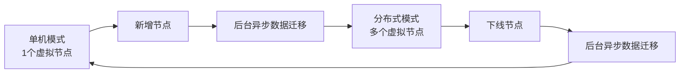

# NexKV 项目指南

> 基于 Lealone 架构的轻量化分布式 KV 存储系统

## 项目概述

NexKV 是一个采用**三层架构**设计的分布式数据库系统，实现了**单机-分布式一体**的部署模式。项目核心目标是提供轻量化、无中心化的分布式存储解决方案，适配中小规模集群（3-50节点）场景。

### 核心特性

- **单机-分布式一体**：一套架构同时支持单机和分布式部署，运行时无缝切换
- **分层一致性**：关键变更强一致（Quorum），普通变更最终一致（Gossip）
- **分片自治**：每个分片独立管理副本、事务与故障恢复
- **无中心化**：避免单点故障，所有节点地位平等
- **轻量化部署**：无外部依赖（ZooKeeper/Etcd），元数据本地存储

---

## 三层架构设计

### Layer 1: 元数据一致性层（基础层）

**核心价值**：元数据层是整个分布式数据库的"大脑"和"导航系统"

#### 核心组件

```
元数据存储层（持久化）
├── MVStore：内存缓存 + 磁盘持久化 + MVCC 支持
└── 存储内容：分片元数据、节点元数据、版本向量

元数据同步层（一致性）
├── Gossip 协议：最终一致性、周期性扩散、随机选点
└── Quorum 机制：强一致性、多数派确认、关键变更专用

元数据接口层（对外服务）
├── CRUD 接口：CreateMetadata、UpdateMetadata、DeleteMetadata、QueryMetadata
└── 版本管理：版本号递增、变更日志缓存、增量同步、冲突检测
```

#### 关键设计原则

| 原则 | 说明 | 实现方式 |
|------|------|---------|
| **本地化优先** | 元数据优先存储在本地，减少网络依赖 | MVStore 嵌入式存储 |
| **分层一致性** | 关键变更强一致，普通变更最终一致 | Quorum + Gossip 分层处理 |
| **增量优先** | 减少网络传输，优先传递变更部分 | 变更日志 + 版本号 |
| **故障隔离** | 单节点故障不影响其他节点 | MVStore 本地持久化 |

#### 变更类型分类

| 变更类型 | 示例 | 一致性要求 | 同步机制 | 阻塞业务 |
|---------|------|-----------|---------|---------|
| **关键变更** | 分片创建、主副本切换、节点加入 | 强一致（多数派确认） | Quorum（阻塞等待） | 是 |
| **普通变更** | 节点状态更新、负载信息刷新 | 最终一致（10s内扩散） | Gossip（异步扩散） | 否 |

#### 实现注意点

```go
// MVStore 核心接口
type MVStore interface {
    Put(key string, value []byte) error
    Get(key string) ([]byte, error)
    Delete(key string) error
    GetVersion(key string, version uint64) ([]byte, error)
    Flush() error
    Close() error
}

// 版本号管理（使用 atomic 优化性能）
type AtomicVersionManager struct {
    version uint64
}

func (v *AtomicVersionManager) NextVersion() uint64 {
    return atomic.AddUint64(&v.version, 1)
}

// Gossip 协议关键参数
const (
    GossipInterval = 10 * time.Second  // 同步间隔
    RandomPeerCount = 2                // 每轮随机选点数
)

// Quorum 机制关键参数
const (
    QuorumTimeout = 30 * time.Second   // 超时时间
    QuorumThreshold = N/2 + 1          // 多数派阈值
)
```

---

### Layer 2: 副本数据一致性层（数据层）

**核心价值**：单机-分布式一体的实现基础

#### 核心机制

**分片自治**
- 每个分片对应一个独立的 MVStore 实例
- 分片数据、索引、WAL 日志完全隔离
- 分片事务复用 MVStore 的 MVCC 能力

**副本分布**
- 副本跨节点强制分布（避免单节点故障）
- 主副本处理读写请求，从副本同步 WAL 日志
- 副本信息通过 Gossip 协议同步

**一致性模型**
- **默认模式**：最终一致性（异步复制）
- **可选模式**：强一致性（Quorum 同步复制）

#### 单机-分布式切换



**切换机制**
1. **单机→分布式**：新增节点 → 哈希环添加虚拟节点 → 后台异步迁移数据
2. **分布式→单机**：下线节点 → 哈希环移除虚拟节点 → 后台异步迁移数据

**迁移过程保障**
- 版本向量避免数据覆盖
- 双写机制保证数据不丢失
- 读修复自动同步最新数据

---

### Layer 3: 分布式事务一致性层（事务层）

**核心价值**：无协调者简化版 2PC

#### 核心设计

**传统 2PC 的痛点**
- 依赖独立协调者（性能瓶颈 + 单点故障）
- Prepare 阶段阻塞，资源锁定
- 协调者故障导致事务状态不一致

**优化方案**
- **发起节点兼任协调者**：无需独立 TM
- **砍掉 Prepare 阶段**：直接预提交，无资源锁定
- **Gossip 同步事务状态**：异步扩散，最终一致
- **故障自动补偿**：基于状态查询的自愈机制

#### 协议流程

```
阶段1：预提交（Pre-Commit）
├── 发起节点拆分事务，发送 Pre-Commit 指令
├── 所有参与节点执行子事务，写入 WAL 日志
├── 标记事务状态为「预提交」
└── 立即释放资源，向发起节点返回成功

阶段2：异步确认 + Gossip 状态同步
├── 发起节点收到所有响应，标记事务为「已提交」
├── 发起 Gossip 协议，向参与节点扩散状态
├── 参与节点接收状态，更新本地事务状态
└── 发起节点向客户端返回「事务成功」

阶段3：故障补偿
├── 故障节点重启，读取本地事务状态表
├── 通过 Gossip 查询事务最新状态
├── 回放 WAL 日志，确认事务执行情况
└── 更新本地事务状态，完成自愈
```

#### 适用场景

✅ **适用**
- 跨分片事务的最终一致性场景
- 单机-分布式一体部署
- 高吞吐、低延迟的 KV 存储

❌ **不适用**
- 需要强一致性的金融事务
- 超大规模集群（>100 节点）
- 跨数据中心部署

---

## 开发指南

### 环境准备

**必需依赖**
```bash
# Go 语言环境（推荐 1.21+）
go version

# 项目依赖
go mod download
```

**配置文件**
```yaml
# config.yaml
cluster:
  name: "nexkv-cluster"
  node:
    id: "node-1"
    addr: "127.0.0.1:9211"

metadata:
  dir: "./data/metadata"
  gossip_interval: "10s"
  quorum_timeout: "30s"

storage:
  data_dir: "./data/shards"
  wal_dir: "./data/wal"
```

### 核心模块实现

#### 1. 元数据存储（MVStore）

```go
// 实现 MVStore 接口
type NexKVMVStore struct {
    memTable    *sync.Map
    diskFile    *os.File
    mu          sync.RWMutex
    flushCh     chan struct{}
    doneCh      chan struct{}
}

// 关键：后台定期刷盘
func (m *NexKVMVStore) Start() {
    go m.flushLoop()
}

func (m *NexKVMVStore) flushLoop() {
    ticker := time.NewTicker(5 * time.Second)
    defer ticker.Stop()

    for {
        select {
        case <-ticker.C:
            m.flushToDisk()
        case <-m.doneCh:
            return
        }
    }
}
```

#### 2. Gossip 协议实现

```go
type GossipService struct {
    interval     time.Duration
    nodeList     []string
    selector     NodeSelector
    metaStore    MetadataStore
    transport    Transport
}

// 关键：双向同步
func (g *GossipService) syncToNode(addr string) error {
    localVersion, _ := g.metaStore.GetVersion()
    remoteVersion, err := g.transport.GetVersion(addr)

    // 本地更新，发送变更日志
    if localVersion > remoteVersion {
        logs := g.metaStore.GetChangeLogs(remoteVersion)
        return g.transport.SendChangeLogs(addr, logs)
    }

    // 对方更新，请求变更日志
    if remoteVersion > localVersion {
        logs, err := g.transport.GetChangeLogs(addr, localVersion)
        if err != nil {
            return err
        }
        return g.metaStore.ApplyChangeLogs(logs)
    }

    return nil
}
```

#### 3. Quorum 机制实现

```go
type QuorumService struct {
    threshold int
    timeout   time.Duration
    transport Transport
    metaStore MetadataStore
}

// 关键：并行发送 + 超时回滚
func (q *QuorumService) PropagateMetadataChange(
    changeLog *MetadataChangeLog,
    nodes []string,
) error {
    // 1. 本地持久化
    if err := q.metaStore.ApplyChangeLog(changeLog); err != nil {
        return err
    }

    // 2. 并行发送到所有节点
    results := make(chan result, len(nodes))
    for _, node := range nodes {
        go func(addr string) {
            err := q.transport.SendChangeLog(addr, changeLog)
            results <- result{addr, err}
        }(node)
    }

    // 3. 等待多数派确认
    successCount := 1 // 自身已成功
    timeoutCh := time.After(q.timeout)

    for i := 0; i < len(nodes); i++ {
        select {
        case res := <-results:
            if res.err == nil {
                successCount++
                if successCount >= q.threshold {
                    return nil // 达到多数派
                }
            }
        case <-timeoutCh:
            if successCount >= q.threshold {
                return nil
            }
            // 未达标，回滚
            q.metaStore.RollbackChange(changeLog.Version)
            return fmt.Errorf("quorum timeout")
        }
    }

    return nil
}
```

### 测试与验证

参考文档：`.docs/LealoneL1元数据一致性--验证计划.md`

#### 验证方法

1. **形式化描述**：定义系统模型、一致性性质、关键不变式
2. **TLA+ 模型检查**：验证 Gossip 协议和 Quorum 机制的正确性
3. **测试用例系统**：45 个测试用例（聚焦 3-10 节点）

#### 核心测试用例

| 用例ID | 测试场景 | 验证目标 |
|-------|---------|---------|
| TC_001 | 单一分片创建（Quorum 提交成功） | 验证多数派确认机制 |
| TC_002 | 单一分片创建（Quorum 超时回滚） | 验证超时回滚机制 |
| TC_010 | 并发分片创建冲突解决 | 验证版本冲突检测 |
| TC_025 | 网络分区场景（脑裂预防） | 验证 Quorum 防脑裂 |
| TC_030 | 10 节点集群 Gossip 扩散效率 | 验证 Gossip 收敛性 |
| TC_035 | 节点故障恢复增量同步 | 验证故障自愈机制 |

---

## 项目规范

### 代码风格

- **语言**：中文注释，代码标识符使用英文
- **命名**：遵循 Go 语言命名规范
- **错误处理**：显式处理所有错误，不忽略
- **并发安全**：使用 `sync.RWMutex` 保护共享数据
- **资源管理**：使用 `defer` 确保资源释放

### 架构原则

**KISS（简单至上）**
- 优先选择最直观的解决方案
- 拒绝不必要的复杂性

**YAGNI（精益求精）**
- 仅实现当前明确所需的功能
- 抵制过度设计和未来特性预留

**DRY（杜绝重复）**
- 自动识别重复代码模式
- 主动建议抽象和复用

**SOLID 原则**
- **S**：确保单一职责
- **O**：设计可扩展接口
- **L**：保证子类型可替换
- **I**：接口专一
- **D**：依赖抽象而非具体实现

### Git 工作流

- **分支策略**：main（主分支） + feature/*（功能分支）
- **提交规范**：
  ```
  <type>(<scope>): <subject>

  type: feat | fix | docs | style | refactor | test | chore
  scope: 模块名称
  subject: 简短描述（不超过 50 字符）
  ```
- **提交前检查**：
  - 运行 `go test ./...` 确保测试通过
  - 运行 `go fmt ./...` 格式化代码
  - 运行 `go vet ./...` 静态检查

---

## 常见问题

### Q1: 如何选择一致性模式？

**关键变更**（如分片创建、主副本切换）：
- 必须使用 Quorum 机制
- 等待多数派确认
- 阻塞业务操作

**普通变更**（如节点状态更新）：
- 使用 Gossip 协议
- 异步扩散，不阻塞
- 10 秒内最终一致

### Q2: 如何从单机平滑升级到分布式？

1. **新增节点**：启动新节点，配置相同的集群名称
2. **触发迁移**：Layer 1 自动生成分片迁移计划
3. **后台迁移**：数据异步迁移，业务无感知
4. **完成切换**：迁移完成后，自动启用分布式模式

**注意事项**：
- 迁移期间存在性能开销（双写）
- 确保网络带宽充足
- 监控迁移进度

### Q3: 元数据不一致如何排查？

**检查清单**：
- [ ] Gossip 协议是否正常工作（检查同步日志）
- [ ] 节点间网络是否互通（ping 测试）
- [ ] Quorum 阈值是否达标（检查在线节点数）
- [ ] 版本号是否单调递增（检查版本向量）

**修复方法**：
1. 重启问题节点，触发增量同步
2. 手动触发 Gossip 同步
3. 必要时回滚到上一个快照

---

## 参考文档

### 核心架构文档

- `.docs/LealoneL1元数据一致性--0.Overview-元数据层总览.md`
- `.docs/LealoneL2副本数据一致性--0.单机分布式一体.md`
- `.docs/LealoneL3分布式事务一致性--1.无协调者简化版2PC.md`

### 验证计划

- `.docs/LealoneL1元数据一致性--验证计划.md`

### 技术细节

- `.docs/Lealone分布式核心架构解析.md`
- `.docs/Lealone-distributed模块深度源码解析.md`
- `.docs/Lealone-sql模块深度源码解析.md`
- `.docs/Lealone-storage模块深度解析.md`

---

## 贡献指南

### 提交代码

1. **Fork 项目**：创建个人分支
2. **开发功能**：基于 `main` 分支创建 `feature/*` 分支
3. **编写测试**：为核心功能编写单元测试
4. **提交 PR**：包含清晰的描述和测试结果

### 报告问题

在 GitHub Issues 中报告问题时，请提供：
- 环境信息（OS、Go 版本）
- 复现步骤
- 错误日志
- 预期行为 vs 实际行为

---

## 许可证

本项目基于 AGPL-3.0 许可证开源。详见 [LICENSE](LICENSE) 文件。

---

**文档版本**：v1.0
**最后更新**：2026-01-14
**维护者**：NexKV 开发团队
