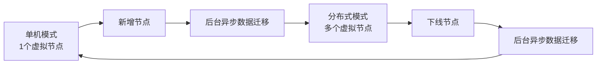
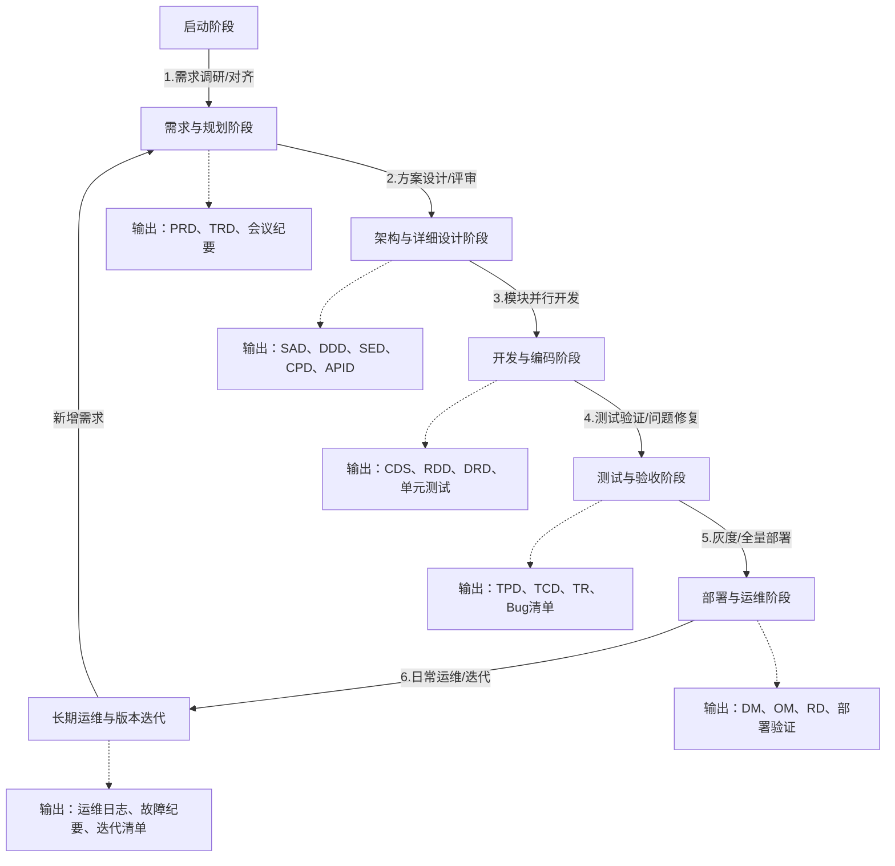
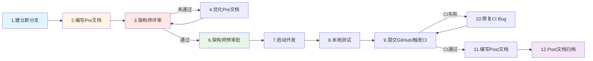
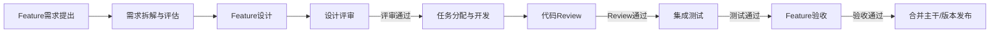
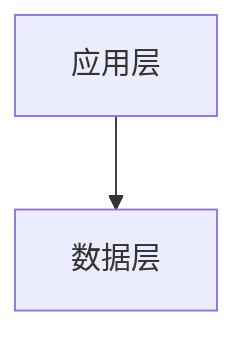
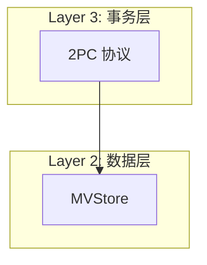

# NexKV 项目指南

> 基于 Lealone 架构的轻量化分布式 KV 存储系统

## 项目概述

NexKV 是一个采用**三层架构**设计的分布式数据库系统，实现了**单机-分布式一体**的部署模式。项目核心目标是提供轻量化、无中心化的分布式存储解决方案，适配中小规模集群（3-50节点）场景。

### 核心特性

- **单机-分布式一体**：一套架构同时支持单机和分布式部署，运行时无缝切换
- **分层一致性**：关键变更强一致（Quorum），普通变更最终一致（Gossip）
- **分片自治**：每个分片独立管理副本、事务与故障恢复
- **无中心化**：避免单点故障，所有节点地位平等
- **轻量化部署**：无外部依赖（ZooKeeper/Etcd），元数据本地存储

---

## AI 团队配置

> **🎯 团队模式**：本项目采用**人机协作模式**。👤 **架构师**为真实人员，负责技术决策和最终评审；🤖 其他角色由 AI Agent 充当，通过 Claude Skills 提供专业支持。

### 角色与技能映射

> **✅ 当前状态**：所有技能已安装在 `~/.claude/skills/claude-skills/` 目录

#### 🤖 项目经理（统筹指挥）
- **主要技能**：Senior PM
- **技能路径**：`~/.claude/skills/claude-skills/project-management/packaged-skills/senior-pm.zip`
- **辅助技能**：Scrum Master
- **核心职责**：
  - **🎯 统筹指挥**：指挥协调其他 AI Agents（产品经理、架构师、开发、测试、DevOps）
  - **📋 战略规划**：制定产品路线图、项目组合管理、与业务目标对齐
  - **👥 利益相关者管理**：向管理层汇报、跨部门协调、期望管理
  - **⚠️ 风险与预算管理**：风险识别与缓解、预算规划、ROI 分析
  - **🔄 资源协调**：跨职能团队协调、冲突解决、资源分配
- **核心功能**：
  - 项目组合管理和多项目协调
  - 高管级沟通和汇报
  - 跨职能团队领导力
  - 决策框架和升级协议
- **使用方式**：项目规划、资源协调、进度跟踪、风险管控时自动激活
- **技能来源**：[alirezarezvani/claude-skills](https://github.com/alirezarezvani/claude-skills)

#### 🤖 产品经理
- **主要技能**：Product Manager Toolkit
- **技能路径**：`~/.claude/skills/claude-skills/product-team/product-manager-toolkit/SKILL.md`
- **负责文档**：01_产品需求文档.md、03_需求评审纪要.md、04_项目计划.md
- **核心功能**：
  - RICE 优先级排序（RICE Prioritizer）
  - 客户访谈分析（Customer Interview Analyzer）
  - PRD 模板（4种格式）
  - 发现框架（客户访谈指南、假设模板）
- **使用方式**：需求讨论、产品规划时自动读取技能文档
- **技能来源**：[alirezarezvani/claude-skills](https://github.com/alirezarezvani/claude-skills)

#### 👤 架构师（真实人员）
- **辅助参考**：CTO Advisor、Senior Architect
- **技能路径**：
  - `~/.claude/skills/claude-skills/c-level-advisor/cto-advisor/SKILL.md`
  - `~/.claude/skills/claude-skills/engineering-team/senior-architect/SKILL.md`
- **负责文档**：01_系统架构设计.md、01_一致性协议设计.md、05_API接口设计.md、01_详细设计文档.md
- **核心职责**：
  - 技术架构设计、关键技术决策
  - 代码 Review、AI Agent 指导
  - 三层架构设计决策
- **辅助技能功能**：
  - **CTO Advisor**：技术债务分析、团队规模计算、工程指标框架
  - **Senior Architect**：架构图生成、依赖分析、系统设计工作流
- **工作模式**：真人主导，AI 提供建议和参考

#### 🤖 核心开发工程师 A（存储/一致性）
- **主要技能**：Senior Backend
- **技能路径**：`~/.claude/skills/claude-skills/engineering-team/senior-backend/SKILL.md`
- **辅助技能**：TDD Guide (`~/.claude/skills/claude-skills/engineering-team/tdd-guide/SKILL.md`)
- **负责模块**：MVStore、WAL、Gossip、Quorum、2PC
- **核心功能**：
  - 后端架构设计
  - API 设计与实现
  - 测试驱动开发
- **技术栈**：Go 1.21+、sync.Map、WAL、MessagePack
- **使用方式**：编码任务、协议实现时读取技能文档

#### 🤖 核心开发工程师 B（网络/集群）
- **主要技能**：Senior Backend
- **技能路径**：`~/.claude/skills/claude-skills/engineering-team/senior-backend/SKILL.md`
- **辅助技能**：Code Reviewer
- **负责模块**：TCP Transport、消息编解码、节点管理、故障自愈
- **核心功能**：
  - 网络编程
  - 分布式系统设计
  - 代码质量审查
- **技术栈**：Go 1.21+、TCP、自定义帧格式、序列化
- **使用方式**：网络层开发、集群功能实现时读取技能文档

#### 🤖 测试工程师
- **主要技能**：Senior QA、TDD Guide
- **技能路径**：
  - `~/.claude/skills/claude-skills/engineering-team/senior-qa/SKILL.md`
  - `~/.claude/skills/claude-skills/engineering-team/tdd-guide/SKILL.md`
- **负责文档**：01_测试计划文档.md、02_测试用例文档.md、03_测试报告.md、04_Bug清单.md
- **核心功能**：
  - 测试策略制定
  - 测试用例设计
  - 测试覆盖率分析
  - TDD 实践指导
- **测试目标**：单元测试覆盖率 > 80%、45 个集成测试用例
- **使用方式**：测试计划编写、测试用例设计时读取技能文档

#### 🤖 DevOps 工程师
- **主要技能**：Senior DevOps
- **技能路径**：`~/.claude/skills/claude-skills/engineering-team/senior-devops/SKILL.md`
- **负责文档**：01_部署手册.md、02_运维手册.md、03_版本发布文档.md、04_部署验证.md
- **核心功能**：
  - CI/CD 流水线设计
  - 容器化部署
  - 监控告警配置
  - 基础设施即代码
- **技术栈**：GitHub Actions、Docker、Kubernetes、监控告警
- **使用方式**：部署配置、CI/CD 流水线设计时读取技能文档

---

### 技能使用方式

#### 当前安装状态

所有 NexKV 所需技能已安装在 `~/.claude/skills/claude-skills/`：

```
claude-skills/
├── project-management/
│   └── packaged-skills/senior-pm.zip         ✅
├── product-team/
│   └── product-manager-toolkit/SKILL.md      ✅
├── c-level-advisor/
│   └── cto-advisor/SKILL.md                   ✅
└── engineering-team/
    ├── senior-architect/SKILL.md              ✅
    ├── senior-backend/SKILL.md                ✅
    ├── senior-qa/SKILL.md                     ✅
    ├── senior-devops/SKILL.md                 ✅
    └── tdd-guide/SKILL.md                     ✅
```

#### 工作模式

**自动模式**：根据任务类型，我会自动读取对应的 SKILL.md 文件并应用相关知识

| 任务类型 | 读取技能文档 |
|---------|-------------|
| **项目规划、资源协调、进度跟踪、风险管控** | `senior-pm.zip`（统筹指挥其他 agents） |
| 需求讨论、产品规划 | `product-manager-toolkit/SKILL.md` |
| 架构设计、技术决策 | `senior-architect/SKILL.md` + `cto-advisor/SKILL.md` |
| 后端开发、API 设计 | `senior-backend/SKILL.md` |
| 测试计划、TDD 实践 | `senior-qa/SKILL.md` + `tdd-guide/SKILL.md` |
| CI/CD、部署运维 | `senior-devops/SKILL.md` |

**手动模式**：您也可以明确要求使用特定技能

```
# 示例请求
"请使用 senior-architect 技能，帮我设计三层架构"
"请使用 tdd-guide 技能，为 MVStore 接口生成测试用例"
```

---

### 人机协作开发流程

#### 阶段 0: 项目统筹（🤖 项目经理指挥）
1. **🤖 项目经理**（AI + Senior PM）：
   - **🎯 统筹指挥**：指挥协调所有其他 AI Agents
   - 制定产品路线图和项目计划
   - 资源分配和进度跟踪
   - 风险识别和缓解措施
   - 向管理层汇报项目状态

#### 阶段 1: 需求与规划
1. **👤 架构师**（真人）：明确项目目标和技术方向
2. **🤖 项目经理**（AI + Senior PM）：
   - **指挥协调**：协调产品经理和架构师的工作
   - 制定项目组合和时间计划
   - 识别项目风险和依赖关系
3. **🤖 产品经理**（AI + Product Manager Toolkit）：
   - 撰写 PRD（产品需求文档）
   - 组织需求评审
   - RICE 优先级排序

#### 阶段 2: 架构与设计
1. **👤 架构师**（真人）：技术决策、架构评审
2. **🤖 项目经理**（AI + Senior PM）：
   - **指挥协调**：协调架构师和开发团队
   - 确保设计与资源匹配
   - 跟踪设计进度
3. **🤖 架构助手**（AI + Senior Architect + CTO Advisor）：
   - 提供架构建议
   - 评审设计方案
   - 识别技术风险
   - 生成架构图（C4、序列图、组件图）

#### 阶段 3: 开发与编码
1. **🤖 项目经理**（AI + Senior PM）：
   - **指挥协调**：分配开发任务，跟踪进度
   - 协调核心开发 A 和 B 的工作
   - 处理开发过程中的阻塞问题
2. **🤖 核心开发 A**（AI + Senior Backend + TDD）：
   - 实现 MVStore、WAL
   - 实现 Gossip、Quorum、2PC
   - 单元测试覆盖率 > 80%
3. **🤖 核心开发 B**（AI + Senior Backend + Code Reviewer）：
   - 实现 TCP Transport
   - 实现节点管理、故障自愈
   - 代码质量分析和安全扫描

#### 阶段 4: 测试与验收
1. **🤖 项目经理**（AI + Senior PM）：
   - **指挥协调**：协调测试和开发团队
   - 跟踪缺陷修复进度
   - 确保验收标准达成
2. **🤖 测试工程师**（AI + Senior QA + TDD）：
   - 编写测试计划（TPD）
   - 设计测试用例（TCD）
   - 执行集成测试（45 个用例）
   - 生成测试报告（TR）

#### 阶段 5: 部署与运维
1. **🤖 项目经理**（AI + Senior PM）：
   - **指挥协调**：协调 DevOps 和各团队
   - 制定发布计划
   - 向管理层汇报发布状态
2. **🤖 DevOps 工程师**（AI + Senior DevOps）：
   - 编写部署手册（DM）
   - 配置 CI/CD 流水线（GitHub Actions）
   - 设置监控告警
   - 生成版本发布文档（RD）

---

### 技能能力概览

#### Senior PM（项目经理 - 统筹指挥）
- **战略规划**：产品路线图、项目组合管理、业务目标对齐
- **利益相关者管理**：高管级沟通、跨部门协调、期望管理
- **风险与预算管理**：风险识别与缓解、预算规划、ROI 分析
- **团队领导力**：跨职能团队协调、资源分配、冲突解决
- **项目组合管理**：多项目协调、优先级排序、依赖管理
- **决策框架**：升级协议、手off 协议、决策标准

#### Product Manager Toolkit
- **RICE Prioritizer**：自动功能优先级排序和组合分析
- **Customer Interview Analyzer**：AI 驱动的用户访谈洞察提取
- **PRD Templates**：4 种综合格式
- **Discovery Frameworks**：客户访谈指南、假设模板、机会解决方案树

#### Senior Architect
- **Architecture Diagram Generator**：创建 C4、序列图和组件图
- **Project Architect**：搭建架构文档和 ADR
- **Dependency Analyzer**：分析和可视化依赖关系
- **Architecture Patterns**：单体、微服务、无服务器、事件驱动模式

#### Senior Backend
- **API Design Patterns**：RESTful、GraphQL、微服务架构
- **Database Best Practices**：查询优化、索引、连接池
- **Backend Security**：认证、授权、数据验证
- **Performance Optimization**：缓存策略、负载均衡

#### Senior QA
- **Test Strategy**：测试金字塔、TDD、BDD 方法论
- **Test Suite Generator**：创建单元、集成、E2E 测试
- **Coverage Analysis**：分析和报告测试覆盖率
- **Quality Assurance**：测试计划、测试用例设计

#### Senior DevOps
- **CI/CD Pipeline**：GitHub Actions/CircleCI 流水线
- **Infrastructure as Code**：Terraform、Docker、Kubernetes
- **Deployment Automation**：自动化部署工作流
- **Monitoring & Alerting**：Prometheus、Grafana、日志聚合

#### TDD Guide
- **Test Generation**：将需求、用户故事、API 规范转换为可执行测试
- **Coverage Analysis**：解析 LCOV、JSON、XML 覆盖率报告
- **Framework Support**：Go testing、testify、gomega
- **Quality Review**：测试隔离、断言、命名约定、复杂性分析

---

## 三层架构设计

### Layer 1: 元数据一致性层（基础层）

**核心价值**：元数据层是整个分布式数据库的"大脑"和"导航系统"

#### 核心组件

```
元数据存储层（持久化）
├── MVStore：内存缓存 + 磁盘持久化 + MVCC 支持
└── 存储内容：分片元数据、节点元数据、版本向量

元数据同步层（一致性）
├── Gossip 协议：最终一致性、周期性扩散、随机选点
└── Quorum 机制：强一致性、多数派确认、关键变更专用

元数据接口层（对外服务）
├── CRUD 接口：CreateMetadata、UpdateMetadata、DeleteMetadata、QueryMetadata
└── 版本管理：版本号递增、变更日志缓存、增量同步、冲突检测
```

#### 关键设计原则

| 原则 | 说明 | 实现方式 |
|------|------|---------|
| **本地化优先** | 元数据优先存储在本地，减少网络依赖 | MVStore 嵌入式存储 |
| **分层一致性** | 关键变更强一致，普通变更最终一致 | Quorum + Gossip 分层处理 |
| **增量优先** | 减少网络传输，优先传递变更部分 | 变更日志 + 版本号 |
| **故障隔离** | 单节点故障不影响其他节点 | MVStore 本地持久化 |

#### 变更类型分类

| 变更类型 | 示例 | 一致性要求 | 同步机制 | 阻塞业务 |
|---------|------|-----------|---------|---------|
| **关键变更** | 分片创建、主副本切换、节点加入 | 强一致（多数派确认） | Quorum（阻塞等待） | 是 |
| **普通变更** | 节点状态更新、负载信息刷新 | 最终一致（10s内扩散） | Gossip（异步扩散） | 否 |

#### 实现注意点

```go
// MVStore 核心接口
type MVStore interface {
    Put(key string, value []byte) error
    Get(key string) ([]byte, error)
    Delete(key string) error
    GetVersion(key string, version uint64) ([]byte, error)
    Flush() error
    Close() error
}

// 版本号管理（使用 atomic 优化性能）
type AtomicVersionManager struct {
    version uint64
}

func (v *AtomicVersionManager) NextVersion() uint64 {
    return atomic.AddUint64(&v.version, 1)
}

// Gossip 协议关键参数
const (
    GossipInterval = 10 * time.Second  // 同步间隔
    RandomPeerCount = 2                // 每轮随机选点数
)

// Quorum 机制关键参数
const (
    QuorumTimeout = 30 * time.Second   // 超时时间
    QuorumThreshold = N/2 + 1          // 多数派阈值
)
```

---

### Layer 2: 副本数据一致性层（数据层）

**核心价值**：单机-分布式一体的实现基础

#### 核心机制

**分片自治**
- 每个分片对应一个独立的 MVStore 实例
- 分片数据、索引、WAL 日志完全隔离
- 分片事务复用 MVStore 的 MVCC 能力

**副本分布**
- 副本跨节点强制分布（避免单节点故障）
- 主副本处理读写请求，从副本同步 WAL 日志
- 副本信息通过 Gossip 协议同步

**一致性模型**
- **默认模式**：最终一致性（异步复制）
- **可选模式**：强一致性（Quorum 同步复制）

#### 单机-分布式切换



**切换机制**
1. **单机→分布式**：新增节点 → 哈希环添加虚拟节点 → 后台异步迁移数据
2. **分布式→单机**：下线节点 → 哈希环移除虚拟节点 → 后台异步迁移数据

**迁移过程保障**
- 版本向量避免数据覆盖
- 双写机制保证数据不丢失
- 读修复自动同步最新数据

---

### Layer 3: 分布式事务一致性层（事务层）

**核心价值**：无协调者简化版 2PC

#### 核心设计

**传统 2PC 的痛点**
- 依赖独立协调者（性能瓶颈 + 单点故障）
- Prepare 阶段阻塞，资源锁定
- 协调者故障导致事务状态不一致

**优化方案**
- **发起节点兼任协调者**：无需独立 TM
- **砍掉 Prepare 阶段**：直接预提交，无资源锁定
- **Gossip 同步事务状态**：异步扩散，最终一致
- **故障自动补偿**：基于状态查询的自愈机制

#### 协议流程

```
阶段1：预提交（Pre-Commit）
├── 发起节点拆分事务，发送 Pre-Commit 指令
├── 所有参与节点执行子事务，写入 WAL 日志
├── 标记事务状态为「预提交」
└── 立即释放资源，向发起节点返回成功

阶段2：异步确认 + Gossip 状态同步
├── 发起节点收到所有响应，标记事务为「已提交」
├── 发起 Gossip 协议，向参与节点扩散状态
├── 参与节点接收状态，更新本地事务状态
└── 发起节点向客户端返回「事务成功」

阶段3：故障补偿
├── 故障节点重启，读取本地事务状态表
├── 通过 Gossip 查询事务最新状态
├── 回放 WAL 日志，确认事务执行情况
└── 更新本地事务状态，完成自愈
```

#### 适用场景

✅ **适用**
- 跨分片事务的最终一致性场景
- 单机-分布式一体部署
- 高吞吐、低延迟的 KV 存储

❌ **不适用**
- 需要强一致性的金融事务
- 超大规模集群（>100 节点）
- 跨数据中心部署

---

## 开发流程与文档规范

> **重要说明**：NexKV 采用规范化的开发流程，所有文档存储在 `docs/` 目录中，与代码同步提交 Git，确保文档与实现始终保持一致。

### 开发全流程概览



### PR 全流程（12步闭环）

> **核心原则**：每个 PR（Pull Request）对应一个完整的开发闭环，包含前置规划文档和后置总结文档，确保从需求到交付的可追溯性。



**PR 全流程 12 步详解**：

| 步骤 | 名称 | 负责角色 | 交付物 | 关键产出 |
|------|------|---------|--------|---------|
| **1** | 建立新分支 | 🤖 核心开发 | Feature 分支 | 分支命名：`feature/XXX-功能描述` |
| **2** | 编写 Pre 文档 | 🤖 核心开发 + AI | Pre 文档 | 需求、设计、风险评估 |
| **3** | 架构师评审 | 👤 架构师 | 评审意见 | 技术可行性、架构合理性 |
| **4** | 优化 Pre 文档 | 🤖 核心开发 + AI | 优化后文档 | 修复评审问题，AI 辅助优化 |
| **5** | 循环评审 | 👤 架构师 + 🤖 项目经理 | 评审通过记录 | 多轮评审直至通过 |
| **6** | 架构师预审批 | 👤 架构师 | 预审批确认 | 同意启动开发 |
| **7** | 启动开发 | 🤖 核心开发 | 代码实现 | 按 Pre 文档落地 |
| **8** | 本地测试 | 🤖 测试工程师 | 测试报告 | 单元测试、集成测试 |
| **9** | 提交 GitHub/CI | 🤖 DevOps + 核心开发 | PR 提交 | 触发 CI 流水线 |
| **10** | 修复 CI Bug | 🤖 核心开发 | 修复记录 | 循环修复直至 CI 通过 |
| **11** | 编写 Post 文档 | 🤖 核心开发 + AI | Post 文档 | 成果总结、未完成项、ToDo |
| **12** | Post 文档归档 | 🤖 项目经理 | 归档文档 | 与代码同步版本管理 |

**关键原则**：
1. **Pre 文档未通过评审前，禁止启动开发**（先明确再动手）
2. **AI 辅助优化**：Pre 文档优化阶段，AI 辅助梳理逻辑、生成示例代码/流程图、排查潜在风险
3. **CI 与文档联动**：CI 问题修复后，需同步记录至流程节点
4. **归档要求**：PR 合并后，全流程文档需补充完整，归档至对应目录

### 文档目录结构

所有开发文档统一存放在 `docs/` 目录下，按研发阶段分类：

```
docs/
├── 01_requirement_planning/       # 需求与规划阶段
│   ├── 01_产品需求文档.md
│   ├── 02_技术需求文档.md
│   ├── 03_需求评审纪要.md
│   └── 04_项目计划.md
├── 02_design/                     # 架构与详细设计阶段
│   ├── architecture/
│   │   ├── 01_系统架构设计.md
│   │   └── 02_数据结构设计.md
│   ├── modules/
│   │   ├── 01_详细设计文档.md
│   │   ├── 02_存储引擎设计.md
│   │   ├── 03_WAL崩溃恢复.md
│   │   ├── 04_故障恢复.md
│   │   ├── 05_混合逻辑时钟HLC.md
│   │   ├── 06_时钟漂移补偿.md
│   │   ├── 07_树形协调器拓扑同步.md
│   │   ├── 08_树形协调器自动发现与心跳.md
│   │   └── 09_网络分区处理.md
│   ├── protocols/
│   │   ├── 01_一致性协议设计.md
│   │   ├── 02_二阶段提交与Gossip状态同步.md
│   │   ├── 03_Gossip消息响应机制.md
│   │   └── 04_一致性级别切换.md
│   ├── 05_API接口设计.md
│   └── 06_设计评审纪要.md
├── 03_development/                # 开发与编码阶段
│   ├── 01_编码规范文档.md
│   ├── 02_运行时细节文档.md
│   ├── 03_第三方依赖文档.md
│   ├── unit_test_report/          # 单元测试报告
│   └── code_review_records.md
├── 04_test/                       # 测试与验收阶段
│   ├── 01_测试计划文档.md
│   ├── 02_测试用例文档.md
│   ├── 03_测试报告.md
│   ├── 04_Bug清单.md
│   ├── 05_验收报告.md
│   └── 06_TLA+验证计划与结果.md
├── 05_deployment_operation/       # 部署与运维阶段
│   ├── 01_部署手册.md
│   ├── 02_运维手册.md
│   ├── 03_版本发布文档.md
│   └── 04_部署验证.md
├── 06_project_management/         # 项目管理
│   ├── pr_documents/              # PR全流程文档（Pre+Post整合）
│   │   ├── templates/             # 统一模板目录
│   │   │   ├── feature_pr_full_template.md  # 新功能PR模板
│   │   │   ├── fix_pr_full_template.md      # Bug修复PR模板
│   │   │   └── doc_pr_full_template.md      # 纯文档PR模板
│   │   ├── feature/               # 新功能PR归档
│   │   │   └── YYYY-MM-DD_PR-XXX_工作主题_全流程.md
│   │   ├── fix/                   # Bug修复PR归档
│   │   │   └── YYYY-MM-DD_PR-XXX_工作主题_全流程.md
│   │   └── doc/                   # 纯文档PR归档
│   │       └── YYYY-MM-DD_PR-XXX_工作主题_全流程.md
│   ├── brainstorm/               # 头脑风暴与发现记录
│   │   └── {tag}_YYYY-MM-DD_{topic}.md
│   │       - **功能定位**：记录开发过程中的发现、问题、建议和待讨论事项
│   │       - **命名规范**：
│   │         - tag: 主题标识（metadata/messagepack/doc-review）
│   │         - YYYY-MM-DD: 创建日期
│   │         - topic: 简短描述（implementation-findings/serialization-proposal）
│   │       - **文档类型**：
│   │         - Findings（发现）：代码审查中发现的问题、实现差异
│   │         - Proposals（建议）：技术方案建议、架构改进提案
│   │         - Decisions（决策）：技术决策记录、方案选定理由
│   │       - **使用流程**：
│   │         代码审查发现 → 记录到 brainstorm → 团队讨论 → 形成决策
│   │         技术方案讨论 → 记录到 brainstorm → 评审通过 → 实施落地
│   │         文档与代码差异 → 记录到 brainstorm → 统一更新 → 避免混淆
│   ├── 01_项目初始化报告.md
│   ├── 02_团队分工清单.md
│   ├── 04_风险评估与缓解.md
│   └── meeting_minutes/
└── README.md                      # docs目录说明
```

### 文档类型说明

| 缩写 | 全称 | 说明 | 输出时机 |
|------|------|------|---------|
| **PRD** | Product Requirements Document | 产品需求文档 | 需求调研结束后3个工作日 |
| **TRD** | Technical Requirements Document | 技术需求文档 | PRD评审通过后5个工作日 |
| **SAD** | System Architecture Design | 系统架构设计文档 | 架构设计结束后3个工作日 |
| **DDD** | Detailed Design Document | 模块详细设计文档 | 模块设计完成后3个工作日 |
| **CPD** | Consistency Protocol Design | 一致性协议设计文档 | 协议设计完成后3个工作日 |
| **APID** | API Interface Design | API接口设计文档 | 接口定义完成后3个工作日 |
| **CDS** | Coding Standards Document | 编码规范文档 | 开发启动前1个工作日 |
| **RDD** | Runtime Details Document | 实时细节文档 | 核心流程开发完成后2个工作日 |
| **TPD** | Test Plan Document | 测试计划文档 | 测试启动前3个工作日 |
| **TCD** | Test Case Document | 测试用例文档 | 测试启动前3个工作日 |
| **TR** | Test Report | 测试报告文档 | 测试结束后2个工作日 |
| **DM** | Deployment Manual | 部署手册 | 部署启动前3个工作日 |
| **OM** | Operation Manual | 运维手册 | 部署启动前3个工作日 |
| **RD** | Release Document | 版本发布文档 | 版本发布前1个工作日 |

### Feature 开发流程

对于单个 Feature（如新增批量写入功能）的开发流程：



**各阶段说明**：

1. **Feature需求提出**（0.5-1天）：明确需求背景、目标、验收标准
2. **需求拆解与评估**（1天）：评估技术可行性、工时、影响范围
3. **Feature设计**（1-2天）：接口定义、流程设计、数据结构
4. **设计评审**（0.5天）：检查可行性、合理性、性能影响
5. **任务分配与开发**（2-5天）：编码、单元测试、代码注释
6. **代码Review**（0.5-1天）：代码质量、逻辑正确性检查
7. **集成测试**（1-2天）：功能验证、兼容性测试、性能测试
8. **Feature验收**（0.5天）：验收标准检查
9. **合并主干/发布**（0.5天）：代码合并、文档更新

### 文档管理原则

**关联性**：
- PRD → TRD → SAD → DDD → APID → 开发编码 → 测试用例
- 上游文档是下游文档的输入依据
- 修改上游文档需同步更新下游关联文档

**同步性**：
- 文档与代码同步提交、同步迭代
- 修改核心功能后需同步更新对应设计文档
- Git 提交时注明关联文档变更

**版本管理**：
- 文档版本变更无需修改文件名，通过 Git 提交记录追溯
- 核心文档首页注明版本号、修改人、修改日期
- 提交时备注版本变更内容

**责任人**：
- 核心文档（SAD、APID、RDD等）由指定责任人维护
- 业务/技术变更后需及时更新
- 确保文档与系统实现一致

### 详细开发流程

完整的开发流程定义请参考：`docs/workflow.md`

该文档包含：
- 总体开发全流程（6个阶段）的详细说明
- 单个Feature开发流程（9个步骤）
- 核心文档关联与代码目录存放规范
- 各阶段时间周期参考和文档输出时机

---

## 开发指南

### 环境准备

**必需依赖**
```bash
# Go 语言环境（推荐 1.21+）
go version

# 项目依赖
go mod download
```

**配置文件**
```yaml
# config.yaml
cluster:
  name: "nexkv-cluster"
  node:
    id: "node-1"
    addr: "127.0.0.1:9211"

metadata:
  dir: "./data/metadata"
  gossip_interval: "10s"
  quorum_timeout: "30s"

storage:
  data_dir: "./data/shards"
  wal_dir: "./data/wal"
```

### 核心模块实现

#### 1. 元数据存储（MVStore）

```go
// 实现 MVStore 接口
type NexKVMVStore struct {
    memTable    *sync.Map
    diskFile    *os.File
    mu          sync.RWMutex
    flushCh     chan struct{}
    doneCh      chan struct{}
}

// 关键：后台定期刷盘
func (m *NexKVMVStore) Start() {
    go m.flushLoop()
}

func (m *NexKVMVStore) flushLoop() {
    ticker := time.NewTicker(5 * time.Second)
    defer ticker.Stop()

    for {
        select {
        case <-ticker.C:
            m.flushToDisk()
        case <-m.doneCh:
            return
        }
    }
}
```

#### 2. Gossip 协议实现

```go
type GossipService struct {
    interval     time.Duration
    nodeList     []string
    selector     NodeSelector
    metaStore    MetadataStore
    transport    Transport
}

// 关键：双向同步
func (g *GossipService) syncToNode(addr string) error {
    localVersion, _ := g.metaStore.GetVersion()
    remoteVersion, err := g.transport.GetVersion(addr)

    // 本地更新，发送变更日志
    if localVersion > remoteVersion {
        logs := g.metaStore.GetChangeLogs(remoteVersion)
        return g.transport.SendChangeLogs(addr, logs)
    }

    // 对方更新，请求变更日志
    if remoteVersion > localVersion {
        logs, err := g.transport.GetChangeLogs(addr, localVersion)
        if err != nil {
            return err
        }
        return g.metaStore.ApplyChangeLogs(logs)
    }

    return nil
}
```

#### 3. Quorum 机制实现

```go
type QuorumService struct {
    threshold int
    timeout   time.Duration
    transport Transport
    metaStore MetadataStore
}

// 关键：并行发送 + 超时回滚
func (q *QuorumService) PropagateMetadataChange(
    changeLog *MetadataChangeLog,
    nodes []string,
) error {
    // 1. 本地持久化
    if err := q.metaStore.ApplyChangeLog(changeLog); err != nil {
        return err
    }

    // 2. 并行发送到所有节点
    results := make(chan result, len(nodes))
    for _, node := range nodes {
        go func(addr string) {
            err := q.transport.SendChangeLog(addr, changeLog)
            results <- result{addr, err}
        }(node)
    }

    // 3. 等待多数派确认
    successCount := 1 // 自身已成功
    timeoutCh := time.After(q.timeout)

    for i := 0; i < len(nodes); i++ {
        select {
        case res := <-results:
            if res.err == nil {
                successCount++
                if successCount >= q.threshold {
                    return nil // 达到多数派
                }
            }
        case <-timeoutCh:
            if successCount >= q.threshold {
                return nil
            }
            // 未达标，回滚
            q.metaStore.RollbackChange(changeLog.Version)
            return fmt.Errorf("quorum timeout")
        }
    }

    return nil
}
```

### 测试与验证

参考文档：`docs/04_test/06_TLA+验证计划与结果.md`

#### 验证方法

1. **形式化描述**：定义系统模型、一致性性质、关键不变式
2. **TLA+ 模型检查**：验证 Gossip 协议和 Quorum 机制的正确性
3. **测试用例系统**：45 个测试用例（聚焦 3-10 节点）

#### 核心测试用例

| 用例ID | 测试场景 | 验证目标 |
|-------|---------|---------|
| TC_001 | 单一分片创建（Quorum 提交成功） | 验证多数派确认机制 |
| TC_002 | 单一分片创建（Quorum 超时回滚） | 验证超时回滚机制 |
| TC_010 | 并发分片创建冲突解决 | 验证版本冲突检测 |
| TC_025 | 网络分区场景（脑裂预防） | 验证 Quorum 防脑裂 |
| TC_030 | 10 节点集群 Gossip 扩散效率 | 验证 Gossip 收敛性 |
| TC_035 | 节点故障恢复增量同步 | 验证故障自愈机制 |

---

## 项目规范

### 代码风格

- **语言**：中文注释，代码标识符使用英文
- **命名**：遵循 Go 语言命名规范
- **错误处理**：显式处理所有错误，不忽略
- **并发安全**：使用 `sync.RWMutex` 保护共享数据
- **资源管理**：使用 `defer` 确保资源释放

### 架构原则

**KISS（简单至上）**
- 优先选择最直观的解决方案
- 拒绝不必要的复杂性

**YAGNI（精益求精）**
- 仅实现当前明确所需的功能
- 抵制过度设计和未来特性预留

**DRY（杜绝重复）**
- 自动识别重复代码模式
- 主动建议抽象和复用

**SOLID 原则**
- **S**：确保单一职责
- **O**：设计可扩展接口
- **L**：保证子类型可替换
- **I**：接口专一
- **D**：依赖抽象而非具体实现

### 文档图表规范

**📊 核心原则：尽量用 Mermaid**

- **优先使用 Mermaid**：所有能用 Mermaid 表达的图表，必须使用 Mermaid
- **禁止 ASCII 线框图**：不使用 `+---+`、`│─┐└┘` 等字符绘制的线框图
- **不合适才用其他**：只有 Mermaid 真的不合适时，才考虑表格或其他格式

**Mermaid 图表类型选择**
| 图表用途 | Mermaid 类型 | 关键字 | 是否优先用 Mermaid |
|---------|-------------|--------|------------------|
| 流程/步骤 | 流程图 | `flowchart TD/LR` | ✅ 是 |
| 系统架构 | 架构图/子图 | `graph`、`subgraph` | ✅ 是 |
| 时序交互 | 时序图 | `sequenceDiagram` | ✅ 是 |
| 状态转换 | 状态图 | `stateDiagram` | ✅ 是 |
| 实体关系 | ER 图 | `erDiagram` | ✅ 是 |
| 类关系 | 类图 | `classDiagram` | ✅ 是 |
| 甘特图 | 进度规划 | `gantt` | ✅ 是 |
| 数据分层/分层架构 | 层级图 | `graph` + `subgraph` | ✅ 是 |
| 简单数据结构 | 表格 | Markdown 表格 | ❌ 否（表格更清晰） |
| 帧格式/字段列表 | 表格 | Markdown 表格 | ❌ 否（表格更清晰） |

**图表编写规范**
1. **清晰命名**：节点和边的命名要简洁明了，使用中文
2. **合理布局**：使用方向指示符（`TD`、`LR`）优化图表布局
3. **样式统一**：同类节点使用相同的样式和颜色
4. **注释说明**：复杂图表需要配文字说明
5. **测试渲染**：编写后验证 Mermaid 语法正确性

**示例对比**

❌ **错误（ASCII 线框图 - 严禁使用）**：
```
┌─────────────┐
│  应用层     │
└─────────────┘
     ↓
┌─────────────┐
│  数据层     │
└─────────────┘
```

✅ **正确（Mermaid 流程图 - 用于流程/架构）**：


✅ **正确（Mermaid 子图 - 用于分层架构）**：


❌ **不合适（表格 - 用于简单数据结构）**：
| 层级 | 名称 | 描述 |
|------|------|------|
| L3 | 事务层 | 2PC 协议 |

### Git 工作流

- **分支策略**：main（主分支） + feature/*（功能分支）
- **提交规范**：
  ```
  <type>(<scope>): <subject>

  type: feat | fix | docs | style | refactor | test | chore
  scope: 模块名称
  subject: 简短描述（不超过 50 字符）
  ```
- **提交前检查**：
  - 运行 `go test ./...` 确保测试通过
  - 运行 `go fmt ./...` 格式化代码
  - 运行 `go vet ./...` 静态检查

### Brainstorm 文档管理

**功能定位**：`docs/06_project_management/brainstorm/` 目录用于记录开发过程中的发现、问题、建议和待讨论事项，形成从发现问题 → 讨论方案 → 形成决策的完整闭环。

**命名规范**：`{tag}_YYYY-MM-DD_{topic}.md`
- `tag`：主题标识（如 `metadata`、`messagepack`、`doc-review`）
- `YYYY-MM-DD`：创建日期
- `topic`：简短描述（如 `implementation-findings`、`serialization-proposal`）

**文档类型**：
- **Findings（发现）**：代码审查中发现的问题、实现差异、待改进项
- **Proposals（建议）**：技术方案建议、架构改进提案、实施计划
- **Decisions（决策）**：技术决策记录、方案选定理由、权衡分析

**使用流程**：
```
1. 代码审查/技术讨论
   ↓
2. 记录到 brainstorm（Findings/Proposals）
   ↓
3. 团队评审讨论
   ↓
4. 形成决策（Decisions）
   ↓
5. 实施落地
   ↓
6. 关联或归档文档
```

**创建时机**：
- ✅ 代码审查发现文档与代码不一致
- ✅ 技术方案讨论需要记录详细信息
- ✅ 发现潜在问题或改进机会
- ✅ 需要记录技术决策和权衡分析
- ✅ PR 实施过程中的重要发现

**当前示例**：
- `metadata_2026-01-18_implementation-findings.md` - Metadata 镜像内容实现状态发现（60% 完成度）
- `messagepack_2026-01-18_metadata-serialization-proposal.md` - MessagePack 序列化方案建议

**注意事项**：
- 每个 brainstorm 文档应该清晰描述问题/建议
- 包含具体的代码位置引用（如 `file:line`）
- 提供可操作的建议或解决方案
- 标记文档状态（如 `📋 待讨论`、`💡 技术建议`、`✅ 已决策`）

---

## 常见问题

### Q1: 如何选择一致性模式？

**关键变更**（如分片创建、主副本切换）：
- 必须使用 Quorum 机制
- 等待多数派确认
- 阻塞业务操作

**普通变更**（如节点状态更新）：
- 使用 Gossip 协议
- 异步扩散，不阻塞
- 10 秒内最终一致

### Q2: 如何从单机平滑升级到分布式？

1. **新增节点**：启动新节点，配置相同的集群名称
2. **触发迁移**：Layer 1 自动生成分片迁移计划
3. **后台迁移**：数据异步迁移，业务无感知
4. **完成切换**：迁移完成后，自动启用分布式模式

**注意事项**：
- 迁移期间存在性能开销（双写）
- 确保网络带宽充足
- 监控迁移进度

### Q3: 元数据不一致如何排查？

**检查清单**：
- [ ] Gossip 协议是否正常工作（检查同步日志）
- [ ] 节点间网络是否互通（ping 测试）
- [ ] Quorum 阈值是否达标（检查在线节点数）
- [ ] 版本号是否单调递增（检查版本向量）

**修复方法**：
1. 重启问题节点，触发增量同步
2. 手动触发 Gossip 同步
3. 必要时回滚到上一个快照

---

## 参考文档

### 核心架构文档

- `docs/00_overview/core-architecture-concept.md` - 核心架构理念
- `docs/00_overview/standalone-distributed-unified.md` - 单机-分布式一体架构
- `docs/02_design/protocols/01_一致性协议设计.md` - 一致性协议设计文档

### 验证计划

- `docs/04_test/06_TLA+验证计划与结果.md` - TLA+ 验证计划与结果

### 技术细节

- `docs/03_development/` 目录下的开发文档
- `docs/02_design/` 目录下的设计文档

---

## 贡献指南

### 提交代码

1. **Fork 项目**：创建个人分支
2. **开发功能**：基于 `main` 分支创建 `feature/*` 分支
3. **编写测试**：为核心功能编写单元测试
4. **提交 PR**：包含清晰的描述和测试结果

### 报告问题

在 GitHub Issues 中报告问题时，请提供：
- 环境信息（OS、Go 版本）
- 复现步骤
- 错误日志
- 预期行为 vs 实际行为

---

## 许可证

本项目基于 AGPL-3.0 许可证开源。详见 [LICENSE](LICENSE) 文件。

---

**文档版本**：v1.0
**最后更新**：2026-01-14
**维护者**：NexKV 开发团队
