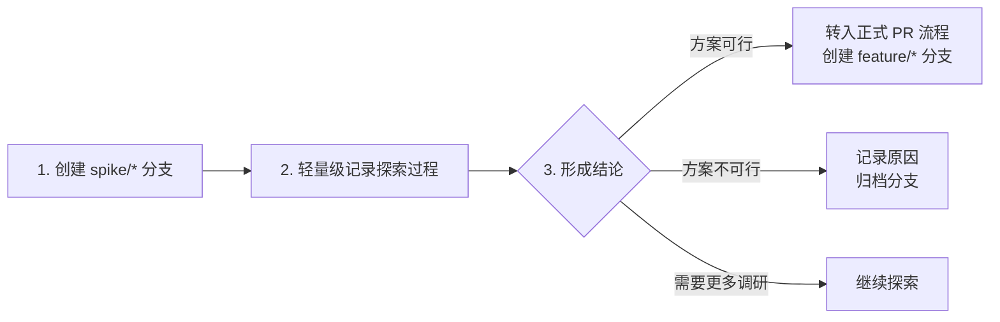

# NexKV 项目指南

> 基于 Lealone 架构的轻量化分布式 KV 存储系统

## 项目概述

NexKV 是一个采用**三层架构**设计的分布式数据库系统，实现了**单机-分布式一体**的部署模式。项目核心目标是提供轻量化、无中心化的分布式存储解决方案，适配中小规模集群（3-50节点）场景。

### 核心特性

- **单机-分布式一体**：一套架构同时支持单机和分布式部署，运行时无缝切换
- **分层一致性**：关键变更强一致（Quorum），普通变更最终一致（Gossip）
- **分片自治**：每个分片独立管理副本、事务与故障恢复
- **无中心化**：避免单点故障，所有节点地位平等
- **轻量化部署**：无外部依赖（ZooKeeper/Etcd），元数据本地存储

---

## 文档导航

> **📋 必读文档**：

| 文档 | 说明 | 优先级 |
|------|------|--------|
| `docs/workflow.md` | **完整的 PR 工作流程规范**（12 步流程） | ⭐⭐⭐ 必读 |
| `docs/CLAUDE.md` | 文档中心（详细文档索引） | ⭐⭐⭐ 必读 |
| `docs/02_design/` | 架构设计文档 | ⭐⭐ 推荐 |
| `docs/06_project_management/02_团队分工清单.md` | AI 团队详细分工 | ⭐ 了解 |

---

## 快速开始

### 环境准备

```bash
# Go 语言环境（推荐 1.21+）
go version

# 项目依赖
go mod download
```

### 常用命令

| 命令 | 说明 | 使用时机 |
|------|------|---------|
| `make build` | 编译项目（含 proto） | 代码修改后 |
| `make test` | 运行所有测试 | 提交前 |
| `make test-coverage` | 生成覆盖率报告 | PR 完成时 |
| `make fmt` | 格式化代码 | 提交前 |
| `make lint` | 代码质量检查 | 提交前 |
| `make clean` | 清理编译文件 | 需要重新编译时 |

### 提交前检查（强制）

⚠️ **CI 前必须执行以下检查**：

```bash
# 完整的本地验证流程
make build     # 编译项目
make lint      # 代码质量检查
make test      # 运行所有测试
make fmt       # 格式化代码
make clean     # 清理编译文件

# 快速验证（一行执行）
make build && make lint && make test && make fmt && make clean && echo "✅ 所有检查通过"
```

---

## 开发流程速查

### PR 工作流程（12 步）

```
1. 建立新分支 feature/XXX
   ↓
2. 编写 Pre 文档（需求+设计+风险评估）
   ↓
3. 等待架构师评审 Pre
   ↓ (通过)
4. 启动开发（实现功能）
   ↓
5. 编写 Post 文档（开发总结+测试报告）
   ↓
6. Code Review Agent 审查
   ↓
7. 生成 Code Review 报告
   ↓
8. Code Simplifier 优化
   ↓
9. 本地验证（make build && make lint && make test）
   ↓
10. 等待架构师评审 Post
    ↓ (通过)
11. 推送并等待 CI
    ↓ (通过)
12. 合并到 mainline
```

**关键原则**：
- Pre 文档未通过评审前，**禁止启动开发**
- Post 文档未通过评审前，**禁止推送代码**
- 本地验证必须全部通过（build → lint → test → clean）
- **禁止直接合并到 main 分支**，必须走 PR 流程

> 📖 **详细流程**：参考 `docs/workflow.md`

### 预研究模式（Spike）

**适用场景**：
- ✅ 需求不明确，需要先探索可行性
- ✅ 技术方案不确定，需要验证架构设计
- ✅ 验证性任务（POC、原型开发）
- ✅ 学习性任务（研究新技术/框架）

**工作流程**：



**具体步骤**：

| 步骤 | 说明 | 产出物 |
|------|------|--------|
| **1. 创建 Spike 分支** | 使用 `spike/` 前缀而非 `feature/` | `spike/技术方向-简述` |
| **2. 技术调研笔记** | 记录调研过程、关键发现 | Markdown 笔记 |
| **3. 方案对比分析** | 多方案优缺点对比 | 对比表格/决策矩阵 |
| **4. POC 验证代码（可选）** | 验证关键技术点 | 可运行的 Demo |
| **5. 形成结论** | 明确下一步行动 | 决策报告 |

**与 PR 流程的区别**：

| 对比项 | PR 流程 | 预研究模式 |
|--------|---------|------------|
| **分支命名** | `feature/XXX` | `spike/XXX` |
| **文档要求** | Pre + Post 完整文档 | 轻量级调研笔记 |
| **代码审查** | 强制 Code Review | 可选 |
| **测试覆盖** | 必须 80%+ | 不强制 |
| **合并策略** | 合并到 main | 归档或转为 feature |
| **适用场景** | 明确的功能开发 | 技术探索/验证 |

**预研究报告模板**：

```markdown
# [技术方向] 预研究报告

## 调研目标
- 核心问题：
- 预期产出：

## 方案对比
| 方案 | 优点 | 缺点 | 适用场景 |
|------|------|------|---------|
| 方案A | ... | ... | ... |
| 方案B | ... | ... | ... |

## 技术验证
- POC 代码位置：
- 验证结果：
- 性能数据：

## 结论与建议
- 推荐方案：
- 理由：
- 下一步行动：
- [ ] 转入正式 PR 流程
- [ ] 继续深入调研
- [ ] 放弃该方向
```

**关键原则**：
- Spike 分支**不直接合并**到 main
- 预研究完成后必须**明确下一步**
- 调研笔记归档到 `docs/07_spike/` 目录
- 价值验证后及时转入正式开发流程

---

## AI 团队与分工

> **🎯 团队模式**：人机协作模式。👤 **架构师**为真实人员，负责技术决策和最终评审；🤖 其他角色由 AI Agent 充当。

### 角色概览

| 角色 | 类型 | 核心职责 | 详细文档 |
|------|------|---------|---------|
| **架构师** | 👤 真人 | 技术架构设计、关键技术决策、代码 Review | `docs/06_project_management/02_团队分工清单.md` |
| **项目经理** | 🤖 AI | 统筹指挥、资源协调、进度跟踪、风险管控 | Senior PM skill |
| **产品经理** | 🤖 AI | PRD 撰写、需求评审、RICE 优先级排序 | Product Manager Toolkit |
| **核心开发 A** | 🤖 AI | 存储/一致性（MVStore、WAL、Gossip、Quorum、2PC） | Senior Backend + TDD |
| **核心开发 B** | 🤖 AI | 网络/集群（TCP Transport、消息编解码、节点管理） | Senior Backend + Code Reviewer |
| **测试工程师** | 🤖 AI | 测试策略、测试用例设计、TDD 实践 | Senior QA + TDD |
| **DevOps 工程师** | 🤖 AI | CI/CD 流水线、容器化部署、监控告警 | Senior DevOps |
| **代码审查工程师** | 🤖 AI | 代码质量审查、安全漏洞检测、代码简化优化 | Code Reviewer + Code Simplifier |

### 代码审查流程

**审查范围**：
- **P0（高风险）**：安全漏洞、DoS 风险、数据损坏
- **P1（中风险）**：性能问题、资源泄漏、并发安全
- **P2（低风险）**：代码风格、注释质量、可读性

**工作流程**：
1. 接收代码变更请求
2. 全面审查代码质量、安全性、性能
3. 生成详细审查报告（P0/P1/P2 优先级分类）
4. 使用 code-simplifier 优化代码结构
5. 审查报告存入 `docs/06_project_management/code_review/`

---

## 架构概要

### 三层架构

NexKV 采用分层架构设计，从底层到上层分为三层：

#### Layer 1: 元数据一致性层（基础层）

**核心价值**：元数据层是整个分布式数据库的"大脑"和"导航系统"

**核心组件**：
- **MVStore**：内存缓存 + 磁盘持久化 + MVCC 支持
- **Gossip 协议**：最终一致性、周期性扩散、随机选点
- **Quorum 机制**：强一致性、多数派确认、关键变更专用

**变更类型分类**：
| 变更类型 | 示例 | 一致性要求 | 同步机制 |
|---------|------|-----------|---------|
| **关键变更** | 分片创建、主副本切换、节点加入 | 强一致 | Quorum（阻塞等待） |
| **普通变更** | 节点状态更新、负载信息刷新 | 最终一致 | Gossip（异步扩散） |

#### Layer 2: 副本数据一致性层（数据层）

**核心价值**：单机-分布式一体的实现基础

**核心机制**：
- **分片自治**：每个分片对应独立的 MVStore 实例
- **副本分布**：副本跨节点强制分布，避免单节点故障
- **一致性模型**：默认最终一致性，可选强一致性

**单机-分布式切换**：


#### Layer 3: 分布式事务一致性层（事务层）

**核心价值**：无协调者简化版 2PC

**优化方案**：
- **发起节点兼任协调者**：无需独立 TM
- **砍掉 Prepare 阶段**：直接预提交，无资源锁定
- **Gossip 同步事务状态**：异步扩散，最终一致
- **故障自动补偿**：基于状态查询的自愈机制

**适用场景**：
- ✅ 跨分片事务的最终一致性场景
- ✅ 单机-分布式一体部署
- ✅ 高吞吐、低延迟的 KV 存储
- ❌ 需要强一致性的金融事务
- ❌ 超大规模集群（>100 节点）

> 📖 **详细设计**：参考 `docs/02_design/` 目录下的架构文档

---

### 双引擎架构

> **决策日期**：2026-02-09
> **相关文档**：`docs/07_spike/kv-storage-engine-arch-analysis.md` | `docs/02_design/decisions/005_external_kv_engine_selection.md`

NexKV 采用 **双引擎架构**，针对不同数据类型使用不同的存储引擎：

| 组件 | 存储引擎 | 数据类型 | 状态 |
|------|----------|----------|------|
| **Metadata KV** | sync.Map + MVStore | 元数据（节点、分片、副本） | ✅ 已实现 |
| **External KV** | Bf-Tree | 业务数据（应用数据） | 🔄 待实现 |

#### Metadata KV：sync.Map

**使用场景**：元数据管理（节点、分片、副本、锁等）

**存储内容**：
| 数据类型 | Key 格式 | 示例 |
|---------|----------|------|
| Host 元数据 | `host:{hostID}` | `host:node-001` |
| 分片元数据 | `shard:{shardID}` | `shard:shard-001` |
| 节点元数据 | `node:{nodeID}` | `node:node-001` |

**访问模式**：
- 点查询：90%（GetHost、GetShard）
- 前缀扫描：8%（ListAllHosts）
- 状态更新：2%（UpdateHostStatus）

**选择理由**：
- ✅ sync.Map O(1) 哈希查找，点查询最优
- ✅ Lock-free 并发控制，高并发无锁竞争
- ✅ 双层缓存架构（内存 + MVStore）
- ✅ 已验证稳定（`internal/metadata/cluster/host_manager.go`）

#### External KV：Bf-Tree

**使用场景**：业务数据存储（应用数据）

**核心特性**：
| 特性 | 说明 | 性能指标 |
|------|------|---------|
| 写入优化 | WAL + Mini-Page | 200万 ops/s |
| 读取优化 | 内存优先 | O(1) 内存命中 |
| 范围查询 | 有序扫描 | O(log N + M) |
| 并发控制 | Lock-free SMR | 无锁竞争 |
| 大容量 | SSTable 持久化 | 数据可超出内存 |

**接口设计**：
```go
// ExternalStore 外部数据存储接口
type ExternalStore interface {
    // 基础 CRUD
    Put(key string, value []byte) error
    Get(key string) ([]byte, error)
    Delete(key string) error

    // 范围查询
    Scan(start, end string) (KVIterator, error)

    // 批量操作
    BatchPut(kvs []KeyValue) error
    BatchGet(keys []string) (map[string][]byte, error)
}
```

**实施计划**：预计 4 个月完成移植（参考 ADR 005）

---

## 项目规范

### 架构原则

**KISS（简单至上）**
- 优先选择最直观的解决方案
- 拒绝不必要的复杂性

**YAGNI（精益求精）**
- 仅实现当前明确所需的功能
- 抵制过度设计和未来特性预留

**DRY（杜绝重复）**
- 自动识别重复代码模式
- 主动建议抽象和复用

**SOLID 原则**
- **S**：确保单一职责
- **O**：设计可扩展接口
- **L**：保证子类型可替代
- **I**：接口专一
- **D**：依赖抽象而非具体实现

### 代码风格

- **语言**：中文注释，代码标识符使用英文
- **命名**：遵循 Go 语言命名规范
- **错误处理**：显式处理所有错误，不忽略
- **并发安全**：使用 `sync.RWMutex` 保护共享数据
- **资源管理**：使用 `defer` 确保资源释放

### 文档图表规范

**核心原则**：尽量用 Mermaid

- **优先使用 Mermaid**：所有能用 Mermaid 表达的图表，必须使用 Mermaid
- **禁止 ASCII 线框图**：不使用 `+---+`、`│─┐└┘` 等字符绘制的线框图

**Mermaid 图表类型选择**：
| 图表用途 | Mermaid 类型 | 关键字 |
|---------|-------------|--------|
| 流程/步骤 | 流程图 | `flowchart TD/LR` |
| 系统架构 | 架构图/子图 | `graph`、`subgraph` |
| 时序交互 | 时序图 | `sequenceDiagram` |
| 简单数据结构 | 表格 | Markdown 表格 |

### Git 工作流

**分支策略**：main（主分支） + feature/*（功能分支）

**提交规范**：
```
<type>(<scope>): <subject>

type: feat | fix | docs | style | refactor | test | chore
scope: 模块名称
subject: 简短描述（不超过 50 字符）
```

**提交前检查**：
```bash
make build && make lint && make test && make fmt && make clean
```

---

## 常见问题

### Q1: 如何选择一致性模式？

**关键变更**（如分片创建、主副本切换）：
- 必须使用 Quorum 机制
- 等待多数派确认
- 阻塞业务操作

**普通变更**（如节点状态更新）：
- 使用 Gossip 协议
- 异步扩散，不阻塞
- 10 秒内最终一致

### Q2: 如何从单机平滑升级到分布式？

1. **新增节点**：启动新节点，配置相同的集群名称
2. **触发迁移**：Layer 1 自动生成分片迁移计划
3. **后台迁移**：数据异步迁移，业务无感知
4. **完成切换**：迁移完成后，自动启用分布式模式

**注意事项**：
- 迁移期间存在性能开销（双写）
- 确保网络带宽充足
- 监控迁移进度

### Q3: 元数据不一致如何排查？

**检查清单**：
- [ ] Gossip 协议是否正常工作（检查同步日志）
- [ ] 节点间网络是否互通（ping 测试）
- [ ] Quorum 阈值是否达标（检查在线节点数）
- [ ] 版本号是否单调递增（检查版本向量）

**修复方法**：
1. 重启问题节点，触发增量同步
2. 手动触发 Gossip 同步
3. 必要时回滚到上一个快照

---

## Claude Code 上下文交接

### PreCompact 自动交接

**自动触发的流程：**

当 Claude Code 即将自动紧凑（因内存不足而压缩对话）时，PreCompact 钩子会被触发，并执行以下操作：

1. 读取仍完整的完整对话记录
2. 将其发送到一个全新的 Claude 实例（`claude -p`），并指示生成交接摘要
3. 将摘要保存为项目文件夹中的 `docs/10_handover/HANDOVER-YYYY-MM-DD.md` 文件

**关键说明：**
- `auto` 匹配器意味着：**仅在自动紧凑时触发**
- 手动执行 `./compact` 时，**不会**触发此钩子
- 这样，当你主动紧凑对话时，就不会生成交接文档

**手动触发交接：**

你仍然可以使用 `./handover` 命令 —— 手动技能依然有效，如果你想在任何时候（而不仅是紧凑前）生成交接文档，都可以随时执行。

**创建/修改的文件：**
- `.claude/hooks/pre-compact-handover.py` —— 生成交接文档的脚本
- `.claude/settings.local.json` —— 添加了 PreCompact 钩子配置

---

## 参考文档

### 核心架构文档

- `docs/00_overview/core-architecture-concept.md` - 核心架构理念
- `docs/00_overview/standalone-distributed-unified.md` - 单机-分布式一体架构
- `docs/02_design/protocols/01_一致性协议设计.md` - 一致性协议设计

### 开发流程

- `docs/workflow.md` - **完整的 PR 工作流程规范**（12 步）
- `docs/CLAUDE.md` - 文档中心（详细文档索引）

### 验证计划

- `docs/04_test/06_TLA+验证计划与结果.md` - TLA+ 验证计划与结果

---

## 附录：技术联合创始人模式

> **来源**: AIEDGE 平台
> **作者**: Miles Deutscher

### 角色设定

你现在是我的技术联合创始人。你的工作是帮我打造一个我能亲自使用、分享或发布的真实产品。负责所有开发工作，但需让我全程知情、掌握主导权。

### 我的产品构想

[描述你的产品构想 —— 它的功能、目标用户、解决的问题。用和朋友聊天的语气解释即可。]

### 我的投入程度

[仅探索中 / 我想自己使用这款产品 / 我想分享给他人 / 我想公开发布]

### 项目框架

#### 第一阶段：需求探索

- 提问以明确我的真实需求（而非仅我表面所说）
- 若某些内容不合理，质疑我的假设
- 帮我区分"当下必须实现"和"后续再添加"的需求
- 若我的构想规模过大，告知我并建议更务实的起步方案

#### 第二阶段：规划设计

- 明确提出我们将打造的 V1 版本具体内容
- 用通俗语言解释技术实现方案
- 评估项目复杂度（简单、中等、高难度）
- 列出我需要准备的所有事项（账号、服务、决策等）
- 展示最终产品的初步框架图

#### 第三阶段：开发构建

- 分阶段开发，让我能跟进并及时反馈
- 开发过程中同步解释你的操作（我想学习相关知识）
- 推进前完成所有功能测试
- 在关键决策节点暂停并同步进度
- 遇到问题时，向我列出可选解决方案，而非自行抉择

#### 第四阶段：优化打磨

- 让产品呈现专业质感，而非竞赛项目风格
- 优雅处理边缘场景与异常错误
- 确保产品运行流畅，且适配相关不同设备
- 补充能让产品具备"完成感"的细节体验

#### 第五阶段：交付对接

- 若我需要，将产品部署上线
- 提供清晰的使用、维护及修改说明文档
- 完整归档所有信息，避免依赖本次沟通
- 告知我 V2 版本可新增或优化的方向

### 协作方式

- 视我为产品负责人。我做决策，你负责落地执行。
- 避免用专业术语让我困惑，将技术内容通俗化。
- 若我过度复杂化思路或走入误区，及时提出反对。
- 坦诚说明项目局限：我更愿意调整预期，而非面对失望。
- 推进节奏要高效，但不过于急促，确保我能跟进进度。

### 协作规则

- 我不要求产品"仅能运行即可"，而是希望它是我愿意向他人展示的成果。
- 这是真实落地的产品：非演示稿、非原型，而是可运行的成品。
- 全程让我掌握主导权与信息知情权。

---

## 许可证

本项目基于 AGPL-3.0 许可证开源。详见 [LICENSE](LICENSE) 文件。

---

**文档版本**：v2.2 (新增预研究模式)
**最后更新**：2026-02-09
**维护者**：NexKV 开发团队
