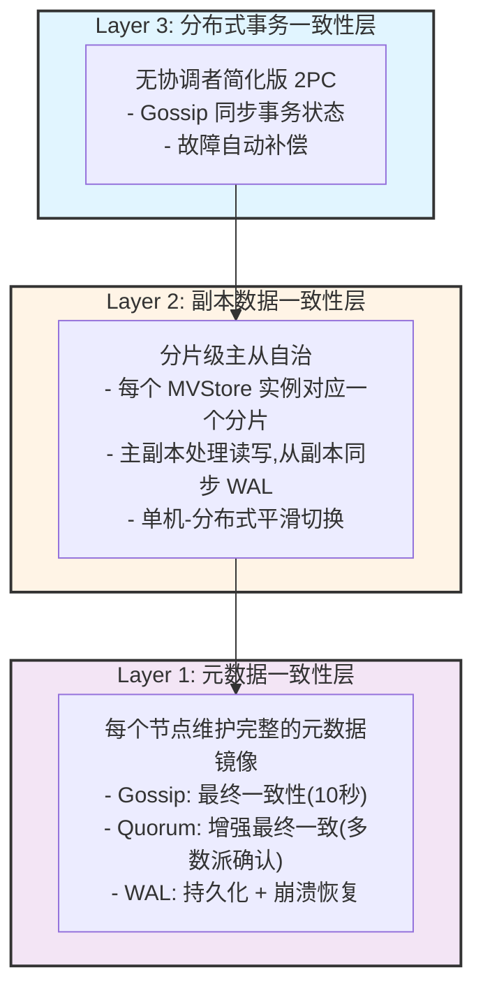

# NexKV

> **⚠️ 项目处于开发早期 · 当前版本 v0.0.0 · 敬请期待！**
>
> **轻量化分布式 KV 存储系统**
> 面向中小规模集群（3-100 节点）的去中心化分布式数据库，支持**单机-分布式一体**架构

---

## ✨ 核心特性

| 特性 | 说明 |
|------|------|
| **单机-分布式一体** | 一套架构同时支持单机和分布式部署，运行时无缝切换 |
| **分层一致性** | 关键变更强一致（Quorum），普通变更最终一致（Gossip） |
| **分片自治** | 每个分片独立管理副本、事务与故障恢复 |
| **无中心化** | 无单点故障，所有节点地位平等 |
| **轻量化部署** | 无外部依赖（ZooKeeper/Etcd），元数据本地存储 |
| **WAL 优化** | 批量写入、组提交、增量恢复，测试覆盖率 72%+ |

---

## 🚀 快速开始

### 前置要求

- Go 1.21+
- 100MB+ 可用磁盘空间

### 构建项目

```bash
# 克隆仓库
git clone https://github.com/jzhang405/NexKV.git
cd NexKV

# 构建二进制文件
go build -o bin/nexkv cmd/nexkv/main.go

# 运行节点
./bin/nexkv --config configs/config.yaml
```

### 单机模式启动

```yaml
# configs/config.yaml
cluster:
  name: "nexkv-cluster"
  node:
    id: "node-1"
    addr: "127.0.0.1:9211"

metadata:
  dir: "./data/metadata"
  gossip_interval: "10s"

storage:
  data_dir: "./data/shards"
  wal_dir: "./data/wal"
```

### 分布式模式扩展

```bash
# 启动第二个节点
./bin/nexkv --config configs/node2.yaml

# 元数据自动同步，后台异步迁移数据
# 无需停机，平滑扩展为分布式集群
```

---

## 📚 核心文档

### 核心架构文档（docs/00_overview/）

| 文档 | 描述 |
|------|------|
| 🏗️ [核心架构概念](docs/00_overview/01_核心架构概念.md) | 三层架构、元数据层、数据层、事务层 |
| ⚖️ [一致性级别定义](docs/00_overview/02_一致性级别定义.md) | 分层一致性模型：Gossip、Quorum、2PC |
| 🔀 [单机-分布式一体](docs/00_overview/03_单机分布式一体.md) | 无缝切换、平滑扩展、故障恢复 |

---

## 🏗️ 架构概述

### 三层架构



### 分层一致性模型

| 层级 | 一致性级别 | 机制 | 收敛时间 | 典型场景 |
|------|-----------|------|---------|---------|
| **L1 元数据层** | 分层一致性 | Gossip / Quorum | < 10s / < 50ms | 元数据同步 |
| **L2 数据层** | 可选一致性 | 主从异步 / 同步复制 | < 10ms / < 50ms | 数据读写 |
| **L3 事务层** | 最终一致 | Gossip 状态同步 + 补偿 | < 10s | 跨分片事务 |

---

## 🛠️ 技术栈

| 层级 | 技术选型 | 版本要求 | 理由 |
|------|---------|---------|------|
| **语言** | Go | >= 1.21 | 原生并发、高性能、简单部署 |
| **存储** | MVStore + WAL | - | 零依赖、高性能、MVCC 支持 |
| **编解码** | JSON / MessagePack | - | 多编解码支持，灵活切换 |
| **网络** | TCP + 自定义帧 | - | 零开销、完全控制 |
| **测试** | testify | latest | 功能丰富、BDD 支持 |
| **覆盖率** | 72%+ | - | 高质量代码保障 |

---

## 📊 最新进展（2026-01-19）

### ✅ 已完成功能

#### PR-001: WAL 优化与增强

**核心实现**：
- ✅ **WALGroupCommit** - 组提交机制，批量 fsync 优化吞吐量
- ✅ **WALBatchReader** - 批量 WAL 读取，优化恢复性能
- ✅ **WALCodec** - 统一的编解码接口，支持 JSON/MessagePack
- ✅ **WALRotation** - WAL 文件轮转，防止单文件过大
- ✅ **快照优化** - 快照命名优化为 `.snap` 扩展名

**测试改进**：
- 新增 12 个测试用例，覆盖批量操作场景
- 新增 20+ 编解码性能基准测试
- 测试覆盖率从 56% → **72%**

**性能对比**（编解码 Benchmark）：
| 操作 | JSON | MessagePack | 提升 |
|------|------|------------|------|
| 编码 | 1754 ns/op | 700 ns/op | **2.5x** |
| 解码 | 9652 ns/op | 656 ns/op | **14.7x** |
| 编码后大小 | 2153 bytes | 1609 bytes | **25%** |

---

## 🤝 贡献指南

### 开发流程

1. Fork 项目到你的 GitHub 账号
2. 创建功能分支：`git checkout -b feature/your-feature`
3. 遵循 PR 全流程（Pre 文档 → 开发 → 测试 → Post 文档）
4. 提交更改：`git commit -m 'feat: add some feature'`
5. 推送分支：`git push origin feature/your-feature`
6. 创建 Pull Request

### 提交规范

遵循 [Conventional Commits](https://www.conventionalcommits.org/) 规范：

```
<type>(<scope>): <subject>

type: feat | fix | docs | style | refactor | test | chore
scope: 模块名称
subject: 简短描述（不超过 50 字符）
```

### 代码规范

- 遵循 `docs/03_development/01_编码规范文档.md` 定义的编码规范
- 所有公开接口必须有注释
- 复杂逻辑必须有解释说明
- 禁止使用魔法数字和魔法字符串
- 错误处理必须显式，禁止忽略
- CI/CD 通过：所有测试、lint、格式化检查

---

## 📈 性能指标

| 指标 | 目标值 | 测试方法 |
|------|--------|---------|
| **元数据查询延迟** | < 1ms | 本地读取 |
| **Gossip 扩散延迟** | < 10 秒（7 节点） | 集成测试 |
| **Quorum 确认延迟** | < 50ms（3 节点） | 集成测试 |
| **WAL 批量写入吞吐** | > 10000 entries/s | 基准测试 |
| **测试覆盖率** | > 70% | `go test -cover` |

---

## 📄 许可证

本项目基于 **AGPL-3.0** 许可证开源。详见 [LICENSE](LICENSE) 文件。

---

## 📞 联系方式

- **Issues**: [GitHub Issues](https://github.com/jzhang405/NexKV/issues)
- **Discussions**: [GitHub Discussions](https://github.com/jzhang405/NexKV/discussions)

---

**文档版本**: v1.2
**当前版本**: v0.0.0（开发早期）
**最后更新**: 2026-01-22
**维护者**: NexKV 开发团队
**测试覆盖率**: 72.0%
