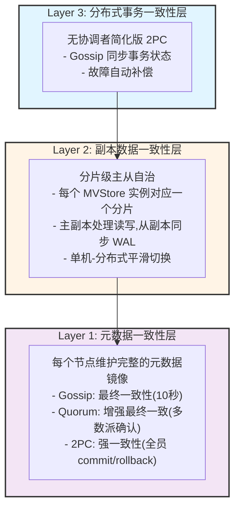

# NexKV

> **轻量化分布式 KV 存储系统**
> 面向中小规模集群（3-100 节点）的去中心化分布式数据库，支持**单机-分布式一体**架构

---

## ✨ 核心特性

| 特性 | 说明 |
|------|------|
| **单机-分布式一体** | 一套架构同时支持单机和分布式部署，运行时无缝切换 |
| **分层一致性** | 关键变更强一致（2PC 组内全确认），普通变更最终一致（Gossip） |
| **分片自治** | 每个分片独立管理副本、事务与故障恢复 |
| **无中心化** | 无单点故障，所有节点地位平等 |
| **轻量化部署** | 无外部依赖（ZooKeeper/Etcd），元数据本地存储 |
| **树形分组** | 支持大规模集群（100-1000 节点）通过树形分组扩展 |

---

## 🚀 快速开始

### 前置要求

- Go 1.21+
- 100MB+ 可用磁盘空间

### 构建项目

```bash
# 克隆仓库
git clone https://github.com/jzhang405/NexKV.git
cd NexKV

# 构建二进制文件
make build

# 运行节点
./bin/nexkv --config configs/config.yaml
```

### 单机模式启动

```yaml
# configs/config.yaml
cluster:
  name: "nexkv-cluster"
  node:
    id: "node-1"
    addr: "127.0.0.1:9211"

metadata:
  dir: "./data/metadata"
  gossip_interval: "10s"

storage:
  data_dir: "./data/shards"
  wal_dir: "./data/wal"
```

### 分布式模式扩展

```bash
# 启动第二个节点
./bin/nexkv --config configs/node2.yaml

# 元数据自动同步，后台异步迁移数据
# 无需停机，平滑扩展为分布式集群
```

---

## 📚 文档导航

### 项目文档（docs/）

完整的开发文档按照标准化流程组织：

```
docs/
├── README.md                           # 文档导航索引
├── workflow.md                         # 开发流程规范
│
├── 01_requirement_planning/            # 需求与规划
│   ├── PRD.md                          # 产品需求文档
│   ├── TRD.md                          # 技术需求文档
│   ├── project_plan.md                 # 项目计划
│   └── requirement_review_minutes.md   # 需求评审纪要
│
├── 02_design/                          # 架构与详细设计
│   ├── SAD.md                          # 系统架构设计文档
│   ├── CPD.md                          # 一致性协议设计文档
│   ├── APID.md                         # API 接口设计文档
│   ├── DDD.md                          # 详细设计文档
│   ├── SED.md                          # 存储引擎设计文档
│   └── design_review_minutes.md        # 设计评审纪要
│
├── 03_development/                     # 开发与编码
│   ├── CDS.md                          # 编码规范文档
│   ├── RDD.md                          # 运行时细节文档
│   ├── DRD.md                          # 第三方依赖文档
│   └── unit_test_report/               # 单元测试报告
│
├── 04_test/                            # 测试与验收
│   ├── TPD.md                          # 测试计划文档
│   ├── TCD.md                          # 测试用例文档
│   ├── TR.md                           # 测试报告
│   ├── bug_list.md                     # Bug 清单
│   └── acceptance_report.md            # 验收报告
│
├── 05_deployment_operation/            # 部署与运维
│   ├── DM.md                           # 部署手册
│   ├── OM.md                           # 运维手册
│   ├── RD.md                           # 版本发布文档
│   └── monitoring_config.md            # 监控配置手册
│
└── 06_project_management/              # 项目管理
    ├── project_init_report.md          # 项目初始化报告
    └── team_division.md                # 团队分工清单
```

### 快速链接

- 📖 [开发流程规范](docs/workflow.md) - 了解开发工作流
- 📋 [产品需求文档](docs/01_requirement_planning/PRD.md) - 产品定位和核心价值
- 🏗️ [系统架构设计](docs/02_design/SAD.md) - 三层架构详细说明
- 🔧 [API 接口设计](docs/02_design/APID.md) - 接口定义和使用示例
- 📝 [编码规范文档](docs/03_development/CDS.md) - 代码风格和最佳实践

---

## 🏗️ 架构概述

### 三层架构



### 分层一致性模型

| 层级 | 一致性级别 | 机制 | 收敛时间 | 典型场景 |
|------|-----------|------|---------|---------|
| **L1 元数据层** | 分层一致性 | Gossip / Quorum / 2PC | < 10s / < 50ms / < 100ms | 元数据同步 |
| **L2 数据层** | 可选一致性 | 主从异步 / 同步复制 | < 10ms / < 50ms | 数据读写 |
| **L3 事务层** | 最终一致 | Gossip 状态同步 + 补偿 | < 10s | 跨分片事务 |

---

## 🛠️ 技术栈

| 层级 | 技术选型 | 版本要求 | 理由 |
|------|---------|---------|------|
| **语言** | Go | >= 1.21 | 原生并发、高性能、简单部署 |
| **存储** | sync.Map + WAL | - | 零依赖、高性能、MVCC 支持 |
| **网络** | TCP + 自定义帧 | - | 零开销、完全控制、TLA+ 验证 |
| **序列化** | MessagePack | latest | 无需 IDL、性能好、兼容性 |
| **日志** | zap | latest | 零分配、高性能 |
| **配置** | Viper | latest | 多格式、多来源 |
| **测试** | testify + gomega | latest | 功能丰富、BDD 支持 |

---

## 📊 性能指标

| 指标 | 目标值 | 测试方法 |
|------|--------|---------|
| **元数据查询延迟** | < 1ms | 本地读取 |
| **Gossip 扩散延迟** | < 10 秒（7 节点） | 集成测试 |
| **2PC 决策延迟** | < 100ms（组内） | 集成测试 |
| **吞吐量** | > 10000 ops/s | 压力测试 |

---

## 🤝 贡献指南

### 开发流程

1. Fork 项目到你的 GitHub 账号
2. 创建功能分支：`git checkout -b feature/your-feature`
3. 提交更改：`git commit -m 'feat: add some feature'`
4. 推送分支：`git push origin feature/your-feature`
5. 创建 Pull Request

### 提交规范

遵循 [Conventional Commits](https://www.conventionalcommits.org/) 规范：

```
<type>(<scope>): <subject>

type: feat | fix | docs | style | refactor | test | chore
scope: 模块名称
subject: 简短描述（不超过 50 字符）
```

### 代码规范

- 遵循 `docs/03_development/CDS.md` 定义的编码规范
- 所有公开接口必须有注释
- 复杂逻辑必须有解释说明
- 禁止使用魔法数字和魔法字符串
- 错误处理必须显式，禁止忽略

---

## 📄 许可证

本项目基于 **AGPL-3.0** 许可证开源。详见 [LICENSE](LICENSE) 文件。

---

## 📞 联系方式

- **Issues**: [GitHub Issues](https://github.com/jzhang405/NexKV/issues)
- **Discussions**: [GitHub Discussions](https://github.com/jzhang405/NexKV/discussions)

---

**文档版本**: v1.0
**最后更新**: 2026-01-18
**维护者**: NexKV 开发团队
