# 核心架构理念：全局一致的 Metadata 镜像

> **文档版本**: v1.0
> **创建日期**: 2026-01-17
> **状态**: ✅ 核心理念补充

---

## 核心理念

每个节点都维护一份完整的 metadata 镜像

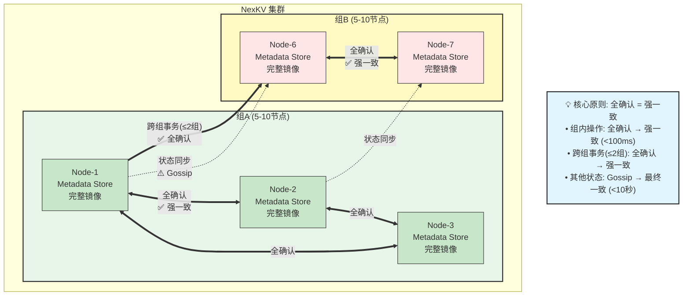

---

## 1. 为什么是核心理念?

### 传统架构问题

**传统中心化架构**：

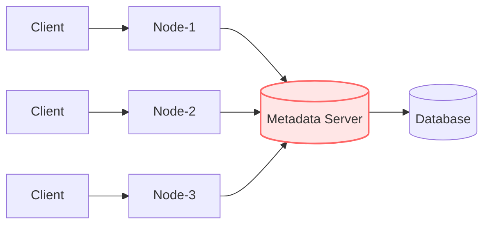

**问题**:
- ❌ Metadata Server 是单点故障
- ❌ 所有元数据请求需要网络往返
- ❌ 中心节点成为性能瓶颈
- ❌ 依赖外部服务 (ZooKeeper/Etcd)

---

### NexKV 架构优势

**去中心化分组架构**：

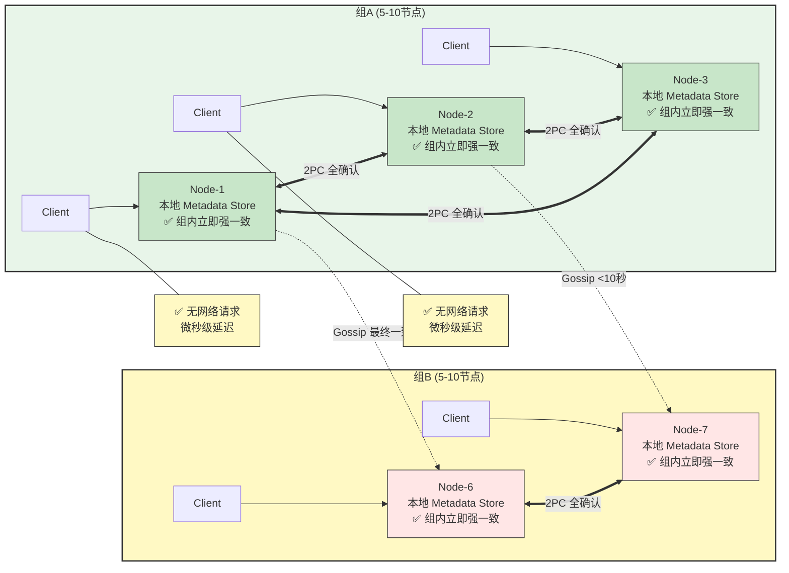

**优势**:
- ✅ **无单点**: 每个节点都有完整副本
- ✅ **本地优先**: 元数据读取无网络开销
- ✅ **高性能**: 本地读取微秒级延迟
- ✅ **简单部署**: 无外部依赖
- ✅ **全确认机制**: 组内和跨组事务(≤2组)都是立即强一致

### 一致性分层说明

NexKV 采用**分组架构**实现分层一致性，核心原则是：**全确认 = 强一致**。

| 范围 | 同步机制 | 一致性级别 | 收敛时间 | 典型场景 |
|------|---------|-----------|---------|---------|
| **组内操作** | ✅ 全确认 | ✅ Linearizability（线性一致） | < 100ms | 分片操作、主副本切换 |
| **跨组事务** | ✅ 全确认<br/>（限制≤2个组） | ✅ Linearizability（线性一致） | < 100ms | 跨组分片事务 |
| **其他状态同步** | Gossip 周期 | ⚠️ Eventual Consistency（最终一致） | < 10秒 | 节点健康、负载信息、拓扑同步 |

**关键理解**：
- **全确认机制** = 组内所有节点都确认 → **立即强一致**（< 100ms）
- **跨组事务限制** = 涉及组件限制在 **2个组以内**，也是**全确认** → 立即强一致
- **其他状态同步** = 通过 **Gossip 协议**异步扩散 → 最终一致（< 10秒收敛）

**设计权衡**：
- ✅ **优点**：在关键场景下提供真正的线性一致性
- ⚠️ **限制**：跨组事务限制在2个组以内（控制协调开销）
- 💡 **平衡**：通过分层设计，在保证一致性的同时控制网络开销

---

## 2. 三层架构总览

NexKV 采用**三层分层架构**，每层独立职责，协同工作，实现**单机-分布式一体**的高可用 KV 存储。

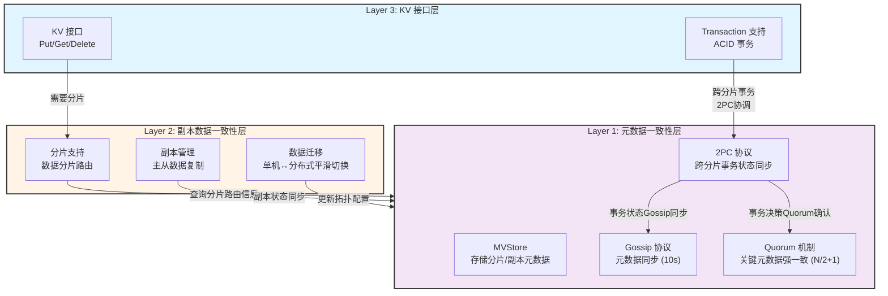

**架构关系**：
- **Layer 1（元数据层）**：用 MVStore 存储**分片/副本的元数据**
- **Layer 2（数据层）**：基于 Layer 1 的元数据进行**分片路由和数据同步**
- **Layer 3（KV 接口层）**：提供 KV 接口，基于 Layer 2 的分片支持**跨分片事务**

### Layer 1: 元数据一致性层（基础层）

核心价值：元数据层是整个分布式数据库的"大脑"和"导航系统"

#### 核心组件

| 组件 | 职责 | 一致性级别 |
|------|------|-----------|
| **MVStore** | 内存缓存 + 磁盘持久化 + MVCC 支持 | - |
| **Gossip 协议** | 最终一致、周期性扩散（10秒）、随机选点 | ⚠️ 最终一致 |
| **Quorum 机制** | 强一致、多数派确认（N/2+1）、关键变更专用 | ✅ 强一致 |
| **2PC 协议** | 跨分片事务状态管理、事务决策同步 | ✅ 组合一致（分片内Quorum + 跨分片Gossip） |

#### 关键设计原则

| 原则 | 说明 | 实现方式 |
|------|------|---------|
| **本地化优先** | 元数据优先存储在本地，减少网络依赖 | MVStore 嵌入式存储 |
| **分层一致性** | 关键变更强一致，普通变更最终一致 | Quorum + Gossip 分层处理 |
| **增量优先** | 减少网络传输，优先传递变更部分 | 变更日志 + 版本号 |
| **故障隔离** | 单节点故障不影响其他节点 | MVStore 本地持久化 |

#### 变更类型分类

| 变更类型 | 示例 | 一致性要求 | 同步机制 | 阻塞业务 |
|---------|------|-----------|---------|---------|
| **关键变更** | 分片创建、主副本切换、节点加入、2PC Commit 决策 | 强一致（多数派确认） | Quorum（阻塞等待） | 是 |
| **事务状态** | 2PC PreCommit、事务状态传播 | 组合一致（分片内Quorum + 跨分片Gossip） | 2PC 协议 | 部分阻塞 |
| **普通变更** | 节点状态更新、负载信息刷新 | 最终一致（10s内扩散） | Gossip（异步扩散） | 否 |

---

### Layer 2: 副本数据一致性层（数据层）

核心价值：单机-分布式一体的实现基础

#### 核心机制

**数据分布管理**
- 基于 Layer 1 的 MVStore 中的分片元数据进行数据路由
- 每个分片的数据分布由元数据层定义和管理
- 副本位置、主从关系都存储在 Layer 1 的元数据中

**副本同步**
- 副本跨节点强制分布（避免单节点故障）
- 主副本处理读写请求，从副本同步数据
- 副本信息通过 Layer 1 的 Gossip 协议同步

**一致性模型**
- **默认模式**：最终一致性（异步复制）
- **可选模式**：强一致性（Quorum 同步复制）

#### 与 Layer 1 的关系

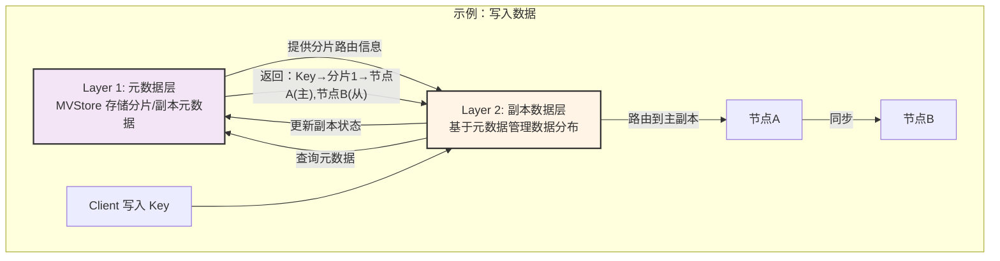

**关键区别**：
- Layer 1 **只管理元数据**（分片有哪些、副本在哪里）
- Layer 2 **管理实际数据**（基于元数据进行路由和同步）
- Layer 2 **没有独立的存储**，依赖元数据层的路由信息

#### 单机-分布式切换

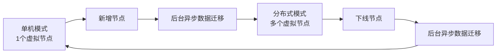

**切换机制**
1. **单机→分布式**：新增节点 → Layer 1 元数据层更新分片配置 → 后台异步迁移数据
2. **分布式→单机**：下线节点 → Layer 1 元数据层更新分片配置 → 后台异步迁移数据

**迁移过程保障**
- 版本向量避免数据覆盖
- 双写机制保证数据不丢失
- 读修复自动同步最新数据

---

### Layer 3: KV 接口层（接口层）

核心价值：提供简单易用的 KV 接口，屏蔽底层复杂性

#### 核心接口

**完整的 KV 接口设计**
```go
// 隔离级别定义
type IsolationLevel int

const (
    ReadCommitted IsolationLevel = iota
    RepeatableRead
    Snapshot
)

// 事务接口
type Transaction interface {
    // 事务操作
    Put(key []byte, value []byte) error
    Get(key []byte) ([]byte, error)
    Delete(key []byte) error

    // 事务控制
    Commit() error
    Rollback() error
}

// KVStore 接口（包含事务管理）
type KVStore interface {
    // 基础操作
    Put(key []byte, value []byte) error
    Get(key []byte) ([]byte, error)
    Delete(key []byte) error

    // 批量操作
    PutBatch(kvs map[string][]byte) error
    GetBatch(keys [][]byte) (map[string][]byte, error)

    // 事务管理
    Begin(opts ...TxOption) (Transaction, error)
}

// 事务选项
type TxOption func(*TxOptions)

type TxOptions struct {
    IsolationLevel IsolationLevel
    Timeout        time.Duration
}

// 选项函数
func WithIsolationLevel(level IsolationLevel) TxOption {
    return func(opts *TxOptions) {
        opts.IsolationLevel = level
    }
}

func WithTimeout(timeout time.Duration) TxOption {
    return func(opts *TxOptions) {
        opts.Timeout = timeout
    }
}
```

#### 跨分片事务支持

**事务流程**
1. **Begin**：通过 `KVStore.Begin(opts...)` 创建事务
   ```go
   tx, err := store.Begin(
       WithIsolationLevel(RepeatableRead),
       WithTimeout(30*time.Second),
   )
   ```

2. **操作**：在事务上下文中执行 Put/Get/Delete
   ```go
   err = tx.Put([]byte("key1"), []byte("value1"))
   val, err := tx.Get([]byte("key2"))
   err = tx.Delete([]byte("key3"))
   ```

3. **Commit/Rollback**：提交或回滚事务
   ```go
   err = tx.Commit()  // 提交事务
   // 或
   err = tx.Rollback()  // 回滚事务
   ```

**跨分片事务协调**
- 分析涉及的 Key 分布在哪些分片
- 对跨分片事务调用 Layer 1 的 2PC 协议
- 分片内通过 Quorum 确认，跨分片通过 Gossip 同步状态
- 所有分片都成功 → 提交；任意分片失败 → 回滚

**与 Layer 2 的协作**
- Layer 3 的 Transaction 调用 Layer 2 的分片路由
- Layer 2 返回 Key 所在的分片和副本信息
- Layer 3 协调跨分片事务的一致性

#### 适用场景

✅ **适用**
- 需要事务保证的业务逻辑
- 跨分片的原子性操作
- 高并发 KV 读写

❌ **不适用**
- 复杂的 SQL 查询（需要 SQL 层）
- 大事务（性能开销大）
- 跨数据中心事务（延迟高）

---

## Metadata 镜像内容

Metadata 数据实际存储在底层的 MVStore 中，`MetadataStore` 是服务层的封装，负责管理一致性协议（Gossip、Quorum、2PC）。

### 核心元数据类型

每个节点本地存储以下三类元数据：

| 元数据类型 | 存储内容 | 示例 Key |
|-----------|---------|----------|
| **分片元数据** | 分片 ID、哈希范围、副本节点列表 | `shard/shard-1` |
| **节点元数据** | 节点 ID、地址、状态、角色 | `node/node-1` |
| **表元数据** | 表 ID、名称、分片数量、分片映射 | `table/table-1` |

### 元数据版本管理

- **全局版本号**：每次变更递增，用于增量同步
- **变更日志**：记录所有变更历史，支持版本回溯和冲突解决
- **HLC 时间戳**：混合逻辑时钟，提供全局时序保证

### 镜像数据示例

```go
// Node-1 的 Metadata 镜像
{
  "shards": {
    "shard-1": {ID: "shard-1", Range: [a, g], Replicas: [node-1, node-2, node-3]},
    "shard-2": {ID: "shard-2", Range: [h, n], Replicas: [node-2, node-3, node-4]},
    "shard-3": {ID: "shard-3", Range: [o, z], Replicas: [node-3, node-4, node-5]},
  },
  "nodes": {
    "node-1": {ID: "node-1", Addr: "192.168.1.10:9211", Status: Alive},
    "node-2": {ID: "node-2", Addr: "192.168.1.11:9211", Status: Alive},
    "node-3": {ID: "node-3", Addr: "192.168.1.12:9211", Status: Alive},
  },
  "tables": {
    "table-1": {ID: "table-1", Name: "users", ShardCount: 3},
  },
  "version": 12345
}

// Node-2 的 Metadata 镜像 (相同)
// Node-3 的 Metadata 镜像 (相同)
```

---

## 一致性保证机制

### 写入流程

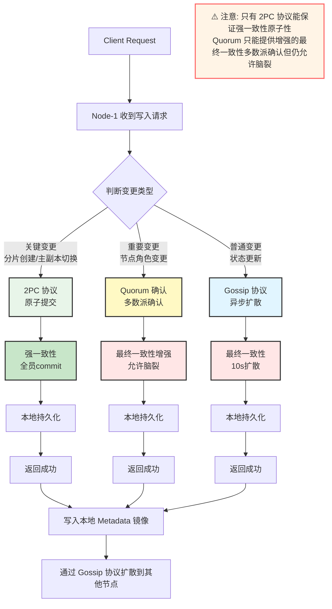

---

### 读取流程

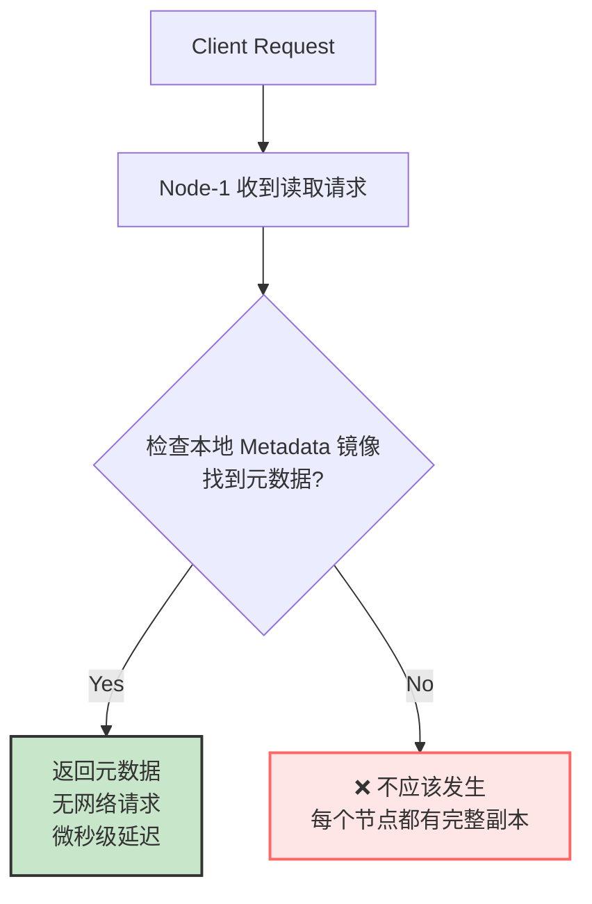

---

### Gossip 同步流程

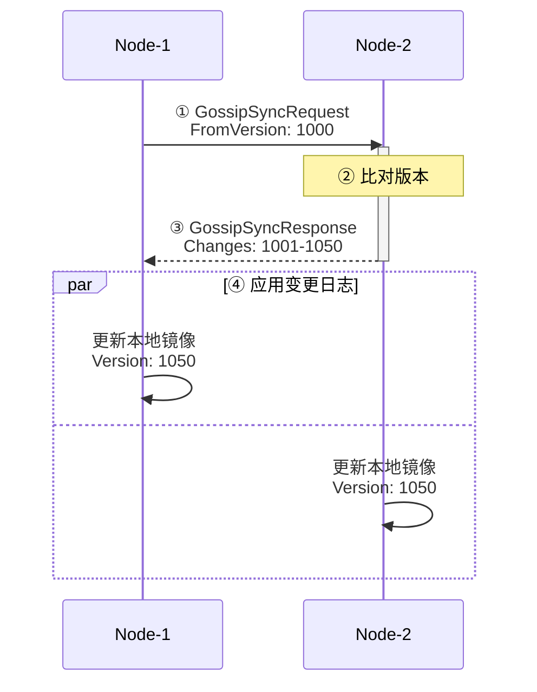

---

## 关键设计决策

### 为什么每个节点都有完整副本

| 决策 | 理由 |
|------|------|
| **完整副本** | 元数据量小(<100MB,典型<10MB),内存完全够用 |
| **本地优先** | 无网络开销,微秒级响应 |
| **无外部依赖** | 不需要 ZooKeeper/Etcd |
| **简单部署** | 二进制即可运行 |

---

### 如何保证一致性

| 机制 | 用途 | 一致性保证 | 收敛时间 |
|------|------|-----------|---------|
| **2PC 协议** | 关键变更原子提交 | **强一致**(全员commit或rollback) | < 100ms |
| **组内全确认** | 重要变更组内确认 | **线性一致**(组内全确认,无脑裂) | < 50ms |
| **Gossip 协议** | 普通变更异步扩散 | **分级最终一致**(1-10s) | 详见分级配置 |
| **版本向量** | 冲突检测 | 实时 | - |
| **变更日志** | 增量同步 | 持续 | - |

### 如何处理冲突

```go
// 冲突检测
func DetectConflict(local, remote *MetadataChange) bool {
    // 相同版本号,不需要同步
    if local.Version == remote.Version {
        return false
    }

    // 版本号不同,检查是否有冲突
    if local.Key != remote.Key {
        return false  // 不同键,无冲突
    }

    // 相同键,不同版本 → 冲突
    return true
}

// 冲突解决 (基于时间戳)
func ResolveConflict(local, remote *MetadataChange) *MetadataChange {
    if local.Timestamp > remote.Timestamp {
        return local
    }
    return remote
}
```

---

## 性能优势

### 性能对比

| 架构 | 读取延迟 | 写入延迟 | 网络依赖 |
|------|---------|---------|---------|
| **中心化** | 10-50ms (网络往返) | 20-100ms | 中心节点 |
| **NexKV (本地读取)** | < 1ms (内存读取) | 1-50ms | 无 |

---

### 扩展性

| 集群规模 | 元数据总量 | 单节点内存 | 扩展性 |
|---------|-----------|-----------|--------|
| **3 节点** (小型) | ~5-10MB | ~15MB | 线性 |
| **7 节点** (中型) | ~20-40MB | ~50MB | 线性 |
| **10 节点** (中大型) | ~30-60MB | ~80MB | 线性 |
| **50 节点** (大型) | ~150-300MB | ~400MB | 分组后线性 |
| **100 节点** (超大型) | ~300MB-1GB | ~1.5GB | 分组后线性 |
| **1000 节点** (极限规模) | ~3-10GB | ~15GB | 树形分组后对数增长 |

**✅ 设计目标**：
- 中小规模集群（3-50 节点）：简单高效，无需复杂设计
- 大规模集群（50-1000 节点）：树形分组 + 智能路由，保持强一致性

---

### 大规模集群：树形分组 + 智能路由

#### 问题：2PC 在大规模集群中的困境

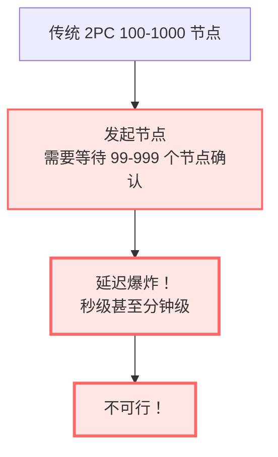

#### 解决方案：树形分组架构

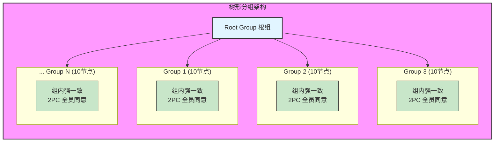

#### 核心设计原则

**1. 组内强一致（2PC）**
```go
// 每个组内部使用 2PC 保证强一致性
type Group struct {
    GroupID    string
    Members    []string  // 组成员（5-10 个节点，可配置）
    Leader     string    // 组内 Leader（担任 2PC 协调者）
}

// 组内事务：全员同意
func (g *Group) ExecuteTransaction(tx Transaction) error {
    // 2PC 协议，但只在组内执行
    // 5-10 个节点的确认，延迟可控（< 100ms）
    return g.TwoPhaseCommit(tx)
}
```

**2. 组间最终一致（Gossip）**
```go
// 组之间通过 Gossip 同步元数据
type InterGroupSync struct {
    Interval time.Duration  // 同步间隔
}

// 组间变更：最终一致即可
func (s *InterGroupSync) SyncGroupMetadata() {
    // 不同组的元数据可以短期不一致
    // 通过 Gossip 在 10 秒内收敛
}
```

**3. 智能路由：核心秘密**

```go
// SmartRouter 智能路由器
type SmartRouter struct {
    groupManager *GroupManager
    metadataStore MetadataStore
}

// 核心算法：尽量路由到同一个组内
func (r *SmartRouter) RouteTransaction(tx Transaction) (string, error) {
    // 1. 分析事务涉及的数据（分片、键等）
    dataScope := r.AnalyzeDataScope(tx)

    // 2. 查找数据所在的组
    targetGroup := r.FindGroupForData(dataScope)

    // 3. 如果数据完全在某个组内，路由到该组
    if r.IsDataInSingleGroup(tx, targetGroup) {
        return targetGroup.GroupID, nil  // ✅ 组内事务
    }

    // 4. 跨组事务：需要协调多个组
    if r.IsCrossGroupTransaction(tx) {
        return r.RouteCrossGroupTx(tx, targetGroups)
    }

    return "", ErrNoRoute
}
```

#### 为什么这样设计

| 问题 | 传统方案 | 树形分组方案 |
|------|---------|-------------|
| **2PC 延迟** | 100节点 = 99个确认 ≈ 数秒 | 组内5-10节点 = 4-9个确认 ≈ 50ms |
| **强一致性** | 大规模集群不可行 | 组内强一致，组间最终一致 |
| **扩展性** | 线性下降 | 对数增长（增加组，不增加组规模） |
| **复杂度** | 简单 | 中等（需要智能路由） |

#### 实施效果

```
集群规模：100 节点
├── 传统 2PC：99 个确认 ≈ 5-10 秒 ❌
└── 树形分组：10-20 组 × 5-10 节点 = 4-9 个确认 ≈ 50ms ✅

集群规模：1000 节点
├── 传统 2PC：999 个确认 ≈ 分钟级 ❌
└── 树形分组：100-200 组 × 5-10 节点 = 4-9 个确认 ≈ 50ms ✅
```

#### 关键优化点

1. **组规模固定**：每组 5-10 个节点（可配置），2PC 延迟可控
2. **智能路由优先**：尽量将事务路由到同一组内
3. **跨组事务最小化**：通过数据分片策略减少跨组访问
4. **组间异步同步**：不同组之间的元数据最终一致即可

通过树形分组 + 智能路由，NexKV 可以在保持强一致性的同时，支持 100-1000 个节点的大规模集群。

---

## 代码实现要点

### 元数据存储服务

MetadataStore 是元数据管理的服务层封装，协调底层存储（MVStore）和一致性协议（Gossip、Quorum、2PC）。

```go
// MetadataStore 元数据存储服务（简化版）
type MetadataStore struct {
    // 配置
    config *MetadataStoreConfig

    // 底层存储
    mvStore MVStore  // 实际数据存储（内存+磁盘）

    // 一致性协议
    gossipService *GossipService  // Gossip 最终一致性
    quorumService *QuorumService  // Quorum 强一致性
    twoPCService  *TwoPCService   // 2PC 分布式事务

    // 版本管理
    version    atomic.Uint64          // 全局版本号
    changeLogs []*MetadataChangeLog  // 变更日志
}

// 主要方法
func (m *MetadataStore) Put(key string, value []byte) error
func (m *MetadataStore) Get(key string) ([]byte, error)
func (m *MetadataStore) Delete(key string) error

// Gossip 同步方法
func (m *MetadataStore) GetVersion() uint64
func (m *MetadataStore) GetChangeLogs(since uint64) []*MetadataChangeLog
func (m *MetadataStore) ApplyChangeLogs(logs []*MetadataChangeLog) error
```

**架构分层**：

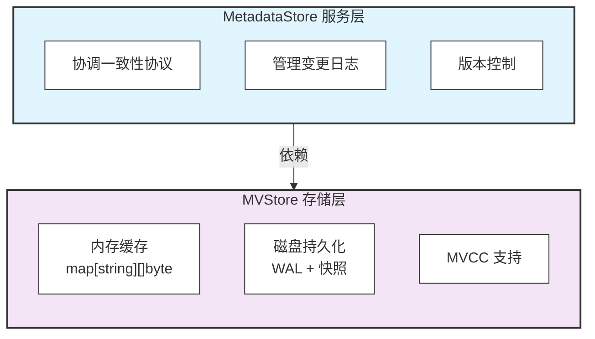

---

### Gossip 服务

```go
// GossipService Gossip 协议服务
type GossipService struct {
    interval    time.Duration     // 同步间隔 10s
    fanout      int               // 每轮选点数 2
    metaStore   MetadataStore     // 本地元数据镜像
    transport   Transport         // 网络传输
}

// 同步循环
func (g *GossipService) syncLoop() {
    ticker := time.NewTicker(g.interval)
    defer ticker.Stop()

    for {
        select {
        case <-ticker.C:
            // 随机选择 2 个节点进行同步
            peers := g.selector.SelectRandom(2)
            for _, peer := range peers {
                go g.syncToNode(peer)
            }
        case <-g.stopCh:
            return
        }
    }
}

// 双向同步
func (g *GossipService) syncToNode(addr string) error {
    localVersion := g.metaStore.GetVersion()
    remoteVersion, err := g.transport.GetVersion(addr)

    if localVersion > remoteVersion {
        // 发送变更日志
        logs := g.metaStore.GetChangeLogs(remoteVersion)
        return g.transport.SendChangeLogs(addr, logs)
    }

    if remoteVersion > localVersion {
        // 请求变更日志
        logs, err := g.transport.GetChangeLogs(addr, localVersion)
        if err != nil {
            return err
        }
        return g.metaStore.ApplyChangeLogs(logs)
    }

    return nil  // 版本相同,无需同步
}
```

---

## 与其他方案对比

### vs ZooKeeper

| 特性 | NexKV | ZooKeeper |
|------|-------|-----------|
| **架构** | 去中心化 | 中心化(Leader) |
| **元数据位置** | 每个节点本地 | Leader 节点 |
| **读取延迟** | < 1ms (本地) | 10-50ms (网络) |
| **外部依赖** | 无 | 独立部署 |
| **复杂度** | 简单 | 复杂 |

---

### vs Etcd

| 特性 | NexKV | Etcd |
|------|-------|------|
| **架构** | 去中心化 | Raft 集群 |
| **元数据位置** | 每个节点本地 | 多数副本 |
| **读取延迟** | < 1ms (本地) | 5-20ms (Raft) |
| **一致性** | 可选(强/最终) | 强一致 |
| **外部依赖** | 无 | 独立部署 |

---

## 总结

### 核心理念

每个节点都维护一份完整的、全局一致的 metadata 镜像

- ✅ **本地优先**: 读取无网络开销
- ✅ **最终一致**: Gossip 10 秒收敛
- ✅ **强一致选项**: 2PC 关键变更（原子性保证）
- ✅ **无外部依赖**: 自包含系统

### 关键特性

| 特性 | 说明 |
|------|------|
| **完整镜像** | 每个节点都有所有元数据 |
| **本地读取** | 无需网络请求 |
| **Gossip 同步** | 增量同步,高效收敛 |
| **版本向量** | 冲突检测 |
| **分层一致性** | 关键变更(2PC强一致),重要变更(Quorum增强),普通变更(Gossip最终) |

---

**文档版本**: v1.0
**最后更新**: 2026-01-17
**维护者**: NexKV 开发团队
