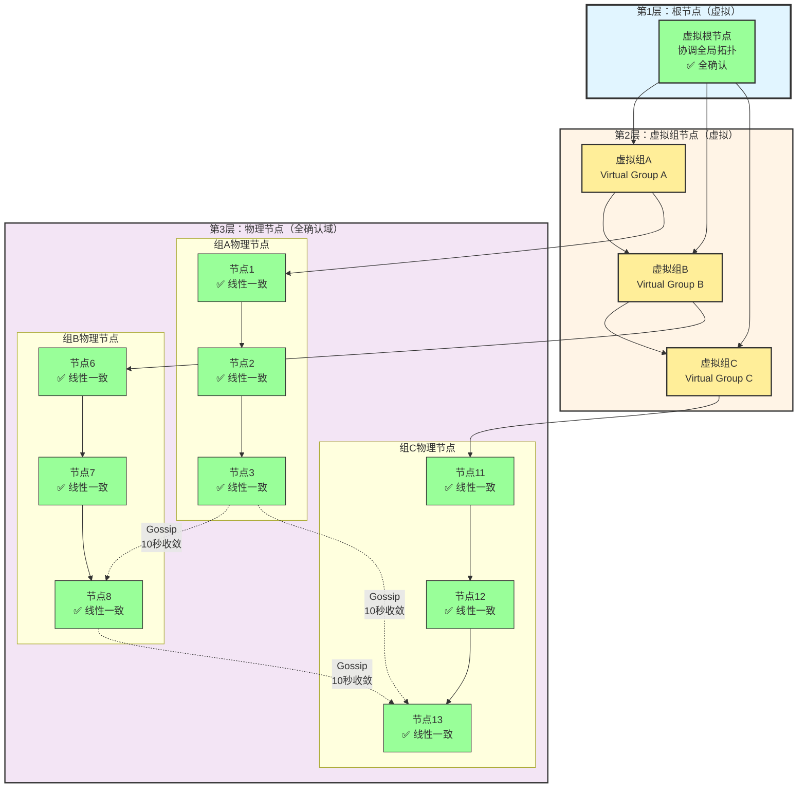
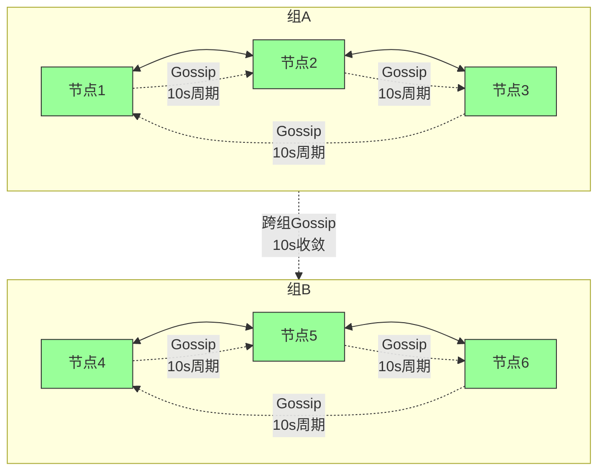

# Layer1 一致性级别定义

> **文档版本**: v1.1
> **创建日期**: 2026-01-17
> **最后更新**: 2026-01-18
> **状态**: ✅ 已统一 Gossip 参数

---

## 📋 统一参数定义

### Gossip 协议分级配置

> **⚠️ 重要说明**：NexKV 采用**分级 Gossip 机制**，根据消息优先级使用不同的同步参数，以平衡性能和一致性。

| 优先级 | 定期周期 | Fanout | 立即转发 | 收敛时间 | 典型场景 |
|--------|---------|--------|---------|---------|---------|
| **PriorityCritical** | 立即触发（不等周期） | 3 | ✅ 是 | < 1秒 | 2PC 决策、事务状态 |
| **PriorityHigh** | 5秒 | 2 | ⚠️ 可选 | < 5秒 | 节点健康检测、故障确认 |
| **PriorityNormal** | 10秒 | 2 | ❌ 否 | < 10秒 | 元数据同步、拓扑信息 |
| **PriorityLow** | 10-30秒 | 2 | ❌ 否 | < 30秒 | 统计信息、负载报告 |

**设计原则**：
1. **关键消息立即转发**：PriorityCritical 消息（如 2PC Commit）**决策后立即触发转发**，不等定期周期，确保 1 秒内收敛
2. **重要消息及时同步**：PriorityHigh 消息使用 5 秒定期周期，在保证及时性的同时控制网络开销
3. **普通消息性能优先**：PriorityNormal 消息使用 10 秒定期周期，平衡一致性和性能
4. **低优先级消息后台同步**：PriorityLow 消息使用较长定期周期，减少对正常业务的影响

**配置代码**：
```go
// 文件：internal/metadata/consensus/gossip.go:86-92
type GossipConfig struct {
    Interval      time.Duration // 10s - 默认同步间隔（PriorityNormal）
    Fanout        int           // 2   - 默认每轮随机节点数
    Timeout       time.Duration // 5s  - 单次同步超时
    MaxChangeLogs int           // 1000 - 最大变更日志数

    // 分级配置（可选）
    HighInterval     time.Duration // 5s  - 重要消息周期
    LowInterval      time.Duration // 30s - 低优先级消息周期
    // PriorityCritical 消息：决策后立即转发，不等定期周期
}
```

---

## 📊 核心消息速记表（3类一致性精准对应）

（共18条，按模块分类，极简核心信息，方便快速查阅/落地）

### 一、节点健康检测（2条）
| 消息名 | 代码类型 | 一致性等级 | 核心用途 | 建议参数 |
|--------|---------|-----------|---------|---------|
| HeartbeatMsg | NodePingMessage / NodePongMessage | Gossip（最终一致） | 上报节点健康/负载状态 | **周期：5s**<br/>重试：3次<br/>超时：3s |
| NodeFaultConfirmMsg | - | Gossip（最终一致） | 确认节点故障，避免误判 | **周期：10s**<br/>重试：3次<br/>超时：5s |

## 二、分片管理（3条）
| 消息名 | 代码类型 | 一致性等级 | 核心用途 | 建议参数 |
|--------|---------|-----------|---------|---------|
| ReplicaElectMsg | LeaderElectionMessage | Quorum（增强最终一致） | 分片副本组内选主 | **超时：30s**<br/>重试：3次<br/>阈值：N/2+1 |
| ShardMetaSyncMsg | GossipSyncMessage | Gossip（最终一致） | 同步分片拓扑/副本关系 | **周期：10s**<br/>Fanout：2<br/>超时：5s |
| ShardLoadBalanceMsg | - | Gossip（最终一致） | 同步节点负载，支撑分片均衡 | **周期：10s**<br/>Fanout：2 |

## 三、Gossip 协议核心（4条）
| 消息名 | 代码类型 | 一致性等级 | 核心用途 | 建议参数 |
|--------|---------|-----------|---------|---------|
| SnapshotMetaMsg | - | Gossip（最终一致） | 同步分片快照元数据，全局对齐 | **周期：10s**<br/>Fanout：2 |
| TxStatusMsg | TwoPCGossipStateMessage | Gossip（最终一致） | 同步跨分片事务状态 | **立即转发**（决策后）<br/>定期周期：5s<br/>Fanout：3 |
| ClusterMetaMsg | ClusterStatusMessage | Gossip（最终一致） | 同步集群节点/分组拓扑 | **周期：10s**<br/>Fanout：2 |
| GroupRepStatusMsg | - | Gossip（最终一致） | 同步分片组GR节点状态 | **周期：10s**<br/>Fanout：2 |

## 四、数据读写核心（4条）
| 消息名 | 代码类型 | 一致性等级 | 核心用途 | 建议参数 |
|--------|---------|-----------|---------|---------|
| ShardWriteReqMsg | - | Quorum（增强最终一致） | 分片内主从同步写操作 | **超时：10s**<br/>重试：3次<br/>阈值：N/2+1 |
| ShardReadReqMsg | - | Quorum（增强最终一致） | 分片内多数派读，防脏读 | **超时：5s**<br/>重试：2次<br/>阈值：N/2+1 |
| CrossShardWriteForwardMsg | TwoPCPrepareMessage | 2PC（组合一致） | 跨分片写预提交转发 | **超时：30s**<br/>重试：3次<br/>全员确认 |
| CrossShardReadRouteMsg | - | Gossip（最终一致） | 跨分片读快照路由 | **周期：10s**<br/>Fanout：2 |

## 五、事务&故障补偿（3条）
| 消息名 | 代码类型 | 一致性等级 | 核心用途 | 建议参数 |
|--------|---------|-----------|---------|---------|
| TxPreCommitMsg | TwoPCPrepareMessage | 2PC（组合一致） | 事务预提交，分片内Quorum确认 | **超时：30s**<br/>重试：3次<br/>全员commit |
| TxCommit/RollbackMsg | TwoPCCommitMessage / TwoPCRollbackMessage | 2PC（组合一致） | 事务最终提交/回滚 | **立即转发**（不等周期）<br/>定期周期：5s<br/>超时：10s |
| TxCompensateDecideMsg | - | Gossip（最终一致） | 故障后事务补偿决策 | **周期：5s**<br/>Fanout：3<br/>查询超时：10s |

## 六、分片组扩展（2条）
| 消息名 | 代码类型 | 一致性等级 | 核心用途 | 建议参数 |
|--------|---------|-----------|---------|---------|
| GroupRepElectMsg | LeaderElectionMessage | Quorum（增强最终一致） | 分片组内选举GR节点 | **超时：30s**<br/>重试：3次<br/>阈值：N/2+1 |
| InterGroupMetaMsg | - | Gossip（最终一致） | 组间同步全局核心元数据 | **周期：10s**<br/>Fanout：3 |

---

## 📋 速记核心规律（一眼对应）

### 1. 一致性选择规律
| 操作类型 | 一致性等级 | 典型场景 |
|---------|-----------|---------|
| **单分片/组内核心操作** | Quorum 增强最终一致 | 选主、读写、GR选举 |
| **跨节点/分片/组的状态同步** | Gossip 最终一致 | 元数据同步、状态广播 |
| **跨分片事务** | 2PC 组合一致 | 分布式事务（分片内Quorum+跨分片Gossip） |

### 2. Gossip 周期选择规律

> 详见本文档开头的 **[Gossip 协议分级配置](#gossip-协议分级配置)** 章节。

| 消息优先级 | 定期周期 | 立即转发 | 典型消息 |
|-----------|---------|---------|---------|
| **PriorityCritical** | 立即触发（不等周期） | ✅ 是 | 2PC 决策、事务状态 |
| **PriorityHigh** | 5s | ⚠️ 可选 | 节点健康检测 |
| **PriorityNormal** | 10s | ❌ 否 | 元数据同步、拓扑信息 |
| **PriorityLow** | 10-30s | ❌ 否 | 统计信息、负载报告 |

### 3. 重试策略规律
| 一致性等级 | 重试次数 | 超时时间 | 失败策略 |
|-----------|---------|---------|---------|
| **2PC** | 3次 | 30s | 全员rollback |
| **Quorum** | 3次 | 30s | 回滚提案 |
| **Gossip** | 3次 | 5-10s | 下一周期重试 |

---

## ⚙️ 代码实现对应关系

### 已实现的消息类型
| 文档消息名 | 代码类型 | 文件位置 |
|-----------|---------|---------|
| HeartbeatMsg | NodePingMessage / NodePongMessage | transport/codec.go:505-530 |
| ReplicaElectMsg | LeaderElectionMessage | transport/codec.go:648 |
| ShardMetaSyncMsg | GossipSyncMessage / GossipSyncReplyMessage | transport/codec.go:291-316 |
| ClusterMetaMsg | ClusterStatusMessage / ClusterStatusReplyMessage | transport/codec.go:612-626 |
| TxPreCommitMsg | TwoPCPrepareMessage / TwoPCPrepareReplyMessage | transport/codec.go:405-440 |
| TxCommit/RollbackMsg | TwoPCCommitMessage / TwoPCRollbackMessage | transport/codec.go:444-489 |

### 待实现的消息类型
| 文档消息名 | 需要实现 | 说明 |
|-----------|---------|------|
| NodeFaultConfirmMsg | ⚠️ 待实现 | 节点故障确认机制 |
| ShardLoadBalanceMsg | ⚠️ 待实现 | 负载均衡消息 |
| SnapshotMetaMsg | ⚠️ 待实现 | 快照元数据同步 |
| TxStatusMsg | ⚠️ 待实现 | 事务状态Gossip（`../02_design/protocols/二阶段提交与Gossip状态同步.md`） |
| GroupRepStatusMsg | ⚠️ 待实现 | 分片组状态同步 |
| ShardWriteReqMsg | ⚠️ 待实现 | 分片写请求 |
| ShardReadReqMsg | ⚠️ 待实现 | 分片读请求 |
| CrossShardReadRouteMsg | ⚠️ 待实现 | 跨分片读路由 |
| TxCompensateDecideMsg | ⚠️ 待实现 | 事务补偿决策 |
| InterGroupMetaMsg | ⚠️ 待实现 | 组间元数据同步 |

---

## 🔧 默认配置参数汇总

### Gossip 协议配置
```go
// 文件：internal/metadata/consensus/gossip.go:86-92
type GossipConfig struct {
    Interval      time.Duration // 10s - 同步间隔
    Fanout        int           // 2   - 每轮随机节点数
    Timeout       time.Duration // 5s  - 单次同步超时
    MaxChangeLogs int           // 1000 - 最大变更日志数
}
```

### Quorum 机制配置
```go
// 文件：internal/metadata/consensus/quorum.go:75-80
type QuorumConfig struct {
    Timeout    time.Duration // 30s - 投票超时
    RetryCount int           // 3    - 重试次数
    MinQuorum  int           // 0    - 最小法定人数（0=自动计算N/2+1）
}
```

### TwoPC 协议配置
```go
// 文件：internal/metadata/consensus/twopc.go:80
type TwoPCConfig struct {
    GossipInterval time.Duration // 5s - Gossip同步间隔
    Timeout        time.Duration // 30s - 事务超时
}
```

### 节点健康检测配置
```go
// 文件：internal/metadata/cluster/self_healing.go:85-86
type SelfHealingConfig struct {
    MaxRetryAttempts int           // 3 - 最大重试次数
    RetryDelay       time.Duration // 5s - 重试延迟
}
```

---

## 💡 设计原则

### 1. 分层一致性
- **关键变更**（分片创建、主副本切换）→ Quorum 强一致
- **普通变更**（节点状态、负载信息）→ Gossip 最终一致
- **事务操作**（跨分片事务）→ 2PC 组合一致

### 2. 性能优化
- **立即转发**：关键决策（2PC Commit）立即扩散，不等待周期
- **优先级队列**：区分消息优先级，关键消息优先处理
- **增量同步**：只传输变更部分，减少网络开销

### 3. 容错保障
- **重试机制**：所有协议均支持重试（默认3次）
- **超时控制**：根据场景设置合理的超时时间
- **多数派确认**：Quorum 和 2PC 均依赖多数派确认

---

## 📖 相关文档
- `../02_design/protocols/二阶段提交与Gossip状态同步.md` - TwoPC Gossip 状态同步详细设计
- `01_核心架构概念.md` - Layer 1 架构设计
- `../02_design/protocols/CPD.md` - 一致性协议总体设计
- `CLAUDE.md` - 项目整体架构指南

---

## 🏗️ NexKV 实际架构：组内全确认设计

**重要说明**：NexKV 采用**组内全确认**的架构，与通用的 Quorum 机制不同。

### 架构概览（树形协调器层次）



**树形协调器层次说明**：

| 层次 | 类型 | 节点数 | 一致性级别 | 说明 |
|------|------|--------|-----------|------|
| **第1层** | 根节点（虚拟） | 1 | ✅ 全确认 | 协调全局拓扑，不存储数据 |
| **第2层** | 虚拟组节点（虚拟） | 3-10 | ✅ 组内全确认 | 每组代表一个虚拟节点，协调组内节点 |
| **第3层** | 物理节点 | 5-10 | ✅ 线性一致 | 实际的物理节点，提供强一致性 |

**协调路径**：
1. **组内操作**（第3层）：物理节点之间全确认 → ✅ Linearizability（< 50ms）
2. **跨组操作**（第2层）：虚拟组节点协调 → ✅ Linearizability（< 100ms）
3. **组间同步**（跨第2层）：Gossip 周期 → ⚠️ Eventual Consistency（< 10秒）

### 松连接架构

**核心设计**：树形协调器采用**松连接**架构，节点间不强制依赖，通过 Gossip 协议进行异步通信。

**连接方式**

| 连接类型 | 用途 | 特性 | 典型场景 |
|---------|------|------|---------|
| **网络连接** | 直接通信（RPC调用） | TCP/IP，点对点 | 数据读写、副本同步 |
| **Gossip 消息连接** | 异步消息传播 | 周期性（10s），随机选点 | 元数据同步、状态广播 |

**松连接特性**

- **父子关系松散**：
  - 树形结构中的"父子"关系是逻辑上的，不是强依赖
  - 子节点不强制依赖父节点，父节点故障不影响子节点
  - 节点可以动态找父，自动重组树形结构

- **自组织**：
  - 节点启动时自动寻找父节点，形成树形拓扑
  - 网络分区时节点可以重新找父，维持树形结构

- **容错性**：
  - 单节点故障只影响局部，不会导致整体崩溃
  - 组内节点故障不影响其他组
  - 树形结构天然支持故障隔离

**Gossip 传播路径**



**关键优势**

1. **高可用**：松连接避免单点故障，节点故障不影响全局
2. **弹性伸缩**：节点可以动态加入/离开，树形结构自动调整
3. **网络容错**：网络分区时节点可以重组拓扑，维持服务
4. **简化运维**：无需复杂的配置管理，节点自动发现和自组织

### 架构视角说明

> **⚠️ 重要**：本节的"树形协调器层次"是从**节点拓扑和协调**视角描述架构，与 `01_核心架构概念.md` 中的"三层架构"（功能模块视角）是互补的两个维度：
>
> | 视角 | 关注点 | 用途 |
> |------|--------|------|
> | **树形协调器** | 节点拓扑、分组协调、确认机制 | 解释 Gossip/Quorum 在节点间的工作方式 |
> | **三层架构** | 功能模块、职责划分、接口定义 | 指导系统设计和代码实现 |
>
> 两者关系：
> - 树形协调器的"组间 Gossip 同步"对应三层架构的 **Layer 1（元数据一致性层）**
> - 树形协调器的"组内全确认"对应三层架构的 **Layer 2（副本数据一致性层）**
> - 树形协调器最终服务于 **Layer 3（KV 接口层）** 的一致性保证

### 基于树形架构的一致性保证

| 层次 | 操作范围 | 确认机制 | 一致性级别 | 典型场景 | 收敛时间 | 对应三层架构 |
|------|---------|---------|-----------|---------|---------|-------------|
| **第3层** | 组内节点 | 组内全确认 | ✅ Linearizability | 分片读写 | < 50ms | **Layer 2**（副本数据一致性层） |
| **第2层** | 跨组操作 | 根节点协调 | ✅ Linearizability | 跨组事务 | < 100ms | **Layer 1 + Layer 2** |
| **跨层** | 组间状态 | Gossip 周期 | ⚠️ Eventual Consistency | 拓扑同步 | < 10秒 | **Layer 1**（元数据一致性层） |

**关键发现**：
- **第2层 + 第3层**：分组和节点层提供**真正的线性一致性**（通过全确认机制）
- **跨层同步**：通过 Gossip 协议在不同组间达到**最终一致性**（10秒内收敛）
- **副本同步**：由 **Layer 2（副本数据一致性层）** 负责，异步复制确保数据副本最终一致（< 5秒）

### 与通用 Quorum 架构的区别

| 维度 | 通用 Quorum 架构 | NexKV 组内全确认架构 |
|------|-----------------|---------------------|
| **确认范围** | 多数派（N/2+1） | 组内全部节点 |
| **一致性级别** | Serializability | Linearizability（局部） |
| **不一致窗口** | 有（少数派节点） | 无（组内无窗口） |
| **协调开销** | 中等 | 较高（组内全确认） |
| **可用性** | 容忍少数节点故障 | 容忍组外节点故障 |
| **适用场景** | 通用分布式系统 | 中小规模 KV 存储 |

### 设计优势

1. **局部强一致**：在组内和跨组范围内提供真正的线性一致性
2. **分组隔离**：组间独立，单组故障不影响全局
3. **可预测性**：组内操作无不一致窗口
4. **简化调试**：组内状态一致，易于排查问题

### 设计权衡

**优势**：
- ✅ 在关键范围内提供更强的保证
- ✅ 无脑裂风险（组内全确认）
- ✅ 适合中小规模集群（3-50节点）

**代价**：
- ⚠️ 组内全确认开销高于多数派确认
- ⚠️ 组内节点数受限（5-10个）
- ⚠️ 跨组协调需要额外机制
