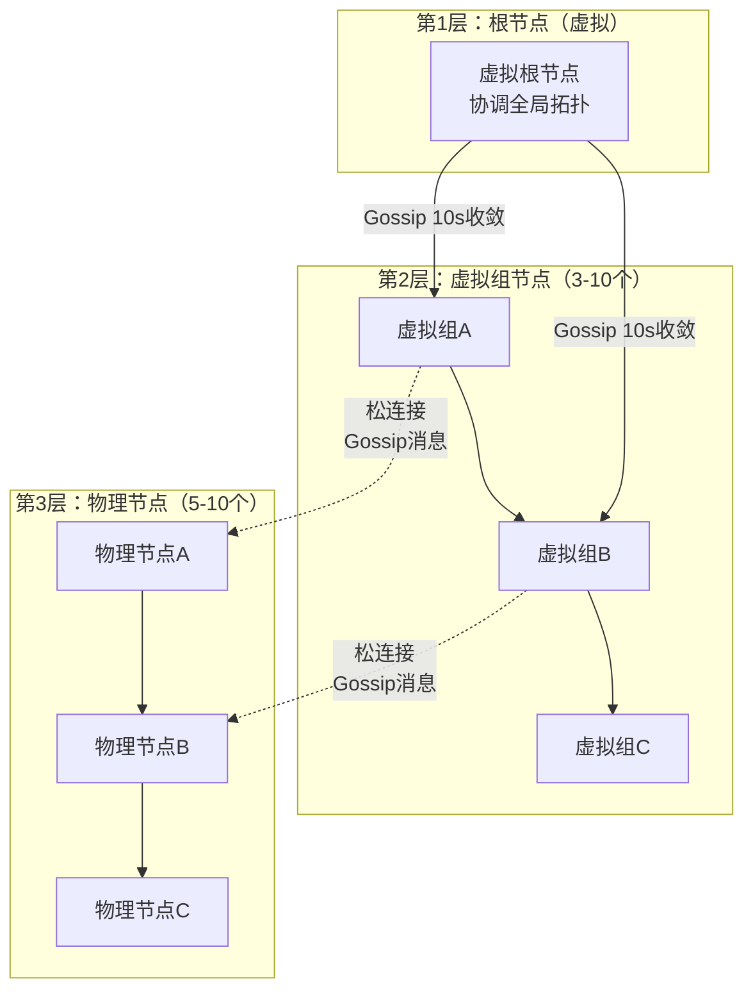
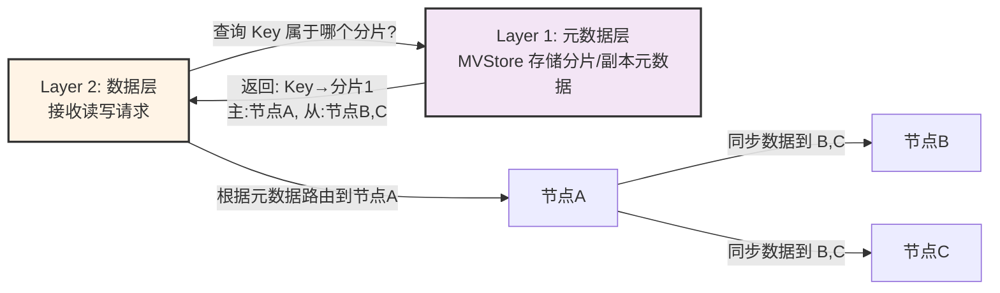
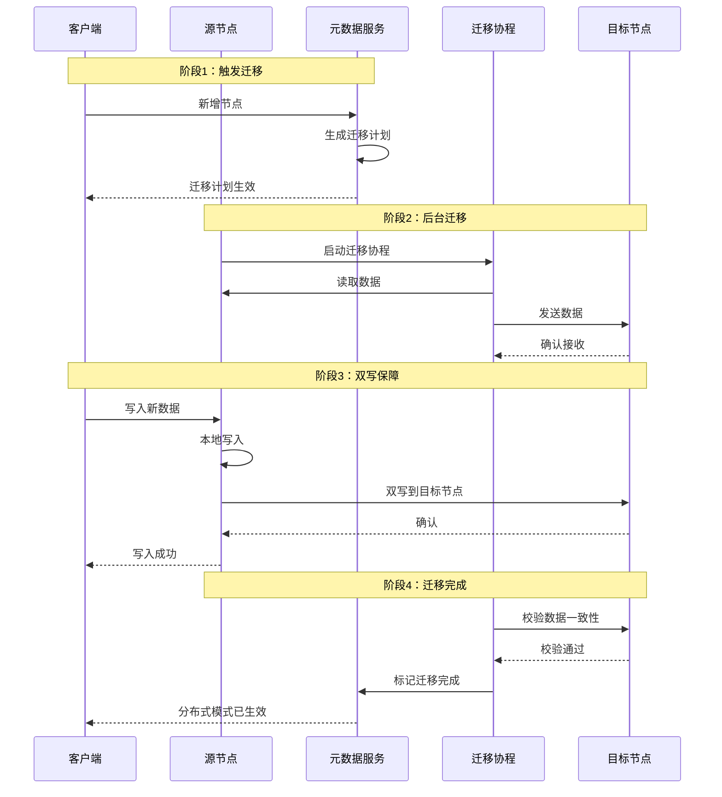

# 单机-分布式一体架构

> **文档版本**: v1.0
> **创建日期**: 2026-01-17
> **状态**: ✅ 核心架构说明

---

## 一、什么是「单机-分布式一体」？

传统数据库的"单机"和"分布式"是**两套独立架构**：
- 单机模式：单进程、单存储实例，无分片/副本、无共识协议，性能高但扩展性差；
- 分布式模式：多进程、多存储实例，依赖分片/副本/共识，扩展性好但复杂度高。

而 NexKV 的「单机-分布式一体」是**一套代码架构，两种部署形态**：

1. **单机模式**：仅启动 **1个物理节点**（如 `127.0.0.1:9211`），所有数据存储在本地，无需共识/分片/副本，性能与单机数据库一致；
2. **分布式模式**：启动多个物理节点（如 `192.168.1.10:9211`, `192.168.1.11:9211`, `192.168.1.12:9211`），自动触发分片/副本/Quorum 共识，无缝扩展；
3. **动态切换**：运行时可新增节点，后台异步完成数据迁移，无需停机，从单机平滑升级为分布式集群。

**核心目标**：**让用户像使用单机数据库一样使用分布式数据库**，屏蔽分布式的复杂性。

---

## 二、基于三层架构的「单机-分布式一体」实现方案

我们之前定义的三层架构，天然适配「单机-分布式一体」的设计，核心是**每层都做「单机/分布式」的抽象适配**，底层存储与上层分布式逻辑解耦。

### 2.1 Layer 3（存储引擎层）：单机存储与分布式存储的统一抽象

这是一体架构的**基石**——但需要澄清：**MVStore 是 Layer 1（元数据层）的存储**，不是 Layer 2 的分片存储。

**正确理解**：
- **MVStore 存储元数据**：分片信息、副本配置、节点拓扑
- **Layer 2（副本数据层）**：基于 MVStore 中的元数据进行数据路由和同步
- **Layer 2 没有独立的 MVStore**，它依赖 Layer 1 的元数据来管理数据分布

**关键抽象**：定义分片路由接口，屏蔽单机/分布式的数据差异：

```go
// 分片路由接口：基于元数据进行路由
type ShardRouter interface {
    Locate(key []byte) (*ShardLocation, error)  // 根据 Key 定位分片
    GetReplicas(shardID string) ([]string, error)  // 获取副本节点列表
}
```

---

### 2.2 Layer 2（副本数据层）：树形协调器与数据路由的核心

这是一体架构的**核心切换逻辑**——通过「树形协调器」和「元数据路由」实现单机和分布式的无缝衔接。

**树形协调器拓扑**

NexKV 使用**树形协调器**（TreeCoordinator）管理物理节点的拓扑关系：



| 层次 | 类型 | 数量范围 | 职责 |
|------|------|---------|------|
| **第1层** | 虚拟根节点 | 1 | 协调全局拓扑 |
| **第2层** | 虚拟组节点 | 3-10 | 节点分组管理 |
| **第3层** | 物理节点 | 5-10 | 真实的物理节点 |

**松连接架构**

节点间通过**松连接**通信：
- **网络连接**：TCP/IP，用于 RPC 调用
- **Gossip 消息连接**：周期性（10s）异步消息传播
- **父子关系松散**：逻辑上的，非强依赖，父节点故障不影响子节点

**单机 vs 分布式模式**

- **单机模式**：1 个物理节点，无副本，读写直接落地本地
- **分布式模式**：多个物理节点，自动分片和副本配置

**分片策略**

NexKV 支持多种分片策略：
- **一致性哈希**：适合节点动态增减场景
- **范围分片**：适合范围查询场景
- **哈希取模**：简单高效，适合固定节点数
- **自定义分片**：支持用户自定义逻辑

**元数据驱动的动态伸缩**

新增节点 → Layer 1 更新分片元数据 → 根据分片策略重新分配数据 → 后台异步迁移数据

---

### 2.3 Layer 1（元数据一致性层）：MVStore 存储分片/副本元数据

这是一体架构的**大脑**——**MVStore 存储分片和副本的元数据**，Layer 2 根据这些元数据进行数据路由。

**核心职责**：
- **存储分片元数据**：分片 ID、分片范围（Key 范围或哈希范围）、主副本节点、从副本节点列表
- **存储节点元数据**：节点 ID、地址、状态、角色
- **存储表元数据**：表 ID、名称、分片数量、分片映射关系
- **存储事务元数据**：跨分片事务状态、2PC 决策记录（Commit/Rollback）

- **单机模式**：
  - MVStore 中只有 **1 个分片元数据**（所有数据都在这个分片）
  - 元数据仅存储在本地 `MVStore` 中，无需 Gossip/Quorum 同步
  - 元数据变更直接修改本地存储，无任何一致性开销

- **分布式模式**：
  - MVStore 中有**多个分片元数据**（如 10 个分片的配置信息）
  - 关键元数据（分片创建、副本变更、2PC Commit 决策）触发 Quorum 多数派确认
  - 事务状态（2PC PreCommit、事务状态传播）通过 2PC 协议同步（分片内 Quorum + 跨分片 Gossip）
  - 普通元数据（节点状态）通过 Gossip 异步扩散
  - 所有节点的 MVStore 中的元数据最终一致

**关键切换点**：节点数阈值

- 当集群节点数 ≤1 时：
  - MVStore 中只有 1 个分片元数据
  - 关闭 Quorum/Gossip/2PC 逻辑，元数据和事务本地管理

- 当集群节点数 >1 时：
  - MVStore 中创建多个分片元数据
  - 启动 Quorum/Gossip/2PC 逻辑，元数据和事务分布式管理

**Layer 1 与 Layer 2 的协作**：



---

## 三、核心难点：后台异步数据迁移（单机→分布式的关键）

从单机切换到分布式，必然涉及**数据迁移**——将单机的完整数据拆分到多个节点的分片上。NexKV 的核心创新是**在 background 线程中异步完成数据迁移**，不影响前台业务读写。

### 3.1 数据迁移流程

假设单机模式有 1 个节点（NodeA），新增 2 个节点（NodeB、NodeC），升级为 3 节点分布式集群：

**1. 触发迁移**
- 新增节点后，Layer 1 检测到节点数>1，自动生成分片迁移计划
- 迁移计划通过 Quorum 多数派确认后生效

**2. 后台异步迁移**
- 启动迁移协程，从源节点读取数据
- 根据分片策略计算目标分片，异步发送到目标节点
- 迁移过程中**前台读写不受影响**：
  - 读请求：优先从本地读取，若数据已迁移则路由到目标节点
  - 写请求：双写源节点和目标节点，确保数据不丢失

**3. 迁移校验与完成**
- 目标节点接收数据后写入本地 MVStore，返回确认
- 校验源节点和目标节点的数据一致性（对比版本号）
- 标记分片迁移完成，源节点删除已迁移的数据

**迁移时序图**：



### 3.2 一致性保障

- **版本向量**：每个 Key 携带版本号，避免数据覆盖
- **双写机制**：迁移期间写请求双写源节点和目标节点
- **读修复**：若读请求发现数据版本不一致，自动触发异步修复

---

## 四、「单机-分布式一体」的核心优势

### 4.1 与传统数据库对比

| 特性 | 传统分布式数据库 | NexKV 单机-分布式一体 |
|------|------------------|-------------------------|
| 部署复杂度 | 必须部署多节点，依赖集群配置 | 支持单节点部署，开箱即用 |
| 性能损耗 | 分布式模式下有共识/分片开销 | 单机模式无任何分布式开销，性能与单机数据库一致 |
| 动态扩展 | 需停机配置分片/副本，数据迁移复杂 | 运行时无缝扩容，后台异步迁移数据，无需停机 |
| 运维成本 | 需维护分布式集群（节点、共识、副本） | 单机模式运维成本极低，分布式模式自动化运维 |
| 适用场景 | 大规模集群场景 | 从小规模单机到大规模分布式，全场景覆盖 |

### 4.2 多机器部署的核心价值

单机器集群只是「模拟分布式」，而多机器集群才是 NexKV 「单机-分布式一体」的**完整形态**：

1. **跨机器高可用**：副本部署在不同机器，单机器故障不会导致数据丢失或服务不可用
2. **跨机器性能扩展**：分片分散在不同机器，CPU、内存、IO 资源真正实现分布式利用
3. **故障隔离**：单机器故障只影响该机器上的分片/副本，其他机器的服务完全正常
4. **资源按需分配**：可以将不同模式的数据库部署在不同性能的机器上

### 4.3 多机器部署示例

假设有 3 台物理机，每台部署 2 个节点（共 6 个节点）：

```sql
CREATE DATABASE db3 RUN MODE sharding PARAMETERS(replication_factor: 2, assignment_factor: 5);
```

**集群特性**：
- 数据拆分为 `6节点 × 5 = 30个分片`，每个分片有 2 个副本
- 副本**跨物理机部署**：分片1的主副本在机器A，从副本在机器B；分片2的主副本在机器B，从副本在机器C
- **跨机器分片**：30个分片的主副本均匀分布在3台机器上，避免单机器性能瓶颈
- **跨机器副本**：每个分片的从副本部署在另一台机器上，实现单机器故障不影响分片可用性

---

## 七、总结

NexKV 的「单机-分布式一体」不是"单机和分布式二选一"，而是：

- 开发/测试阶段：用单机器集群的「单机模式」快速验证；
- 上线初期：用单机器集群的「副本模式」保证高可用；
- 业务增长期：扩容为多机器集群，切换到「分片模式」实现性能扩展；
- 全程无需更换数据库、重构代码——**一套架构，覆盖从单机到大规模分布式的全生命周期**。

**核心精髓**：三层架构如何支撑一体设计？

1. **Layer 3（KV 接口层）** 提供统一的事务接口，屏蔽底层复杂性；
2. **Layer 2（副本数据层）** 通过「树形协调器 + 元数据路由」，实现单机/分布式的无缝切换；
3. **Layer 1（元数据一致性层）** 通过「元数据模式自适应」，屏蔽分布式一致性的复杂性；
4. **后台异步数据迁移** 解决了单机→分布式的核心痛点，实现无缝扩展。

**树形协调器的关键作用**：

- **拓扑管理**：自动维护物理节点的树形拓扑关系，支持大规模集群（100-1000 节点）
- **松连接架构**：节点间通过 Gossip 协议进行异步消息传播，父子关系松散，不强制依赖
- **动态伸缩**：节点加入/离开时，自动调整树形结构，无需停机
- **故障隔离**：树形结构天然支持故障隔离，单节点故障只影响局部，不会导致整体崩溃
- **负载均衡**：通过树形层级实现元数据同步的负载均衡，避免单点瓶颈
- **单机模拟**：支持在单机上用不同 IP+Port 模拟多节点集群，便于开发测试

这套设计的精髓在于：**分布式能力是"附加"的，不是"侵入"的**——用户可以先以单机模式开发、测试、部署，当数据量增长到单机瓶颈时，只需新增节点，无需修改一行代码，就能平滑升级为分布式集群。

---

**文档版本**: v1.0
**最后更新**: 2026-01-17
**维护者**: NexKV 开发团队
