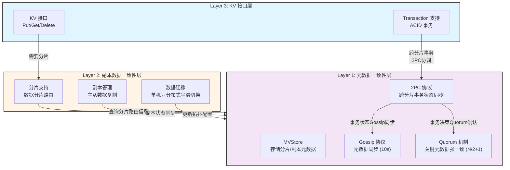
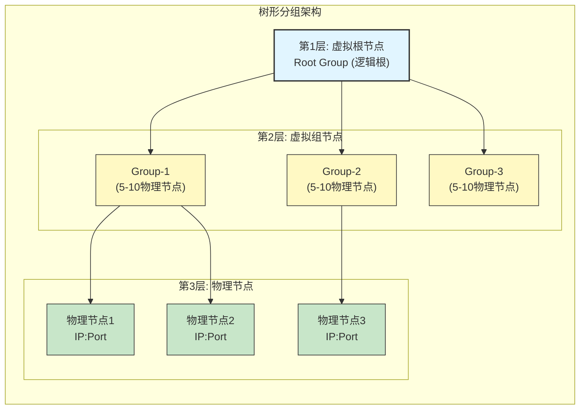

# 产品需求文档 (PRD)

> **文档版本**: v1.0
> **创建日期**: 2026-01-18
> **状态**: ✅ 已批准
> **对应文档**: 参见 `docs/00_overview/01_核心架构概念.md`

---

## 📋 文档概述

本文档定义 NexKV 分布式 KV 存储系统的产品需求，包括核心功能、非功能需求和产品定位。

### 核心定位

**NexKV 是一个轻量化、无中心化的分布式 KV 存储系统，采用三层架构设计，每个节点维护完整的元数据镜像，支持 3-1000 节点集群规模。**

---

## 1. 产品背景

### 1.1 现有问题

**传统中心化架构的痛点**：
- ❌ Metadata Server 是单点故障
- ❌ 所有元数据请求需要网络往返（10-50ms 延迟）
- ❌ 中心节点成为性能瓶颈
- ❌ 依赖外部服务（ZooKeeper/Etcd），部署复杂

**市场痛点**：
- 中小规模集群（3-50 节点）缺乏合适的分布式存储方案
- 现有方案要么过于复杂（需要外部协调者），要么无法平滑扩展
- 单机到分布式迁移成本高，需要架构重构

### 1.2 目标用户

**主要用户群体**：
1. **中小规模互联网企业**：3-50 节点集群，需要简单可靠的 KV 存储
2. **边缘计算场景**：需要快速部署、低运维成本的存储方案
3. **需要快速迭代的创业团队**：单机起步，平滑扩展到分布式

---

## 2. 产品愿景

### 2.1 核心价值主张

**"每个节点都维护一份完整的、全局一致的 metadata 镜像"**

```
┌────────────────────────────────────────────────────────────┐
│                    NexKV 集群                             │
├────────────────────────────────────────────────────────────┤
│                                                              │
│  Node-1              Node-2              Node-3            │
│  ┌─────────┐        ┌─────────┐        ┌─────────┐       │
│  │Metadata │        │Metadata │        │Metadata │       │
│  │  Store  │        │  Store  │        │  Store  │       │
│  │(完整镜像)│        │(完整镜像)│        │(完整镜像)│       │
│  └─────────┘        └─────────┘        └─────────┘       │
│       │                  │                  │              │
│       └──────────────────┴──────────────────┘              │
│                  Gossip 协议同步                            │
│         (最终一致 10 秒内,强一致需 2PC)                      │
└────────────────────────────────────────────────────────────┘
```

### 2.2 核心优势

| 优势 | 说明 |
|------|------|
| **无单点** | 每个节点都有完整副本，无中心节点 |
| **本地优先** | 元数据读取无网络开销，微秒级延迟 |
| **高性能** | 本地读取 < 1ms，写入延迟可控 |
| **简单部署** | 无外部依赖，二进制即可运行 |
| **平滑扩展** | 单机-分布式无缝切换 |

---

## 3. 核心功能需求

### 3.0 三层架构

**功能描述**：NexKV 采用三层分层架构，每层独立职责，协同工作，实现单机-分布式一体的高可用 KV 存储。



**架构关系**：
- **Layer 1（元数据层）**：用 MVStore 存储分片/副本的元数据
- **Layer 2（数据层）**：基于 Layer 1 的元数据进行分片路由和数据同步
- **Layer 3（KV 接口层）**：提供 KV 接口，基于 Layer 2 的分片支持跨分片事务

**验收标准**：
- ✅ 三层架构清晰分离
- ✅ 层间接口定义明确
- ✅ 支持独立测试和部署

### 3.1 单机-分布式一体

**功能描述**：一套架构同时支持单机和分布式部署，运行时无缝切换。

**子功能**：
1. **单机模式**
   - 单个物理节点运行（通过不同 IP+Port 模拟多节点）
   - 本地时钟替代全局时钟
   - 本地快照替代全局快照

2. **分布式模式**
   - 多个物理节点组网
   - 全局时钟同步（基于 Gossip）
   - 全局快照对齐

3. **平滑切换**
   - 单机 → 分布式：新增节点 → 后台异步数据迁移
   - 分布式 → 单机：下线节点 → 后台异步数据迁移

**验收标准**：
- ✅ 单机模式可独立运行
- ✅ 分布式模式可平滑切换
- ✅ 数据迁移过程业务无感知

### 3.2 分层一致性

**功能描述**：根据变更类型选择不同的一致性级别。

| 变更类型 | 一致性级别 | 机制 | 收敛时间 |
|---------|-----------|------|---------|
| **关键变更** | 强一致（2PC） | 全员 commit 或 rollback | < 100ms |
| **重要变更** | 增强最终一致（Quorum） | 多数派确认 | < 50ms |
| **普通变更** | 最终一致（Gossip） | 10 秒内异步扩散 | < 10 秒 |

**关键变更示例**：
- 分片创建
- 主副本切换
- 节点加入/移除

**重要变更示例**：
- 节点角色变更
- 分片副本调整

**普通变更示例**：
- 节点状态更新
- 负载信息刷新

**验收标准**：
- ✅ 2PC 保证原子性（全员 commit 或全员 rollback）
- ✅ Quorum 保证多数派确认
- ✅ Gossip 保证 10 秒内收敛

### 3.3 树形分组支持大规模集群

**功能描述**：通过树形分组 + 智能路由支持 100-1000 节点集群。

**架构设计**：


**松连接架构**：
- **连接方式**：TCP/IP + Gossip 协议（非紧密耦合）
- **拓扑同步**：周期性 Gossip 交换拓扑信息
- **故障隔离**：单节点故障不影响整体拓扑

**核心机制**：
1. **组内强一致（2PC）**：每组 5-10 个节点，全员确认
2. **组间最终一致（Gossip）**：10 秒内收敛
3. **智能路由**：尽量将事务分配到同一组内（90%+ 事务）

**适用场景**：
| 集群规模 | 推荐架构 | 组内确认时间 |
|---------|---------|------------|
| 3-50 节点 | 扁平架构 | < 50ms |
| 50-100 节点 | 扁平架构（开始吃力） | < 100ms |
| 100-1000 节点 | 树形分组 + 智能路由 | < 50ms |

**验收标准**：
- ✅ 100 节点集群：组内 2PC 延迟 < 50ms
- ✅ 1000 节点集群：组内 2PC 延迟 < 50ms
- ✅ 智能路由：90%+ 事务在组内完成

### 3.4 分片策略

**功能描述**：支持多种分片策略，适应不同业务场景。

**分片策略列表**：

| 策略 | 说明 | 适用场景 |
|------|------|---------|
| **一致性哈希** | 基于一致性哈希算法分配分片 | 数据均匀分布，适合大规模集群 |
| **范围分片** | 按键范围分配分片 | 范围查询优化，适合时序数据 |
| **哈希取模** | 简单哈希取模 | 快速定位，适合小规模集群 |
| **自定义分片** | 用户自定义分片逻辑 | 特殊业务需求 |

**验收标准**：
- ✅ 支持至少 4 种分片策略
- ✅ 分片策略可动态切换
- ✅ 分片迁移过程业务无感知

### 3.5 元数据管理

**功能描述**：每个节点维护完整的元数据镜像，支持本地快速读取。

**元数据类型**：
1. **分片元数据**：分片 ID、范围、副本关系
2. **节点元数据**：节点 ID、地址、状态
3. **表元数据**：表 ID、名称、分片数量

**存储方式**：
- 每个节点本地存储完整元数据镜像
- 数据持久化在 MVStore（内存 + 磁盘）
- 通过 Gossip 协议保持节点间一致性
- 使用版本号和变更日志支持增量同步

**验收标准**：
- ✅ 本地读取延迟 < 1ms（无网络请求）
- ✅ 元数据同步 10 秒内收敛
- ✅ 支持增量同步（只传输变更部分）

### 3.6 故障自愈

**功能描述**：自动检测节点故障，触发补偿机制。

**故障类型**：
1. **节点崩溃**：心跳超时 → 标记故障 → 触发 2PC 补偿
2. **网络分区**：Gossip 检测 → 少数派回滚 → 多数派继续
3. **数据不一致**：版本向量检测 → 冲突解决 → 数据修复

**自愈流程**：
```
故障发生
    ↓
故障检测（心跳超时）
    ↓
状态确认（多节点确认）
    ↓
补偿决策（查询事务状态）
    ↓
自动补偿（Commit/Rollback）
    ↓
状态恢复
```

**验收标准**：
- ✅ 故障检测时间 < 10 秒
- ✅ 自动恢复成功率 > 99%
- ✅ 无人工干预

---

## 4. 非功能需求

### 4.1 性能要求

| 指标 | 目标值 | 测试方法 |
|------|--------|---------|
| **元数据查询延迟** | < 1ms（本地读取） | 性能测试 |
| **Gossip 扩散延迟** | < 10 秒（7 节点集群） | 集成测试 |
| **2PC 决策延迟** | < 100ms（组内全员确认） | 性能测试 |
| **吞吐量** | > 10000 ops/s（元数据操作） | 压力测试 |

### 4.2 可用性要求

| 指标 | 目标值 | 说明 |
|------|--------|------|
| **集群可用性** | > 99.9% | 允许每年 < 8.76 小时停机 |
| **故障恢复时间** | < 10 秒 | 自动检测 + 自动恢复 |
| **数据持久性** | > 99.999999% | 基于 WAL + 多副本 |

### 4.3 扩展性要求

| 集群规模 | 支持架构 | 备注 |
|---------|---------|------|
| **3-50 节点** | 扁平架构 | Gossip + 组内全确认 |
| **50-100 节点** | 扁平架构（可选分组） | Gossip 性能开始下降 |
| **100-1000 节点** | 树形分组 + 智能路由 | 组内 2PC + 组间 Gossip |

### 4.4 兼容性要求

**运行环境**：
- 操作系统：Linux（推荐）、macOS、Windows
- Go 版本：>= 1.21
- 硬件要求：最小 2 核 CPU、4GB 内存

**客户端兼容**：
- Go SDK（原生）
- gRPC（多语言支持）
- REST API（可选）

---

## 5. 约束与假设

### 5.1 技术约束

1. **无外部依赖**：不依赖 ZooKeeper、Etcd 等外部协调者
2. **Go 语言实现**：所有代码使用 Go 语言编写
3. **TLA+ 验证**：核心协议必须通过形式化验证

### 5.2 业务假设

1. **元数据量小**：单个集群元数据总量 < 10GB
2. **网络稳定**：节点间网络延迟 < 100ms（局域网环境）
3. **可信环境**：节点间通信是可信的（不需要加密）

---

## 6. 里程碑规划

### Phase 1: 基础设施（1-2 周）
- [ ] 项目结构搭建
- [ ] 配置管理
- [ ] 日志系统

### Phase 2: 存储层（2-3 周）
- [ ] MVStore 实现
- [ ] 双层 WAL 实现
- [ ] 崩溃恢复机制

### Phase 3: 网络通信层（2-3 周）
- [ ] TCP Transport
- [ ] 自定义帧格式
- [ ] MessagePack 编解码

### Phase 4: 一致性协议（3-4 周）
- [ ] Gossip 协议
- [ ] Quorum 机制
- [ ] 2PC 协议

### Phase 5: 节点管理层（2-3 周）
- [ ] 树形协调器
- [ ] Leader 选举
- [ ] 故障检测
- [ ] 自愈机制

### Phase 6: 单机-分布一体（2-3 周）
- [ ] 虚拟节点抽象
- [ ] 模式切换
- [ ] 数据迁移

### Phase 7: 测试验证（2-3 周）
- [ ] 45 个测试用例
- [ ] 性能基准测试
- [ ] 长期稳定性测试

**预计总工期**：14-20 周

---

## 7. 成功标准

### 7.1 功能验收

- [ ] 支持 3-50 节点集群（扁平架构）
- [ ] 支持 100-1000 节点集群（树形分组）
- [ ] 单机-分布式平滑切换
- [ ] 分层一致性正常工作
- [ ] 故障自愈机制正常运行

### 7.2 性能验收

- [ ] Gossip 扩散延迟 < 10 秒
- [ ] 2PC 决策延迟 < 100ms
- [ ] 元数据查询延迟 < 1ms
- [ ] 崩溃恢复时间 < 5 秒

### 7.3 质量验收

- [ ] 单元测试覆盖率 > 80%
- [ ] 集成测试场景 > 45 个
- [ ] 24 小时稳定运行
- [ ] TLA+ 模型性质验证通过

---

## 8. 相关文档

### 输入文档
- `docs/00_overview/01_核心架构概念.md` - 核心架构理念
- `docs/06_project_management/project_plan.md` - 实施计划

### 输出文档
- `docs/01_requirement_planning/TRD.md` - 技术需求文档
- `docs/02_design/architecture/SAD.md` - 系统架构设计文档

### 参考文档
- `docs/README.md` - 文档目录说明

---

**文档版本**: v1.0
**最后更新**: 2026-01-18
**维护者**: NexKV 开发团队
**状态**: ✅ 已批准
