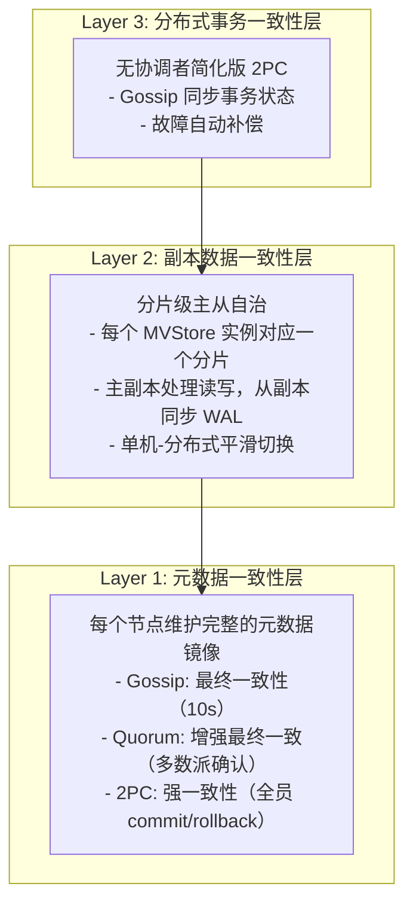

# 技术需求文档 (TRD)

> **文档版本**: v1.0
> **创建日期**: 2026-01-18
> **状态**: ✅ 已批准
> **对应文档**: 参见 `docs/02_design/` 目录下的相关文档

---

## 📋 文档概述

本文档详细定义 NexKV 的技术需求，包括架构选型、技术栈、接口定义和性能指标。

### 核心技术原则

1. **轻量化**：无外部依赖，自主可控
2. **高性能**：充分利用现代硬件
3. **简单性**：易于理解和维护
4. **可验证**：支持 TLA+ 形式化验证

---

## 1. 架构需求

### 1.1 三层架构设计

NexKV 采用三层架构，各层职责清晰：



### 1.2 分层一致性模型

| 层级 | 一致性级别 | 机制 | 收敛时间 | 典型场景 |
|------|-----------|------|---------|---------|
| **L1 元数据层** | 分层一致性 | Gossip / Quorum / 2PC | < 10s / < 50ms / < 100ms | 元数据同步 |
| **L2 数据层** | 可选一致性 | 主从异步 / 同步复制 | < 10ms / < 50ms | 数据读写 |
| **L3 事务层** | 最终一致 | Gossip 状态同步 + 补偿 | < 10s | 跨分片事务 |

---

## 2. 技术栈需求

### 2.1 核心技术栈

| 层级 | 技术选型 | 版本要求 | 理由 |
|------|---------|---------|------|
| **语言** | Go | >= 1.21 | 原生并发、高性能、简单部署 |
| **存储** | sync.Map + WAL | - | 零依赖、高性能、MVCC 支持 |
| **网络** | TCP + 自定义帧 | - | 零开销、完全控制、TLA+ 验证 |
| **运维** | gRPC + Protobuf | latest | 标准化、跨语言、工具完善 |
| **序列化** | MessagePack | latest | 无需 IDL、性能好、兼容性 |
| **并发** | goroutine + channel | - | 语言级支持、轻量级 |
| **日志** | zap | latest | 零分配、高性能 |
| **配置** | Viper | latest | 多格式、多来源 |
| **测试** | testify + gomega | latest | 功能丰富、BDD 支持 |
| **监控** | Prometheus | latest | 标准化、Pull 模式 |

### 2.2 存储引擎需求

**最终选择**：sync.Map + WAL

**需求理由**：
1. **数据规模**：元数据量小（< 1GB），内存表完全够用
2. **性能要求**：读写延迟 < 10ms，内存表微秒级响应
3. **一致性要求**：MVCC 需要版本支持，内存表易于实现
4. **持久化**：WAL 提供崩溃恢复，满足 ACID

**数据结构**：
```go
type MVStore interface {
    Put(key string, value []byte) error
    Get(key string) ([]byte, error)
    Delete(key string) error
    GetVersion(key string, version uint64) ([]byte, error)
    Flush() error
    Close() error
}
```

**性能指标**：
- 读取延迟：< 1μs（内存读取）
- 写入延迟：< 10μs（内存写入 + WAL 刷盘）
- 吞吐量：> 100000 ops/s

### 2.3 网络协议需求

**核心协议**：TCP + 自定义帧

**帧格式设计**（16 字节帧头）：

| Magic (4B) | Type (2B) | Codec (2B) | Length (4B) | CRC32 (4B) | Data (N) |
|:-----------:|:---------:|:----------:|:-----------:|:----------:|:--------:|
| "NxKV" | 100-352 | 1-3 | N bytes | N bytes | N bytes |

**字段说明**：
1. **Magic (4B)**：`"NxKV"` ASCII 字符串，快速帧识别
2. **Type (2B)**：消息类型，支持 65536 种（当前用 100-352）
3. **CodecType (2B)**：编解码器类型
   - `1`: MessagePack（默认，高性能二进制）
   - `2`: JSON（调试和日志）
   - `3`: Protobuf（预留，未来扩展）
4. **Length (4B)**：支持最大 4GB 消息
5. **CRC32 (4B)**：IEEE CRC32 校验和，检测传输错误

**消息类型分配**：
| Type 范围 | 用途 | 数量 |
|-----------|------|------|
| 100-199 | 核心业务（2PC、KV 操作） | 10+ |
| 200-299 | 集群基础设施（心跳、发现） | 15+ |
| 300-308 | 树管理（拓扑、选举、主备） | 9 |

**性能指标**：
- 序列化延迟：< 10μs（MessagePack）
- 网络延迟：< 1ms（局域网环境）
- 吞吐量：> 10000 msg/s

---

## 3. 核心模块需求

### 3.1 元数据存储层（Layer 1）

> **💡 实现说明**：实际代码中 `MetadataStore` 是一个 struct，封装了底层存储（MVStore）和一致性协议。此处接口定义描述的是功能规范。

#### 3.1.1 存储接口规范

```go
// 功能接口定义（规范描述，非实际代码）
type MetadataStore interface {
    // CRUD 操作（操作本地镜像）
    CreateMetadata(meta *Metadata) error
    UpdateMetadata(meta *Metadata) error
    DeleteMetadata(id string) error
    GetMetadata(id string) (*Metadata, error)  // 本地读取，无网络
    ListMetadata(filter *MetadataFilter) ([]*Metadata, error)

    // 版本管理
    GetVersion() uint64
    GetChangeLogs(since uint64) ([]*ChangeLog, error)
    ApplyChangeLogs(logs []*ChangeLog) error
}
```

**实际实现**：
- `MetadataStore` 是服务层 struct，包含 Gossip、Quorum、2PC 等协议
- 底层数据存储在 MVStore（内存 map + 磁盘 WAL）
- 参考代码：`internal/metadata/consensus/metadata_store.go`

#### 3.1.2 双层 WAL 架构

**元数据 WAL**：
- 保留时间：30 天
- 用途：元数据变更日志、崩溃恢复

**业务 WAL**：
- 保留时间：3 个月
- 用途：业务数据变更、审计追溯

**WAL 接口**：
```go
type WAL interface {
    Append(entry WALEntry) error
    Recover() ([]WALEntry, error)
    Truncate(offset int64) error
    Close() error
}
```

### 3.2 网络通信层

#### 3.2.1 Transport 接口

```go
type Transport interface {
    Start() error
    Stop() error
    Send(addr string, msg Message) error
    Broadcast(msg Message) error
    Receive() <-chan Message
}
```

#### 3.2.2 编解码器接口

```go
type Codec interface {
    Encode(msg Message) ([]byte, error)
    Decode(data []byte) (Message, error)
    Name() string
}
```

**实现**：
- `MessagePackCodec`：默认高性能二进制编解码器
- `JSONCodec`：调试和日志专用

### 3.3 一致性协议层

#### 3.3.1 Gossip 协议

**配置参数**：
```go
type GossipConfig struct {
    Interval      time.Duration // 10s - 同步间隔
    Fanout        int           // 2   - 每轮随机节点数
    Timeout       time.Duration // 5s  - 单次同步超时
    MaxChangeLogs int           // 1000 - 最大变更日志数
}
```

**性能指标**：
- 收敛时间：< 10 秒（7 节点集群）
- 网络开销：每个节点每轮发送 2 个请求

#### 3.3.2 Quorum 机制

**配置参数**：
```go
type QuorumConfig struct {
    Timeout    time.Duration // 30s - 投票超时
    RetryCount int           // 3    - 重试次数
    MinQuorum  int           // 0    - 最小法定人数（0=自动计算N/2+1）
}
```

**性能指标**：
- 决策延迟：< 50ms（局域网）
- 可用性：容忍少数节点故障

> **⚠️ 注意**：Quorum 只能保证最终一致性（允许脑裂场景），真正的强一致性需要 2PC

#### 3.3.3 TwoPC 协议

**配置参数**：
```go
type TwoPCConfig struct {
    GossipInterval time.Duration // 5s - Gossip 同步间隔
    Timeout        time.Duration // 30s - 事务超时
}
```

**优化点**：
- 发起节点兼任协调者（无独立 TM）
- 砍掉 Prepare 阶段（直接预提交）
- Gossip 同步状态（异步扩散）

**性能指标**：
- 决策延迟：< 100ms（组内全员确认）
- 可用性：容忍组外节点故障

### 3.4 节点管理层

#### 3.4.1 树形协调器

**配置参数**：
```go
type TreeCoordinatorConfig struct {
    MaxChildren int // 10 - 每个父节点最多子节点数
    MaxLevel     int // 4  - 树的最大深度（支持 1000+ 节点）
}
```

**节点容量计算**：
- MaxLevel=4, MaxChildren=10: 最多 1+10+100+1000=**1111 个节点**

**节点结构**：
```go
type Node struct {
    NodeID      string
    ParentID    string
    ChildrenIDs []string
    Level       int
}
```

#### 3.4.2 分组管理（大规模集群支持）

**配置参数**：
```go
type GroupConfig struct {
    GroupSize    int    // 10 - 每组节点数
    MaxGroups    int    // 200 - 最大组数
    SyncInterval int    // 10s - 组间同步间隔
}
```

**智能路由策略**：
1. **数据亲和性**：相关数据尽量分配到同一组
2. **事务局部化**：90%+ 事务在组内完成
3. **跨组事务最小化**：通过分片策略减少跨组访问

---

## 4. 性能需求

### 4.1 延迟要求

| 操作类型 | 目标延迟 | 测试方法 |
|---------|---------|---------|
| **元数据查询** | < 1ms（本地读取） | 性能测试 |
| **元数据写入** | < 10ms（含 WAL） | 性能测试 |
| **Gossip 扩散** | < 10 秒（7 节点） | 集成测试 |
| **Quorum 决策** | < 50ms | 集成测试 |
| **2PC 决策** | < 100ms（组内） | 集成测试 |

### 4.2 吞吐量要求

| 操作类型 | 目标吞吐量 | 测试方法 |
|---------|-----------|---------|
| **元数据读取** | > 100000 ops/s | 压力测试 |
| **元数据写入** | > 10000 ops/s | 压力测试 |
| **Gossip 消息** | > 1000 msg/s | 压力测试 |
| **网络传输** | > 1 GB/s | 网络测试 |

### 4.3 资源要求

| 资源类型 | 最小配置 | 推荐配置 |
|---------|---------|---------|
| **CPU** | 2 核 | 4 核+ |
| **内存** | 4 GB | 8 GB+ |
| **磁盘** | 100 GB SSD | 500 GB SSD |
| **网络** | 1 Gbps | 10 Gbps |

---

## 5. 可靠性需求

### 5.1 持久性保证

**WAL 机制**：
- 所有写入先写 WAL，再更新内存表
- WAL 定期刷盘（默认 1 秒）
- 崩溃恢复：重放 WAL 恢复状态

**数据副本**：
- 元数据：每个节点完整副本
- 业务数据：可配置副本数（默认 3 副本）

### 5.2 故障恢复

**故障检测**：
- 心跳机制：5 秒间隔
- 超时判定：连续 3 次心跳失败 → 标记故障

**自动恢复**：
- 故障节点重启：读取本地事务状态表
- Gossip 查询事务状态：确认最终状态
- 补偿机制：回放 WAL 日志，完成事务

**恢复时间要求**：
- 故障检测：< 10 秒
- 自动恢复：< 5 秒
- 数据完全恢复：< 30 秒

### 5.3 数据一致性

**一致性级别**：
| 场景 | 一致性级别 | 保证机制 |
|------|-----------|---------|
| **元数据本地读取** | 强一致 | 本地读取，无一致性问题 |
| **元数据跨节点读取** | 最终一致 | Gossip 10 秒内收敛 |
| **关键变更** | 强一致 | 2PC 全员 commit 或 rollback |
| **重要变更** | 增强最终一致 | Quorum 多数派确认 |
| **普通变更** | 最终一致 | Gossip 异步扩散 |

---

## 6. 可维护性需求

### 6.1 日志系统

**日志级别**：
- Debug：开发调试
- Info：关键操作
- Warn：异常情况
- Error：错误信息
- Fatal：致命错误

**日志格式**：
- 结构化日志（JSON 格式）
- 包含时间戳、级别、模块、消息、字段

**日志轮转**：
- 按大小轮转（单文件最大 100MB）
- 按时间轮转（每天轮转）
- 保留时间（默认 30 天）

### 6.2 监控指标

**系统指标**：
- CPU 使用率
- 内存使用率
- 磁盘使用率
- 网络流量

**业务指标**：
- 元数据操作 QPS
- Gossip 收敛时间
- Quorum 决策时间
- 2PC 事务成功率

**自定义指标**：
- 节点健康状态
- 分片副本状态
- 事务状态分布

### 6.3 配置管理

**配置来源**（优先级从高到低）：
1. 命令行参数
2. 环境变量
3. 配置文件（YAML）
4. 默认值

**热更新支持**：
- 日志级别
- 监控指标采集频率
- 部分协议参数（Gossip 间隔等）

---

## 7. 安全性需求

### 7.1 网络安全

**部署环境假设**：
- 可信网络（局域网或 VPN）
- 节点间通信无需加密
- 生产环境建议使用防火墙隔离

**可选安全增强**：
- TLS 加密（跨数据中心部署）
- 证书认证（客户端认证）
- IP 白名单（访问控制）

### 7.2 数据安全

**访问控制**：
- 基于角色的访问控制（RBAC）
- 操作审计日志
- 敏感操作二次确认

**数据加密**（可选）：
- 传输加密：TLS
- 存储加密：磁盘加密

---

## 8. 兼容性需求

### 8.1 运行环境兼容性

**操作系统**：
- Linux（推荐）：Ubuntu 20.04+、CentOS 8+
- macOS：Big Sur 11+
- Windows：Windows 10+（WSL2）

**Go 版本**：
- 最低：Go 1.21
- 推荐：Go 1.22+

### 8.2 客户端兼容性

**原生 SDK**：
- Go SDK（完整功能）

**多语言支持**（gRPC）：
- Java
- Python
- C++
- Node.js

**REST API**（可选）：
- HTTP/JSON
- 适用于简单场景

---

## 9. 扩展性需求

### 9.1 水平扩展

**扩展方式**：
- 新增节点 → 自动加入集群
- 元数据自动同步
- 数据自动迁移（后台异步）

**扩展限制**：
- 扁平架构：推荐 3-50 节点
- 分组架构：支持 100-1000 节点

### 9.2 垂直扩展

**升级路径**：
1. **存储引擎**：内存表 → BadgerDB → RocksDB
2. **序列化**：MessagePack → Protobuf
3. **部署**：二进制 → Docker → Kubernetes

**扩展性原则**：
- 接口抽象：支持多种实现
- 配置驱动：运行时可切换
- 平滑迁移：无需停机

---

## 10. 验证需求

### 10.1 TLA+ 形式化验证

**验证范围**：
- Gossip 协议正确性
- Quorum 机制一致性
- 2PC 协议原子性
- 树形协调器无死锁

**验证方法**：
- 模型检查：TLC 模型检查器
- 性能模拟：模拟不同集群规模
- 性质验证：Liveness、Safety

**验收标准**：
- 所有模型性质验证通过
- 无死锁、活锁
- 收敛时间符合设计

### 10.2 集成测试需求

**测试场景**：
- 3 节点集群：15 个测试用例
- 7 节点集群：15 个测试用例
- 10 节点集群：15 个测试用例

**测试覆盖**：
- 正常流程
- 节点故障
- 网络分区
- 并发冲突

---

## 11. 相关文档

### 输入文档
- `docs/02_design/` 目录下的技术选型相关文档
- `docs/01_requirement_planning/PRD.md`

### 输出文档
- `02_design/architecture/SAD.md` - 系统架构设计文档
- `02_design/protocols/CPD.md` - 一致性协议设计文档

### 参考文档
- `docs/workflow.md` - 开发流程规范

---

**文档版本**: v1.0
**最后更新**: 2026-01-18
**维护者**: NexKV 开发团队
**状态**: ✅ 已批准
