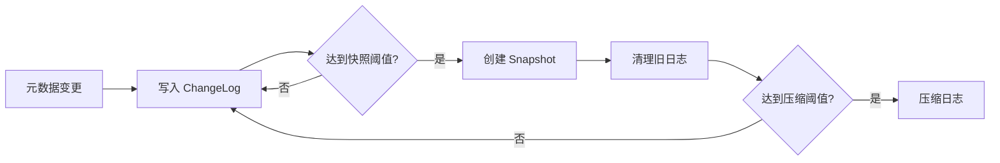

# API 接口设计文档 (APID)

> **文档版本**: v1.0
> **创建日期**: 2026-01-18
> **状态**: ✅ 已完成
> **对应源文档**: 参见 `docs/02_design/` 目录下的相关文档

---

## 📋 文档概述

本文档详细定义 NexKV 三层架构的所有 API 接口，包括：
- **Layer 1（元数据层）**：元数据管理接口
- **Layer 2（副本数据层）**：数据读写接口
- **Layer 3（分布式事务层）**：事务协调接口
- **网络通信层**：Transport 接口和消息类型
- **存储层**：MVStore 和 WAL 接口

### 接口设计原则

| 原则 | 说明 | 示例 |
|------|------|------|
| **简洁性** | 接口最小化，每个方法职责单一 | `Get(key) ([]byte, error)` |
| **幂等性** | 关键操作支持重复调用 | `CreateMetadata()` 已存在则返回成功 |
| **容错性** | 所有接口显式返回错误 | `Put(key, value) error` |
| **可扩展** | 预留扩展字段 | `Config struct { ... Extra map[string]interface{} }` |

---

## 1. Layer 1: 元数据层接口

### 1.1 MetadataStore 接口

**核心元数据存储接口**，提供元数据 CRUD 和版本管理功能。

```go
// internal/metadata/store/metadata_store.go
package store

// MetadataStore 元数据存储接口
type MetadataStore interface {
    // === 基础 CRUD 操作（操作本地镜像） ===

    // CreateMetadata 创建元数据
    // 返回错误：如果已存在则返回 ErrAlreadyExists
    CreateMetadata(meta *Metadata) error

    // UpdateMetadata 更新元数据
    // 返回错误：如果不存在则返回 ErrNotFound
    UpdateMetadata(meta *Metadata) error

    // DeleteMetadata 删除元数据
    // 返回错误：如果不存在则返回 ErrNotFound
    DeleteMetadata(id string) error

    // GetMetadata 获取元数据（本地读取，无网络调用）
    // 返回错误：如果不存在则返回 ErrNotFound
    GetMetadata(id string) (*Metadata, error)

    // ListMetadata 列出元数据（支持过滤）
    ListMetadata(filter *MetadataFilter) ([]*Metadata, error)

    // === 版本管理 ===

    // GetVersion 获取当前版本号
    GetVersion() uint64

    // GetChangeLogs 获取变更日志（增量同步）
    // since: 起始版本号（不包含），0 表示获取全部
    GetChangeLogs(since uint64) ([]*ChangeLog, error)

    // ApplyChangeLogs 应用变更日志（来自其他节点）
    // 返回错误：版本冲突返回 ErrVersionConflict
    ApplyChangeLogs(logs []*ChangeLog) error

    // === 持久化 ===

    // Flush 将内存数据刷盘
    Flush() error

    // Close 关闭存储
    Close() error
}
```

**使用示例**：
```go
// 创建分片元数据
shardMeta := &Metadata{
    ID:        "shard-001",
    Type:      MetadataTypeShard,
    Version:   1,
    CreatedAt: time.Now(),
    Data:      shardData,
}

if err := store.CreateMetadata(shardMeta); err != nil {
    if errors.Is(err, ErrAlreadyExists) {
        // 已存在，执行更新
        return store.UpdateMetadata(shardMeta)
    }
    return err
}

// 获取元数据（本地读取，微秒级延迟）
meta, err := store.GetMetadata("shard-001")
if err != nil {
    return err
}

// 增量同步
logs, err := remoteStore.GetChangeLogs(localVersion)
if err != nil {
    return err
}
return store.ApplyChangeLogs(logs)
```

---

### 1.2 Metadata 数据结构

```go
// internal/metadata/types/metadata.go
package types

// MetadataType 元数据类型
type MetadataType uint8

const (
    MetadataTypeUnknown MetadataType = iota
    MetadataTypeShard                  // 分片元数据
    MetadataTypeNode                   // 节点元数据
    MetadataTypeGroup                  // 分组元数据
    MetadataTypeSchema                 // Schema 元数据
)

// Metadata 元数据结构
type Metadata struct {
    // === 基础字段 ===
    ID        string         // 唯一标识符
    Type      MetadataType   // 元数据类型
    Version   uint64         // 版本号（单调递增）

    // === 时间戳 ===
    CreatedAt time.Time      // 创建时间
    UpdatedAt time.Time      // 更新时间

    // === 数据负载 ===
    Data      []byte         // 元数据内容（MessagePack 序列化）

    // === 扩展字段 ===
    Extra     map[string]string // 扩展属性
}
```

---

### 1.3 ChangeLog 数据结构

```go
// internal/metadata/types/changelog.go
package types

// ChangeLog 变更日志（用于增量同步）
type ChangeLog struct {
    // === 基础字段 ===
    Version   uint64         // 版本号
    Timestamp int64          // Unix 时间戳（毫秒）

    // === 操作类型 ===
    OpType    OpType         // 操作类型

    // === 元数据 ===
    MetaID    string         // 元数据 ID
    MetaType  MetadataType   // 元数据类型
    MetaData  []byte         // 元数据内容（MessagePack 序列化）
}

// OpType 操作类型
type OpType uint8

const (
    OpTypeCreate OpType = iota + 1
    OpTypeUpdate
    OpTypeDelete
)
```

**变更日志缓存策略**：
- 默认保留最近 1000 条变更日志
- 超过 30 天的日志自动清理
- 支持按版本范围查询

---

### 1.4 ChangeLogManager 接口

**变更日志管理接口**，提供变更日志的生命周期管理功能。

```go
// internal/metadata/changelog/manager.go
package changelog

// ChangeLogManager 变更日志管理接口
type ChangeLogManager interface {
    // === 日志查询 ===

    // QueryChangeLogs 查询变更日志（支持多条件过滤）
    // 支持按时间范围、操作类型、元数据类型等条件查询
    QueryChangeLogs(filter *ChangeLogFilter) ([]*ChangeLog, error)

    // GetChangeLogByVersion 根据版本号获取单条变更日志
    GetChangeLogByVersion(version uint64) (*ChangeLog, error)

    // GetLatestChangeLogs 获取最新的 N 条变更日志
    GetLatestChangeLogs(n int) ([]*ChangeLog, error)

    // === 日志清理 ===

    // PruneOldChangeLogs 清理旧的变更日志
    // beforeTime: 清理此时间之前的日志
    // 保留策略：至少保留最近 100 条或 7 天的日志
    PruneOldChangeLogs(beforeTime time.Time) error

    // PruneChangeLogsByVersion 按版本号清理日志
    // 保留版本号 >= keepVersion 的日志
    PruneChangeLogsByVersion(keepVersion uint64) error

    // === 日志压缩 ===

    // CompactChangeLogs 压缩变更日志
    // 将多条连续的日志合并为一条快照，减少日志量
    // 返回压缩后的日志数量和释放的空间
    CompactChangeLogs(beforeVersion uint64) (compactedCount int64, freedSpace int64, err error)

    // === 快照管理 ===

    // CreateSnapshot 创建元数据快照
    // 快照包含所有元数据的完整状态，用于快速恢复
    CreateSnapshot() (*Snapshot, error)

    // RestoreFromSnapshot 从快照恢复元数据状态
    // 返回恢复的元数据数量
    RestoreFromSnapshot(snapshot *Snapshot) (restoredCount int, err error)

    // ListSnapshots 列出所有可用的快照
    ListSnapshots() ([]*Snapshot, error)

    // DeleteSnapshot 删除指定的快照
    DeleteSnapshot(snapshotID string) error

    // === 日志重放 ===

    // ReplayChangeLogs 重放变更日志
    // 用于故障恢复或从快照后的增量恢复
    // 返回重放的日志数量
    ReplayChangeLogs(logs []*ChangeLog) (replayedCount int, err error)

    // === 统计信息 ===

    // GetStats 获取变更日志统计信息
    GetStats() (*ChangeLogStats, error)
}
```

**使用示例**：
```go
// 创建快照
snapshot, err := changelogMgr.CreateSnapshot()
if err != nil {
    return fmt.Errorf("创建快照失败: %w", err)
}

// 清理 30 天前的旧日志
cutoffTime := time.Now().AddDate(0, 0, -30)
if err := changelogMgr.PruneOldChangeLogs(cutoffTime); err != nil {
    return fmt.Errorf("清理旧日志失败: %w", err)
}

// 压缩日志（保留最新 1000 条）
latestVersion := store.GetVersion()
keepVersion := latestVersion - 1000
if keepVersion > 0 {
    compacted, freed, err := changelogMgr.CompactChangeLogs(keepVersion)
    if err != nil {
        return fmt.Errorf("压缩日志失败: %w", err)
    }
    log.Printf("压缩了 %d 条日志，释放 %d 字节", compacted, freed)
}
```

---

### 1.5 ChangeLogFilter 数据结构

```go
// internal/metadata/changelog/filter.go
package changelog

// ChangeLogFilter 变更日志过滤器
type ChangeLogFilter struct {
    // === 版本范围 ===
    MinVersion *uint64       // 最小版本号（可选）
    MaxVersion *uint64       // 最大版本号（可选）

    // === 时间范围 ===
    StartTime  *time.Time    // 起始时间（可选）
    EndTime    *time.Time    // 结束时间（可选）

    // === 操作类型 ===
    OpTypes    []OpType      // 操作类型列表（可选）

    // === 元数据类型 ===
    MetaTypes  []MetadataType // 元数据类型列表（可选）

    // === 元数据 ID ===
    MetaIDs    []string      // 元数据 ID 列表（可选）

    // === 分页 ===
    Offset     int           // 偏移量（默认 0）
    Limit      int           // 限制数量（默认 100，最大 1000）
}
```

---

### 1.6 Snapshot 数据结构

```go
// internal/metadata/changelog/snapshot.go
package changelog

// Snapshot 元数据快照
type Snapshot struct {
    // === 基础字段 ===
    ID        string         // 快照 ID（UUID）
    Version   uint64         // 快照版本号
    CreatedAt time.Time      // 创建时间

    // === 元数据状态 ===
    Metadatas []*Metadata    // 所有元数据的完整状态

    // === 校验 ===
    Checksum  []byte         // 校验和（SHA-256）

    // === 压缩 ===
    Compressed bool          // 是否压缩
    Data      []byte         // 压缩后的数据（可选）
}
```

---

### 1.7 ChangeLogStats 数据结构

```go
// internal/metadata/changelog/stats.go
package changelog

// ChangeLogStats 变更日志统计信息
type ChangeLogStats struct {
    // === 日志数量 ===
    TotalCount      int64         // 总日志数量
    CreateCount     int64         // 创建操作数量
    UpdateCount     int64         // 更新操作数量
    DeleteCount     int64         // 删除操作数量

    // === 版本信息 ===
    MinVersion      uint64        // 最小版本号
    MaxVersion      uint64        // 最大版本号

    // === 存储信息 ===
    TotalSize       int64         // 总大小（字节）
    CompressedSize  int64         // 压缩后大小（字节）

    // === 时间范围 ===
    OldestTimestamp int64         // 最旧日志时间戳
    NewestTimestamp int64         // 最新日志时间戳

    // === 快照信息 ===
    SnapshotCount   int           // 快照数量
    LatestSnapshot  *Snapshot     // 最新快照
}
```

---

### 1.8 快照与变更日志配合使用

**工作流程**：



**关键参数配置**：

| 参数 | 默认值 | 说明 |
|------|--------|------|
| `SnapshotInterval` | 24 小时 | 快照创建间隔 |
| `SnapshotThreshold` | 10000 条 | 达到此数量触发快照 |
| `CompactionThreshold` | 50000 条 | 达到此数量触发压缩 |
| `MinRetentionCount` | 100 条 | 最少保留日志条数 |
| `MinRetentionDays` | 7 天 | 最少保留日志天数 |

**故障恢复流程**：

```go
// 1. 从最新快照恢复
snapshot, _ := changelogMgr.ListSnapshots()
if len(snapshot) > 0 {
    latest := snapshot[0]
    count, err := changelogMgr.RestoreFromSnapshot(latest)
    if err != nil {
        return fmt.Errorf("从快照恢复失败: %w", err)
    }
    log.Printf("从快照恢复了 %d 条元数据", count)
}

// 2. 重放快照后的增量日志
filter := &ChangeLogFilter{
    MinVersion: &snapshot.Version,
}
logs, _ := changelogMgr.QueryChangeLogs(filter)
count, err := changelogMgr.ReplayChangeLogs(logs)
if err != nil {
    return fmt.Errorf("重放日志失败: %w", err)
}
log.Printf("重放了 %d 条变更日志", count)
```

---

### 1.9 MetadataFilter 数据结构

```go
// internal/metadata/types/filter.go
package types

// MetadataFilter 元数据过滤器
type MetadataFilter struct {
    // === 类型过滤 ===
    Type      *MetadataType  // 元数据类型（可选）

    // === 时间范围 ===
    StartTime *time.Time     // 创建时间起始（可选）
    EndTime   *time.Time     // 创建时间结束（可选）

    // === 版本范围 ===
    MinVersion *uint64       // 最小版本号（可选）
    MaxVersion *uint64       // 最大版本号（可选）

    // === 分页 ===
    Offset    int            // 偏移量（默认 0）
    Limit     int            // 限制数量（默认 100，最大 1000）
}
```

---

## 2. Layer 2: 副本数据层接口

### 2.1 DataStore 接口

**数据存储接口**，提供 KV 数据读写和事务支持。

```go
// internal/data/store/data_store.go
package store

// DataStore 数据存储接口
type DataStore interface {
    // === 基础 KV 操作 ===

    // Get 获取数据
    // 返回错误：如果不存在则返回 ErrNotFound
    Get(key []byte) ([]byte, error)

    // Put 写入数据
    Put(key, value []byte) error

    // Delete 删除数据
    Delete(key []byte) error

    // === 批量操作 ===

    // GetBatch 批量获取
    GetBatch(keys [][]byte) ([][]byte, error)

    // PutBatch 批量写入
    PutBatch(kvs map[string][]byte) error

    // DeleteBatch 批量删除
    DeleteBatch(keys [][]byte) error

    // === 范围查询 ===

    // Scan 范围扫描
    Scan(start, end []byte, limit int) ([]*KVPair, error)

    // === 持久化 ===

    // Flush 刷盘
    Flush() error

    // Close 关闭
    Close() error
}

// KVPair 键值对
type KVPair struct {
    Key   []byte
    Value []byte
}
```

---

### 2.2 ReplicaManager 接口

**副本管理接口**，负责主从复制和副本同步。

```go
// internal/data/replica/replica_manager.go
package replica

// ReplicaManager 副本管理器接口
type ReplicaManager interface {
    // === 副本管理 ===

    // AddReplica 添加副本
    AddReplica(shardID string, replicaID string, addr string) error

    // RemoveReplica 移除副本
    RemoveReplica(shardID string, replicaID string) error

    // GetReplicas 获取分片的所有副本
    GetReplicas(shardID string) ([]*Replica, error)

    // === 主从切换 ===

    // PromoteToPrimary 提升为主副本
    PromoteToPrimary(shardID string, replicaID string) error

    // DemoteToSecondary 降级为从副本
    DemoteToSecondary(shardID string, replicaID string) error

    // === 同步控制 ===

    // SyncReplica 同步副本
    SyncReplica(shardID string, replicaID string) error

    // SyncAllReplicas 同步所有副本
    SyncAllReplicas(shardID string) error
}

// Replica 副本信息
type Replica struct {
    ShardID     string    // 分片 ID
    ReplicaID   string    // 副本 ID
    Addr        string    // 副本地址
    Role        ReplicaRole // 角色（主/从）
    Status      ReplicaStatus // 状态
    LagBytes    uint64    // 复制延迟（字节）
    LastSync    time.Time // 最后同步时间
}

// ReplicaRole 副本角色
type ReplicaRole uint8

const (
    ReplicaRolePrimary ReplicaRole = iota + 1 // 主副本
    ReplicaRoleSecondary                      // 从副本
)

// ReplicaStatus 副本状态
type ReplicaStatus uint8

const (
    ReplicaStatusOnline ReplicaStatus = iota + 1
    ReplicaStatusOffline
    ReplicaStatusSyncing
)
```

---

## 3. Layer 3: 分布式事务层接口

### 3.1 TransactionManager 接口

**事务管理器接口**，负责分布式事务协调。

```go
// internal/transaction/tx_manager.go
package transaction

// TransactionManager 事务管理器接口
type TransactionManager interface {
    // === 事务管理 ===

    // Begin 开启事务
    Begin() (Transaction, error)

    // Commit 提交事务
    Commit(txID string) error

    // Rollback 回滚事务
    Rollback(txID string) error

    // === 事务查询 ===

    // GetTransaction 获取事务状态
    GetTransaction(txID string) (*Transaction, error)

    // ListTransactions 列出事务
    ListTransactions(filter *TransactionFilter) ([]*Transaction, error)
}

// Transaction 事务
type Transaction struct {
    TXID       string           // 事务 ID
    State      TxState          // 事务状态
    Participants []string       // 参与节点
    CreatedAt  time.Time        // 创建时间
    UpdatedAt  time.Time        // 更新时间
}

// TxState 事务状态
type TxState uint8

const (
    TxStateActive TxState = iota + 1
    TxStatePreCommit
    TxStateCommitted
    TxStateRolledBack
)

// TransactionFilter 事务过滤器
type TransactionFilter struct {
    State    *TxState    // 状态过滤
    MinTime  *time.Time  // 最小时间
    MaxTime  *time.Time  // 最大时间
    Offset   int         // 偏移
    Limit    int         // 限制
}
```

---

### 3.2 TwoPC 接口

**无协调者简化版 2PC 接口**。

```go
// internal/transaction/twopc/twopc.go
package twopc

// TwoPC 无协调者简化版 2PC 接口
type TwoPC interface {
    // === 阶段 1：预提交 ===

    // PreCommit 预提交（发起节点调用）
    // participants: 参与节点列表
    // operations: 事务操作列表
    PreCommit(participants []string, operations []*Operation) (*TwoPCResult, error)

    // HandlePreCommit 处理预提交请求（参与节点调用）
    HandlePreCommit(req *PreCommitRequest) (*PreCommitResponse, error)

    // === 阶段 2：确认 ===

    // Commit 提交事务
    Commit(txID string) error

    // Rollback 回滚事务
    Rollback(txID string) error

    // === 状态同步 ===

    // SyncState 同步事务状态（Gossip）
    SyncState(states []*TxStateGossip) error
}

// Operation 事务操作
type Operation struct {
    ShardID string      // 分片 ID
    OpType  OpType      // 操作类型
    Key     []byte      // 键
    Value   []byte      // 值（可选）
}

// TwoPCResult 2PC 结果
type TwoPCResult struct {
    TXID         string    // 事务 ID
    State        TxState   // 事务状态
    Participants []string  // 参与节点
    CommittedAt  time.Time // 提交时间
}

// PreCommitRequest 预提交请求
type PreCommitRequest struct {
    TXID         string      // 事务 ID
    Initiator    string      // 发起节点
    Operations   []*Operation // 事务操作
    Timestamp    int64       // 时间戳
}

// PreCommitResponse 预提交响应
type PreCommitResponse struct {
    TXID      string // 事务 ID
    Accepted  bool   // 是否接受
    Reason    string // 拒绝原因（可选）
}

// TxStateGossip 事务状态 Gossip 消息
type TxStateGossip struct {
    TXID      string    // 事务 ID
    State     TxState   // 事务状态
    Timestamp int64     // 时间戳
}
```

---

## 4. 网络通信层接口

### 4.1 Transport 接口

**网络传输层抽象接口**。

```go
// internal/metadata/transport/transport.go
package transport

// Transport 网络传输接口
type Transport interface {
    // === 生命周期 ===

    // Start 启动传输层
    Start() error

    // Stop 停止传输层
    Stop() error

    // === 消息发送 ===

    // Send 发送消息到指定节点
    Send(addr string, msg Message) error

    // Broadcast 广播消息到所有节点
    Broadcast(msg Message) error

    // Multicast 组播消息到指定节点
    Multicast(addrs []string, msg Message) error

    // === 消息接收 ===

    // Receive 返回消息接收通道
    Receive() <-chan Message

    // === 节点管理 ===

    // AddNode 添加节点
    AddNode(addr string) error

    // RemoveNode 移除节点
    RemoveNode(addr) error

    // ListNodes 列出所有节点
    ListNodes() []string
}
```

---

### 4.2 Message 接口

**消息抽象接口**。

```go
// internal/metadata/transport/message.go
package transport

// Message 消息接口
type Message interface {
    // === 基础属性 ===

    // Type 返回消息类型
    Type() MessageType

    // Codec 返回编解码器类型
    Codec() CodecType

    // === 序列化 ===

    // Serialize 序列化消息
    Serialize() ([]byte, error)

    // Deserialize 反序列化消息
    Deserialize(data []byte) error

    // === 验证 ===

    // Validate 验证消息
    Validate() error
}

// MessageType 消息类型（16 位，支持 65536 种）
type MessageType uint16

// 消息类型分配：100-352
const (
    // === 核心业务消息（100-199）===
    MsgTypeMetadataCreate   MessageType = 100 // 元数据创建
    MsgTypeMetadataUpdate   MessageType = 101 // 元数据更新
    MsgTypeMetadataDelete   MessageType = 102 // 元数据删除
    MsgTypeMetadataQuery    MessageType = 103 // 元数据查询
    MsgTypeChangeLogSync    MessageType = 104 // 变更日志同步
    MsgTypeVersionQuery     MessageType = 105 // 版本号查询
    MsgTypeKVGet            MessageType = 110 // KV 获取
    MsgTypeKVPut            MessageType = 111 // KV 写入
    MsgTypeKVDelete         MessageType = 112 // KV 删除
    MsgTypeKVBatch          MessageType = 113 // KV 批量操作

    // === 一致性协议消息（200-299）===
    MsgTypeGossipSync       MessageType = 200 // Gossip 同步
    MsgTypeGossipResponse   MessageType = 201 // Gossip 响应
    MsgTypeQuorumPropose    MessageType = 210 // Quorum 提案
    MsgTypeQuorumVote       MessageType = 211 // Quorum 投票
    MsgTypeTwoPCPreCommit   MessageType = 220 // 2PC 预提交
    MsgTypeTwoPCCommit      MessageType = 221 // 2PC 提交
    MsgTypeTwoPCRollback    MessageType = 222 // 2PC 回滚
    MsgTypeTwoPCStateSync   MessageType = 223 // 2PC 状态同步

    // === 集群管理消息（300-399）===
    MsgTypeHeartbeat        MessageType = 300 // 心跳
    MsgTypeNodeJoin         MessageType = 301 // 节点加入
    MsgTypeNodeLeave        MessageType = 302 // 节点离开
    MsgTypeTreeBuild        MessageType = 310 // 树形构建
    MsgTypeTreeUpdate       MessageType = 311 // 树形更新
    MsgTypeLeaderElection   MessageType = 320 // Leader 选举
    MsgTypeReplicaSync      MessageType = 330 // 副本同步
)

// CodecType 编解码器类型
type CodecType uint16

const (
    CodecTypeMessagePack CodecType = 1 // MessagePack（默认）
    CodecTypeJSON        CodecType = 2 // JSON（调试）
    CodecTypeProtobuf    CodecType = 3 // Protobuf（预留）
)
```

---

### 4.3 Frame 格式

**自定义帧格式**（16 字节帧头 + 数据体）。

```go
// internal/metadata/transport/frame.go
package transport

// Frame 帧结构
type Frame struct {
    // === 帧头（16 字节）===

    Magic     [4]byte  // 魔数： "NxKV" (0x4E784B56)
    Type      uint16   // 消息类型（100-352）
    CodecType uint16   // 编解码器类型（1-3）
    Length    uint32   // 数据长度（最大 4GB）
    CRC32     uint32   // 校验和

    // === 数据体 ===

    Data      []byte   // 消息数据
}

// NewFrame 创建帧
func NewFrame(msgType MessageType, codec CodecType, data []byte) *Frame {
    frame := &Frame{
        Magic:     [4]byte{0x4E, 0x78, 0x4B, 0x56}, // "NxKV"
        Type:      uint16(msgType),
        CodecType: uint16(codec),
        Length:    uint32(len(data)),
        Data:      data,
    }
    frame.CRC32 = crc32.ChecksumIEEE(frame.Data)
    return frame
}

// Serialize 序列化帧
func (f *Frame) Serialize() ([]byte, error) {
    buf := new(bytes.Buffer)

    // 写入帧头（16 字节）
    binary.Write(buf, binary.BigEndian, f.Magic)
    binary.Write(buf, binary.BigEndian, f.Type)
    binary.Write(buf, binary.BigEndian, f.CodecType)
    binary.Write(buf, binary.BigEndian, f.Length)
    binary.Write(buf, binary.BigEndian, f.CRC32)

    // 写入数据体
    buf.Write(f.Data)

    return buf.Bytes(), nil
}

// Deserialize 反序列化帧
func (f *Frame) Deserialize(data []byte) error {
    if len(data) < 16 {
        return ErrInvalidFrame
    }

    buf := bytes.NewReader(data)

    // 读取帧头
    binary.Read(buf, binary.BigEndian, &f.Magic)
    binary.Read(buf, binary.BigEndian, &f.Type)
    binary.Read(buf, binary.BigEndian, &f.CodecType)
    binary.Read(buf, binary.BigEndian, &f.Length)
    binary.Read(buf, binary.BigEndian, &f.CRC32)

    // 验证魔数
    if f.Magic != [4]byte{0x4E, 0x78, 0x4B, 0x56} {
        return ErrInvalidMagic
    }

    // 读取数据体
    f.Data = make([]byte, f.Length)
    if _, err := buf.Read(f.Data); err != nil {
        return err
    }

    // 验证 CRC32
    if crc32.ChecksumIEEE(f.Data) != f.CRC32 {
        return ErrCRCMismatch
    }

    return nil
}
```

---

### 4.4 Codec 接口

**编解码器抽象接口**。

```go
// internal/metadata/transport/codec.go
package transport

// Codec 编解码器接口
type Codec interface {
    // Encode 编码消息
    Encode(msg Message) ([]byte, error)

    // Decode 解码消息
    Decode(data []byte) (Message, error)

    // Name 返回编解码器名称
    Name() string
}

// MessagePackCodec MessagePack 编解码器（默认）
type MessagePackCodec struct{}

func (c *MessagePackCodec) Encode(msg Message) ([]byte, error) {
    return msgpack.Marshal(msg)
}

func (c *MessagePackCodec) Decode(data []byte) (Message, error) {
    var msg message
    if err := msgpack.Unmarshal(data, &msg); err != nil {
        return nil, err
    }
    return &msg, nil
}

func (c *MessagePackCodec) Name() string {
    return "MessagePack"
}

// JSONCodec JSON 编解码器（调试专用）
type JSONCodec struct{}

func (c *JSONCodec) Encode(msg Message) ([]byte, error) {
    return json.Marshal(msg)
}

func (c *JSONCodec) Decode(data []byte) (Message, error) {
    var msg message
    if err := json.Unmarshal(data, &msg); err != nil {
        return nil, err
    }
    return &msg, nil
}

func (c *JSONCodec) Name() string {
    return "JSON"
}
```

---

## 5. 存储层接口

### 5.1 MVStore 接口

**多版本存储接口**，支持 MVCC（多版本并发控制）。

```go
// internal/metadata/store/mvstore.go
package store

// MVStore 多版本存储接口
type MVStore interface {
    // === 基础 KV 操作 ===

    // Put 写入键值对
    Put(key string, value []byte) error

    // Get 获取最新值
    Get(key string) ([]byte, error)

    // Delete 删除键值对
    Delete(key string) error

    // === 版本管理 ===

    // GetVersion 获取指定版本值
    GetVersion(key string, version uint64) ([]byte, error)

    // GetCurrentVersion 获取当前版本号
    GetCurrentVersion(key string) (uint64, error)

    // === 批量操作 ===

    // PutBatch 批量写入
    PutBatch(kvs map[string][]byte) error

    // GetBatch 批量获取
    GetBatch(keys []string) (map[string][]byte, error)

    // === 持久化 ===

    // Flush 刷盘
    Flush() error

    // Close 关闭
    Close() error
}
```

---

### 5.2 WAL 接口

**Write-Ahead Log 接口**，提供崩溃恢复能力。

```go
// internal/metadata/store/wal.go
package store

// WAL Write-Ahead Log 接口
type WAL interface {
    // === 写入 ===

    // Append 追加日志条目
    Append(entry WALEntry) error

    // === 读取 ===

    // Recover 重放日志（崩溃恢复）
    Recover() ([]WALEntry, error)

    // Read 读取指定范围的日志
    Read(start, end int64) ([]WALEntry, error)

    // === 管理 ===

    // Truncate 截断日志
    Truncate(offset int64) error

    // Rotate 轮换日志
    Rotate() error

    // Close 关闭
    Close() error
}

// WALEntry WAL 日志条目
type WALEntry struct {
    // === 基础字段 ===
    Sequence   uint64  // 序列号
    Timestamp  int64   // 时间戳（毫秒）

    // === 操作类型 ===
    OpType     OpType  // 操作类型
    Key        string  // 键
    Value      []byte  // 值（可选）

    // === 校验 ===
    CRC32      uint32  // 校验和
}
```

---

## 6. 一致性协议接口

### 6.1 Gossip 协议接口

```go
// internal/metadata/consensus/gossip.go
package consensus

// Gossip Gossip 协议接口
type Gossip interface {
    // === 生命周期 ===

    // Start 启动 Gossip
    Start() error

    // Stop 停止 Gossip
    Stop() error

    // === 同步控制 ===

    // SyncToNode 同步到指定节点
    SyncToNode(addr string) error

    // SyncAll 同步到所有节点
    SyncAll() error

    // === 状态管理 ===

    // GetStatus 获取同步状态
    GetStatus() *GossipStatus
}

// GossipStatus Gossip 状态
type GossipStatus struct {
    Interval       time.Duration // 同步间隔
    Fanout         int           // 每轮随机节点数
    LastSync       time.Time     // 最后同步时间
    TotalRounds    uint64        // 总轮数
    TotalExchanges uint64        // 总交换次数
}
```

---

### 6.2 Quorum 机制接口

```go
// internal/metadata/consensus/quorum.go
package consensus

// Quorum Quorum 机制接口
type Quorum interface {
    // === 提案 ===

    // Propose 提交提案
    Propose(proposal *Proposal) (*QuorumResult, error)

    // === 投票 ===

    // Vote 投票
    Vote(vote *Vote) error

    // === 状态查询 ===

    // GetStatus 获取投票状态
    GetStatus(proposalID string) (*QuorumStatus, error)
}

// Proposal 提案
type Proposal struct {
    ID        string      // 提案 ID
    Proposer  string      // 提案人
    Type      ProposalType // 提案类型
    Data      []byte      // 提案数据
    Timestamp int64       // 时间戳
}

// ProposalType 提案类型
type ProposalType uint8

const (
    ProposalTypeMetadataCreate ProposalType = iota + 1
    ProposalTypeMetadataUpdate
    ProposalTypeMetadataDelete
)

// QuorumResult Quorum 结果
type QuorumResult struct {
    ProposalID   string    // 提案 ID
    Accepted     bool      // 是否接受
    VoteCount    int       // 获得票数
    Required     int       // 需要票数
    CompletedAt  time.Time // 完成时间
}

// Vote 投票
type Vote struct {
    ProposalID string // 提案 ID
    Voter     string // 投票人
    Accepted  bool   // 是否接受
    Reason    string // 理由（可选）
}

// QuorumStatus Quorum 状态
type QuorumStatus struct {
    ProposalID  string       // 提案 ID
    State       QuorumState  // 状态
    TotalVoters int          // 总投票人数
    AcceptCount int          // 同意票数
    RejectCount int          // 拒绝票数
    CreatedAt   time.Time    // 创建时间
}

// QuorumState Quorum 状态
type QuorumState uint8

const (
    QuorumStateVoting QuorumState = iota + 1
    QuorumStateAccepted
    QuorumStateRejected
    QuorumStateTimeout
)
```

---

## 7. 集群管理接口

### 7.1 TreeCoordinator 接口

**树形协调器接口**，负责集群拓扑管理。

```go
// internal/metadata/cluster/tree_coordinator.go
package cluster

// TreeCoordinator 树形协调器接口
type TreeCoordinator interface {
    // === 树形构建 ===

    // BuildTree 构建树形拓扑
    BuildTree(nodes []*Node) error

    // UpdateTree 更新树形拓扑
    UpdateTree(changes []*NodeChange) error

    // === 查询 ===

    // GetTree 获取树形拓扑
    GetTree() (*Tree, error)

    // GetParent 获取父节点
    GetParent(nodeID string) (*Node, error)

    // GetChildren 获取子节点列表
    GetChildren(nodeID string) ([]*Node, error)

    // === 路由 ===

    // RouteFind 路由查找
    RouteFind(targetID string) ([]string, error)
}

// Node 节点
type Node struct {
    NodeID      string    // 节点 ID
    Addr        string    // 节点地址
    ParentID    string    // 父节点 ID
    ChildrenIDs []string  // 子节点 ID 列表
    Level       int       // 层级
    Status      NodeStatus // 状态
    JoinTime    time.Time // 加入时间
}

// NodeStatus 节点状态
type NodeStatus uint8

const (
    NodeStatusOnline NodeStatus = iota + 1
    NodeStatusOffline
    NodeStatusJoining
    NodeStatusLeaving
)

// Tree 树形拓扑
type Tree struct {
    RootID   string         // 根节点 ID
    Nodes    map[string]*Node // 节点映射
    Depth    int            // 树深度
    MaxLevel int            // 最大层级
}

// NodeChange 节点变更
type NodeChange struct {
    NodeID string     // 节点 ID
    OpType ChangeOpType // 操作类型
    Node   *Node      // 节点信息
}

// ChangeOpType 变更操作类型
type ChangeOpType uint8

const (
    ChangeOpTypeAdd ChangeOpType = iota + 1
    ChangeOpTypeRemove
    ChangeOpTypeUpdate
)
```

---

### 7.2 LeaderElection 接口

**Leader 选举接口**。

```go
// internal/metadata/cluster/leader_election.go
package cluster

// LeaderElection Leader 选举接口
type LeaderElection interface {
    // === 选举 ===

    // StartElection 发起选举
    StartElection() (*ElectionResult, error)

    // Vote 投票
    Vote(candidateID string) error

    // === 状态查询 ===

    // GetLeader 获取 Leader
    GetLeader() (*Node, error)

    // GetStatus 获取选举状态
    GetStatus() (*ElectionStatus, error)
}

// ElectionResult 选举结果
type ElectionResult struct {
    LeaderID    string    // Leader ID
    Term        uint64    // 任期
    ElectedAt   time.Time // 当选时间
}

// ElectionStatus 选举状态
type ElectionStatus struct {
    Term        uint64        // 任期
    LeaderID    string        // Leader ID
    Candidates  []string      // 候选人列表
    Votes       map[string]int // 投票结果
    State       ElectionState // 状态
}

// ElectionState 选举状态
type ElectionState uint8

const (
    ElectionStateIdle ElectionState = iota
    ElectionStateCampaigning
    ElectionStateVoting
    ElectionStateCompleted
)
```

---

## 8. 错误定义

### 8.1 核心错误

```go
// internal/errors/errors.go
package errors

var (
    // === 通用错误 ===
    ErrOK          = NewError(0, "OK")
    ErrUnknown     = NewError(1, "Unknown error")
    ErrInvalidArg  = NewError(2, "Invalid argument")
    ErrTimeout     = NewError(3, "Operation timeout")

    // === 存储错误 ===
    ErrNotFound        = NewError(100, "Not found")
    ErrAlreadyExists   = NewError(101, "Already exists")
    ErrVersionConflict = NewError(102, "Version conflict")

    // === 网络错误 ===
    ErrNetworkUnavailable = NewError(200, "Network unavailable")
    ErrConnectionRefused  = NewError(201, "Connection refused")
    ErrSendTimeout       = NewError(202, "Send timeout")

    // === 协议错误 ===
    ErrInvalidFrame    = NewError(300, "Invalid frame")
    ErrInvalidMagic    = NewError(301, "Invalid magic number")
    ErrCRCMismatch     = NewError(302, "CRC32 mismatch")

    // === 集群错误 ===
    ErrNodeNotFound    = NewError(400, "Node not found")
    ErrNoLeader        = NewError(401, "No leader")
    ErrQuorumTimeout   = NewError(402, "Quorum timeout")
)

// Error 错误结构
type Error struct {
    Code    int    // 错误码
    Message string // 错误消息
}

func (e *Error) Error() string {
    return fmt.Sprintf("[%d] %s", e.Code, e.Message)
}

// NewError 创建错误
func NewError(code int, message string) *Error {
    return &Error{
        Code:    code,
        Message: message,
    }
}
```

---

## 9. 接口使用示例

### 9.1 元数据写入流程

```go
// 1. 创建元数据
meta := &Metadata{
    ID:        "shard-001",
    Type:      MetadataTypeShard,
    Version:   1,
    CreatedAt: time.Now(),
    Data:      shardData,
}

// 2. 本地持久化
if err := metadataStore.CreateMetadata(meta); err != nil {
    return err
}

// 3. 通过 Quorum 同步到其他节点
proposal := &Proposal{
    ID:       uuid.New().String(),
    Type:     ProposalTypeMetadataCreate,
    Data:     metaDataBytes,
    Timestamp: time.Now().UnixMilli(),
}

result, err := quorum.Propose(proposal)
if err != nil {
    // Quorum 失败，回滚
    metadataStore.DeleteMetadata(meta.ID)
    return err
}

if !result.Accepted {
    // 未达到多数派，回滚
    metadataStore.DeleteMetadata(meta.ID)
    return fmt.Errorf("quorum rejected")
}

// 4. 通过 Gossip 异步扩散（后台进行）
gossip.SyncAll()
```

---

### 9.2 跨分片事务流程

```go
// 1. 开启事务
tx, err := txManager.Begin()
if err != nil {
    return err
}

// 2. 准备事务操作
operations := []*Operation{
    {
        ShardID: "shard-001",
        OpType:  OpTypePut,
        Key:     []byte("key1"),
        Value:   []byte("value1"),
    },
    {
        ShardID: "shard-002",
        OpType:  OpTypePut,
        Key:     []byte("key2"),
        Value:   []byte("value2"),
    },
}

// 3. 确定参与节点（基于分片位置）
participants := []string{
    "node-1", // shard-001 的主副本节点
    "node-2", // shard-002 的主副本节点
}

// 4. 预提交（2PC 阶段 1）
result, err := twopc.PreCommit(participants, operations)
if err != nil {
    return err
}

// 5. 提交事务（2PC 阶段 2）
if err := txManager.Commit(result.TXID); err != nil {
    // 提交失败，回滚
    txManager.Rollback(result.TXID)
    return err
}

// 6. Gossip 同步事务状态（异步）
twopc.SyncState([]*TxStateGossip{
    {
        TXID:      result.TXID,
        State:     TxStateCommitted,
        Timestamp: time.Now().UnixMilli(),
    },
})
```

---

## 10. 相关文档

### 输入文档
- `docs/02_design/` 目录下的相关设计文档（接口和数据结构设计）

### 输出文档
- `architecture/01_系统架构设计.md` - 系统架构设计文档
- `protocols/01_一致性协议设计.md` - 一致性协议设计文档
- `modules/01_详细设计文档.md` - 详细设计文档

### 参考文档
- `../01_requirement_planning/02_技术需求文档.md` - 技术需求文档

---

**文档版本**: v1.0
**最后更新**: 2026-01-18
**维护者**: NexKV 开发团队
**状态**: ✅ 已完成
