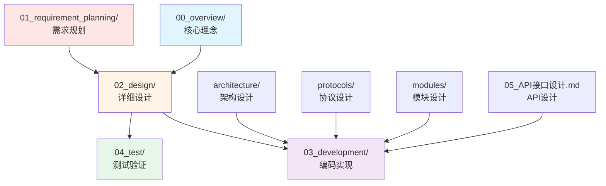

# 设计文档

> **目录定位**：NexKV 的详细设计文档，包括架构设计、协议设计、模块设计和 API 设计。

---

## 📁 目录结构

```
02_design/
├── architecture/         ← 架构设计
│   ├── 01_系统架构设计.md
│   └── 02_数据结构设计.md
│
├── modules/              ← 模块详细设计
│   ├── 01_详细设计文档.md
│   ├── 02_存储引擎设计.md
│   ├── 03_WAL崩溃恢复.md
│   ├── 04_故障恢复.md
│   ├── 05_混合逻辑时钟HLC.md
│   ├── 06_时钟漂移补偿.md
│   ├── 07_树形协调器拓扑同步.md
│   ├── 08_树形协调器自动发现与心跳.md
│   └── 09_网络分区处理.md
│
├── protocols/            ← 协议设计
│   ├── 01_一致性协议设计.md
│   ├── 02_二阶段提交与Gossip状态同步.md
│   ├── 03_Gossip消息响应机制.md
│   └── 04_一致性级别切换.md
│
├── 05_API接口设计.md     ← API 接口设计
└── 06_设计评审纪要.md
```

---

## 🔗 与其他目录的关系



---

## 📖 阅读顺序建议

### 第一阶段：理解架构（1 小时）
1. `../../00_overview/01_核心架构概念.md` - 核心架构理念
2. `architecture/01_系统架构设计.md` - 系统架构设计
3. `modules/01_详细设计文档.md` - 模块总体设计

### 第二阶段：深入协议（2 小时）
4. `protocols/01_一致性协议设计.md` - 一致性协议总体设计
5. `protocols/02_二阶段提交与Gossip状态同步.md` - TwoPC 与 Gossip
6. `protocols/03_Gossip消息响应机制.md` - Gossip 响应机制
7. `protocols/04_一致性级别切换.md` - 一致性级别切换

### 第三阶段：模块细节（按需）
8. `modules/` - 各模块详细设计

### 第四阶段：API 设计（1 小时）
9. `05_API接口设计.md` - API 接口设计

---

## 📋 设计文档清单

### 架构设计
- [x] 01_系统架构设计.md - 系统架构设计
- [x] 02_数据结构设计.md - 数据结构设计

### 协议设计
- [x] 01_一致性协议设计.md - 一致性协议设计
- [x] 02_二阶段提交与Gossip状态同步.md - TwoPC 与 Gossip
- [x] 03_Gossip消息响应机制.md - Gossip 响应
- [x] 04_一致性级别切换.md - 一致性切换

### 模块设计
- [x] 01_详细设计文档.md - 模块详细设计
- [x] 02_存储引擎设计.md - 存储引擎设计
- [x] 树形协调器系列（拓扑同步、自动发现、心跳）
- [x] 时钟同步系列（HLC、漂移补偿）
- [x] 故障恢复系列（故障检测、网络分区）
- [x] 存储引擎系列（WAL、崩溃恢复）
- [ ] 分片管理模块设计
- [ ] 副本管理模块设计
- [ ] 路由模块设计
- [ ] 快照管理模块设计

### API 设计
- [x] 05_API接口设计.md - API 接口设计

---

## ⚠️ 文档组织原则

### 按职责分类
- **architecture/**：系统级架构设计
- **protocols/**：分布式协议设计
- **modules/**：具体模块实现设计

### 按层次分类
- **总体设计**：01_系统架构设计.md、04_一致性协议设计.md、02_详细设计文档.md
- **详细设计**：各模块的具体实现

### 按完整性分类
- **独立完整**：每个文档都是独立完整的
- **相互引用**：通过相对路径相互引用
- **版本同步**：保持文档版本一致

---

**文档版本**: v2.0 (方案 B 重构)
**最后更新**: 2026-01-18
**维护者**: NexKV 开发团队
