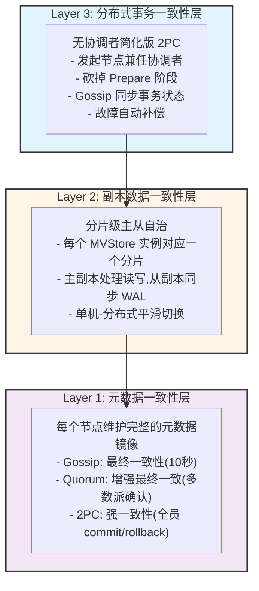
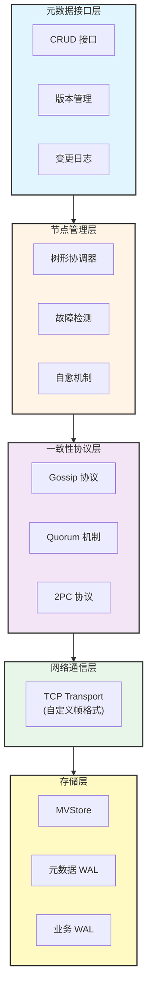
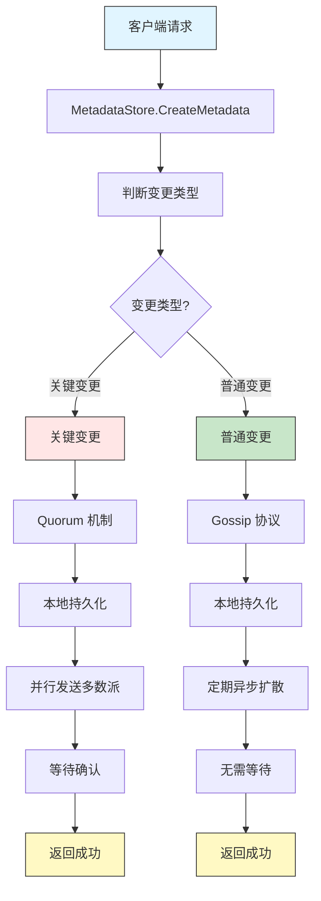
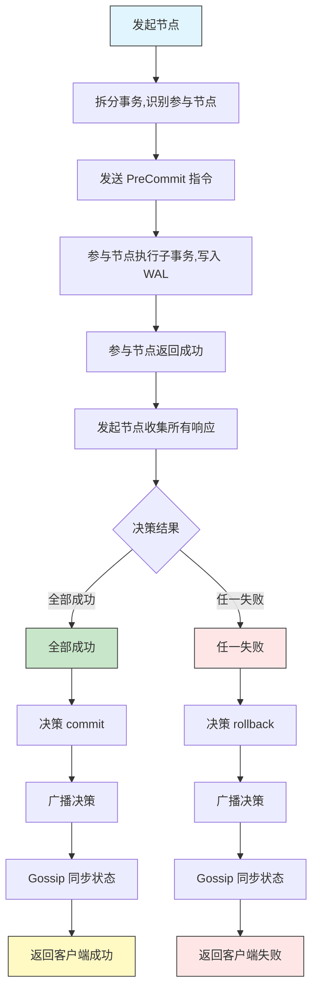

# 系统架构设计文档 (SAD)

> **文档版本**: v1.0
> **创建日期**: 2026-01-18
> **状态**: ✅ 已批准
> **对应文档**: 参见迁移后的 `docs/02_design/` 目录下的相关文档

---

## 📋 文档概述

本文档定义 NexKV 分布式 KV 存储系统的系统架构设计,包括总体架构、模块划分、接口定义、数据流和关键设计决策。

### 架构设计原则

| 原则 | 说明 |
|------|------|
| **KISS (简单至上)** | 优先选择最简单的方案,避免过度设计 |
| **YAGNI (精益求精)** | 只实现当前需要的功能,抵制未来特性预留 |
| **DRY (杜绝重复)** | 避免重复代码和逻辑,主动抽象复用 |
| **SOLID 原则** | 接口抽象、职责单一、依赖倒置 |

---

## 1. 总体架构

### 1.1 三层架构设计

NexKV 采用三层架构设计,各层职责清晰、依赖单向:



### 1.2 L1 元数据层内部架构



### 1.3 架构演进路径


| 集群规模 | 架构模式 | 关键技术 | 延迟 | 适用场景 |
|---------|---------|---------|------|---------|
| **3-50 节点** | 扁平架构 | Gossip + Quorum | Gossip < 50s<br/>Quorum < 5s | 中小规模 |
| **50-100 节点** | 扁平架构(过渡) | Gossip + Quorum | Gossip 60-90s<br/>Quorum < 10s | 中大规模过渡 |
| **100-1000 节点** | 树形分组架构 | 分组 + 智能路由 | 组内 2PC < 100ms<br/>组间 Gossip < 10s | 大规模集群 |

---

## 2. 核心模块设计

### 2.1 存储层

#### 2.1.1 MVStore 接口

```go
// MVStore 多版本存储接口
type MVStore interface {
    // 基础 CRUD 操作
    Put(key string, value []byte) error
    Get(key string) ([]byte, error)
    Delete(key string) error

    // 版本读取
    GetVersion(key string, version uint64) ([]byte, error)
    GetCurrentVersion(key string) (uint64, error)

    // 批量操作
    PutBatch(items []KVPair) error
    GetBatch(keys []string) ([][]byte, error)

    // 范围查询
    Scan(start, end string, limit int) ([]KVPair, error)

    // 持久化
    Flush() error
    Snapshot() error
    Close() error
}
```

**设计理由**:
- **MVCC 支持**: 支持历史版本读取,实现快照隔离
- **批量操作**: 减少网络往返,提升吞吐量
- **显式持久化**: Flush 和 Snapshot 控制刷盘时机,性能优化

#### 2.1.2 内存表实现

```go
// MemoryStore 内存表实现
type MemoryStore struct {
    data       *sync.Map        // 当前版本数据
    versions   *sync.Map        // 历史版本数据
    version    atomic.Uint64     // 全局版本号
    wal        WAL              // 写前日志
    snapshotCh chan struct{}    // 快照触发
}
```

**设计理由**:
- **sync.Map**: 高并发读写,无锁优化
- **atomic 版本号**: 零开销版本递增
- **后台快照**: 定期刷盘,减少停顿

#### 2.1.3 双层 WAL 架构

```go
// 元数据 WAL (30天保留)
type MetadataWAL struct {
    file      *os.File
    retention time.Duration // 30 天
}

// 业务 WAL (3个月保留)
type BusinessWAL struct {
    file      *os.File
    retention time.Duration // 3 个月
}
```

**设计理由**:
- **职责分离**: 元数据和业务 WAL 独立管理
- **保留策略**: 元数据 30 天,业务 3 个月
- **独立恢复**: 崩溃恢复可分别处理

---

### 2.2 网络通信层

#### 2.2.1 Transport 接口

```go
// Transport 网络传输抽象
type Transport interface {
    // 生命周期管理
    Start() error
    Stop() error
    IsRunning() bool

    // 消息发送
    Send(addr string, msg Message) error
    SendAsync(addr string, msg Message) error
    Broadcast(msg Message, addrs []string) error

    // 消息接收
    Receive() <-chan Message
    RegisterHandler(msgType MessageType, handler MessageHandler) error

    // 连接管理
    Connect(addr string) error
    Disconnect(addr string) error
    IsConnected(addr string) bool
}
```

**设计理由**:
- **统一消息**: Message 接口统一所有消息类型
- **异步接收**: Channel 模式,易于集成
- **TCP 专注**: 专注优化 TCP 实现,简化设计

#### 2.2.2 自定义帧格式(16字节帧头)

```
+-----------+----------+-----------+----------+----------+----------+
| Magic     | Type     |CodecType  | Length   | CRC32    | Data     |
| 4 bytes   | 2 bytes  | 2 bytes   | 4 bytes  | 4 bytes  | N bytes  |
+-----------+----------+-----------+----------+----------+----------+
  "NxKV"      100-352    1-3        N         N         N
```

**字段说明**:
- **Magic (4B)**: `"NxKV"` ASCII 字符串,快速帧识别
- **Type (2B)**: 消息类型,支持 100-352 范围
- **CodecType (2B)**: 编解码器类型(1=MessagePack, 2=JSON, 3=Protobuf)
- **Length (4B)**: 支持最大 4GB 消息
- **CRC32 (4B)**: IEEE CRC32 校验和,检测传输错误

**设计理由**:
- **固定头部**: 16 字节,内存对齐友好,解析高效
- **多编解码器**: 支持性能优化和调试
- **校验和**: 保证数据完整性

#### 2.2.3 消息类型定义

```go
const (
    // 核心业务 (100-199)
    MsgType2PCPreCommit   = 100
    MsgType2PCCommit      = 101
    MsgType2PCRollback    = 102
    MsgTypeKVPut         = 110
    MsgTypeKVGet         = 111

    // 集群基础设施 (200-299)
    MsgTypeHeartbeat      = 200
    MsgTypeNodeDiscovery  = 201
    MsgTypeNodeRegister  = 202
    MsgTypeGossipSync    = 210

    // 树管理 (300-308)
    MsgTypeTreeTopology  = 300
    MsgTypeRoleElection  = 301
    MsgTypeMasterSync    = 302
)
```

---

### 2.3 一致性协议层

#### 2.3.1 Gossip 协议

```go
// GossipService Gossip 协议服务
type GossipService struct {
    interval  time.Duration    // 同步间隔 10s
    fanout    int              // 每轮选点数 2
    selector  NodeSelector     // 节点选择器
    store     MetadataStore    // 元数据存储
    transport Transport        // 网络传输
    stopCh    chan struct{}    // 停止信号
}

// 双向同步
func (g *GossipService) syncToNode(addr string) error {
    localVersion := g.store.GetVersion()
    remoteVersion := g.transport.GetVersion(addr)

    if localVersion > remoteVersion {
        // 发送变更日志
        logs := g.store.GetChangeLogs(remoteVersion)
        return g.transport.SendChangeLogs(addr, logs)
    }

    if remoteVersion > localVersion {
        // 请求变更日志
        logs, err := g.transport.GetChangeLogs(addr, localVersion)
        if err != nil {
            return err
        }
        return g.store.ApplyChangeLogs(logs)
    }

    return nil
}
```

**设计理由**:
- **双向同步**: 高版本向低版本推送
- **增量同步**: 仅传输变更部分
- **随机选点**: 避免热点,负载均衡

**性能指标**:
- 收敛时间: < 50 秒(7 节点集群)
- 网络开销: 每个节点每轮发送 2 个请求

#### 2.3.2 Quorum 机制

```go
// QuorumService Quorum 机制
type QuorumService struct {
    threshold int              // N/2 + 1
    timeout   time.Duration    // 30s
    store     MetadataStore    // 元数据存储
    transport Transport        // 网络传输
}

// 提议变更
func (q *QuorumService) ProposeChange(
    change *MetadataChange,
    nodes []string,
) error {
    // 1. 本地持久化
    if err := q.store.ApplyChange(change); err != nil {
        return err
    }

    // 2. 并行发送
    results := make(chan error, len(nodes))
    for _, node := range nodes {
        go q.sendChange(node, change, results)
    }

    // 3. 等待多数派
    successCount := 1 // 自身
    timeoutCh := time.After(q.timeout)

    for i := 0; i < len(nodes); i++ {
        select {
        case err := <-results:
            if err == nil {
                successCount++
                if successCount >= q.threshold {
                    return nil // 达到多数派
                }
            }
        case <-timeoutCh:
            if successCount >= q.threshold {
                return nil
            }
            // 未达标,回滚
            q.store.RollbackChange(change.Version)
            return ErrQuorumTimeout
        }
    }

    return nil
}
```

**设计理由**:
- **并行发送**: 减少延迟
- **多数派确认**: 增强的最终一致性
- **超时回滚**: 防止阻塞

> **⚠️ 注意**: Quorum 只能保证最终一致性,允许脑裂场景。真正的强一致性需要 2PC 协议。

**性能指标**:
- 决策延迟: < 50ms(局域网)
- 可用性: 容忍少数节点故障

#### 2.3.3 2PC 协议

```go
// TwoPhaseCommit 简化版 2PC
type TwoPhaseCommit struct {
    coordinator string                 // 发起节点
    phase       string                 // init, precommit, decide, done
    votes       map[string]string      // 参与节点投票
    decision    string                 // commit, rollback
    transport   Transport              // 网络传输
    timeout     time.Duration          // 30s
}

// 预提交阶段
func (c *TwoPhaseCommit) PreCommit(
    txID string,
    participants []string,
) error {
    c.phase = "precommit"
    c.votes = make(map[string]string)

    // 并行发送预提交指令
    for _, node := range participants {
        go func(n string) {
            err := c.transport.SendPreCommit(n, txID)
            if err == nil {
                c.votes[n] = "yes"
            } else {
                c.votes[n] = "no"
            }
        }(node)
    }

    // 等待所有响应
    timeoutCh := time.After(c.timeout)
    for len(c.votes) < len(participants) {
        select {
        case <-timeoutCh:
            return ErrTimeout
        default:
            time.Sleep(100 * time.Millisecond)
        }
    }

    return nil
}

// 决策阶段
func (c *TwoPhaseCommit) Decide(txID string) error {
    // 检查投票结果
    allYes := true
    for _, vote := range c.votes {
        if vote != "yes" {
            allYes = false
            break
        }
    }

    if allYes {
        c.decision = "commit"
    } else {
        c.decision = "rollback"
    }

    // 广播决策
    c.phase = "decide"
    c.BroadcastDecision(txID, c.decision)

    // Gossip 同步状态
    c.GossipState(txID, c.decision)

    return nil
}
```

**设计理由**:
- **无独立协调者**: 发起节点兼任
- **砍掉 Prepare**: 直接预提交,无锁
- **Gossip 同步**: 异步扩散状态

**性能指标**:
- 决策延迟: < 100ms(组内全员确认)
- 可用性: 容忍组外节点故障

---

### 2.4 节点管理层

#### 2.4.1 树形协调器

```go
// TreeCoordinator 树形协调器
type TreeCoordinator struct {
    node        *Node           // 本节点
    maxChildren int             // 最大子节点数 10
    level       int             // 当前层级
    mu          sync.RWMutex
}

// Node 节点结构
type Node struct {
    NodeID      string          // 节点 ID
    Addr        string          // 监听地址
    ParentID    string          // 父节点 ID
    ChildrenIDs []string        // 子节点 ID 列表
    Level       int             // 层级
    Role        NodeRole        // 角色
}

// NodeRole 节点角色
type NodeRole int

const (
    RoleLeaf     NodeRole = iota // 叶子节点(物理节点)
    RoleInternal                 // 中间节点(虚拟角色)
    RoleRoot                     // 根节点(虚拟角色)
)
```

**设计理由**:
- **树形拓扑**: 层级化管理,每父最多 10 子
- **虚拟角色**: 非叶节点由叶节点兼任
- **松连接**: 父子关系松散,故障易恢复

#### 2.4.2 分组管理器(支持 100-1000 节点)

> **🔑 核心秘密**: 这是支持大规模集群的关键组件

```go
// GroupManager 分组管理器
type GroupManager struct {
    groups      map[string]*Group // 组 ID -> 组信息
    nodeToGroup map[string]string // 节点 ID -> 组 ID
    groupSize   int               // 每组节点数(5-10,可配置)
    mu          sync.RWMutex
}

// Group 组信息
type Group struct {
    GroupID   string   // 组 ID
    Members   []string // 成员节点列表
    Leader    string   // 组内 Leader(担任 2PC 协调者)
    Version   uint64   // 组版本号
}
```

**设计理由**:
- **组规模固定**: 每组 5-10 个节点,2PC 延迟可控
- **自动平衡**: 节点加入/退出自动调整组
- **Leader 选举**: 组内 Leader 担任 2PC 协调者

#### 2.4.3 智能路由器

> **🔑 核心秘密**: 尽量将事务路由到同一组内

```go
// SmartRouter 智能路由器
type SmartRouter struct {
    groupManager *GroupManager
    metadataStore MetadataStore
}

// 核心算法:尽量路由到同一个组内
func (r *SmartRouter) RouteTransaction(tx Transaction) (string, error) {
    // 1. 分析事务涉及的数据(分片、键等)
    dataScope := r.AnalyzeDataScope(tx)

    // 2. 查找数据所在的组
    targetGroup := r.FindGroupForData(dataScope)

    // 3. 如果数据完全在某个组内,路由到该组
    if r.IsDataInSingleGroup(tx, targetGroup) {
        return targetGroup.GroupID, nil  // ✅ 组内事务(2PC强一致)
    }

    // 4. 跨组事务:需要协调多个组
    if r.IsCrossGroupTransaction(tx) {
        return r.RouteCrossGroupTx(tx, targetGroups)
    }

    return "", ErrNoRoute
}
```

**设计理由**:
- **事务局部化**: 90%+ 事务在组内完成
- **数据亲和性**: 相关数据尽量分配到同一组
- **跨组事务最小化**: 通过分片策略减少跨组访问

---

## 3. 数据流设计

### 3.1 元数据写入流程



### 3.2 2PC 事务流程



---

## 4. 关键设计决策

### 4.1 为什么选择树形拓扑?

| 优势 | 说明 |
|------|------|
| **可扩展性** | 每个父节点管理 5-10 子,支持大规模集群 |
| **容错性** | 单个节点故障仅影响局部 |
| **性能** | 层级化管理,消息扩散效率高 |
| **2PC 协同** | 父节点自然担任协调者 |

### 4.2 为什么双层 WAL?

| WAL 类型 | 保留期限 | 用途 |
|---------|---------|------|
| **元数据 WAL** | 30 天 | 关键变更,短期保留 |
| **业务 WAL** | 3 个月 | KV 操作,长期保留 |

**理由**:
- **职责分离**: 元数据和业务独立管理
- **恢复优化**: 元数据快速恢复,业务按需恢复
- **存储优化**: 元数据 WAL 小,可常驻内存

### 4.3 为什么分层一致性?

| 变更类型 | 一致性 | 机制 | 阻塞业务 |
|---------|--------|------|---------|
| **关键变更** | 强一致(全员 commit 或 rollback) | 2PC | 是 |
| **重要变更** | 增强最终一致(多数派确认,允许脑裂) | Quorum | 是 |
| **普通变更** | 最终一致 | Gossip | 否 |

**理由**:
- **性能优化**: 关键变更少,2PC 强一致开销可接受
- **用户体验**: 普通变更异步,不阻塞
- **一致性保证**: 关键变更通过 2PC 保证强一致性

> **⚠️ 重要澄清**:
> - **Quorum**: 只能保证最终一致性(允许脑裂场景: n1 commit, n2 rollback)
> - **2PC**: 才能保证强一致性(原子性: 全员 commit 或全员 rollback)

### 4.4 为什么简化版 2PC?

**传统 2PC 问题**:
- 独立协调者(性能瓶颈 + 单点)
- Prepare 阶段阻塞(资源锁定)
- 协调者故障(状态不一致)

**优化方案**:
- 发起节点兼任协调者
- 砍掉 Prepare 阶段
- Gossip 同步状态

---

## 5. 可扩展性设计

### 5.1 水平扩展:从中小规模到大规模

| 集群规模 | 架构模式 | 关键技术 | 延迟 |
|---------|---------|---------|------|
| **3-50 节点** | 扁平架构 | Gossip + Quorum | Gossip < 50s<br/>Quorum < 5s |
| **50-100 节点** | 扁平架构(过渡) | Gossip + Quorum | Gossip 60-90s<br/>Quorum < 10s |
| **100-1000 节点** | 树形分组架构 | 分组 + 智能路由 | 组内 2PC < 100ms<br/>组间 Gossip < 10s |

### 5.2 大规模集群:树形分组 + 智能路由

**为什么分组有效?**

```
传统 2PC(100 节点):
发起节点 ─→ 需要等待 99 个节点确认
           ↓
       延迟爆炸!(5-10 秒)
           ↓
       不可行!

树形分组(10 组 × 10 节点):
组内 2PC: 只需等待 9 个节点确认
           ↓
       延迟可控!(≈ 50ms)
           ↓
       完全可行!
```

**实施效果对比**:

| 集群规模 | 架构类型 | 详情 | 状态 |
|---------|---------|------|------|
| 100 节点 | 传统扁平架构 | Gossip 收敛 60-90 秒 | ❌ |
| 100 节点 | 树形分组（10 组 × 10 节点） | 组内 2PC: 9 个确认 ≈ 50ms | ✅ |
| 100 节点 | 树形分组（10 组 × 10 节点） | 组间 Gossip: 10 秒收敛 | ✅ |
| 1000 节点 | 传统扁平架构 | Gossip 收敛 3-5 分钟 | ❌ |
| 1000 节点 | 树形分组（100 组 × 10 节点） | 组内 2PC: 9 个确认 ≈ 50ms | ✅ |
| 1000 节点 | 树形分组（100 组 × 10 节点） | 组间 Gossip: 10 秒收敛 | ✅ |

---

## 6. 总结

### 6.1 架构优势

| 优势 | 说明 |
|------|------|
| **轻量化** | 无外部依赖,自主可控 |
| **高性能** | 内存表 + TCP,微秒级延迟 |
| **可扩展** | 树形拓扑,支持 3-1000 节点 |
| **可验证** | TLA+ 形式化验证 |
| **易运维** | 简单架构,易于理解 |

### 6.2 扩展性详解

- **3-50 节点**: 扁平架构,Gossip + Quorum,简单高效
- **100-1000 节点**: 树形分组 + 智能路由,组内 2PC + 组间 Gossip
- **核心秘密**: 智能路由尽量将事务保持在组内,90%+ 事务享受组内 2PC 的强一致性

---

**文档版本**: v1.0
**最后更新**: 2026-01-18
**维护者**: NexKV 开发团队
**状态**: ✅ 已批准
