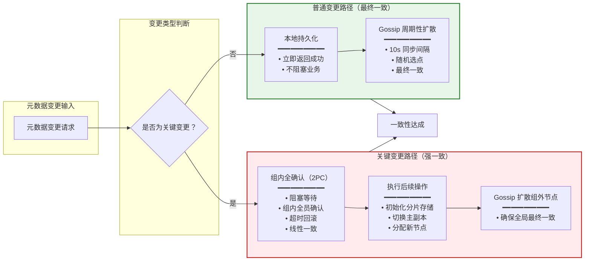

# 详细设计文档 (DDD)

> **文档版本**: v1.0
> **创建日期**: 2026-01-18
> **状态**: ✅ 已完成
> **对应源文档**: 参见 `docs/00_overview/` 目录下的相关文档

---

## 📋 文档概述

本文档提供 NexKV 三层架构的详细设计说明，重点关注：
- **Layer 1（元数据层）**：元数据一致性机制的详细实现
- **Layer 2（副本数据层）**：单机-分布式一体的实现原理
- **关键组件**：MVStore、Gossip、Quorum、2PC、虚拟节点

### 文档结构

```
┌─────────────────────────────────────────────────────────────┐
│                     详细设计文档结构                         │
├─────────────────────────────────────────────────────────────┤
│                                                             │
│  Part 1: 元数据层详细设计                                    │
│  • 元数据存储层（MVStore）                                   │
│  • 元数据同步层（Gossip + Quorum）                           │
│  • 元数据接口层（CRUD + 版本管理）                           │
│                                                             │
│  Part 2: 单机-分布式一体详细设计                             │
│  • 虚拟节点架构                                             │
│  • 后台异步数据迁移                                         │
│  • 树形分组（大规模集群支持）                               │
│                                                             │
│  Part 3: 关键实现细节                                        │
│  • 版本号管理                                               │
│  • 变更日志处理                                             │
│  • 故障恢复机制                                             │
│                                                             │
└─────────────────────────────────────────────────────────────┘
```

---

## Part 1: 元数据层详细设计

### 1.1 元数据层核心价值

**核心论断**：元数据层是整个分布式数据库的"大脑"和"导航系统"。

**三个核心价值**：

| 价值 | 说明 | 影响 |
|------|------|------|
| **路由依据** | 所有数据读写请求都需要先查询元数据 | 决定数据在哪个分片、哪个节点 |
| **集群认知** | 元数据是集群成员达成共识的唯一途径 | 没有它，集群就会"分裂" |
| **操作前提** | 分片创建、副本切换、节点加入都依赖它 | 元数据不准确 = 操作失败 |

**一句话总结**：
> Layer 1 元数据层 = 分布式数据库的"操作系统内核"

它不直接存储业务数据，但所有业务操作都离不开它。

---

### 1.2 元数据层内部架构

```
┌─────────────────────────────────────────────────────────────┐
│                    Layer 1 内部三大核心组件                 │
├─────────────────────────────────────────────────────────────┤
│                                                             │
│  ┌──────────────────────────────────────────────────────┐  │
│  │  元数据存储层（持久化）                               │  │
│  │  ┌────────────────────────────────────────────────┐  │  │
│  │  │ MVStore                                        │  │  │
│  │  │ • 内存缓存（sync.Map）                         │  │  │
│  │  │ • 磁盘持久化（WAL）                            │  │  │
│  │  │ • MVCC 支持（多版本并发控制）                   │  │  │
│  │  │ • 嵌入式部署（零外部依赖）                     │  │  │
│  │  └────────────────────────────────────────────────┘  │  │
│  │                                                         │  │
│  │  存储内容：                                             │  │
│  │  • 分片元数据（分片ID、副本列表、主副本节点、版本号）   │  │
│  │  • 节点元数据（节点地址、状态、容量、负载信息）         │  │
│  └──────────────────────────────────────────────────────┘  │
│                              ↓                               │
│  ┌──────────────────────────────────────────────────────┐  │
│  │  元数据同步层（一致性）                               │  │
│  │  ┌─────────────────┐  ┌──────────────────────────┐  │  │
│  │  │ Gossip 协议      │  │ 组内全确认（2PC）        │  │  │
│  │  │ • 最终一致性     │  │ • 线性一致性            │  │  │
│  │  │ • 周期性扩散     │  │ • 组内全员确认          │  │  │
│  │  │ • 随机选点       │  │ • 阻塞等待              │  │  │
│  │  │ • 抗网络波动     │  │ • 无脑裂风险            │  │  │
│  │  └─────────────────┘  └──────────────────────────┘  │  │
│  │                                                         │  │
│  │  应用场景：                                             │  │
│  │  • Gossip：普通变更（节点状态更新、负载信息刷新）       │  │
│  │  • 2PC：关键变更（分片创建、主副本切换、节点加入）      │  │
│  └──────────────────────────────────────────────────────┘  │
│                              ↓                               │
│  ┌──────────────────────────────────────────────────────┐  │
│  │  元数据接口层（对外服务）                             │  │
│  │  ┌─────────────────┐  ┌──────────────────────────┐  │  │
│  │  │ CRUD 接口        │  │ 版本管理                │  │  │
│  │  │ • CreateMetadata │  │ • 版本号递增            │  │  │
│  │  │ • UpdateMetadata │  │ • 变更日志缓存          │  │  │
│  │  │ • DeleteMetadata │  │ • 增量同步              │  │  │
│  │  │ • QueryMetadata  │  │ • 冲突检测              │  │  │
│  │  └─────────────────┘  └──────────────────────────┘  │  │
│  └──────────────────────────────────────────────────────┘  │
│                                                             │
└─────────────────────────────────────────────────────────────┘
```

---

### 1.3 分层一致性策略

**核心设计**：根据变更类型自动选择一致性级别。



**关键变更 vs 普通变更**

| 变更类型 | 示例 | 一致性要求 | 同步机制 | 阻塞业务 | 收敛时间 |
|---------|------|-----------|---------|---------|---------|
| **关键变更** | 分片创建、主副本切换、节点加入 | **线性一致（2PC）** | 组内全员确认（阻塞等待） | 是 | < 100ms |
| **普通变更** | 节点状态更新、负载信息刷新 | 最终一致 | Gossip（异步扩散） | 否 | < 10s |

> **✅ 重要澄清**：NexKV 采用**组内全确认架构**
> - **组内全确认（2PC）**：提供**线性一致性**（组内全员 commit 或全员 rollback）
> - **Gossip**：提供**最终一致性**（组外节点周期性同步）
> - **组内无不一致窗口**：所有组内节点必须确认，不存在少数派节点的临时不一致状态

---

### 1.4 组内全确认机制（2PC）详解

**什么是组内全确认？**
- 组内全确认 = 基于 2PC 协议的全员确认机制
- 阈值 = N（组内所有节点，5-10个）
- 例如：5节点组，全员确认 = 5；10节点跨组（2组），全员确认 = 10
- **一致性级别**：Linearizability（线性一致性）

**组内全确认工作流程**（以分片创建为例）：

```
前置条件：3个在线节点，组内全员确认=3

客户端 → 发起节点(Node1)
         ↓
      1. 本地持久化分片元数据
         MVStore: 持久化成功（版本号=1）
         ↓
      2. 并行同步到组内所有节点
         ├→ Node2: 同步请求（超时30s）
         └→ Node3: 同步请求（超时30s）
         ↓
      Node2: 应用变更，持久化（版本号=1）→ 确认成功
      Node3: 应用变更，持久化（版本号=1）→ 确认成功
         ↓
      3. 统计确认数：3个 = 组内全员确认 ✓
         ↓
      4. 执行后续操作（初始化分片存储）
         ↓
      客户端 ← 分片创建成功
```

**为什么需要组内全确认？**

1. **消除脑裂**：确保组内所有节点对关键变更达成共识（无少数派节点）
2. **线性一致**：组内无不一致窗口，提供真正的线性一致性
3. **防止误操作**：如果任意节点同步失败，整体回滚（2PC rollback）
4. **保障安全**：关键操作（如分片创建）必须有组内所有节点"背书"

---

### 1.5 Gossip 协议详解

**什么是 Gossip？**
- Gossip = 流言协议，灵感来自人类社交中的"八卦传播"
- 每个节点周期性地随机选择几个节点，交换元数据
- 类似"病毒式传播"，最终所有节点都会得到最新信息

**Gossip 工作流程**（以节点状态更新为例）：

```
前置条件：Gossip同步间隔=10s

第1轮 Gossip（t=0s）:
  Node1: 本地变更 → Node2状态→OFFLINE
        MVStore: 持久化成功（版本号=5）
        ↓
        随机选择：Node3
        ↓
        Gossip同步请求 → Node3
        Node3: 应用变更，持久化（版本号=5）
        → 同步成功 ✓

第2轮 Gossip（t=10s）:
  Node3: 随机选择：Node2, Node4
        ↓
        Gossip同步请求 → Node2
        Node2: 应用变更（自己状态→OFFLINE）
        → 持久化成功（版本号=5）
        → 同步成功 ✓
        ↓
        Gossip同步请求 → Node4
        Node4: 应用变更
        → 持久化成功（版本号=5）
        → 同步成功 ✓

第3轮 Gossip（t=20s）:
  Node1: 随机选择：Node2, Node4
        ↓
        Gossip同步请求 → Node2
        Node2: 版本号已是5，跳过
        → 版本一致，无需同步 ✓
        ↓
        Gossip同步请求 → Node4
        Node4: 版本号已是5，跳过
        → 版本一致，无需同步 ✓
        ↓
        全集群元数据统一（版本号=5）✓
```

**Gossip 的优势**：
1. **抗网络波动**：不需要所有节点同时在线，离线节点恢复后自动同步
2. **避免网络风暴**：随机选点，不是全连接，降低网络压力
3. **可扩展性强**：节点增加时，同步轮数仅对数增长（O(log N)）

**Gossip 的代价**：
1. **最终一致，非实时**：通常需要 3-5 轮（30-50s）才能全集群统一
2. **短暂不一致**：在 Gossip 扩散期间，不同节点看到的元数据可能不一致

---

### 1.6 MVStore 实现要点

**核心接口设计**：

```go
// MVStore 多版本存储接口
type MVStore interface {
    // 基础 CRUD
    Put(key string, value []byte) error
    Get(key string) ([]byte, error)
    Delete(key string) error

    // 批量操作
    PutBatch(items map[string][]byte) error

    // MVCC 支持
    GetVersion(key string, version uint64) ([]byte, error)

    // 持久化控制
    Flush() error
    Close() error
}
```

**实现注意点**：

```go
// SimpleMVStore 简单实现
type SimpleMVStore struct {
    memTable *sync.Map          // 内存缓存（读写快）
    diskFile *os.File           // 磁盘文件（持久化）
    mu       sync.RWMutex        // 并发控制
    flushCh  chan struct{}       // 刷盘触发
    doneCh   chan struct{}       // 停止信号
}

func (m *SimpleMVStore) Start() {
    // 后台定期刷盘（每5秒或脏页超过1000）
    go m.flushLoop()
}

func (m *SimpleMVStore) flushLoop() {
    ticker := time.NewTicker(5 * time.Second)
    dirtyCounter := 0

    for {
        select {
        case <-ticker.C:
            if dirtyCounter > 0 {
                m.flushToDisk()
                dirtyCounter = 0
            }
        case <-m.doneCh:
            return
        }
    }
}
```

**关键注意点**：
1. **内存优先**：读写先操作内存表，再异步刷盘
2. **并发安全**：使用 `sync.RWMutex` 保护临界区
3. **刷盘策略**：定时（5s）+ 阈值（1000条脏页）触发
4. **优雅关闭**：`Close()` 时确保所有脏页刷盘

---

### 1.7 变更日志实现要点

**变更日志结构**：

```go
// MetadataChangeLog 元数据变更日志
type MetadataChangeLog struct {
    ChangeType   string      // CREATE/UPDATE/DELETE
    MetadataType string      // SHARD/NODE
    OldData      interface{} // 旧数据
    NewData      interface{} // 新数据
    Version      uint64      // 版本号
    Timestamp    time.Time
}

// ChangeLogManager 变更日志管理器
type ChangeLogManager struct {
    logs    []*MetadataChangeLog // 环形缓冲（最近1000条）
    mu      sync.RWMutex
    maxSize int
    head    int
    tail    int
    count   int
}

func (c *ChangeLogManager) AddLog(log *MetadataChangeLog) {
    c.mu.Lock()
    defer c.mu.Unlock()

    // 如果满了，覆盖最旧的
    if c.count == c.maxSize {
        c.logs[c.head] = log
        c.head = (c.head + 1) % c.maxSize
    } else {
        c.logs[c.tail] = log
        c.tail = (c.tail + 1) % c.maxSize
        c.count++
    }
}

func (c *ChangeLogManager) GetLogs(fromVersion uint64) []*MetadataChangeLog {
    c.mu.RLock()
    defer c.mu.RUnlock()

    result := make([]*MetadataChangeLog, 0)
    for _, log := range c.logs {
        if log.Version > fromVersion {
            result = append(result, log)
        }
    }
    return result
}
```

**关键注意点**：
1. **环形缓冲**：避免内存无限增长
2. **版本过滤**：只返回目标版本之后的日志
3. **并发安全**：读写分离锁（RLock vs Lock）

---

### 1.8 版本号管理要点

```go
// VersionManager 版本管理器
type VersionManager struct {
    currentVersion uint64
    mu             sync.Mutex
}

func (v *VersionManager) NextVersion() uint64 {
    v.mu.Lock()
    defer v.mu.Unlock()
    v.currentVersion++
    return v.currentVersion
}

// 关键：使用 atomic 包优化性能
import "sync/atomic"

type AtomicVersionManager struct {
    version uint64
}

func (v *AtomicVersionManager) NextVersion() uint64 {
    return atomic.AddUint64(&v.version, 1)
}

func (v *AtomicVersionManager) GetCurrentVersion() uint64 {
    return atomic.LoadUint64(&v.version)
}
```

**关键注意点**：
1. **原子操作**：使用 `atomic` 包，避免锁竞争
2. **严格递增**：版本号不能回退（即使回滚数据）
3. **全局唯一**：集群内版本号需要协调（如使用节点ID + 序列号）

---

## Part 2: 单机-分布式一体详细设计

### 2.1 核心概念

**传统数据库的"单机"和"分布式"**：
- ❌ 传统方式：**两套独立架构**
  - 单机模式：单进程、单存储实例，无分片/副本
  - 分布式模式：多进程、多存储实例，依赖分片/副本/共识

**NexKV 的「单机-分布式一体」**：
- ✅ 一体架构：**一套代码架构，两种部署形态**
  1. **单机模式**：进程内仅启动一个「虚拟节点」，所有数据存储在本地
  2. **分布式模式**：进程内启动多个「虚拟节点」，或跨进程部署多个节点
  3. **动态切换**：运行时可新增节点，后台异步完成数据迁移，无需停机

**核心目标**：
> 让用户像使用单机数据库一样使用分布式数据库，屏蔽分布式的复杂性。

---

### 2.2 基于三层架构的一体实现

**核心设计**：**每层都做「单机/分布式」的抽象适配**，底层存储与上层分布式逻辑解耦。

#### Layer 3（存储引擎层）：单机存储与分布式存储的统一抽象

这是一体架构的**基石**——MVStore 存储引擎本身就是「可分片的单机存储」。

**单机模式**：
- 整个数据库对应一个 `MVStore` 实例
- 所有表的数据存储在一个 `MVStore` 中
- B+树直接操作本地磁盘文件，无任何分布式开销
- 无需分片，表就是一个完整的数据集合，读写性能最大化

**分布式模式**：
- 每个**分片（Shard）** 对应一个独立的 `MVStore` 实例
- 分片与存储引擎解耦：分片的拆分/合并不影响 B+树 的读写逻辑
- 副本存储：同一个分片的多个副本，对应多个独立的 `MVStore` 实例

**关键抽象**：定义 `ShardStorage` 接口，屏蔽单机/分布式的存储差异

```go
// 存储引擎抽象接口：单机和分布式都实现这个接口
type ShardStorage interface {
    Put(key []byte, value []byte) error
    Get(key []byte) ([]byte, bool, error)
    Delete(key []byte) error
}

// 单机存储实现：直接封装 MVStore
type LocalShardStorage struct {
    mvStore *mvstore.MVStore
}

// 分布式存储实现：路由到对应分片的 LocalShardStorage
type DistributedShardStorage struct {
    hashRing    *ConsistentHashRing              // 一致性哈希环（路由）
    localStores map[string]*LocalShardStorage    // 本地分片存储
}
```

#### Layer 2（分片与副本层）：虚拟节点与动态分片的核心

这是一体架构的**核心切换逻辑**——通过「虚拟节点」实现单机和分布式的无缝衔接。

**单机模式**：
- 集群默认只有 **1个虚拟节点**，这个节点承载所有数据
- 分片数=1，副本数=1
- 分片路由逻辑退化：所有 `Key` 都路由到这个唯一的虚拟节点，无需哈希计算
- 副本逻辑退化：无副本，读写直接落地本地，性能无损耗

**分布式模式**：
- 新增节点时，集群自动将「1个虚拟节点」拆分为多个虚拟节点（如 1→10）
- 每个物理节点承载多个虚拟节点
- 分片策略自动生效：按一致性哈希将数据拆分到不同虚拟节点
- 副本数自动配置（如 3副本）
- 副本共识：触发 Quorum 读写逻辑（W=2/R=2）

**关键机制：虚拟节点的动态伸缩**
- 单机→分布式：新增物理节点 → 哈希环添加新节点的虚拟节点 → 后台异步迁移数据 → 分片自动生效
- 分布式→单机：下线其他节点 → 哈希环移除虚拟节点 → 后台异步将所有数据迁移到剩余节点 → 退化回单机模式

#### Layer 1（元数据一致性层）：单机元数据与分布式元数据的统一管理

这是一体架构的**大脑**——元数据的管理方式决定了单机/分布式的切换是否无缝。

**单机模式**：
- 元数据（表结构、分片信息、节点信息）仅存储在本地 `MVStore` 中
- 元数据变更直接修改本地存储，无需 Quorum 共识
- 无任何一致性开销

**分布式模式**：
- 元数据升级为「分布式元数据」：
  - **普通元数据**（表结构）：通过 Gossip 异步扩散
  - **关键元数据**（分片/副本配置）：通过 Quorum 多数派确认
- 所有节点的元数据最终一致，确保分片路由的正确性

**关键切换点**：节点数阈值
- 当集群节点数 ≤1 时，自动关闭 Quorum/Gossip 逻辑，元数据本地管理
- 当集群节点数 >1 时，自动启动 Quorum/Gossip 逻辑，元数据分布式管理

---

### 2.3 后台异步数据迁移（单机→分布式的关键）

**核心挑战**：从单机切换到分布式，必然涉及**数据迁移**——将单机的完整数据拆分到多个节点的分片上。

**核心创新**：**在 background goroutine 中异步完成数据迁移**，不影响前台业务读写。

#### 数据迁移的完整流程（单机→分布式）

假设单机模式有 1 个节点（NodeA），新增 2 个节点（NodeB、NodeC），升级为 3 节点分布式集群：

```
1. 触发迁移：
   新增节点后，Layer 1 的元数据服务检测到节点数>1
   ↓
   自动生成**分片迁移计划**：
   - 将 NodeA 的数据按一致性哈希拆分为 3 个分片
   - 分别分配给 NodeA、NodeB、NodeC
   ↓
   迁移计划作为关键元数据，通过 Quorum 多数派确认后生效

2. 后台异步迁移：
   启动**迁移协程**（Go 语言的 goroutine）
   ↓
   从 NodeA 的本地 `MVStore` 中读取数据
   ↓
   按一致性哈希计算每个 `Key` 所属的目标分片
   ↓
   异步发送到目标节点：
   - Key1 → NodeA
   - Key2 → NodeB
   - Key3 → NodeC
   ↓
   **前台读写不受影响**：
   - 读请求：优先从本地读取，若数据已迁移到其他节点，则路由到目标节点读取
   - 写请求：同时写入本地和目标节点（双写），迁移完成后取消双写

3. 迁移校验与完成：
   目标节点接收数据后，写入本地分片的 `MVStore`
   ↓
   返回确认
   ↓
   迁移协程校验源节点和目标节点的数据一致性（对比版本号）
   ↓
   数据一致后，标记该分片迁移完成
   ↓
   源节点删除已迁移的数据
   ↓
   所有分片迁移完成后，集群正式进入分布式模式 ✓
```

#### 迁移过程中的一致性保障

| 机制 | 说明 | 作用 |
|------|------|------|
| **版本向量** | 每个 `Key` 携带版本号 | 避免迁移过程中的数据覆盖 |
| **双写机制** | 迁移期间写请求双写源节点和目标节点 | 确保数据不丢失 |
| **读修复** | 若读请求发现数据版本不一致，自动触发异步修复 | 同步最新数据 |

---

### 2.4 单机-分布式一体的核心优势

| 特性 | 传统分布式数据库 | NexKV 单机-分布式一体 |
|------|------------------|-------------------------|
| **部署复杂度** | 必须部署多节点，依赖集群配置 | 支持单节点部署，开箱即用 |
| **性能损耗** | 分布式模式下有共识/分片开销 | 单机模式无任何分布式开销，性能与单机数据库一致 |
| **动态扩展** | 需停机配置分片/副本，数据迁移复杂 | 运行时无缝扩容，后台异步迁移数据，无需停机 |
| **运维成本** | 需维护分布式集群（节点、共识、副本） | 单机模式运维成本极低，分布式模式自动化运维 |
| **适用场景** | 大规模集群场景 | 从小规模单机到大规模分布式，全场景覆盖 |

---

### 2.5 多机器部署的集群拓扑

当 NexKV 部署在**多台物理/虚拟机**上时，其「单机-分布式一体」的特性会更完整地体现。

**示例**：3台物理机，每台部署2个节点

```
机器A（192.168.1.10）：
  └─ 节点 192.168.1.10:9211
  └─ 节点 192.168.1.10:9212

机器B（192.168.1.11）：
  └─ 节点 192.168.1.11:9211
  └─ 节点 192.168.1.11:9212

机器C（192.168.1.12）：
  └─ 节点 192.168.1.12:9211
  └─ 节点 192.168.1.12:9212
```

**多机器下的三种运行模式表现**：

#### 1. 单机模式（`db1`）
```sql
CREATE DATABASE db1;
```
- **实际表现**：数据依然只存在一个节点上（比如 `192.168.1.10:9211`，机器A）
- **扩展性**：这个节点运行在**独立的物理机**上，后续可以通过升级模式，将数据迁移到其他机器的节点，实现跨机器高可用

#### 2. 副本模式（`db2`）
```sql
CREATE DATABASE db2 RUN MODE replication;
```
- **实际表现**：数据会在**不同物理机的节点**上创建副本
- **高可用**：主副本故障时，自动切换到其他机器的从副本，实现**跨机器的高可用**

#### 3. 分片模式（`db3`）
```sql
CREATE DATABASE db3 RUN MODE sharding PARAMETERS(replication_factor: 2, assignment_factor: 5);
```
- **实际表现**：
  - 数据拆分为 `6节点 × 5 = 30个分片`，每个分片有 2 个副本
  - 副本会**跨物理机部署**
  - 实现「跨机器分片+跨机器副本」的双重分布式

#### 多机器部署的核心价值

1. **跨机器高可用**：副本部署在不同机器，单机器故障不会导致数据丢失或服务不可用
2. **跨机器性能扩展**：分片分散在不同机器，CPU、内存、IO 资源真正实现分布式利用
3. **故障隔离**：单机器故障只影响该机器上的分片/副本，其他机器的服务完全正常
4. **资源按需分配**：可以将不同模式的数据库部署在不同性能的机器上

---

## Part 3: 关键实现细节

### 3.1 Gossip 协议实现

```go
type GossipService struct {
    interval    time.Duration       // 同步间隔
    nodeList    []string            // 集群节点列表
    selector    NodeSelector        // 随机选点策略
    metaStore   ShardMetadataStore  // 元数据存储
    transport   Transport           // 网络传输层
}

func (g *GossipService) Start() {
    ticker := time.NewTicker(g.interval)
    defer ticker.Stop()

    for range ticker.C {
        // 1. 随机选择 2 个节点
        targets := g.selector.Select(g.nodeList, 2)

        // 2. 并行同步
        var wg sync.WaitGroup
        for _, target := range targets {
            wg.Add(1)
            go func(addr string) {
                defer wg.Done()
                g.syncToNode(addr)
            }(target)
        }
        wg.Wait()
    }
}

func (g *GossipService) syncToNode(addr string) error {
    // 1. 获取本地版本号
    localVersion, _ := g.metaStore.GetVersion()

    // 2. 请求对方版本号
    remoteVersion, err := g.transport.GetVersion(addr)
    if err != nil {
        return err
    }

    // 3. 如果本地更新，发送变更日志
    if localVersion > remoteVersion {
        logs := g.metaStore.GetChangeLogs(remoteVersion)
        return g.transport.SendChangeLogs(addr, logs)
    }

    // 4. 如果对方更新，请求变更日志
    if remoteVersion > localVersion {
        logs, err := g.transport.GetChangeLogs(addr, localVersion)
        if err != nil {
            return err
        }
        return g.metaStore.ApplyChangeLogs(logs)
    }

    return nil
}
```

**关键注意点**：
1. **双向同步**：比较版本号，决定发送方向
2. **并行发送**：多个节点并行同步，提高效率
3. **容错处理**：单节点失败不影响其他节点同步
4. **避免风暴**：随机选点，不是全连接

---

### 3.2 组内全确认（2PC）实现

```go
type GroupConsensusService struct {
    targetConfirmCount int                   // 阈值（组内全员 N）
    timeout            time.Duration         // 超时时间
    transport          Transport             // 网络传输层
    metaStore          ShardMetadataStore    // 元数据存储
}

func (g *GroupConsensusService) PropagateMetadataChange(
    changeLog *MetadataChangeLog,
    nodes []string,
) error {
    // 1. 本地持久化
    if err := g.metaStore.ApplyChangeLog(changeLog); err != nil {
        return err
    }

    // 2. 并行发送到所有节点
    type result struct {
        addr string
        err  error
    }

    results := make(chan result, len(nodes))
    for _, node := range nodes {
        go func(addr string) {
            err := g.transport.SendChangeLog(addr, changeLog)
            results <- result{addr, err}
        }(node)
    }

    // 3. 等待组内全员确认
    successCount := 1 // 自身已成功
    timeoutCh := time.After(g.timeout)

    for i := 0; i < len(nodes); i++ {
        select {
        case res := <-results:
            if res.err == nil {
                successCount++
                if successCount >= g.targetConfirmCount {
                    // 达到组内全员确认，返回成功
                    return nil
                }
            }
        case <-timeoutCh:
            // 超时，检查是否已达标
            if successCount >= g.targetConfirmCount {
                return nil
            }
            // 未达标，回滚
            g.metaStore.RollbackChange(changeLog.Version)
            return fmt.Errorf("group consensus timeout: only %d/%d confirmed",
                successCount, g.targetConfirmCount)
        }
    }

    return nil
}
```

**关键注意点**：
1. **先本地持久化**：失败时可以回滚
2. **并行发送**：提高同步速度
3. **超时机制**：避免无限等待
4. **回滚机制**：未达标时回滚本地变更

---

### 3.3 故障处理机制

```
故障场景处理：

1. 网络分区：
   检测：心跳超时
   ↓
   节点数是否 ≥ 最小节点数？
   ├─ 是 → 继续提供服务（标记离线节点）
   └─ 否 → 停止写服务（仅提供读服务，等待分区恢复）

2. 节点崩溃：
   检测：进程退出
   ↓
   重启节点
   ↓
   加载本地 MVStore（恢复元数据）
   ↓
   启动 Gossip 同步（拉取最新变更）

3. 数据损坏：
   检测：校验和失败
   ↓
   回滚到上一个快照
   ↓
   请求 Gossip 同步（补齐变更日志）
   ↓
   重建元数据
```

**故障处理原则**：
1. **快速检测**：心跳超时（5s）立即发现故障
2. **优雅降级**：分区时停止写服务，保留读服务
3. **自动恢复**：分区恢复后自动同步元数据
4. **数据优先**：宁可暂停服务，也不允许数据不一致

---

## Part 4: 大规模集群扩展

### 4.1 问题：2PC 在大规模集群中的困境

**传统 2PC（100-1000 节点）的致命问题**：

```
传统 2PC:
发起节点 ─→ 需要等待 99-999 个节点确认
           ↓
       延迟爆炸！(秒级甚至分钟级)
           ↓
       不可行！
```

**为什么不可行？**
- 2PC 需要全员确认（原子性保证）
- 100 节点 = 99 个确认 ≈ 5-10 秒
- 1000 节点 = 999 个确认 ≈ 分钟级
- 网络抖动风险指数级增加

---

### 4.2 解决方案：树形分组架构

```
┌─────────────────────────────────────────────────────────────┐
│                    树形分组架构                             │
│                                                             │
│                  Root Group (根组)                         │
│              ┌────────┬────────┬────────┐                   │
│              ↓        ↓        ↓        ↓                   │
│          Group-1  Group-2  Group-3  ... Group-N            │
│          (10节点) (10节点) (10节点)     (10节点)            │
│          ┌───┐    ┌───┐    ┌───┐                             │
│          │2PC│    │2PC│    │2PC│   组内强一致               │
│          └───┘    └───┘    └───┘   (全员同意)                │
│                                                             │
└─────────────────────────────────────────────────────────────┘
```

**核心设计原则**：

**1. 组内强一致（2PC）**
- 每个组内部使用 2PC 保证强一致性
- 组规模固定（5-10 个节点，可配置）
- 2PC 延迟可控：< 100ms

**2. 组间最终一致（Gossip）**
- 组之间通过 Gossip 同步元数据
- 不同组的元数据可以短期不一致
- 通过 Gossip 在 10 秒内收敛

**3. 智能路由（核心秘密）**

尽量路由到同一个组内：
```go
func (r *SmartRouter) RouteTransaction(tx Transaction) (string, error) {
    // 1. 分析事务涉及的数据
    dataScope := r.AnalyzeDataScope(tx)

    // 2. 查找数据所在的组
    targetGroup := r.FindGroupForData(dataScope)

    // 3. 如果数据完全在某个组内，路由到该组
    if r.IsDataInSingleGroup(tx, targetGroup) {
        return targetGroup.GroupID, nil  // ✅ 组内事务
    }

    // 4. 跨组事务：需要协调多个组
    if r.IsCrossGroupTransaction(tx) {
        return r.RouteCrossGroupTx(tx, targetGroups)
    }

    return "", ErrNoRoute
}
```

---

### 4.3 实施效果对比

```
集群规模：100 节点
├── 传统 2PC：99 个确认 ≈ 5-10 秒 ❌
└── 树形分组：10 组 × 10 节点 = 9 个确认 ≈ 50ms ✅

集群规模：1000 节点
├── 传统 2PC：999 个确认 ≈ 分钟级 ❌
└── 树形分组：100 组 × 10 节点 = 9 个确认 ≈ 50ms ✅
```

---

### 4.4 关键优化点

| 优化点 | 说明 |
|--------|------|
| **组规模固定** | 每组 5-10 个节点（可配置），2PC 延迟可控 |
| **智能路由优先** | 尽量将事务路由到同一组内 |
| **跨组事务最小化** | 通过数据分片策略减少跨组访问 |
| **组间异步同步** | 不同组之间的元数据最终一致即可 |

---

## 5. 总结与适用场景

### 5.1 Layer 1 的核心价值

**与传统方案对比**：

| 对比维度 | 传统方案（外部元数据存储） | NexKV Layer 1（内置元数据层） |
|---------|-------------------------|----------------------------|
| **部署复杂度** | 需要额外部署 ZooKeeper/etcd | 无外部依赖，节点自管理 |
| **查询延迟** | 跨网络查询（10-50ms） | 本地查询（<1ms） |
| **故障影响** | 元数据服务故障→全集群不可用 | 单节点故障不影响其他节点 |
| **扩展性** | 元数据服务成为瓶颈 | 随节点数线性扩展 |
| **一致性模型** | 强一致（性能差）或最终一致（正确性差） | 分层一致（兼顾性能与正确性） |

### 5.2 适用场景

**最适合**：
- ✅ 中小规模集群（3-50节点）
- ✅ 单机-分布式一体场景
- ✅ 需要快速部署的边缘计算
- ✅ 对运维复杂度敏感的业务

**需要扩展（树形分组）**：
- ⚠️ 超大规模集群（>100节点）→ 使用树形分组 + 智能路由
- ⚠️ 跨数据中心部署 → 需要特殊配置
- ⚠️ 需要全局强一致 → 分层一致性可能不够

---

## 6. 相关文档

### 输入文档
- `docs/00_overview/01_核心架构概念.md` - Layer 1 元数据层总览
- `docs/00_overview/03_单机分布式一体.md` - Layer 2 单机-分布式一体

### 输出文档
- `02_design/SAD.md` - 系统架构设计文档
- `02_design/CPD.md` - 一致性协议设计文档
- `02_design/APID.md` - API 接口设计文档

### 参考文档
- `docs/01_requirement_planning/TRD.md` - 技术需求文档

---

**文档版本**: v1.0
**最后更新**: 2026-01-18
**维护者**: NexKV 开发团队
**状态**: ✅ 已完成
