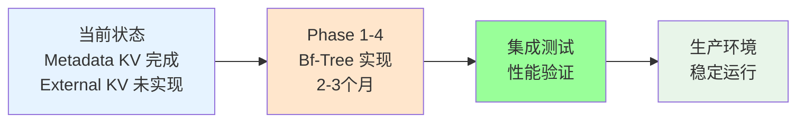

# 存储引擎设计文档 (SED)

> **文档版本**: v1.0
> **创建日期**: 2026-01-18
> **状态**: ✅ 已完成

---

## 📋 文档概述

本文档详细设计 NexKV 的存储引擎层，包括：
- **MVStore（多版本存储）**：内存缓存 + 磁盘持久化 + MVCC 支持
- **WAL（Write-Ahead Log）**：预写日志，提供崩溃恢复能力
- **双层 WAL 架构**：元数据 WAL（30天）+ 业务 WAL（3个月）
- **性能优化**：批量操作、异步刷盘、版本管理

### 设计目标

| 目标 | 说明 | 实现方式 |
|------|------|---------|
| **高性能** | 读写延迟 < 10μs | 内存表 + sync.Map |
| **持久化** | 数据不丢失 | WAL + 定期刷盘 |
| **MVCC** | 支持多版本并发控制 | 版本号 + 版本向量 |
| **崩溃恢复** < 5秒 | 快速恢复 | WAL 重放 |
| **轻量化** | 零外部依赖 | sync.Map + 文件系统 |

---

## 1. MVStore 核心设计

### 1.1 MVStore 接口定义

```go
// internal/metadata/store/mvstore.go
package store

// MVStore 多版本存储接口
type MVStore interface {
    // === 基础 CRUD 操作 ===

    // Put 写入键值对
    // 返回错误：写入失败
    Put(key string, value []byte) error

    // Get 获取最新值
    // 返回错误：如果不存在则返回 ErrNotFound
    Get(key string) ([]byte, error)

    // Delete 删除键值对
    // 返回错误：如果不存在则返回 ErrNotFound
    Delete(key string) error

    // Exists 检查键是否存在
    Exists(key string) (bool, error)

    // === 列表操作 ===

    // List 列出所有键（分页支持）
    List(offset, limit int) ([]string, error)

    // ListPrefix 列出指定前缀的所有键
    ListPrefix(prefix string, offset, limit int) ([]string, error)

    // === 版本管理 ===

    // GetVersion 获取指定 HLC 时间戳的版本值
    // 返回小于等于指定 hlcTimestamp 的最大版本
    GetVersion(key string, hlcTimestamp *clock.HLC) ([]byte, error)

    // GetVersionCount 获取键的版本数量
    GetVersionCount(key string) (int, error)

    // GetAllVersions 获取键的所有版本信息
    GetAllVersions(key string) ([]*VersionInfo, error)

    // === 快照操作 ===

    // CreateSnapshot 创建快照
    // 返回当前时刻的完整数据快照
    CreateSnapshot() ([]byte, error)

    // RestoreFromSnapshot 从快照恢复数据
    RestoreFromSnapshot(snapshot []byte) error

    // === 持久化控制 ===

    // Flush 将内存数据刷盘
    Flush() error

    // Close 关闭存储
    Close() error
}
```

---

### 1.2 MVStore 实现架构

```go
// internal/metadata/store/mem_store.go
package store

// MemStore 内存存储实现
type MemStore struct {
    // === 核心组件 ===

    memTable    *sync.Map          // 内存表（读写快）
    diskFile    *os.File           // 磁盘文件（持久化）
    mu          sync.RWMutex        // 并发控制

    // === 版本管理 ===

    versionMgr  VersionManager     // 版本管理器

    // === 后台任务 ===

    flushCh     chan struct{}       // 刷盘触发
    doneCh      chan struct{}       // 停止信号
    flushTicker *time.Ticker        // 定时刷盘

    // === 配置 ===

    config      *MemStoreConfig    // 配置参数
}

// MemStoreConfig 配置参数
type MemStoreConfig struct {
    DataDir        string        // 数据目录
    FlushInterval  time.Duration // 刷盘间隔（默认 5s）
    FlushThreshold int           // 刷盘阈值（默认 1000 条）
    MaxVersions    int           // 最大版本数（默认 10）
}
```

---

### 1.3 内存表设计（sync.Map）

**选择 sync.Map 的理由**：
1. **高性能**：读写无锁竞争，适合并发场景
2. **零依赖**：Go 标准库内置，无需外部依赖
3. **类型安全**：泛型支持，类型安全
4. **简单易用**：API 简洁，易于维护

**内存表结构**：

```go
// memTableValue 内存表值
type memTableValue struct {
    Data     []byte    // 数据内容
    Version  uint64    // 版本号
    Deleted  bool      // 是否删除
}

// 内存表存储格式
// key:   string（键）
// value: *memTableValue（值）
```

**关键操作**：

```go
// Put 写入操作
func (m *MemStore) Put(key string, value []byte) error {
    // 1. 获取下一个版本号
    version := m.versionMgr.NextVersion()

    // 2. 写入内存表
    m.memTable.Store(key, &memTableValue{
        Data:    value,
        Version: version,
        Deleted: false,
    })

    // 3. 触发刷盘检查
    m.checkFlush()

    return nil
}

// Get 读取操作
func (m *MemStore) Get(key string) ([]byte, error) {
    // 1. 从内存表读取
    value, ok := m.memTable.Load(key)
    if !ok {
        return nil, ErrNotFound
    }

    // 2. 类型断言
    mv := value.(*memTableValue)

    // 3. 检查删除标记
    if mv.Deleted {
        return nil, ErrNotFound
    }

    return mv.Data, nil
}

// Delete 删除操作
func (m *MemStore) Delete(key string) error {
    // 1. 获取下一个版本号
    version := m.versionMgr.NextVersion()

    // 2. 标记删除（不立即删除数据）
    m.memTable.Store(key, &memTableValue{
        Data:    nil,
        Version: version,
        Deleted: true,
    })

    return nil
}
```

---

### 1.4 后台刷盘机制

**刷盘策略**：定时（5s）+ 阈值（1000条脏页）

```go
// startFlushLoop 启动后台刷盘循环
func (m *MemStore) startFlushLoop() {
    m.flushTicker = time.NewTicker(m.config.FlushInterval)

    go func() {
        defer m.flushTicker.Stop()

        dirtyCount := 0

        for {
            select {
            case <-m.flushTicker.C:
                // 定时刷盘
                if dirtyCount > 0 {
                    m.flushToDisk()
                    dirtyCount = 0
                }

            case <-m.flushCh:
                // 手动触发刷盘
                m.flushToDisk()
                dirtyCount = 0

            case <-m.doneCh:
                // 停止信号
                return
            }
        }
    }()
}

// flushToDisk 将内存数据刷盘
func (m *MemStore) flushToDisk() error {
    m.mu.Lock()
    defer m.mu.Unlock()

    // 1. 遍历内存表
    data := make(map[string][]byte)
    m.memTable.Range(func(key, value interface{}) bool {
        mv := value.(*memTableValue)
        if !mv.Deleted {
            data[key] = mv.Data
        }
        return true
    })

    // 2. 序列化数据
    encoded, err := m.serialize(data)
    if err != nil {
        return err
    }

    // 3. 写入磁盘
    if _, err := m.diskFile.Write(encoded); err != nil {
        return err
    }

    // 4. 刷盘
    return m.diskFile.Sync()
}
```

---

### 1.5 MVCC（多版本并发控制）支持

**版本号管理**：

```go
// VersionManager 版本管理器接口
type VersionManager interface {
    NextVersion() uint64
    GetCurrentVersion() uint64
}

// AtomicVersionManager 原子版本管理器（高性能）
type AtomicVersionManager struct {
    version uint64
}

func (v *AtomicVersionManager) NextVersion() uint64 {
    return atomic.AddUint64(&v.version, 1)
}

func (v *AtomicVersionManager) GetCurrentVersion() uint64 {
    return atomic.LoadUint64(&v.version)
}
```

**版本读取**：

```go
// GetVersion 获取指定版本值
func (m *MemStore) GetVersion(key string, version uint64) ([]byte, error) {
    // 特殊处理：version = 0 表示获取最新版本
    if version == 0 {
        return m.Get(key)
    }

    // 从内存表读取
    value, ok := m.memTable.Load(key)
    if !ok {
        return nil, ErrNotFound
    }

    mv := value.(*memTableValue)

    // 版本号不匹配
    if mv.Version != version {
        return nil, ErrVersionMismatch
    }

    if mv.Deleted {
        return nil, ErrNotFound
    }

    return mv.Data, nil
}

// GetCurrentVersion 获取当前版本号
func (m *MemStore) GetCurrentVersion(key string) (uint64, error) {
    value, ok := m.memTable.Load(key)
    if !ok {
        return 0, ErrNotFound
    }

    mv := value.(*memTableValue)
    return mv.Version, nil
}
```

---

## 2. WAL（Write-Ahead Log）设计

### 2.1 WAL 接口定义

```go
// internal/metadata/store/wal.go
package store

// WAL Write-Ahead Log 接口
type WAL interface {
    // === 写入 ===

    // Append 追加日志条目
    // 返回错误：写入失败
    Append(entry *WALEntry) error

    // === 读取 ===

    // Recover 重放日志（崩溃恢复）
    // 返回错误：恢复失败
    Recover() ([]*WALEntry, error)

    // === 管理 ===

    // Truncate 截断日志
    // offset: 截断位置
    Truncate(offset int64) error

    // Sync 强制刷盘
    Sync() error

    // Close 关闭 WAL
    Close() error
}

// WALEntry WAL 日志条目
type WALEntry struct {
    // Timestamp 操作时间戳（HLC）
    // 用于版本控制和恢复时确定操作顺序
    Timestamp *clock.HLC

    // Type 操作类型
    Type WALType

    // Key 键
    Key string

    // Value 值（Type = WALTypePut 时有效）
    Value []byte

    // OldValue 旧值（用于 MVCC 冲突检测，可选）
    OldValue []byte

    // Checksum 校验和（IEEE CRC32）
    Checksum uint32
}

// WALType WAL 操作类型
type WALType uint16

const (
    // WALTypePut 写入操作
    WALTypePut WALType = iota

    // WALTypeDelete 删除操作
    WALTypeDelete

    // WALTypeCheckpoint 检查点操作
    // 标识此点之前的日志可以删除
    WALTypeCheckpoint
)
```

---

### 2.2 WAL 实现架构

```go
// internal/metadata/store/metadata_wal.go
package store

// MetadataWAL 元数据 WAL 实现
type MetadataWAL struct {
    // === 文件管理 ===

    file    *os.File       // WAL 文件
    path    string         // 文件路径

    // === 序列号管理 ===

    sequence    uint64        // 当前序列号
    seqMutex    sync.Mutex    // 序列号锁

    // === 配置 ===

    config      *WALConfig     // 配置参数

    // === 状态 ===

    mu          sync.Mutex     // 并发控制
}

// WALConfig 配置参数
type WALConfig struct {
    Dir          string        // WAL 目录
    MaxFileSize  int64         // 单文件最大大小（默认 100MB）
    Retention    time.Duration // 保留时间（元数据 WAL：30 天）
    SyncOnWrite  bool          // 是否每次写入都刷盘（默认 false）
}
```

---

### 2.3 WAL 写入流程

```go
// Append 追加日志条目
func (w *MetadataWAL) Append(entry *WALEntry) error {
    w.mu.Lock()
    defer w.mu.Unlock()

    // 1. 分配序列号
    w.seqMutex.Lock()
    entry.Sequence = w.sequence
    w.sequence++
    w.seqMutex.Unlock()

    // 2. 设置时间戳
    entry.Timestamp = time.Now().UnixMilli()

    // 3. 序列化日志条目
    data, err := w.encodeEntry(entry)
    if err != nil {
        return err
    }

    // 4. 计算 CRC32
    entry.CRC32 = crc32.ChecksumIEEE(data[4:]) // 跳过序列号字段

    // 5. 写入文件
    if _, err := w.file.Write(data); err != nil {
        return err
    }

    // 6. 可选：立即刷盘
    if w.config.SyncOnWrite {
        return w.file.Sync()
    }

    return nil
}

// encodeEntry 编码日志条目
func (w *MetadataWAL) encodeEntry(entry *WALEntry) ([]byte, error) {
    buf := new(bytes.Buffer)

    // 写入序列号（8 字节）
    binary.Write(buf, binary.BigEndian, entry.Sequence)

    // 写入时间戳（8 字节）
    binary.Write(buf, binary.BigEndian, entry.Timestamp)

    // 写入操作类型（1 字节）
    binary.Write(buf, binary.BigEndian, entry.OpType)

    // 写入键长度（2 字节）+ 键
    keyBytes := []byte(entry.Key)
    binary.Write(buf, binary.BigEndian, uint16(len(keyBytes)))
    buf.Write(keyBytes)

    // 写入值长度（4 字节）+ 值
    binary.Write(buf, binary.BigEndian, uint32(len(entry.Value)))
    buf.Write(entry.Value)

    // 写入 CRC32（4 字节）
    binary.Write(buf, binary.BigEndian, entry.CRC32)

    return buf.Bytes(), nil
}
```

---

### 2.4 WAL 崩溃恢复

```go
// Recover 重放日志（崩溃恢复）
func (w *MetadataWAL) Recover() ([]*WALEntry, error) {
    w.mu.Lock()
    defer w.mu.Unlock()

    // 1. 打开 WAL 文件
    file, err := os.Open(w.path)
    if err != nil {
        return nil, err
    }
    defer file.Close()

    // 2. 读取文件内容
    data, err := io.ReadAll(file)
    if err != nil {
        return nil, err
    }

    // 3. 解码日志条目
    entries := make([]*WALEntry, 0)
    offset := 0

    for offset < len(data) {
        // 解码单条日志
        entry, size, err := w.decodeEntry(data[offset:])
        if err != nil {
            return nil, err
        }

        // 4. 验证 CRC32
        if !w.verifyCRC32(entry) {
            return nil, ErrCRCMismatch
        }

        entries = append(entries, entry)
        offset += size
    }

    return entries, nil
}

// decodeEntry 解码日志条目
func (w *MetadataWAL) decodeEntry(data []byte) (*WALEntry, int, error) {
    if len(data) < 27 { // 最小长度检查
        return nil, 0, ErrInvalidWALEntry
    }

    entry := &WALEntry{}
    buf := bytes.NewReader(data)

    // 读取序列号（8 字节）
    binary.Read(buf, binary.BigEndian, &entry.Sequence)

    // 读取时间戳（8 字节）
    binary.Read(buf, binary.BigEndian, &entry.Timestamp)

    // 读取操作类型（1 字节）
    binary.Read(buf, binary.BigEndian, &entry.OpType)

    // 读取键长度（2 字节）+ 键
    var keyLen uint16
    binary.Read(buf, binary.BigEndian, &keyLen)
    keyBytes := make([]byte, keyLen)
    buf.Read(keyBytes)
    entry.Key = string(keyBytes)

    // 读取值长度（4 字节）+ 值
    var valueLen uint32
    binary.Read(buf, binary.BigEndian, &valueLen)
    if valueLen > 0 {
        entry.Value = make([]byte, valueLen)
        buf.Read(entry.Value)
    }

    // 读取 CRC32（4 字节）
    binary.Read(buf, binary.BigEndian, &entry.CRC32)

    return entry, int(27 + keyLen + valueLen), nil
}

// verifyCRC32 验证 CRC32
func (w *MetadataWAL) verifyCRC32(entry *WALEntry) bool {
    // 重新计算 CRC32
    data := make([]byte, 0)

    // 序列化除 CRC32 外的所有字段
    buf := new(bytes.Buffer)
    binary.Write(buf, binary.BigEndian, entry.Sequence)
    binary.Write(buf, binary.BigEndian, entry.Timestamp)
    binary.Write(buf, binary.BigEndian, entry.OpType)

    keyBytes := []byte(entry.Key)
    binary.Write(buf, binary.BigEndian, uint16(len(keyBytes)))
    buf.Write(keyBytes)

    binary.Write(buf, binary.BigEndian, uint32(len(entry.Value)))
    buf.Write(entry.Value)

    crc := crc32.ChecksumIEEE(buf.Bytes())

    return crc == entry.CRC32
}
```

---

### 2.5 WAL 轮换机制

```go
// Rotate 轮换日志
func (w *MetadataWAL) Rotate() error {
    w.mu.Lock()
    defer w.mu.Unlock()

    // 1. 检查文件大小
    info, err := w.file.Stat()
    if err != nil {
        return err
    }

    // 2. 如果未达到轮换阈值，直接返回
    if info.Size() < w.config.MaxFileSize {
        return nil
    }

    // 3. 关闭当前文件
    if err := w.file.Close(); err != nil {
        return err
    }

    // 4. 重命名当前文件（添加时间戳）
    timestamp := time.Now().Format("20060102-150405")
    oldPath := filepath.Join(w.config.Dir, "wal-"+timestamp+".log")
    if err := os.Rename(w.path, oldPath); err != nil {
        return err
    }

    // 5. 创建新文件
    file, err := os.OpenFile(w.path, os.O_CREATE|os.O_WRONLY|os.O_APPEND, 0644)
    if err != nil {
        return err
    }

    w.file = file

    // 6. 重置序列号
    w.sequence = 0

    return nil
}

// Truncate 截断日志
func (w *MetadataWAL) Truncate(offset int64) error {
    w.mu.Lock()
    defer w.mu.Unlock()

    // 1. 关闭当前文件
    if err := w.file.Close(); err != nil {
        return err
    }

    // 2. 截断文件
    if err := os.Truncate(w.path, offset); err != nil {
        return err
    }

    // 3. 重新打开文件
    file, err := os.OpenFile(w.path, os.O_CREATE|os.O_WRONLY|os.O_APPEND, 0644)
    if err != nil {
        return err
    }

    w.file = file

    return nil
}
```

---

## 3. 双层 WAL 架构

### 3.1 架构设计

```
┌─────────────────────────────────────────────────────────────┐
│                     双层 WAL 架构                           │
├─────────────────────────────────────────────────────────────┤
│                                                             │
│  ┌──────────────────────────────────────────────────────┐  │
│  │  元数据 WAL（Metadata WAL）                           │  │
│  │  ┌────────────────────────────────────────────────┐   │  │
│  │  │ • 保留时间：30 天                               │   │  │
│  │  │ • 用途：元数据变更日志、崩溃恢复               │   │  │
│  │  │ • 文件大小：单文件最大 100MB                   │   │  │
│  │  │ • 刷盘策略：定时 5s 或阈值 1000 条            │   │  │
│  │  └────────────────────────────────────────────────┘   │  │
│  └──────────────────────────────────────────────────────┘  │
│                              ↓                               │
│  ┌──────────────────────────────────────────────────────┐  │
│  │  业务 WAL（Business WAL）                             │  │
│  │  ┌────────────────────────────────────────────────┐   │  │
│  │  │ • 保留时间：3 个月                              │   │  │
│  │  │ • 用途：业务数据变更、审计追溯                 │   │  │
│  │  │ • 文件大小：单文件最大 1GB                     │   │  │
│  │  │ • 刷盘策略：定时 10s 或阈值 10000 条          │   │  │
│  │  └────────────────────────────────────────────────┘   │  │
│  └──────────────────────────────────────────────────────┘  │
│                                                             │
└─────────────────────────────────────────────────────────────┘
```

---

### 3.2 元数据 WAL 实现

```go
// internal/metadata/store/metadata_wal.go

// MetadataWALConfig 元数据 WAL 配置
type MetadataWALConfig struct {
    Dir          string        // WAL 目录（默认 ./data/metadata/wal）
    MaxFileSize  int64         // 单文件最大大小（默认 100MB）
    Retention    time.Duration // 保留时间（默认 30 天）
    SyncInterval time.Duration // 刷盘间隔（默认 5s）
    SyncOnWrite  bool          // 是否每次写入都刷盘（默认 false）
}

// NewMetadataWAL 创建元数据 WAL
func NewMetadataWAL(config *MetadataWALConfig) (*MetadataWAL, error) {
    // 1. 创建目录
    if err := os.MkdirAll(config.Dir, 0755); err != nil {
        return nil, err
    }

    // 2. 创建 WAL 文件
    path := filepath.Join(config.Dir, "metadata.wal")
    file, err := os.OpenFile(path, os.O_CREATE|os.O_WRONLY|os.O_APPEND, 0644)
    if err != nil {
        return nil, err
    }

    wal := &MetadataWAL{
        file:   file,
        path:   path,
        config: config,
    }

    // 3. 启动后台刷盘
    go wal.flushLoop()

    return wal, nil
}

// flushLoop 后台刷盘循环
func (w *MetadataWAL) flushLoop() {
    ticker := time.NewTicker(w.config.SyncInterval)
    defer ticker.Stop()

    for {
        select {
        case <-ticker.C:
            w.file.Sync()
        }
    }
}
```

---

### 3.3 业务 WAL 实现

```go
// internal/data/store/business_wal.go

// BusinessWALConfig 业务 WAL 配置
type BusinessWALConfig struct {
    Dir          string        // WAL 目录（默认 ./data/shards/wal）
    MaxFileSize  int64         // 单文件最大大小（默认 1GB）
    Retention    time.Duration // 保留时间（默认 3 个月）
    SyncInterval time.Duration // 刷盘间隔（默认 10s）
    SyncOnWrite  bool          // 是否每次写入都刷盘（默认 false）
}

// NewBusinessWAL 创建业务 WAL
func NewBusinessWAL(config *BusinessWALConfig) (*BusinessWAL, error) {
    // 1. 创建目录
    if err := os.MkdirAll(config.Dir, 0755); err != nil {
        return nil, err
    }

    // 2. 创建 WAL 文件
    path := filepath.Join(config.Dir, "business.wal")
    file, err := os.OpenFile(path, os.O_CREATE|os.O_WRONLY|os.O_APPEND, 0644)
    if err != nil {
        return nil, err
    }

    wal := &BusinessWAL{
        file:   file,
        path:   path,
        config: config,
    }

    // 3. 启动后台刷盘
    go wal.flushLoop()

    return wal, nil
}

// flushLoop 后台刷盘循环
func (w *BusinessWAL) flushLoop() {
    ticker := time.NewTicker(w.config.SyncInterval)
    defer ticker.Stop()

    for {
        select {
        case <-ticker.C:
            w.file.Sync()
        }
    }
}
```

---

## 4. 性能优化

### 4.1 批量操作

```go
// PutBatch 批量写入
func (m *MemStore) PutBatch(kvs map[string][]byte) error {
    // 1. 批量分配版本号
    startVersion := m.versionMgr.NextVersion()

    // 2. 批量写入内存表
    for key, value := range kvs {
        m.memTable.Store(key, &memTableValue{
            Data:    value,
            Version: startVersion,
            Deleted: false,
        })
        startVersion++
    }

    // 3. 触发刷盘检查
    m.checkFlush()

    return nil
}

// GetBatch 批量获取
func (m *MemStore) GetBatch(keys []string) (map[string][]byte, error) {
    result := make(map[string][]byte)

    for _, key := range keys {
        value, ok := m.memTable.Load(key)
        if !ok {
            continue
        }

        mv := value.(*memTableValue)
        if !mv.Deleted {
            result[key] = mv.Data
        }
    }

    return result, nil
}
```

---

### 4.2 延迟刷盘

```go
// checkFlush 检查是否需要刷盘
func (m *MemStore) checkFlush() {
    // 统计脏页数量
    dirtyCount := 0
    m.memTable.Range(func(key, value interface{}) bool {
        dirtyCount++
        return true
    })

    // 触发刷盘条件：
    // 1. 脏页数量超过阈值
    // 2. 手动触发
    if dirtyCount >= m.config.FlushThreshold {
        select {
        case m.flushCh <- struct{}{}:
        default:
            // 已经有刷盘任务在执行
        }
    }
}
```

---

### 4.3 内存对齐

```go
// memTableValue 内存表值（内存对齐优化）
type memTableValue struct {
    Data     []byte    // 数据内容（16 字节对齐）
    Version  uint64    // 版本号（8 字节）
    Deleted  bool      // 删除标记（1 字节）
    Padding  [7]byte   // 填充（对齐到 16 字节）
}

// sizeof(memTableValue) = 16 + 8 + 1 + 7 = 32 字节
```

---

## 5. 监控指标

### 5.1 性能指标

| 指标 | 说明 | 目标值 |
|------|------|--------|
| **读取延迟** | Get 操作延迟 | < 1μs |
| **写入延迟** | Put 操作延迟（内存） | < 10μs |
| **刷盘延迟** | Flush 操作延迟 | < 100ms |
| **吞吐量** | 每秒操作数 | > 100000 ops/s |

### 5.2 资源指标

| 指标 | 说明 | 告警阈值 |
|------|------|---------|
| **内存使用** | 内存表占用 | > 1GB |
| **磁盘使用** | WAL 文件大小 | > 80% |
| **文件描述符** | 打开文件数 | > 1000 |

---

## 6. 相关文档

### 输入文档
- `../01_详细设计文档.md` - 详细设计文档
- `../05_API接口设计.md` - API 接口设计文档

### 输出文档
- `../architecture/01_系统架构设计.md` - 系统架构设计文档
- `../protocols/01_一致性协议设计.md` - 一致性协议设计文档

### 参考文档
- `../../01_requirement_planning/02_技术需求文档.md` - 技术需求文档

---

## 7. 双引擎架构决策

> **决策日期**: 2026-02-09
> **决策状态**: ✅ 已批准
> **相关文档**: `docs/07_spike/kv-storage-engine-arch-analysis.md`

### 7.1 决策概述

NexKV 采用 **双引擎架构**，针对不同场景使用不同的存储引擎：

| 组件 | 存储引擎 | 使用场景 | 状态 |
|------|----------|----------|------|
| **Metadata KV** | sync.Map + MVStore | 元数据管理（节点、分片、副本等） | ✅ 已实现 |
| **External KV** | Bf-Tree | 业务数据存储（应用数据） | 🔄 待实现 |

### 7.2 Metadata KV 使用 sync.Map

**决策**：保持当前 `sync.Map` + MVStore 实现

**理由**：
| 证据 | 说明 |
|------|------|
| ✅ 使用场景匹配 | 元数据是键值对模式（`host:{hostID}` → Host），点查询占 90% |
| ✅ 性能最优 | sync.Map O(1) 查询，高并发无锁竞争 |
| ✅ 架构清晰 | 双层缓存（内存 map + MVStore sync.Map） |
| ✅ 已验证 | `host_manager.go` 运行稳定 |
| ✅ 轻量化 | 零外部依赖，符合项目目标 |
| ✅ 无复杂关系 | 不需要 SQL/图数据库 |

**实现位置**：`internal/wal/mem_store.go`

---

### 7.3 External KV 使用 Bf-Tree

**决策**：External KV 采用 Bf-Tree 存储引擎

**Bf-Tree 特点**：
- ✅ **写入优化**：WAL + Mini-Page，写入吞吐 200万 ops/s
- ✅ **读取优化**：内存优先，O(1) 读取
- ✅ **范围查询**：支持有序扫描
- ✅ **Lock-free**：SMR 并发控制
- ✅ **大容量**：数据可超出内存

**性能对比**：
| 指标 | BTree | Bε-tree | **Bf-Tree** |
|------|-------|---------|-----------|
| 点查询 | O(log N) | 30-50μs | **O(1)** |
| 写入吞吐 | 30万 ops/s | 100万 ops/s | **200万 ops/s** |
| 并发性能 | 读写锁 | 读写锁 | **Lock-free** |
| 范围查询 | O(log N + M) | O(log N + M) | **优秀** |

**实现计划**：
- **Phase 1**（2-3 个月）：移植 Bf-Tree 核心（Rust → Go）
- **Phase 2**（1 个月）：实现 Mini-Page 管理
- **Phase 3**（1 个月）：实现 Lock-free SMR
- **Phase 4**（1 个月）：对接 WAL + SSTable

**风险**：
- ⚠️ 实现复杂度极高（需要从 Rust 移植到 Go）
- ⚠️ 需要深入的并发编程经验
- ⚠️ 开发周期长（预计 2-3 个月）

**参考资源**：
- 论文：[Bf-Tree: A Modern Read-Write-Optimized Concurrent Range Index](https://www.microsoft.com/en-us/research/publication/bf-tree/)
- GitHub：[microsoft/bf-tree](https://github.com/microsoft/bf-tree)
- 用户笔记：`/Users/zhangcz/Documents/obsidian/jzh-lifeos-pro-vault/1.Project/database-Bf-Tree/`

---

### 7.4 接口设计

**MetadataStore 接口**（强类型，元数据专用）：

```go
// MetadataStore 元数据存储接口
type MetadataStore interface {
    // Host 管理
    PutHost(host *Host) error
    GetHost(hostID string) (*Host, error)
    ListHosts() ([]*Host, error)

    // 分片管理
    PutShard(shard *ShardMetadata) error
    GetShard(shardID string) (*ShardMetadata, error)

    // 节点管理
    PutNode(node *NodeMetadata) error
    GetNode(nodeID string) (*NodeMetadata, error)
}
```

**ExternalStore 接口**（通用 KV，业务数据）：

```go
// ExternalStore 外部数据存储接口
type ExternalStore interface {
    // 基础 CRUD
    Put(key string, value []byte) error
    Get(key string) ([]byte, error)
    Delete(key string) error
    Exists(key string) (bool, error)

    // 范围查询
    Scan(start, end string) (KVIterator, error)

    // 批量操作
    BatchPut(kvs []KeyValue) error
    BatchGet(keys []string) (map[string][]byte, error)

    // 持久化
    Flush() error
    Close() error
}

// KVIterator 迭代器接口
type KVIterator interface {
    Next() bool
    Key() string
    Value() ([]byte, error)
    Release() error
}
```

---

### 7.5 架构图

```mermaid
flowchart TB
    subgraph "NexKV 双引擎架构"
        direction TB

        subgraph "Metadata KV<br/>元数据管理"
            direction LR
            MetaAPI[强类型接口<br/>PutHost/GetShard 等]
            MetaCache[双层缓存<br/>map + MVStore]
            MetaStorage[sync.Map<br/>O(1) 点查询<br/>高并发无锁]
            MetaWAL[WAL + 快照<br/>持久化]

            MetaAPI --> MetaCache
            MetaCache --> MetaStorage
            MetaStorage --> MetaWAL
        end

        subgraph "External KV<br/>业务数据"
            direction LR
            ExtAPI[通用 KV 接口<br/>Put/Get/Scan 等]
            MiniPages[Mini-Page<br/>64B-4KB]
            BfTree[Bf-Tree<br/>Lock-free SMR]
            ExtWAL[WAL + SSTable<br/>大数据持久化]

            ExtAPI --> MiniPages
            MiniPages --> BfTree
            BfTree --> ExtWAL
        end
    end

    style MetaStorage fill:#FFE6CC
    style BfTree fill:#99ff99
```

---

### 7.6 实施路线图



---

**文档版本**: v2.0
**最后更新**: 2026-02-09
**维护者**: NexKV 开发团队
**状态**: ✅ 已完成（新增双引擎架构决策）
