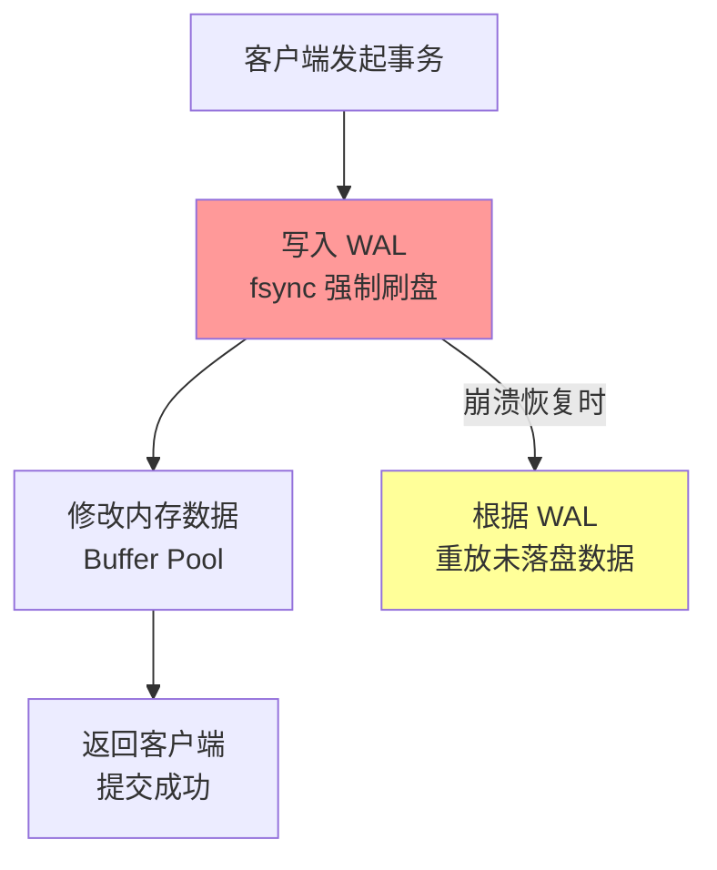
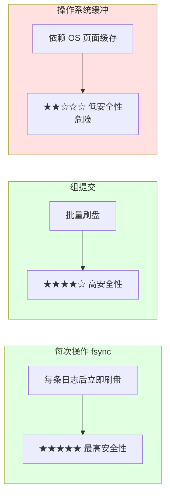
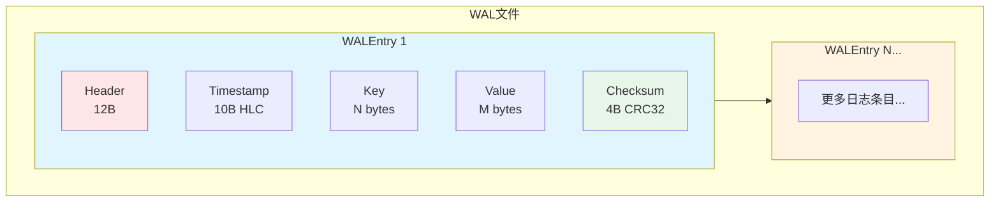
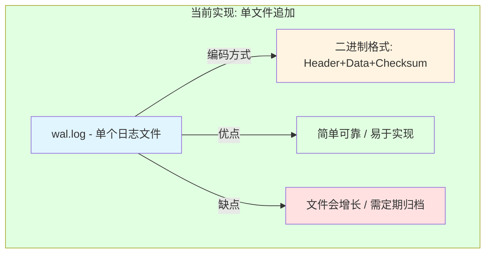
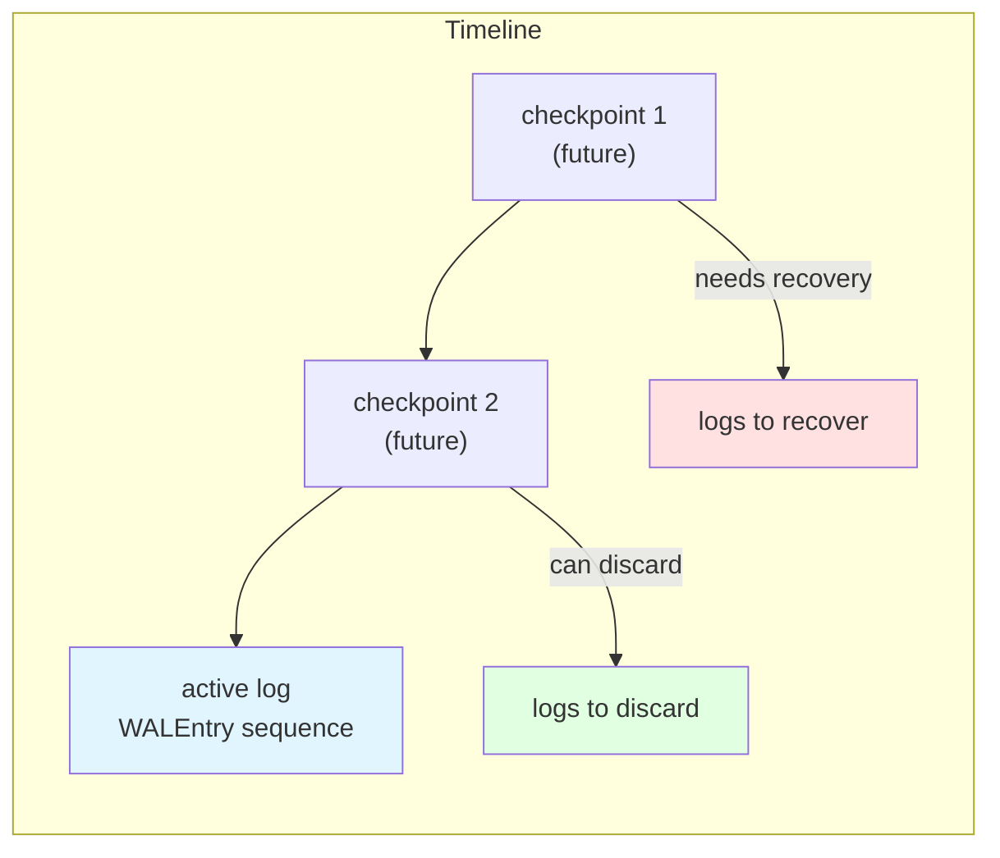
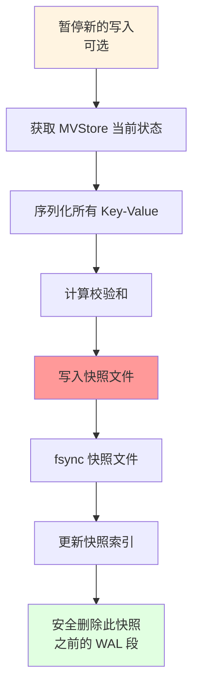
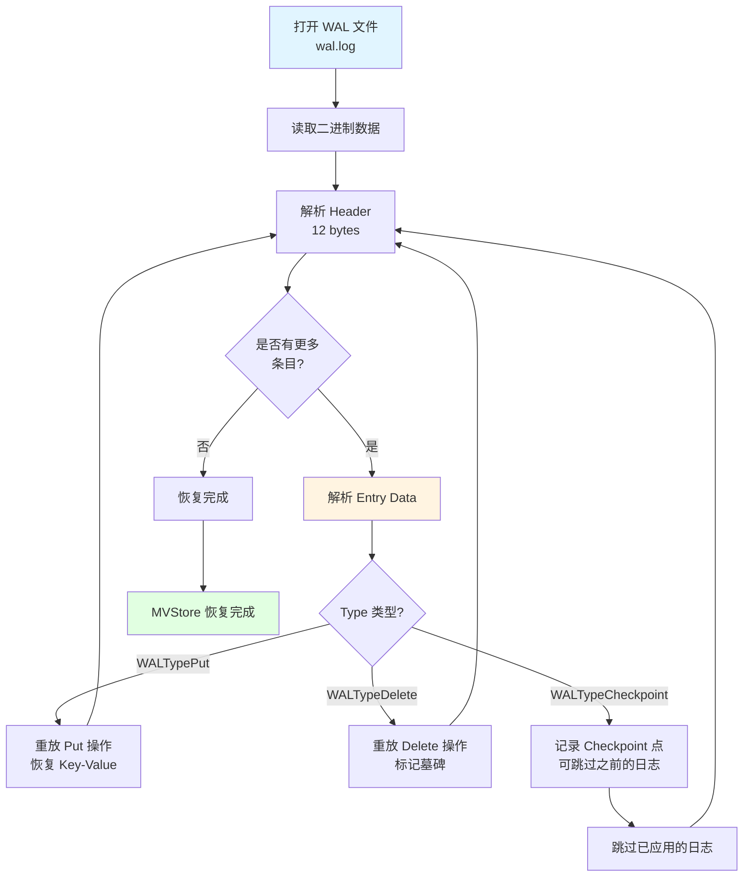

# WAL 崩溃恢复机制详解

> **文档版本**: v1.1
> **创建日期**: 2026-01-15
> **状态**: ✅ 核心机制说明

---

## 📋 核心概述

**Write-Ahead Log（预写日志）** 是一种保证数据持久性和原子性的核心技术。其核心思想是：

> **先写日志，后写数据**



---

## 一、WAL 核心原理

### 1.1 WAL 解决的问题

| 问题 | 描述 | WAL 如何解决 |
|------|------|-------------|
| **原子性** | 事务要么全做，要么全不做 | 未完成事务的日志标记为回滚 |
| **持久性** | 提交的数据不会丢失 | 提交前强制刷盘 |
| **一致性** | 数据状态始终有效 | 恢复时重放/回滚到一致状态 |

---

### 1.2 三种日志写入策略对比



**NexKV 建议策略**：策略 1 + 策略 2 混合（根据负载动态调整）

---

## 二、WAL 文件格式设计

### 2.1 整体结构



**磁盘格式**: 自定义二进制格式（详见 `02_数据结构设计.md` 第 1.2 节）

---

### 2.2 WALEntry 详细格式

```go
// WALEntry WAL 日志条目（MVStore 元数据存储）
type WALEntry struct {
    Timestamp *clock.HLC  // 操作时间戳（HLC，用于版本控制）
    Type      WALType     // 操作类型
    Key       string      // 键
    Value     []byte      // 值（Type = WALTypePut 时有效）
    OldValue  []byte      // 旧值（用于 MVCC 冲突检测，可选）
    Checksum  uint32      // 校验和（IEEE CRC32）
}

// WALType WAL 操作类型
type WALType uint16

const (
    WALTypePut       WALType = iota  // 写入操作
    WALTypeDelete                      // 删除操作（墓碑标记）
    WALTypeCheckpoint                  // 检查点操作
)

// WAL WAL 日志接口
type WAL interface {
    Append(entry *WALEntry) error      // 追加日志条目
    Recover() ([]*WALEntry, error)     // 从 WAL 恢复数据
    Truncate(offset int64) error       // 截断 WAL
    Sync() error                       // 强制刷盘
    Close() error                      // 关闭 WAL
}
```

**磁盘记录格式**:
```
+--------------+---------------+------------------+
| Header (12B) | Entry Data(N) | Checksum (4B)   |
+--------------+---------------+------------------+

Header 格式 (固定 12 字节):
+-------------+-------------+-------------+-------------+
| Type (2B)   | KeyLen (4B) | ValLen (4B) | TsLen (2B)  |
+-------------+-------------+-------------+-------------+
Type:   WALType (uint16)
KeyLen: Key 数据长度
ValLen: Value 数据长度
TsLen:  HLC 时间戳长度 (固定值 10)

Entry Data 格式 (变长，紧接 Header):
+-------------+-----------+-----------+
| Key         | Value     | Timestamp |
+-------------+-----------+-----------+
Key:       KeyLen 字节
Value:     ValLen 字节
Timestamp: TsLen 字节 (HLC 序列化: 8B pt + 2B c)
```

---

### 2.3 编码格式说明

**当前实现**: 自定义二进制格式（直接二进制读写）

**格式优势**:
- ✅ 高效：固定 Header + 变长 Data，解析快速
- ✅ 紧凑：最小化磁盘占用
- ✅ 可靠：CRC32 校验保证数据完整性
- ✅ 跨语言：二进制格式定义清晰，易于跨语言实现

**编码函数**（参考）:
```go
// 详见 docs/02_design/architecture/02_数据结构设计.md 第 1.2 节
func EncodeWALEntry(entry *WALEntry) ([]byte, error)
```

---

## 三、文件分隔策略

### 3.1 当前实现



### 3.2 文件命名规范

```bash
# 当前实现: 单文件命名
wal.log              # 主日志文件，所有 WALEntry 追加到此文件

# 未来可选: 按时间或大小分隔
wal_20260118.log     # 按日期分隔
wal_0001.log         # 按序号分隔
```

---

## 四、Checkpoint 机制

### 4.1 为什么需要 Checkpoint

> **当前状态**: 基础实现使用完整 WAL 重放，Checkpoint 机制为设计目标



**当前实现**: 直接读取 `wal.log` 重放所有 WALEntry

**未来优化**: 实现 Checkpoint 后可跳过已确认的日志条目

---

### 4.2 Checkpoint 设计（未来实现）

> **Snapshot 接口已在 MVStore 中定义**

```go
// SnapshotManager 快照管理接口（已在 mvstore.go 定义）
type SnapshotManager interface {
    Create(store MVStore) error           // 创建快照
    List() ([]string, error)               // 列出所有快照
    Restore(snapshotName string) ([]byte, error)  // 从快照恢复
    Delete(snapshotName string) error      // 删除快照
}
```

**快照格式设计**:
```go
// Snapshot 快照结构
type Snapshot struct {
    Version   uint64            // 快照版本
    Timestamp int64             // 快照时间
    Data      map[string][]byte // 数据快照
    Checksum  uint32            // 校验和
}
```


---

### 4.3 Checkpoint 创建流程（设计稿）



---

## 五、数据安全性保障

### 5.1 写入安全级别配置

```go
// 数据安全级别
type SafetyLevel int

const (
    SafetyLevel_Performance  SafetyLevel = iota  // 性能优先（可能丢失少量数据）
    SafetyLevel_Balanced                         // 平衡（推荐）
    SafetyLevel_Safety                           // 安全优先（数据零丢失）
)
```

---

### 5.2 崩溃恢复流程



**当前实现**（基于二进制格式）：

```go
// 从 WAL 恢复数据
func (w *WAL) Recover() ([]*WALEntry, error) {
    // 1. 打开 WAL 文件
    file, err := os.Open(w.path)
    if err != nil {
        return nil, err
    }
    defer file.Close()

    var entries []*WALEntry

    // 2. 逐条解析二进制格式
    for {
        // 读取 Header (12 bytes)
        header := make([]byte, 12)
        if _, err := io.ReadFull(file, header); err != nil {
            if err == io.EOF {
                break
            }
            return nil, err
        }

        // 解析 Header
        typ := WALType(binary.BigEndian.Uint16(header[0:2]))   // Type: [0:2]
        keyLen := binary.BigEndian.Uint32(header[2:6])         // KeyLen: [2:6]
        valLen := binary.BigEndian.Uint32(header[6:10])         // ValLen: [6:10]
        tsLen := binary.BigEndian.Uint16(header[10:12])         // TsLen: [10:12]

        // 读取 Entry Data (Key + Value + Timestamp)
        entryData := make([]byte, int(keyLen)+int(valLen)+int(tsLen))
        if _, err := io.ReadFull(file, entryData); err != nil {
            return nil, err
        }

        // 读取 Checksum (4 bytes)
        checksumBytes := make([]byte, 4)
        if _, err := io.ReadFull(file, checksumBytes); err != nil {
            return nil, err
        }

        // 解析 Entry Data 字段
        offset := 0
        key := string(entryData[offset : offset+int(keyLen)])
        offset += int(keyLen)
        value := entryData[offset : offset+int(valLen)]
        offset += int(valLen)
        timestampData := entryData[offset : offset+int(tsLen)]

        // 构造 WALEntry
        entry := &WALEntry{
            Type:      typ,
            Key:       key,
            Value:     value,
            Checksum:  binary.BigEndian.Uint32(checksumBytes),
        }
        entries = append(entries, entry)
    }

    return entries, nil
}
```

---

### 5.3 MVCC 与 WAL 结合

> **MVStore 使用 MVCC（多版本并发控制）**

| 特性 | 说明 | MVStore 实现 |
|------|------|--------------|
| **版本管理** | 每次写入创建新版本 | HLC 时间戳作为版本号 |
| **并发控制** | 读写不互相阻塞 | sync.Map 原子操作 |
| **WAL 作用** | 崩溃恢复 | 重放操作恢复到一致状态 |
| **墓碑标记** | 删除操作特殊处理 | WALTypeDelete + Deleted=true |

---

## 六、NexKV 具体实现要点

### 6.1 目录结构建议

```bash
storage/
└── wal/
    └── wal.log              # 当前实现: 单个 WAL 日志文件

# 未来扩展:
# storage/
# └── wal/
#     ├── wal.log
#     └── archive/          # 归档目录
#         ├── wal_20260101.log.gz
#         └── wal_20260102.log.gz
```

---

### 6.2 核心接口（已定义）

> **WAL 接口已在 `internal/metadata/store/mvstore.go` 定义**

```go
// WAL 接口（已在 mvstore.go 定义）
type WAL interface {
    Append(entry *WALEntry) error      // 追加日志条目
    Recover() ([]*WALEntry, error)     // 从 WAL 恢复数据
    Truncate(offset int64) error       // 截断 WAL
    Sync() error                       // 强制刷盘
    Close() error                      // 关闭 WAL
}

// MVStore 接口（已在 mvstore.go 定义）
type MVStore interface {
    Put(key string, value []byte) error
    Get(key string) ([]byte, error)
    GetVersion(key string, hlcTimestamp *clock.HLC) ([]byte, error)
    Delete(key string) error
    // ... 更多方法
}
```

---

### 6.3 写入路径（设计）

```go
// MVStore 写入操作（带 WAL）
func (s *MVStoreImpl) Put(key string, value []byte) error {
    // 1. 创建 WAL 条目
    timestamp := s.clock.Now()  // 获取 HLC 时间戳
    entry := &WALEntry{
        Timestamp: timestamp,
        Type:      WALTypePut,
        Key:       key,
        Value:     value,
        Checksum:  0, // 计算校验和
    }

    // 2. 先写 WAL（确保持久化）
    if err := s.wal.Append(entry); err != nil {
        return fmt.Errorf("failed to append WAL: %w", err)
    }

    // 3. 更新内存表
    s.data.Store(key, &VersionedValue{
        Key:       key,
        Value:     value,
        Version:   timestamp,
        Deleted:   false,
    })

    return nil
}
```

---

### 6.4 恢复路径（设计）

> **详见 5.2 节的崩溃恢复流程**

**关键步骤**：
1. 打开 `wal.log` 文件
2. 逐条解析二进制格式（Header + Data + Checksum）
3. 根据 Type 重放操作（Put/Delete/Checkpoint）
4. 恢复 MVStore 状态

---

### 6.4 恢复路径（当前实现）

> 详见 5.2 节的崩溃恢复流程和代码实现

**关键步骤**：
1. 打开 `wal.log` 文件
2. 逐条解析二进制格式（Header + Data + Checksum）
3. 根据 Type 重放操作（Put/Delete/Checkpoint）
4. 恢复 MVStore 状态

---

## 七、监控指标

| 指标 | 含义 | 告警阈值 |
|------|------|---------|
| `wal_file_size` | WAL 文件大小 | > 1GB |
| `wal_entry_count` | WAL 条目数量 | > 100000 |
| `recovery_duration_ms` | 恢复耗时 | > 30s |
| `append_latency_ms` | 追加延迟 | P99 > 100ms |

---

## 八、总结

| 组件 | 关键决策 | 当前实现 |
|------|---------|--------------|
| **编码格式** | 自定义二进制 / MessagePack / JSON | ✅ 自定义二进制（Header + Data + Checksum） |
| **数据结构** | WALEntry 结构 | ✅ 包含 Timestamp(HLC)、Type、Key、Value、OldValue、Checksum |
| **文件分隔** | 单文件 vs 多文件 | ✅ 当前单文件（wal.log） |
| **刷盘策略** | 实时 vs 延迟 | ✅ 每次追加后 fsync |
| **Checkpoint** | 已实现 vs 未实现 | ❌ 当前未实现（直接重放所有日志） |
| **恢复策略** | 完整重放 | ✅ 逐条解析二进制格式并重放 WALEntry |

---

## 九、未来改进方向

### 9.1 Codec 接口扩展

> **Brainstorm 记录**: 添加 Codec 接口，默认使用 MessagePack

**当前问题**:
- gob 编码仅限 Go 语言，不支持跨语言访问
- 缺少可插拔的编码器接口

**改进方案**:
```go
// Codec 编码器接口
type Codec interface {
    Encode(v interface{}) ([]byte, error)
    Decode(data []byte, v interface{}) error
    Name() string
}

// MessagePack Codec（默认）
type MessagePackCodec struct{}

func (m *MessagePackCodec) Encode(v interface{}) ([]byte, error) {
    return msgpack.Marshal(v)
}

func (m *MessagePackCodec) Decode(data []byte, v interface{}) error {
    return msgpack.Unmarshal(data, v)
}

// WAL 结构改进
type WAL struct {
    file   *os.File
    path   string
    mu     sync.Mutex
    codec  Codec              // 可插拔编码器
}

// 使用 MessagePack Codec（默认）
func NewWAL(dataDir string) (*WAL, error) {
    return &WAL{
        codec: &MessagePackCodec{},
        // ...
    }, nil
}
```

**优势**:
- ✅ 支持跨语言访问（Python、Java、C++ 等）
- ✅ 更高效的二进制编码
- ✅ 保持向后兼容（可选 gob）

---

**文档版本**: v2.0
**最后更新**: 2026-01-18
**维护者**: NexKV 开发团队
