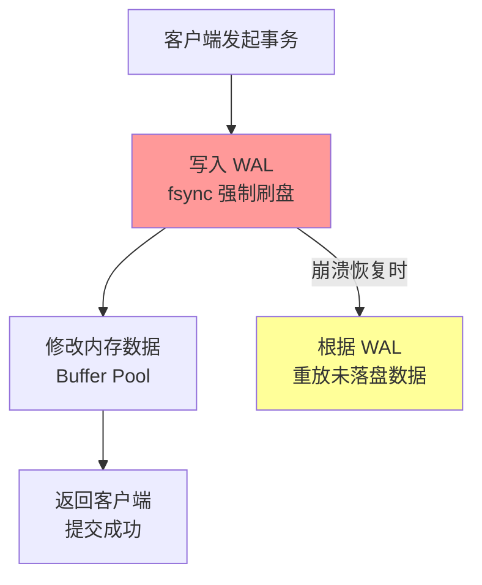
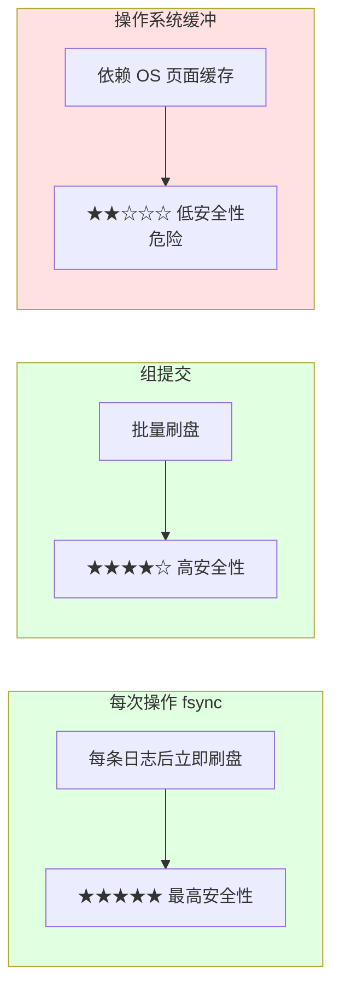
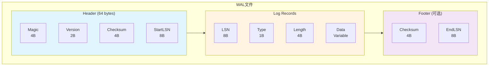
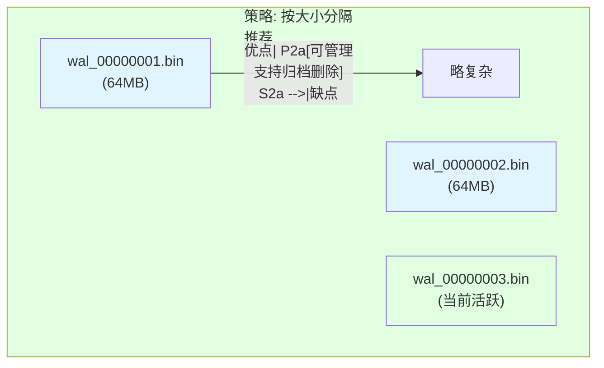
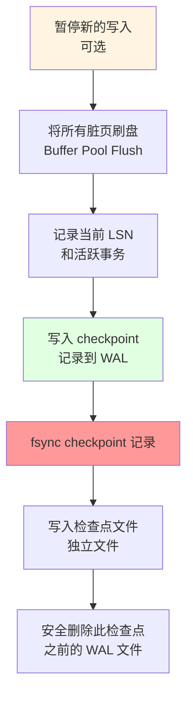

# WAL 崩溃恢复机制详解

> **文档版本**: v1.1
> **创建日期**: 2026-01-15
> **状态**: ✅ 核心机制说明

---

## 📋 核心概述

**Write-Ahead Log（预写日志）** 是一种保证数据持久性和原子性的核心技术。其核心思想是：

> **先写日志，后写数据**



---

## 一、WAL 核心原理

### 1.1 WAL 解决的问题

| 问题 | 描述 | WAL 如何解决 |
|------|------|-------------|
| **原子性** | 事务要么全做，要么全不做 | 未完成事务的日志标记为回滚 |
| **持久性** | 提交的数据不会丢失 | 提交前强制刷盘 |
| **一致性** | 数据状态始终有效 | 恢复时重放/回滚到一致状态 |

---

### 1.2 三种日志写入策略对比



**NexKV 建议策略**：策略 1 + 策略 2 混合（根据负载动态调整）

---

## 二、WAL 文件格式设计

### 2.1 整体结构



---

### 2.2 Log Record 详细格式

```go
// WAL 日志记录结构
type LogRecord struct {
    LSN           int64     // 日志序列号，全局递增
    TransactionID int64     // 事务 ID
    Type          LogType   // 日志类型
    Checksum      uint32    // CRC32 校验
    Length        int       // Data 长度
    Data          []byte    // 序列化数据

    // 变长字段
    BeforeImage   []byte    // 变更前的值（可选，用于 undo）
    AfterImage    []byte    // 变更后的值（可选，用于 redo）
}
```

---

### 2.3 文件格式选择对比

| 格式 | 优点 | 缺点 | 推荐场景 |
|------|------|------|---------|
| **二进制格式** | 高效、节省空间、解析快 | 可读性差、需工具查看 | 生产环境首选 |
| **JSON** | 可读性好、易调试 | 体积大、解析慢 | 开发/测试 |
| **Protocol Buffers** | 高效、可扩展、跨语言 | 需要编译 schema | 分布式系统 |

**NexKV 推荐**：二进制格式 + 独立的解析工具

---

## 三、文件分隔策略

### 3.1 推荐策略



### 3.2 推荐的命名规范

```bash
# 命名格式: wal_{LSN范围_start}.bin
wal_00000000000000000001.bin   # LSN 1 ~ 1,000,000
wal_00000000000010000001.bin   # LSN 1,000,001 ~ 2,000,000
```

---

## 四、Checkpoint 机制

### 4.1 为什么需要 Checkpoint

```mermaid
flowchart LR
    subgraph 时间线
        CP1["checkpoint 1"] --> CP2["checkpoint 2"] --> Active["活跃日志"]
        CP1 -->|"需要恢复| R1["需要恢复的日志"]
        CP2 -->|"可丢弃| R2["可以丢弃的日志"]
    end

    style R1 fill:#ffe1e1
    style R2 fill:#e1ffe1
    style Active fill:#e1f5ff
```

---

### 4.2 Checkpoint 内容

```go
// Checkpoint 记录包含的信息
type Checkpoint struct {
    CheckpointLSN     int64              // 检查点 LSN
    NextLSN           int64              // 下一个可用的 LSN
    TransactionTable  map[int64]TransactionState  // 活跃事务表

    // Buffer Pool 元数据
    DirtyPages        map[int]PageState  // 脏页信息

    // 节点特定信息
    RegionID          int                // Region ID
    LeaderID          string             // Leader 节点 ID
    Term              int64              // 当前任期（用于 2PC）

    // 元数据版本
    MetadataVersion   int64              // 元数据版本号
    Timestamp         time.Time          // 创建时间
}
```

---

### 4.3 Checkpoint 创建流程



---

## 五、数据安全性保障

### 5.1 写入安全级别配置

```go
// 数据安全级别
type SafetyLevel int

const (
    SafetyLevel_Performance  SafetyLevel = iota  // 性能优先（可能丢失少量数据）
    SafetyLevel_Balanced                         // 平衡（推荐）
    SafetyLevel_Safety                           // 安全优先（数据零丢失）
)
```

---

### 5.2 崩溃恢复流程

```mermaid
flowchart TD
    A["读取最近的<br/>checkpoint"] --> B["加载检查点状态<br/>Buffer Pool、事务表"]
    B --> C["定位需要恢复的<br/>WAL 起始位置"]
    C --> D["重放 WAL 日志"]

    subgraph 重放逻辑
        D --> E{"日志类型?"}
        E -->|"UPDATE| F["REDO: 应用 AfterImage"]
        E -->|"COMMIT| G["标记为已提交"]
        E -->|"ROLLBACK| H["UNDO: 回滚或标记删除"]
    end

    F --> I["处理未提交事务"]
    G --> I
    H --> I
    I --> J["恢复正常服务"]

    style A fill:#e1f5ff
    style D fill:#fff4e1
    style J fill:#e1ffe1
```

---

### 5.3 UNDO/REDO 日志对比

| 特性 | UNDO 日志 | REDO 日志 | UNDO+REDO（NexKV 推荐） |
|------|----------|----------|-------------------------|
| **原理** | 记录修改前值 | 记录修改后值 | 两者都记录 |
| **恢复时** | 回滚未提交事务 | 重放已提交事务 | 先UNDO未提交，再REDO已提交 |
| **存储开销** | 中 | 中 | 高 |
| **实现复杂度** | 低 | 低 | 中 |
| **适用场景** | 内存数据库 | 只读场景 | 通用场景 |

---

## 六、NexKV 具体实现要点

### 6.1 目录结构建议

```bash
storage/
├── wal/
│   ├── wal_00000000000000000001.bin    # WAL 文件
│   ├── wal_00000000000000000002.bin
│   ├── checkpoint_00000000000000000001.bin  # 检查点文件
│   └── archive/
│       ├── wal_00000000000000000001.bin.gz   # 归档的 WAL
│       └── checkpoint_00000000000000000001.bin.gz
├── data/
│   ├── 00000000000000000001.dat       # 数据文件
│   └── 00000000000000000002.dat
└── metadata/
    └── manifest.bin                    # 元数据清单
```

---

### 6.2 核心代码结构

```go
// WAL 管理器
type WALManager struct {
    dir             string              // WAL 目录
    currentFile     *WALFile            // 当前活跃文件
    fileSizeLimit   int64               // 文件大小限制（默认 64MB）
    nextLSN         int64               // 下一个 LSN
    checkpointLSN   int64               // 上一个检查点 LSN

    // 写入优化
    buffer          []byte              // 写入缓冲
    bufferPos       int                 // 缓冲位置
    flushInterval   time.Duration       // 刷盘间隔

    // 并发控制
    mu              sync.Mutex
    writeCond       *sync.Cond
}
```

---

### 6.3 写入路径（伪代码）

```go
func (tm *TransactionLogger) WriteUpdate(txID int64, key, before, after []byte) error {
    // 1. 序列化日志记录
    record := &LogRecord{
        LSN:           atomic.AddInt64(&tm.walManager.nextLSN, 1),
        TransactionID: txID,
        Type:          LogTypeUpdate,
        BeforeImage:   before,
        AfterImage:    after,
        Checksum:      crc32.ChecksumIEEE(after),
    }

    // 2. 写入缓冲区（不刷盘）
    tm.walManager.bufferRecord(record)

    // 3. 检查是否需要刷盘（组提交）
    if tm.walManager.shouldFlush() {
        tm.walManager.flushBuffer()
    }

    return nil
}

func (tm *TransactionLogger) Commit(txID int64) error {
    // 1. 写入提交记录
    record := &LogRecord{
        LSN:           atomic.AddInt64(&tm.walManager.nextLSN, 1),
        TransactionID: txID,
        Type:          LogTypeCommit,
    }

    tm.walManager.bufferRecord(record)

    // 2. 【关键】强制刷盘，确保持久化
    if err := tm.walManager.flushBuffer(); err != nil {
        return err
    }

    // 3. 标记事务为已提交
    tm.transactionTable[txID].Status = Committed

    return nil
}
```

---

### 6.4 恢复路径（伪代码）

```go
func (tm *TransactionLogger) Recover() error {
    // 1. 查找并加载最近的 checkpoint
    checkpoint, err := tm.loadLatestCheckpoint()
    if err != nil {
        return err
    }

    // 2. 重放 checkpoint 之后的日志
    lsn := checkpoint.CheckpointLSN
    for {
        record, err := tm.walManager.readRecord(lsn)
        if err == io.EOF {
            break  // 读完所有日志
        }
        if err != nil {
            return err
        }

        // 根据日志类型处理
        switch record.Type {
        case LogTypeUpdate:
            // REDO：重放已提交事务的修改
            if tm.transactionTable[record.TransactionID].Status == Committed {
                tm.applyUpdate(record.AfterImage)
            }

        case LogTypeCommit:
            tm.transactionTable[record.TransactionID].Status = Committed

        case LogTypeRollback:
            tm.transactionTable[record.TransactionID].Status = RolledBack
        }

        lsn = record.LSN + int64(record.Length)
    }

    // 3. 回滚未提交的事务
    tm.rollbackUncommittedTransactions()

    return nil
}
```

---

## 七、监控指标

| 指标 | 含义 | 告警阈值 |
|------|------|---------|
| `wal_size_bytes` | WAL 目录总大小 | > 10GB |
| `wal_file_count` | 活跃 WAL 文件数 | > 100 |
| `checkpoint_duration_ms` | Checkpoint 耗时 | > 10s |
| `recovery_duration_ms` | 恢复耗时 | > 30s |
| `flush_latency_ms` | 刷盘延迟 | P99 > 100ms |
| `transaction_active_count` | 活跃事务数 | > 10000 |

---

## 八、总结

| 组件 | 关键决策 | NexKV 推荐 |
|------|---------|--------------|
| **文件格式** | 二进制 vs 文本 | 二进制 + 独立解析工具 |
| **文件分隔** | 单文件 vs 多文件 | 按大小分隔（64MB/文件） |
| **刷盘策略** | 每次 vs 组提交 | 组提交 + 提交时强制 |
| **Checkpoint** | 触发策略 | 复合触发（时间+大小+手动） |
| **恢复策略** | UNDO vs REDO | UNDO+REDO |
| **目录布局** | 集中 vs 分散 | 按 Region 分目录 |

---

**文档版本**: v1.1
**最后更新**: 2026-01-15
**维护者**: NexKV 开发团队
