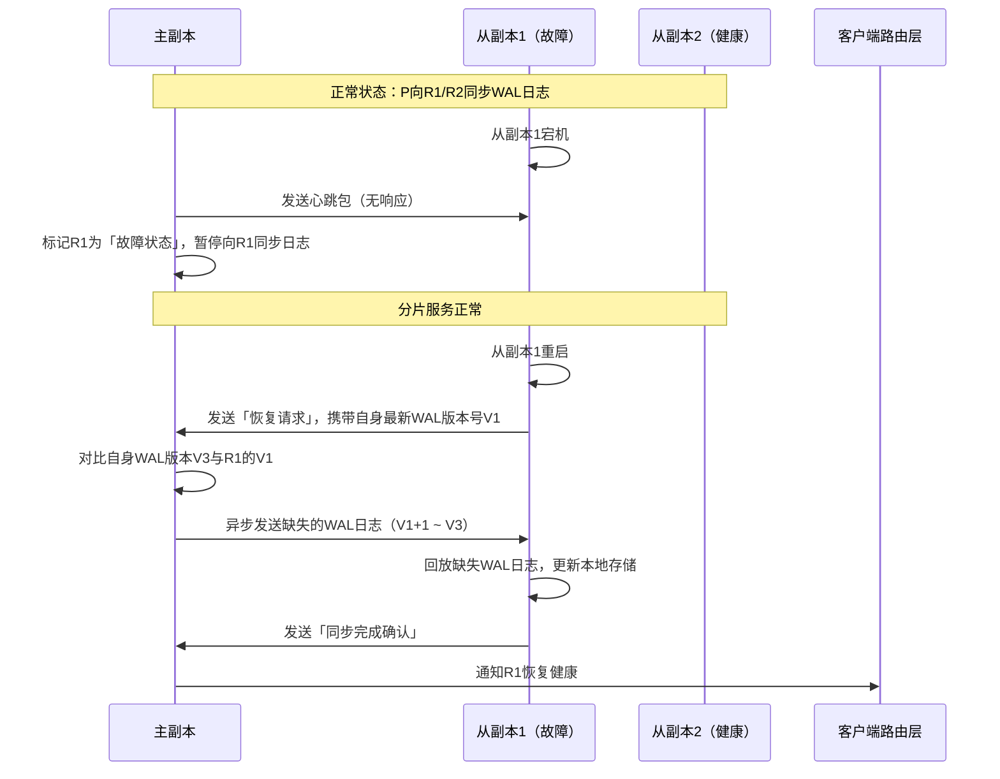

# 故障恢复机制

> **文档版本**: v1.0
> **创建日期**: 2026-01-17
> **状态**: ✅ 核心机制说明

---

## 📋 核心概述

「故障恢复」是保障分片级主从自治架构高可用的关键能力，核心逻辑是 **「分片内自治恢复+全自动化数据补全」**，无需集群级中心节点干预，故障影响范围严格限定在单个分片内。

结合「可调一致性」特性，故障恢复会根据分片的一致性配置（最终一致/强一致）自适应执行，做到**故障检测→自动选主→数据补全→服务恢复**的全流程闭环。

---

## 一、核心原理

### 1.1 核心目标

故障恢复的对象是**分片副本组内的节点故障**（主副本故障/从副本故障），核心目标是：

1. **快速检测**：副本组内节点通过心跳机制检测故障，延迟控制在毫秒级
2. **自动选主**：主副本故障时，分片内从副本自动选举新主，不影响其他分片
3. **数据补全**：故障节点重启后，自动向健康副本同步缺失数据
4. **无缝切换**：客户端路由层自动感知新主，业务无感知

### 1.2 故障类型与恢复策略

| 故障类型 | 影响范围 | 核心恢复策略 | 一致性保障 |
|----------|----------|--------------|------------|
| **从副本故障** | 仅该从副本不可用 | 1. 主副本暂停向该从副本同步日志<br>2. 故障从副本重启后，自动拉取缺失 WAL 日志 | 最终一致：无数据丢失风险<br>强一致：多数派副本存活，数据安全 |
| **主副本故障** | 该分片暂时无法提供写服务 | 1. 分片内从副本选举新主<br>2. 新主同步其他从副本的缺失日志<br>3. 客户端路由切换到新主 | 最终一致：可能丢失未同步的日志<br>强一致：多数派 WAL 已落地，无数据丢失 |

### 1.3 整体架构流程图

以 **3副本分片（主副本故障）** 为例：

```mermaid
flowchart TB
    subgraph 分片X副本组（3副本）
        P[主副本（故障）]
        R1[从副本1（健康）]
        R2[从副本2（健康）]
    end

    subgraph 故障恢复全流程
        A[故障检测] --> B[自动选主]
        B --> C[数据补全]
        C --> D[服务恢复]
    end

    P -.->|心跳超时| A[心跳检测：R1/R2未收到P的心跳]
    A -->|触发分片内选举| B[选主：R1/R2对比WAL日志版本]
    B --> R1New[R1升级为新主副本]
    R1New -->|拉取R2的缺失日志| C[数据补全：R1与R2同步WAL日志]
    C -->|通知路由层| D[服务恢复：客户端路由切换到R1New]
    P_Restart[P重启后] -->|主动向R1New拉取缺失日志| C
    P_Restart -->|降级为从副本| R1New
```

---

## 二、故障恢复流程

### 2.1 从副本故障恢复（最常见，无服务中断）

#### 核心原理

从副本故障仅影响自身数据同步，分片的读写服务完全不受影响，恢复流程**异步执行，无需选主**。

#### 时序图



#### 关键特点

- **无服务中断**：整个恢复过程分片的读写服务完全正常
- **增量数据补全**：仅同步故障期间缺失的 WAL 日志，效率极高
- **自适应一致性**：
  - 最终一致分片：恢复后可能存在短暂数据不一致，异步追平
  - 强一致分片：因多数派副本存活，数据无丢失

---

### 2.2 主副本故障恢复（核心场景，自动选主）

主副本故障会导致分片暂时无法提供写服务，恢复的核心是 **「分片内自动选主+日志补全」**，选主依据是**WAL日志的最新版本号**。

#### 核心前提

- 分片副本数 ≥3（保证故障后仍有多数派副本存活）
- 所有副本都持久化 WAL 日志到磁盘

#### 时序图（以强一致分片为例，W=2）

```mermaid
sequenceDiagram
    participant P as 原主副本（故障）
    participant R1 as 从副本1（WAL版本V5）
    participant R2 as 从副本2（WAL版本V4）
    participant Router as 客户端路由层

    Note over P,R1,R2: 强一致分片：P已向R1同步到V5
    P->>P: 主副本宕机
    R1->>P: 发送心跳包（无响应）
    R2->>P: 发送心跳包（无响应）
    R1->>R2: 发送「选举请求」，携带自身WAL版本V5
    R2->>R1: 回复「选举响应」，携带自身WAL版本V4
    R1->>R1: 对比版本：V5>V4，判定自己当选新主
    R1->>R2: 发送「新主通知」
    Note over R1,R2: 分片内选主完成

    R1->>Router: 发送「主副本切换通知」
    Router->>Router: 更新路由表：分片X的主副本为R1
    Router->>R1: 客户端写请求路由到R1
    Note over R1,Router: 分片写服务恢复

    P->>P: 原主副本重启
    P->>R1: 发送「恢复请求」
    R1->>P: 发送「降级通知」，标记P为从副本
    R1->>P: 同步新产生的WAL日志
    P->>P: 回放日志，降级为从副本
```

#### 一致性保障差异

| 一致性模式 | 主副本故障影响 | 数据丢失风险 | 恢复后数据一致性 |
|------------|----------------|--------------|------------------|
| **最终一致** | 写服务中断，读服务可从从副本读取 | 有风险：未同步的 WAL 日志会丢失 | 恢复后以新主的日志为准 |
| **强一致（W=2）** | 写服务中断，读服务可从从副本读取 | 无风险：多数派副本已同步最新 WAL | 恢复后数据完全一致 |

---

## 三、核心特点

### 3.1 分片内自治，无集群级依赖

- 故障检测、选主、数据补全**全部在分片副本组内完成**，无需集群级中心节点干预
- 故障影响范围严格限定在单个分片，其他分片的服务完全正常
- 选主逻辑极简：基于 WAL 日志版本号，恢复速度更快（毫秒级）

### 3.2 以 WAL 为核心，数据恢复高效可靠

- 所有故障恢复的依据是**持久化到磁盘的 WAL 日志**
- 数据补全采用**增量同步**，仅同步故障期间缺失的日志片段
- WAL 日志支持**按时间/版本号分段**，可实现"任意时间点的数据恢复"

### 3.3 适配「单机-分布式一体」架构

- **单机模式**：副本数=1，故障恢复退化为「本地 WAL 日志重放」
- **分布式模式**：新增副本后，故障恢复逻辑自动升级为「分片内选主+增量同步」
- 无缝切换：用户感知不到底层差异

### 3.4 与可调一致性深度联动

- 强一致分片：因多数派 WAL 已落地，故障恢复后**数据零丢失**
- 最终一致分片：恢复速度更快，适合对性能要求高于数据安全性的场景
- 恢复策略自适应：分片的一致性配置决定了恢复后的一致性级别

---

## 四、与传统方案的差异对比

| 对比维度 | 传统分布式数据库 | NexKV 分片级自治恢复 |
|----------|------------------|----------------------|
| 故障影响范围 | 主节点故障→全集群写服务中断 | 主副本故障→仅对应分片写服务中断 |
| 恢复依赖 | 依赖中心节点选主 | 分片内自治选主，无中心依赖 |
| 恢复速度 | 秒级（需全集群投票） | 毫秒级（仅分片内对比 WAL 版本） |
| 数据补全方式 | 全量数据拷贝 | 增量 WAL 日志同步 |
| 单机模式适配 | 不支持 | 完全支持，恢复逻辑自动退化 |

---

## 五、总结

NexKV 的故障恢复机制，核心是 **「以 WAL 日志为基石，以分片自治为核心，实现故障的快速检测、自动恢复、数据无损补全」**：

- 对从副本故障：异步增量同步日志，服务无感知
- 对主副本故障：分片内自动选主，数据按需补全
- 与可调一致性深度联动，兼顾性能与数据安全
- 完美适配「单机-分布式一体」架构

这种设计真正做到了 **"故障恢复自动化、影响范围最小化、数据安全可配置"**，是分片级主从自治架构高可用的核心保障。

---

**文档版本**: v1.0
**最后更新**: 2026-01-17
**维护者**: NexKV 开发团队
