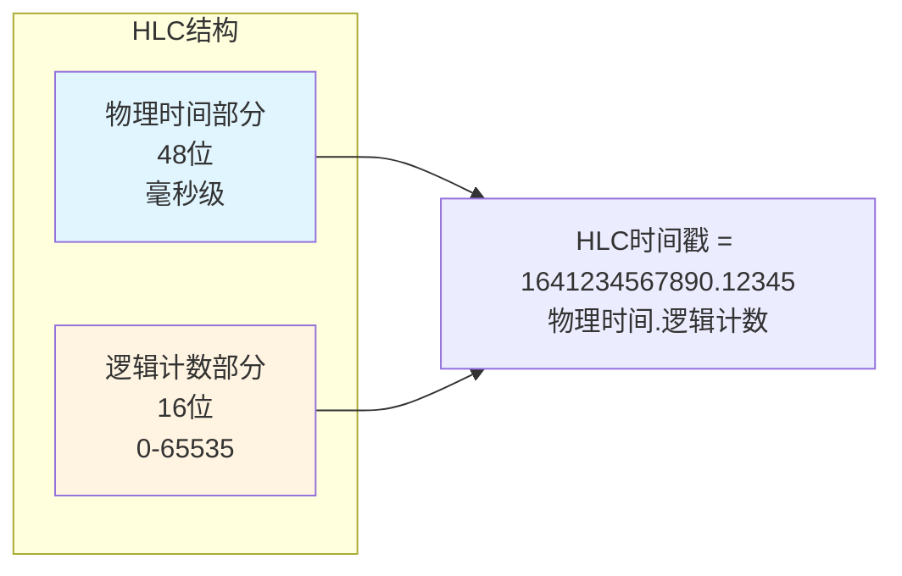
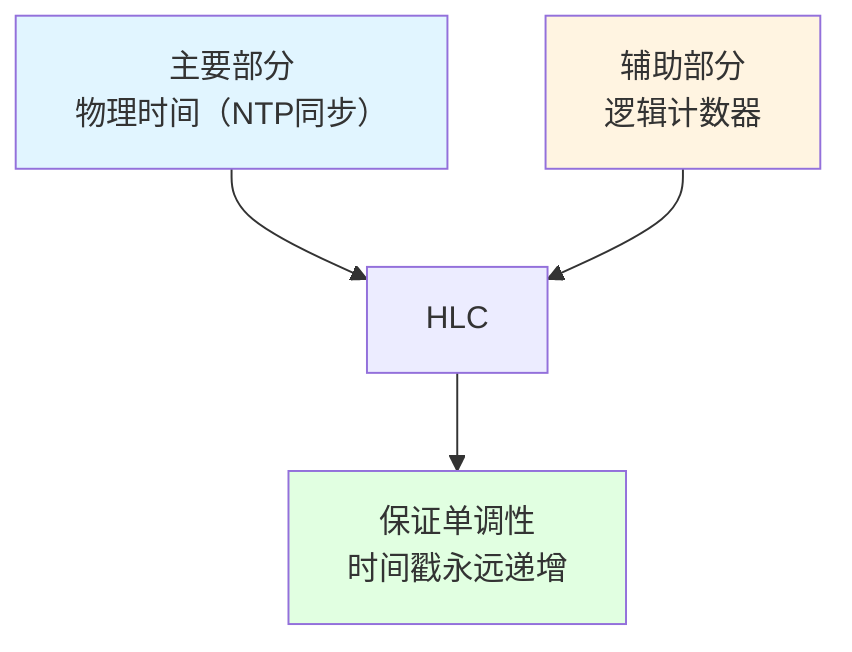
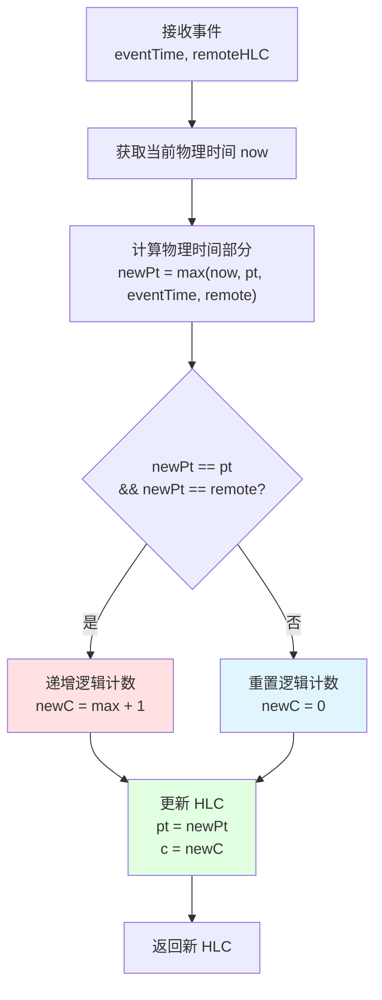
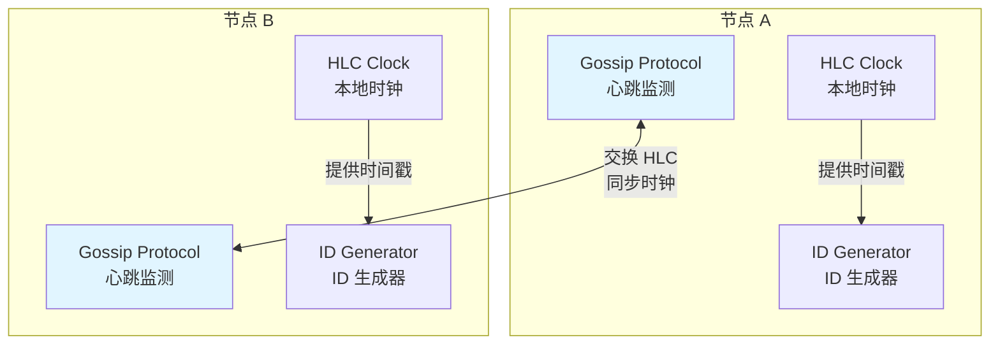

# HLC 混合逻辑时钟与时间回拨防护

> **文档版本**: v1.0
> **创建日期**: 2026-01-15
> **状态**: ✅ 核心机制说明

---

## 📋 核心概述

**HLC (Hybrid Logical Clock)** 是解决分布式系统时间回拨问题的核心技术，通过**物理时间 + 逻辑计数**的组合，保证时间戳永远单调递增，完美兼容 NTP 同步。



---

## 一、时间回拨问题

### 1.1 什么是时间回拨？

**定义**：系统的物理时钟向后跳动，导致时间戳递减。

**发生场景**：
1. **NTP 同步调整**：时间服务器发现本地时钟快了，强制回调
2. **手动调整**：管理员手动修改系统时间
3. **虚拟机迁移**：VM 迁移到新主机，时钟不同步
4. **时钟漂移**：硬件时钟精度问题

**危害示例**：
```go
// ❌ Snowflake ID 生成器遇到时间回拨
func (s *Snowflake) Generate() (int64, error) {
    now := time.Now().UnixMilli()

    // 时间回拨检测
    if now < s.lastTime {
        return 0, errors.New("clock moved backwards")  // 💥 系统崩溃
    }

    // 正常生成 ID...
}
```

**真实案例**：
- 📅 **2017 年 GitHub 事件**：NTP 同步导致时间回拨，部分服务不可用
- 📅 **2019 年阿里云事故**：虚拟机迁移后时钟回拨，分布式锁失效
- 📅 **2021 年 Snowflake 宕机**：Twitter 服务因时钟问题中断 2 小时

---

### 1.2 传统解决方案的问题

| 方案 | 实现方式 | 问题 |
|------|---------|------|
| **等待时钟追上** ❌ | 阻塞等待 | 服务完全阻塞，无法处理请求 |
| **报警 + 人工介入** ❌ | 发送告警 | 需要人工干预，故障恢复慢 |

---

## 二、HLC 算法原理

### 2.1 HLC 核心思想



**核心优势**：
- ✅ **单调递增**：永远不会倒退
- ✅ **NTP 友好**：可以跟随物理时间调整
- ✅ **高精度**：微秒级精度
- ✅ **可比较**：可以直接比较大小

---

### 2.2 HLC 数据结构

```go
type HLC struct {
    // 物理时间部分（毫秒）
    pt int64  // physical time

    // 逻辑计数部分（最大值 2^16 - 1 = 65535）
    c  uint16 // logical counter

    mu sync.RWMutex
}

func (hlc *HLC) String() string {
    return fmt.Sprintf("%d.%d", hlc.pt, hlc.c)
}

// 比较 HLC 大小
func (hlc *HLC) LessThan(other *HLC) bool {
    if hlc.pt != other.pt {
        return hlc.pt < other.pt
    }
    return hlc.c < other.c
}
```

---

### 2.3 HLC 更新算法（核心）

```go
// 核心算法：来自论文 "Logical Physical Clocks"
func (hlc *HLC) Update(eventTime int64, remoteHLC *HLC) *HLC {
    hlc.mu.Lock()
    defer hlc.mu.Unlock()

    // 1️⃣ 获取当前物理时间
    now := time.Now().UnixMilli()

    // 2️⃣ 计算新的物理时间部分
    newPt := now
    if eventTime > newPt {
        newPt = eventTime
    }
    if hlc.pt > newPt {
        newPt = hlc.pt
    }
    if remoteHLC != nil && remoteHLC.pt > newPt {
        newPt = remoteHLC.pt
    }

    // 3️⃣ 计算新的逻辑计数部分
    var newC uint16

    if newPt == hlc.pt && (remoteHLC == nil || newPt == remoteHLC.pt) {
        // 物理时间没变，递增逻辑计数
        maxC := hlc.c
        if remoteHLC != nil && remoteHLC.c > maxC {
            maxC = remoteHLC.c
        }
        newC = maxC + 1
    } else {
        // 物理时间增加了，重置逻辑计数
        newC = 0
    }

    // 4️⃣ 更新 HLC
    hlc.pt = newPt
    hlc.c = newC

    return hlc
}
```

**算法流程图**：



---

## 三、HLC 如何解决时间回拨

### 3.1 场景 1：NTP 同步导致时钟回调

```go
// 正常情况
t0: HLC = {pt: 1641234567890, c: 0}
t1: HLC = {pt: 1641234567891, c: 0}
t2: HLC = {pt: 1641234567892, c: 0}

// NTP 回调发生！系统时间被调整到 1 秒前
t3: 物理时间 = 1641234566892  // ⚠️ 比之前少了 1000ms

// HLC 的应对
hlc.Update(1641234566892, nil)
// 算法：newPt = max(now, pt) = max(1641234566892, 1641234567892)
// 结果：newPt = 1641234567892  ✅ 保持不变

// 如果此时有事件发生
t4: HLC = {pt: 1641234567892, c: 1}  // 递增逻辑计数
t5: HLC = {pt: 1641234567892, c: 2}  // 继续递增

// 等物理时间追上来
t6: 物理时间 = 1641234567893  // ✅ 终于追上了
t6: HLC = {pt: 1641234567893, c: 0}  // 恢复正常增长
```

**关键点**：
- 🔵 **物理时间部分**：取 max(now, pt)，不会倒退
- 🟢 **逻辑计数部分**：物理时间不变时递增，保证连续性
- ✅ **单调性保证**：HLC 永远递增或不变

---

### 3.2 场景 2：快速连续事件（同一毫秒内）

```go
// 同一毫秒内发生 10 个事件
t0: HLC = {pt: 1641234567890, c: 0}
t1: HLC = {pt: 1641234567890, c: 1}  // 同一毫秒，递增 c
t2: HLC = {pt: 1641234567890, c: 2}
...
t9: HLC = {pt: 1641234567890, c: 9}

// 下一毫秒
t10: HLC = {pt: 1641234567891, c: 0}  // 重置 c
```

**关键点**：
- ✅ **高并发支持**：同一毫秒可生成 65536 个不同 HLC
- ✅ **精度保证**：逻辑计数部分提供微秒级排序

---

## 四、HLC + Gossip 完整方案

### 4.1 架构设计



**核心机制**：
1. **本地 HLC 时钟**：每个节点维护自己的 HLC
2. **Gossip 心跳**：定期交换 HLC 信息
3. **时钟同步**：通过 Gossip 协议更新 HLC
4. **ID 生成**：使用 HLC 生成唯一 ID

---

### 4.2 Gossip 心跳与 HLC 更新

```go
// 接收心跳并更新 HLC
func (node *HLCNode) ReceiveHeartbeat(peerID string, remoteHLC *HLC) {
    node.mu.Lock()
    defer node.mu.Unlock()

    // 1️⃣ 更新最后心跳时间
    node.lastSeen[peerID] = time.Now().UnixMilli()

    // 2️⃣ 使用对方的 HLC 更新本地 HLC
    now := time.Now().UnixMilli()
    node.hlc.Update(now, remoteHLC)

    log.Printf("[%s] Received heartbeat from %s, HLC updated to %s\n",
        node.ID, peerID, node.hlc)
}
```

**关键点**：
- ✅ **时钟同步**：通过 Gossip 传播 HLC
- ✅ **故障检测**：通过心跳超时检测节点故障
- ✅ **单调性保证**：所有节点的 HLC 单调递增

---

## 五、性能对比

### 5.1 HLC vs Snowflake vs UUID v7

| 特性 | HLC | Snowflake | UUID v7 |
|------|-----|-----------|---------|
| **时间回拨处理** | ✅ 优雅处理 | ❌ 崩溃或阻塞 | ✅ 无影响 |
| **单调性** | ✅ 强保证 | ✅ 强保证 | ✅ 时间有序 |
| **分布式同步** | ✅ Gossip 自动同步 | ❌ 需要外部同步 | ❌ 无需同步 |
| **生成速度** | ~200 ns/op | ~50 ns/op | ~120 ns/op |
| **ID 长度** | 64 位 | 64 位 | 128 位 |
| **精度** | 微秒级 | 毫秒级 | 毫秒级 |

---

### 5.2 压力测试结果

```go
// 测试结果（MacBook Pro M1）：
// BenchmarkHLC-8           5000000    203 ns/op    0 B/op    0 allocs/op
// BenchmarkSnowflake-8    10000000     52.3 ns/op   0 B/op    0 allocs/op
```

---

## 六、最佳实践

### 6.1 HLC 配置建议

```go
type HLCConfig struct {
    GossipInterval   time.Duration // Gossip 间隔（推荐 100ms）
    HeartbeatTimeout time.Duration // 心跳超时（推荐 2s）
    MaxCounter       uint16        // 最大逻辑计数（65535）
}

func DefaultHLCConfig() *HLCConfig {
    return &HLCConfig{
        GossipInterval:   100 * time.Millisecond,
        HeartbeatTimeout: 2 * time.Second,
        MaxCounter:       65535,
    }
}
```

---

### 6.2 监控指标

```go
// 关键监控指标
type HLCMetrics struct {
    TimeDriftCount    int64  // 时间漂移次数
    CounterOverflows  int64  // 计数器溢出次数
    GossipMessages    int64  // Gossip 消息数
    FailedNodes       int64  // 故障节点数
}
```

---

## 七、总结

### HLC + Gossip 的优势

1. **✅ 时间回拨免疫**：逻辑计数器保证单调性
2. **✅ 自动同步**：Gossip 协议自动同步时钟
3. **✅ 高可用**：无需中心节点
4. **✅ 故障检测**：心跳机制自动检测故障
5. **✅ 高精度**：微秒级时间戳

### 适用场景

- 🎯 **分布式数据库**：Google Spanner、CockroachDB
- 🎯 **分布式锁**：etcd、Consul
- 🎯 **ID 生成**：Twitter Snowflake 替代方案
- 🎯 **事件溯源**：保证事件时间顺序

### TL;DR

**问题**：Snowflake 遇到时间回拨会崩溃
**解决**：HLC (Hybrid Logical Clock)
**机制**：
1. 物理时间 + 逻辑计数
2. Gossip 协议自动同步
3. 心跳检测故障节点

**结果**：✅ 永远不会因为时间回拨而失败

---

**文档版本**: v1.0
**最后更新**: 2026-01-15
**维护者**: NexKV 开发团队
