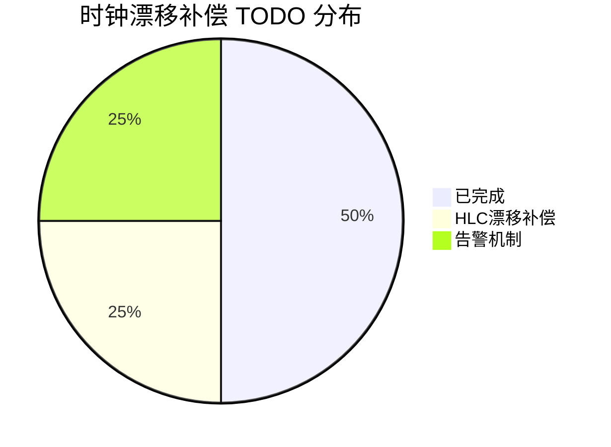
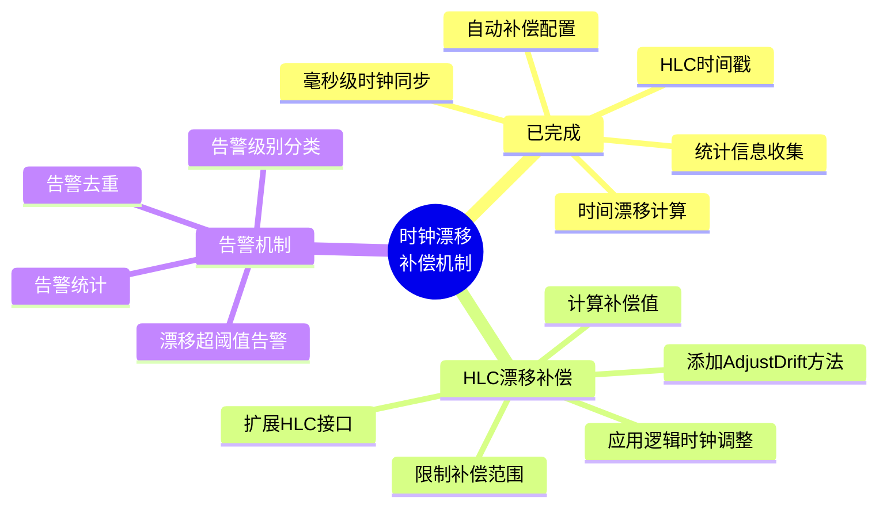
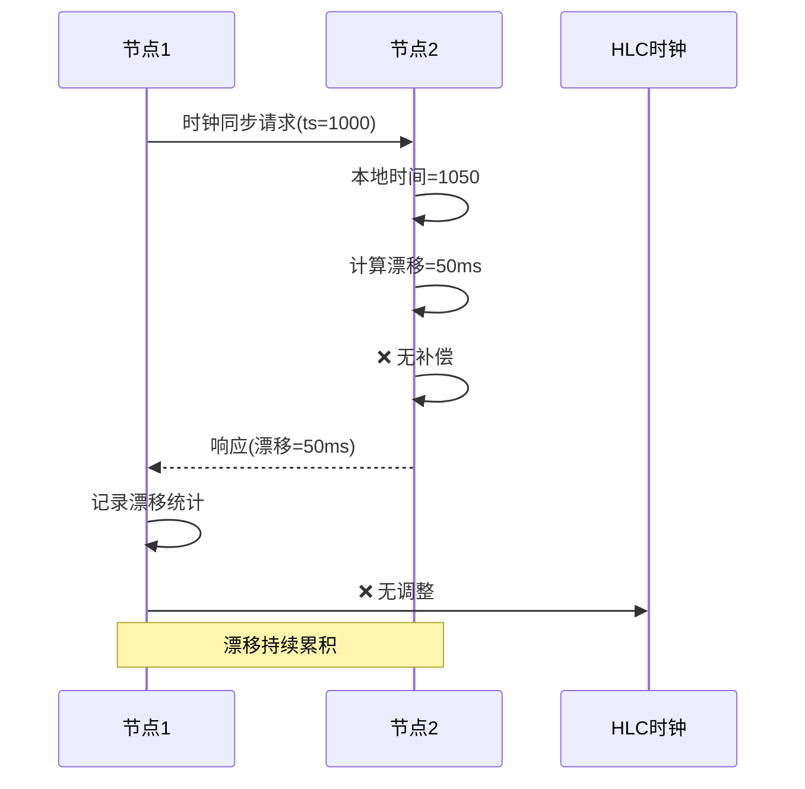
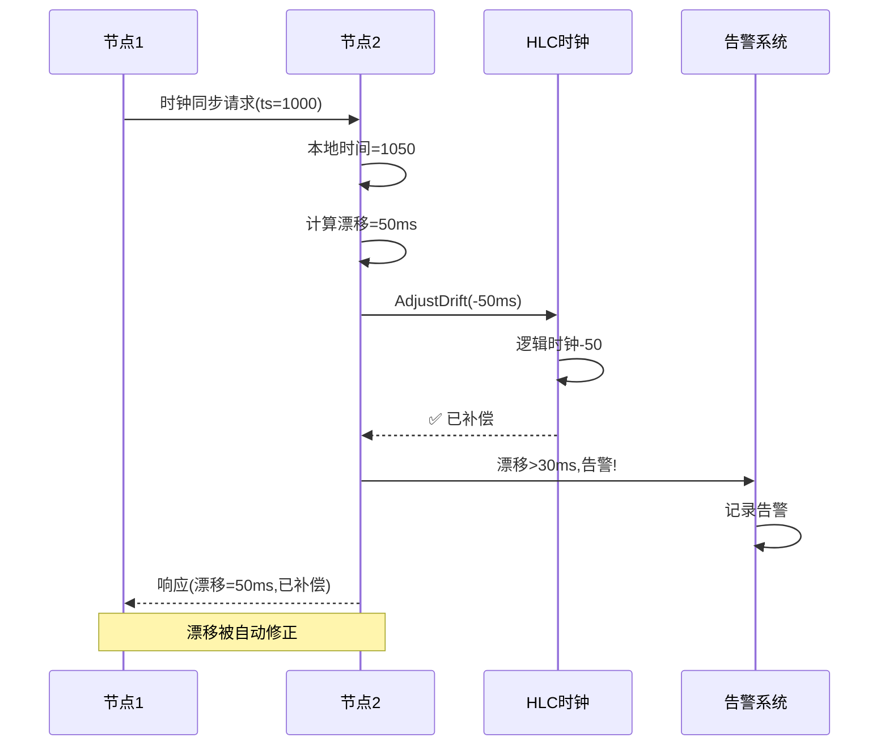
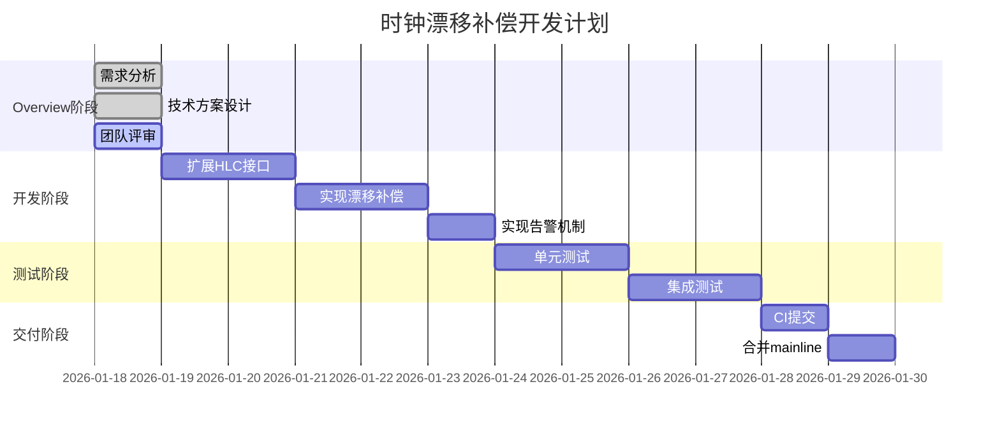
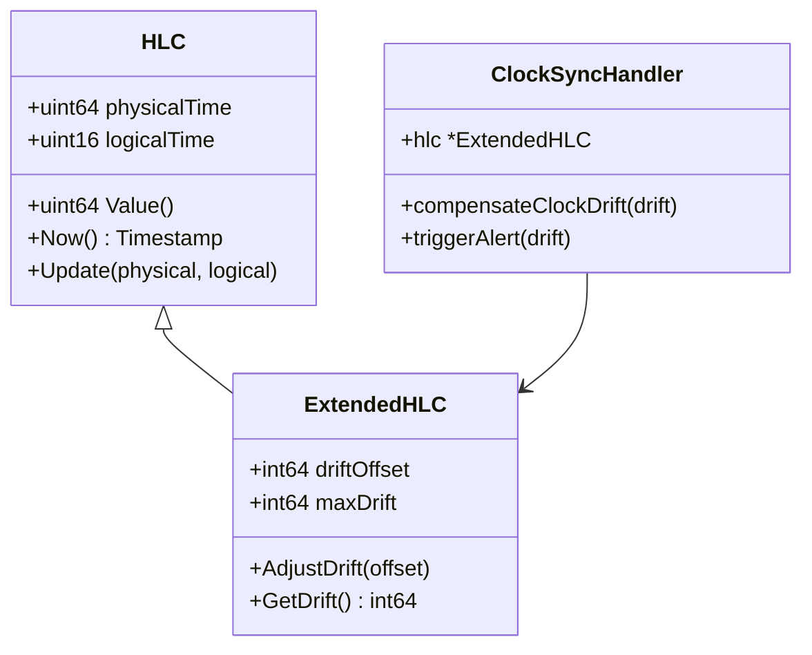
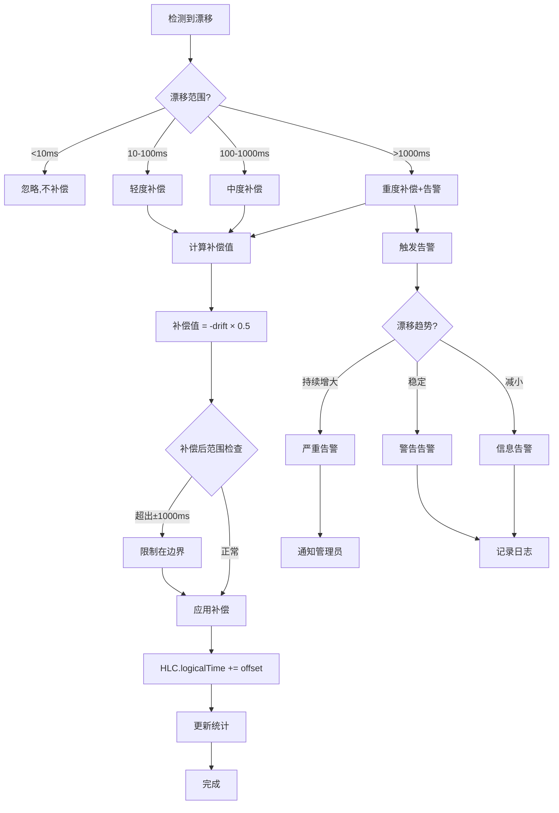

# 时钟漂移补偿机制 - Overview

> **创建日期**: 2026-01-18
> **分支**: `feature/clock-drift-compensation`
> **状态**: 📝 Overview 阶段

---

## 📊 总体概览

### TODO 完成情况



### 核心功能状态



### 当前架构



### 目标架构



### 开发计划



### HLC 时钟结构



### 补偿算法



---

## 🎯 需求背景

### 问题描述

**当前状态**：
- 时钟同步服务计算时间漂移
- `compensateClockDrift()` 为空实现
- **没有实际补偿逻辑**
- 漂移持续累积，可能导致：
  - 时间戳混乱
  - 事务顺序错误
  - 元数据版本冲突

**影响**：
1. **时间不一致**：节点间时钟持续漂移
2. **事务错误**：依赖时间戳的事务可能顺序错误
3. **元数据冲突**：版本向量基于时间戳，可能冲突

### 需求目标

**核心需求**：
1. **自动补偿**：检测到漂移后自动调整 HLC
2. **渐进补偿**：不是一次性调整，而是逐步补偿
3. **边界保护**：限制补偿范围，避免过度调整
4. **告警机制**：漂移过大时触发告警

**次要需求**：
1. 补偿统计信息
2. 告警去重
3. 补偿历史记录

### 上下文关联

- **依赖**: HLC 时钟实现
- **被依赖**: TwoPC、Gossip、TreeCoordinator（所有使用时间戳的服务）
- **相关**: 时钟同步服务

---

## 💡 技术方案

### 1. 扩展 HLC 接口

**当前 HLC 接口**（`internal/metadata/clock/hlc.go`）：
```go
type HLC interface {
    Now() Timestamp
    Update(physical uint64, logical uint64) error
    GetPhysicalTime() uint64
    GetLogicalTime() uint64
    Value() uint64
}
```

**扩展接口**：
```go
// ExtendedHLC 扩展的HLC接口，支持漂移补偿
type ExtendedHLC interface {
    HLC

    // AdjustDrift 调整时钟漂移
    // offset: 补偿偏移量（毫秒），正数表示时钟偏快，负数表示时钟偏慢
    // 返回: 实际应用的补偿值
    AdjustDrift(offset int64) int64

    // GetDrift 获取当前漂移补偿值
    GetDrift() int64

    // ResetDrift 重置漂移补偿
    ResetDrift()

    // GetDriftHistory 获取漂移补偿历史
    GetDriftHistory() []DriftRecord
}

// DriftRecord 漂移记录
type DriftRecord struct {
    Timestamp time.Time
    DetectedDrift int64  // 检测到的漂移（毫秒）
    AppliedOffset int64  // 应用的补偿值（毫秒）
    Reason string
}

// ExtendedHLCImpl 扩展HLC实现
type ExtendedHLCImpl struct {
    // 原有字段
    physicalTime atomic.Uint64
    logicalTime  atomic.Uint64
    nodeId       string
    mu           sync.RWMutex

    // 新增字段
    driftOffset    atomic.Int64  // 当前漂移补偿值（毫秒）
    maxDrift       int64         // 最大补偿范围（毫秒）
    driftHistory   []DriftRecord
    historyLimit   int           // 历史记录限制
    historyMu      sync.RWMutex
}
```

### 2. 漂移补偿算法

**补偿策略**：
```go
// compensateClockDrift 补偿时钟漂移
func (h *ClockSyncHandler) compensateClockDrift(detectedDrift int64) {
    // 1. 检查是否需要补偿
    if detectedDrift < 10 {
        // 漂移小于10ms，忽略
        logging.WithField("drift_ms", detectedDrift).
            Debug("漂移太小，不补偿")
        return
    }

    // 2. 计算补偿值
    // 策略：渐进补偿，每次补偿检测漂移的50%
    compensation := -detectedDrift / 2

    // 3. 限制补偿范围
    maxDrift := int64(1000) // ±1秒
    if compensation > maxDrift {
        compensation = maxDrift
    } else if compensation < -maxDrift {
        compensation = -maxDrift
    }

    // 4. 检查累积漂移
    currentDrift := h.hlc.GetDrift()
    newDrift := currentDrift + compensation

    if newDrift > maxDrift {
        newDrift = maxDrift
        compensation = maxDrift - currentDrift
    } else if newDrift < -maxDrift {
        newDrift = -maxDrift
        compensation = -maxDrift - currentDrift
    }

    // 5. 应用补偿
    applied := h.hlc.AdjustDrift(compensation)

    // 6. 更新统计
    h.stats.CompensationCount.Add(1)
    h.stats.TotalCompensation.Add(applied)

    logging.WithFields(map[string]any{
        "detected_drift_ms": detectedDrift,
        "compensation_ms":   applied,
        "current_drift_ms":  h.hlc.GetDrift(),
    }).Info("应用时钟漂移补偿")
}
```

**HLC 补偿实现**：
```go
// AdjustDrift 调整时钟漂移
func (h *ExtendedHLCImpl) AdjustDrift(offset int64) int64 {
    // 1. 更新漂移补偿值
    oldDrift := h.driftOffset.Load()
    newDrift := oldDrift + offset

    // 2. 边界检查
    if newDrift > h.maxDrift {
        newDrift = h.maxDrift
    } else if newDrift < -h.maxDrift {
        newDrift = -h.maxDrift
    }

    // 3. 应用调整
    h.driftOffset.Store(newDrift)

    // 4. 记录历史
    record := DriftRecord{
        Timestamp:      time.Now(),
        DetectedDrift:  offset,
        AppliedOffset:  newDrift - oldDrift,
        Reason:         "auto_compensation",
    }

    h.historyMu.Lock()
    h.driftHistory = append(h.driftHistory, record)
    if len(h.driftHistory) > h.historyLimit {
        h.driftHistory = h.driftHistory[1:]
    }
    h.historyMu.Unlock()

    return newDrift - oldDrift
}

// Now 获取当前时间戳（带补偿）
func (h *ExtendedHLCImpl) Now() Timestamp {
    physical := h.physicalTime.Load()

    // 应用漂移补偿（转换为物理时间单位）
    drift := h.driftOffset.Load()
    driftPhysical := uint64(drift) * 1000000 // 毫秒转纳秒

    if driftPhysical > physical {
        // 防止下溢
        physical = 0
    } else {
        physical -= driftPhysical
    }

    logical := h.logicalTime.Load()

    return Timestamp{
        PhysicalTime: physical,
        LogicalTime:  uint16(logical),
    }
}
```

### 3. 告警机制

**告警级别**：
```go
type AlertLevel int

const (
    AlertLevelInfo     AlertLevel = iota // 信息：<30ms
    AlertLevelWarning                    // 警告：30-100ms
    AlertLevelSevere                     // 严重：100-500ms
    AlertLevelCritical                   // 危急：>500ms
)

// ClockDriftAlert 时钟漂移告警
type ClockDriftAlert struct {
    Level        AlertLevel
    NodeID       string
    Drift        int64  // 毫秒
    Timestamp    time.Time
    Trend        string // "increasing", "stable", "decreasing"
    Message      string
}

// AlertService 告警服务
type AlertService struct {
    mu            sync.RWMutex
    alerts        []ClockDriftAlert
    alertHistory  map[string][]time.Time // nodeID -> 告警时间列表
    dedupWindow   time.Duration          // 去重时间窗口
    maxHistory    int
}
```

**告警触发**：
```go
// triggerAlert 触发时钟漂移告警
func (h *ClockSyncHandler) triggerAlert(drift int64) {
    // 1. 确定告警级别
    var level AlertLevel
    switch {
    case drift < 30:
        level = AlertLevelInfo
    case drift < 100:
        level = AlertLevelWarning
    case drift < 500:
        level = AlertLevelSevere
    default:
        level = AlertLevelCritical
    }

    // 2. 分析趋势
    trend := h.analyzeDriftTrend()

    // 3. 构造告警
    alert := ClockDriftAlert{
        Level:     level,
        NodeID:    h.localNodeID,
        Drift:     drift,
        Timestamp: time.Now(),
        Trend:     trend,
        Message:   fmt.Sprintf("时钟漂移 %dms，趋势：%s", drift, trend),
    }

    // 4. 去重检查
    if h.alertService.ShouldAlert(alert) {
        h.alertService.SendAlert(alert)
        h.stats.AlertCount.Add(1)
    }
}

// analyzeDriftTrend 分析漂移趋势
func (h *ClockSyncHandler) analyzeDriftTrend() string {
    history := h.hlc.GetDriftHistory()

    if len(history) < 3 {
        return "unknown"
    }

    // 取最近3次记录
    recent := history[len(history)-3:]

    // 计算趋势
    increasing := 0
    decreasing := 0

    for i := 1; i < len(recent); i++ {
        if recent[i].AppliedOffset > recent[i-1].AppliedOffset {
            increasing++
        } else if recent[i].AppliedOffset < recent[i-1].AppliedOffset {
            decreasing++
        }
    }

    if increasing > decreasing {
        return "increasing"
    } else if decreasing > increasing {
        return "decreasing"
    }
    return "stable"
}
```

**告警服务**：
```go
// ShouldAlert 是否应该发送告警（去重）
func (as *AlertService) ShouldAlert(alert ClockDriftAlert) bool {
    as.mu.Lock()
    defer as.mu.Unlock()

    nodeID := alert.NodeID

    // 获取该节点的最近告警时间
    recentAlerts, exists := as.alertHistory[nodeID]
    if !exists {
        recentAlerts = []time.Time{}
        as.alertHistory[nodeID] = recentAlerts
    }

    // 检查去重窗口内是否有告警
    now := time.Now()
    windowStart := now.Add(-as.dedupWindow)

    // 清理过期记录
    validAlerts := []time.Time{}
    for _, t := range recentAlerts {
        if t.After(windowStart) {
            validAlerts = append(validAlerts, t)
        }
    }
    as.alertHistory[nodeID] = validAlerts

    // 检查是否在去重窗口内
    for _, t := range validAlerts {
        if now.Sub(t) < as.dedupWindow {
            // 在去重窗口内，检查级别
            if alert.Level <= AlertLevelWarning {
                // Info 和 Warning 级别去重
                return false
            }
        }
    }

    // 记录本次告警
    as.alertHistory[nodeID] = append(validAlerts, now)

    return true
}

// SendAlert 发送告警
func (as *AlertService) SendAlert(alert ClockDriftAlert) {
    // 1. 记录告警
    as.mu.Lock()
    as.alerts = append(as.alerts, alert)
    if len(as.alerts) > as.maxHistory {
        as.alerts = as.alerts[1:]
    }
    as.mu.Unlock()

    // 2. 根据级别处理
    switch alert.Level {
    case AlertLevelInfo:
        logging.WithFields(map[string]any{
            "node_id": alert.NodeID,
            "drift_ms": alert.Drift,
            "trend":    alert.Trend,
        }).Info("时钟漂移告警")

    case AlertLevelWarning:
        logging.WithFields(map[string]any{
            "node_id": alert.NodeID,
            "drift_ms": alert.Drift,
            "trend":    alert.Trend,
        }).Warn("时钟漂移告警")

    case AlertLevelSevere:
        logging.WithFields(map[string]any{
            "node_id": alert.NodeID,
            "drift_ms": alert.Drift,
            "trend":    alert.Trend,
        }).Error("时钟漂移告警（严重）")

        // TODO: 发送到监控系统

    case AlertLevelCritical:
        logging.WithFields(map[string]any{
            "node_id": alert.NodeID,
            "drift_ms": alert.Drift,
            "trend":    alert.Trend,
        }).Error("时钟漂移告警（危急）")

        // TODO: 发送管理员通知
    }
}
```

### 4. 统计信息

```go
type ClockSyncStats struct {
    // ... 现有字段 ...

    // 补偿次数
    CompensationCount atomic.Int64

    // 总补偿量（毫秒）
    TotalCompensation atomic.Int64

    // 告警次数
    AlertCount atomic.Int64

    // 最后补偿时间
    LastCompensationTime atomic.Value // time.Time

    // 当前漂移补偿值
    CurrentDrift atomic.Int64
}
```

---

## ⚠️ 风险预判

### 风险 1: 补偿震荡

**风险等级**: 🟡 中等

**场景**：
- 节点 A 时钟偏快 +50ms
- 补偿 -25ms
- 下一轮检测偏快 +50ms
- 再补偿 -25ms
- 持续震荡

**影响**：
- 时间戳不稳定
- 逻辑时钟频繁调整

**缓解措施**：
1. **渐进补偿**：每次只补偿检测漂移的 50%
2. **补偿间隔**：限制补偿频率（最少 5 秒一次）
3. **稳定性检查**：连续 3 次同方向漂移才补偿

### 风险 2: 过度补偿

**风险等级**: 🟡 中等

**场景**：
- 检测到漂移 +200ms
- 补偿 -100ms
- 实际只需要 -50ms

**影响**：
- 时间戳反向偏移
- 事务顺序混乱

**缓解措施**：
1. **边界限制**：严格限制补偿范围 ±1000ms
2. **小步调整**：每次最多补偿 100ms
3. **反馈验证**：补偿后验证效果，动态调整

### 风险 3: 时间戳回退

**风险等级**: 🔴 高

**场景**：
- 物理时间 1000ms
- 补偿 -100ms
- 调整后 900ms
- 违反 HLC 单调性

**影响**：
- HLC 时间戳不单调
- 版本向量失效
- 事务冲突

**缓解措施**：
1. **仅调整逻辑时间**：不修改物理时间
2. **逻辑时钟补偿**：增加逻辑计数器而非减少物理时间
3. **单调性保证**：确保调整后时间戳 >= 调整前

**修正方案**：
```go
// AdjustDrift 正确实现：调整逻辑时间而非物理时间
func (h *ExtendedHLCImpl) AdjustDrift(offset int64) int64 {
    // offset > 0: 对方时钟快，我方需要"加快"逻辑时间
    // offset < 0: 对方时钟慢，我方需要"减慢"逻辑时间

    oldDrift := h.driftOffset.Load()
    newDrift := oldDrift + offset

    // 边界检查
    if newDrift > h.maxDrift {
        newDrift = h.maxDrift
    } else if newDrift < -h.maxDrift {
        newDrift = -h.maxDrift
    }

    h.driftOffset.Store(newDrift)

    return newDrift - oldDrift
}

// Now 获取当前时间（逻辑时钟补偿）
func (h *ExtendedHLCImpl) Now() Timestamp {
    physical := h.physicalTime.Load()
    logical := h.logicalTime.Load()

    // 应用漂移补偿到逻辑时间
    drift := h.driftOffset.Load()

    // 将毫秒转换为逻辑计数（简化版）
    logicalAdjustment := uint64(drift) / 1000 // 1ms ≈ 1 logical tick

    if logicalAdjustment > 0 {
        // 对方时钟快，增加逻辑时间
        logical += logicalAdjustment
    }

    return Timestamp{
        PhysicalTime: physical,
        LogicalTime:  uint16(logical),
    }
}
```

### 风险 4: 告警风暴

**风险等级**: 🟢 低

**场景**：
- 多个节点同时漂移
- 大量告警同时触发

**影响**：
- 日志爆炸
- 管理员疲劳

**缓解措施**：
1. **去重窗口**：同一节点 5 分钟内只发送一次同级别告警
2. **告警聚合**：将多个节点的告警聚合为一条
3. **级别过滤**：默认只记录 Warning 及以上

### 风险 5: 性能影响

**风险等级**: 🟢 低

**场景**：
- 每次 Now() 调用都计算补偿
- 频繁的时间戳获取

**影响**：
- CPU 使用率略微上升
- 时间戳获取延迟增加

**缓解措施**：
1. **缓存漂移值**：使用 atomic.Int64 快速读取
2. **异步补偿**：补偿操作在后台线程执行
3. **批量调整**：积累多次漂移后一次性补偿

---

## ✅ 成功标准

### 功能完整性

- [ ] HLC 支持漂移补偿
- [ ] 自动检测并补偿漂移
- [ ] 补偿范围限制在 ±1000ms
- [ ] 漂移过大时触发告警
- [ ] 告警去重机制
- [ ] 补偿历史记录

### 性能指标

- [ ] 补偿延迟 < 1ms
- [ ] Now() 调用开销 < 100ns
- [ ] 告警延迟 < 100ms

### 质量标准

- [ ] 单元测试覆盖率 > 90%
- [ ] 集成测试通过
- [ ] 无 golangci-lint 错误
- [ ] HLC 单调性保证

---

## 🧪 测试计划

### 单元测试

| 用例ID | 测试场景 | 验证目标 |
|-------|---------|---------|
| CD-001 | 基本漂移补偿 | 验证补偿逻辑 |
| CD-002 | 边界限制测试 | 验证±1000ms限制 |
| CD-003 | 渐进补偿测试 | 验证50%补偿策略 |
| CD-004 | 补偿震荡抑制 | 验证补偿间隔 |
| CD-005 | HLC单调性保证 | 验证时间戳不回退 |
| CD-006 | 告警级别分类 | 验证告警触发 |
| CD-007 | 告警去重 | 验证去重窗口 |
| CD-008 | 趋势分析 | 验证趋势计算 |
| CD-009 | 补偿历史记录 | 验证历史管理 |
| CD-010 | 统计信息更新 | 验证统计正确性 |

### 集成测试

| 用例ID | 测试场景 | 验证目标 |
|-------|---------|---------|
| CD-101 | 双节点时钟同步 | 验证端到端补偿 |
| CD-102 | 10节点集群漂移 | 验证大规模补偿 |
| CD-103 | 持续漂移场景 | 验证持续补偿 |
| CD-104 | 网络延迟影响 | 验证延迟处理 |
| CD-105 | 告警端到端 | 验证告警流程 |

### 手动测试

1. **基本补偿测试**
   ```bash
   # 启动2个节点
   ./bin/nexkv --config node1.yaml &
   ./bin/nexkv --config node2.yaml &

   # 手动调整 node2 的系统时间（+100ms）
   sudo date -s "+100 milliseconds"

   # 等待时钟同步
   sleep 15

   # 检查补偿统计
   curl http://localhost:9212/api/v1/clock/stats

   # 预期：compensation_count > 0, total_compensation ≈ -50ms
   ```

2. **告警测试**
   ```bash
   # 启动节点
   ./bin/nexkv --config node1.yaml &

   # 手动调整时间（+500ms，触发严重告警）
   sudo date -s "+500 milliseconds"

   # 等待时钟同步
   sleep 15

   # 检查日志
   tail -f /var/log/nexkv.log | grep "时钟漂移告警"

   # 预期：看到"严重"级别告警
   ```

3. **HLC 单调性验证**
   ```bash
   # 启动节点
   ./bin/nexkv --config node1.yaml &

   # 获取1000个时间戳
   for i in {1..1000}; do
     curl -s http://localhost:9211/api/v1/clock/now
   done | jq -s '. | sort | unique | length'

   # 预期：1000（所有时间戳唯一且单调递增）
   ```

---

## 📋 开发检查清单

### Phase 1: 准备阶段
- [ ] 创建分支 `feature/clock-drift-compensation`
- [ ] 阅读 HLC 实现
- [ ] 理解时钟同步服务

### Phase 2: 扩展 HLC 接口
- [ ] 定义 `ExtendedHLC` 接口
- [ ] 实现 `ExtendedHLCImpl`
- [ ] 添加 `driftOffset` 字段
- [ ] 实现 `AdjustDrift()` 方法
- [ ] 修改 `Now()` 方法应用补偿
- [ ] 实现 `GetDrift()` 方法
- [ ] 实现 `ResetDrift()` 方法
- [ ] 实现历史记录管理
- [ ] 编写单元测试

### Phase 3: 补偿逻辑
- [ ] 实现 `compensateClockDrift()` 方法
- [ ] 实现渐进补偿策略（50%）
- [ ] 添加边界限制（±1000ms）
- [ ] 添加补偿间隔限制
- [ ] 更新统计信息
- [ ] 编写单元测试

### Phase 4: 告警机制
- [ ] 定义告警级别和结构
- [ ] 实现 `AlertService`
- [ ] 实现 `triggerAlert()` 方法
- [ ] 实现告警去重
- [ ] 实现趋势分析
- [ ] 添加告警统计
- [ ] 编写单元测试

### Phase 5: 集成测试
- [ ] 编写双节点同步测试
- [ ] 编写多节点漂移测试
- [ ] 编写持续漂移测试
- [ ] 编写告警端到端测试
- [ ] 编写 HLC 单调性测试

### Phase 6: 文档与交付
- [ ] 更新 CLAUDE.md
- [ ] 编写实施总结报告
- [ ] 提交 PR 到 GitHub
- [ ] 等待 CI 通过
- [ ] 合并到 mainline

---

## 📚 参考文档

- `01_核心架构概念.md` - 三层架构设计
- `../../06_project_management/reports/phase6-virtual-node-isolation.md` - Phase 6 实施报告（时钟同步）
- `CLAUDE.md` - 项目开发指南

---

**文档版本**: v1.0
**作者**: NexKV 开发团队
**最后更新**: 2026-01-18
