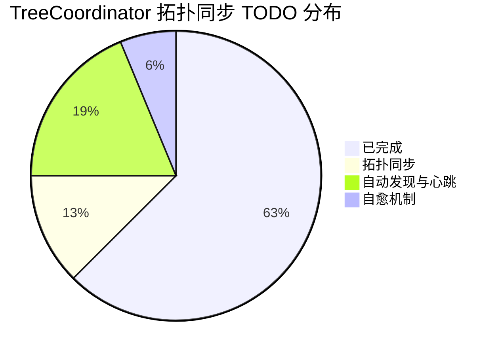
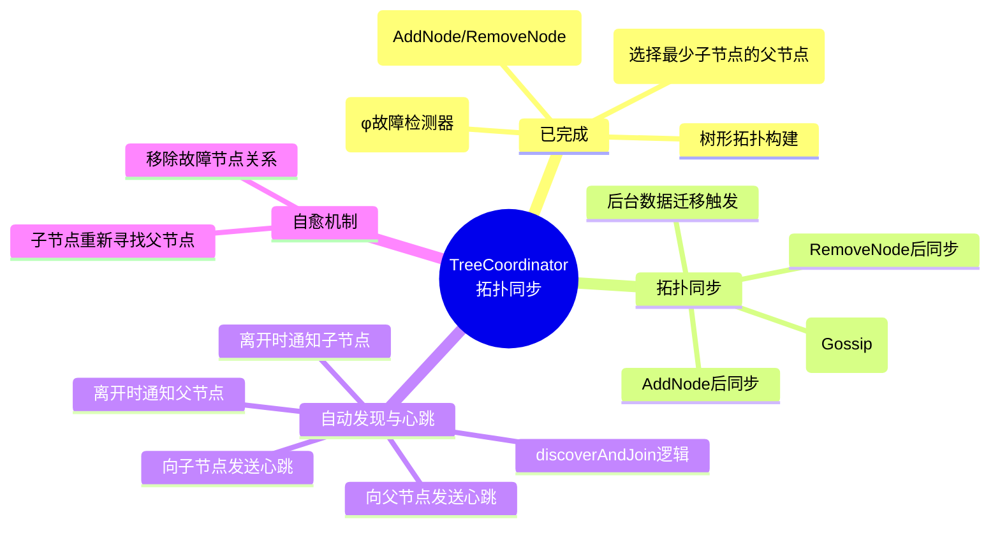
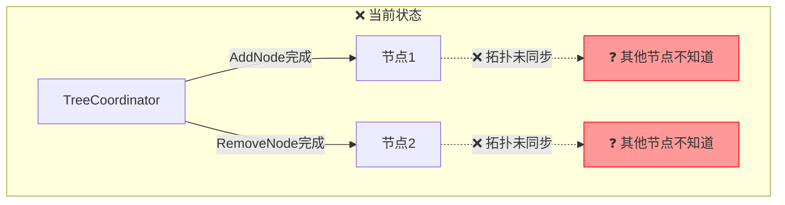
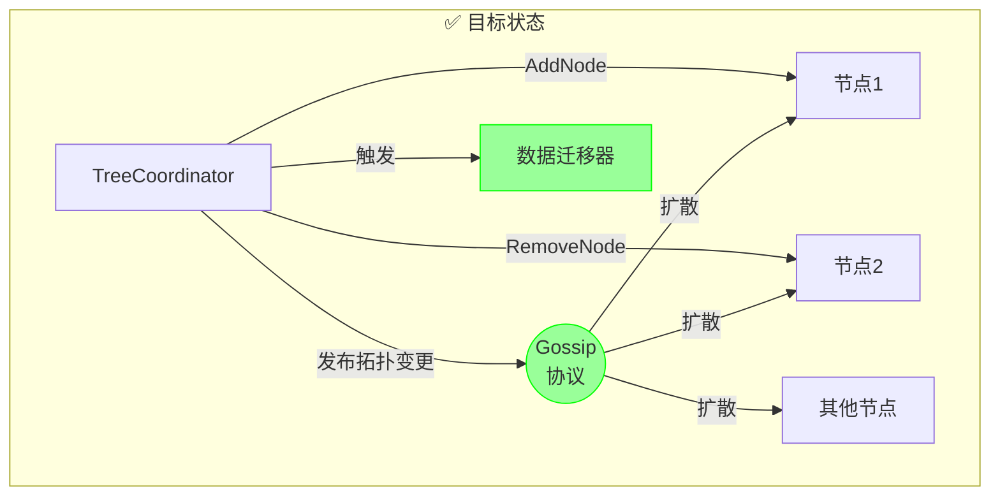
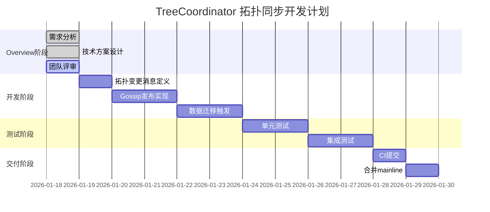
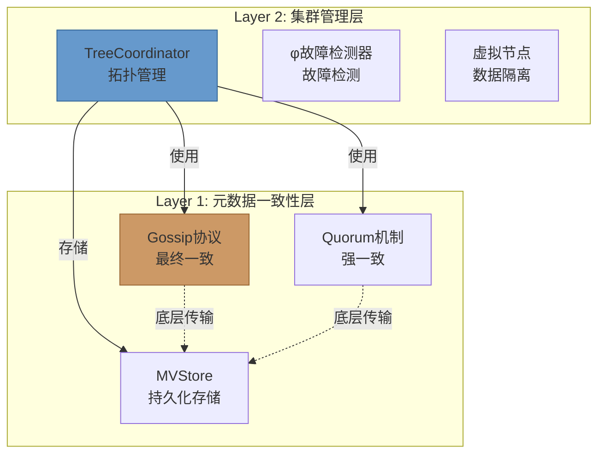
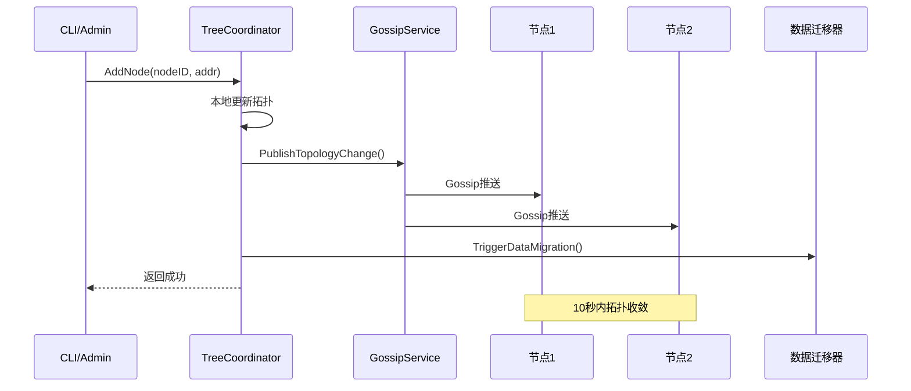
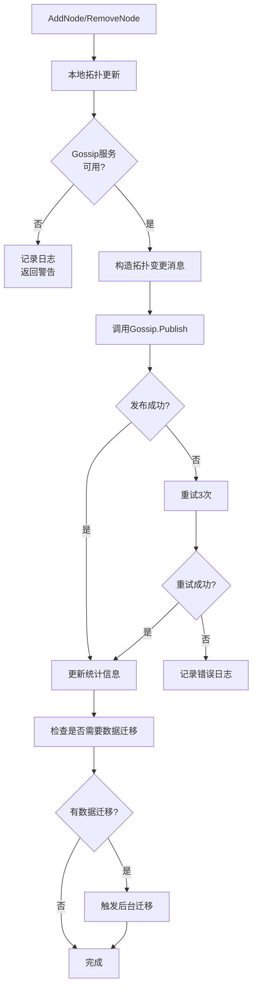
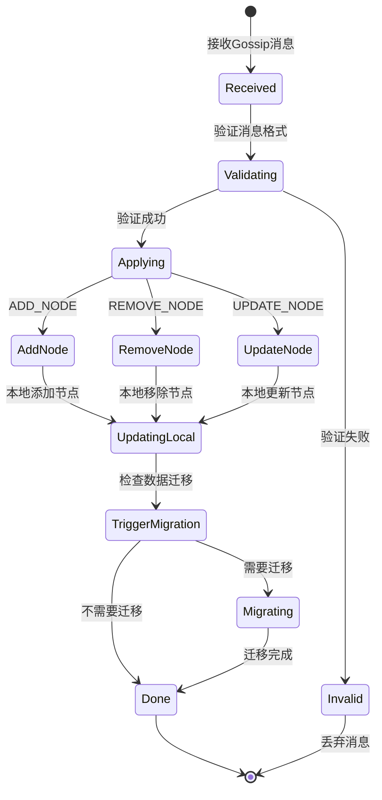
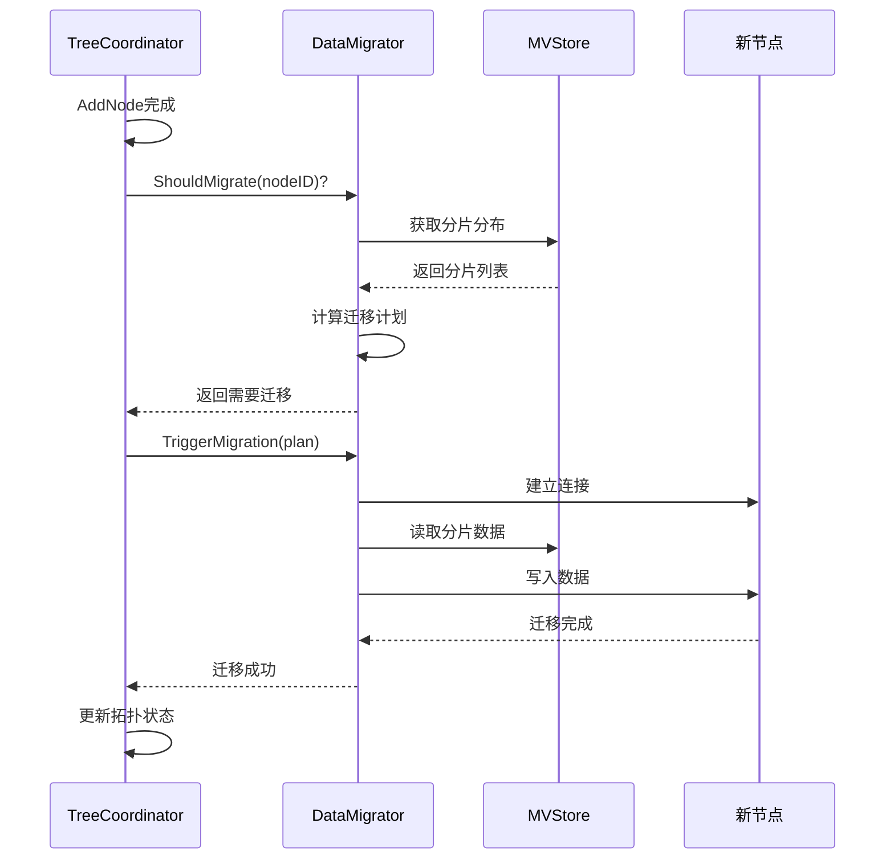

# TreeCoordinator 拓扑同步机制 - Overview

> **创建日期**: 2026-01-18
> **分支**: `feature/tree-coordinator-topology-sync`
> **状态**: 📝 Overview 阶段

---

## 📊 总体概览

### TODO 完成情况



### 核心功能状态



### 当前架构



### 目标架构



### 开发计划



### 分层架构



### 核心数据流



---

## 🎯 需求背景

### 问题描述

**当前状态**：
- `AddNode()` 完成后，仅本地拓扑更新
- `RemoveNode()` 完成后，仅本地拓扑更新
- 集群其他节点**不知道**拓扑变更
- 导致元数据不一致，可能引发数据路由错误

**影响**：
1. 新节点加入后，其他节点不知道如何路由到该节点
2. 节点移除后，其他节点仍可能向其发送请求
3. 数据迁移未触发，导致数据丢失风险

### 需求目标

**核心需求**：
1. 拓扑变更后，通过 Gossip 协议扩散到整个集群
2. 确保最终一致性（**PriorityNormal 级别，10秒内收敛**）
3. 触发后台数据迁移（如有需要）

> **📋 参数说明**：拓扑同步使用 **PriorityNormal** 级别的 Gossip（10秒周期，< 10秒收敛）。
> 详见 `02_一致性级别定义.md` 中的 **Gossip 协议分级配置** 章节。

**次要需求**：
1. 提供拓扑同步状态查询接口
2. 支持手动触发拓扑同步
3. 记录拓扑变更审计日志

### 上下文关联

- **依赖**: Gossip 协议实现（`gossip.go`）
- **被依赖**: TwoPC 服务（需要最新拓扑路由请求）
- **相关**: Phase 6 虚拟节点隔离、动态扩缩容

---

## 💡 技术方案

### 1. 拓扑变更消息定义

**消息结构**：
```go
// TopologyChangeMessage 拓扑变更消息
type TopologyChangeMessage struct {
    // 变更类型：ADD_NODE, REMOVE_NODE, UPDATE_NODE
    ChangeType TopologyChangeType

    // 变更时间戳（HLC）
    Timestamp uint64

    // 变更节点信息
    NodeID   string
    NodeAddr string

    // 父节点信息（AddNode时使用）
    ParentNodeID string

    // 变更原因
    Reason string
}

type TopologyChangeType int

const (
    AddNode    TopologyChangeType = iota
    RemoveNode
    UpdateNode
)
```

**设计要点**：
- 使用 HLC 时间戳确保全局有序
- 包含完整的节点上下文信息
- 支持多种变更类型（预留扩展）

### 2. Gossip 发布机制

**流程图**：


**关键接口**：
```go
// PublishTopologyChange 发布拓扑变更
func (tc *TreeCoordinator) PublishTopologyChange(
    changeType TopologyChangeType,
    nodeID string,
    nodeAddr string,
    parentNodeID string,
) error {
    // 1. 构造消息
    msg := &TopologyChangeMessage{
        ChangeType:   changeType,
        Timestamp:    tc.hlc.Now().Value(),
        NodeID:       nodeID,
        NodeAddr:     nodeAddr,
        ParentNodeID: parentNodeID,
        Reason:       "manual_operation",
    }

    // 2. 调用 Gossip 发布
    if tc.gossipService == nil {
        return fmt.Errorf("gossip service not available")
    }

    if err := tc.gossipService.Publish(msg); err != nil {
        tc.stats.PublishFailed.Add(1)
        return fmt.Errorf("publish topology change failed: %w", err)
    }

    // 3. 更新统计
    tc.stats.PublishedChanges.Add(1)

    logging.WithFields(map[string]any{
        "change_type": changeType,
        "node_id":     nodeID,
        "timestamp":   msg.Timestamp,
    }).Info("发布拓扑变更")

    return nil
}
```

### 3. 拓扑变更处理

**状态机**：


**处理逻辑**：
```go
// HandleTopologyChange 处理拓扑变更消息
func (tc *TreeCoordinator) HandleTopologyChange(
    msg *TopologyChangeMessage,
) error {
    // 1. 验证消息
    if err := tc.validateTopologyChange(msg); err != nil {
        return fmt.Errorf("invalid topology change: %w", err)
    }

    // 2. 检查时间戳（防止旧消息）
    if msg.Timestamp < tc.getLastTopologyTimestamp() {
        logging.WithField("timestamp", msg.Timestamp).
            Warn("忽略旧的拓扑变更消息")
        return nil
    }

    // 3. 应用变更
    switch msg.ChangeType {
    case AddNode:
        if err := tc.applyAddNode(msg); err != nil {
            return err
        }
    case RemoveNode:
        if err := tc.applyRemoveNode(msg); err != nil {
            return err
        }
    case UpdateNode:
        if err := tc.applyUpdateNode(msg); err != nil {
            return err
        }
    }

    // 4. 更新时间戳
    tc.setLastTopologyTimestamp(msg.Timestamp)

    tc.stats.ReceivedChanges.Add(1)

    return nil
}
```

### 4. 数据迁移触发

**触发条件**：
1. AddNode: 新节点加入，可能需要重新平衡数据
2. RemoveNode: 节点移除，必须迁移其数据

**流程**：


**接口设计**：
```go
// DataMigrator 数据迁移器接口
type DataMigrator interface {
    // ShouldMigrate 检查是否需要迁移
    ShouldMigrate(nodeID string) (bool, error)

    // TriggerMigration 触发数据迁移
    TriggerMigration(plan *MigrationPlan) error

    // GetMigrationStatus 获取迁移状态
    GetMigrationStatus(nodeID string) (*MigrationStatus, error)
}

// MigrationPlan 迁移计划
type MigrationPlan struct {
    // 源节点
    SourceNodeID string

    // 目标节点
    TargetNodeID string

    // 需要迁移的分片列表
    Shards []string

    // 预计数据量
    EstimatedSize int64
}
```

### 5. 统计信息

**指标**：
```go
type TopologySyncStats struct {
    // 发布的变更数
    PublishedChanges atomic.Int64

    // 发布失败数
    PublishFailed atomic.Int64

    // 接收的变更数
    ReceivedChanges atomic.Int64

    // 处理失败数
    ProcessFailed atomic.Int64

    // 最后发布时间
    LastPublishTime atomic.Value // time.Time

    // 最后接收时间
    LastReceiveTime atomic.Value // time.Time
}
```

---

## ⚠️ 风险预判

### 风险 1: Gossip 消息丢失

**风险等级**: 🟡 中等

**场景**：
- 网络分区导致部分节点未收到消息
- Gossip 协议的随机选点遗漏某些节点

**影响**：
- 元数据不一致
- 数据路由错误

**缓解措施**：
1. Gossip 协议的周期性同步保证最终一致性
2. 增加同步频率（当前10秒，可调整为5秒）
3. 提供 `SyncTopology()` 手动同步接口

### 风险 2: 时间戳冲突

**风险等级**: 🟡 中等

**场景**：
- 多个节点同时发起拓扑变更
- HLC 时间戳相同

**影响**：
- 变更顺序混乱
- 最终状态不一致

**缓解措施**：
1. HLC 的逻辑计数器保证同一物理时间内的唯一性
2. 使用节点 ID 作为决胜条件
3. 冲突检测和自动解决机制

### 风险 3: 数据迁移失败

**风险等级**: 🔴 高

**场景**：
- 数据迁移过程中网络中断
- 目标节点存储空间不足

**影响**：
- 数据丢失
- 服务不可用

**缓解措施**：
1. **双写机制**: 迁移期间同时写入源节点和目标节点
2. **版本向量**: 避免数据覆盖
3. **断点续传**: 支持迁移进度保存和恢复
4. **回滚机制**: 迁移失败时自动回滚

### 风险 4: 拓扑循环依赖

**风险等级**: 🟡 中等

**场景**：
- 节点 A 的父节点是 B，节点 B 的父节点是 A

**影响**：
- 心跳检测失败
- 拓扑不一致

**缓解措施**：
1. AddNode 时检查父节点是否存在
2. 构建拓扑时检测循环引用
3. 使用深度优先搜索验证拓扑结构

### 风险 5: 性能影响

**风险等级**: 🟢 低

**场景**：
- 频繁的拓扑变更
- 大量的 Gossip 消息

**影响**：
- 网络带宽占用增加
- CPU 使用率上升

**缓解措施**：
1. 消息批量发送（多个变更合并为一个消息）
2. 消息压缩（使用 gzip）
3. 限流机制（限制每秒发布的消息数）

---

## ✅ 成功标准

### 功能完整性

- [ ] AddNode 后拓扑通过 Gossip 扩散
- [ ] RemoveNode 后拓扑通过 Gossip 扩散
- [ ] 数据迁移在需要时自动触发
- [ ] 拓扑同步状态可查询

### 性能指标

- [ ] 拓扑变更在 10 秒内扩散到整个集群（10节点）
- [ ] Gossip 消息大小 < 1KB
- [ ] 发布失败率 < 1%

### 质量标准

- [ ] 单元测试覆盖率 > 80%
- [ ] 集成测试通过
- [ ] 无 golangci-lint 错误

---

## 🧪 测试计划

### 单元测试

| 用例ID | 测试场景 | 验证目标 |
|-------|---------|---------|
| TC-TS-001 | 发布 AddNode 拓扑变更 | 验证消息构造和发布 |
| TC-TS-002 | 发布 RemoveNode 拓扑变更 | 验证消息构造和发布 |
| TC-TS-003 | 处理接收到的拓扑变更 | 验证本地更新 |
| TC-TS-004 | 重复消息处理（时间戳检查） | 验证幂等性 |
| TC-TS-005 | 拓扑同步统计信息 | 验证统计正确性 |

### 集成测试

| 用例ID | 测试场景 | 验证目标 |
|-------|---------|---------|
| TC-TS-101 | 3节点集群拓扑同步 | 验证Gossip扩散 |
| TC-TS-102 | 10节点集群拓扑同步 | 验证大规模扩散 |
| TC-TS-103 | AddNode 后数据迁移 | 验证迁移触发 |
| TC-TS-104 | RemoveNode 后数据迁移 | 验证迁移触发 |
| TC-TS-105 | 网络分区场景 | 验证分区恢复后同步 |

### 手动测试

1. **基本拓扑同步**
   ```bash
   # 启动3个节点
   ./bin/nexkv --config node1.yaml &
   ./bin/nexkv --config node2.yaml &
   ./bin/nexkv --config node3.yaml &

   # 在 node1 上添加新节点
   curl -X POST http://localhost:9211/api/v1/nodes \
     -d '{"node_id": "node4", "addr": "127.0.0.1:9214"}'

   # 检查 node2 和 node3 的拓扑
   curl http://localhost:9212/api/v1/topology
   curl http://localhost:9213/api/v1/topology

   # 预期：10秒内 node4 出现在拓扑中
   ```

2. **数据迁移验证**
   ```bash
   # 添加分片到 node1
   curl -X POST http://localhost:9211/api/v1/shards \
     -d '{"shard_id": "shard1", "replicas": ["node1"]}'

   # 添加新节点 node2
   curl -X POST http://localhost:9211/api/v1/nodes \
     -d '{"node_id": "node2", "addr": "127.0.0.1:9212"}'

   # 触发数据迁移
   curl -X POST http://localhost:9211/api/v1/shards/shard1/rebalance

   # 检查 node2 上是否有数据
   curl http://localhost:9212/api/v1/shards

   # 预期：shard1 的副本出现在 node2
   ```

---

## 📋 开发检查清单

### Phase 1: 准备阶段
- [ ] 创建分支 `feature/tree-coordinator-topology-sync`
- [ ] 阅读 Phase 6 实施报告（virtual node isolation）
- [ ] 理解 Gossip 协议实现

### Phase 2: 消息定义
- [ ] 定义 `TopologyChangeMessage` 结构
- [ ] 定义 `TopologyChangeType` 枚举
- [ ] 添加消息序列化/反序列化方法
- [ ] 编写单元测试

### Phase 3: 发布实现
- [ ] 实现 `PublishTopologyChange()` 方法
- [ ] 集成到 `AddNode()` 方法
- [ ] 集成到 `RemoveNode()` 方法
- [ ] 添加重试逻辑
- [ ] 添加统计信息
- [ ] 编写单元测试

### Phase 4: 处理实现
- [ ] 实现 `HandleTopologyChange()` 方法
- [ ] 实现 `validateTopologyChange()` 方法
- [ ] 实现 `applyAddNode()` 方法
- [ ] 实现 `applyRemoveNode()` 方法
- [ ] 添加时间戳检查
- [ ] 编写单元测试

### Phase 5: 数据迁移
- [ ] 定义 `DataMigrator` 接口
- [ ] 定义 `MigrationPlan` 结构
- [ ] 实现 `ShouldMigrate()` 检查逻辑
- [ ] 实现 `TriggerMigration()` 触发逻辑
- [ ] 添加迁移进度跟踪
- [ ] 编写单元测试

### Phase 6: 集成测试
- [ ] 编写 3 节点集成测试
- [ ] 编写 10 节点集成测试
- [ ] 编写网络分区测试
- [ ] 编写数据迁移测试

### Phase 7: 文档与交付
- [ ] 更新 CLAUDE.md
- [ ] 编写实施总结报告
- [ ] 提交 PR 到 GitHub
- [ ] 等待 CI 通过
- [ ] 合并到 mainline

---

## 📚 参考文档

- `01_核心架构概念.md` - 三层架构设计
- `二阶段提交与Gossip状态同步.md` - TwoPC Gossip 状态同步
- `../../06_project_management/reports/phase6-virtual-node-isolation.md` - Phase 6 实施报告
- `CLAUDE.md` - 项目开发指南

---

**文档版本**: v1.0
**作者**: NexKV 开发团队
**最后更新**: 2026-01-18
