# TreeCoordinator 自动发现与心跳机制 - Overview

> **创建日期**: 2026-01-18
> **分支**: `feature/tree-coordinator-auto-discovery-heartbeat`
> **状态**: 📝 Overview 阶段

---

## 📊 总体概览

### TODO 完成情况

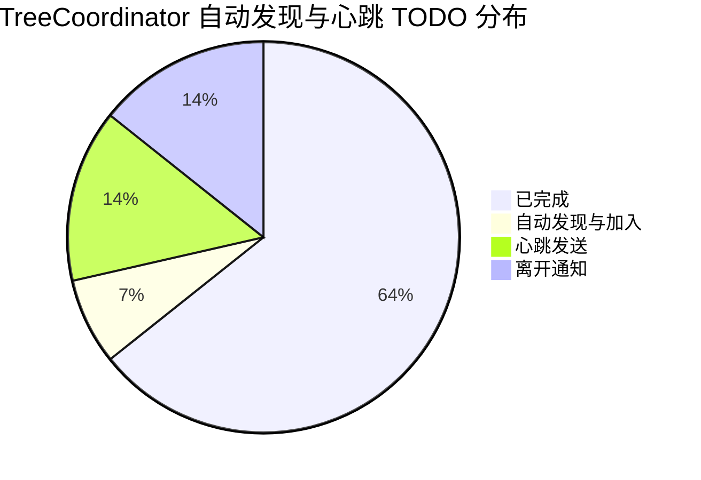

### 核心功能状态

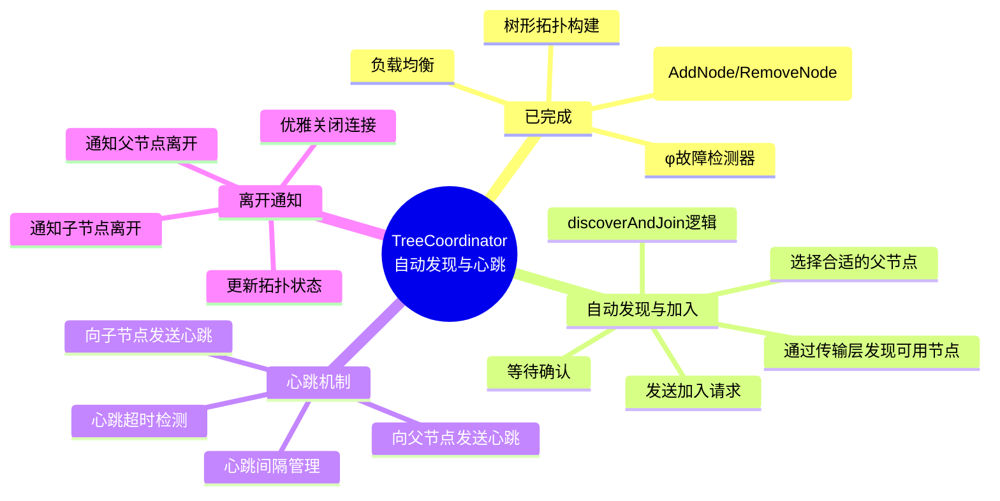

### 当前架构

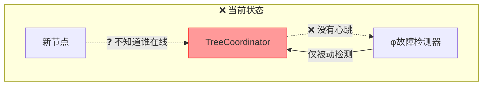

### 目标架构

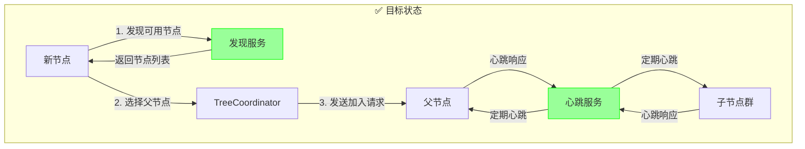

### 开发计划

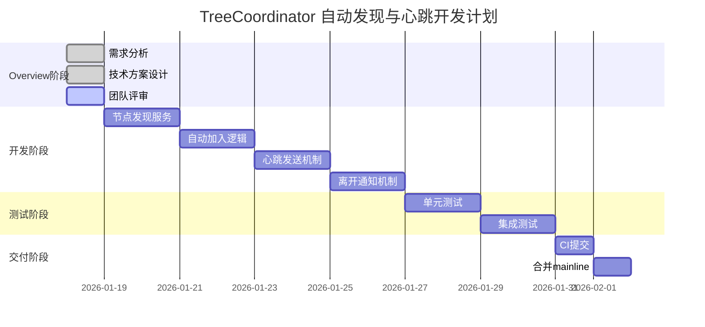

### 系统架构

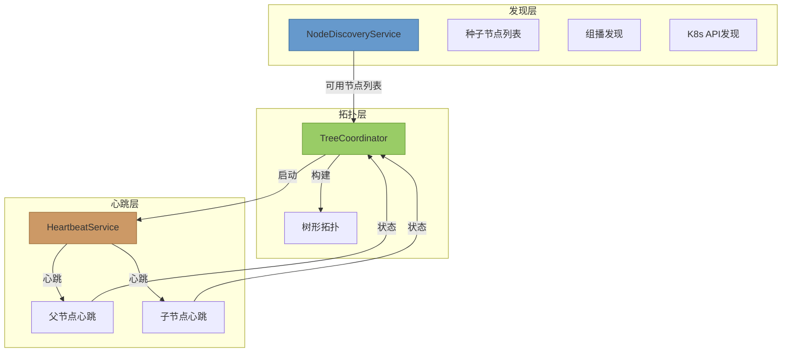

### 节点生命周期

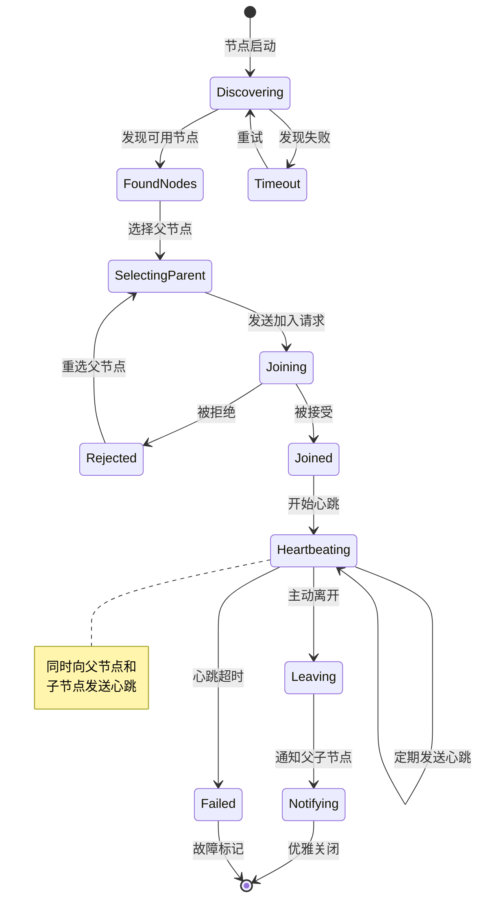

---

## 🎯 需求背景

### 问题描述

**当前状态**：
- `discoverAndJoin()` 为空实现
- 没有主动心跳机制
- 离开时不通知父子节点
- 节点启动需要手动配置拓扑

**影响**：
1. **部署复杂**：需要手动配置每个节点的父子关系
2. **故障检测慢**：仅依赖 φ 故障检测器（被动）
3. **状态不一致**：节点离开后，其他节点不知道
4. **无法自愈**：子节点无法自动重选父节点

### 需求目标

**核心需求**：
1. **自动发现**：新节点启动时自动发现可用节点
2. **自动加入**：自动选择合适的父节点并加入
3. **主动心跳**：定期向父节点和子节点发送心跳
4. **优雅离开**：离开时通知父子节点

**次要需求**：
1. 支持多种发现机制（种子节点、组播、K8s）
2. 心跳失败重试机制
3. 心跳统计信息

### 上下文关联

- **依赖**: Transport 层（节点通信）
- **被依赖**: TwoPC、Gossip（依赖拓扑稳定性）
- **相关**: φ 故障检测器（互补机制）

---

## 💡 技术方案

### 1. 节点发现服务

**发现策略**：
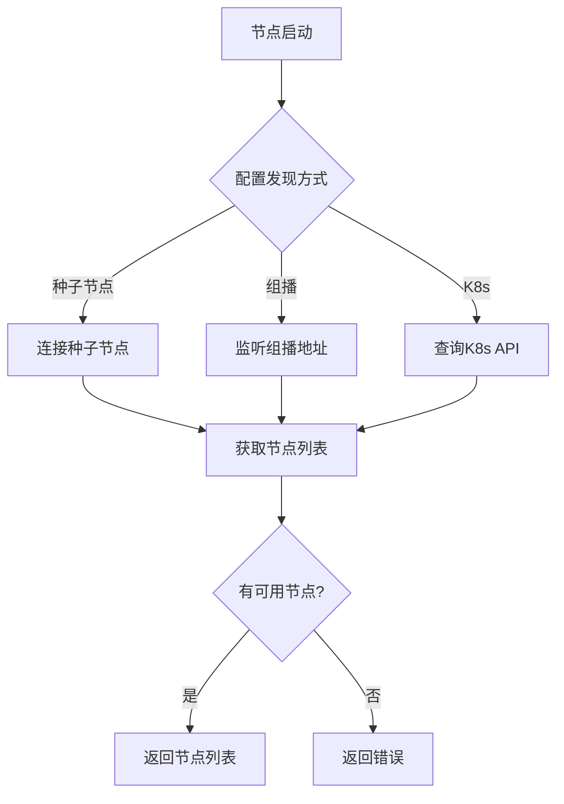

**接口设计**：
```go
// NodeDiscoveryService 节点发现服务
type NodeDiscoveryService interface {
    // Discover 发现可用节点
    Discover(ctx context.Context) ([]string, error)

    // Start 启动发现服务
    Start() error

    // Stop 停止发现服务
    Stop() error
}

// SeedNodeDiscovery 种子节点发现
type SeedNodeDiscovery struct {
    seedNodes []string
    transport transport.Transport
}

func (d *SeedNodeDiscovery) Discover(ctx context.Context) ([]string, error) {
    var availableNodes []string

    for _, addr := range d.seedNodes {
        // 尝试连接
        if err := d.transport.Ping(ctx, addr); err == nil {
            availableNodes = append(availableNodes, addr)
        }
    }

    return availableNodes, nil
}

// MulticastDiscovery 组播发现
type MulticastDiscovery struct {
    multicastAddr string
    port          int
}

// K8sDiscovery Kubernetes发现
type K8sDiscovery struct {
    namespace     string
    serviceName   string
    clientset     *kubernetes.Clientset
}
```

**配置**：
```yaml
cluster:
  discovery:
    mode: seed  # seed | multicast | k8s
    seed_nodes:
      - "127.0.0.1:9211"
      - "127.0.0.1:9212"
    multicast:
      addr: "239.255.0.1"
      port: 9211
    k8s:
      namespace: "default"
      service_name: "nexkv"
```

### 2. 自动加入逻辑

**流程图**：
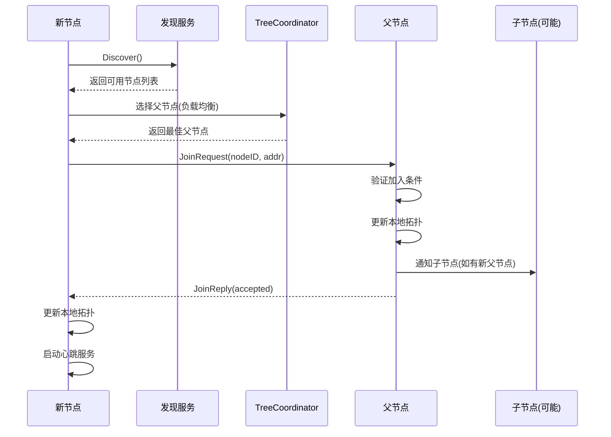

**关键代码**：
```go
// discoverAndJoin 发现并加入树形结构
func (tc *TreeCoordinator) discoverAndJoin() error {
    ctx := context.Background()

    // 1. 发现可用节点
    discovery := tc.createDiscoveryService()
    availableNodes, err := discovery.Discover(ctx)
    if err != nil {
        return fmt.Errorf("发现节点失败: %w", err)
    }

    if len(availableNodes) == 0 {
        return fmt.Errorf("没有可用节点")
    }

    // 2. 选择父节点（负载均衡：选择子节点数最少的）
    parentAddr := tc.selectParentNode(availableNodes)

    // 3. 发送加入请求
    joinReq := &JoinMessage{
        NodeID:   tc.localNode.NodeID,
        NodeAddr: tc.localAddr,
        Timestamp: tc.hlc.Now().Value(),
    }

    if err := tc.transport.Send(ctx, parentAddr, joinReq); err != nil {
        return fmt.Errorf("发送加入请求失败: %w", err)
    }

    logging.WithFields(map[string]any{
        "parent_addr": parentAddr,
        "available_nodes": len(availableNodes),
    }).Info("发送加入请求")

    return nil
}

// selectParentNode 选择父节点（负载均衡）
func (tc *TreeCoordinator) selectParentNode(nodes []string) string {
    // 1. 查询每个节点的子节点数量
    nodeCounts := make(map[string]int)
    for _, addr := range nodes {
        count, err := tc.queryChildNodeCount(addr)
        if err != nil {
            logging.WithField("addr", addr).Warn("查询子节点数量失败")
            continue
        }
        nodeCounts[addr] = count
    }

    // 2. 选择子节点数最少的节点
    var minAddr string
    minCount := int(math.MaxInt32)

    for addr, count := range nodeCounts {
        if count < minCount {
            minCount = count
            minAddr = addr
        }
    }

    if minAddr == "" {
        // 如果无法查询，随机选择
        return nodes[rand.Intn(len(nodes))]
    }

    return minAddr
}
```

### 3. 心跳发送机制

**心跳类型**：
- **向上心跳**：子节点 → 父节点（证明存活）
- **向下心跳**：父节点 → 子节点（确认父节点存活）

**流程图**：
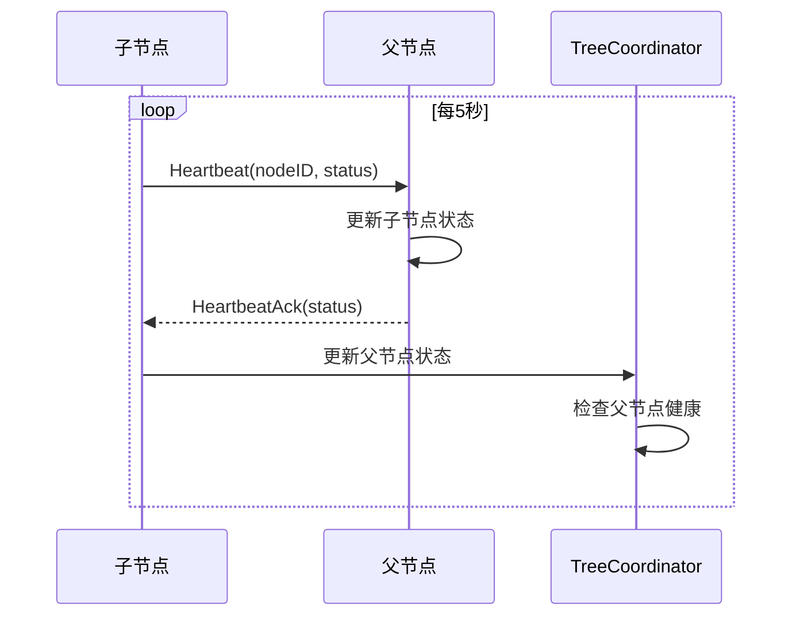

**关键代码**：
```go
// HeartbeatService 心跳服务
type HeartbeatService struct {
    tc           *TreeCoordinator
    interval     time.Duration
    timeout      time.Duration
    stopCh       chan struct{}
    stats        *HeartbeatStats
}

// Start 启动心跳服务
func (hs *HeartbeatService) Start() error {
    ticker := time.NewTicker(hs.interval)
    defer ticker.Stop()

    for {
        select {
        case <-ticker.C:
            // 向父节点发送心跳
            if err := hs.sendHeartbeatToParent(); err != nil {
                logging.WithError(err).Warn("向父节点发送心跳失败")
                hs.stats.ParentHeartbeatFailed.Add(1)
            }

            // 向子节点发送心跳
            if err := hs.sendHeartbeatToChildren(); err != nil {
                logging.WithError(err).Warn("向子节点发送心跳失败")
                hs.stats.ChildrenHeartbeatFailed.Add(1)
            }

        case <-hs.stopCh:
            return nil
        }
    }
}

// sendHeartbeatToParent 向父节点发送心跳
func (hs *HeartbeatService) sendHeartbeatToParent() error {
    tc := hs.tc

    // 获取父节点
    parentNode := tc.topology.GetParent(tc.localNode.NodeID)
    if parentNode == nil {
        return nil // 没有父节点（根节点）
    }

    // 构造心跳消息
    heartbeat := &HeartbeatMessage{
        NodeID:    tc.localNode.NodeID,
        NodeAddr:  tc.localAddr,
        Status:    tc.localNode.Status,
        Timestamp: tc.hlc.Now().Value(),
    }

    // 发送心跳
    ctx := context.Background()
    if err := tc.transport.Send(ctx, parentNode.Addr, heartbeat); err != nil {
        return fmt.Errorf("发送心跳失败: %w", err)
    }

    hs.stats.ParentHeartbeatsSent.Add(1)

    return nil
}

// sendHeartbeatToChildren 向子节点发送心跳
func (hs *HeartbeatService) sendHeartbeatToChildren() error {
    tc := hs.tc

    // 获取子节点列表
    children := tc.topology.GetChildren(tc.localNode.NodeID)
    if len(children) == 0 {
        return nil
    }

    // 构造心跳消息
    heartbeat := &HeartbeatMessage{
        NodeID:    tc.localNode.NodeID,
        NodeAddr:  tc.localAddr,
        Status:    tc.localNode.Status,
        Timestamp: tc.hlc.Now().Value(),
    }

    ctx := context.Background()
    successCount := 0

    // 向每个子节点发送心跳
    for _, child := range children {
        if err := tc.transport.Send(ctx, child.Addr, heartbeat); err != nil {
            logging.WithFields(map[string]any{
                "child_id": child.NodeID,
                "error":    err,
            }).Warn("向子节点发送心跳失败")
            continue
        }
        successCount++
    }

    hs.stats.ChildrenHeartbeatsSent.Add(int64(successCount))

    return nil
}
```

**心跳消息**：
```go
// HeartbeatMessage 心跳消息
type HeartbeatMessage struct {
    NodeID    string
    NodeAddr  string
    Status    NodeStatus
    Timestamp uint64
}

// HeartbeatAckMessage 心跳确认消息
type HeartbeatAckMessage struct {
    NodeID    string
    Status    NodeStatus
    Timestamp uint64
}

// NodeStatus 节点状态
type NodeStatus int

const (
    NodeStatusJoining   NodeStatus = iota
    NodeStatusActive
    NodeStatusLeaving
    NodeStatusFailed
)
```

### 4. 离开通知机制

**流程图**：
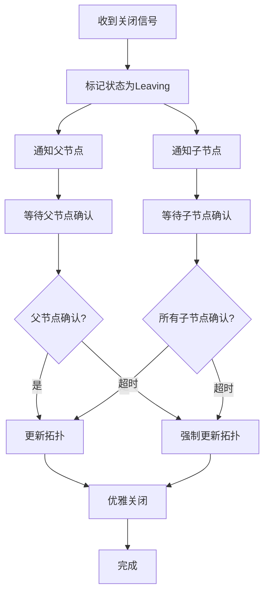

**关键代码**：
```go
// Leave 优雅离开树形结构
func (tc *TreeCoordinator) Leave() error {
    // 1. 标记状态为离开中
    tc.localNode.Status = NodeStatusLeaving

    // 2. 通知父节点
    if err := tc.notifyParentLeaving(); err != nil {
        logging.WithError(err).Warn("通知父节点失败")
    }

    // 3. 通知子节点
    if err := tc.notifyChildrenLeaving(); err != nil {
        logging.WithError(err).Warn("通知子节点失败")
    }

    // 4. 等待确认（带超时）
    ctx, cancel := context.WithTimeout(context.Background(), 5*time.Second)
    defer cancel()

    select {
    case <-tc.leaveConfirmed:
        logging.Info("离开确认完成")
    case <-ctx.Done():
        logging.Warn("离开确认超时，强制退出")
    }

    // 5. 更新拓扑
    tc.topology.RemoveNode(tc.localNode.NodeID)

    logging.WithField("node_id", tc.localNode.NodeID).Info("离开树形结构")

    return nil
}

// notifyParentLeaving 通知父节点离开
func (tc *TreeCoordinator) notifyParentLeaving() error {
    parentNode := tc.topology.GetParent(tc.localNode.NodeID)
    if parentNode == nil {
        return nil // 没有父节点
    }

    leaveMsg := &LeaveMessage{
        NodeID:    tc.localNode.NodeID,
        Reason:    "graceful_shutdown",
        Timestamp: tc.hlc.Now().Value(),
    }

    ctx := context.Background()
    if err := tc.transport.Send(ctx, parentNode.Addr, leaveMsg); err != nil {
        return fmt.Errorf("发送离开消息失败: %w", err)
    }

    logging.WithField("parent_id", parentNode.NodeID).Info("通知父节点离开")

    return nil
}

// notifyChildrenLeaving 通知子节点离开
func (tc *TreeCoordinator) notifyChildrenLeaving() error {
    children := tc.topology.GetChildren(tc.localNode.NodeID)
    if len(children) == 0 {
        return nil
    }

    leaveMsg := &LeaveMessage{
        NodeID:    tc.localNode.NodeID,
        Reason:    "graceful_shutdown",
        Timestamp: tc.hlc.Now().Value(),
        SuggestedParents: tc.suggestNewParents(children),
    }

    ctx := context.Background()

    for _, child := range children {
        if err := tc.transport.Send(ctx, child.Addr, leaveMsg); err != nil {
            logging.WithFields(map[string]any{
                "child_id": child.NodeID,
                "error":    err,
            }).Warn("通知子节点离开失败")
        }
    }

    logging.WithField("children_count", len(children)).Info("通知子节点离开")

    return nil
}

// suggestNewParents 建议新的父节点
func (tc *TreeCoordinator) suggestNewParents(children []*Node) []string {
    // 获取可用节点（排除自己和子节点）
    availableNodes := tc.getAvailableNodes()

    // 简单策略：随机分配
    var suggestedParents []string
    for i, child := range children {
        if i < len(availableNodes) {
            suggestedParents = append(suggestedParents, availableNodes[i])
        }
    }

    return suggestedParents
}
```

**离开消息**：
```go
// LeaveMessage 离开消息
type LeaveMessage struct {
    NodeID            string
    Reason            string
    Timestamp         uint64
    SuggestedParents  []string // 给子节点的建议新父节点
}
```

### 5. 心跳处理

```go
// handleHeartbeat 处理心跳消息
func (tc *TreeCoordinator) handleHeartbeat(
    msg *HeartbeatMessage,
    sourceAddr string,
) error {
    // 1. 更新节点状态
    tc.topology.UpdateNodeStatus(msg.NodeID, msg.Status)
    tc.topology.UpdateNodeHeartbeat(msg.NodeID, time.Now())

    // 2. 发送确认
    ack := &HeartbeatAckMessage{
        NodeID:    tc.localNode.NodeID,
        Status:    tc.localNode.Status,
        Timestamp: tc.hlc.Now().Value(),
    }

    ctx := context.Background()
    if err := tc.transport.Send(ctx, sourceAddr, ack); err != nil {
        return fmt.Errorf("发送心跳确认失败: %w", err)
    }

    logging.WithField("from_node_id", msg.NodeID).Debug("处理心跳")

    return nil
}

// handleJoin 处理加入请求
func (tc *TreeCoordinator) handleJoin(
    msg *JoinMessage,
    sourceAddr string,
) error {
    // 1. 验证是否可以加入
    if err := tc.validateJoin(msg); err != nil {
        return err
    }

    // 2. 添加子节点
    newNode := &Node{
        NodeID:       msg.NodeID,
        Addr:         msg.NodeAddr,
        ParentNodeID: tc.localNode.NodeID,
        Status:       NodeStatusActive,
        LastHeartbeat: time.Now(),
    }

    tc.topology.AddNode(newNode)

    // 3. 发送确认
    reply := &JoinReplyMessage{
        Accepted: true,
        ParentNodeID: tc.localNode.NodeID,
        Reason: "join_accepted",
    }

    ctx := context.Background()
    if err := tc.transport.Send(ctx, sourceAddr, reply); err != nil {
        return fmt.Errorf("发送加入确认失败: %w", err)
    }

    logging.WithFields(map[string]any{
        "new_node_id": msg.NodeID,
        "new_node_addr": msg.NodeAddr,
    }).Info("接受节点加入")

    return nil
}

// handleLeave 处理离开消息
func (tc *TreeCoordinator) handleLeave(
    msg *LeaveMessage,
    sourceAddr string,
) error {
    // 1. 更新节点状态
    tc.topology.UpdateNodeStatus(msg.NodeID, NodeStatusLeaving)

    // 2. 从拓扑中移除
    if err := tc.topology.RemoveNode(msg.NodeID); err != nil {
        return fmt.Errorf("移除节点失败: %w", err)
    }

    // 3. 发送确认
    ack := &LeaveAckMessage{
        NodeID: tc.localNode.NodeID,
        Acknowledged: true,
    }

    ctx := context.Background()
    if err := tc.transport.Send(ctx, sourceAddr, ack); err != nil {
        return fmt.Errorf("发送离开确认失败: %w", err)
    }

    logging.WithField("leaving_node_id", msg.NodeID).Info("确认节点离开")

    return nil
}
```

### 6. 统计信息

```go
type HeartbeatStats struct {
    // 向父节点发送的心跳数
    ParentHeartbeatsSent atomic.Int64

    // 向父节点发送心跳失败数
    ParentHeartbeatFailed atomic.Int64

    // 向子节点发送的心跳数
    ChildrenHeartbeatsSent atomic.Int64

    // 向子节点发送心跳失败数
    ChildrenHeartbeatFailed atomic.Int64

    // 接收的心跳数
    HeartbeatsReceived atomic.Int64

    // 处理的加入请求数
    JoinRequestsReceived atomic.Int64

    // 接受的加入数
    JoinsAccepted atomic.Int64

    // 拒绝的加入数
    JoinsRejected atomic.Int64

    // 处理的离开请求数
    LeaveRequestsReceived atomic.Int64
}
```

---

## ⚠️ 风险预判

### 风险 1: 心跳风暴

**风险等级**: 🟡 中等

**场景**：
- 大量节点（如100个）同时发送心跳
- 每个节点向父节点和子节点发送心跳

**影响**：
- 网络带宽占用高
- 心跳处理延迟增加

**缓解措施**：
1. **心跳间隔调整**：根据子节点数量动态调整
   - 子节点 ≤ 5：间隔 5 秒
   - 子节点 6-20：间隔 10 秒
   - 子节点 > 20：间隔 15 秒
2. **心跳压缩**：批量发送心跳（如一次发送给所有子节点）
3. **心跳抑制**：如果已有数据传输，抑制心跳发送

### 风险 2: 父节点单点故障

**风险等级**: 🔴 高

**场景**：
- 子节点的父节点故障
- 子节点无法继续发送心跳

**影响**：
- 子节点变成孤岛
- 拓扑分裂

**缓解措施**：
1. **心跳超时检测**：父节点心跳超时后，触发重选
2. **备用父节点**：维护一个备用父节点列表
3. **自愈机制**：自动寻找新的父节点

### 风险 3: 离开通知丢失

**风险等级**: 🟡 中等

**场景**：
- 节点离开时发送通知
- 网络故障导致通知丢失

**影响**：
- 其他节点认为节点仍存活
- 路由错误

**缓解措施**：
1. **重复发送**：离开通知发送 3 次
2. **超时强制退出**：等待确认 5 秒后强制退出
3. **φ 故障检测器兜底**：即使通知丢失，φ 检测器也会检测到故障

### 风险 4: 发现机制失效

**风险等级**: 🟡 中等

**场景**：
- 种子节点全部不可用
- 组播被网络阻止
- K8s API 不可达

**影响**：
- 新节点无法加入集群
- 集群无法扩展

**缓解措施**：
1. **多机制备份**：配置多种发现机制（种子 + 组播）
2. **手动配置兜底**：支持手动指定父节点
3. **重试机制**：发现失败后定期重试

### 风险 5: 心跳延迟误判

**风险等级**: 🟢 低

**场景**：
- 网络延迟导致心跳超时
- 误判节点故障

**影响**：
- 不必要的故障转移
- 拓扑震荡

**缓解措施**：
1. **超时阈值调整**：根据网络延迟动态调整
2. **连续失败确认**：连续 3 次心跳失败才标记故障
3. **φ 值辅助判断**：结合 φ 故障检测器

---

## ✅ 成功标准

### 功能完整性

- [ ] 新节点启动时自动发现可用节点
- [ ] 自动选择合适的父节点并加入
- [ ] 定期向父节点发送心跳
- [ ] 定期向子节点发送心跳
- [ ] 离开时通知父节点
- [ ] 离开时通知子节点
- [ ] 处理加入/离开/心跳消息

### 性能指标

- [ ] 节点发现时间 < 5 秒
- [ ] 加入集群时间 < 10 秒
- [ ] 心跳延迟 < 100ms（本地网络）
- [ ] 心跳间隔 5-15 秒（根据子节点数动态调整）

### 质量标准

- [ ] 单元测试覆盖率 > 85%
- [ ] 集成测试通过
- [ ] 无 golangci-lint 错误
- [ ] 无心跳泄漏

---

## 🧪 测试计划

### 单元测试

| 用例ID | 测试场景 | 验证目标 |
|-------|---------|---------|
| TC-DH-001 | 种子节点发现 | 验证发现逻辑 |
| TC-DH-002 | 组播节点发现 | 验证组播监听 |
| TC-DH-003 | 选择父节点 | 验证负载均衡 |
| TC-DH-004 | 发送加入请求 | 验证请求发送 |
| TC-DH-005 | 处理加入请求 | 验证加入逻辑 |
| TC-DH-006 | 向父节点发送心跳 | 验证心跳发送 |
| TC-DH-007 | 向子节点发送心跳 | 验证批量发送 |
| TC-DH-008 | 处理心跳消息 | 验证状态更新 |
| TC-DH-009 | 通知父节点离开 | 验证离开通知 |
| TC-DH-010 | 通知子节点离开 | 验证离开通知 |
| TC-DH-011 | 心跳超时重选父节点 | 验证自愈逻辑 |
| TC-DH-012 | 统计信息更新 | 验证统计正确性 |

### 集成测试

| 用例ID | 测试场景 | 验证目标 |
|-------|---------|---------|
| TC-DH-101 | 单节点启动（根节点） | 验证初始化 |
| TC-DH-102 | 双节点自动加入 | 验证自动发现和加入 |
| TC-DH-103 | 10节点树形拓扑构建 | 验证大规模部署 |
| TC-DH-104 | 心跳持续发送 | 验证心跳稳定性 |
| TC-DH-105 | 节点优雅离开 | 验证离开通知 |
| TC-DH-106 | 父节点故障子节点重选 | 验证自愈机制 |
| TC-DH-107 | 网络分区恢复 | 验证分区恢复 |

### 手动测试

1. **单节点启动**
   ```bash
   # 启动第一个节点（根节点）
   ./bin/nexkv --config node1.yaml

   # 检查拓扑
   curl http://localhost:9211/api/v1/topology

   # 预期：node1 是根节点，无父节点
   ```

2. **双节点自动加入**
   ```bash
   # 启动第一个节点
   ./bin/nexkv --config node1.yaml &
   PID1=$!

   # 启动第二个节点（配置种子节点为 node1）
   ./bin/nexkv --config node2.yaml &
   PID2=$!

   # 等待10秒
   sleep 10

   # 检查 node2 的拓扑
   curl http://localhost:9212/api/v1/topology

   # 预期：node2 的父节点是 node1

   # 清理
   kill $PID1 $PID2
   ```

3. **心跳监控**
   ```bash
   # 启动3个节点的树形拓扑
   ./bin/nexkv --config node1.yaml &  # 根节点
   ./bin/nexkv --config node2.yaml &  # node1的子节点
   ./bin/nexkv --config node3.yaml &  # node2的子节点

   # 监控心跳统计
   watch -n 5 'curl -s http://localhost:9213/api/v1/heartbeat/stats | jq'

   # 预期：
   # - parent_heartbeats_sent 持续增加
   # - children_heartbeats_sent 定期增加（node2）
   ```

4. **优雅离开测试**
   ```bash
   # 启动节点
   ./bin/nexkv --config node1.yaml &
   ./bin/nexkv --config node2.yaml &
   ./bin/nexkv --config node3.yaml &

   # 等待拓扑稳定
   sleep 15

   # 优雅关闭 node2
   curl -X POST http://localhost:9212/api/v1/cluster/leave

   # 检查 node1 和 node3 的拓扑
   curl http://localhost:9211/api/v1/topology
   curl http://localhost:9213/api/v1/topology

   # 预期：node2 已从拓扑中移除
   ```

---

## 📋 开发检查清单

### Phase 1: 准备阶段
- [ ] 创建分支 `feature/tree-coordinator-auto-discovery-heartbeat`
- [ ] 阅读现有 TreeCoordinator 实现
- [ ] 理解 φ 故障检测器原理

### Phase 2: 发现服务
- [ ] 定义 `NodeDiscoveryService` 接口
- [ ] 实现 `SeedNodeDiscovery`
- [ ] 实现 `MulticastDiscovery`（可选）
- [ ] 实现 `K8sDiscovery`（可选）
- [ ] 添加发现配置
- [ ] 编写单元测试

### Phase 3: 自动加入
- [ ] 实现 `discoverAndJoin()` 方法
- [ ] 实现 `selectParentNode()` 方法
- [ ] 实现 `queryChildNodeCount()` 方法
- [ ] 实现 `handleJoin()` 方法
- [ ] 添加加入验证逻辑
- [ ] 编写单元测试

### Phase 4: 心跳服务
- [ ] 定义心跳消息结构
- [ ] 实现 `HeartbeatService`
- [ ] 实现 `sendHeartbeatToParent()` 方法
- [ ] 实现 `sendHeartbeatToChildren()` 方法
- [ ] 实现 `handleHeartbeat()` 方法
- [ ] 添加心跳统计
- [ ] 编写单元测试

### Phase 5: 离开通知
- [ ] 定义离开消息结构
- [ ] 实现 `Leave()` 方法
- [ ] 实现 `notifyParentLeaving()` 方法
- [ ] 实现 `notifyChildrenLeaving()` 方法
- [ ] 实现 `handleLeave()` 方法
- [ ] 实现 `suggestNewParents()` 方法
- [ ] 添加超时处理
- [ ] 编写单元测试

### Phase 6: 集成测试
- [ ] 编写单节点启动测试
- [ ] 编写双节点自动加入测试
- [ ] 编写多节点树形拓扑测试
- [ ] 编写心跳稳定性测试
- [ ] 编写优雅离开测试
- [ ] 编写父节点故障自愈测试

### Phase 7: 文档与交付
- [ ] 更新 CLAUDE.md
- [ ] 编写实施总结报告
- [ ] 提交 PR 到 GitHub
- [ ] 等待 CI 通过
- [ ] 合并到 mainline

---

## 📚 参考文档

- `01_核心架构概念.md` - 三层架构设计
- `05_树形协调器拓扑同步.md` - TreeCoordinator 拓扑同步
- `../../06_project_management/reports/phase6-virtual-node-isolation.md` - Phase 6 实施报告
- `CLAUDE.md` - 项目开发指南

---

**文档版本**: v1.0
**作者**: NexKV 开发团队
**最后更新**: 2026-01-18
