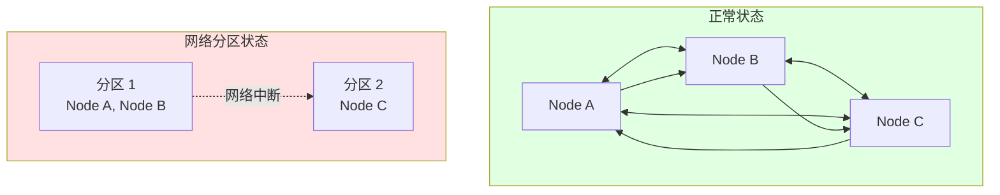
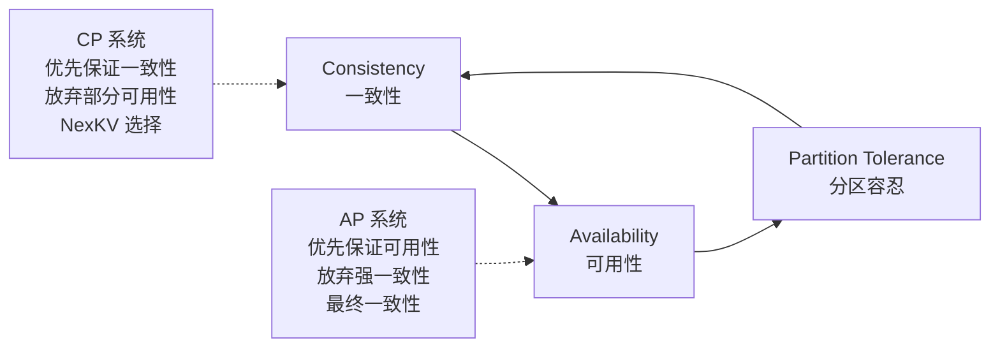
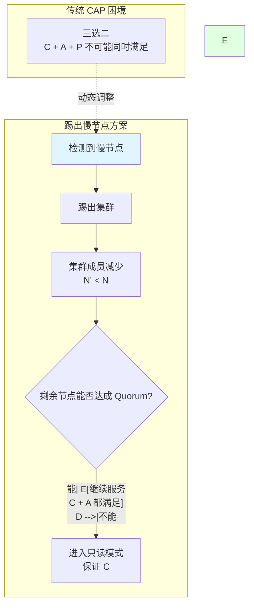
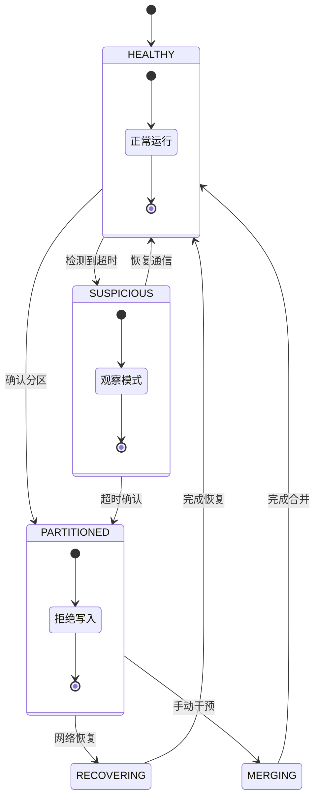
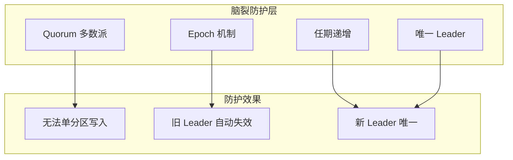

# 网络分区处理详解

> **文档版本**: v1.0
> **创建日期**: 2026-01-15
> **状态**: ✅ 核心机制说明

---

## 📋 核心概述

**网络分区（Network Partition）** 是指分布式系统中节点之间的网络连接中断，导致系统被分割成两个或多个无法相互通信的子集。这是分布式系统中最具挑战性的故障类型之一。



---

## 一、网络分区核心原理

### 1.1 为什么网络分区危险

| 危险类型 | 描述 | 影响 |
|---------|------|------|
| **脑裂（Split-Brain）** | 两个分区各自选举 Leader | 数据不一致、服务重复 |
| **数据丢失** | 写入只在一个分区生效 | 提交的数据在恢复后丢失 |
| **服务不可用** | 无法达成 Quorum | 所有写入失败 |
| **状态不一致** | 不同分区状态不同 | 合并困难、甚至无法合并 |

---

### 1.2 CAP 定理与网络分区



**NexKV 设计选择**：CP 系统，优先保证数据一致性
- 当发生网络分区时，如果无法达成 Quorum，拒绝写入
- 防止脑裂导致的数据不一致

---

### 1.3 突破 CAP 限制：踢出慢节点实现 CAP 都要

> **核心洞察**（zhh-4096）：把慢节点/故障节点踢出集群，就可以 CAP 都要了

传统 CAP 定理认为三者不可兼得，但通过**动态调整集群成员**，可以在大多数情况下同时获得一致性和可用性。



**原理说明**：

```
传统观点：
  5节点集群，2节点离线 → 无法达成 Quorum(3) → 不可用

踢出慢节点方案：
  5节点集群，2节点离线 → 踢出慢节点 → 3节点集群
  3节点中 1节点离线 → 踢出 → 2节点集群
  2节点中 1节点离线 → 踢出 → 1节点（但已无意义）

关键：踢出后，剩余节点可以继续以新的 Quorum 工作
```

**实现要点**：

| 要点 | 说明 |
|------|------|
| **检测慢节点** | 通过心跳超时、响应延迟等指标识别 |
| **自动踢出** | 超过阈值后自动从集群移除 |
| **动态 Quorum** | 根据当前存活节点数重新计算 Quorum |
| **数据同步** | 新成员加入时同步数据 |
| **人工干预** | 提供手动恢复入口 |

**代码示例**：

```go
// 自动踢出慢节点配置
type AutoEvictConfig struct {
    Enabled              bool          // 是否启用自动踢出
    MaxResponseTime      time.Duration // 最大响应时间（默认 5s）
    MaxConsecutiveFails  int           // 最大连续失败次数（默认 10）
    MinClusterSize       int           // 最小集群大小（默认 2）
}

// Quorum 动态计算
func CalculateQuorum(nodeCount int) int {
    if nodeCount < 3 {
        return nodeCount // 降级：需要全员同意
    }
    return nodeCount/2 + 1 // 标准多数派
}

// 执行踢出
func (m *MembershipManager) evictNode(nodeID string) error {
    remainingNodes := m.GetAliveNodes()
    if len(remainingNodes) < m.config.MinClusterSize {
        return fmt.Errorf("cannot evict: would reduce cluster below minimum size")
    }

    if err := m.removeNode(nodeID); err != nil {
        return err
    }

    m.BroadcastClusterView()

    newQuorum := CalculateQuorum(len(remainingNodes))
    m.UpdateQuorum(newQuorum)

    return nil
}
```

**CAP 兼顾效果**：

| 场景 | 传统处理 | 踢出慢节点方案 |
|------|---------|--------------|
| 5节点，1节点慢 | 可能继续工作，但性能下降 | 踢出后 4节点，Q=3，继续工作 |
| 5节点，2节点慢 | 无法达成 Quorum，停止写入 | 踢出后 3节点，Q=2，继续写入 |
| 5节点，3节点慢 | 停止服务 | 踢出后 2节点，Q=2，降级服务 |
| 动态恢复 | 需人工干预 | 慢节点恢复后可重新加入 |

**总结**：通过动态踢出慢节点/故障节点，集群可以：
- 保持**一致性**：始终以 Quorum 模式工作
- 保持**可用性**：剩余健康节点继续服务
- 兼顾**分区容忍**：自动适应节点变化

---

## 二、分区检测机制

### 2.1 检测方法对比

| 方法 | 原理 | 优点 | 缺点 | 适用场景 |
|------|------|------|------|---------|
| **心跳检测** | 定期发送 heartbeat | 简单、实时 | 可能有误判 | 小规模集群 |
| **超时机制** | 设置响应超时时间 | 通用、灵活 | 需要调优 | 通用场景 |
| **Gossip 协议** | 信息传播收敛判定 | 可扩展、去中心化 | 收敛延迟 | 大规模集群 |
| **仲裁节点** | 第三方判定 | 快速准确 | 单点风险 | 关键业务 |

---

### 2.2 心跳检测机制

```mermaid
flowchart TD
    subgraph 心跳流程
        A["节点 A 发送心跳"] --> B{"节点 B 响应?"}
        B -->|"是| C["更新最后活跃时间"]
        B -->|"否| D{"连续失败次数?"}
        D -->|"小于阈值| E["重试"]
        D -->|"大于阈值| F["标记为疑似离线"]
        F --> G{"确认超时?"}
        G -->|"是| H["广播分区事件"]
        G -->|"否| I["继续观察"]
    end

    style A fill:#e1f5ff
    style H fill:#ffe1e1
```

---

### 2.3 心跳配置参数

```go
// 心跳检测配置
type HeartbeatConfig struct {
    Interval         time.Duration  // 心跳间隔（默认 100ms）
    Timeout          time.Duration  // 超时时间（默认 1s）
    MaxFailures      int            // 最大连续失败次数（默认 3）
    SuspiciousMultiplier float64    // 可疑倍数（默认 2.0）
}

// Gossip 扇出配置
type GossipConfig struct {
    Fanout           int           // 每轮传播邻居数（默认 3）
    Interval         time.Duration // Gossip 间隔（默认 1s）
    ConvergenceTimeout time.Duration // 收敛超时（默认 10s）
    MinPeers         int           // 最少 peers 数量（默认 2）
}
```

---

### 2.4 分区判定算法



---

## 三、分区恢复策略

### 3.1 恢复流程总览

```mermaid
flowchart TD
    A["检测到分区"] --> B{"分区类型?"}
    B -->|"单节点离线| C["更新视图<br/>继续服务"]
    B -->|"多数节点离线| D["进入只读模式"]
    B -->|"脑裂| E["启动脑裂防护"]

    C --> F["恢复正常"]

    D --> G{"网络恢复?"}
    G -->|"是| H["重新加入<br/>同步数据"]
    G -->|"否| I["等待"]

    E --> J{"有 Leader?"}
    J -->|"是| K["保留原 Leader<br/>拒绝分区写入"]
    J -->|"否| L["发起选举<br/>确保唯一"]

    H --> F
    K --> M["手动合并"]
    L --> N["新 Leader 产生"]
    N --> M

    F --> O["记录恢复日志"]

    style A fill:#ffe1e1
    style E fill:#ff6666
    style O fill:#e1ffe1
```

---

### 3.2 分区类型与处理策略

| 分区场景 | 节点状态 | 写入可用 | NexKV 处理 |
|---------|---------|---------|-------------|
| 单节点离线 | 3/5 正常 | ✅ 可用 | Quorum 写入 |
| 少数节点离线 | 3/5 正常 | ✅ 可用 | Quorum 写入 |
| 多数节点离线 | 2/5 正常 | ❌ 只读 | 进入只读模式 |
| 脑裂 | 2-3 vs 2-3 | ⚠️ 拒绝 | 脑裂防护 |

---

### 3.3 脑裂防护机制

```mermaid
flowchart TD
    subgraph 脑裂防护
        A["写入请求"] --> B{"当前分区有 Quorum?"}
        B -->|"否| C["拒绝写入<br/>返回错误"]
        B -->|"是| D{"确认唯一 Leader?"}
        D -->|"否| E["禁止写入<br/>等待选举"]
        D -->|"是| F["检查任期<br/>Epoch"]
        F --> G{"Epoch 最新?"}
        G -->|"否| H["拒绝写入<br/>更新 Epoch"]
        G -->|"是| I["执行写入"]
    end

    style C fill:#ffe1e1
    style E fill:#fff4e1
    style I fill:#e1ffe1
```

---

## 四、安全性保障

### 4.1 防止脑裂的核心机制



---

### 4.2 Epoch 机制详解

```mermaid
sequenceDiagram
    participant L as Leader
    participant F1 as Follower 1
    participant F2 as Follower 2
    participant P as 分区节点

    Note over L, P: 正常状态
    L->>F1: Propose (Epoch=5)
    L->>F2: Propose (Epoch=5)
    F1->>L: Ack
    F2->>L: Ack
    L->>All: Commit (Epoch=5)

    Note over L, P: 网络分区
    L->>P: Heartbeat (Epoch=5) - Timeout

    P->>P: 分区确认
    P->>F1: Attempt Leader - Timeout
    P->>F2: Attempt Leader - Timeout

    Note over L, F1: 主分区继续工作
    L->>F1: Propose (Epoch=5)
    F1->>L: Ack
    L->>All: Heartbeat (Epoch=5)

    Note over P: 分区节点尝试
    P->>P: New Epoch needed
    P->>F1: Request Vote (Epoch=6)
    F1->>P: Reject - Leader alive (Epoch=5)

    Note over P: 网络恢复
    P->>L: Rejoin (Epoch=6)
    L->>P: Welcome back (Epoch=7)

    style P fill:#ffe1e1
```

---

## 五、监控与告警

### 5.1 关键监控指标

| 指标 | 含义 | 正常范围 | 告警阈值 |
|------|------|---------|---------|
| `partition_count` | 当前分区数量 | 0 | > 0 |
| `partition_duration` | 分区持续时间 | 0 | > 30s |
| `heartbeat_latency` | 心跳延迟 P99 | < 100ms | > 500ms |
| `node_health_score` | 节点健康评分 | > 0.9 | < 0.7 |
| `recovery_time` | 恢复耗时 | < 5s | > 30s |
| `split_brain_count` | 脑裂发生次数 | 0 | > 0 |

---

## 六、总结

### 6.1 核心要点

| 方面 | 关键决策 | NexKV 实现 |
|------|---------|-------------|
| **检测方法** | 心跳 + Gossip | 双重检测机制 |
| **分区判定** | 超时 + 多轮确认 | 防止误判 |
| **脑裂防护** | Quorum + Epoch | 双重保险 |
| **恢复策略** | 分场景处理 | 智能恢复 |
| **效率优化** | 并行 + 自适应 | 高性能检测 |

---

### 6.2 设计权衡

```mermaid
flowchart triangle
    S[安全性]
    P[性能]
    C[复杂度]

    S --- P
    P --- C
    C --- S

    note1["安全性优先<br/>牺牲部分性能<br/>接受复杂度增加"]
    note2["NexKV 设计<br/>安全的分区处理<br/>可接受的恢复时间"]

    note1 -.-> S
```

---

**文档版本**: v1.0
**最后更新**: 2026-01-15
**维护者**: NexKV 开发团队
