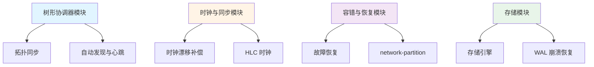

# 模块详细设计

> **目录定位**：各核心模块的详细设计文档，定义 NexKV 各个子系统的具体实现方案。

---

## 📁 文档列表

### 核心模块设计（1 篇）

| 文件 | 说明 | 优先级 |
|------|------|--------|
| **DDD.md** | 模块详细设计（Detailed Design Document） | P0 |

### 树形协调器模块（2 篇）

| 文件 | 说明 | 优先级 |
|------|------|--------|
| **树形协调器拓扑同步.md** | TreeCoordinator 拓扑同步机制 | P0 |
| **树形协调器自动发现与心跳.md** | 节点自动发现与心跳检测 | P0 |

### 时钟与同步模块（1 篇）

| 文件 | 说明 | 优先级 |
|------|------|--------|
| **时钟漂移补偿.md** | HLC 时钟同步与漂移补偿 | P0 |

### 容错与恢复模块（3 篇）

| 文件 | 说明 | 优先级 |
|------|------|--------|
| **故障恢复.md** | 故障恢复机制 | P0 |
| **网络分区处理.md** | 网络分区处理 | P0 |
| **混合逻辑时钟HLC.md** | HLC 混合逻辑时钟 | P0 |

### 存储模块（1 篇）

| 文件 | 说明 | 优先级 |
|------|------|--------|
| **SED.md** | 存储引擎设计（Storage Engine Design） | P0 |
| **WAL崩溃恢复.md** | WAL 崩溃恢复 | P0 |

---

## 🔗 模块关系图

---

## 🔗 相关文档

- **架构设计**：见 `../architecture/01_系统架构设计.md`
- **协议设计**：见 `../protocols/01_一致性协议设计.md`
- **API 设计**：见 `../05_API接口设计.md`
- **核心概念**：见 `../../00_overview/`

---

## 📖 阅读顺序

### 核心流程
1. **DDD.md** - 了解模块总体架构
2. **树形协调器拓扑同步.md** - 理解拓扑管理
3. **树形协调器自动发现与心跳.md** - 理解节点管理

### 可靠性保障
4. **故障恢复.md** - 故障恢复机制
5. **网络分区处理.md** - 网络分区处理
6. **时钟漂移补偿.md** - 时钟同步

### 底层存储
7. **SED.md** - 存储引擎设计
8. **WAL崩溃恢复.md** - WAL 崩溃恢复
9. **混合逻辑时钟HLC.md** - HLC 时钟实现

---

## 📋 模块设计清单

### 已完成设计
- [x] 树形协调器（拓扑同步、自动发现、心跳）
- [x] 时钟同步（HLC、漂移补偿）
- [x] 故障恢复（故障检测、网络分区）
- [x] 存储引擎（WAL、崩溃恢复）

### 待补充设计
- [ ] 分片管理模块设计
- [ ] 副本管理模块设计
- [ ] 路由模块设计
- [ ] 快照管理模块设计
- [ ] 事务管理模块设计

---

**文档版本**: v2.0 (方案 B 重构)
**最后更新**: 2026-01-18
**维护者**: NexKV 开发团队
