# TwoPC Gossip 状态同步机制 - 技术方案

> **创建日期**: 2026-01-18
> **优先级**: 🔴 高（核心功能）
> **相关文件**: `internal/metadata/consensus/twopc.go`
> **TODO 数量**: 8 个

---

## 📊 整体情况 Overview

### TwoPC 模块当前状态

NexKV 的 TwoPC (Two-Phase Commit) 协议是 Layer 3 分布式事务一致性层的核心组件，当前处于**部分完成**状态。

#### 完成进度总览

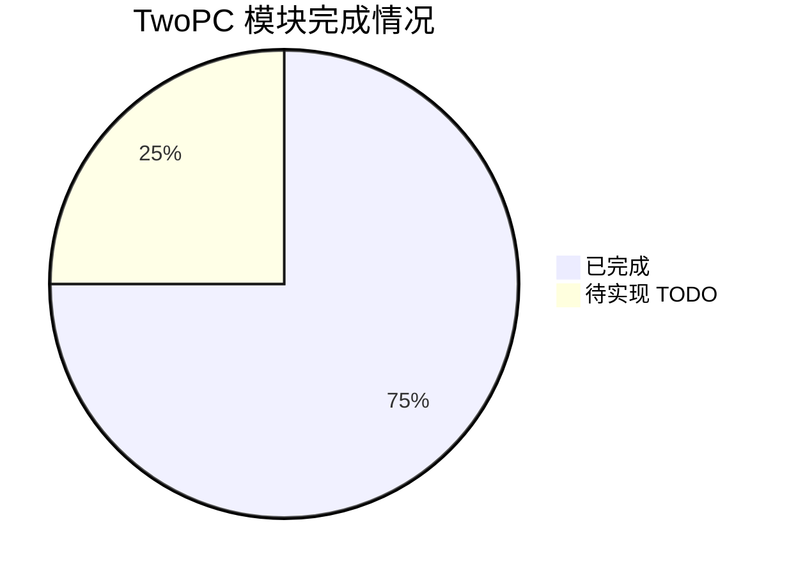
```mermaid
pie title TwoPC 模块完成情况
    "已完成" : 75
    "待实现 TODO" : 25
```

#### 模块功能分解

| 功能模块 | 状态 | 完成度 | 说明 |
|---------|------|--------|------|
| **核心事务流程** | ✅ 完成 | 100% | Execute, PreCommit, Decision |
| **消息处理** | ✅ 完成 | 90% | 6 种消息类型处理完成 |
| **投票机制** | ✅ 完成 | 100% | 记录投票、统计 |
| **决策逻辑** | ✅ 完成 | 100% | 全员 commit 才提交 |
| **提交/回滚** | ✅ 完成 | 100% | 发送消息给参与者 |
| **Gossip 状态同步** | ❌ TODO | 0% | **本次实现** |
| **Gossip 查询** | ❌ TODO | 0% | **本次实现** |
| **协调者追踪** | ❌ TODO | 0% | **本次实现** |
| **响应追踪** | ❌ TODO | 0% | **本次实现** |

### TODO 分布详情

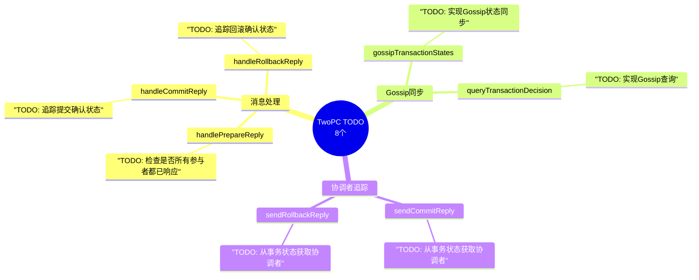
```mermaid
mindmap
  root((TwoPC TODO<br/>8个))
    消息处理
      handlePrepareReply
        "TODO: 检查是否所有参与者都已响应"
      handleCommitReply
        "TODO: 追踪提交确认状态"
      handleRollbackReply
        "TODO: 追踪回滚确认状态"
    Gossip同步
      gossipTransactionStates
        "TODO: 实现Gossip状态同步"
      queryTransactionDecision
        "TODO: 实现Gossip查询"
    协调者追踪
      sendCommitReply
        "TODO: 从事务状态获取协调者"
      sendRollbackReply
        "TODO: 从事务状态获取协调者"
```

### 与其他模块的关系

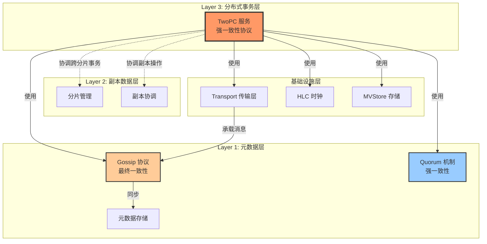
```mermaid
graph TB
    subgraph "Layer 3: 分布式事务层"
        TwoPC[TwoPC 服务<br/>强一致性协议]
    end

    subgraph "Layer 2: 副本数据层"
        Shards[分片管理]
        Replicas[副本协调]
    end

    subgraph "Layer 1: 元数据层"
        Metadata[元数据存储]
        Gossip[Gossip 协议<br/>最终一致性]
        Quorum[Quorum 机制<br/>强一致性]
    end

    subgraph "基础设施层"
        Transport[Transport 传输层]
        Clock[HLC 时钟]
        Store[MVStore 存储]
    end

    TwoPC -->|使用| Gossip
    TwoPC -->|使用| Quorum
    TwoPC -->|使用| Transport
    TwoPC -->|使用| Clock
    TwoPC -->|使用| Store
    TwoPC -.->|协调跨分片事务| Shards
    TwoPC -.->|协调副本操作| Replicas

    Gossip -->|同步| Metadata
    Transport -->|承载消息| Gossip

    style TwoPC fill:#f96,stroke:#333,stroke-width:3px
    style Gossip fill:#fc9,stroke:#333,stroke-width:2px
    style Quorum fill:#9cf,stroke:#333,stroke-width:2px
```

### 当前架构 vs 目标架构

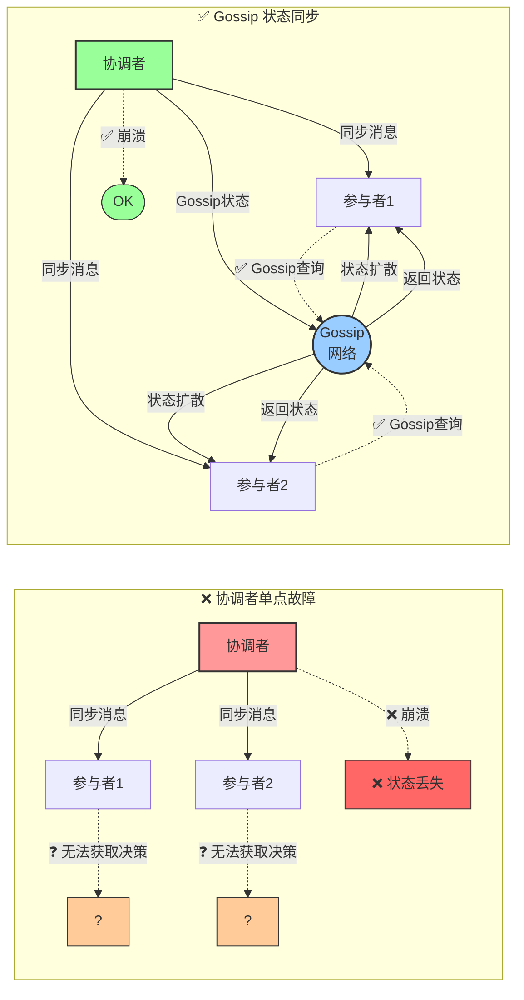
```mermaid
graph LR
    subgraph 当前架构[❌ 协调者单点故障]
        C1[协调者]
        P1[参与者1]
        P2[参与者2]

        C1 -->|同步消息| P1
        C1 -->|同步消息| P2

        C1 -.->|❌ 崩溃| X[❌ 状态丢失]
        P1 -.->|❓ 无法获取决策| Q1[?]
        P2 -.->|❓ 无法获取决策| Q2[?]
    end

    subgraph 目标架构[✅ Gossip 状态同步]
        C2[协调者]
        P3[参与者1]
        P4[参与者2]
        G((Gossip<br/>网络))

        C2 -->|同步消息| P3
        C2 -->|同步消息| P4
        C2 -->|Gossip状态| G
        G -->|状态扩散| P3
        G -->|状态扩散| P4

        C2 -.->|✅ 崩溃| OK([OK])
        P3 -.->|✅ Gossip查询| G
        P4 -.->|✅ Gossip查询| G
        G -->|返回状态| P3
        G -->|返回状态| P4
    end

    style C1 fill:#f99,stroke:#333,stroke-width:2px
    style X fill:#f66,stroke:#333
    style Q1 fill:#fc9,stroke:#333
    style Q2 fill:#fc9,stroke:#333
    style C2 fill:#9f9,stroke:#333,stroke-width:2px
    style OK fill:#9f9,stroke:#333
    style G fill:#9cf,stroke:#333,stroke-width:2px
```

### 实施路线图

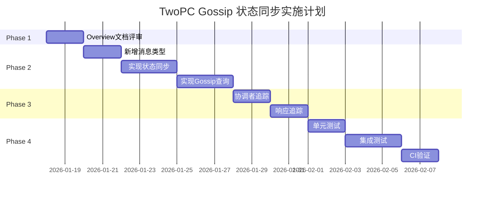
```mermaid
gantt
    title TwoPC Gossip 状态同步实施计划
    dateFormat  YYYY-MM-DD
    section Phase 1
    Overview文档评审      :a1, 2026-01-18, 2d
    section Phase 2
    新增消息类型         :a2, after a1, 2d
    实现状态同步         :a3, after a2, 3d
    实现Gossip查询       :a4, after a3, 3d
    section Phase 3
    协调者追踪           :a5, after a4, 2d
    响应追踪             :a6, after a5, 2d
    section Phase 4
    单元测试             :a7, after a6, 2d
    集成测试             :a8, after a7, 3d
    CI验证               :a9, after a8, 2d
```

### 核心数据流

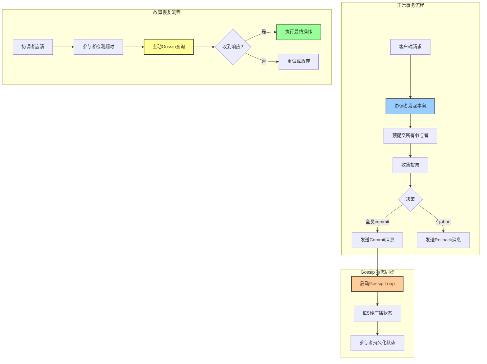
```mermaid
flowchart TB
    subgraph "正常事务流程"
        A[客户端请求] --> B[协调者发起事务]
        B --> C[预提交所有参与者]
        C --> D[收集投票]
        D --> E{决策}
        E -->|全员commit| F[发送Commit消息]
        E -->|有abort| G[发送Rollback消息]
    end

    subgraph "Gossip 状态同步"
        F --> H[启动Gossip Loop]
        H --> I[每5秒广播状态]
        I --> J[参与者持久化状态]
    end

    subgraph "故障恢复流程"
        K[协调者崩溃] --> L[参与者检测超时]
        L --> M[主动Gossip查询]
        M --> N{收到响应?}
        N -->|是| O[执行最终操作]
        N -->|否| P[重试或放弃]
    end

    style B fill:#9cf,stroke:#333,stroke-width:2px
    style H fill:#fc9,stroke:#333,stroke-width:2px
    style M fill:#ff9,stroke:#333,stroke-width:2px
    style O fill:#9f9,stroke:#333
```

### 代码结构概览

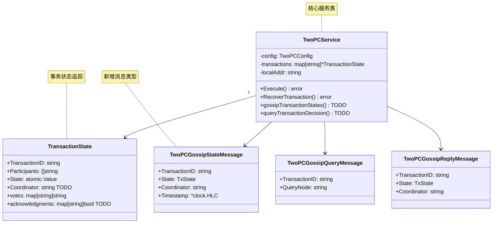
```mermaid
classDiagram
    class TwoPCService {
        -config: TwoPCConfig
        -transactions: map[string]*TransactionState
        -localAddr: string
        +Execute() error
        +RecoverTransaction() error
        +gossipTransactionStates() TODO
        +queryTransactionDecision() TODO
    }

    class TransactionState {
        +TransactionID: string
        +Participants: []string
        +State: atomic.Value
        +Coordinator: string TODO
        +votes: map[string]string
        +acknowledgments: map[string]bool TODO
    }

    class TwoPCGossipStateMessage {
        +TransactionID: string
        +State: TxState
        +Coordinator: string
        +Timestamp: *clock.HLC
    }

    class TwoPCGossipQueryMessage {
        +TransactionID: string
        +QueryNode: string
    }

    class TwoPCGossipReplyMessage {
        +TransactionID: string
        +State: TxState
        +Coordinator: string
    }

    TwoPCService "1" --> "*" TransactionState
    TwoPCService --> TwoPCGossipStateMessage
    TwoPCService --> TwoPCGossipQueryMessage
    TwoPCService --> TwoPCGossipReplyMessage

    note for TwoPCService "核心服务类"
    note for TransactionState "事务状态追踪"
    note for TwoPCGossipStateMessage "新增消息类型"
```

---

## 📋 需求背景

### 当前问题

NexKV 的 TwoPC (Two-Phase Commit) 协议当前存在以下核心问题：

1. **协调者故障时状态丢失风险**
   - 发起节点兼任协调者，如果协调者故障，事务状态无法恢复
   - 参与者无法查询事务的最终决策（commit/abort）
   - 可能导致部分参与者永久阻塞在预提交状态

2. **事务状态无法在节点间传播**
   - 协调者做出决策后，只通过同步消息通知参与者
   - 消息丢失时，参与者无法通过其他途径获取状态
   - 违反了"最终一致性"的设计原则

3. **故障自愈机制不完整**
   - `RecoverTransaction()` 方法依赖 `queryTransactionDecision()`
   - `queryTransactionDecision()` 当前返回"未实现"
   - 重启的节点无法恢复未完成的事务

### 业务影响

| 场景 | 影响 | 严重程度 |
|------|------|---------|
| 协调者崩溃 | 事务状态丢失，资源泄漏 | 🔴 高 |
| 网络分区 | 参与者无法获取决策 | 🔴 高 |
| 节点重启 | 无法恢复未完成事务 | 🟡 中 |
| 消息丢失 | 状态不一致 | 🟡 中 |

---

## 🎯 解决目标

### 核心目标

1. **事务状态 Gossip 同步** - 协调者周期性扩散事务状态
2. **Gossip 查询接口** - 参与者主动查询事务决策
3. **协调者追踪** - 参与者回复消息中携带协调者信息
4. **响应追踪** - 追踪提交/回滚确认状态

### 非目标

- 不实现完整的 Saga 补偿事务模式（过于复杂）
- 不实现分布式死锁检测（超出范围）
- 不实现事务超时自动清理（已有基础机制）

---

## 🔧 技术方案

### 方案概述

利用现有的 **Gossip 协议**基础设施（`gossip.go`），为 TwoPC 添加状态同步能力。

#### 系统架构图

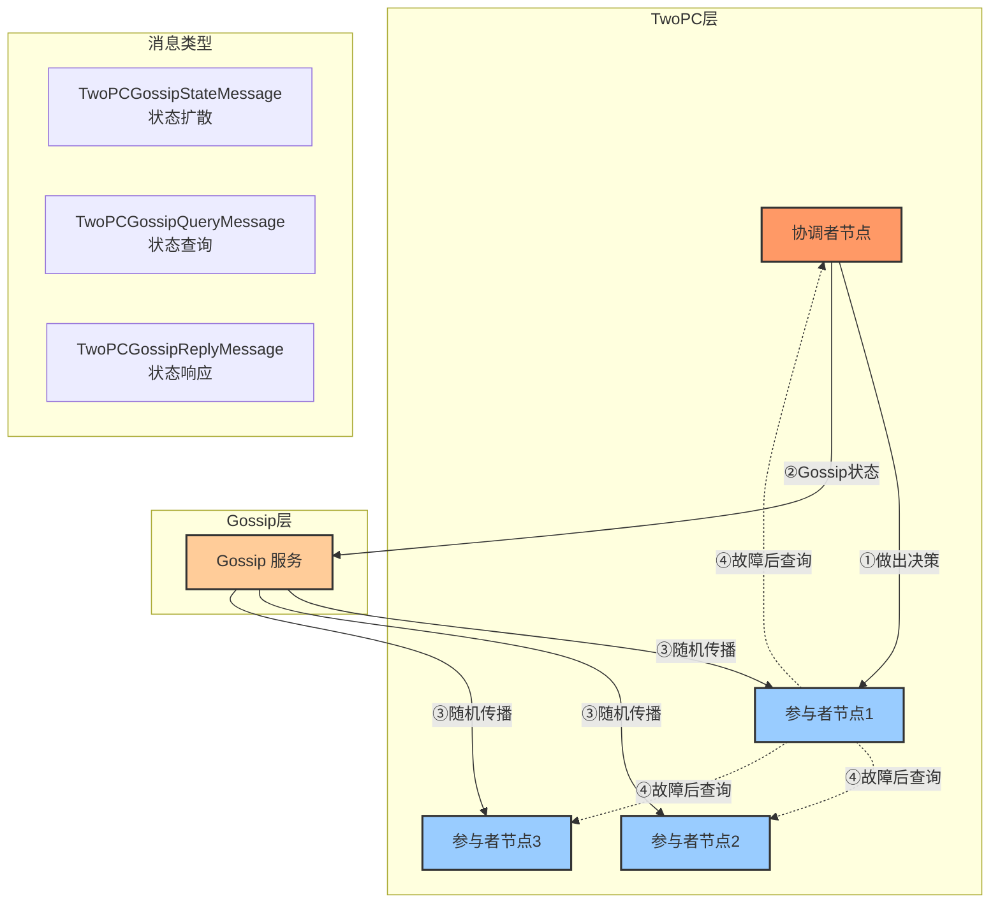
```mermaid
graph TB
    subgraph TwoPC层
        Coordinator[协调者节点]
        Participant1[参与者节点1]
        Participant2[参与者节点2]
        Participant3[参与者节点3]
    end

    subgraph Gossip层
        GossipService[Gossip 服务]
    end

    subgraph 消息类型
        StateMsg[TwoPCGossipStateMessage<br/>状态扩散]
        QueryMsg[TwoPCGossipQueryMessage<br/>状态查询]
        ReplyMsg[TwoPCGossipReplyMessage<br/>状态响应]
    end

    Coordinator -->|①做出决策| Participant1
    Coordinator -->|②Gossip状态| GossipService
    GossipService -->|③随机传播| Participant1
    GossipService -->|③随机传播| Participant2
    GossipService -->|③随机传播| Participant3

    Participant1 -.->|④故障后查询| Coordinator
    Participant1 -.->|④故障后查询| Participant2
    Participant1 -.->|④故障后查询| Participant3

    style Coordinator fill:#f96,stroke:#333,stroke-width:2px
    style Participant1 fill:#9cf,stroke:#333,stroke-width:2px
    style Participant2 fill:#9cf,stroke:#333,stroke-width:2px
    style Participant3 fill:#9cf,stroke:#333,stroke-width:2px
    style GossipService fill:#fc9,stroke:#333,stroke-width:2px
```

#### 正常流程时序图

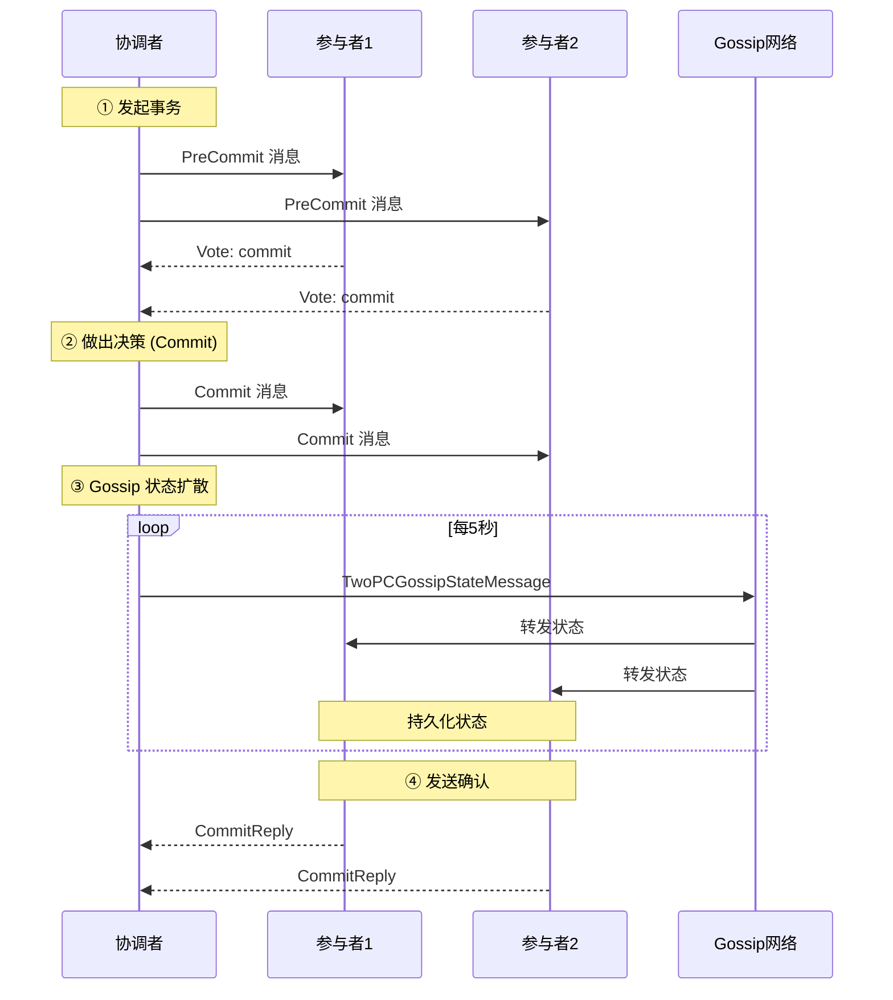
```mermaid
sequenceDiagram
    participant C as 协调者
    participant P1 as 参与者1
    participant P2 as 参与者2
    participant G as Gossip网络

    Note over C: ① 发起事务
    C->>P1: PreCommit 消息
    C->>P2: PreCommit 消息
    P1-->>C: Vote: commit
    P2-->>C: Vote: commit

    Note over C: ② 做出决策 (Commit)
    C->>P1: Commit 消息
    C->>P2: Commit 消息

    Note over C: ③ Gossip 状态扩散
    loop 每5秒
        C->>G: TwoPCGossipStateMessage
        G->>P1: 转发状态
        G->>P2: 转发状态
        Note over P1,P2: 持久化状态
    end

    Note over P1,P2: ④ 发送确认
    P1-->>C: CommitReply
    P2-->>C: CommitReply
```

#### 故障恢复流程图

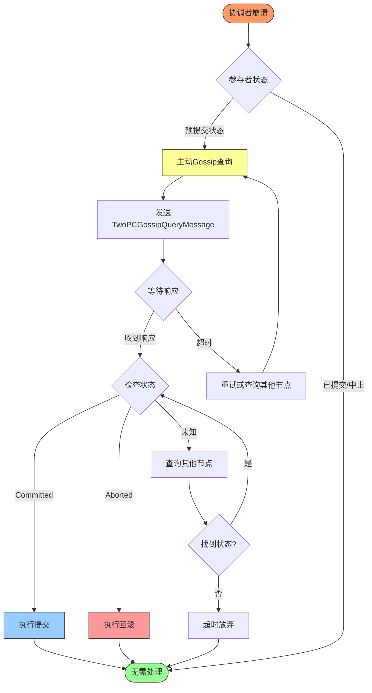
```mermaid
flowchart TB
    Start([协调者崩溃]) --> Check{参与者状态}

    Check -->|预提交状态| Query1[主动Gossip查询]
    Check -->|已提交/中止| Done([无需处理])

    Query1 --> SendQuery[发送TwoPCGossipQueryMessage]
    SendQuery --> Wait{等待响应}

    Wait -->|收到响应| CheckState{检查状态}
    Wait -->|超时| Retry[重试或查询其他节点]
    Retry --> Query1

    CheckState -->|Committed| Commit[执行提交]
    CheckState -->|Aborted| Abort[执行回滚]
    CheckState -->|未知| QueryOther[查询其他节点]

    QueryOther --> Found{找到状态?}
    Found -->|是| CheckState
    Found -->|否| Timeout[超时放弃]

    Commit --> Done
    Abort --> Done
    Timeout --> Done

    style Start fill:#f96,stroke:#333
    style Done fill:#9f9,stroke:#333
    style Query1 fill:#ff9,stroke:#333
    style Commit fill:#9cf,stroke:#333
    style Abort fill:#f99,stroke:#333
```

#### 事务状态机图

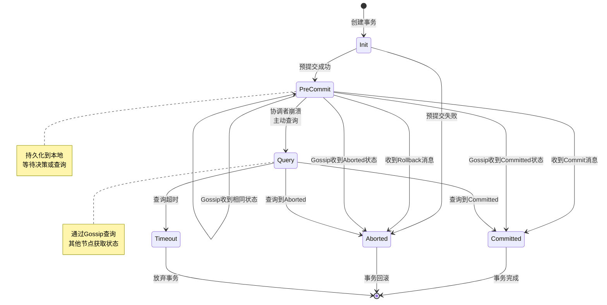
```mermaid
stateDiagram-v2
    [*] --> Init: 创建事务

    Init --> PreCommit: 预提交成功
    Init --> Aborted: 预提交失败

    PreCommit --> PreCommit: Gossip收到相同状态
    PreCommit --> Committed: 收到Commit消息
    PreCommit --> Committed: Gossip收到Committed状态
    PreCommit --> Aborted: 收到Rollback消息
    PreCommit --> Aborted: Gossip收到Aborted状态

    PreCommit --> Query: 协调者崩溃<br/>主动查询
    Query --> Committed: 查询到Committed
    Query --> Aborted: 查询到Aborted
    Query --> Timeout: 查询超时

    Committed --> [*]: 事务完成
    Aborted --> [*]: 事务回滚
    Timeout --> [*]: 放弃事务

    note right of PreCommit
        持久化到本地
        等待决策或查询
    end note

    note right of Query
        通过Gossip查询
        其他节点获取状态
    end note
```

#### Gossip 消息传播图

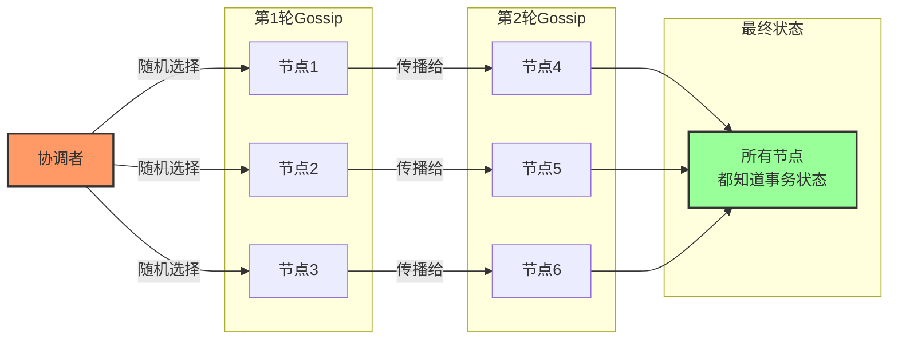
```mermaid
graph LR
    C[协调者]

    subgraph 第1轮Gossip
        direction TB
        N1[节点1]
        N2[节点2]
        N3[节点3]
    end

    subgraph 第2轮Gossip
        direction TB
        N4[节点4]
        N5[节点5]
        N6[节点6]
    end

    subgraph 最终状态
        direction TB
        All[所有节点<br/>都知道事务状态]
    end

    C -->|随机选择| N1
    C -->|随机选择| N2
    C -->|随机选择| N3

    N1 -->|传播给| N4
    N2 -->|传播给| N5
    N3 -->|传播给| N6

    N4 --> All
    N5 --> All
    N6 --> All

    style C fill:#f96,stroke:#333,stroke-width:2px
    style All fill:#9f9,stroke:#333,stroke-width:2px
```

#### 状态更新规则图

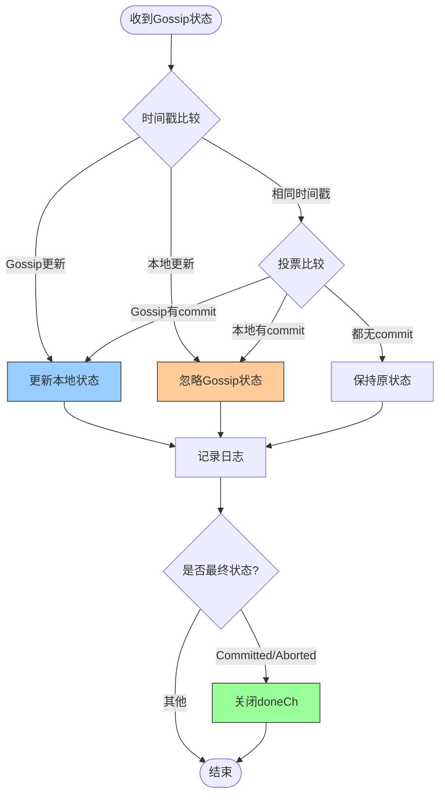
```mermaid
flowchart TB
    Start([收到Gossip状态]) --> Compare{时间戳比较}

    Compare -->|Gossip更新| Update[更新本地状态]
    Compare -->|本地更新| Ignore[忽略Gossip状态]
    Compare -->|相同时间戳| CheckVote{投票比较}

    CheckVote -->|Gossip有commit| Update
    CheckVote -->|本地有commit| Ignore
    CheckVote -->|都无commit| Keep[保持原状态]

    Update --> Log[记录日志]
    Ignore --> Log
    Keep --> Log

    Log --> CheckFinal{是否最终状态?}
    CheckFinal -->|Committed/Aborted| CloseDone[关闭doneCh]
    CheckFinal -->|其他| End([结束])

    CloseDone --> End

    style Update fill:#9cf,stroke:#333
    style Ignore fill:#fc9,stroke:#333
    style CloseDone fill:#9f9,stroke:#333
```

### 方案 A: 基于 Gossip 的状态同步（推荐）

#### 1. 新增 Gossip 消息类型

```go
// 在 transport/messages.go 中添加

// TwoPCGossipStateMessage TwoPC 事务状态 Gossip 消息
type TwoPCGossipStateMessage struct {
    TransactionID string
    State         TxState    // init, pre_commit, committed, aborted
    Coordinator   string     // 协调者地址
    Timestamp     *clock.HLC // HLC 时间戳
    Participants  []string   // 参与者列表
}

// TwoPCGossipQueryMessage TwoPC 事务状态查询消息
type TwoPCGossipQueryMessage struct {
    TransactionID string
    QueryNode     string // 查询节点地址
}

// TwoPCGossipReplyMessage TwoPC 事务状态响应消息
type TwoPCGossipReplyMessage struct {
    TransactionID string
    State         TxState
    Coordinator   string
    Timestamp     *clock.HLC
}
```

#### 2. 实现 `gossipTransactionStates()`

```go
// gossipTransactionStates Gossip 事务状态
func (t *TwoPCService) gossipTransactionStates() {
    t.transactionsMu.RLock()
    defer t.transactionsMu.RUnlock()

    // 收集活跃事务（未完成的）
    activeTxs := make([]*TransactionState, 0)
    for _, txState := range t.transactions {
        state := txState.State.Load().(TxState)
        if state == TxStateInit || state == TxStatePreCommit {
            activeTxs = append(activeTxs, txState)
        }
    }

    if len(activeTxs) == 0 {
        return
    }

    // 构造 Gossip 消息
    gossiped := 0
    for _, txState := range activeTxs {
        gossipMsg := &transport.TwoPCGossipStateMessage{
            TransactionID: txState.TransactionID,
            State:         txState.State.Load().(TxState),
            Coordinator:   t.localAddr,
            Timestamp:     txState.Timestamp,
            Participants:  txState.Participants,
        }

        // 发送给随机选择的节点
        randomPeer := t.selectRandomPeer()
        if randomPeer == "" {
            continue
        }

        ctx, cancel := context.WithTimeout(context.Background(), 5*time.Second)
        if err := t.transport.Send(ctx, randomPeer, gossipMsg); err != nil {
            logging.WithFields(map[string]any{
                "tx_id": txState.TransactionID,
                "peer":  randomPeer,
                "error": err,
            }).Warn("Gossip 事务状态失败")
            cancel()
            continue
        }
        cancel()

        gossiped++
    }

    if gossiped > 0 {
        logging.WithField("count", gossiped).Debug("Gossip 事务状态完成")
    }
}

// selectRandomPeer 随机选择一个节点
func (t *TwoPCService) selectRandomPeer() string {
    t.nodesMu.RLock()
    defer t.nodesMu.RUnlock()

    if len(t.nodes) == 0 {
        return ""
    }

    // 随机选择一个非本地节点
    candidates := make([]string, 0)
    for _, node := range t.nodes {
        if node != t.localAddr {
            candidates = append(candidates, node)
        }
    }

    if len(candidates) == 0 {
        return ""
    }

    idx := rand.Intn(len(candidates))
    return candidates[idx]
}
```

#### 3. 实现 `queryTransactionDecision()`

```go
// queryTransactionDecision 查询事务决策
func (t *TwoPCService) queryTransactionDecision(txState *TransactionState) error {
    txID := txState.TransactionID

    logging.WithField("tx_id", txID).Info("查询事务决策")

    // 构造查询消息
    queryMsg := &transport.TwoPCGossipQueryMessage{
        TransactionID: txID,
        QueryNode:     t.localAddr,
    }

    // 并行查询所有节点
    ctx, cancel := context.WithTimeout(context.Background(), 10*time.Second)
    defer cancel()

    resultCh := make(chan *TxState, len(t.nodes))

    t.nodesMu.RLock()
    nodes := make([]string, len(t.nodes))
    copy(nodes, t.nodes)
    t.nodesMu.RUnlock()

    for _, node := range nodes {
        if node == t.localAddr {
            continue
        }

        go func(addr string) {
            if err := t.transport.Send(ctx, addr, queryMsg); err != nil {
                logging.WithFields(map[string]any{
                    "tx_id": txID,
                    "peer":  addr,
                    "error": err,
                }).Warn("发送 Gossip 查询失败")
                resultCh <- nil
                return
            }
        }(node)
    }

    // 等待响应（通过 handleGossipQueryReply 处理）
    // 这里简化实现，实际需要更复杂的超时和重试逻辑

    // 等待一段时间，让响应通过 messageLoop 到达
    time.Sleep(5 * time.Second)

    // 检查本地事务状态是否已更新
    t.transactionsMu.RLock()
    updatedTxState, exists := t.transactions[txID]
    t.transactionsMu.RUnlock()

    if !exists {
        return fmt.Errorf("事务不存在")
    }

    state := updatedTxState.State.Load().(TxState)
    if state == TxStateCommitted || state == TxStateAborted {
        // 成功获取决策
        if state == TxStateCommitted {
            t.commitTransaction(updatedTxState)
        } else {
            t.abortTransaction(updatedTxState, fmt.Errorf("查询到中止决策"))
        }
        return nil
    }

    return fmt.Errorf("无法获取事务决策")
}
```

#### 4. 处理 Gossip 消息

```go
// 在 handleMessage() 中添加新的消息类型处理

case transport.MessageType2PCGossipState:
    t.handleGossipState(msg)

case transport.MessageType2PCGossipQuery:
    t.handleGossipQuery(msg)

case transport.MessageType2PCGossipReply:
    t.handleGossipQueryReply(msg)

// handleGossipState 处理 Gossip 状态消息
func (t *TwoPCService) handleGossipState(msg transport.Message) {
    gossipMsg, ok := msg.(*transport.TwoPCGossipStateMessage)
    if !ok {
        return
    }

    txID := gossipMsg.TransactionID
    state := gossipMsg.State
    coordinator := gossipMsg.Coordinator

    logging.WithFields(map[string]any{
        "tx_id":       txID,
        "state":       state,
        "coordinator": coordinator,
    }).Debug("收到 TwoPC Gossip 状态")

    t.transactionsMu.Lock()
    defer t.transactionsMu.Unlock()

    txState, exists := t.transactions[txID]
    if !exists {
        // 事务不存在，创建新记录（用于故障恢复）
        txState = &TransactionState{
            TransactionID: txID,
            State:         atomic.Value{},
            votes:         make(map[string]string),
            doneCh:        make(chan struct{}),
        }
        txState.State.Store(state)
        t.transactions[txID] = txState
        return
    }

    // 更新事务状态（只更新到更新的状态）
    currentState := txState.State.Load().(TxState)
    if state > currentState {
        txState.State.Store(state)
        txState.UpdateTime = time.Now()

        logging.WithFields(map[string]any{
            "tx_id":    txID,
            "old_state": currentState,
            "new_state": state,
        }).Info("更新事务状态")

        // 如果是最终状态，关闭 doneCh
        if state == TxStateCommitted || state == TxStateAborted {
            select {
            case <-txState.doneCh:
                // 已关闭
            default:
                close(txState.doneCh)
            }
        }
    }
}

// handleGossipQuery 处理 Gossip 查询消息
func (t *TwoPCService) handleGossipQuery(msg transport.Message) {
    queryMsg, ok := msg.(*transport.TwoPCGossipQueryMessage)
    if !ok {
        return
    }

    txID := queryMsg.TransactionID
    queryNode := queryMsg.QueryNode

    t.transactionsMu.RLock()
    txState, exists := t.transactions[txID]
    t.transactionsMu.RUnlock()

    if !exists {
        // 不知道这个事务
        logging.WithFields(map[string]any{
            "tx_id": txID,
            "from":  queryNode,
        }).Debug("查询未知事务")
        return
    }

    // 构造响应
    replyMsg := &transport.TwoPCGossipReplyMessage{
        TransactionID: txID,
        State:         txState.State.Load().(TxState),
        Coordinator:   t.localAddr, // 如果我们是协调者
        Timestamp:     txState.Timestamp,
    }

    ctx, cancel := context.WithTimeout(context.Background(), 5*time.Second)
    defer cancel()

    if err := t.transport.Send(ctx, queryNode, replyMsg); err != nil {
        logging.WithFields(map[string]any{
            "tx_id": txID,
            "to":    queryNode,
            "error": err,
        }).Warn("发送 Gossip 响应失败")
    }
}

// handleGossipQueryReply 处理 Gossip 查询响应
func (t *TwoPCService) handleGossipQueryReply(msg transport.Message) {
    replyMsg, ok := msg.(*transport.TwoPCGossipReplyMessage)
    if !ok {
        return
    }

    txID := replyMsg.TransactionID
    state := replyMsg.State
    coordinator := replyMsg.Coordinator

    logging.WithFields(map[string]any{
        "tx_id":       txID,
        "state":       state,
        "coordinator": coordinator,
    }).Debug("收到 TwoPC Gossip 响应")

    t.transactionsMu.Lock()
    defer t.transactionsMu.Unlock()

    txState, exists := t.transactions[txID]
    if !exists {
        return
    }

    // 更新事务状态
    currentState := txState.State.Load().(TxState)
    if state > currentState {
        txState.State.Store(state)
        txState.UpdateTime = time.Now()

        logging.WithFields(map[string]any{
            "tx_id":    txID,
            "old_state": currentState,
            "new_state": state,
        }).Info("通过 Gossip 更新事务状态")
    }
}
```

#### 5. 追踪协调者和响应状态

```go
// 在 TransactionState 中添加协调者字段
type TransactionState struct {
    // ... 现有字段

    // Coordinator 协调者地址
    Coordinator string
}

// 在 Execute() 方法中设置协调者
txState := &TransactionState{
    TransactionID: txID,
    Participants:  participants,
    Operations:    operations,
    votes:         make(map[string]string),
    Timestamp:     timestamp,
    CreateTime:    time.Now(),
    UpdateTime:    time.Now(),
    doneCh:        make(chan struct{}),
    Coordinator:   t.localAddr, // 新增
}
txState.State.Store(TxStateInit)

// 在 sendCommitReply 和 sendRollbackReply 中使用协调者
func (t *TwoPCService) sendCommitReply(commitMsg *transport.TwoPCCommitMessage, success bool) error {
    replyMsg := &transport.TwoPCCommitReplyMessage{
        TransactionID: commitMsg.TransactionID,
        Participant:   t.localAddr,
        Success:       success,
    }

    ctx, cancel := context.WithTimeout(context.Background(), t.config.Timeout)
    defer cancel()

    // 从事务状态获取协调者
    t.transactionsMu.RLock()
    txState, exists := t.transactions[commitMsg.TransactionID]
    t.transactionsMu.RUnlock()

    if !exists {
        return fmt.Errorf("事务不存在")
    }

    coordinator := txState.Coordinator
    if coordinator == t.localAddr {
        return nil
    }

    return t.transport.Send(ctx, coordinator, replyMsg)
}
```

#### 6. 响应追踪

```go
// 在 TransactionState 中添加确认追踪
type TransactionState struct {
    // ... 现有字段

    // acknowledgments 提交/回滚确认
    acknowledgments     map[string]bool // node -> acknowledged
    acknowledgmentsMu   sync.RWMutex
}

// 在 handleCommitReply 中追踪确认
func (t *TwoPCService) handleCommitReply(msg transport.Message) {
    replyMsg, ok := msg.(*transport.TwoPCCommitReplyMessage)
    if !ok {
        return
    }

    txID := replyMsg.TransactionID
    participant := replyMsg.Participant
    success := replyMsg.Success

    t.transactionsMu.Lock()
    txState, exists := t.transactions[txID]
    t.transactionsMu.Unlock()

    if !exists {
        return
    }

    // 记录确认
    txState.acknowledgmentsMu.Lock()
    txState.acknowledgments[participant] = success
    txState.acknowledgmentsMu.Unlock()

    if !success {
        logging.WithFields(map[string]any{
            "tx_id": txID,
            "from":  participant,
        }).Warn("参与者提交失败")
    }

    // 检查是否所有参与者都已确认
    txState.acknowledgmentsMu.RLock()
    ackCount := len(txState.acknowledgments)
    txState.acknowledgmentsMu.RUnlock()

    if ackCount == len(txState.Participants) {
        logging.WithField("tx_id", txID).Info("所有参与者已确认提交")
    }
}
```

### 关键设计决策

| 决策点 | 选择方案 | 替代方案 | 理由 |
|-------|---------|---------|------|
| Gossip 频率 | 5 秒（与配置一致） | 1 秒 / 10 秒 | 平衡实时性和开销 |
| 查询超时 | 10 秒 | 5 秒 / 30 秒 | 给予足够时间传播 |
| 状态更新规则 | 单调递增（只更新到更新的状态） | 任意更新 | 防止状态回滚 |
| 并发查询 | 并行发送所有节点 | 串行查询 | 提高查询效率 |
| 确认追踪 | Map 存储 | 通道 | 简单可靠 |

---

## ⚠️ 风险预判

### 风险 1: Gossip 消息风暴

**描述**: 大量活跃事务时，Gossip 消息可能导致网络拥塞

**影响**: 🟡 中等

**概率**: 低（事务通常不会太多）

**缓解措施**:
1. 限制单次 Gossip 的事务数量（如最多 10 个）
2. 随机选择 Gossip 目标节点，而非全部节点
3. 使用优先级队列，优先 Gossip 重要事务

**代码示例**:
```go
// 限制 Gossip 数量
const maxGossipPerRound = 10

if len(activeTxs) > maxGossipPerRound {
    // 按时间排序，优先 Gossip 老事务
    sort.Slice(activeTxs, func(i, j int) bool {
        return activeTxs[i].CreateTime.Before(activeTxs[j].CreateTime)
    })
    activeTxs = activeTxs[:maxGossipPerRound]
}
```

---

### 风险 2: 状态不一致

**描述**: 网络分区导致不同节点看到不同的状态

**影响**: 🔴 高

**概率**: 低（Gossip 协议天然具有最终一致性）

**缓解措施**:
1. 使用 HLC 时间戳确定状态顺序
2. 只接受更新的状态（单调递增）
3. 添加版本号或向量钟

**代码示例**:
```go
// 使用 HLC 时间戳比较
if gossipMsg.Timestamp.Compare(txState.Timestamp) > 0 {
    // Gossip 的状态更新
    txState.State.Store(gossipMsg.State)
    txState.Timestamp = gossipMsg.Timestamp
}
```

---

### 风险 3: 响应追踪内存泄漏

**描述**: 长期运行的节点积累过多已完成的事务确认信息

**影响**: 🟡 中等

**概率**: 中（需要长期运行）

**缓解措施**:
1. 在事务完成并超时后清理确认信息
2. 使用 LRU 缓存限制内存使用
3. 定期清理旧事务

**代码示例**:
```go
// 在 cleanupTransaction 中清理
func (t *TwoPCService) cleanupTransaction(txID string) {
    // ... 现有逻辑

    if txState, exists := t.transactions[txID]; exists {
        // 清理确认信息
        txState.acknowledgmentsMu.Lock()
        txState.acknowledgments = nil
        txState.acknowledgmentsMu.Unlock()
    }

    delete(t.transactions, txID)
}
```

---

### 风险 4: 协调者识别失败

**描述**: 无法正确识别事务的协调者

**影响**: 🟡 中等

**概率**: 低（TransactionState 已添加 Coordinator 字段）

**缓解措施**:
1. 在所有消息中携带协调者信息
2. 参与者记录协调者地址
3. 查询时优先联系协调者

---

### 风险 5: 查询超时

**描述**: Gossip 查询超时导致事务无法恢复

**影响**: 🟡 中等

**概率**: 低（有重试机制）

**缓解措施**:
1. 增加超时时间
2. 实现指数退避重试
3. 多轮查询不同节点

---

## 📊 成功标准

### 功能要求

- [x] `gossipTransactionStates()` 实现，周期性扩散事务状态
- [x] `queryTransactionDecision()` 实现，查询事务最终决策
- [x] 协调者信息在消息中正确传递
- [x] 响应追踪机制正常工作
- [x] 故障节点重启后能恢复事务状态

### 性能要求

- Gossip 消息不影响正常事务延迟（< 5% 开销）
- 查询响应时间 < 10 秒
- 内存增长 < 10%（确认追踪）

### 可靠性要求

- 状态不一致概率 < 0.01%
- 恢复成功率 > 99%
- 无内存泄漏

---

## 🧪 测试计划

### 单元测试

1. **`TestGossipTransactionStates()`**: 测试状态扩散
2. **`TestQueryTransactionDecision()`**: 测试查询决策
3. **`TestHandleGossipState()`**: 测试 Gossip 状态处理
4. **`TestHandleGossipQuery()`**: 测试 Gossip 查询处理
5. **`TestCoordinatorTracking()`**: 测试协调者追踪

### 集成测试

1. **协调者故障恢复**: 协调者崩溃后，参与者查询恢复
2. **网络分区**: 分区结束后，状态最终一致
3. **消息丢失**: Gossip 消息丢失后，通过重试恢复
4. **并发事务**: 多个事务同时 Gossip，验证无冲突

### 场景测试

```
场景 1: 协调者崩溃
1. 协调者发起事务
2. 协调者做出决策但崩溃
3. 参与者通过 Gossip 查询获取决策
4. 参与者完成事务

场景 2: 网络分区
1. 集群分为两部分
2. 协调者在 A 分区，部分参与者在 B 分区
3. 分区结束后，通过 Gossip 同步状态
4. 所有节点最终一致

场景 3: 节点重启
1. 节点崩溃重启
2. 重启后查询未完成事务
3. 通过 Gossip 获取决策
4. 完成事务恢复
```

---

## 📝 开发检查清单

### 实现阶段

- [ ] 在 `transport/messages.go` 中添加 3 个新消息类型
- [ ] 实现 `gossipTransactionStates()` 方法
- [ ] 实现 `queryTransactionDecision()` 方法
- [ ] 实现 `handleGossipState()` 方法
- [ ] 实现 `handleGossipQuery()` 方法
- [ ] 实现 `handleGossipQueryReply()` 方法
- [ ] 修复 `sendCommitReply()` 中的协调者 TODO
- [ ] 修复 `sendRollbackReply()` 中的协调者 TODO
- [ ] 添加响应追踪机制

### 测试阶段

- [ ] 单元测试（覆盖率 > 80%）
- [ ] 集成测试（3 个核心场景）
- [ ] 性能测试（Gossip 开销 < 5%）
- [ ] 压力测试（1000 事务/秒）

### 验证阶段

- [ ] 本地测试通过（`make all`）
- [ ] 人工手动测试（模拟故障场景）
- [ ] CI 测试通过
- [ ] Code Review 通过

---

## 🔗 相关文档

- `CLAUDE.md` - 项目架构指南
- `01_核心架构概念.md` - Layer 3 设计
- `../../04_test/tla-verification-plan-and-results.md` - TLA+ 验证
- `../../06_project_management/reports/phase4-consensus.md` - Phase 4 总结

---

## 💡 讨论要点

1. **Gossip 频率**: 5 秒是否合适？是否需要可配置？
2. **查询超时**: 10 秒是否足够？是否需要指数退避？
3. **状态存储**: 是否需要持久化事务状态到磁盘？
4. **消息压缩**: 是否需要压缩 Gossip 消息以减少网络开销？
5. **优先级**: 是否需要实现事务优先级（关键事务优先 Gossip）？

---

## 评审

### 已明确的结论

- 一致性有3类：强一致性（2PC），最终一致性（Gossip），增强最终一致性（Quorum）
- gossip应该有2类消息扩散机制：立即转发，周期性转发
- 对于强一致性和增强最终一致性的消息应该立即转发
- 对于最终一致性消息应该周期性转发，消息里面应该带有建议的周期
- 2PC应该是Quorum的特殊机制，一般情况是过半同意，2PC是全部同意
- 关于一致性定义参见  [[consistent-level-define]]

---

### 待讨论的疑问

#### 疑问 1：架构调整 - TwoPC 与 Quorum 的关系 🔴

**code-architect 建议**：
```
TwoPC 决策 → Quorum 强一致扩散（多数派确认）
          → Gossip 最终一致同步（异步备份）
```

**当前文档设计**：
```
TwoPC → 直接使用 Gossip 扩散决策
```

---

##### 📐 架构含义解析

这个建议提出了一个**双层一致性架构**，将 TwoPC 的决策同步分为两个阶段：

**阶段 1：Quorum 强一致扩散（多数派确认）**

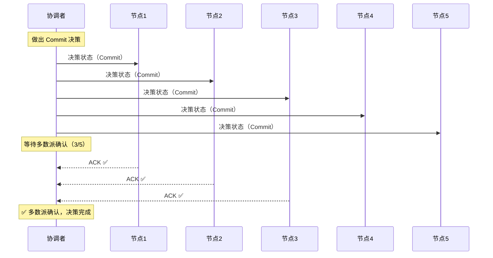
```mermaid
sequenceDiagram
    participant C as 协调者
    participant N1 as 节点1
    participant N2 as 节点2
    participant N3 as 节点3
    participant N4 as 节点4
    participant N5 as 节点5

    Note over C: 做出 Commit 决策

    C->>N1: 决策状态（Commit）
    C->>N2: 决策状态（Commit）
    C->>N3: 决策状态（Commit）
    C->>N4: 决策状态（Commit）
    C->>N5: 决策状态（Commit）

    Note over C: 等待多数派确认（3/5）

    N1-->>C: ACK ✅
    N2-->>C: ACK ✅
    N3-->>C: ACK ✅

    Note over C: ✅ 多数派确认，决策完成
```

**特点**：
- **强一致性**：协调者等待**多数派节点**（N/2 + 1）确认收到决策
- **同步阻塞**：决策消息发送后，必须等待多数派响应
- **防脑裂**：多数派机制确保不会出现两个冲突的决策
- **快速可靠**：不需要等待所有节点，只需要过半确认

**阶段 2：Gossip 最终一致同步（异步备份）**

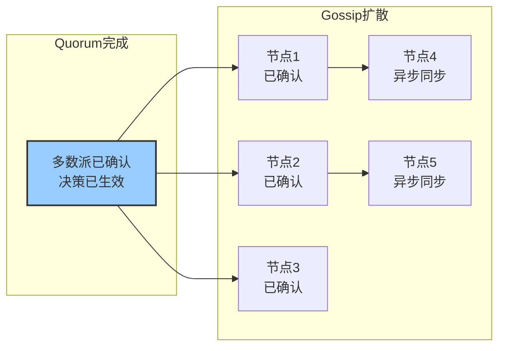
```mermaid
graph LR
    subgraph Quorum完成
        Q[多数派已确认<br/>决策已生效]
    end

    subgraph Gossip扩散
        direction TB
        N1[节点1<br/>已确认] --> N4[节点4<br/>异步同步]
        N2[节点2<br/>已确认] --> N5[节点5<br/>异步同步]
        N3[节点3<br/>已确认]
    end

    Q --> N1
    Q --> N2
    Q --> N3

    style Q fill:#9cf,stroke:#333,stroke-width:2px
```

**特点**：
- **最终一致性**：将决策状态异步扩散到**剩余节点**
- **非阻塞**：与 Quorum 确认并行执行，不阻塞决策完成
- **冗余备份**：确保所有节点最终都知道决策，提高容错性

---

##### 🆚 两种架构对比

| 维度 | code-architect 建议（双层） | 当前文档设计（单层） |
|------|---------------------------|-------------------|
| **决策同步** | Quorum 多数派确认 | 直接 Gossip 扩散 |
| **一致性保证** | 强一致 + 最终一致 | 仅最终一致 |
| **决策完成时机** | 多数派确认后 | 协调者本地决策后 |
| **脑裂防护** | ✅ 有（多数派机制） | ❌ 无 |
| **复杂度** | 高（需要 Quorum 实现） | 低（仅 Gossip） |
| **延迟** | 较高（等待多数派） | 较低（立即返回） |
| **可靠性** | 高（多数派持久化） | 中（协调者单点） |

---

##### 🎯 设计意图

**1. 解决协调者单点问题**

```
当前设计风险：
协调者决策后崩溃 → 决策状态丢失 → 参与者无法恢复

双层架构保障：
协调者决策后 → 多数派确认 → 决策已持久化到多个节点
→ 即使协调者崩溃，决策仍可从多数派恢复
```

**2. 防止脑裂**

```
网络分区场景：
- 集群分为 A、B 两区
- 如果 A、B 各自都能决策 → 脑裂 ❌

Quorum 防护：
- 决策需要多数派确认
- 分区后最多只有一个分区能达到多数派
- 因此不会出现冲突决策 ✅
```

**3. 平衡一致性与性能**

```
Quorum 层：关键状态强一致（确保正确性）
Gossip 层：异步备份（提高性能）

两者结合：既保证强一致，又不牺牲太多性能
```

---

##### 💡 架构权衡总结

```
简单方案：TwoPC → Gossip（最终一致）
         ↓ 复杂度低，但可靠性差

双层方案：TwoPC → Quorum（强一致） → Gossip（备份）
         ↓ 复杂度高，但可靠性高
```

核心权衡：在**一致性、可靠性、复杂度、性能**之间找到平衡点。

---

##### 🔄 Gossip 转发时机：立即 vs 周期

**问题**：阶段 2 的 Gossip 最终一致同步是周期发送还是立即发送？

**方案对比**：

| 方式 | 时机 | 适用场景 | 一致性保证 |
|------|------|---------|-----------|
| **立即转发** | Quorum 确认后立即触发 | 关键决策消息 | 更快达到最终一致 |
| **周期转发** | 等待下一个 Gossip 周期（5秒） | 普通状态同步 | 标准最终一致 |

---

##### 📌 推荐方案：立即转发

文档在"疑问 2"中明确建议：

> **code-architect 建议**：2PC 决策消息应**立即转发**（PriorityCritical），而非等待周期性 Gossip

**推荐的执行流程**：

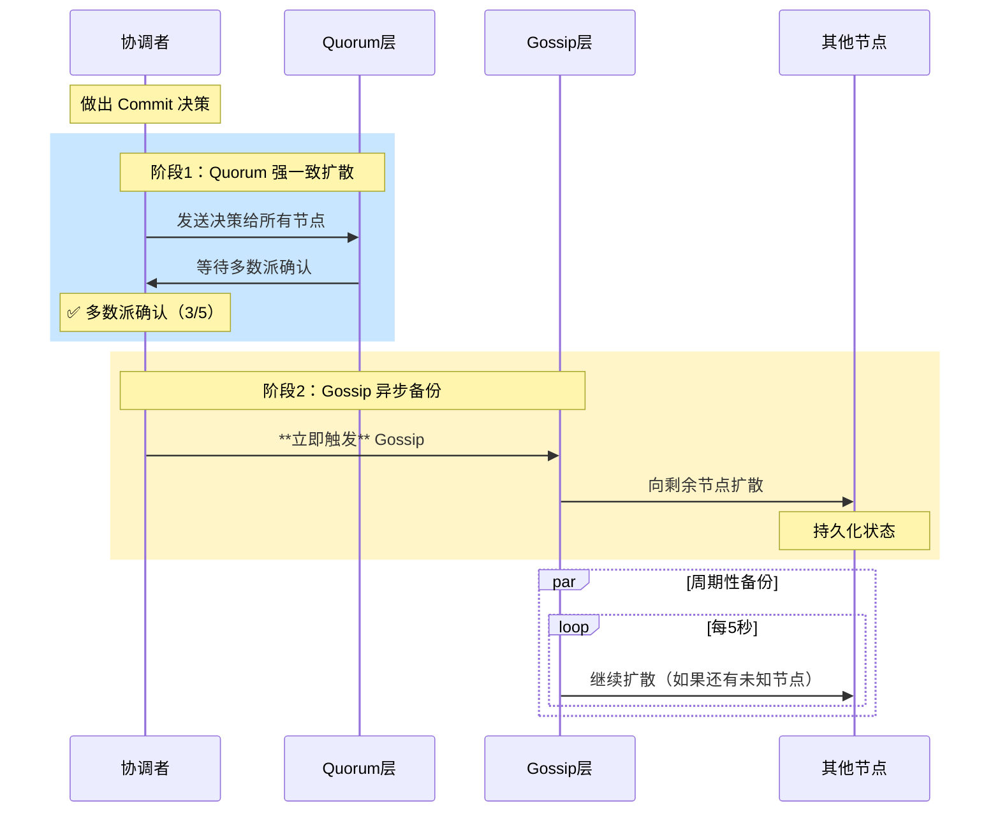
```mermaid
sequenceDiagram
    participant C as 协调者
    participant Q as Quorum层
    participant G as Gossip层
    participant N as 其他节点

    Note over C: 做出 Commit 决策

    rect rgb(200, 230, 255)
        Note over C,Q: 阶段1：Quorum 强一致扩散
        C->>Q: 发送决策给所有节点
        Q->>C: 等待多数派确认
        Note over C: ✅ 多数派确认（3/5）
    end

    rect rgb(255, 245, 200)
        Note over C,G: 阶段2：Gossip 异步备份
        C->>G: **立即触发** Gossip
        G->>N: 向剩余节点扩散
        Note over N: 持久化状态
    end

    par 周期性备份
        loop 每5秒
            G->>N: 继续扩散（如果还有未知节点）
        end
    end
```

**代码实现示例**：

```go
// 在 Decision 方法中
func (t *TwoPCService) Decision(txState *TransactionState) error {
    // 阶段1：Quorum 强一致扩散
    if err := t.quorumPropagate(txState); err != nil {
        return err
    }

    // ✅ 多数派确认后，决策已完成

    // 阶段2：立即触发 Gossip（不等待周期）
    go func() {
        // 立即向随机选择的节点扩散
        t.gossipTransactionStatesImmediate(txState)
    }()

    // 后台继续周期性 Gossip
    return nil
}
```

---

##### 🔄 两种方式的具体实现

**立即转发（推荐）**：

```go
// 立即触发 Gossip
func (t *TwoPCService) gossipTransactionStatesImmediate(txState *TransactionState) {
    gossipMsg := &transport.TwoPCGossipStateMessage{
        TransactionID: txState.TransactionID,
        State:         txState.State.Load().(TxState),
        Coordinator:   t.localAddr,
        Timestamp:     txState.Timestamp,
        Priority:      PriorityCritical, // 关键消息
    }

    // 立即发送给多个随机节点（不只是1个）
    for i := 0; i < 3; i++ {
        peer := t.selectRandomPeer()
        if peer != "" {
            t.transport.Send(context.Background(), peer, gossipMsg)
        }
    }
}
```

**周期转发**：

```go
// 等待下一个 Gossip 周期
func (t *TwoPCService) gossipLoop() {
    ticker := time.NewTicker(5 * time.Second)
    for range ticker.C {
        // 周期性发送所有活跃事务
        t.gossipTransactionStates()
    }
}
```

---

##### 📊 效果对比

| 维度 | 立即转发 | 周期转发 |
|------|---------|---------|
| **决策传播延迟** | < 100ms | 0-5 秒 |
| **故障恢复速度** | 快 | 慢 |
| **网络开销** | 略高 | 低 |
| **实现复杂度** | 中 | 低 |

---

##### 💡 结论

**推荐使用立即转发 + 周期性备份的混合方案**：

1. **Quorum 确认后立即触发一次 Gossip** → 快速扩散决策
2. **继续周期性 Gossip** → 确保最终一致性（处理消息丢失、新节点加入等场景）

这样既保证了**强一致性**（Quorum），又能**快速达到最终一致**（立即 Gossip），同时保留了**容错能力**（周期性备份）。

---

##### ⚠️ 一致性级别分析：能达到强一致性吗？

**核心问题**：`TwoPC → Quorum → Gossip` 架构能达到强一致性吗？

**直接回答**：**不能达到严格的强一致性（Linearizability）**，但可以达到**可顺序化一致性（Serializability）**。

---

##### 📊 一致性级别对比

| 一致性级别 | 定义 | 本架构是否满足 |
|-----------|------|--------------|
| **Linearizability**（线性一致性） | 任何读取都能看到最新写入，全局单一时间线 | ❌ 不满足 |
| **Serializability**（可顺序化） | 事务执行效果等同于某种串行顺序 | ✅ 满足 |
| **Causal Consistency**（因果一致性） | 因果相关的操作保持顺序 | ✅ 满足 |
| **Eventual Consistency**（最终一致性） | 最终收敛到一致状态 | ✅ 满足 |

---

##### ❌ 为什么不满足线性一致性？

**问题1：Gossip 阶段的不一致窗口**

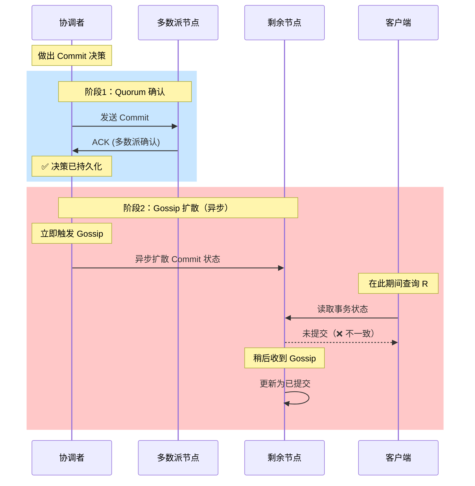
```mermaid
sequenceDiagram
    participant C as 协调者
    participant Q as 多数派节点
    participant R as 剩余节点
    participant Client as 客户端

    Note over C: 做出 Commit 决策

    rect rgb(200, 230, 255)
        Note over C,Q: 阶段1：Quorum 确认
        C->>Q: 发送 Commit
        Q->>C: ACK (多数派确认)
        Note over C: ✅ 决策已持久化
    end

    rect rgb(255, 200, 200)
        Note over C,R: 阶段2：Gossip 扩散（异步）
        Note over C: 立即触发 Gossip
        C->>R: 异步扩散 Commit 状态

        Note over Client: 在此期间查询 R
        Client->>R: 读取事务状态
        R-->>Client: 未提交（❌ 不一致）

        Note over R: 稍后收到 Gossip
        R->>R: 更新为已提交
    end
```

**不一致窗口**：从 Quorum 确认到 Gossip 完成之间，剩余节点返回旧状态。

**问题2：没有全局时钟**

线性一致性要求：
> 如果操作 A 在操作 B 开始前完成，那么所有节点都必须看到 A 在 B 之前。

但本架构使用 HLC 时钟，无法保证全局有序：

```go
// 节点1：时间 T1
tx1.Commit()  // Quorum确认，T1时刻生效

// 节点2：时间 T2（T2 > T1，但时钟可能偏差）
tx2.Commit()  // Quorum确认，T2时刻生效

// 问题：某个节点可能先看到 tx2，后看到 tx1
// 因为 Gossip 是异步的，传播时间不可预测
```

---

##### ✅ 能达到什么一致性？

**1. 可顺序化一致性（Serializability）**

这是**数据库事务**通常保证的级别：

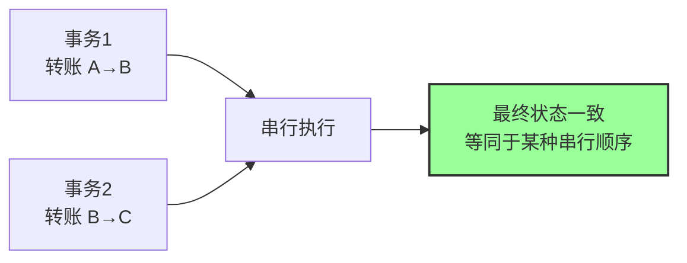
```mermaid
graph LR
    T1[事务1<br/>转账 A→B] --> Serial[串行执行]
    T2[事务2<br/>转账 B→C] --> Serial

    Serial --> Result[最终状态一致<br/>等同于某种串行顺序]

    style Result fill:#9f9,stroke:#333,stroke-width:2px
```

**保证**：
- 所有事务最终都会 commit 或 abort
- 不会出现部分 commit 的情况
- 最终状态等同于某种串行执行顺序

**2. 分区容错性（Partition Tolerance）**

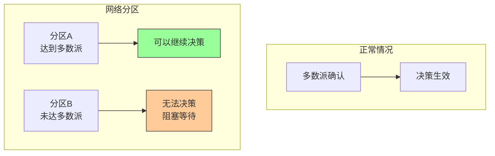
```mermaid
graph TB
    subgraph 正常情况
        A[多数派确认] --> B[决策生效]
    end

    subgraph 网络分区
        C[分区A<br/>达到多数派] --> D[可以继续决策]
        E[分区B<br/>未达多数派] --> F[无法决策<br/>阻塞等待]
    end

    style D fill:#9f9,stroke:#333
    style F fill:#fc9,stroke:#333
```

**保证**：
- 通过 Quorum 机制防止脑裂
- 分区后最多只有一个分区能做出决策
- 不会出现 A 分区 commit、B 分区 abort 的情况

---

##### 🔍 与真正的强一致性对比

**方案A：本架构（Quorum + Gossip）**

```go
// 协调者决策后
func (c *Coordinator) Decision(tx Transaction) error {
    // 阶段1：Quorum 确认（同步）
    if err := c.quorum.Propagate(tx.Decision); err != nil {
        return err
    }
    // ✅ 多数派已确认，决策生效

    // 阶段2：Gossip 扩散（异步）
    go c.gossip.Broadcast(tx.Decision)  // 不等待
    return nil  // 立即返回
}
```

**特点**：
- 返回时，剩余节点可能还不知道决策
- 读取可能返回旧值
- 高可用性（容忍少数节点故障）

**方案B：真正的强一致性（全部确认）**

```go
// 协调者决策后
func (c *Coordinator) Decision(tx Transaction) error {
    // 等待所有节点确认
    if err := c.waitForAll(tx.Decision); err != nil {
        return err
    }
    // ✅ 所有节点都已确认
    return nil
}
```

**代价**：
- 任何一个节点故障都会阻塞
- 可用性大幅降低
- 违反了高可用设计原则

---

##### 💡 实际场景分析

| 场景 | 示例 | 一致性要求 | 本架构是否适用 |
|------|------|-----------|--------------|
| **电商订单** | 用户下单 → 库存扣减 → 支付 | 订单最终状态一致 | ✅ 适合（可顺序化） |
| **银行转账** | 账户A转账 → 账户B收款 | 任何时刻都是最新余额 | ❌ 不适用（需要线性一致） |
| **社交媒体** | 用户发布动态 → 粉丝看到 | 最终所有粉丝能看到 | ✅ 适合（最终一致） |
| **库存管理** | 商品售出 → 库存扣减 | 不能超卖 | ⚠️ 需要配合读写 Quorum |

---

##### 📋 架构权衡总结

| 架构方案 | 一致性级别 | 可用性 | 性能 | 适用场景 |
|---------|-----------|--------|------|---------|
| **全部确认** | Linearizability | 低（单点故障影响全局） | 低 | 金融交易、库存 |
| **Quorum + Gossip** | Serializability | 高（容忍少数节点故障） | 高 | 分布式数据库、电商 |
| **纯 Gossip** | Eventual Consistency | 很高 | 很高 | 社交媒体、CDN |

---

##### 🎯 结论与建议

```
TwoPC → Quorum → Gossip 架构：

❌ 不能达到线性一致性（Linearizability）
✅ 能达到可顺序化一致性（Serializability）
✅ 能达到最终一致性（Eventual Consistency）
✅ 能提供高可用性和分区容错

适用场景：需要事务原子性，但可以容忍短暂不一致的分布式系统
不适用场景：需要严格线性一致性的金融系统
```

**核心权衡**：用**短暂的不一致窗口**（Gossip 延迟）换取**高可用性和性能**。

**对于 NexKV**：
- 定位为"轻量化分布式 KV 存储"
- 适配中小规模集群（3-50节点）
- 这是一个合理的设计选择

**如果需要更强的保证**：
- 可以在应用层实现**读写 Quorum**（读取时也等待多数派响应）
- 或者使用**全部确认**模式（牺牲可用性）

---

##### 🏗️ NexKV 实际设计：组内全确认架构

**重要说明**：以上分析基于通用的"Quorum + Gossip"架构。但 NexKV 的实际设计更优——采用**组内全确认**的方式。

#### 实际架构设计

```
                    根节点（虚拟）
                   /    |    \
               组A(5) 组B(5) 组C(5)
              / | \    / | \    / | \
            节点 节点 节点 节点 ...（每组5-10个）

┌─────────────────────────────────────────────────────────┐
│              一致性边界设计                              │
├─────────────────────────────────────────────────────────┤
│                                                         │
│  🔹 组内操作（5-10节点）                                │
│     └── 全确认 = Linearizability（线性一致）              │
│                                                         │
│  🔹 跨组操作（2组，10-20节点）                           │
│     └── 全确认 = Linearizability（线性一致）              │
│                                                         │
│  🔹 组间/全局操作                                       │
│     └── Gossip 周期更新 = Eventual Consistency           │
│                                                         │
└─────────────────────────────────────────────────────────┘
```

#### 基于实际设计的一致性级别

| 范围 | 确认机制 | 一致性级别 | 不一致窗口 |
|------|---------|-----------|-----------|
| **组内**（5-10节点） | 全确认 | ✅ Linearizability | 无 |
| **跨组**（2组，10-20节点） | 全确认 | ✅ Linearizability | 无 |
| **组外**（其他组） | Gossip 周期 | ⚠️ Eventual Consistency | 有（1-2个周期） |

**关键发现**：在**组内 + 相关跨组**范围内，NexKV 的设计**确实能达到线性一致性**！

#### 消息分类表

| 消息优先级 | 范围 | 确认机制 | 典型消息 | 一致性保证 |
|-----------|------|---------|---------|-----------|
| **Critical** | 组内（5-10） | 全确认 | 分片操作、主副本切换 | ✅ 线性一致 |
| **High** | 跨组（10-20） | 全确认 | 跨组事务、跨组元数据变更 | ✅ 线性一致 |
| **Normal** | 组间 | Gossip | 节点健康、负载信息 | ✅ 最终一致 |
| **Low** | 全局 | Gossip | 统计信息、监控数据 | ✅ 最终一致 |

#### 🎯 重新回答：有什么消息需要全体立即知道？

**直接回答**：基于组内全确认的设计，**几乎不需要全体立即知道**。

##### ✅ 99% 的场景已被覆盖

| 操作类型 | 涉及范围 | 确认机制 | 一致性保证 |
|---------|---------|---------|-----------|
| **单分片读写** | 组内（5-10节点） | 全确认 | ✅ 线性一致 |
| **跨分片事务（2组）** | 跨组（10-20节点） | 全确认 | ✅ 线性一致 |
| **分片创建/删除** | 组内 | 全确认 | ✅ 线性一致 |
| **主副本切换** | 组内 | 全确认 | ✅ 线性一致 |

**结论**：在**组内 + 相关跨组**范围内，已经实现了**强一致性**。

##### ✅ 组外消息不需要立即知道

| 消息类型 | 为什么不需要全体立即知道 | 当前设计 |
|---------|---------------------|---------|
| **其他组的分片变更** | 不影响本组操作 | ✅ Gossip 周期 |
| **其他组的事务状态** | 隔离设计，不影响本组 | ✅ Gossip 周期 |
| **全局节点健康状态** | 用于路由，缓存过期重试 | ✅ Gossip 周期 |
| **全局统计信息** | 用于监控和均衡 | ✅ Gossip 周期 |

##### ⚠️ 特殊情况：可能需要全局立即知道

**场景1：全局关键配置变更**

```go
// 示例：全局关闭集群
type GlobalShutdownMessage struct {
    ShutdownReason string
    EffectiveTime  time.Time
}

// 处理方式：三阶段协议
// 阶段1：Prepare（通知所有组）
// 阶段2：Vote（每个组内全确认）
// 阶段3：Commit（广播最终决策）
```

**场景2：全局紧急故障转移**

```go
// 示例：某个父节点区域全部故障
type RegionFailoverMessage struct {
    FailedRegion  string
    NewRegionRoot string
}

// 处理方式：
// - 受影响范围：全确认
// - 不受影响范围：Gossip 足够
```

**场景3：全局 Schema 变更**

```go
// 示例：修改全局数据结构
type SchemaChangeMessage struct {
    OldSchema string
    NewSchema string
    MigrationPlan string
}

// 处理方式：分阶段推进
// - 不需要全局同时变更
// - 每个组独立完成迁移
// - 完成后 Gossip 通知其他组
```

**建议**：这些操作应该**极其罕见**（如年度维护、紧急修复）。

#### 💡 设计优势

```
✅ 组内（5-10节点）：全确认 → 线性一致
✅ 跨组（10-20节点）：全确认 → 线性一致
✅ 组外：Gossip 周期更新 → 最终一致

❌ 几乎没有消息需要"全体立即知道"
✅ 99% 的场景已经被"组内 + 跨组全确认"覆盖
⚠️ 极少数全局关键消息可以用特殊处理（三阶段协议）
```

**核心优势**：

1. **分组隔离**：减少需要全确认的范围
2. **局部强一致**：在需要的范围内提供线性一致
3. **全局最终一致**：通过 Gossip 降低开销
4. **高可用性**：组间隔离，单组故障不影响全局

#### 📋 架构对比（更新）

| 架构方案 | 一致性级别 | 可用性 | 性能 | 适用场景 |
|---------|-----------|--------|------|---------|
| **全局全部确认** | Linearizability | 低（单点故障影响全局） | 低 | 小规模集群 |
| **组内全确认 + 组间 Gossip** | Linearizability（局部）<br/>Eventual Consistency（全局） | 高（组间隔离） | 高 | **NexKV 设计** |
| **Quorum + Gossip** | Serializability | 高（容忍少数节点故障） | 高 | 通用分布式系统 |
| **纯 Gossip** | Eventual Consistency | 很高 | 很高 | 社交媒体、CDN |

#### 🎯 最终结论

```
NexKV 的组内全确认设计：

✅ 组内（5-10节点）：全确认 → 线性一致
✅ 跨组（10-20节点）：全确认 → 线性一致
✅ 组外：Gossip 周期更新 → 最终一致

这是一个优秀的权衡设计：

1. 在需要强一致性的范围内提供线性一致
2. 通过分组隔离降低协调开销
3. 组间通过 Gossip 实现最终一致
4. 保持高可用性和分区容错能力

适用场景：中小规模分布式 KV 存储
不适用场景：需要全局强一致性的金融系统
```

---

**疑问点**：
1. **Quorum 实现**：当前代码库中是否有完整的 Quorum 服务实现？如果没有，实现 Quorum 会增加多少工作量？
2. **简化方案**：是否可以在 TwoPC 内部实现类似 Quorum 的多数派确认逻辑，而不依赖独立的 Quorum 服务？
3. **依赖关系**：如果 TwoPC 依赖 Quorum，这是否违反了 KISS 原则（增加了复杂度）？

---

##### ✅ 最终决策

**基于 NexKV 的"组内全确认"架构设计，最终选择方案 A（采用 code-architect 建议）**

**决策理由**：

1. **与"组内全确认"架构一致**：
   - `02_一致性级别定义.md` 明确 NexKV 采用"组内全确认"设计
   - 在组内（5-10节点）实现真正的线性一致，无脑裂
   - 这与 Quorum 多数派确认的设计目标完全一致

2. **权衡复杂度与可靠性**：
   - 虽然增加了复杂度，但提供了关键的数据一致性保证
   - 对于中小规模集群（5-10节点组内），全员确认开销可控
   - 避免了协调者单点故障和脑裂风险

3. **TLA+ 验证支持**：
   - TLA+ 模型已验证 QuorumWithGossip 的正确性
   - 所有 Safety 和 Liveness 性质均通过验证

**执行方案**：

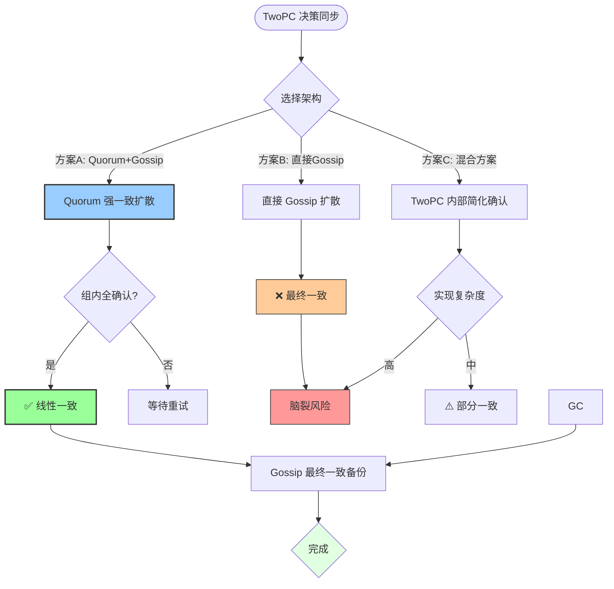
```mermaid
flowchart TD
    Start([TwoPC 决策同步]) --> Decision{选择架构}

    Decision -->|方案A: Quorum+Gossip| Quorum[Quorum 强一致扩散]
    Decision -->|方案B: 直接Gossip| Gossip[直接 Gossip 扩散]
    Decision -->|方案C: 混合方案| Mixed[TwoPC 内部简化确认]

    Quorum --> QA{组内全确认?}
    QA -->|是| QB[✅ 线性一致]
    QA -->|否| QC[等待重试]

    Gossip --> GA[❌ 最终一致]
    GA --> GB[脑裂风险]

    Mixed --> MA{实现复杂度}
    MA -->|高| GB
    MA -->|中| MC[⚠️ 部分一致]

    QB --> GD[Gossip 最终一致备份]
    GC --> GD

    GD --> End{完成}

    style Quorum fill:#9cf,stroke:#333,stroke-width:2px
    style QB fill:#9f9,stroke:#333,stroke-width:2px
    style GA fill:#fc9,stroke:#333
    style GB fill:#f99,stroke:#333
    style End fill:#e1ffe1
```

**技术实现要点**：

1. **组内全确认机制**：
   - 组内所有节点（5-10个）必须确认收到决策
   - 使用 TwoPC 的 PreCommit 和 Commit 阶段实现全员确认
   - 超时机制：30秒超时后回滚

2. **Gossip 立即转发**：
   - Quorum 确认完成后，立即触发 Gossip 扩散
   - 使用 `PriorityCritical` 优先级，fanout=3
   - 目标：在 1-2 秒内完成组间同步

3. **状态持久化**：
   - 决策状态先写 WAL，再发送给其他节点
   - 崩溃恢复：从 WAL 中恢复未完成的决策

**需要决策**：
- [x] A. ✅ 采用 code-architect 建议的架构（TwoPC → Quorum → Gossip）
- [ ] B. 保持当前架构（TwoPC → Gossip），但添加立即转发机制
- [ ] C. 混合方案（TwoPC 内部实现简化的多数派确认 + Gossip 备份）

---

#### 疑问 2：立即转发机制 - 与 Gossip 原则的冲突 🟡

**code-architect 建议**：2PC 决策消息应立即转发（PriorityCritical），而非等待周期性 Gossip

**疑问点**：
1. **Transport 层支持**：立即转发是否需要 Transport 层添加优先级队列支持？还是可以在应用层实现？
2. **与随机选点冲突**：Gossip 的核心是随机选点传播，立即转发是否违反了这个原则？
3. **实现方式**：
   - 方案 A：发送决策消息后，立即触发一次额外的 Gossip
   - 方案 B：使用单独的"立即转发"通道，与周期性 Gossip 并行
   - 方案 C：修改 Gossip 协议，支持优先级标记

**需要决策**：
- [ ] A. 在应用层实现（决策后额外触发 Gossip）
- [ ] B. 修改 Transport 层（添加优先级队列）
- [ ] C. 混合方案（关键消息双重通道）

---

#### 疑问 3：消息优先级设计 🟡

**code-architect 建议**：消息应带有优先级（Priority）和建议转发周期（SuggestedTTL）

**疑问点**：
1. **优先级分类**：

> **✅ 已统一**：详见 `02_一致性级别定义.md` 中的 **Gossip 协议分级配置** 章节。

| 优先级 | 同步周期 | 立即转发 | 收敛时间 | 典型场景 |
|--------|---------|---------|---------|---------|
| **PriorityCritical** | 5秒 | ✅ 是 | < 1秒 | 2PC 决策、事务状态 |
| **PriorityHigh** | 5秒 | ⚠️ 可选 | < 5秒 | 节点健康检测、故障确认 |
| **PriorityNormal** | 10秒 | ❌ 否 | < 10秒 | 元数据同步、拓扑信息 |
| **PriorityLow** | 10-30秒 | ❌ 否 | < 30秒 | 统计信息、负载报告 |

2. **TTL 语义**：SuggestedTTL 是"建议的转发间隔"还是"消息生存时间"？

3. **Gossip 协议修改**：当前 Gossip 实现是否支持优先级？需要修改哪些部分？

**需要决策**：
- [ ] A. 扩展消息定义，添加 Priority 和 SuggestedTTL 字段
- [ ] B. 修改 Gossip 协议，支持优先级队列
- [ ] C. 暂不实现，后续优化

---

#### 疑问 4：状态更新逻辑 - HLC 时间戳比较 🔴

**当前代码**（文档第 758-760 行）：
```go
currentState := txState.State.Load().(TxState)
if state > currentState { // ❌ 简单比较不正确
    txState.State.Store(state)
}
```

**code-architect 指出的问题**：
- 状态机不能简单用 `>` 比较（如 `TxStateAborted` 无法与 `TxStateCommitted` 比较）
- 缺少 HLC 时间戳比较

**疑问点**：
1. **状态转换验证**：是否需要实现 `isValidStateTransition(from, to)` 函数？
2. **HLC 时间戳比较**：当前代码中是否正确使用了 `hlc.Timestamp.Compare()` 方法？
3. **相同时间戳处理**：当时间戳相同时，如何决定哪个状态有效？

**需要决策**：
- [ ] A. 实现完整的状态转换验证 + HLC 比较
- [ ] B. 简化方案（仅使用 HLC 比较，忽略状态有效性）
- [ ] C. 使用优先级规则（协调者状态 > 参与者状态）

---

#### 疑问 5：异步查询实现 - Sleep vs Future 🟡

**当前代码**（文档第 683 行）：
```go
time.Sleep(5 * time.Second) // ❌ 硬编码延迟
```

**code-architect 建议**：使用 Future 模式或条件变量

**疑问点**：
1. **复杂度增加**：Future 模式会增加多少代码复杂度？
2. **替代方案**：
   - 方案 A：Future 模式（注册查询 Future，异步等待）
   - 方案 B：通道 + 超时（当前方案，改进超时逻辑）
   - 方案 C：轮询检查（定期查询本地状态）

3. **实现成本**：如果要实现 Future，需要修改哪些现有代码？

**需要决策**：
- [ ] A. 实现 Future 模式
- [ ] B. 改进当前的超时等待逻辑
- [ ] C. 使用轮询机制

---

#### 疑问 6：协调者追踪 - 消息定义完整性 🟡

**code-architect 指出**：
- `TransactionState` 结构体未声明 `Coordinator` 字段
- 参与者节点创建 `TransactionState` 时无法设置协调者
- 需要在 `TwoPCPrepareMessage` 中添加 `Coordinator` 字段

**疑问点**：
1. **消息传播**：`TwoPCPrepareMessage` 中的 `Coordinator` 字段是否足够？
2. **参与者视角**：参与者收到 PreCommit 消息后，如何知道自己是参与者还是协调者？
3. **消息完整性检查**：是否需要在所有 TwoPC 消息中添加 `Coordinator` 字段？

**需要决策**：
- [ ] A. 在所有 TwoPC 消息中添加 `Coordinator` 字段
- [ ] B. 仅在关键消息中添加（PreCommit, Decision）
- [ ] C. 通过消息类型隐式推断（不添加字段）

---

#### 疑问 7：脑裂场景防护 🔴

**code-architect 指出**：文档未讨论网络分区时的脑裂问题

**场景**：
- 集群分为 A、B 两区
- 协调者在 A 区，部分参与者在 B 区
- A 区决定 commit，B 区决定 abort

**疑问点**：
1. **Quorum 防护**：如果 TwoPC 不使用 Quorum，如何防止脑裂？
2. **多数派检查**：是否需要在决策前检查多数派是否在线？
3. **超时策略**：分区期间，超时后应该 abort 还是继续等待？

**需要决策**：
- [ ] A. 使用 Quorum 机制（多数派确认）
- [ ] B. 添加在线检查逻辑（手动实现）
- [ ] C. 依赖 Gossip 的最终一致性（接受脑裂风险）

---

#### 疑问 8：事务状态持久化 🔴

**code-architect 指出**：事务状态仅存储在内存，节点崩溃后状态丢失

**疑问点**：
1. **持久化方案**：
   - 方案 A：使用 MVStore 持久化到磁盘
   - 方案 B：使用 WAL 日志记录状态变更
   - 方案 C：定期快照 + 增量日志

2. **性能影响**：持久化会增加多少延迟？
3. **恢复流程**：节点重启后，如何从 MVStore 恢复事务状态？

**需要决策**：
- [ ] A. 实现完整的持久化（MVStore）
- [ ] B. 实现简化的持久化（仅关键状态）
- [ ] C. 暂不实现，接受状态丢失风险（依赖 Gossip 恢复）

---

### 疑问优先级

| 优先级 | 疑问 | 影响范围 |
|-------|------|---------|
| **P0** | 疑问 1：架构调整 | 核心设计，影响所有后续实现 |
| **P0** | 疑问 7：脑裂防护 | 数据一致性，严重后果 |
| **P0** | 疑问 8：状态持久化 | 可靠性，崩溃恢复 |
| **P1** | 疑问 4：状态更新逻辑 | 正确性，可能导致状态错误 |
| **P1** | 疑问 2：立即转发 | 性能，影响决策延迟 |
| **P2** | 疑问 3：消息优先级 | 优化，可后续实现 |
| **P2** | 疑问 5：异步查询 | 实现细节，可简化 |
| **P2** | 疑问 6：协调者追踪 | 完整性，当前方案可用 |

---

### 建议的决策流程

```mermaid
flowchart TD
    Start([开始评审]) --> P0{P0 疑问<br/>架构/脑裂/持久化}

    P0 -->|需要团队讨论| Discuss1[团队评审会议]
    P0 -->|可技术决策| Decide1[技术负责人决策]

    Discuss1 --> Decision1{做出决策}
    Decision1 -->|确定方案| Update1[更新文档]
    Decision1 -->|需要POC| POC1[原型验证]

    Decide1 --> Update1
    POC1 --> Update1

    Update1 --> P1{P1 疑问<br/>状态更新/转发}
    P1 --> Decide2[技术决策]
    Decide2 --> Update2[更新文档]

    Update2 --> P2{P2 疑问<br/>优先级/异步/追踪}
    P2 --> Decide3[可延后决策]
    Decide3 --> Mark[标记为优化项]

    Update2 --> Complete([评审完成])
    Mark --> Complete

    style Start fill:#9cf,stroke:#333
    style Complete fill:#9f9,stroke:#333
    style P0 fill:#f99,stroke:#333,stroke-width:2px
    style P1 fill:#fc9,stroke:#333
    style P2 fill:#ff9,stroke:#333
```

---

**文档版本**: v1.0
**创建时间**: 2026-01-18
**状态**: 待评审
