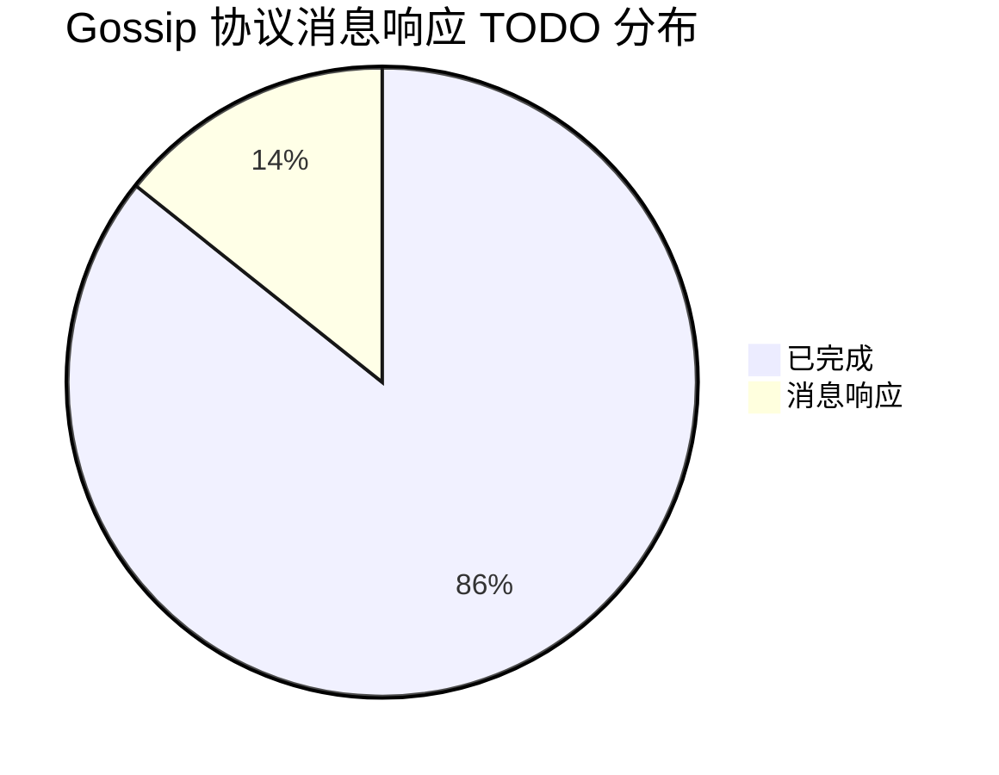
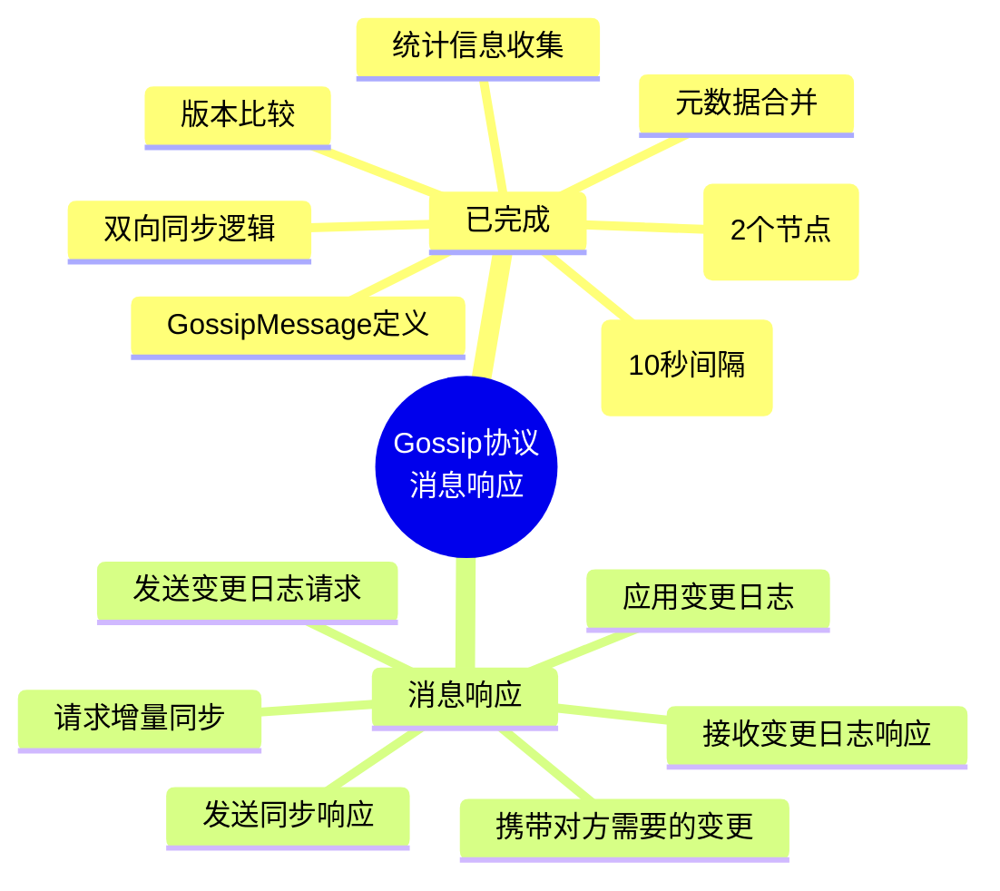
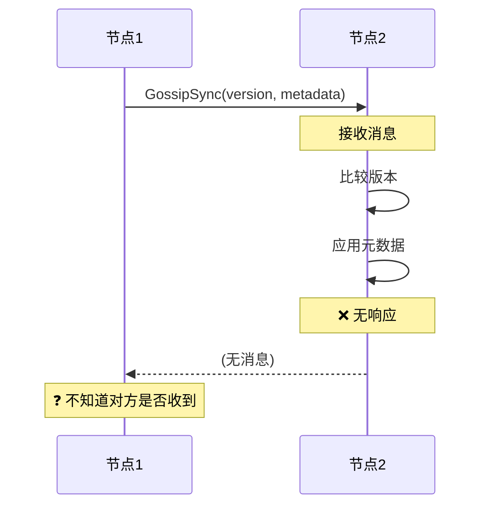
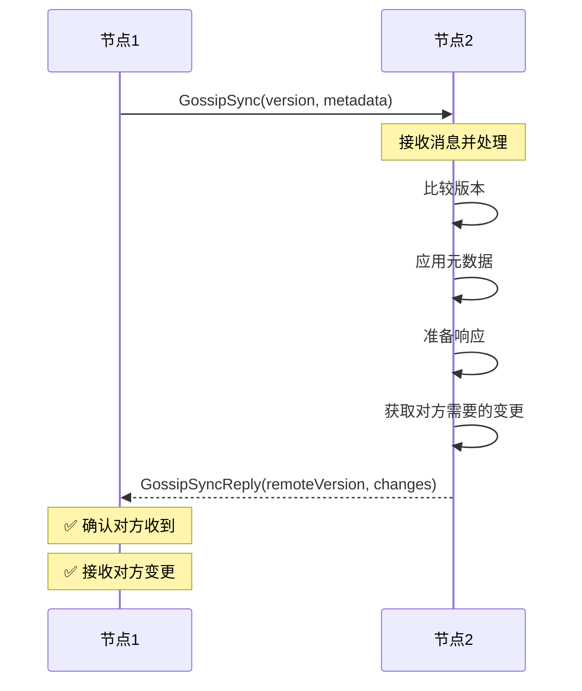
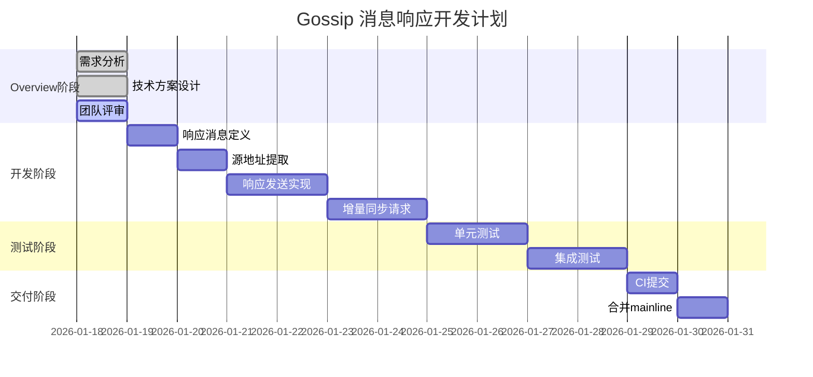
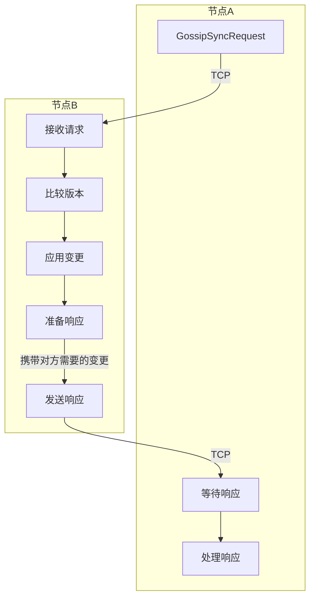
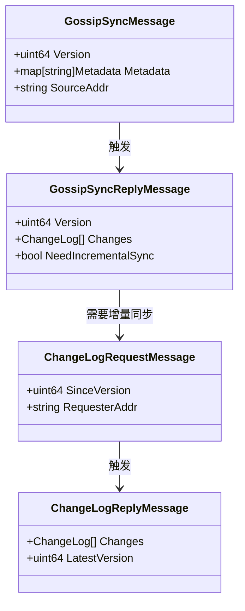
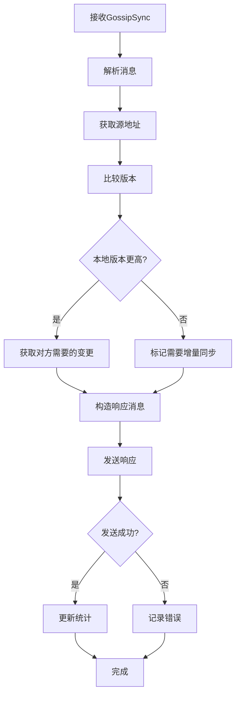
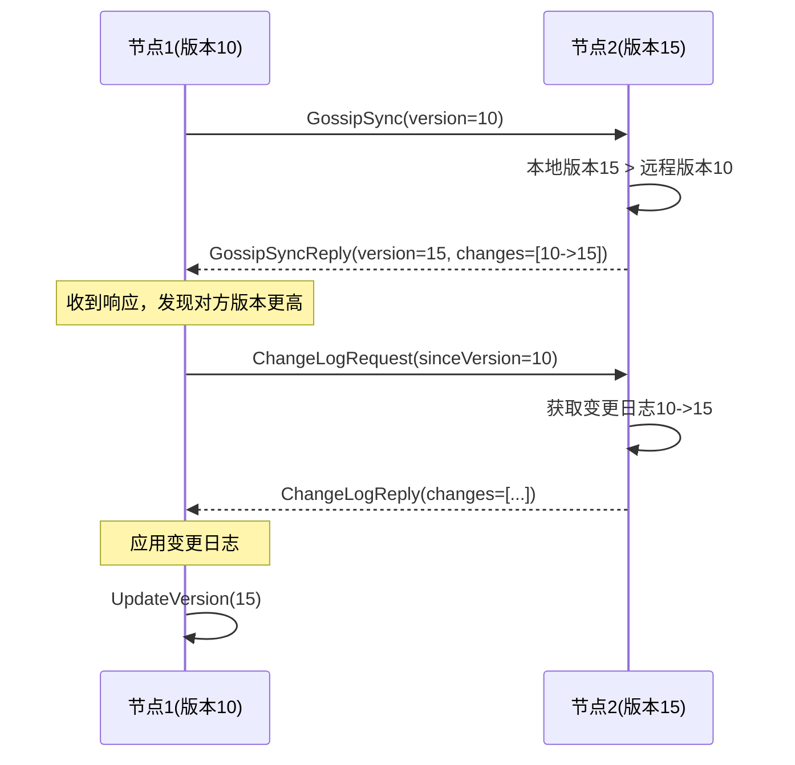

# Gossip 协议消息响应机制 - Overview

> **创建日期**: 2026-01-18
> **分支**: `feature/gossip-message-response`
> **状态**: 📝 Overview 阶段

---

## 📊 总体概览

### TODO 完成情况



### 核心功能状态



### 当前架构



### 目标架构



### 开发计划



### 协议交互流程



### 消息类型



---

## 🎯 需求背景

### 问题描述

**当前状态**：
- `handleGossipSync()` 接收到同步消息后，直接应用元数据
- **不发送响应**，对方不知道是否成功
- 对方版本更高时，无法请求增量同步
- 缺少双向交互机制

**影响**：
1. **可靠性差**：发送方不知道消息是否被接收
2. **效率低**：每次都发送完整元数据，而非增量
3. **不一致风险**：无法确保双方达成一致

### 需求目标

**核心需求**：
1. 发送 Gossip 同步响应，携带对方需要的变更
2. 支持增量同步请求（当对方版本更高时）
3. 提供双向同步机制

**次要需求**：
1. 记录响应发送统计
2. 支持响应超时检测
3. 记录同步失败次数

### 上下文关联

- **依赖**: Transport 层（需要提取源地址）
- **被依赖**: TwoPC、TreeCoordinator（依赖 Gossip 同步）
- **相关**: 元数据版本管理

---

## 💡 技术方案

### 1. 响应消息定义

**GossipSyncReplyMessage**：
```go
// GossipSyncReplyMessage Gossip同步响应消息
type GossipSyncReplyMessage struct {
    // 本地版本号
    Version uint64

    // 对方需要的变更日志（如果对方版本更低）
    Changes []*MetadataChangeLog

    // 是否需要增量同步（如果对方版本更高）
    NeedIncrementalSync bool

    // 节点信息
    NodeID string
    Addr   string
}
```

**设计要点**：
- 使用 `Version` 字段让接收方知道发送方的版本
- `Changes` 携带对方需要的增量变更
- `NeedIncrementalSync` 标识是否需要请求增量同步

### 2. 源地址提取

**问题**：当前 Transport 层的 `Receive()` 方法不提供源地址

**解决方案**：扩展 Transport 接口

```go
// MessageContext 消息上下文
type MessageContext struct {
    // 消息内容
    Message interface{}

    // 源地址
    SourceAddr string

    // 接收时间
    ReceiveTime time.Time
}

// Transport 扩展接口
type Transport interface {
    // Send 发送消息到指定地址
    Send(ctx context.Context, addr string, msg interface{}) error

    // Receive 接收消息（带上下文）
    Receive() (*MessageContext, error)
}
```

**临时方案**（如果不修改 Transport）：
```go
// 使用 conn.RemoteAddr() 获取源地址
func (g *GossipService) handleGossipSync(conn net.Conn) {
    sourceAddr := conn.RemoteAddr().String()

    // ... 处理消息

    // 发送响应
    g.sendSyncReply(sourceAddr, reply)
}
```

### 3. 响应发送流程

**流程图**：


**关键代码**：
```go
// handleGossipSync 处理Gossip同步消息
func (g *GossipService) handleGossipSync(
    ctx context.Context,
    syncMsg *GossipSyncMessage,
    sourceAddr string,
) error {
    // 1. 比较版本
    localVersion := g.metaStore.GetVersion()
    remoteVersion := syncMsg.Version

    var changes []*MetadataChangeLog

    // 2. 如果本地版本更高，准备变更日志
    if localVersion > remoteVersion {
        var err error
        changes, err = g.metaStore.GetChangeLogs(remoteVersion)
        if err != nil {
            return fmt.Errorf("获取变更日志失败: %w", err)
        }
    }

    // 3. 构造响应
    reply := &GossipSyncReplyMessage{
        Version:             localVersion,
        Changes:             changes,
        NeedIncrementalSync: remoteVersion > localVersion,
        NodeID:              g.localNodeID,
        Addr:                g.localAddr,
    }

    // 4. 发送响应
    if err := g.transport.Send(ctx, sourceAddr, reply); err != nil {
        g.stats.ReplyFailed.Add(1)
        return fmt.Errorf("发送响应失败: %w", err)
    }

    g.stats.RepliesSent.Add(1)

    logging.WithFields(map[string]any{
        "source_addr":    sourceAddr,
        "remote_version": remoteVersion,
        "local_version":  localVersion,
        "changes_count":  len(changes),
    }).Debug("发送Gossip同步响应")

    return nil
}
```

### 4. 增量同步请求

**触发条件**：
- 接收到的 GossipSync 消息中，对方版本更高
- 响应消息中设置 `NeedIncrementalSync = true`

**流程**：


**关键代码**：
```go
// requestChangeLogs 请求增量同步
func (g *GossipService) requestChangeLogs(
    ctx context.Context,
    targetAddr string,
    sinceVersion uint64,
) error {
    // 1. 构造请求
    req := &ChangeLogRequestMessage{
        SinceVersion:  sinceVersion,
        RequesterAddr: g.localAddr,
    }

    // 2. 发送请求
    if err := g.transport.Send(ctx, targetAddr, req); err != nil {
        return fmt.Errorf("发送变更日志请求失败: %w", err)
    }

    logging.WithFields(map[string]any{
        "target_addr":    targetAddr,
        "since_version":  sinceVersion,
    }).Info("请求增量同步")

    return nil
}

// handleChangeLogRequest 处理变更日志请求
func (g *GossipService) handleChangeLogRequest(
    ctx context.Context,
    req *ChangeLogRequestMessage,
    sourceAddr string,
) error {
    // 1. 获取变更日志
    changes, err := g.metaStore.GetChangeLogs(req.SinceVersion)
    if err != nil {
        return fmt.Errorf("获取变更日志失败: %w", err)
    }

    // 2. 构造响应
    reply := &ChangeLogReplyMessage{
        Changes:       changes,
        LatestVersion: g.metaStore.GetVersion(),
    }

    // 3. 发送响应
    if err := g.transport.Send(ctx, sourceAddr, reply); err != nil {
        return fmt.Errorf("发送变更日志响应失败: %w", err)
    }

    logging.WithFields(map[string]any{
        "source_addr":   sourceAddr,
        "changes_count": len(changes),
    }).Debug("发送变更日志响应")

    return nil
}
```

### 5. 响应处理

**接收到响应后**：
```go
// handleGossipSyncReply 处理Gossip同步响应
func (g *GossipService) handleGossipSyncReply(
    ctx context.Context,
    reply *GossipSyncReplyMessage,
) error {
    // 1. 应用变更日志
    if len(reply.Changes) > 0 {
        for _, change := range reply.Changes {
            if err := g.metaStore.ApplyChangeLog(change); err != nil {
                logging.WithFields(map[string]any{
                    "change_version": change.Version,
                    "error":          err,
                }).Error("应用变更日志失败")
                continue
            }
        }

        logging.WithFields(map[string]any{
            "changes_count":    len(reply.Changes),
            "remote_version":   reply.Version,
            "local_version":    g.metaStore.GetVersion(),
        }).Info("应用Gossip同步响应")
    }

    // 2. 如果需要增量同步，发送请求
    if reply.NeedIncrementalSync {
        localVersion := g.metaStore.GetVersion()
        if err := g.requestChangeLogs(ctx, reply.Addr, localVersion); err != nil {
            return fmt.Errorf("请求增量同步失败: %w", err)
        }
    }

    g.stats.RepliesReceived.Add(1)

    return nil
}
```

### 6. 统计信息

**新增指标**：
```go
type GossipStats struct {
    // ... 现有字段 ...

    // 发送的响应数
    RepliesSent atomic.Int64

    // 接收的响应数
    RepliesReceived atomic.Int64

    // 响应发送失败数
    ReplyFailed atomic.Int64

    // 增量同步请求数
    IncrementalSyncRequests atomic.Int64

    // 变更日志请求数
    ChangeLogRequests atomic.Int64
}
```

---

## ⚠️ 风险预判

### 风险 1: 响应风暴

**风险等级**: 🟡 中等

**场景**：
- 多个节点同时触发 Gossip 同步
- 大量响应消息同时发送

**影响**：
- 网络带宽瞬间占用
- 消息处理延迟增加

**缓解措施**：
1. **响应限流**：限制每秒发送的响应数量
2. **响应合并**：将多个响应合并为一个
3. **异步发送**：使用 goroutine 池异步发送响应

### 风险 2: 增量同步死锁

**风险等级**: 🟢 低

**场景**：
- 节点 A 请求节点 B 的增量
- 节点 B 同时请求节点 A 的增量
- 双方都在等待对方响应

**影响**：
- 增量同步阻塞
- 版本不一致

**缓解措施**：
1. **超时机制**：增量同步请求设置超时（5秒）
2. **优先级处理**：先处理接收到的请求，再发送自己的请求
3. **版本检查**：请求前检查对方版本是否仍然更高

### 风险 3: 变更日志过大

**风险等级**: 🟡 中等

**场景**：
- 两个节点版本差距很大（如版本10 vs 版本1000）
- 变更日志包含大量数据

**影响**：
- 单个消息过大（超过 MTU）
- 网络传输失败

**缓解措施**：
1. **分批发送**：将大量变更日志分批发送（每批100条）
2. **压缩**：使用 gzip 压缩变更日志
3. **限制数量**：单次最多返回 500 条变更日志
4. **请求重传**：如果未接收完，请求下一批

### 风险 4: 源地址提取失败

**风险等级**: 🟡 中等

**场景**：
- Transport 层不提供源地址
- 连接已关闭，无法获取 RemoteAddr()

**影响**：
- 无法发送响应
- 同步失败

**缓解措施**：
1. **扩展 Transport 接口**：增加 `ReceiveWithSource()` 方法
2. **消息中携带源地址**：在 GossipSyncMessage 中增加 SourceAddr 字段
3. **降级处理**：如果无法获取源地址，记录警告但不中断同步

### 风险 5: 响应超时

**风险等级**: 🟢 低

**场景**：
- 发送 GossipSync 后等待响应
- 对方处理慢或网络延迟高

**影响**：
- 同步效率降低
- 可能触发重试

**缓解措施**：
1. **异步等待**：不阻塞发送方，异步处理响应
2. **超时重试**：设置响应超时（如 3 秒）
3. **乐观同步**：假设对方已接收，下个周期再验证

---

## ✅ 成功标准

### 功能完整性

- [ ] 接收 GossipSync 后发送响应
- [ ] 响应携带对方需要的变更日志
- [ ] 支持增量同步请求
- [ ] 处理变更日志请求和响应
- [ ] 更新相关统计信息

### 性能指标

- [ ] 响应延迟 < 100ms（本地网络）
- [ ] 增量同步收敛时间 < 5 秒
- [ ] 单个响应消息 < 10KB

### 质量标准

- [ ] 单元测试覆盖率 > 85%
- [ ] 集成测试通过
- [ ] 无 golangci-lint 错误
- [ ] 无响应泄漏

---

## 🧪 测试计划

### 单元测试

| 用例ID | 测试场景 | 验证目标 |
|-------|---------|---------|
| GS-MR-001 | 发送GossipSync响应 | 验证响应构造和发送 |
| GS-MR-002 | 响应携带变更日志 | 验证增量变更 |
| GS-MR-003 | 需要增量同步标记 | 验证标记逻辑 |
| GS-MR-004 | 处理接收到的响应 | 验证变更应用 |
| GS-MR-005 | 发送增量同步请求 | 验证请求发送 |
| GS-MR-006 | 处理变更日志请求 | 验证日志返回 |
| GS-MR-007 | 响应发送失败重试 | 验证重试逻辑 |
| GS-MR-008 | 统计信息更新 | 验证统计正确性 |

### 集成测试

| 用例ID | 测试场景 | 验证目标 |
|-------|---------|---------|
| GS-MR-101 | 双节点双向同步 | 验证响应机制 |
| GS-MR-102 | 版本差距大的增量同步 | 验证分批发送 |
| GS-MR-103 | 多节点同时同步 | 验证响应限流 |
| GS-MR-104 | 网络分区恢复后同步 | 验证增量恢复 |
| GS-MR-105 | 响应超时场景 | 验证超时处理 |

### 手动测试

1. **基本响应测试**
   ```bash
   # 启动2个节点
   ./bin/nexkv --config node1.yaml &
   ./bin/nexkv --config node2.yaml &

   # 在 node1 上创建分片
   curl -X POST http://localhost:9211/api/v1/shards \
     -d '{"shard_id": "shard1"}'

   # 等待10秒
   sleep 10

   # 检查 node2 的版本
   curl http://localhost:9212/api/v1/metadata/version

   # 预期：node2 版本已更新
   ```

2. **增量同步测试**
   ```bash
   # node1: 版本10
   # node2: 版本5

   # 触发 node1 向 node2 同步
   curl -X POST http://localhost:9211/api/v1/gossip/sync \
     -d '{"target_addr": "127.0.0.1:9212"}'

   # 检查 node2 的增量同步请求
   curl http://localhost:9212/api/v1/gossip/stats

   # 预期：incremental_sync_requests > 0
   ```

3. **大规模变更日志测试**
   ```bash
   # 创建100个分片（版本差距大）
   for i in {1..100}; do
     curl -X POST http://localhost:9211/api/v1/shards \
       -d "{\"shard_id\": \"shard$i\"}"
   done

   # 启动新节点 node3
   ./bin/nexkv --config node3.yaml &

   # 检查 node3 是否最终收敛
   watch -n 5 'curl http://localhost:9213/api/v1/metadata/version'

   # 预期：30秒内版本收敛
   ```

---

## 📋 开发检查清单

### Phase 1: 准备阶段
- [ ] 创建分支 `feature/gossip-message-response`
- [ ] 阅读现有 Gossip 实现
- [ ] 理解 Transport 接口

### Phase 2: 消息定义
- [ ] 定义 `GossipSyncReplyMessage` 结构
- [ ] 定义 `ChangeLogRequestMessage` 结构
- [ ] 定义 `ChangeLogReplyMessage` 结构
- [ ] 添加消息序列化/反序列化
- [ ] 编写单元测试

### Phase 3: 源地址提取
- [ ] 扩展 Transport 接口（添加 `MessageContext`）
- [ ] 或实现临时方案（使用 `conn.RemoteAddr()`）
- [ ] 更新 `handleGossipSync()` 签名
- [ ] 编写单元测试

### Phase 4: 响应发送
- [ ] 实现 `sendSyncReply()` 方法
- [ ] 实现 `prepareChangeLogs()` 方法
- [ ] 集成到 `handleGossipSync()`
- [ ] 添加响应重试逻辑
- [ ] 添加统计信息
- [ ] 编写单元测试

### Phase 5: 增量同步
- [ ] 实现 `requestChangeLogs()` 方法
- [ ] 实现 `handleChangeLogRequest()` 方法
- [ ] 实现 `handleChangeLogReply()` 方法
- [ ] 添加超时处理
- [ ] 编写单元测试

### Phase 6: 响应处理
- [ ] 实现 `handleGossipSyncReply()` 方法
- [ ] 实现变更日志应用逻辑
- [ ] 添加错误处理
- [ ] 编写单元测试

### Phase 7: 集成测试
- [ ] 编写双节点同步测试
- [ ] 编写多节点同步测试
- [ ] 编写增量同步测试
- [ ] 编写大规模变更测试

### Phase 8: 文档与交付
- [ ] 更新 CLAUDE.md
- [ ] 编写实施总结报告
- [ ] 提交 PR 到 GitHub
- [ ] 等待 CI 通过
- [ ] 合并到 mainline

---

## 📚 参考文档

- `01_核心架构概念.md` - 三层架构设计
- `二阶段提交与Gossip状态同步.md` - TwoPC Gossip 状态同步
- `05_树形协调器拓扑同步.md` - TreeCoordinator 拓扑同步
- `CLAUDE.md` - 项目开发指南

---

**文档版本**: v1.0
**作者**: NexKV 开发团队
**最后更新**: 2026-01-18
