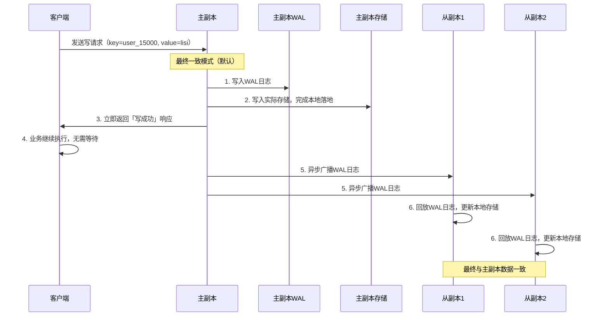
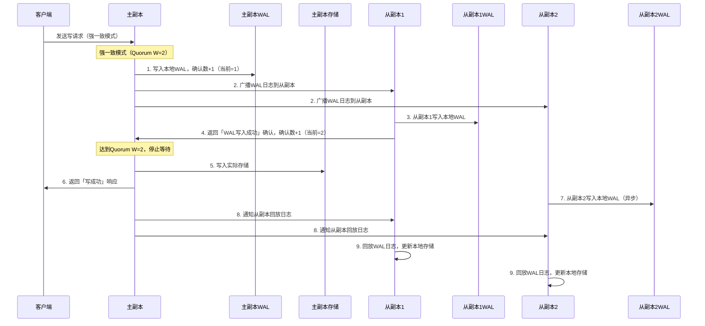

# 可调一致性切换机制

> **文档版本**: v1.0
> **创建日期**: 2026-01-17
> **状态**: ✅ 核心机制说明

---

## 📋 核心概述

「可调一致性切换」是 NexKV 单机-分布式一体架构的灵活特性，核心是**在同一套存储架构下，支持「默认最终一致」与「可选强一致」的动态切换，无需重构底层逻辑**。强一致通过 Quorum 多数派确认实现，更贴合分片级主从自治的设计。

---

## 一、核心原理

### 1.1 核心定义

「可调一致性切换」的本质是：**通过配置「写入确认规则」，在「性能优先（最终一致）」和「数据安全优先（强一致）」之间做灵活选择，所有逻辑均下沉到「分片副本组」和「存储引擎层」，无全局开销**。

- **底层支撑**：依赖存储引擎的 WAL（预写日志）机制，所有写入操作先落 WAL 再落实际存储，保证操作可追溯、可回放
- **切换粒度**：支持「集群级默认配置」+「分片级覆盖配置」（核心分片强一致，非核心分片最终一致）
- **强一致实现**：采用 Quorum 多数派确认（`W = N/2 + 1`，N 为分片副本数），轻量化实现

### 1.2 架构示意图

以「3副本分片（N=3）」为例（Quorum 配置 `W=2`，即 `3/2+1=2`）：

```mermaid
flowchart TB
    subgraph 分片X副本组（3副本：N=3）
        P[主副本（Primary）]
        R1[从副本1（Replica）]
        R2[从副本2（Replica）]
    end

    Client[客户端] -->|写请求（带一致性配置）| P
    P -->|1. 本地写入WAL+实际存储| P_WAL[本地WAL日志] --> P_Store[本地存储]
    P -->|2. 广播WAL日志到所有从副本| R1 & R2

    subgraph 一致性切换逻辑
        Direction[配置判断] --> Final[最终一致（默认）]
        Direction --> Strong[强一致（可选）]

        Final --> P_Final[立即向客户端返回「写成功」]
        P_Final --> Client_Final[客户端接收成功响应]
        R1 --> R1_Final[异步回放WAL，更新存储]
        R2 --> R2_Final[异步回放WAL，更新存储]

        Strong --> Quorum[等待 W=2 个副本完成WAL写入]
        R1 --> R1_Strong[写入本地WAL，返回「确认信号」] --> Quorum
        R2 --> R2_Strong[写入本地WAL，返回「确认信号」] --> Quorum
        P -->|自身已完成WAL写入，计入确认数| Quorum
        Quorum --> P_Strong[向客户端返回「写成功」]
        P_Strong --> Client_Strong[客户端接收成功响应]
        R1_Strong --> R1_Store[回放WAL，更新存储]
        R2_Strong --> R2_Store[回放WAL，更新存储]
    end

    P --> Direction
```

---

## 二、默认最终一致（性能优先）

### 2.1 核心原理

最终一致是默认配置，核心逻辑是**「主副本本地落地即返回，从副本异步追平数据」**。

**核心流程**：
1. 客户端发送写请求到分片主副本
2. 主副本将操作记录为 WAL 日志，先写入本地 WAL 文件
3. 主副本将 WAL 日志写入实际存储引擎，完成本地数据落地
4. 主副本**立即向客户端返回「写成功」**，无需等待从副本响应
5. 主副本异步将 WAL 日志广播到所有从副本
6. 从副本接收 WAL 日志后，异步回放日志、更新本地存储

### 2.2 时序示意图



### 2.3 核心特点与适用场景

| 维度 | 具体说明 |
|------|----------|
| **核心优势** | 1. 写入性能最优，无额外等待延迟<br>2. 无网络阻塞风险<br>3. 单机模式下自动退化，无分布式开销 |
| **潜在不足** | 1. 存在数据丢失风险<br>2. 存在短暂数据不一致<br>3. 不适合对数据安全性要求极高的场景 |
| **适用场景** | 非核心业务数据，对性能要求高于数据一致性：<br>1. 用户行为日志<br>2. 非核心配置数据<br>3. 临时缓存数据 |

---

## 三、可选强一致（数据安全优先，Quorum 多数派确认）

### 3.1 核心原理

强一致是可选配置，核心逻辑是**「基于 Quorum 机制，等待 `N/2+1` 个副本（含主副本）完成 WAL 写入确认后，再向客户端返回成功」**。

- **核心前提**：分片副本数 N 为奇数（推荐 3 或 5），Quorum 写入确认数 `W = N/2 + 1`（3 副本 W=2，5 副本 W=3）
- **核心流程**（以 3 副本 W=2 为例）：
  1. 客户端发送写请求到分片主副本（携带「强一致」配置标识）
  2. 主副本将操作记录为 WAL 日志，写入本地 WAL 文件，同时计入确认数
  3. 主副本将 WAL 日志广播到所有从副本
  4. 从副本接收 WAL 日志后，先写入本地 WAL 文件，向主副本返回「WAL 写入成功」确认信号
  5. 主副本收集确认信号，当确认数达到 `W=2`（自身+至少 1 个从副本）时，停止等待
  6. 主副本将操作写入实际存储引擎，然后向客户端返回「写成功」响应
  7. 所有副本异步回放 WAL 日志，更新本地实际存储

### 3.2 时序示意图



### 3.3 核心特点与适用场景

| 维度 | 具体说明 |
|------|----------|
| **核心优势** | 1. 数据永不丢失：多数派副本已落地 WAL<br>2. 分片内强一致：客户端读取任何副本，最终都会获取到最新数据<br>3. 轻量化替代 Raft：无集群级主节点瓶颈<br>4. 灵活切换：可针对核心分片单独开启 |
| **潜在不足** | 1. 写入性能略低：需要等待多数派副本确认<br>2. 依赖网络稳定性<br>3. 运维成本略高 |
| **适用场景** | 核心业务数据，对数据安全性要求高于性能：<br>1. 金融交易数据<br>2. 电商核心数据<br>3. 政务/医疗核心数据 |

---

## 四、核心价值与总结

### 4.1 核心价值

1. **平衡性能与安全**：默认最终一致保证高性能，可选强一致保证核心数据安全
2. **轻量化与可扩展**：强一致基于分片级 Quorum 实现，支持集群性能线性扩展
3. **适配单机-分布式一体**：单机模式下，副本数=1，Quorum 确认数=1，强一致逻辑退化为「本地 WAL 落地即成功」
4. **细粒度配置**：支持分片级切换，核心分片强一致、非核心分片最终一致

### 4.2 总结

「可调一致性切换」的核心是**「以 WAL 为基础，以 Quorum 为支撑，在分片副本组内实现一致性的灵活调配」**：

- **最终一致**：追求极致性能，适合非核心数据，是单机模式的最优选择
- **强一致**：追求数据安全，适合核心数据，是分布式模式下核心分片的最优选择
- 两种模式无缝切换，无需重构代码，完美贴合 NexKV 「单机-分布式一体」的架构理念

---

**文档版本**: v1.0
**最后更新**: 2026-01-17
**维护者**: NexKV 开发团队
