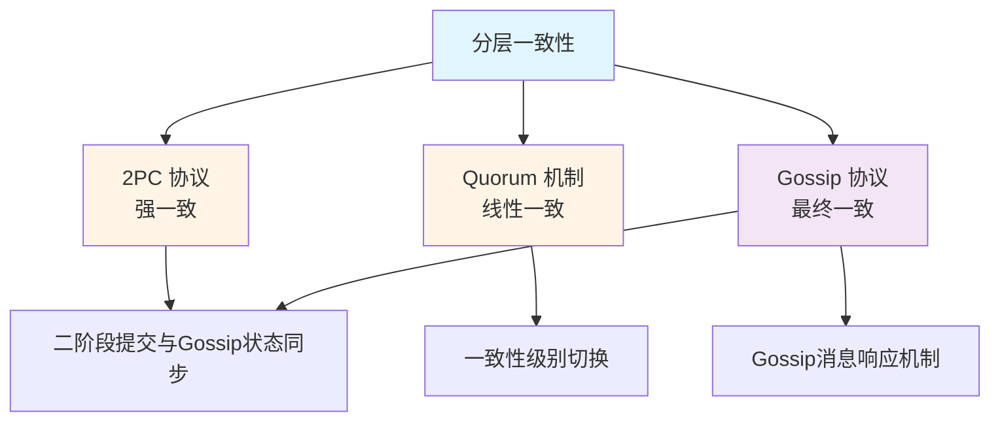

# 协议设计

> **目录定位**：分布式协议设计文档，定义 NexKV 的各种一致性协议和通信机制。

---

## 📁 文档列表

### 一致性协议（2 篇）

| 文件 | 说明 | 状态 |
|------|------|------|
| **CPD.md** | 一致性协议设计（Consistency Protocol Design） | ✅ 总体设计 |
| **一致性级别切换.md** | 一致性级别切换机制 | ✅ 详细设计 |

### TwoPC & Gossip 协议（2 篇）

| 文件 | 说明 | 状态 |
|------|------|------|
| **二阶段提交与Gossip状态同步.md** | TwoPC 协议与 Gossip 状态同步 | ✅ 详细设计 |
| **Gossip消息响应机制.md** | Gossip 协议消息响应机制 | ✅ 详细设计 |

---

## 🔗 协议关系图

---

## 🔗 相关文档

- **架构设计**：见 `../architecture/`
- **模块设计**：见 `../modules/`（TreeCoordinator 等）
- **核心概念**：见 `../../00_overview/02_一致性级别定义.md`

---

## 📖 阅读顺序

1. **CPD.md** - 理解一致性协议总体架构
2. **二阶段提交与Gossip状态同步.md** - 深入 TwoPC 与 Gossip 的集成
3. **Gossip消息响应机制.md** - 了解 Gossip 响应机制
4. **一致性级别切换.md** - 理解一致性级别切换

---

**文档版本**: v2.0 (方案 B 重构)
**最后更新**: 2026-01-18
