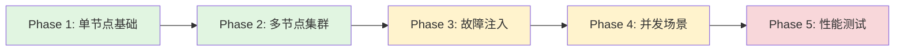
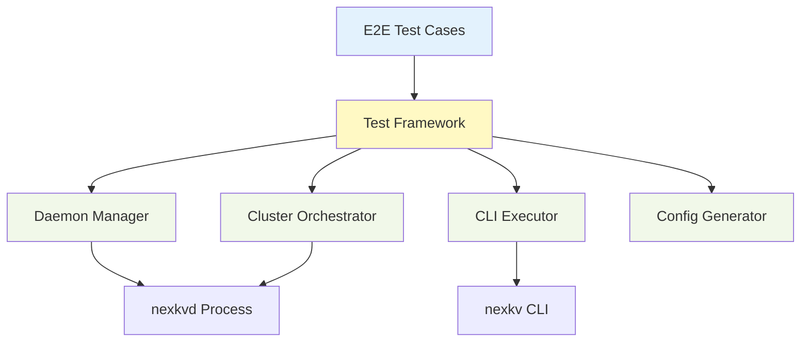

# E2E 测试架构设计

> **文档版本**: v1.0
> **创建日期**: 2026-02-13
> **状态**: 🔄 草稿

---

## 1. 概述

### 1.1 设计目标

NexKV E2E（端到端）测试框架旨在验证以下核心场景：

1. **Daemon 进程生命周期管理**：nexkvd 的启动、停止、优雅关闭
2. **CLI 命令正确性**：nexkv CLI 与 daemon 交互的正确性
3. **多节点集群协同**：节点自发现、拓扑形成、Gossip 同步
4. **故障注入与自愈**：节点故障、网络分区、自动恢复
5. **并发场景稳定性**：并发写入、并发读取、混合负载
6. **性能基准验证**：单节点/集群模式下的性能指标

### 1.2 设计原则

| 原则 | 说明 | 实现方式 |
|------|------|---------|
| **渐进式验证** | 从单节点到集群，逐步增加复杂度 | 5 阶段测试策略 |
| **真实环境模拟** | 使用真实的 nexkvd 进程和 nexkv CLI | os/exec 启动进程 |
| **可重复性** | 测试结果稳定，不受环境干扰 | 独立配置目录、端口隔离 |
| **快速反馈** | 关键路径测试优先，失败快速定位 | 阶段门禁机制 |
| **可维护性** | 测试代码结构清晰，易于扩展 | 框架分层设计 |

---

## 2. 技术栈

| 组件 | 选型 | 理由 |
|------|------|------|
| **测试框架** | Go testing + testify | Go 原生，断言丰富 |
| **进程管理** | os/exec | 真实进程环境 |
| **并发控制** | sync.WaitGroup + context | 协程安全和超时控制 |
| **断言库** | testify/assert | 丰富的断言方法 |
| **Mock** | testify/mock | 依赖隔离 |

---

## 3. 分阶段测试策略



| 阶段 | 目标 | 测试数量 | 预计耗时 | 门禁条件 |
|------|------|---------|---------|---------|
| **Phase 1** | 单节点生命周期和基础命令 | 8 | 5 min | 100% 通过 |
| **Phase 2** | 多节点集群协同 | 6 | 10 min | Phase 1 通过 |
| **Phase 3** | 故障注入和自愈 | 5 | 15 min | Phase 2 通过 |
| **Phase 4** | 并发场景稳定性 | 4 | 20 min | Phase 3 通过 |
| **Phase 5** | 性能基准验证 | 3 | 30 min | Phase 4 通过 |

---

## 4. 测试框架设计

### 4.1 目录结构

```
test/e2e/
├── framework/           # 测试框架
│   ├── daemon.go       # Daemon 进程管理
│   ├── cli.go          # CLI 命令执行
│   ├── cluster.go      # 集群编排
│   ├── config.go       # 配置生成
│   └── assert.go       # E2E 断言
├── phases/             # 分阶段测试
│   ├── phase1_single_node/
│   │   ├── daemon_lifecycle_test.go
│   │   └── basic_commands_test.go
│   ├── phase2_cluster/
│   │   ├── cluster_formation_test.go
│   │   └── gossip_sync_test.go
│   ├── phase3_fault_injection/
│   │   ├── node_failure_test.go
│   │   └── network_partition_test.go
│   ├── phase4_concurrency/
│   │   ├── concurrent_writes_test.go
│   │   └── mixed_workload_test.go
│   └── phase5_performance/
│       ├── single_node_perf_test.go
│       └── cluster_perf_test.go
└── README.md           # E2E 测试指南
```

### 4.2 框架分层



---

## 5. 框架核心组件

### 5.1 Daemon 进程管理

**职责**：管理 nexkvd 进程的完整生命周期

**核心接口**：
```go
type DaemonProcess struct {
    NodeID     string
    Addr       string
    ConfigPath string
    LogPath    string
    PidPath    string
    cmd        *exec.Cmd
    started    bool
}

// Start 启动 daemon 进程
func (d *DaemonProcess) Start(ctx context.Context) error

// Stop 停止 daemon 进程
func (d *DaemonProcess) Stop() error

// IsRunning 检查进程是否运行
func (d *DaemonProcess) IsRunning() bool

// healthCheck 执行健康检查
func (d *DaemonProcess) healthCheck() error
```

### 5.2 CLI 命令执行

**职责**：封装 nexkv CLI 命令执行和结果解析

**核心接口**：
```go
type CLIExecutor struct {
    daemonAddr string
    timeout    time.Duration
}

type CLIResult struct {
    ExitCode int
    Stdout   string
    Stderr   string
    Duration time.Duration
}

// Execute 执行 CLI 命令
func (e *CLIExecutor) Execute(ctx context.Context, args ...string) *CLIResult

// ClusterStatus 获取集群状态
func (e *CLIExecutor) ClusterStatus(ctx context.Context) (*CLIResult, error)

// NodeAdd 添加节点
func (e *CLIExecutor) NodeAdd(ctx context.Context, nodeID, addr string, role int) (*CLIResult, error)
```

### 5.3 集群编排

**职责**：多节点集群的启动、停止和故障注入

**核心接口**：
```go
type TestCluster struct {
    Nodes     []*DaemonProcess
    ConfigDir string
    LogDir    string
    started   bool
}

// Start 启动集群所有节点
func (c *TestCluster) Start(ctx context.Context) error

// Stop 停止集群所有节点
func (c *TestCluster) Stop() error

// KillNode 杀死指定节点（模拟故障）
func (c *TestCluster) KillNode(nodeID string) error

// RestartNode 重启指定节点
func (c *TestCluster) RestartNode(ctx context.Context, nodeID string) error
```

### 5.4 配置生成

**职责**：生成测试所需的配置文件

**核心接口**：
```go
type ConfigGenerator struct {
    BaseDir   string
    PortRange *PortRange
}

// GenerateDaemonConfig 生成 daemon 配置
func (g *ConfigGenerator) GenerateDaemonConfig(nodeID, addr string) (*DaemonConfig, error)

// GenerateClusterConfigs 生成集群配置
func (g *ConfigGenerator) GenerateClusterConfigs(nodeCount int) ([]*DaemonConfig, error)

// Cleanup 清理测试文件
func (g *ConfigGenerator) Cleanup() error
```

---

## 6. 测试用例示例

### 6.1 Phase 1: Daemon 生命周期测试

```go
func TestDaemon_StartStop(t *testing.T) {
    ctx := context.Background()
    daemon := framework.NewDaemonProcess("node-1", "127.0.0.1:7946")

    // 启动 daemon
    require.NoError(t, daemon.Start(ctx))
    assert.True(t, daemon.IsRunning())

    // 健康检查
    require.NoError(t, daemon.healthCheck())

    // 停止 daemon
    require.NoError(t, daemon.Stop())
    assert.False(t, daemon.IsRunning())
}
```

### 6.2 Phase 2: 集群形成测试

```go
func TestAllNodesRunning(t *testing.T) {
    ctx := context.Background()
    cluster := framework.NewTestCluster(3)

    // 启动集群
    require.NoError(t, cluster.Start(ctx))
    defer cluster.Stop()

    // 等待集群稳定
    require.NoError(t, cluster.WaitStable(ctx, 30*time.Second))

    // 验证所有节点在线
    cli := cluster.CLI("node-1")
    result, err := cli.ClusterStatus(ctx)
    require.NoError(t, err)
    assert.Equal(t, 3, result.OnlineNodeCount)
}
```

### 6.3 Phase 3: 节点故障测试

```go
func TestSingleNodeFailure(t *testing.T) {
    ctx := context.Background()
    cluster := framework.NewTestCluster(3)

    require.NoError(t, cluster.Start(ctx))
    defer cluster.Stop()

    // 等待集群稳定
    require.NoError(t, cluster.WaitStable(ctx, 30*time.Second))

    // 杀死一个节点
    require.NoError(t, cluster.KillNode("node-2"))

    // 验证集群检测到故障
    cli := cluster.CLI("node-1")
    result, err := cli.ClusterStatus(ctx)
    require.NoError(t, err)
    assert.Equal(t, 2, result.OnlineNodeCount)

    // 重启节点
    require.NoError(t, cluster.RestartNode(ctx, "node-2"))

    // 验证节点恢复
    assert.Eventually(t, func() bool {
        result, _ := cli.ClusterStatus(ctx)
        return result.OnlineNodeCount == 3
    }, 30*time.Second, 1*time.Second)
}
```

---

## 7. Makefile 集成

```makefile
# E2E 测试目标
.PHONY: test-e2e test-e2e-phase1 test-e2e-phase2 test-e2e-phase3 test-e2e-phase4 test-e2e-phase5

test-e2e: ## 运行所有 E2E 测试
	@echo "运行 E2E 测试..."
	@go test -v -timeout 1h ./test/e2e/...

test-e2e-phase1: ## 运行 Phase 1 测试
	@echo "运行 Phase 1: 单节点基础测试..."
	@go test -v -timeout 10m ./test/e2e/phases/phase1_single_node/...

test-e2e-phase2: ## 运行 Phase 2 测试
	@echo "运行 Phase 2: 多节点集群测试..."
	@go test -v -timeout 20m ./test/e2e/phases/phase2_cluster/...

test-e2e-phase3: ## 运行 Phase 3 测试
	@echo "运行 Phase 3: 故障注入测试..."
	@go test -v -timeout 30m ./test/e2e/phases/phase3_fault_injection/...

test-e2e-phase4: ## 运行 Phase 4 测试
	@echo "运行 Phase 4: 并发场景测试..."
	@go test -v -timeout 30m ./test/e2e/phases/phase4_concurrency/...

test-e2e-phase5: ## 运行 Phase 5 测试
	@echo "运行 Phase 5: 性能测试..."
	@go test -v -timeout 1h ./test/e2e/phases/phase5_performance/...
```

---

## 8. CI 集成

```yaml
# .github/workflows/e2e-test.yml
name: E2E Tests

on:
  push:
    branches: [main, develop]
  pull_request:
    branches: [main, develop]

jobs:
  e2e-phase1:
    runs-on: ubuntu-latest
    steps:
      - uses: actions/checkout@v3
      - uses: actions/setup-go@v4
        with:
          go-version: '1.21'
      - name: Build binaries
        run: make build
      - name: Run Phase 1 tests
        run: make test-e2e-phase1

  e2e-phase2:
    runs-on: ubuntu-latest
    needs: e2e-phase1
    steps:
      - uses: actions/checkout@v3
      - uses: actions/setup-go@v4
        with:
          go-version: '1.21'
      - name: Build binaries
        run: make build
      - name: Run Phase 2 tests
        run: make test-e2e-phase2

  # ... Phase 3-5 类似
```

---

## 9. 实施计划

| 阶段 | 任务 | 预计工作量 |
|------|------|-----------|
| **Week 1** | 框架搭建 + Phase 1 测试 | 3 天 |
| **Week 2** | Phase 2 测试 + Phase 3 测试 | 4 天 |
| **Week 3** | Phase 4 测试 + Phase 5 测试 | 3 天 |

---

## 10. 附录

### 10.1 端口分配

| 用途 | 端口范围 |
|------|---------|
| **Daemon RPC** | 19000-19999 |
| **Daemon Gossip** | 20000-20999 |

### 10.2 超时配置

| 操作 | 默认超时 |
|------|---------|
| **Daemon 启动** | 10s |
| **健康检查** | 5s |
| **集群稳定** | 30s |
| **CLI 命令** | 5s |

---

**文档版本**: v1.0
**创建日期**: 2026-02-13
**维护者**: 🤖 AI 核心开发
**状态**: 🔄 草稿
