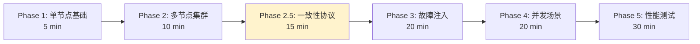

# PR-061: E2E 测试框架设计与实现

> **PR 类型**: 📋 Feature（功能开发）
> **创建日期**: 2026-02-13
> **关联问题**: 独立需求，提升 NexKV 分布式测试能力
> **Pre 文档状态**: ⏳ 待架构师评审
> **文档版本**: v2.0（文档优先策略）

---

## 📌 重要说明（v2.0）

### 文档优先策略

**这是一个大型项目**，预计实施周期 4 周（20 个工作日），涉及：
- 6 个测试阶段（Phase 1 → Phase 2 → Phase 2.5 → Phase 3 → Phase 4 → Phase 5）
- 7 个框架组件（Daemon、CLI、Cluster、Config、Network、Metrics、Verifier）
- 26+ 个测试用例

**执行策略**：
1. ✅ **文档先行**：先完成完整的技术设计和评审，暂不编写代码
2. 🔄 **分阶段讨论**：分 3 个阶段进行技术评审，确保方案可行
3. 📝 **迭代完善**：根据评审意见迭代文档，直到架构师认可
4. 💻 **代码后置**：文档完全批准后，再开始编码实现

**当前阶段**：📋 **Phase 1 - 基础设计文档评审**

---

## 1. 需求概述

### 1.1 背景

NexKV 项目目前缺少端到端（E2E）测试，无法验证：
- nexkvd daemon 进程的完整生命周期
- nexkv CLI 与 daemon 的交互正确性
- 多节点集群的协同工作
- 一致性协议（Gossip、Quorum、2PC）的正确性
- 故障场景下的自愈能力
- 分布式数据一致性

### 1.2 目标

设计并实现一套**生产级** E2E 测试框架，支持：
1. **6 阶段渐进式验证**：从单节点到性能测试
2. **真实环境模拟**：启动真实进程，无 Mock
3. **一致性协议专项测试**：Gossip、Quorum、2PC 完整覆盖
4. **故障注入能力**：网络分区、节点崩溃、流延迟
5. **分布式一致性验证**：三层验证架构
6. **可扩展架构**：易于添加新测试用例

### 1.3 预期产出

- E2E 测试框架代码（`test/e2e/framework/`）
- Phase 1-5 测试用例实现（26+ 测试）
- Makefile 集成
- CI 配置
- 完整文档（架构设计、使用指南、故障排查）

---

## 2. 设计方案

### 2.1 技术栈

| 组件 | 选型 | 理由 |
|------|------|------|
| **测试框架** | Go testing + testify | Go 原生，断言丰富 |
| **进程管理** | os/exec | 真实进程环境 |
| **并发控制** | sync.WaitGroup + context | 协程安全 |
| **故障注入** | libp2p Native API | 无需 root 权限 |
| **数据验证** | 三层架构（核心+调试+排查） | 分层验证，职责清晰 |

### 2.2 分阶段测试策略



**Phase 2.5: 一致性协议专项测试**（核心亮点）

| 测试用例 | 验证目标 | 预计耗时 |
|---------|---------|---------|
| **Gossip 测试** | | |
| TestGossipConvergence7Nodes | 7 节点 Gossip 收敛 < 50s | 2 min |
| TestGossipWithNodeFailure | 节点故障时 Gossip 继续工作 | 2 min |
| TestGossipWithNetworkDelay | 网络延迟时的 Gossip 收敛 | 2 min |
| **Quorum 测试** | | |
| TestQuorumMajority | 3 节点 Quorum 达成 | 1 min |
| TestQuorumMinorityBlock | 2/5 节点无法达成 Quorum | 1 min |
| TestQuorumTimeout | Quorum 超时回滚 | 2 min |
| TestQuorumSplitBrain | 脑裂场景验证 | 3 min |
| TestQuorumWithPartialFailure | 部分节点故障时的 Quorum | 2 min |
| **2PC 测试** | | |
| Test2PCAllCommit | 所有节点提交 | 2 min |
| Test2PCOneRollback | 一个节点回滚 | 2 min |
| Test2PCCoordinatorCrash | 协调者崩溃后恢复 | 3 min |
| Test2PCParticipantCrash | 参与者崩溃后补偿 | 3 min |
| Test2PCGossipSync | 2PC 状态 Gossip 同步 | 2 min |

### 2.3 框架分层设计

```
test/e2e/
├── framework/           # 测试框架
│   ├── daemon.go       # Daemon 进程管理
│   ├── cli.go          # CLI 命令执行
│   ├── cluster.go      # 集群编排
│   ├── config.go       # 配置生成
│   ├── network.go      # 网络控制（libp2p 故障注入）
│   ├── metrics.go      # 指标采集
│   ├── log_analyzer.go # 日志分析
│   ├── data_verifier.go # 数据一致性验证
│   └── assert.go       # E2E 断言
├── phases/             # 分阶段测试
│   ├── phase1_single_node/
│   ├── phase2_cluster/
│   ├── phase2_5_consistency/  # 一致性协议专项
│   ├── phase3_fault_injection/
│   ├── phase4_concurrency/
│   └── phase5_performance/
├── scripts/            # 辅助脚本
│   ├── cleanup.sh      # 清理僵尸进程
│   ├── setup_env.sh    # 环境准备
│   └── verify_consistency.sh  # 一致性验证
└── README.md           # 使用指南
```

---

## 3. 分阶段技术评审

### 3.1 Phase 1：基础设计文档评审（当前阶段）

**评审范围**：
- [x] 6 阶段测试策略设计
- [x] 框架分层架构
- [x] Phase 2.5 测试用例设计
- [x] 技术栈选型
- [x] 目录结构规划

**评审要点**：
- 测试覆盖度是否满足需求？
- 架构设计是否合理？
- Phase 2.5 独立成阶段是否必要？
- 技术选型是否合适？

### 3.2 Phase 2：核心技术方案评审（待启动）

**评审范围**：
- [ ] 网络控制实现方案（libp2p 故障注入）
- [ ] 分布式一致性验证方案（三层架构）
- [ ] 性能基准定义
- [ ] 实施周期规划

**评审要点**：
- libp2p API 是否满足故障注入需求？
- 三层验证架构是否可行？
- 性能指标是否合理？
- 4 周周期是否可行？

### 3.3 Phase 3：实施细节评审（待启动）

**评审范围**：
- [ ] 单 PR + 分阶段提交策略
- [ ] 风险缓解措施
- [ ] CI 集成方案
- [ ] 文档交付清单

**评审要点**：
- 单 PR 策略是否合适？
- 风险是否可控？
- CI 配置是否完整？
- 交付物是否齐全？

---

## 4. 核心技术方案

### 4.1 网络控制实现方案（基于 libp2p）

**设计目标**：无需 root 权限，支持 5 种核心故障类型

| 故障类型 | 实现方式 | 验证目标 |
|---------|---------|---------|
| **连接断开** | `conn.Close()` | 重连机制 |
| **流关闭** | `stream.Close()` | 通信容错 |
| **流延迟** | 包装 `Stream` 注入延迟 | 超时处理 |
| **协议失败** | 使用不存在的协议 ID | 协议兼容性 |
| **节点下线** | `host.Close()` | 故障感知 |

**故障注入器接口设计**：

```go
// Libp2pFaultInjector libp2p 故障注入器
type Libp2pFaultInjector struct {
    host    libp2p.Host
    enabled bool
}

// 故障类型
type FaultType int

const (
    FaultConnClose  FaultType = iota // 连接关闭
    FaultStreamClose                  // 流关闭
    FaultStreamLatency                // 流延迟
    FaultProtocolNegotiationFailed   // 协议协商失败
    FaultNodeCrash                    // 节点崩溃
)

// InjectFault 注入故障
func (fi *Libp2pFaultInjector) InjectFault(
    faultType FaultType,
    target peer.ID,
    params ...interface{},
) error
```

### 4.2 分布式一致性验证方案

**设计目标**：三层验证架构，覆盖自动化测试、调试、排查场景

| 层级 | 核心能力 | 适用场景 |
|------|---------|---------|
| **核心层** | 自动化一致性校验、异常告警 | 生产监控、自动化测试 |
| **调试层** | 手动快速验证、指定范围校验 | 开发调试、临时问题排查 |
| **排查层** | 日志采集分析、根因定位 | 一致性异常复盘、合规审计 |

**核心组件设计**：

```go
// DataVerifier 数据一致性验证器
type DataVerifier struct {
    clients []DataClient // 待验证节点的客户端列表
    timeout time.Duration
    convergeWait time.Duration  // 收敛等待时间
}

// DataClient 通用数据客户端接口（业务侧适配）
type DataClient interface {
    GetID() string                 // 节点唯一标识
    GetState(ctx context.Context) (map[string]interface{}, error)
    GetUpdateSeq(ctx context.Context) (uint64, error)
}

// ConsistencyResult 一致性验证结果
type ConsistencyResult struct {
    Consistent     bool                   // 是否一致
    TotalNodes     int                    // 总节点数
    ConsistentNodes int                   // 一致节点数
    InconsistentNodes []string            // 不一致节点列表
    Details        map[string]interface{} // 详细信息
}

// VerifyFinalConsistency 验证最终一致性
func (dv *DataVerifier) VerifyFinalConsistency(
    ctx context.Context,
) *ConsistencyResult
```

**CLI 工具命令**：

```bash
# 验证所有节点的一致性
nexkv-e2e verify --all --timeout 30s

# 验证指定键的一致性
nexkv-e2e verify --keys key1,key2 --nodes node-1,node-2,node-3

# 实时监控一致性状态
nexkv-e2e verify --watch --interval 10s
```

### 4.3 性能基准定义

| 场景类型 | 吞吐量阈值 | 延迟阈值 | 资源占用 |
|---------|-----------|---------|---------|
| **开发调试（CLI）** | ≥50 批次/分钟 | ≤500ms avg, ≤1s P99 | CPU≤20%, 内存≤512MB |
| **自动化测试** | ≥1000 任务/小时 | ≤1s avg, ≤3s P99 | CPU≤20%, 内存≤512MB |
| **生产定时校验** | ≤10 分钟/次完成 | - | CPU≤20%, 内存≤512MB |

---

## 5. 实施计划

### 5.1 4 周分阶段计划

| 周次 | 内容 | 详细任务分解 |
|------|------|-------------|
| **Week 1** | 框架基础设施 + Phase 1 | Day 1-2: 配置生成、端口管理<br/>Day 3-4: Daemon 完善、健康检查<br/>Day 5: Phase 1 测试 |
| **Week 2** | Phase 2 + Phase 2.5 | Day 1-2: 集群编排、网络控制<br/>Day 3: Phase 2 基础测试<br/>Day 4-5: Phase 2.5 一致性协议测试 |
| **Week 3** | Phase 3 + Phase 4 | Day 1-2: Phase 3 故障注入<br/>Day 3: Phase 4 并发测试<br/>Day 4-5: 2PC 测试完善 |
| **Week 4** | Phase 5 + CI 集成 | Day 1-2: Phase 5 性能测试<br/>Day 3: CI 集成<br/>Day 4-5: 文档完善、Code Review |

### 5.2 单 PR + 分阶段提交策略

| 提交阶段 | 时间节点 | 提交内容 | 评审重点 |
|----------|---------|---------|---------|
| 阶段1 | 第 1 周结束 | 验证组件基础接口、CLI 工具雏形 | 接口解耦性、CLI 核心功能可用性 |
| 阶段2 | 第 2 周结束 | 场景适配核心逻辑（分区/冲突校验）、日志模板 | 校验逻辑准确性、日志结构化程度 |
| 阶段3 | 第 3 周中 | 监控告警对接、日志分析脚本 | 告警触发准确性、脚本执行效率 |
| 阶段4 | 第 3 周结束 | CI/CD 集成示例、定时任务配置 | 集成无侵入、定时任务稳定性 |
| 阶段5 | 第 4 周中 | 自动化报表基础版本、全量联调代码 | 端到端流程完整性、性能指标达标 |
| 最终提交 | 第 4 周结束 | 全量代码合并、文档定稿 | 代码规范、交付物完整性、性能阈值达标 |

---

## 6. 风险评估

| 风险 | 概率 | 影响 | 缓解措施 |
|------|------|------|---------|
| **进程清理不彻底** | 高 | 僵尸进程、端口占用 | 进程池 + 强制清理脚本 |
| **测试不稳定** | 中 | CI 频繁失败 | 重试机制、优化超时 |
| **框架实现复杂** | 高 | 延期完成 | 先完成最小可用版本 |
| **网络控制实现困难** | 中 | Phase 2.5 延期 | 使用 libp2p API（已验证可行） |
| **文档迭代周期长** | 中 | 影响开发进度 | 分 3 阶段评审，快速迭代 |

---

## 7. 验收标准

### 7.1 最小可用版本（MVP）

- [ ] 框架基础设施完整（配置生成、健康检查、CLI 解析）
- [ ] Phase 1 测试用例全部通过（8/8）
- [ ] `make test-e2e-phase1` 可运行

### 7.2 Phase 2 验收标准

- [ ] 多节点集群形成测试通过
- [ ] 节点发现测试通过
- [ ] 拓扑形成测试通过

### 7.3 Phase 2.5 验收标准（核心亮点）

**Gossip 测试**:
- [ ] 7 节点 Gossip 收敛时间 < 50s
- [ ] 节点故障时 Gossip 继续工作
- [ ] 网络延迟下 Gossip 最终收敛

**Quorum 测试**:
- [ ] 3 节点 Quorum 多数派达成
- [ ] 2/5 节点无法达成 Quorum（阻塞）
- [ ] Quorum 超时正确回滚
- [ ] 脑裂场景下少数派独立运行
- [ ] 部分节点故障时 Quorum 行为正确

**2PC 测试**:
- [ ] 所有节点正常提交
- [ ] 单个节点回滚不影响其他节点
- [ ] 协调者崩溃后可恢复
- [ ] 参与者崩溃后可补偿
- [ ] 2PC 状态通过 Gossip 同步

### 7.4 完整版本

- [ ] Phase 1-5 测试用例全部通过
- [ ] `make test-e2e` 可运行
- [ ] CI 集成完成
- [ ] 性能指标达标

---

## 8. 参考资料

- **设计文档**: `docs/04_test/07_E2E测试架构设计.md`
- **项目架构**: `docs/CLAUDE.md`
- **三层架构**: `docs/00_overview/core-architecture-concept.md`
- **工作流程**: `docs/workflow.md`

---

## 9. 评审记录

### 9.1 Phase 1 评审：基础设计文档（待启动）

**评审状态**: ⏳ 待评审

**评审要点**:
- [ ] 6 阶段测试策略覆盖度
- [ ] 框架分层架构合理性
- [ ] Phase 2.5 独立成阶段必要性
- [ ] 技术选型合适性

### 9.2 Phase 2 评审：核心技术方案（待启动）

**评审状态**: ⏳ 待启动

**评审要点**:
- [ ] libp2p API 可行性
- [ ] 三层验证架构合理性
- [ ] 性能指标合理性
- [ ] 4 周周期可行性

### 9.3 Phase 3 评审：实施细节（待启动）

**评审状态**: ⏳ 待启动

**评审要点**:
- [ ] 单 PR 策略合适性
- [ ] 风险可控性
- [ ] CI 配置完整性
- [ ] 交付物齐全性

---

## 10. 变更记录

| 版本 | 日期 | 变更内容 |
|------|------|---------|
| v1.0 | 2026-02-13 | 初始版本 |
| v1.1-v1.5 | 2026-02-13 | 多次迭代，完善技术方案 |
| v2.0 | 2026-02-13 | **文档优先策略**<br/>- 移除所有现有代码<br/>- 分 3 阶段技术评审<br/>- 强调文档先行<br/>- 当前处于 Phase 1 评审阶段 |

---

**文档版本**: v2.0
**创建日期**: 2026-02-13
**修订日期**: 2026-02-13
**创建者**: 🤖 AI 核心开发
**状态**: ⏳ **Phase 1 - 基础设计文档评审**
