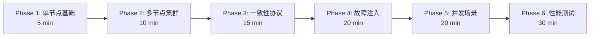

# PR-061: E2E 测试框架设计与实现

> **PR 类型**: 📋 Feature（功能开发）
> **创建日期**: 2026-02-13
> **关联问题**: 独立需求，提升 NexKV 分布式测试能力
> **Pre 文档状态**: ⏳ 待架构师评审
> **文档版本**: v3.0（分阶段文档）

---

## 📌 文档结构（v3.0）

为便于分阶段评审和实施，PR-061 Pre 文档已拆分为以下独立文档：

### 主文档（本文件）
- 需求概述
- 技术栈
- 分阶段测试策略概览
- 总体实施计划
- 风险评估
- 变更记录

### 阶段文档

| 阶段 | 文档 | 内容 |
|------|------|------|
| **Phase 1** | [phase1.md](./2026-02-13_PR-061_e2e-testing-phase1.md) | 单节点基础测试 |
| **Phase 2** | [phase2.md](./2026-02-13_PR-061_e2e-testing-phase2.md) | 多节点集群测试 |
| **Phase 3** | [phase3.md](./2026-02-13_PR-061_e2e-testing-phase3.md) | 一致性协议测试 |
| **Phase 4** | [phase4.md](./2026-02-13_PR-061_e2e-testing-phase4.md) | 故障注入测试 |
| **Phase 5** | [phase5.md](./2026-02-13_PR-061_e2e-testing-phase5.md) | 并发场景测试 |
| **Phase 6** | [phase6.md](./2026-02-13_PR-061_e2e-testing-phase6.md) | 性能测试 |

---

## 1. 需求概述

### 1.1 背景

NexKV 项目目前缺少端到端（E2E）测试，无法验证：
- nexkvd daemon 进程的完整生命周期
- nexkv CLI 与 daemon 的交互正确性
- 多节点集群的协同工作
- 一致性协议（Gossip、Quorum、2PC）的正确性
- 故障场景下的自愈能力
- 分布式数据一致性

### 1.2 目标

设计并实现一套**生产级** E2E 测试框架，支持：
1. **6 阶段渐进式验证**：从单节点到性能测试
2. **真实环境模拟**：启动真实进程，无 Mock
3. **一致性协议专项测试**：Gossip、Quorum、2PC 完整覆盖
4. **故障注入能力**：网络分区、节点崩溃、流延迟
5. **分布式一致性验证**：三层验证架构
6. **可扩展架构**：易于添加新测试用例

### 1.3 预期产出

- E2E 测试框架代码（`test/e2e/framework/`）
- Phase 1-5 测试用例实现（26+ 测试）
- Makefile 集成
- CI 配置
- 完整文档（架构设计、使用指南、故障排查）

---

## 2. 分阶段测试策略



**阶段概览**：

| 阶段 | 目标 | 测试数量 | 预计耗时 | 文档 |
|------|------|---------|---------|------|
| **Phase 1** | 单节点基础 | 8 | 5 min | [phase1.md](./2026-02-13_PR-061_e2e-testing-phase1.md) |
| **Phase 2** | 多节点集群 | 7 | 10 min | [phase2.md](./2026-02-13_PR-061_e2e-testing-phase2.md) |
| **Phase 3** | 一致性协议 | 13 | 15 min | [phase3.md](./2026-02-13_PR-061_e2e-testing-phase3.md) |
| **Phase 4** | 故障注入 | 5 | 20 min | [phase4.md](./2026-02-13_PR-061_e2e-testing-phase4.md) |
| **Phase 5** | 并发场景 | 3 | 20 min | [phase5.md](./2026-02-13_PR-061_e2e-testing-phase5.md) |
| **Phase 6** | 性能测试 | 3 | 30 min | [phase6.md](./2026-02-13_PR-061_e2e-testing-phase6.md) |

---

## 3. 技术栈

| 组件 | 选型 | 理由 |
|------|------|------|
| **测试框架** | Go testing + testify | Go 原生，断言丰富 |
| **进程管理** | os/exec | 真实进程环境 |
| **并发控制** | sync.WaitGroup + context | 协程安全 |
| **故障注入** | libp2p Native API | 无需 root 权限 |
| **数据验证** | 三层架构（核心+调试+排查） | 分层验证，职责清晰 |

---

## 4. 框架分层设计

```
test/e2e/
├── framework/           # 测试框架
│   ├── daemon.go       # Daemon 进程管理
│   ├── cli.go          # CLI 命令执行
│   ├── cluster.go      # 集群编排
│   ├── config.go       # 配置生成
│   ├── network.go      # 网络控制（libp2p 故障注入）
│   ├── metrics.go      # 指标采集
│   ├── log_analyzer.go # 日志分析
│   ├── data_verifier.go # 数据一致性验证
│   └── assert.go       # E2E 断言
├── phases/             # 分阶段测试
│   ├── phase1_single_node/
│   ├── phase2_cluster/
│   ├── phase3_consistency/
│   ├── phase3_fault_injection/
│   ├── phase4_concurrency/
│   └── phase5_performance/
├── scripts/            # 辅助脚本
│   ├── cleanup.sh      # 清理僵尸进程
│   ├── setup_env.sh    # 环境准备
│   └── verify_consistency.sh  # 一致性验证
└── README.md           # 使用指南
```

---

## 5. 实施计划

### 5.1 4 周分阶段计划

| 周次 | 内容 | 详细任务分解 |
|------|------|-------------|
| **Week 1** | 框架基础设施 + Phase 1 | Day 1-2: 配置生成、端口管理<br/>Day 3-4: Daemon 完善、健康检查<br/>Day 5: Phase 1 测试 |
| **Week 2** | Phase 2 + Phase 3.1 | Day 1-2: 集群编排、网络控制<br/>Day 3: Phase 2 基础测试<br/>Day 4-5: Phase 3.1 一致性协议测试 |
| **Week 3** | Phase 3.2 + Phase 4 | Day 1-2: Phase 3.2 故障注入<br/>Day 3: Phase 4 并发测试<br/>Day 4-5: 2PC 测试完善 |
| **Week 4** | Phase 5 + CI 集成 | Day 1-2: Phase 5 性能测试<br/>Day 3: CI 集成<br/>Day 4-5: 文档完善、Code Review |

### 5.2 单 PR + 分阶段提交策略

| 提交阶段 | 时间节点 | 提交内容 | 评审重点 |
|----------|---------|---------|---------|
| 阶段1 | 第 1 周结束 | 验证组件基础接口、CLI 工具雏形 | 接口解耦性、CLI 核心功能可用性 |
| 阶段2 | 第 2 周结束 | 场景适配核心逻辑（分区/冲突校验）、日志模板 | 校验逻辑准确性、日志结构化程度 |
| 阶段3 | 第 3 周中 | 监控告警对接、日志分析脚本 | 告警触发准确性、脚本执行效率 |
| 阶段4 | 第 3 周结束 | CI/CD 集成示例、定时任务配置 | 集成无侵入、定时任务稳定性 |
| 阶段5 | 第 4 周中 | 自动化报表基础版本、全量联调代码 | 端到端流程完整性、性能指标达标 |
| 最终提交 | 第 4 周结束 | 全量代码合并、文档定稿 | 代码规范、交付物完整性、性能阈值达标 |

---

## 6. 风险评估

| 风险 | 概率 | 影响 | 缓解措施 |
|------|------|------|---------|
| **进程清理不彻底** | 高 | 僵尸进程、端口占用 | 进程池 + 强制清理脚本 |
| **测试不稳定** | 中 | CI 频繁失败 | 重试机制、优化超时 |
| **框架实现复杂** | 高 | 延期完成 | 先完成最小可用版本 |
| **网络控制实现困难** | 中 | Phase 3.1 延期 | 使用 libp2p API（已验证可行） |
| **文档迭代周期长** | 中 | 影响开发进度 | 分 3 阶段评审，快速迭代 |

---

## 7. 分阶段技术评审

### 7.1 Phase 1：基础设计文档评审（当前阶段）

**评审范围**：
- [x] 6 阶段测试策略设计
- [x] 框架分层架构
- [x] Phase 3.1 测试用例设计
- [x] 技术栈选型
- [x] 目录结构规划

**评审要点**：
- 测试覆盖度是否满足需求？
- 架构设计是否合理？
- Phase 3.1 独立成阶段是否必要？
- 技术选型是否合适？

### 7.2 Phase 2：核心技术方案评审（待启动）

**评审范围**：
- [ ] 网络控制实现方案（libp2p 故障注入）
- [ ] 分布式一致性验证方案（三层架构）
- [ ] 性能基准定义
- [ ] 实施周期规划

**评审要点**：
- libp2p API 是否满足故障注入需求？
- 三层验证架构是否可行？
- 性能指标是否合理？
- 4 周周期是否可行？

### 7.3 Phase 3：实施细节评审（待启动）

**评审范围**：
- [ ] 单 PR + 分阶段提交策略
- [ ] 风险缓解措施
- [ ] CI 集成方案
- [ ] 文档交付清单

**评审要点**：
- 单 PR 策略是否合适？
- 风险是否可控？
- CI 配置是否完整？
- 交付物是否齐全？

---

## 8. 参考资料

- **设计文档**: `docs/04_test/07_E2E测试架构设计.md`
- **项目架构**: `docs/CLAUDE.md`
- **三层架构**: `docs/00_overview/core-architecture-concept.md`
- **工作流程**: `docs/workflow.md`

---

## 9. 评审记录

### 9.1 Phase 1 评审：基础设计文档（待启动）

**评审状态**: ⏳ 待评审

**评审要点**:
- [ ] 6 阶段测试策略覆盖度
- [ ] 框架分层架构合理性
- [ ] Phase 3.1 独立成阶段必要性
- [ ] 技术选型合适性

---

## 10. 变更记录

| 版本 | 日期 | 变更内容 |
|------|------|---------|
| v1.0 | 2026-02-13 | 初始版本 |
| v1.1-v1.5 | 2026-02-13 | 多次迭代，完善技术方案 |
| v2.0 | 2026-02-13 | 文档优先策略 - 移除代码，分 3 阶段评审 |
| v3.0 | 2026-02-13 | **分阶段文档** - 拆分为独立阶段文档 |

---

**文档版本**: v3.0
**创建日期**: 2026-02-13
**修订日期**: 2026-02-13
**创建者**: 🤖 AI 核心开发
**状态**: ⏳ **Phase 1 - 基础设计文档评审**
