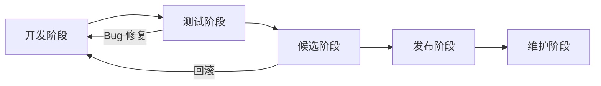

# RD - 版本发布文档

> **文档版本**: v1.0
> **创建日期**: 2026-01-18
> **状态**: ✅ 已批准

---

## 📋 概述

本文档定义 NexKV 项目的版本发布流程、版本管理策略和发布规范，确保版本发布的质量和可控性。

---

## 1. 版本管理

### 1.1 版本号规范

#### 语义化版本

NexKV 采用 **Semantic Versioning 2.0.0** 规范：

```
MAJOR.MINOR.PATCH

示例: 1.2.3
  ┬  ┬  ┬
  │  │  └─ PATCH: Bug 修复（向后兼容）
  │  └──── MINOR: 新功能（向后兼容）
  └─────── MAJOR: 破坏性变更（不向后兼容）
```

#### 版本号规则

| 版本类型 | 触发条件 | 示例 |
|---------|---------|------|
| **MAJOR** | API 变更、数据结构变更、协议不兼容 | 1.0.0 → 2.0.0 |
| **MINOR** | 新功能、新接口、性能优化 | 1.0.0 → 1.1.0 |
| **PATCH** | Bug 修复、安全补丁、文档更新 | 1.0.0 → 1.0.1 |

#### 预发布版本

```
1.0.0-alpha.1    # Alpha 版本（内部测试）
1.0.0-beta.1     # Beta 版本（公开测试）
1.0.0-rc.1       # Release Candidate（候选发布版）
1.0.0            # 正式发布版本
```

#### 开发版本

```
1.0.0-dev.20260118    # 开发版本（日期戳）
1.0.0-SNAPSHOT        # 快照版本（未稳定）
```

---

### 1.2 版本兼容性

#### API 兼容性矩阵

| 版本范围 | 兼容性 | 升级方式 | 回滚方式 |
|---------|--------|---------|---------|
| **1.x.y → 1.x.z** | ✅ 完全兼容 | 直接升级 | 直接回滚 |
| **1.x.y → 1.(x+1).0** | ✅ 功能兼容 | 滚动升级 | 支持回滚 |
| **1.x.y → 2.0.0** | ⚠️ 可能不兼容 | 数据迁移 | 不支持 |

#### 数据兼容性

| 数据类型 | 兼容性 | 迁移工具 |
|---------|--------|---------|
| **元数据** | ✅ 向后兼容 | 自动迁移 |
| **分片数据** | ✅ 向后兼容 | WAL 回放 |
| **配置文件** | ⚠️ 部分兼容 | 配置转换 |

#### 协议兼容性

| 协议版本 | 兼容性 | 说明 |
|---------|--------|------|
| **Frame v1** | ✅ 稳定 | 基础协议格式 |
| **Frame v2** | 🚧 实验中 | 压缩支持 |

---

## 2. 发布流程

### 2.1 发布周期

#### 发布类型

| 发布类型 | 频率 | 测试周期 | 发布范围 |
|---------|-----|---------|---------|
| **Major** | 6-12 个月 | 4-6 周 | 全量发布 |
| **Minor** | 1-3 个月 | 2-4 周 | 全量发布 |
| **Patch** | 按需 | 1 周 | 按需发布 |
| **Hotfix** | 紧急 | 1-2 天 | 紧急修复 |

#### 发布日历

```
季度发布（Minor）:
  Q1: 3月最后一周
  Q2: 6月最后一周
  Q3: 9月最后一周
  Q4: 12月最后一周

年度发布（Major）:
  每年 1-2 次，根据功能积累情况
```

---

### 2.2 发布阶段

#### 阶段划分



#### 阶段说明

| 阶段 | 名称 | 持续时间 | 主要活动 | 退出条件 |
|------|-----|---------|---------|---------|
| **1** | 开发阶段 | 2-8 周 | 功能开发、单元测试 | 单元测试通过 |
| **2** | 测试阶段 | 2-4 周 | 集成测试、性能测试 | 所有测试通过 |
| **3** | 候选阶段 | 1-2 周 | RC 版本测试、用户验收 | 无 P0/P1 Bug |
| **4** | 发布阶段 | 1 天 | 版本标记、构建发布 | 发布完成 |
| **5** | 维护阶段 | 持续 | Bug 修复、补丁发布 | 下一个大版本 |

---

### 2.3 发布流程详解

#### 2.3.1 发布准备

**创建发布分支**:
```bash
# 从 main 分支创建发布分支
git checkout -b release/1.2.0 main

# 更新版本号
vim internal/version/version.go
# 修改: const Version = "1.2.0"

# 提交版本变更
git add internal/version/version.go
git commit -m "chore: bump version to 1.2.0"
```

**更新 CHANGELOG**:
```bash
# 生成 CHANGELOG 草稿
git log --pretty=format:"- %s" $(git describe --tags --abbrev=0)..HEAD > CHANGELOG.md.new

# 编辑 CHANGELOG
vim CHANGELOG.md
```

---

#### 2.3.2 代码冻结

**冻结规则**:
- 停止合并新功能
- 仅接受 Bug 修复
- 所有 PR 必须通过 Code Review
- 所有测试必须通过

**冻结检查**:
```bash
# 确认无待合并 PR
gh pr list --state open --base release/1.2.0

# 确认测试通过
go test ./... -v
make benchmark
```

---

#### 2.3.3 候选版本（RC）

**创建 RC 标签**:
```bash
# 创建 RC 标签
git tag -a v1.2.0-rc.1 -m "Release Candidate 1.2.0-rc.1"
git push origin v1.2.0-rc.1
```

**RC 测试**:
```bash
# 编译 RC 版本
make build VERSION=1.2.0-rc.1

# 部署到测试环境
# 运行完整测试套件
# 邀请用户参与测试
```

**RC 评估**:
- 收集测试反馈
- 修复发现的 Bug
- 评估发布就绪度
- 决定：发布或继续 RC

---

#### 2.3.4 正式发布

**创建发布标签**:
```bash
# 合并 release 分支到 main
git checkout main
git merge release/1.2.0

# 创建正式标签
git tag -a v1.2.0 -m "Release 1.2.0"
git push origin main --tags
```

**构建发布包**:
```bash
# 构建所有平台
make release VERSION=1.2.0

# 生成发布包
# - nexkv-1.2.0-darwin-arm64.tar.gz
# - nexkv-1.2.0-linux-amd64.tar.gz
# - nexkv-1.2.0-linux-arm64.tar.gz
# - nexkv-1.2.0-windows-amd64.zip
```

**上传发布包**:
```bash
# 计算校验和
shasum -a 256 nexkv-1.2.0-*.tar.gz > CHECKSUMS.txt

# 上传到 GitHub Releases
gh release create v1.2.0 \
  --notes-file RELEASE_NOTES.md \
  nexkv-1.2.0-darwin-arm64.tar.gz \
  nexkv-1.2.0-linux-amd64.tar.gz \
  nexkv-1.2.0-linux-arm64.tar.gz \
  nexkv-1.2.0-windows-amd64.zip \
  CHECKSUMS.txt
```

**发布通知**:
- 更新网站文档
- 发送发布公告
- 更新 CHANGELOG
- 通知维护者

---

#### 2.3.5 发布后验证

**验证清单**:
```bash
# 1. 下载发布包
wget https://github.com/jzhang405/NexKV/releases/download/v1.2.0/nexkv-1.2.0-linux-amd64.tar.gz

# 2. 验证校验和
sha256sum -c CHECKSUMS.txt

# 3. 解压并运行
tar -xzf nexkv-1.2.0-linux-amd64.tar.gz
./nexkv --version

# 4. 部署测试环境
# 5. 运行功能验证
# 6. 性能基准测试
# 7. 监控告警确认
```

---

## 3. 发布检查清单

### 3.1 代码质量

| 检查项 | 标准 | 命令 | 状态 |
|--------|------|------|------|
| **代码格式化** | 无格式错误 | `gofmt -l .` | ☐ |
| **静态检查** | 无警告 | `golangci-lint run` | ☐ |
| **单元测试** | 全部通过 | `go test ./...` | ☐ |
| **测试覆盖率** | > 75% | `go test -cover ./...` | ☐ |
| **竞态检测** | 无竞态 | `go test -race ./...` | ☐ |
| **依赖扫描** | 无漏洞 | `nancy sleuth` | ☐ |

---

### 3.2 文档完整性

| 文档 | 要求 | 状态 |
|------|------|------|
| **CHANGELOG** | 包含所有变更 | ☐ |
| **RELEASE_NOTES** | 突出重点变更 | ☐ |
| **API 文档** | 更新 API 变更 | ☐ |
| **迁移指南** | 提供升级步骤 | ☐ |
| **已知问题** | 列出已知 Bug | ☐ |

---

### 3.3 功能验证

| 功能 | 验证项 | 状态 |
|------|--------|------|
| **单机模式** | 启动、停止、基本操作 | ☐ |
| **集群模式** | 3/7/10 节点集群 | ☐ |
| **Gossip 协议** | 收敛性验证 | ☐ |
| **Quorum 机制** | 多数派确认 | ☐ |
| **2PC 事务** | 跨分片事务 | ☐ |
| **故障恢复** | 节点故障自愈 | ☐ |
| **数据迁移** | 单机↔分布式切换 | ☐ |

---

### 3.4 性能验证

| 指标 | 目标值 | 实测值 | 状态 |
|------|--------|--------|------|
| **Gossip 收敛时间** | < 10 秒 | ___ | ☐ |
| **Quorum 决策延迟** | < 50 ms | ___ | ☐ |
| **元数据查询延迟** | < 10 ms | ___ | ☐ |
| **吞吐量** | > 8000 ops/s | ___ | ☐ |

---

### 3.5 安全检查

| 检查项 | 状态 |
|--------|------|
| **敏感信息检查** | ☐ |
| **权限验证** | ☐ |
| **输入验证** | ☐ |
| **日志脱敏** | ☐ |
| **依赖漏洞扫描** | ☐ |

---

## 4. CHANGELOG 管理

### 4.1 CHANGELOG 格式

#### CHANGELOG.md 模板

```markdown
# Changelog

All notable changes to this project will be documented in this file.

The format is based on [Keep a Changelog](https://keepachangelog.com/en/1.0.0/),
and this project adheres to [Semantic Versioning](https://semver.org/spec/v2.0.0.html).

## [1.2.0] - 2026-01-18

### Added
- New feature 1
- New feature 2

### Changed
- Improved feature 1 performance by 20%
- Updated dependency X to v2.0

### Deprecated
- Old API method (will be removed in 2.0.0)

### Removed
- Removed deprecated feature

### Fixed
- Fixed bug #123
- Fixed memory leak in module X

### Security
- Fixed security vulnerability CVE-2024-xxxxx

## [1.1.0] - 2025-12-15
...

## [1.0.0] - 2025-11-01
...
```

---

### 4.2 变更分类

#### Added (新增)
- 新功能
- 新 API
- 新配置选项

#### Changed (变更)
- 功能改进
- 性能优化
- 行为变更（向后兼容）

#### Deprecated (弃用)
- 即将移除的功能
- 推荐替代方案

#### Removed (移除)
- 移除已弃用功能
- 清理 dead code

#### Fixed (修复)
- Bug 修复
- 崩溃修复
- 内存泄漏修复

#### Security (安全)
- 安全漏洞修复
- 安全加固

---

### 4.3 变更类型映射

| 提交类型 | CHANGELOG 分类 |
|---------|---------------|
| `feat` | Added |
| `perf` | Changed |
| `refactor` | Changed |
| `deprecate` | Deprecated |
| `remove` | Removed |
| `fix` | Fixed |
| `security` | Security |

---

## 5. Release Notes

### 5.1 Release Notes 模板

```markdown
# NexKV v1.2.0 Release Notes

**Release Date**: 2026-01-18
**Download**: [GitHub Releases](https://github.com/jzhang405/NexKV/releases/tag/v1.2.0)

---

## 🎉 Highlights

- **Feature 1**: Brief description
- **Feature 2**: Brief description
- **Improvement 1**: Brief description

---

## ✨ What's New

### Feature 1: Title

**Description**: Detailed description

**Benefits**:
- Benefit 1
- Benefit 2

**Usage**:
\`\`\`bash
# Example command
\`\`\`

### Feature 2: Title

...

---

## 🚀 Improvements

### Performance

- Improved metadata query performance by 30%
- Reduced Gossip convergence time by 20%

### Reliability

- Enhanced failure detection accuracy
- Improved self-healing capability

---

## 🐛 Bug Fixes

- Fixed issue where nodes could not rejoin cluster after network partition (#123)
- Fixed memory leak in Gossip sync routine (#124)
- Fixed data corruption during shard migration (#125)

---

## ⚠️ Breaking Changes

### Config File Format Change

**Before**:
\`\`\`yaml
old_config: value
\`\`\`

**After**:
\`\`\`yaml
new_config: value
\`\`\`

**Migration**: Run `nexkv migrate-config` to update config files.

---

## 📚 Migration Guide

### Upgrading from v1.1.0

1. **Backup your data**:
   \`\`\`bash
   nexkv-cli snapshot create
   \`\`\`

2. **Stop the service**:
   \`\`\`bash
   sudo systemctl stop nexkv
   \`\`\`

3. **Download and extract**:
   \`\`\`bash
   wget https://github.com/jzhang405/NexKV/releases/download/v1.2.0/nexkv-1.2.0-linux-amd64.tar.gz
   tar -xzf nexkv-1.2.0-linux-amd64.tar.gz
   \`\`\`

4. **Update config** (if needed):
   \`\`\`bash
   nexkv migrate-config --from v1.1.0 --to v1.2.0
   \`\`\`

5. **Start the service**:
   \`\`\`bash
   sudo systemctl start nexkv
   \`\`\`

6. **Verify**:
   \`\`\`bash
   nexkv-cli -addr 127.0.0.1:9211 health check
   \`\`\`

---

## 📦 Downloads

| Platform | Download | Checksum |
|----------|----------|----------|
| **macOS ARM64** | [nexkv-1.2.0-darwin-arm64.tar.gz](https://...) | SHA256: ... |
| **Linux AMD64** | [nexkv-1.2.0-linux-amd64.tar.gz](https://...) | SHA256: ... |
| **Linux ARM64** | [nexkv-1.2.0-linux-arm64.tar.gz](https://...) | SHA256: ... |
| **Windows** | [nexkv-1.2.0-windows-amd64.zip](https://...) | SHA256: ... |

---

## 🙏 Acknowledgments

Thanks to all contributors who made this release possible!

---

## 📝 Full Changelog

See [CHANGELOG.md](https://github.com/jzhang405/NexKV/blob/main/CHANGELOG.md) for complete changes.
```

---

### 5.2 Release Notes 生成

#### 使用 git-chglog

```bash
# 安装 git-chglog
go install github.com/git-chglog/git-chglog/cmd/git-chglog@latest

# 生成 Release Notes
git-chglog -o RELEASE_NOTES.md v1.2.0
```

#### 自定义脚本

```bash
#!/bin/bash
# gen-release-notes.sh

VERSION=$1
PREV_VERSION=$(git describe --tags --abbrev=0 HEAD^ 2>/dev/null || echo "")

echo "# NexKV ${VERSION} Release Notes"
echo ""
echo "**Release Date**: $(date +%Y-%m-%d)"
echo ""

# 提取变更
if [ -n "$PREV_VERSION" ]; then
  echo "## Changes since ${PREV_VERSION}"
  echo ""
  git log ${PREV_VERSION}..HEAD --pretty=format:"- %s" --reverse
else
  echo "## Changes"
  echo ""
  git log --pretty=format:"- %s" --reverse | head -20
fi
```

---

## 6. 紧急发布（Hotfix）

### 6.1 Hotfix 流程

#### 触发条件

- **P0 级 Bug**：数据丢失、安全漏洞、服务不可用
- **影响范围**：影响 > 50% 用户
- **无法绕过**：无临时解决方案

#### Hotfix 流程

```bash
# 1. 从 main 创建 hotfix 分支
git checkout -b hotfix/1.2.1 main

# 2. 修复 Bug
# ... 编写修复代码 ...

# 3. 快速测试
go test ./...
go test -race ./...

# 4. 更新版本号和 CHANGELOG
vim internal/version/version.go
vim CHANGELOG.md

# 5. 提交修复
git add .
git commit -m "fix: hotfix critical bug #123"

# 6. 创建 hotfix 标签
git tag -a v1.2.1 -m "Hotfix 1.2.1"

# 7. 合并回 main 和 develop
git checkout main
git merge hotfix/1.2.1
git push origin main --tags
```

#### Hotfix 检查清单（简化版）

- [ ] Bug 修复验证
- [ ] 单元测试通过
- [ ] 回归测试通过
- [ ] 更新 CHANGELOG
- [ ] 创建发布标签
- [ ] 发布到 GitHub Releases
- [ ] 发送安全公告（如适用）

---

## 7. 版本回滚

### 7.1 回滚决策

#### 回滚触发条件

- 发布后 24 小时内发现 P0 Bug
- 影响 > 30% 用户
- 无临时解决方案
- 回滚风险 < 继续发布风险

#### 回滚评估

| 评估项 | 问题 | 决策 |
|--------|------|------|
| **影响范围** | 多少用户受影响？ | ___ |
| **严重程度** | P0/P1/P2？ | ___ |
| **修复时间** | 修复需要多久？ | ___ |
| **回滚风险** | 数据损坏风险？ | ___ |
| **业务影响** | 业务中断时长？ | ___ |

---

### 7.2 回滚流程

#### 数据库回滚

```bash
# 1. 立即停止服务
sudo systemctl stop nexkv

# 2. 从备份恢复数据
nexkv-cli snapshot restore backup-snapshot

# 3. 验证数据完整性
nexkv-cli shard list
nexkv-cli metadata verify

# 4. 恢复旧版本二进制
mv /opt/nexkv/bin/nexkv /opt/nexkv/bin/nexkv.new
mv /opt/nexkv/bin/nexkv.old /opt/nexkv/bin/nexkv

# 5. 恢复配置
mv /opt/nexkv/conf/config.yaml /opt/nexkv/conf/config.new
mv /opt/nexkv/conf/config.yaml.old /opt/nexkv/conf/config.yaml

# 6. 启动服务
sudo systemctl start nexkv

# 7. 验证服务
nexkv-cli -addr 127.0.0.1:9211 health check
```

---

#### 代码回滚

```bash
# 1. 创建回滚分支
git checkout -b hotfix/rollback-1.2.0

# 2. 回滚到上一个版本
git revert v1.2.0

# 3. 创建修复版本
git tag -a v1.2.1 -m "Rollback release 1.2.0"

# 4. 重新发布
make release VERSION=1.2.1
```

---

### 7.3 回滚后处理

#### 事后分析

- **根因分析**：为什么需要回滚？
- **流程改进**：如何避免再次发生？
- **测试补充**：增加哪些测试用例？
- **文档更新**：更新哪些文档？

#### 修复再发布

```bash
# 在 hotfix 分支修复问题
git checkout hotfix/1.2.1
# ... 修复代码 ...

# 重新测试
go test ./...

# 创建新版本
git tag -a v1.2.2 -m "Hotfix 1.2.2"
git push origin v1.2.2
```

---

## 8. 分支策略

### 8.1 分支模型

```
main (生产分支)
  ↑
  ├── release/* (发布分支)
  │     ↑
  │     └── develop (开发分支)
  │           ↑
  │           ├── feature/* (功能分支)
  │           ├── bugfix/* (Bug 修复分支)
  │           └── hotfix/* (紧急修复分支)
  │
  └── tags (版本标签)
        ├── v1.0.0
        ├── v1.1.0
        └── v1.2.0
```

---

### 8.2 分支说明

| 分支类型 | 命名规范 | 来源 | 目标 | 生命周期 |
|---------|---------|------|------|---------|
| **main** | main | - | - | 永久 |
| **develop** | develop | main | main | 永久 |
| **feature** | feature/xxx | develop | develop | 临时 |
| **bugfix** | bugfix/xxx | develop | develop | 临时 |
| **release** | release/x.y.z | develop | main | 临时 |
| **hotfix** | hotfix/x.y.z | main | main, develop | 临时 |

---

### 8.3 分支保护

#### main 分支保护

- 禁止直接推送
- 必须通过 PR 合并
- PR 必须通过 Code Review
- PR 必须通过 CI 检查
- 至少 1 个 Approval

#### develop 分支保护

- 禁止直接推送
- 必须通过 PR 合并
- PR 必须通过 CI 检查

---

## 9. 发布工具

### 9.1 版本管理工具

#### git-chglog

```bash
# 安装
go install github.com/git-chglog/git-chglog/cmd/git-chglog@latest

# 初始化
git-chglog init

# 生成 CHANGELOG
git-chglog -o CHANGELOG.md

# 生成指定版本
git-chglog -o RELEASE_NOTES.md v1.2.0
```

---

#### semantic-release

```bash
# 安装
npm install -g semantic-release

# 配置 .releaserc
{
  "branches": ["main"],
  "plugins": [
    "@semantic-release/commit-analyzer",
    "@semantic-release/release-notes-generator",
    "@semantic-release/changelog",
    "@semantic-release/git",
    "@semantic-release/github"
  ]
}

# 自动发布（在 CI 中）
semantic-release
```

---

### 9.2 构建工具

#### Makefile

```makefile
# 版本变量
VERSION ?= $(shell git describe --tags --always --dirty)
BUILD_TIME = $(shell date +%FT%T%z)
GIT_COMMIT = $(shell git rev-parse HEAD)

# 构建标志
LDFLAGS = -ldflags \
  "-X main.Version=$(VERSION) \
   -X main.BuildTime=$(BUILD_TIME) \
   -X main.GitCommit=$(GIT_COMMIT)"

# 构建命令
build:
  go build $(LDFLAGS) -o bin/nexkv ./cmd/nexkv
  go build $(LDFLAGS) -o bin/nexkv-cli ./cmd/nexkv-cli

# 发布命令
release: build
  mkdir -p release
  tar -czf release/nexkv-$(VERSION)-darwin-arm64.tar.gz bin/nexkv bin/nexkv-cli
  tar -czf release/nexkv-$(VERSION)-linux-amd64.tar.gz bin/nexkv bin/nexkv-cli
```

---

### 9.3 GitHub Actions

#### Release Workflow

```yaml
name: Release

on:
  push:
    tags:
      - 'v*'

jobs:
  release:
    runs-on: ubuntu-latest
    steps:
      - uses: actions/checkout@v3

      - name: Set up Go
        uses: actions/setup-go@v4
        with:
          go-version: '1.23'

      - name: Run tests
        run: |
          go test ./... -v
          go test ./... -race

      - name: Build release
        run: make release

      - name: Generate checksums
        run: shasum -a 256 release/* > CHECKSUMS.txt

      - name: Create Release
        uses: softprops/action-gh-release@v1
        with:
          files: |
            release/*
            CHECKSUMS.txt
          body: |
            See [CHANGELOG.md](https://github.com/jzhang405/NexKV/blob/main/CHANGELOG.md) for details.
        env:
          GITHUB_TOKEN: ${{ secrets.GITHUB_TOKEN }}
```

---

## 10. 发布质量指标

### 10.1 质量目标

| 指标 | 目标值 | 测量方法 |
|------|--------|---------|
| **Bug 密度** | < 0.5 bugs/KLOC | Bug 统计 / 代码行数 |
| **测试覆盖率** | > 75% | go test -cover |
| **回归率** | < 5% | 回归 Bug / 总 Bug |
| **发布准时率** | > 90% | 按时发布 / 计划发布 |
| **回滚率** | < 2% | 回滚次数 / 发布次数 |

---

### 10.2 发布度量

#### 发布周期

```bash
# 计算平均发布周期
git tag --sort=-creatordate | head -10 | while read tag; do
  git log -1 --format=%ct $tag
done | awk 'NR>1{print $1-prev} {prev=$1}' | awk '{sum+=$1; count++} END {print sum/count/86400, "days"}'
```

#### Bug 趋势

```bash
# 统计每个版本的 Bug 数
for tag in $(git tag); do
  echo -n "$tag: "
  git log $tag --grep="fix" --oneline | wc -l
done
```

---

## 11. 发布沟通

### 11.1 发布公告

#### 邮件模板

```markdown
Subject: [Announcement] NexKV v1.2.0 Released

Hi NexKV Community,

We're excited to announce the release of NexKV v1.2.0!

This release includes:
- 5 new features
- 3 improvements
- 10 bug fixes
- 1 security fix

**Highlights**:
- Feature 1: Description
- Feature 2: Description

**Downloads**: https://github.com/jzhang405/NexKV/releases/tag/v1.2.0
**Documentation**: https://docs.nexkv.io/v1.2.0
**Migration Guide**: https://docs.nexkv.io/v1.2.0/migration

**Breaking Changes**: None (or list them)

**Known Issues**: None (or list them)

Please report any issues at:
https://github.com/jzhang405/NexKV/issues

Thanks for using NexKV!

NexKV Team
```

---

#### 社交媒体

```
🎉 NexKV v1.2.0 is now available!

What's new:
✨ Feature 1
✨ Feature 2
🐛 10 bug fixes

📦 Download: https://github.com/jzhang405/NexKV/releases/tag/v1.2.0

#NexKV #DistributedDatabase #Go
```

---

### 11.2 发布会议

#### 发布前会议

**时间**: 发布前 1 周
**参与者**: 👤 架构师、🤖 核心开发（Dev A/B）、🤖 测试工程师、🤖 产品经理

**议程**:
1. 功能完成情况（由🤖产品经理汇总）
2. 测试结果汇总（由🤖测试工程师汇报）
3. 已知问题评估（由👤架构师决策）
4. 发布风险分析（由👤架构师决策）
5. 发布时间确认（由👤架构师批准）
6. 回滚预案确认（由👤架构师批准）

---

#### 发布后会议

**时间**: 发布后 1 周
**参与者**: 👤 架构师、🤖 全体 AI 团队（开发、测试、DevOps、产品经理）

**议程**:
1. 发布过程回顾
2. 用户反馈汇总
3. 问题统计与分析
4. 改进建议
5. 下一版本规划

---

## 12. 版本生命周期

### 12.1 支持策略

| 版本类型 | 支持期限 | 更新类型 |
|---------|---------|---------|
| **Major (X.Y.Z)** | 12 个月 | 安全补丁 + Bug 修复 |
| **Minor (X.Y.Z)** | 6 个月 | Bug 修复 |
| **Patch (X.Y.Z)** | 3 个月 | 仅安全补丁 |

---

### 12.2 生命周期阶段

```
v1.0.0 ────── v1.1.0 ────── v1.2.0 ────── v2.0.0
  │             │             │             │
  ├─ 开发期      ├─ 开发期      ├─ 开发期      ├─ 开发期
  ├─ 稳定期      ├─ 稳定期      ├─ 稳定期      ├─ 稳定期
  ├─ 维护期      ├─ 维护期      ├─ 维护期      ├─ 维护期
  └─ EOL         └─ EOL         └─ EOL         └─ EOL
```

#### 阶段说明

| 阶段 | 持续时间 | 支持内容 |
|------|---------|---------|
| **开发期** | 2-4 个月 | 功能开发、快速迭代 |
| **稳定期** | 1-2 个月 | Bug 修复、性能优化 |
| **维护期** | 6-9 个月 | 安全补丁、关键 Bug |
| **EOL** | - | 停止支持 |

---

### 12.3 EOL 公告

#### EOL 时间表

```
v1.0.x: 2026-06-01 EOL
v1.1.x: 2026-12-01 EOL
v1.2.x: 2027-06-01 EOL
v2.0.x: 2027-12-01 EOL (预计)
```

#### EOL 通知

- **提前 3 个月**: 发布 EOL 警告
- **提前 1 个月**: 发布最后补丁版本
- **EOL 当天**: 发布 EOL 公告
- **EOL 后**: 停止更新

---

## 13. 发布检查清单总结

### 13.1 发布前检查（Pre-Release）

```markdown
## 代码质量
- [ ] 所有单元测试通过
- [ ] 测试覆盖率 > 75%
- [ ] 竞态检测通过
- [ ] 静态检查通过
- [ ] 依赖扫描通过

## 功能验证
- [ ] 单机模式测试通过
- [ ] 集群模式测试通过
- [ ] 所有 P0/P1 Bug 已修复
- [ ] 性能基准测试达标

## 文档完整性
- [ ] CHANGELOG 已更新
- [ ] RELEASE_NOTES 已编写
- [ ] API 文档已更新
- [ ] 迁移指南已提供

## 发布准备
- [ ] 版本号已更新
- [ ] Git 标签已创建
- [ ] 发布包已构建
- [ ] 校验和已计算
- [ ] Release Notes 已准备
```

---

### 13.2 发布后检查（Post-Release）

```markdown
## 发布验证
- [ ] 发布包可下载
- [ ] 校验和正确
- [ ] 文档网站已更新
- [ ] 社区公告已发布

## 监控确认
- [ ] 错误率正常
- [ ] 性能指标正常
- [ ] 无新 P0 Bug
- [ ] 用户反馈正常

## 清理工作
- [ ] 合并 release 分支
- [ ] 删除过时分支
- [ ] 归档发布记录
- [ ] 更新发布日历
```

---

**文档版本**: v1.0
**最后更新**: 2026-01-18
**维护者**: NexKV 开发团队
**状态**: ✅ 已批准
