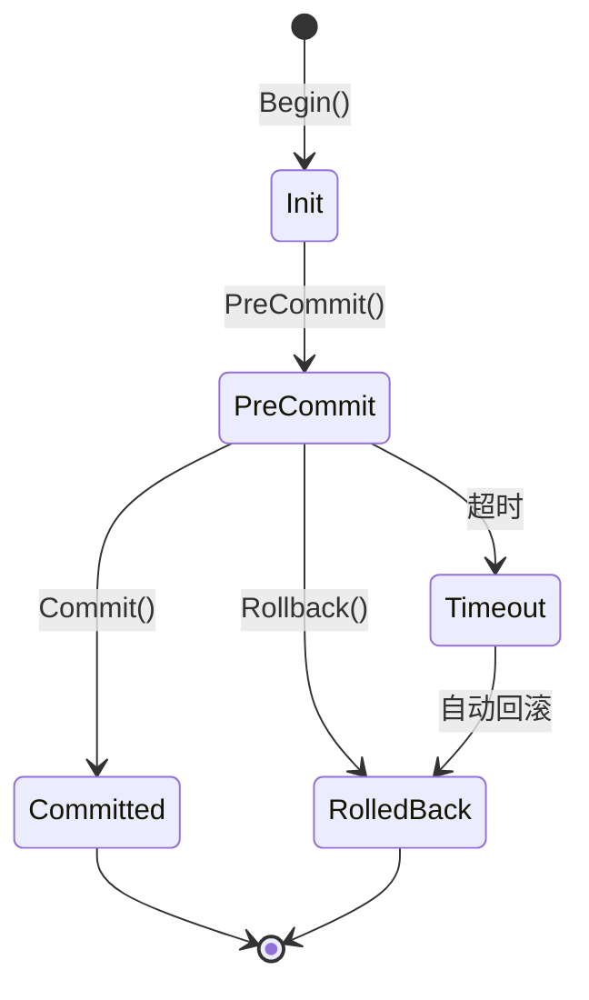

# 2PC API 文档

> 两阶段提交协议实现，保证分布式事务的原子性

## 概述

2PC（Two-Phase Commit）是分布式系统中保证事务原子性的经典协议。NexKV 实现了与 Merkle Tree 协同的 2PC 机制，用于需要强一致性的元数据操作。

### 核心特性

- **两阶段提交**：PreCommit → Commit/Rollback
- **Merkle Tree 协同**：提交后自动更新 Hash
- **Pending 操作暂存**：支持批量操作
- **超时与重试**：5秒默认超时，自动回滚
- **Gossip 状态同步**：事务状态通过 Gossip 扩散

## API 结构

### TransactionState 事务状态

```go
type TransactionState int

const (
    TxStateInit        TransactionState = iota // 初始状态
    TxStatePreCommit                            // PreCommit 阶段完成
    TxStateCommitted                            // 事务已提交
    TxStateRolledBack                           // 事务已回滚
    TxStateTimeout                              // 事务超时
)
```

### TwoPCTransaction 事务对象

```go
type TwoPCTransaction struct {
    TxID           string              // 事务 ID
    State          TransactionState    // 当前状态
    Operations     []*PendingOperation // 暂存的操作列表
    Participants   []string            // 参与者节点 ID 列表
    Acks           map[string]bool     // participantID -> ACK 状态
    Coordinator    string              // 协调者节点 ID
    CreateTime     time.Time           // 创建时间
    PreCommitTime  time.Time           // PreCommit 时间
    CommitTime     time.Time           // Commit 时间
    Timeout        time.Duration       // 超时时间（默认 5 秒）
    Quorum         int                 // 需要的 ACK 数量
    LastError      error               // 最后一次错误
}
```

### PendingOperation 暂存操作

```go
type PendingOperation struct {
    TxID         string    // 事务 ID
    NS           string    // 命名空间
    Key          string    // 键
    Value        []byte    // 值（编码后）
    Version      uint64    // 版本号
    CreateTime   time.Time // 创建时间
    MerkleHash   string    // Merkle Hash
    ShouldUpdate bool      // 是否更新 Merkle Tree
}
```

## 核心 API

### 创建事务

```go
tx := NewTwoPCTransaction(txID, participants, timeout)
```

**参数**：
- `txID`: 事务唯一标识
- `participants`: 参与者节点 ID 列表
- `timeout`: 超时时间（0 使用默认 5 秒）

**返回**：
- `*TwoPCTransaction`: 新创建的事务

### 添加操作

```go
tx.AddOperation(ns, key, value, version)
```

**参数**：
- `ns`: 命名空间
- `key`: 键
- `value`: 值
- `version`: 版本号

### PreCommit 阶段

```go
err := coordinator.PreCommit(ctx, tx)
```

**参数**：
- `ctx`: 上下文
- `tx`: 事务对象

**返回**：
- `error`: 错误信息

**行为**：
1. 将事务状态设为 `TxStatePreCommit`
2. 暂存所有操作到 Pending 列表
3. 向所有参与者发送 PreCommit 请求
4. 等待参与者 ACK

### PreCommitWithTimeout 带超时

```go
err := coordinator.PreCommitWithTimeout(ctx, tx, timeout)
```

**参数**：
- `ctx`: 上下文
- `tx`: 事务对象
- `timeout`: 超时时间

**返回**：
- `error`: 错误信息（超时返回 `ErrPrepareTimeout`）

### Commit 阶段

```go
err := coordinator.Commit(ctx, tx)
```

**参数**：
- `ctx`: 上下文
- `tx`: 事务对象

**返回**：
- `error`: 错误信息

**行为**：
1. 验证所有参与者已 ACK
2. 将所有 Pending 操作写入存储
3. 更新 Merkle Tree Hash
4. 将事务状态设为 `TxStateCommitted`
5. 清理 Pending 列表

### Rollback 回滚

```go
err := coordinator.Rollback(ctx, tx)
```

**参数**：
- `ctx`: 上下文
- `tx`: 事务对象

**返回**：
- `error`: 错误信息

**行为**：
1. 将事务状态设为 `TxStateRolledBack`
2. 清理所有 Pending 操作
3. 通知参与者回滚

### 处理 ACK

```go
coordinator.HandleAck(txID, participantID, success)
```

**参数**：
- `txID`: 事务 ID
- `participantID`: 参与者节点 ID
- `success`: 是否成功

## TwoPCCoordinator API

### 创建协调器

```go
coordinator := NewTwoPCCoordinator(config)
```

**配置结构**：

```go
type TwoPCCoordinatorConfig struct {
    KVStore        kvstore.Store      // 存储后端
    MerkleTree     *kvstore.NamespacedMerkleTree // Merkle Tree
    Transport      transport.Transport // 传输层
    LocalNodeID    string             // 本地节点 ID
    DefaultTimeout time.Duration      // 默认超时
}
```

### 开始事务

```go
tx, err := coordinator.Begin(ctx, participants)
```

**参数**：
- `ctx`: 上下文
- `participants`: 参与者列表

**返回**：
- `*TwoPCTransaction`: 新事务
- `error`: 错误信息

### 执行事务（便捷方法）

```go
err := coordinator.Execute(ctx, operations, participants)
```

**参数**：
- `ctx`: 上下文
- `operations`: 操作列表
- `participants`: 参与者列表

**返回**：
- `error`: 错误信息

**行为**：自动完成 Begin → AddOperation → PreCommit → Commit 流程

### 获取事务状态

```go
tx, err := coordinator.GetTransaction(ctx, txID)
```

**参数**：
- `ctx`: 上下文
- `txID`: 事务 ID

**返回**：
- `*TwoPCTransaction`: 事务对象
- `error`: 错误信息

## 错误类型

```go
var (
    ErrPrepareTimeout = errors.New("2PC PreCommit timeout")
    ErrCommitTimeout  = errors.New("2PC Commit timeout")
    ErrAckTimeout     = errors.New("2PC ACK wait timeout")
)
```

## 使用示例

### 场景 1：简单事务

```go
// 1. 创建协调器
coordinator := NewTwoPCCoordinator(config)

// 2. 开始事务
tx, err := coordinator.Begin(ctx, []string{"node-1", "node-2", "node-3"})
if err != nil {
    return err
}

// 3. 添加操作
tx.AddOperation("cluster", "shard-1", shardData, 1)
tx.AddOperation("cluster", "shard-2", shardData, 1)

// 4. PreCommit
if err := coordinator.PreCommit(ctx, tx); err != nil {
    coordinator.Rollback(ctx, tx)
    return err
}

// 5. Commit
if err := coordinator.Commit(ctx, tx); err != nil {
    return err
}
```

### 场景 2：带超时的事务

```go
ctx, cancel := context.WithTimeout(context.Background(), 10*time.Second)
defer cancel()

tx, _ := coordinator.Begin(ctx, participants)
tx.AddOperation("ns", "key", value, version)

// 使用 3 秒超时
if err := coordinator.PreCommitWithTimeout(ctx, tx, 3*time.Second); err != nil {
    if errors.Is(err, ErrPrepareTimeout) {
        // 处理超时
        coordinator.Rollback(ctx, tx)
    }
    return err
}

coordinator.Commit(ctx, tx)
```

### 场景 3：参与者处理 PreCommit

```go
// 参与者收到 PreCommit 请求
func (p *Participant) HandlePreCommit(txID string, operations []*PendingOperation) error {
    // 1. 暂存操作
    p.pendingOps[txID] = operations

    // 2. 返回 ACK
    return p.SendAck(txID, true)
}
```

### 场景 4：超时自动回滚

```go
// 事务超时后自动回滚
func (c *TwoPCCoordinator) handleTimeout(tx *TwoPCTransaction) {
    tx.State = TxStateTimeout
    c.Rollback(context.Background(), tx)
}
```

## 状态机



## 性能考量

### 并发控制

- 每个事务独立管理状态
- 使用 `sync.Mutex` 保护 ACK 收集器
- 支持并发执行多个事务

### 超时机制

- 默认 5 秒超时
- 可配置每个事务的超时时间
- 超时后自动触发回滚

### 资源管理

- Pending 操作占用内存
- Commit 后自动清理
- 建议限制单个事务的操作数量

## 配置参数

| 参数 | 默认值 | 说明 |
|------|--------|------|
| DefaultTimeout | 5s | 默认事务超时 |
| MaxPendingOps | 1000 | 单事务最大操作数 |
| AckTimeout | 3s | 单个 ACK 超时 |

## 监控指标

建议监控以下指标：

- `twopc_tx_total`: 事务总数
- `twopc_tx_committed`: 已提交事务数
- `twopc_tx_rolledback`: 已回滚事务数
- `twopc_tx_timeout`: 超时事务数
- `twopc_latency_seconds`: 事务延迟分布

## 故障恢复

### 协调者故障

- 事务状态通过 Gossip 同步
- 新协调者可查询事务状态
- 未完成事务自动回滚

### 参与者故障

- 等待 ACK 超时
- 超时后触发回滚
- 参与者恢复后查询事务状态

## 相关文档

- [Fencing Token API](fencing.md)
- [Gossip Event API](gossip-event.md)
- [一致性协议设计](../02_design/protocols/01_一致性协议设计.md)
