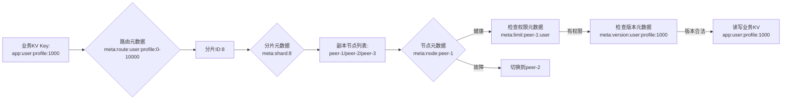

# NexKV 中 KV 数据与元数据（Metadata）的映射与联动设计
你核心想知道 **普通业务 KV 数据** 如何与各类元数据（路由、版本、分片、节点等）建立对应关系，以及读写 KV 时如何联动元数据的全流程逻辑。核心结论是：**元数据本质也是 KV 形态（特殊 KV），通过「命名空间隔离+层级映射+读写钩子」实现与业务 KV 的强绑定**，同时针对元数据的高可用/低延迟需求设计专属存储策略，以下结合 NexKV 架构（libp2p RPC、Fanout、Quorum）详细说明：

## 一、核心设计原则（先明确边界）
在 NexKV 中，所有数据（业务 KV + 元数据）最终都以 KV 形态存储，但通过 **命名空间隔离** 和 **属性标记** 区分，同时元数据需满足：
1. **强一致性**：元数据变更需通过 Quorum 机制（N/2+1 确认），避免路由/分片元数据不一致导致寻址错误；
2. **低延迟**：高频元数据（路由、节点健康）常驻内存，适配 5000+ calls/sec 吞吐量目标；
3. **联动性**：读写业务 KV 时自动触发元数据校验/更新，无需业务层手动操作；
4. **可追溯**：元数据记录业务 KV 的全生命周期（创建、修改、迁移、删除）。

## 二、第一步：命名空间隔离（避免冲突）
首先通过 **Key 前缀+命名空间** 区分业务 KV 和各类元数据，确保 Key 空间不重叠，同时便于批量管理元数据：

| 数据类型       | Key 命名规则（示例）                | 存储介质          | 核心特性                  |
|----------------|-------------------------------------|-------------------|---------------------------|
| 业务 KV        | `app:{appID}:{table}:{key}`         | 磁盘+内存（分片） | 按表/分片存储，可选副本   |
| 路由元数据     | `meta:route:{table}:{keyRange}`     | 内存+持久化       | 缓存命中率 100%，Quorum 同步 |
| 分片元数据     | `meta:shard:{shardID}`              | 内存+持久化       | 记录分片节点列表/状态     |
| 节点元数据     | `meta:node:{peerID}`                | 内存+心跳更新     | 记录健康状态/负载/Stream 数 |
| 版本元数据     | `meta:version:{table}:{key}`        | 内存+磁盘         | 与业务 KV 一一对应，MVCC 版本 |
| 拓扑元数据     | `meta:topo:{layer}:{peerID}`        | 内存+持久化       | 记录集群层级关系          |
| 限流元数据     | `meta:limit:{peerID}:{table}`       | 内存              | 动态调整 QPS 阈值         |

**示例**：
- 业务 KV：`app:user:profile:1000`（用户 1000 的个人信息）；
- 对应路由元数据：`meta:route:user:profile:0-10000`（Key 范围 0-10000 映射到分片 8）；
- 对应分片元数据：`meta:shard:8`（分片 8 的副本节点列表：peer-1、peer-2、peer-3）；
- 对应版本元数据：`meta:version:user:profile:1000`（版本号：123，更新时间：2026-02-09）；
- 对应节点元数据：`meta:node:peer-1`（状态：健康，QPS：3000，Stream 复用率：95%）。

## 三、第二步：层级映射关系（业务 KV → 元数据）
业务 KV 与元数据通过 **“Key → 路由 → 分片 → 节点”** 的层级映射找到最终存储节点，同时联动其他元数据（版本、健康、权限），全流程如下：



### 核心映射逻辑（代码示例）
```go
package metadata

import (
	"context"
	"github.com/libp2p/go-libp2p/core/peer"
)

// KVWithMeta KV数据+关联元数据的结构体
type KVWithMeta struct {
	// 业务KV数据
	Key       string
	Value     []byte
	// 关联元数据
	ShardID   int           // 所属分片ID
	PeerIDs   []peer.ID     // 副本节点列表
	Version   uint64        // 数据版本号
	NodeState map[peer.ID]NodeState // 节点健康状态
}

// ResolveKVMetadata 解析业务KV对应的所有元数据
func (m *MetadataManager) ResolveKVMetadata(ctx context.Context, key string) (*KVWithMeta, error) {
	// 1. 解析Key的命名空间（app:user:profile:1000 → table=user:profile）
	app, table, actualKey := parseKeyNamespace(key)
	
	// 2. 查询路由元数据：根据table+Key范围找到分片ID
	shardID, err := m.getRouteMetadata(ctx, table, actualKey)
	if err != nil {
		return nil, err
	}
	
	// 3. 查询分片元数据：根据shardID找到副本节点列表
	peerIDs, err := m.getShardMetadata(ctx, shardID)
	if err != nil {
		return nil, err
	}
	
	// 4. 查询节点元数据：检查节点健康状态
	nodeState := make(map[peer.ID]NodeState)
	for _, pid := range peerIDs {
		state, err := m.getNodeMetadata(ctx, pid)
		if err != nil {
			return nil, err
		}
		nodeState[pid] = state
	}
	
	// 5. 查询版本元数据：获取KV的版本号
	version, err := m.getVersionMetadata(ctx, table, actualKey)
	if err != nil {
		return nil, err
	}
	
	// 6. 组装结果
	return &KVWithMeta{
		Key:       key,
		ShardID:   shardID,
		PeerIDs:   peerIDs,
		Version:   version,
		NodeState: nodeState,
	}, nil
}
```

## 四、第三步：读写联动（操作 KV 时自动更新/校验元数据）
### 1. 写 KV 时的元数据联动（核心场景）
写业务 KV（新增/修改/删除）时，自动触发元数据的更新/校验，确保一致性：
```go
// PutKV 写入业务KV并联动更新元数据
func (c *Client) PutKV(ctx context.Context, key string, value []byte) error {
	// 步骤1：解析KV对应的元数据
	kvMeta, err := c.metaManager.ResolveKVMetadata(ctx, key)
	if err != nil {
		return err
	}

	// 步骤2：元数据前置校验
	// 2.1 检查节点健康状态（过滤故障节点）
	healthyPeers := filterHealthyPeers(kvMeta.PeerIDs, kvMeta.NodeState)
	if len(healthyPeers) < c.quorum { // 检查Quorum阈值
		return errors.New("insufficient healthy peers for quorum")
	}
	// 2.2 检查权限/限流（避免过载）
	if err := c.checkLimitMetadata(ctx, kvMeta.PeerIDs[0], key); err != nil {
		return err
	}

	// 步骤3：Fanout模式写入业务KV到健康节点（Quorum模式）
	fanoutReq := &FanoutRequest{
		Method: "PutKV",
		Body:   encodeKV(key, value),
		Peers:  healthyPeers,
	}
	fanoutOpts := &FanoutOptions{
		Mode:   Quorum,
		Quorum: c.quorum,
		Timeout: 50 * time.Millisecond,
	}
	result := c.Fanout(ctx, fanoutReq, fanoutOpts)
	if result.Errors != nil {
		// 用multierr聚合错误并返回
		return multierr.Append(result.Errors, errors.New("fanout put kv failed"))
	}

	// 步骤4：原子更新版本元数据（MVCC，版本号+1）
	newVersion := kvMeta.Version + 1
	if err := c.metaManager.UpdateVersionMetadata(ctx, key, newVersion); err != nil {
		// 版本更新失败，回滚已写入的KV（保证一致性）
		_ = c.rollbackKV(ctx, key, healthyPeers)
		return err
	}

	// 步骤5：更新性能元数据（统计QPS/延迟）
	c.metaManager.UpdatePerformanceMetadata(ctx, key, "put", result.Duration)
	return nil
}
```

### 2. 读 KV 时的元数据联动
读业务 KV 时，先校验元数据（路由/节点健康/版本），优先选择健康、低负载的节点：
```go
// GetKV 读取业务KV并校验元数据
func (c *Client) GetKV(ctx context.Context, key string) ([]byte, error) {
	// 步骤1：解析元数据
	kvMeta, err := c.metaManager.ResolveKVMetadata(ctx, key)
	if err != nil {
		return nil, err
	}

	// 步骤2：选择最优节点（健康+低负载）
	bestPeer := selectBestPeer(kvMeta.PeerIDs, kvMeta.NodeState)
	if bestPeer == "" {
		return nil, errors.New("no available peer")
	}

	// 步骤3：校验版本（防止脏读，如指定版本号）
	if version := ctx.Value("expected_version"); version != nil {
		if kvMeta.Version != version.(uint64) {
			return nil, errors.New("version mismatch")
		}
	}

	// 步骤4：从最优节点读取KV（复用连接池Stream）
	stream, err := c.pool.GetStream(ctx, bestPeer)
	if err != nil {
		return nil, err
	}
	defer c.pool.ReturnStream(stream)

	// 步骤5：读取数据并更新元数据（最后访问时间/Stream复用率）
	value, err := readKVFromStream(stream, key)
	c.metaManager.UpdateNodeMetadata(ctx, bestPeer, "last_access_time", time.Now())
	c.metaManager.UpdatePoolMetadata(ctx, bestPeer, "stream_reuse_count", +1)
	return value, err
}
```

### 3. 元数据变更时的联动（反向联动）
元数据变更（如分片迁移、节点下线）时，自动更新业务 KV 的映射关系，无需业务层感知：
```go
// UpdateShardMetadata 更新分片元数据并联动路由
func (m *MetadataManager) UpdateShardMetadata(ctx context.Context, shardID int, newPeers []peer.ID) error {
	// 步骤1：分布式锁保护元数据更新（防止并发修改）
	lock, err := m.lockManager.Lock(ctx, fmt.Sprintf("meta:shard:%d", shardID), 10*time.Second)
	if err != nil {
		return err
	}
	defer lock.Unlock()

	// 步骤2：更新分片元数据
	if err := m.put(ctx, fmt.Sprintf("meta:shard:%d", shardID), encodePeers(newPeers)); err != nil {
		return err
	}

	// 步骤3：联动更新路由元数据（所有映射到该分片的Key范围）
	keyRanges, err := m.listRouteMetadataByShard(ctx, shardID)
	if err != nil {
		return err
	}
	for _, keyRange := range keyRanges {
		// 标记路由元数据为"待同步"，Fanout到所有节点
		_ = m.markRouteMetadataSync(ctx, keyRange, shardID)
	}

	// 步骤4：更新拓扑元数据（层级关系）
	_ = m.updateTopoMetadata(ctx, shardID, newPeers)
	return nil
}
```

## 五、元数据的专属存储策略（区别于业务 KV）
元数据对可用性、延迟要求远高于业务 KV，因此设计专属存储策略：
| 策略                | 具体实现                                                                 |
|---------------------|--------------------------------------------------------------------------|
| 内存优先存储        | 高频元数据（路由、节点健康、版本）常驻内存，仅异步持久化到磁盘           |
| Quorum 强一致性     | 元数据写入需 N/2+1 节点确认，避免元数据丢失/不一致                       |
| 增量同步            | 元数据变更仅同步增量（如版本号+1），而非全量同步，降低网络开销           |
| 预热缓存            | 连接池根据路由元数据预热高频节点的 Stream 连接，提升复用率               |
| 故障自动恢复        | 节点元数据异常时，自动从副本节点同步元数据，5秒内完成恢复                |
| 读写分离            | 元数据读请求走本地缓存，写请求走 Fanout Quorum 模式，平衡性能与一致性    |

## 总结
### 关键点回顾
1. **形态统一**：元数据本质是“特殊 KV”，通过 **命名空间前缀** 与业务 KV 隔离，避免 Key 冲突；
2. **层级映射**：业务 KV 通过“Key→路由→分片→节点”的层级关系找到存储节点，所有映射逻辑封装在 `MetadataManager` 中，业务层无感知；
3. **读写联动**：操作业务 KV 时自动触发元数据的校验/更新，元数据变更时反向联动 KV 路由，保证全链路一致性；
4. **专属策略**：元数据采用“内存优先+Quorum 同步+增量更新”策略，适配低延迟/高可用需求，支撑 5000+ calls/sec 目标；
5. **工具适配**：联动 Fanout（元数据同步）、multierr（错误聚合）、连接池（元数据预热）等组件，符合 NexKV 整体架构设计。

这套设计确保了业务 KV 与元数据的强绑定，同时兼顾性能与一致性，完全适配分布式 KV 生产级落地需求。
