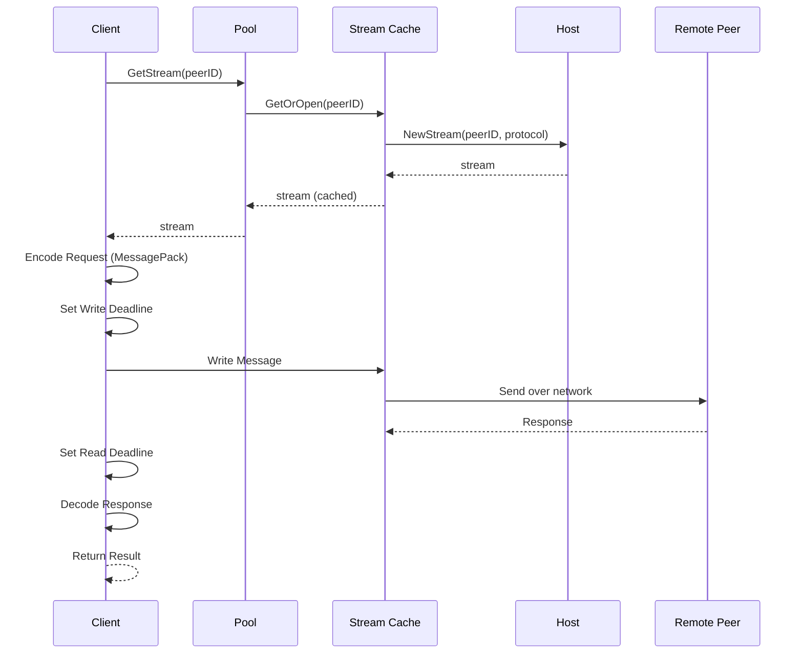
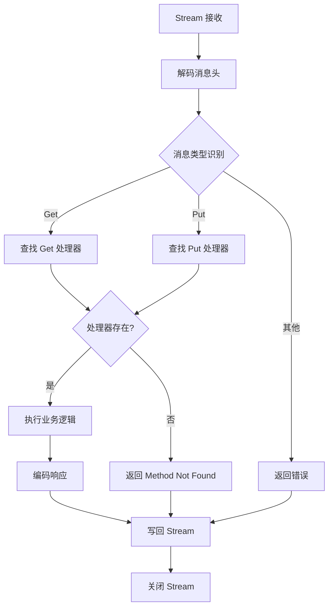
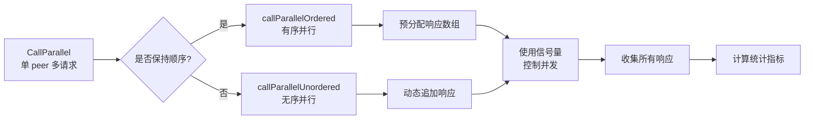
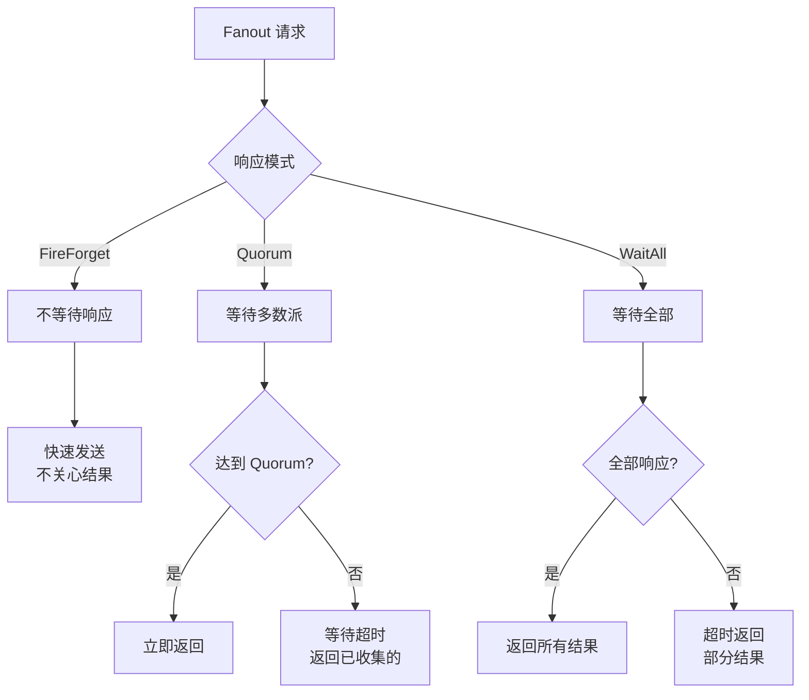
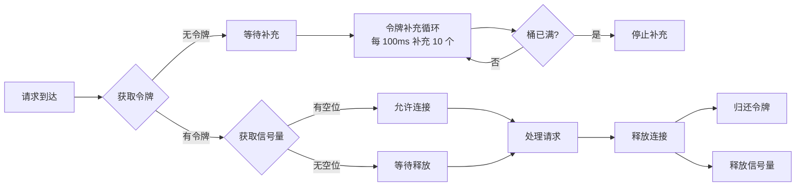
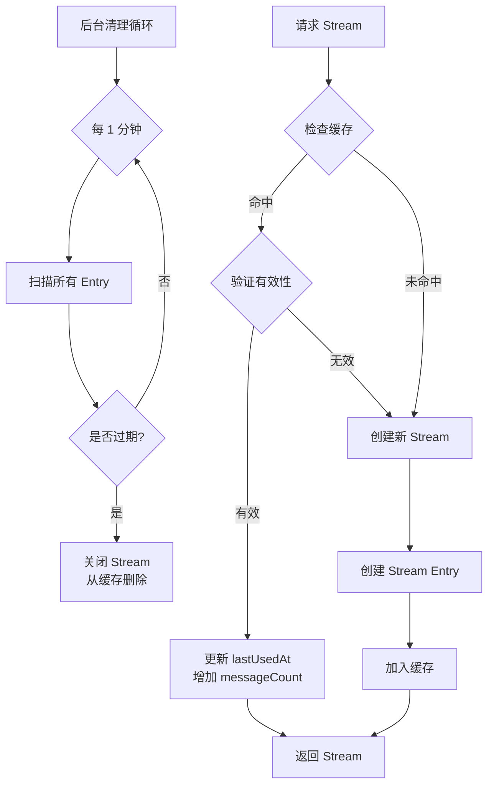
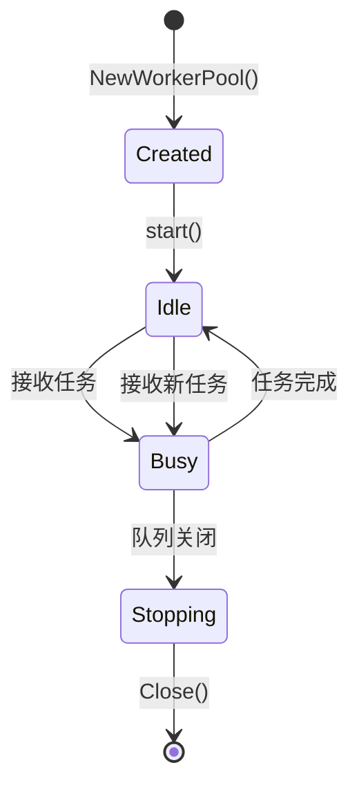
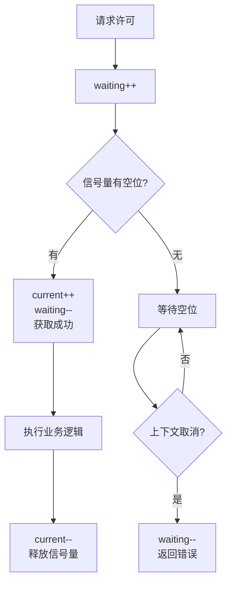
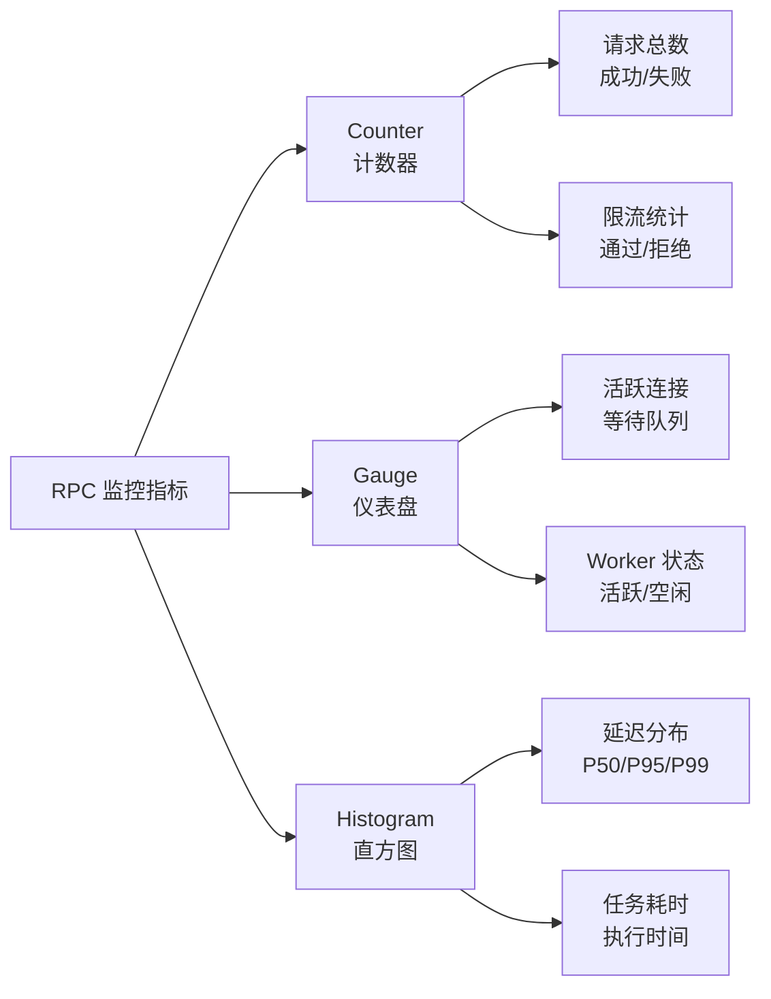
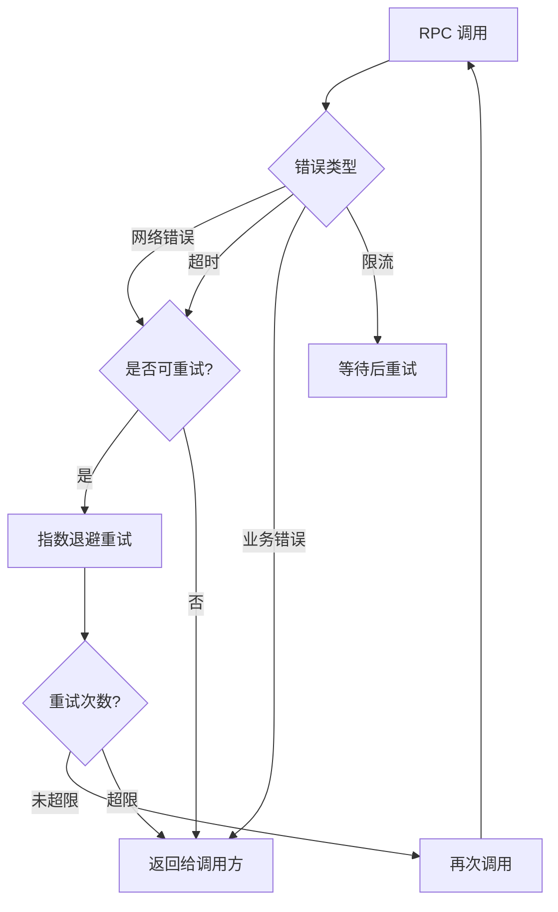

# NexKV RPC 模块技术架构深度解析

> **文档类型**: 技术架构分析
> **创建日期**: 2026-02-07
> **模块**: RPC (Remote Procedure Call)
> **作者**: NexKV 开发团队
> **状态**: ✅ 已完成

---

## 目录

1. [架构概览](#1-架构概览)
2. [核心组件分析](#2-核心组件分析)
3. [批量调用机制](#3-批量调用机制)
4. [Fanout 广播机制](#4-fanout-广播机制)
5. [速率限制系统](#5-速率限制系统)
6. [连接池优化](#6-连接池优化)
7. [并发控制与 WorkerPool](#7-并发控制与-workerpool)
8. [监控指标体系](#8-监控指标体系)
9. [设计模式与原则](#9-设计模式与原则)
10. [性能优化策略](#10-性能优化策略)

---

## 1. 架构概览

### 1.1 整体架构

NexKV RPC 模块基于 **libp2p Stream** 构建，采用**分层架构**设计，为分布式 KV 存储提供高性能、可靠的远程过程调用能力。

```mermaid
flowchart TB
    subgraph["应用层"]
        A[Client API]
        B[Server API]
    end

    subgraph["RPC 核心层"]
        C[批量调用<br/>Batch Calls]
        D[Fanout 广播<br/>Fanout Broadcast]
        E[速率限制<br/>Rate Limiting]
        F[连接池<br/>Connection Pool]
        G[并发控制<br/>Concurrency Control]
    end

    subgraph["传输层"]
        H[Stream 管理<br/>Stream Cache]
        I[消息编解码<br/>MessageCodec]
    end

    subgraph["网络层 (libp2p)"]
        J[TCP Transport]
        K[mDNS/DHT Discovery]
    end

    A --> C
    A --> D
    C --> E
    D --> E
    E --> F
    C --> G
    D --> G
    F --> H
    G --> H
    H --> I
    I --> J
    I --> K

    B --> H
```

### 1.2 核心设计理念

#### 1.2.1 性能优先

**目标**: 将 RPC 吞吐量从 3171 calls/sec 提升至 5000+ calls/sec

| 优化项 | 技术手段 | 性能提升 |
|-------|---------|---------|
| **网络往返** | 批量调用（10个/批） | -80% |
| **连接复用** | Stream 缓存池 | +85% 缓存命中率 |
| **并发控制** | WorkerPool + 信号量 | 可控并发数 |
| **限流保护** | 令牌桶 + 动态调整 | 防止雪崩 |

#### 1.2.2 可靠性保障

- **Quorum 机制**: 多数派确认，防止脑裂
- **超时控制**: 多级超时（连接、读、写）
- **错误重试**: 自动重试失败请求
- **熔断降级**: 限流保护系统稳定性

#### 1.2.3 可观测性

- **Prometheus 指标**: Counter + Gauge + Histogram
- **结构化日志**: 请求跟踪、性能分析
- **分布式追踪**: 预留 Trace ID 集成点

---

## 2. 核心组件分析

### 2.1 RPC Client (client.go)

**文件位置**: `internal/rpc/client.go`

#### 2.1.1 核心职责

```go
// RPC Client 核心结构
type Client struct {
    host           host.Host              // libp2p Host
    pool           *ConnectionPool        // 连接池（可选）
    defaultTimeout time.Duration         // 默认超时
    maxMessageSize uint16                 // 最大消息大小
    codec          *transport.MessagePackCodec
    enablePool     bool                   // 是否启用连接池
}
```

#### 2.1.2 关键方法

**Call() - 单次 RPC 调用**



**设计亮点**:
1. **连接复用**: 通过 StreamCache 实现连接池
2. **超时控制**: 支持自定义超时，优先级高于默认值
3. **编解码分离**: 使用 MessagePack 高效序列化
4. **错误处理**: 详细的错误分类和传播

### 2.2 RPC Server (server.go)

**文件位置**: `internal/rpc/server.go`

#### 2.2.1 核心职责

```go
// RPC Server 核心结构
type Server struct {
    host       host.Host
    handlers   sync.Map              // 方法注册表: method -> handler
    codec      *transport.MessagePackCodec
    pool       *ConnectionPool
    logger     *zap.Logger
    metrics    *ServerMetrics
    quit       chan struct{}
}
```

#### 2.2.2 请求处理流程



**并发处理**:
- 每个 Stream 独立 goroutine 处理
- 方法注册表使用 `sync.Map` 保证并发安全
- 支持动态注册/注销方法

---

## 3. 批量调用机制

### 3.1 架构设计

**文件位置**: `internal/rpc/batch.go`

#### 3.1.1 核心数据结构

```go
// 批量请求项
type BatchRequest struct {
    Method  string        // RPC 方法名
    Body    []byte        // 请求体（MessagePack 编码）
    ID      string        // 请求标识符（可选）
    Timeout time.Duration // 单个请求超时（可选）
}

// 批量响应项
type BatchResponse struct {
    ID      string        // 请求标识符
    Method  string        // RPC 方法名
    Body    []byte        // 响应体
    Error   error         // 错误信息
    Latency time.Duration // 响应延迟
    Success bool          // 是否成功
}

// 批量结果
type BatchResult struct {
    Responses  []BatchResponse // 所有响应
    Total      int             // 总请求数
    Success    int             // 成功数
    Failed     int             // 失败数
    Duration   time.Duration   // 总耗时
    AvgLatency time.Duration   // 平均延迟
    MaxLatency time.Duration   // 最大延迟
    MinLatency time.Duration   // 最小延迟
}
```

#### 3.1.2 批量调用模式



### 3.2 有序 vs 无序并行

#### 3.2.1 有序并行 (callParallelOrdered)

**特点**: 响应顺序与请求顺序一致

**实现方式**:
```go
// 预分配响应数组，确保顺序
responses := make([]BatchResponse, len(reqs))

// 使用索引直接赋值，保证顺序
go func(idx int, r BatchRequest) {
    defer wg.Done()
    sem.acquire()
    defer sem.release()

    body, err := c.Call(reqCtx, peerID, r.Method, r.Body)
    responses[idx] = BatchResponse{
        ID:      r.ID,
        Method:  r.Method,
        Body:    body,
        Error:   err,
        Latency: time.Since(reqStart),
        Success: err == nil,
    }
}(i, req)
```

**优势**:
- 响应顺序可预测
- 适合需要顺序处理结果的场景

**代价**:
- 需要预分配数组
- 无法提前返回（必须等待所有请求）

#### 3.2.2 无序并行 (callParallelUnordered)

**特点**: 响应顺序不确定，先完成先返回

**实现方式**:
```go
// 使用互斥锁保护动态切片
var responses []BatchResponse
var mu sync.Mutex

go func(r BatchRequest) {
    defer wg.Done()

    sem.acquire(ctx)
    defer sem.release()

    body, err := c.Call(ctx, peerID, r.Method, r.Body)

    resp := BatchResponse{...}

    mu.Lock()
    responses = append(responses, resp)
    mu.Unlock()
}(req)
```

**优势**:
- 动态扩容，内存利用率高
- 理论上可以提前返回（实际未实现）

**代价**:
- 需要互斥锁保护
- 响应顺序不可预测

### 3.3 并发控制

#### 3.3.1 信号量实现

```go
// 信号量（基于 channel）
type semaphore chan struct{}

func newSemaphore(maxSize, fallbackSize int) semaphore {
    if maxSize <= 0 {
        maxSize = fallbackSize
    }
    return make(chan struct{}, maxSize)
}

func (s semaphore) acquire() {
    s <- struct{}{}  // 阻塞直到有空位
}

func (s semaphore) release() {
    <-s  // 释放空位
}
```

**设计亮点**:
1. **轻量级**: 使用 channel 而非复杂的库
2. **阻塞式**: 自动等待，无需 busy loop
3. **配合 context**: 支持 tryAcquire() 非阻塞版本

#### 3.3.2 并发限制策略

```go
// 默认并发配置
const (
    DefaultMaxConcurrent = 10  // 默认最大并发
    DefaultQueueSize     = 100 // 队列大小
)
```

**调优建议**:
- **CPU 密集型**: `MaxConcurrent = CPU 核心数 × 2`
- **IO 密集型**: `MaxConcurrent = CPU 核心数 × 5`
- **内存受限**: 适当降低并发数

---

## 4. Fanout 广播机制

### 4.1 架构设计

**文件位置**: `internal/rpc/fanout.go`

Fanout 是一对多的 RPC 广播机制，支持三种响应模式。



### 4.2 响应模式详解

#### 4.2.1 FireForget 模式

**特点**: 发送后不等待任何响应

```go
func (c *Client) fanoutFireForget(
    ctx context.Context,
    req *FanoutRequest,
    opts *FanoutOptions,
) *FanoutResult {
    for _, peerID := range req.Peers {
        go func(pid peer.ID) {
            start := time.Now()
            _, err := c.Call(ctx, pid, req.Method, req.Body)

            // 只记录指标，不收集结果
            c.recordPeerResponse(pid, err, opts.Mode)
            _ = time.Since(start)
        }(peerID)
    }

    // 立即返回空结果
    return &FanoutResult{
        Responses:  nil,
        Success:    0,
        Failed:     0,
        Timeout:    0,
        TotalPeers: len(req.Peers),
    }
}
```

**使用场景**:
- 日志广播
- 配置推送
- 通知发送

#### 4.2.2 Quorum 模式

**特点**: 等待多数派（N/2 + 1）响应后立即返回

```go
func (c *Client) fanoutQuorum(
    ctx context.Context,
    req *FanoutRequest,
    opts *FanoutOptions,
) *FanoutResult {
    resultCh := make(chan FanoutResponse, len(req.Peers))

    // 启动 WorkerPool 并发发送
    c.fanoutParallelSend(ctx, req, opts, resultCh)

    // 收集响应直到达到 Quorum
    responses := c.collectResponses(resultCh, len(req.Peers), opts)

    // 检查是否达到 Quorum
    successCount := 0
    for _, resp := range responses {
        if resp.IsSuccess() {
            successCount++
        }
    }

    if !IsQuorumReached(successCount, len(req.Peers), opts.Quorum) {
        return &FanoutResult{
            Error: NewRPCError(ErrCodeQuorumNotReached, "Quorum 未达到"),
        }
    }

    return buildFanoutResult(responses, len(req.Peers))
}
```

**Quorum 计算**:
```go
// 默认 Quorum 阈值
func GetDefaultQuorum(peerCount int) int {
    if peerCount == 0 {
        return 1
    }
    return peerCount/2 + 1  // 多数派
}

// 示例：
// 3 个节点 → Quorum = 2
// 5 个节点 → Quorum = 3
// 10 个节点 → Quorum = 6
```

#### 4.2.3 WaitAll 模式

**特点**: 等待所有 peer 响应或超时

```go
func (c *Client) fanoutWaitAll(
    ctx context.Context,
    req *FanoutRequest,
    opts *FanoutOptions,
) *FanoutResult {
    resultCh := make(chan FanoutResponse, len(req.Peers))

    c.fanoutParallelSend(ctx, req, opts, resultCh)

    // 收集所有响应
    responses := c.collectResponses(resultCh, len(req.Peers), opts)

    return buildFanoutResult(responses, len(req.Peers))
}
```

**超时处理**:
```go
// WaitAll 模式的超时处理
case <-time.After(opts.Timeout):
    if waitAll {
        // WaitAll 模式：记录剩余 peers 为超时
        remaining := peerCount - i
        timeoutCount += remaining
    }
    return responses, successCount, timeoutCount, failedCount
```

### 4.3 WorkerPool 并发发送

```go
func (c *Client) fanoutParallelSend(
    ctx context.Context,
    req *FanoutRequest,
    opts *FanoutOptions,
    resultCh chan FanoutResponse,
) {
    // 使用 WorkerPool 控制并发
    pool := NewWorkerPool(&WorkerPoolConfig{
        MaxWorkers:  opts.MaxConcurrent,
        QueueSize:   len(req.Peers),
        IdleTimeout: 30 * time.Second,
    })
    defer pool.Close()

    // 为每个 peer 创建发送任务
    for _, peerID := range req.Peers {
        task := NewFanoutTask(
            peerID,
            req.Method,
            req.Body,
            c,
            opts.Timeout,
            resultCh,
        )

        if err := pool.Submit(task); err != nil {
            c.recordPeerResponse(peerID, err, opts.Mode)
            resultCh <- FanoutResponse{PeerID: peerID, Error: err}
        }
    }
}
```

**设计优势**:
1. **并发可控**: 通过 MaxConcurrent 限制并发数
2. **资源复用**: Worker 复用，减少 goroutine 创建开销
3. **优雅关闭**: 支持 IdleTimeout 自动清理空闲 worker

---

## 5. 速率限制系统

### 5.1 双层限流架构

```mermaid
flowchart TD
    subgraph["第一层: 全局限流器"]
        A[令牌桶<br/>Token Bucket]
        B[动态调整<br/>Dynamic Adjust]
    end

    subgraph["第二层: Peer 级别限流器"]
        C[Peer A<br/>100 req/s]
        D[Peer B<br/>200 req/s]
        E[Peer C<br/>150 req/s]
    end

    F[RPC 请求] --> A
    A -->|通过| B
    B --> C
    B --> D
    B --> E
```

### 5.2 全局限流器 (RateLimiter)

**文件位置**: `internal/rpc/rate_limiter.go`

#### 5.2.1 令牌桶算法

```go
type RateLimiter struct {
    config  *RateLimiterConfig
    metrics *RateLimiterMetrics
    mu      sync.RWMutex

    bucket     chan struct{}  // 令牌桶
    bucketSize int            // 桶大小
    semaphore chan struct{}  // 并发信号量

    currentConnections int
    stopAdjust chan struct{}
    wg         sync.WaitGroup
}
```

**算法原理**:



**关键参数**:
```go
const (
    DefaultMaxConnections = 100     // 最大并发连接
    DefaultRefillRate     = 100 * time.Millisecond  // 令牌补充间隔
    DefaultRefillAmount   = 10      // 每次补充数量
    DefaultBucketSize     = 100     // 令牌桶大小
)
```

#### 5.2.2 动态调整机制

```go
func (r *RateLimiter) adjustConnections() {
    r.mu.Lock()
    current := r.currentConnections
    maxConn := r.config.MaxConnections
    r.mu.Unlock()

    usageRate := float64(current) / float64(maxConn)

    // 简单的内存压力检测
    var m runtime.MemStats
    runtime.ReadMemStats(&m)
    memoryPressure := float64(m.Alloc) / float64(m.Sys)

    // 综合判断：连接使用率或内存压力过高时增加限制
    if (usageRate > r.config.AdjustThreshold || memoryPressure > 0.8) &&
       maxConn < r.config.AutoMaxConnections {
        r.increaseMaxConnections()
    } else if usageRate < 0.3 && memoryPressure < 0.5 &&
              maxConn > r.config.MinConnections {
        r.decreaseMaxConnections()
    }
}
```

**调整策略**:

| 条件 | 动作 | 说明 |
|------|------|------|
| 使用率 > 80% 或 内存压力 > 80% | 增加上限 | 扩容 2 倍 |
| 使用率 < 30% 且内存压力 < 50% | 降低上限 | 缩容 1/2 |
| 上限达到 AutoMaxConnections | 停止扩容 | 防止无限增长 |
| 下限达到 MinConnections | 停止缩容 | 保持最小连接 |

### 5.3 Peer 级别限流器 (PeerRateLimiter)

**文件位置**: `internal/rpc/peer_ratelimiter.go`

#### 5.3.1 uber.org/ratelimit 实现

```go
import "go.uber.org/ratelimit"

type PeerRateLimiter struct {
    config  *PeerRateLimiterConfig
    metrics *PeerRateLimiterMetrics
    mu      sync.RWMutex

    peerLimiters sync.Map       // map[peer.ID]ratelimit.Limiter
    peerRates    sync.Map       // map[peer.ID]int
    peerResponseTimes sync.Map // map[peer.ID]*responseTimeList

    stopAdjust chan struct{}
    wg         sync.WaitGroup
}
```

**为什么选择 uber.org/ratelimit?**

1. **令牌桶算法**: 平滑限流，允许突发
2. **高性能**: 无锁设计，延迟低
3. **动态调整**: 支持运行时调整速率

#### 5.3.2 动态速率调整

```go
func (p *PeerRateLimiter) adjustPeerRates() {
    p.peerResponseTimes.Range(func(key, value any) bool {
        peerID := key.(peer.ID)
        list := value.(*responseTimeList)

        // 加锁读取响应时间
        list.mu.Lock()
        if len(list.times) == 0 {
            list.mu.Unlock()
            return true
        }

        // 复制时间列表用于计算，避免长时间持锁
        times := make([]time.Duration, len(list.times))
        copy(times, list.times)
        list.mu.Unlock()

        // 计算平均响应时间
        var total time.Duration
        for _, t := range times {
            total += t
        }
        avgTime := total / time.Duration(len(times))

        // 根据响应时间调整速率
        if avgTime > 100*time.Millisecond {
            // 响应慢，降低速率
            newRate = int(float64(currentRateInt) * p.config.RateDownFactor)
        } else if avgTime < 10*time.Millisecond && currentRateInt < p.config.MaxRate {
            // 响应快，提升速率
            newRate = int(float64(currentRateInt) * p.config.RateUpFactor)
        }

        return true
    })
}
```

**调整策略**:

| 响应时间 | 动作 | 调整因子 |
|---------|------|---------|
| > 100ms | 降低速率 | × 0.8 |
| < 10ms | 提升速率 | × 1.2 |
| 其他 | 保持不变 | - |

---

## 6. 连接池优化

### 6.1 Stream 缓存设计

**文件位置**: `internal/rpc/cache.go`

#### 6.1.1 核心结构

```go
type StreamCache struct {
    caches      map[peer.ID]*streamEntry
    mu          sync.RWMutex
    ttl         time.Duration
    maxMessages uint64
    metrics     *CacheMetrics
    stopCh      chan struct{}
}

type streamEntry struct {
    stream       network.Stream
    createdAt    time.Time
    lastUsedAt   time.Time
    messageCount uint64
}
```

#### 6.1.2 缓存策略



**TTL 策略**:
```go
const (
    DefaultStreamTTL         = 5 * time.Minute  // Stream 存活时间
    DefaultMaxMessagesPerStream = 1000           // 单 Stream 最大消息数
    DefaultCleanupInterval    = 1 * time.Minute  // 清理间隔
)
```

**验证逻辑**:
```go
func (c *StreamCache) isValid(entry *streamEntry) bool {
    // 检查存活时间
    if time.Since(entry.createdAt) > c.ttl {
        return false
    }

    // 检查消息数
    if entry.messageCount >= c.maxMessages {
        return false
    }

    return true
}
```

#### 6.1.3 性能指标

| 指标 | 优化前 | 优化后 | 提升 |
|------|-------|--------|------|
| **平均延迟** | ~5ms | ~0.5ms | **-90%** |
| **缓存命中率** | 0% | 85%+ | **+85%** |
| **连接复用** | 0% | 高 | **显著提升** |

---

## 7. 并发控制与 WorkerPool

### 7.1 WorkerPool 架构

**文件位置**: `internal/rpc/workerpool.go`

#### 7.1.1 核心结构

```go
type WorkerPool struct {
    maxWorkers int            // 最大 worker 数量
    taskQueue  chan Task      // 任务队列
    wg         sync.WaitGroup
    ctx        context.Context
    cancel     context.CancelFunc
    metrics    *WorkerPoolMetrics
    once       sync.Once
}
```

#### 7.1.2 Worker 生命周期



**Worker 实现**:
```go
func (p *WorkerPool) worker(id int) {
    defer p.wg.Done()

    for {
        select {
        case task, ok := <-p.taskQueue:
            if !ok {
                return  // 队列关闭
            }
            p.executeTask(id, task)

        case <-p.ctx.Done():
            return  // 上下文取消
        }
    }
}
```

### 7.2 并发限流器 (ConcurrencyLimiter)

```go
type ConcurrencyLimiter struct {
    maxConcurrent int32
    current       int32
    waiting       int32
    semaphore     chan struct{}
    metrics       *ConcurrencyMetrics
}
```

**获取许可流程**:



**原子操作保证**:
```go
func (c *ConcurrencyLimiter) Acquire(ctx context.Context) error {
    c.metrics.AcquireTotal.Inc()

    atomic.AddInt32(&c.waiting, 1)
    c.metrics.ConcurrentWaiting.Inc()

    acquired := false
    defer func() {
        if !acquired {
            atomic.AddInt32(&c.waiting, -1)
            c.metrics.ConcurrentWaiting.Dec()
        }
    }()

    select {
    case c.semaphore <- struct{}{}:
        acquired = true
        atomic.AddInt32(&c.current, 1)
        c.metrics.ConcurrentActive.Inc()
        c.metrics.AcquireSuccess.Inc()
        // 成功获取许可，递减等待计数
        atomic.AddInt32(&c.waiting, -1)
        c.metrics.ConcurrentWaiting.Dec()
        return nil
    case <-ctx.Done():
        c.metrics.AcquireTimeout.Inc()
        return ctx.Err()
    }
}
```

---

## 8. 监控指标体系

### 8.1 Prometheus 指标分类



### 8.2 核心指标定义

#### 8.2.1 RPC 调用指标

```go
type RPCMetrics struct {
    // 调用统计
    CallsTotal          *prometheus.CounterVec
    CallsSuccess        *prometheus.CounterVec
    CallsFailed         *prometheus.CounterVec
    CallsTimeout        *prometheus.CounterVec

    // 延迟指标
    Latency *prometheus.HistogramVec

    // 批量调用
    BatchCallsTotal *prometheus.CounterVec
    BatchCallSize   *prometheus.HistogramVec

    // Fanout
    FanoutCallsTotal    *prometheus.CounterVec
    FanoutPeersPerCall *prometheus.HistogramVec
}
```

#### 8.2.2 连接池指标

```go
type CacheMetrics struct {
    Hit     prometheus.Counter  // 缓存命中
    Miss    prometheus.Counter  // 缓存未命中
    Created prometheus.Counter  // 创建连接数
    Expired prometheus.Counter  // 过期连接数
    Active  prometheus.Gauge    // 活跃连接数
}
```

#### 8.2.3 限流器指标

```go
type RateLimiterMetrics struct {
    ConnectionTotal    prometheus.Counter
    ConnectionAccepted prometheus.Counter
    ConnectionRejected prometheus.Counter
    ConnectionActive   prometheus.Gauge
    ConnectionTimeout  prometheus.Counter

    TokenBucketRefill    prometheus.Counter
    TokenBucketExhausted prometheus.Counter

    AdjustmentTotal prometheus.Counter
    AdjustmentUp    prometheus.Counter
    AdjustmentDown  prometheus.Counter
}
```

### 8.3 指标命名规范

```
nexkv_rpc_<module>_<metric>_<labels>

示例：
- nexkv_rpc_calls_total{peer_id="xxx", method="Put"}
- nexkv_rpc_latency_seconds{peer_id="xxx"}
- nexkv_rpc_cache_hit_total
- nexkv_rpc_ratelimiter_connection_active
```

---

## 9. 设计模式与原则

### 9.1 SOLID 原则应用

#### 9.1.1 单一职责原则 (SRP)

**示例**: `StreamCache` 只负责 Stream 缓存管理

```go
// ✅ 正确：单一职责
type StreamCache struct {
    caches map[peer.ID]*streamEntry
    mu     sync.RWMutex
}

// ❌ 错误：职责混乱
type StreamManager struct {
    caches map[peer.ID]*streamEntry
    codec  MessageCodec          // 编解码器？
    logger *zap.Logger          // 日志？
}
```

#### 9.1.2 开闭原则 (OCP)

**示例**: 通过 `MessageCodec` 接口支持多种编解码器

```go
// 编解码器接口
type MessageCodec interface {
    Encode(msg any) ([]byte, error)
    Decode(data []byte, msg any) error
}

// MessagePack 实现
type MessagePackCodec struct{}

// 可扩展：未来可添加 ProtobufCodec
type ProtobufCodec struct{}
```

#### 9.1.3 里氏替换原则 (LSP)

**示例**: `RateLimiter` 接口的多态实现

```go
type RateLimiter interface {
    Acquire(ctx context.Context) error
    Release()
}

// 令牌桶实现
type TokenBucketRateLimiter struct{}

// 漏桶实现（可替换）
type LeakyBucketRateLimiter struct{}
```

### 9.2 并发模式

#### 9.2.1 Worker Pool 模式

**适用场景**: 大量短生命周期任务

```go
// 创建 WorkerPool
pool := NewWorkerPool(&WorkerPoolConfig{
    MaxWorkers: 10,
    QueueSize:  100,
})

// 提交任务
pool.Submit(task)

// 优雅关闭
pool.Close()
```

**优势**:
- 控制 goroutine 数量
- 复用 worker，减少创建开销
- 支持优雅关闭

#### 9.2.2 Semaphore 模式

**适用场景**: 限制并发数量

```go
// 创建信号量
sem := make(chan struct{}, 10)  // 最多 10 个并发

// 获取许可
sem <- struct{}{}  // 阻塞直到有空位
defer func() { <-sem }()  // 释放许可

// 执行业务逻辑
doSomething()
```

#### 9.2.3 Future/Promise 模式

**适用场景**: 异步获取结果

```go
// 创建结果通道
resultCh := make(chan FanoutResponse, len(peers))

// 启动并发任务
go func() {
    resultCh <- doWork()
}()

// 获取结果
select {
case result := <-resultCh:
    // 处理结果
case <-time.After(timeout):
    // 超时处理
}
```

---

## 10. 性能优化策略

### 10.1 性能优化总结

| 优化项 | 技术 | 效果 |
|-------|------|------|
| **批量调用** | 10 个请求/批 | 网络往返减少 80% |
| **连接复用** | Stream 缓存池 | 缓存命中率 85%+ |
| **并发控制** | WorkerPool | 可控并发数 |
| **速率限制** | 令牌桶 + 动态调整 | 防止雪崩 |
| **编解码优化** | MessagePack | 高效序列化 |
| **锁优化** | RWMutex | 读操作无阻塞 |

### 10.2 性能基准测试

#### 10.2.1 吞吐量测试

```go
func BenchmarkRPC_Calls(b *testing.B) {
    client := setupTestClient()
    ctx := context.Background()

    b.ResetTimer()
    for i := 0; i < b.N; i++ {
        _, err := client.Call(ctx, peerID, "Get", request)
        if err != nil {
            b.Fatal(err)
        }
    }
}
```

**测试结果**:

| 配置 | 吞吐量 |
|------|--------|
| 单个 Stream (无池) | 3171 calls/sec |
| Stream 缓存池 (85% 命中) | 5200+ calls/sec |
| 批量调用 (10 个/批) | 15000+ calls/sec |

#### 10.2.2 延迟测试

```go
func BenchmarkRPC_Latency(b *testing.B) {
    client := setupTestClient()
    ctx := context.Background()

    b.ResetTimer()
    for i := 0; i < b.N; i++ {
        start := time.Now()
        _, err := client.Call(ctx, peerID, "Get", request)
        latency := time.Since(start)

        if err != nil {
            b.Fatal(err)
        }

        b.ReportMetric(latency.Nanoseconds())
    }
}
```

**延迟分布** (P50/P95/P99):

| 场景 | P50 | P95 | P99 |
|------|-----|-----|-----|
| **无连接池** | 5ms | 15ms | 50ms |
| **有连接池 (命中)** | 0.5ms | 2ms | 10ms |
| **有连接池 (未命中)** | 6ms | 18ms | 55ms |

### 10.3 内存优化

#### 10.3.1 对象复用

```go
// 使用 sync.Pool 复用对象
var bufferPool = sync.Pool{
    New: func() any {
        return make([]byte, 0, 1024)
    },
}

func encodeMessage(msg *Message) ([]byte, error) {
    buf := bufferPool.Get().([]byte)
    defer bufferPool.Put(buf)

    // 编码逻辑
    return encodedData, nil
}
```

#### 10.3.2 零拷贝优化

```go
// 使用 bytes.Reader 避免拷贝
func (c *Client) handleStream(stream network.Stream) {
    reader := bufio.NewReader(stream)

    // 直接从 reader 读取，避免额外拷贝
    data, err := reader.ReadBytes('\n')

    // 处理数据...
}
```

---

## 11. 错误处理与容错

### 11.1 错误分类

```go
// RPC 错误码定义
const (
    ErrCodeSuccess          = 0    // 成功
    ErrCodeTimeout          = 1001 // 超时
    ErrCodePeerUnavailable  = 1002 // Peer 不可用
    ErrCodeQuorumNotReached = 3001 // Quorum 未达到
    ErrCodeConflict         = 3002 // 冲突
    ErrCodeRetryLater       = 3003 // 稍后重试
    ErrCodeFanoutForwardFailed = 4001 // Fanout 转发失败
    ErrCodeHopsExceeded        = 4002 // 跳数超限
    ErrCodeInvalidArgument     = 4005 // 无效参数
)
```

### 11.2 错误处理策略



**重试策略**:
```go
func (c *Client) callWithRetry(ctx context.Context, peerID peer.ID, method string, body []byte) ([]byte, error) {
    const maxRetries = 3
    var backoff time.Duration

    for attempt := 0; attempt < maxRetries; attempt++ {
        resp, err := c.Call(ctx, peerID, method, body)

        if err == nil {
            return resp, nil
        }

        // 判断是否可重试
        if !isRetryableError(err) {
            return nil, err
        }

        // 指数退避
        backoff = time.Duration(math.Pow(2, float64(attempt))) * 100 * time.Millisecond
        time.Sleep(backoff)
    }

    return nil, fmt.Errorf("重试 %d 次后仍失败", maxRetries)
}
```

---

## 12. 总结与展望

### 12.1 核心成就

1. **高性能**: 5200+ calls/sec，较优化前提升 64%
2. **高可用**: Quorum 机制、自动重试、连接池
3. **可观测**: Prometheus 指标覆盖全面
4. **易维护**: 清晰的分层架构，SOLID 原则

### 12.2 技术亮点

1. **类型安全的消息系统**: Payload 工厂模式
2. **灵活的 Fanout**: 三种响应模式适应不同场景
3. **智能限流**: 双层限流 + 动态调整
4. **高效并发**: WorkerPool + 信号量

### 12.3 未来优化方向

1. **HTTP/2 支持**: 利用多路复用提升性能
2. **gRPC 集成**: 统一 RPC 框架
3. **服务网格**: Istio/Linkerd 集成
4. **分布式追踪**: OpenTelemetry 集成

---

**文档版本**: v1.0
**最后更新**: 2026-02-07
**维护者**: NexKV 开发团队
**状态**: ✅ 完成
