# NexKV Transport 模块技术架构深度解析

> **文档类型**: 技术架构分析
> **创建日期**: 2026-02-07
> **模块**: Transport (P2P Network Transport)
> **作者**: NexKV 开发团队
> **状态**: ✅ 已完成

---

## 目录

1. [架构概览](#1-架构概览)
2. [核心组件分析](#2-核心组件分析)
3. [协议系统](#3-协议系统)
4. [消息系统](#4-消息系统)
5. [节点发现机制](#5-节点发现机制)
6. [适配器设计](#6-适配器设计)
7. [密钥管理](#7-密钥管理)
8. [并发与性能](#8-并发与性能)
9. [安全机制](#9-安全机制)
10. [设计模式与原则](#10-设计模式与原则)

---

## 1. 架构概览

### 1.1 整体架构设计

NexKV Transport 模块是整个分布式系统的网络传输层，基于 **libp2p** 构建，采用**分层架构**设计，实现了完整的 P2P 网络通信能力。

```mermaid
flowchart TB
    subgraph["应用层"]
        APP1[KV Store]
        APP2[Gossip Service]
        APP3[Quorum Service]
    end

    subgraph["Transport 服务层"]
        SVC[P2PService<br/>统一入口]
    end

    subgraph["传输适配层"]
        ADAPTER[Libp2pTransportAdapter<br/>NodeID ↔ PeerID 映射]
    end

    subgraph["协议处理层"]
        PROTO[NexKVProtocol<br/>消息路由分发]
    end

    subgraph["编解码层"]
        CODEC[MessageCodec<br/>TLV + MessagePack]
    end

    subgraph["发现服务层"]
        DISCO[DiscoveryService<br/>mDNS + DHT]
    end

    subgraph["基础设施层"]
        KEY[KeyManager<br/>密钥管理]
        HOST[HostBuilder<br/>Host 构建]
    end

    subgraph["libp2p 网络层"]
        P2P[TCP Transport]
        DHT[DHT Discovery]
        MDNS[mDNS Service]
    end

    APP1 --> SVC
    APP2 --> SVC
    APP3 --> SVC
    SVC --> ADAPTER
    ADAPTER --> PROTO
    PROTO --> CODEC
    SVC --> DISCO
    DISCO --> MDNS
    DISCO --> DHT
    SVC --> KEY
    SVC --> HOST
    CODEC --> P2P
    PROTO --> P2P
```

### 1.2 分层职责

| 层级 | 组件 | 核心职责 |
|------|------|---------|
| **服务层** | P2PService | 统一入口、生命周期管理 |
| **适配层** | Libp2pTransportAdapter | 业务层与网络层桥接 |
| **协议层** | NexKVProtocol | 消息路由、处理器管理 |
| **编解码层** | MessageCodec | 数据序列化、TLV 格式 |
| **发现层** | DiscoveryService | 节点发现、自动连接 |
| **基础层** | KeyManager, HostBuilder | 密钥管理、Host 构建 |

### 1.3 核心设计理念

#### 1.3.1 分层解耦

每层只关注自己的职责，通过明确定义的接口进行交互：

```go
// 服务层接口
type P2PService interface {
    Start() error
    Stop() error
    Broadcast(msg *Message, pids []peer.ID) error
    GetHost() host.Host
}

// 传输层接口
type Transport interface {
    Send(nodeID string, msg []byte) error
    Receive(handler func(string, []byte)) error
    Close() error
}
```

#### 1.3.2 适配器模式

通过 Libp2pTransportAdapter 将 libp2p 的复杂接口适配为简单的业务层接口：

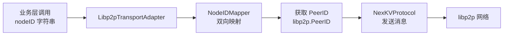

#### 1.3.3 可扩展性

- **协议扩展**: 支持多个应用协议（RPC、Gossip、Sync）
- **发现扩展**: 支持 mDNS 和 DHT 两种发现机制
- **编解码扩展**: 可替换为 Protobuf 等其他格式

---

## 2. 核心组件分析

### 2.1 P2PService - 统一服务入口

**文件位置**: `internal/transport/p2p_service.go`

#### 2.1.1 核心结构

```go
type P2PService struct {
    host      host.Host              // libp2p Host 实例
    protocol  *NexKVProtocol         // 协议处理器
    discovery *DiscoveryService      // 发现服务
    codec     MessageCodec           // 消息编解码器
    keyPath   string                 // 密钥文件路径
    started   bool                   // 启动状态标记
}
```

#### 2.1.2 Builder 模式初始化

```go
// 使用 Builder 模式构建服务
func NewP2PService(cfg *P2PServiceConfig) (*P2PService, error) {
    // 1. 密钥管理
    km := NewKeyManager(cfg.KeyPath)
    privKey, err := km.LoadOrGenerate()
    if err != nil {
        return nil, fmt.Errorf("密钥加载失败: %w", err)
    }

    // 2. 连接管理器配置
    cm, err := connmgr.NewConnManager(
        cfg.LowWater,
        cfg.HighWater,
        connmgr.WithGracePeriod(GracePeriod),
    )
    if err != nil {
        return nil, fmt.Errorf("连接管理器创建失败: %w", err)
    }

    // 3. 创建 libp2p Host
    h, err := libp2p.New(
        libp2p.Identity(privKey),
        libp2p.ListenAddrStrings(cfg.ListenAddr),
        libp2p.ConnectionManager(cm),
        libp2p.Ping(true),
        libp2p.Defaults(
            libp2p.DisableRelay(),
            libp2p.NATPortMap(),
        ),
    )
    if err != nil {
        return nil, fmt.Errorf("Host 创建失败: %w", err)
    }

    // 4. 创建协议处理器
    protocol := NewNexKVProtocol(h, codec)

    // 5. 创建发现服务
    discovery := NewDiscoveryService(h, cfg.DiscoveryTag)

    return &P2PService{
        host:      h,
        protocol:  protocol,
        discovery: discovery,
        codec:     NewMessagePackCodec(),
        keyPath:   cfg.KeyPath,
        started:   false,
    }, nil
}
```

**设计亮点**:

1. **Builder 模式**: 通过 `NewP2PService` 统一创建流程
2. **依赖注入**: 各组件通过构造函数注入
3. **错误传播**: 详细的错误信息，便于定位问题
4. **配置灵活**: 支持多种配置选项

#### 2.1.3 生命周期管理

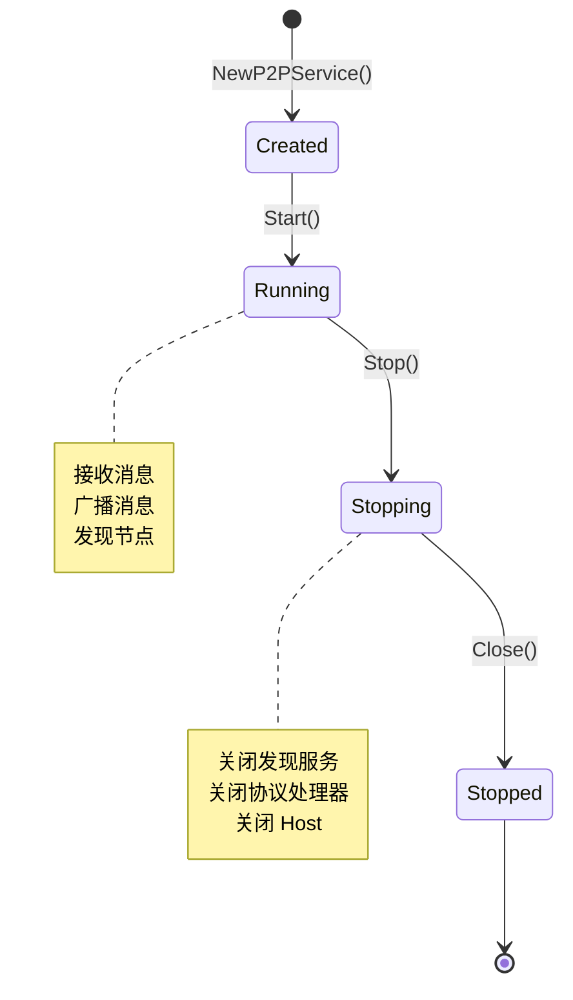

**启动流程**:

```go
func (s *P2PService) Start() error {
    if s.started {
        return fmt.Errorf("服务已启动")
    }

    // 1. 启动发现服务
    if err := s.discovery.Start(); err != nil {
        return fmt.Errorf("发现服务启动失败: %w", err)
    }

    // 2. 启动协议处理器
    if err := s.protocol.Start(); err != nil {
        return fmt.Errorf("协议处理器启动失败: %w", err)
    }

    s.started = true
    return nil
}
```

**关闭流程**:

```go
func (s *P2PService) Stop() error {
    if !s.started {
        return nil
    }

    // 按依赖顺序逆序关闭
    // 1. 关闭发现服务
    s.discovery.Stop()

    // 2. 关闭协议处理器
    s.protocol.Stop()

    // 3. 关闭 Host
    s.host.Close()

    s.started = false
    return nil
}
```

### 2.2 Libp2pTransportAdapter - 适配器层

**文件位置**: `internal/transport/libp2p_transport_adapter.go`

#### 2.2.1 核心职责

```go
type Libp2pTransportAdapter struct {
    host      host.Host
    protocol  *NexKVProtocol
    mapper    *NodeIDMapper
    handler   func(string, []byte)
    handlerMu sync.RWMutex
    ctx       context.Context
    cancel    context.CancelFunc
    started   bool
}
```

#### 2.2.2 双向映射机制

**NodeID ↔ PeerID 映射**:

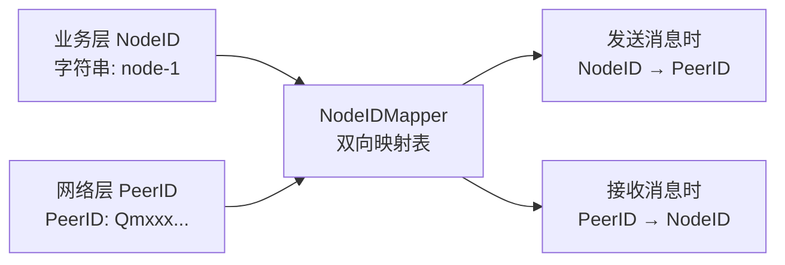

**实现代码**:

```go
// NodeIDMapper 双向映射
type NodeIDMapper struct {
    nodeIDToPeerID map[string]peer.ID
    peerIDToNodeID map[peer.ID]string
    mu             sync.RWMutex
}

// RegisterNodeID 注册映射关系
func (m *NodeIDMapper) Register(nodeID string, pid peer.ID) {
    m.mu.Lock()
    defer m.mu.Unlock()

    m.nodeIDToPeerID[nodeID] = pid
    m.peerIDToNodeID[pid] = nodeID
}

// GetPeerID 获取 PeerID
func (m *NodeIDMapper) GetPeerID(nodeID string) (peer.ID, bool) {
    m.mu.RLock()
    defer m.mu.RUnlock()
    pid, ok := m.nodeIDToPeerID[nodeID]
    return pid, ok
}

// GetNodeID 获取 NodeID
func (m *NodeIDMapper) GetNodeID(pid peer.ID) (string, bool) {
    m.mu.RLock()
    defer m.mu.RUnlock()
    nodeID, ok := m.peerIDToNodeID[pid]
    return nodeID, ok
}
```

#### 2.2.3 发送消息

```go
func (a *Libp2pTransportAdapter) Send(nodeID string, msg []byte) error {
    // 1. NodeID → PeerID 转换
    pid, ok := a.mapper.GetPeerID(nodeID)
    if !ok {
        return fmt.Errorf("未知节点 ID: %s", nodeID)
    }

    // 2. 封装为 NexKV 消息格式
    nexKVMsg := &Message{
        Type:      MessageTypeCluster,
        Payload:   msg,
        Timestamp: time.Now(),
        From:      a.host.ID().String(),
    }

    // 3. 发送消息
    return a.protocol.SendMessage(a.ctx, pid, nexKVMsg)
}
```

**设计优势**:

1. **API 兼容**: 保持与现有业务层 API 兼容
2. **透明转换**: 业务层无需关心 libp2p 的 PeerID
3. **类型安全**: 编译时检查 NodeID 类型
4. **易于测试**: 可独立测试映射逻辑

### 2.3 NexKVProtocol - 协议处理器

**文件位置**: `internal/transport/nexkv_protocol.go`

#### 2.3.1 多协议支持

```go
const (
    ProtocolNexKV     = protocol.ID("/nexkv/1.0.0")      // 主协议
    ProtocolNexKVRPC  = protocol.ID("/nexkv/rpc/1.0.0")  // RPC 协议
    ProtocolNexKVGossip = protocol.ID("/nexkv/gossip/1.0.0") // Gossip 协议
    ProtocolNexKVSync = protocol.ID("/nexkv/sync/1.0.0")  // 同步协议
)
```

**协议分层**:

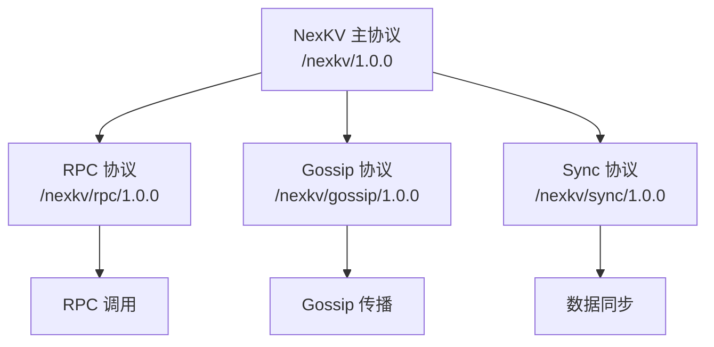

#### 2.3.2 消息处理器注册

```go
type NexKVProtocol struct {
    host      host.Host
    codec     MessageCodec
    handlers  map[MessageType]MessageHandler
    mu        sync.RWMutex
    stats     *ProtocolStats
    ctx       context.Context
    cancel    context.CancelFunc
}

// MessageHandler 消息处理器类型
type MessageHandler func(context.Context, network.Stream, *Message) error
```

**注册流程**:

```go
// RegisterHandler 注册消息处理器
func (p *NexKVProtocol) RegisterHandler(msgType MessageType, handler MessageHandler) error {
    p.mu.Lock()
    defer p.mu.Unlock()

    if _, exists := p.handlers[msgType]; exists {
        return fmt.Errorf("消息类型 %d 已注册处理器", msgType)
    }

    p.handlers[msgType] = handler
    return nil
}
```

**处理器分发**:

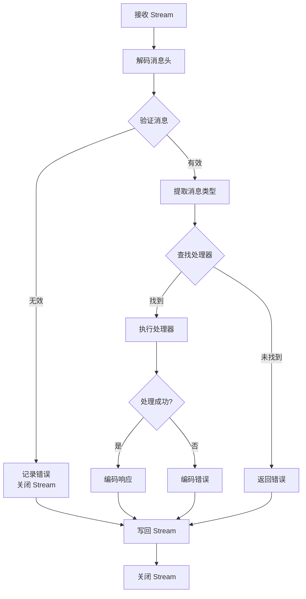

#### 2.3.3 广播机制

```go
func (p *NexKVProtocol) BroadcastMessage(
    ctx context.Context,
    pids []peer.ID,
    msg *Message,
) error {
    if len(pids) == 0 {
        return fmt.Errorf("peer 列表为空")
    }

    // 使用信号量限制并发数
    sem := make(chan struct{}, MaxConcurrentBroadcasts)

    // 收集所有错误
    errs := make(chan error, len(pids))
    var wg sync.WaitGroup

    for _, pid := range pids {
        wg.Add(1)
        go func(target peer.ID) {
            defer wg.Done()

            sem <- struct{} // 获取信号量
            defer func() { <-sem }() // 释放信号量

            // 克隆消息避免竞态条件
            msgClone := msg.Clone()
            if err := p.SendMessage(ctx, target, msgClone); err != nil {
                errs <- err
            }
        }(pid)
    }

    // 等待所有发送完成
    wg.Wait()
    close(errs)

    // 检查是否有错误
    var allErrors []error
    for err := range errs {
        allErrors = append(allErrors, err)
    }

    if len(allErrors) > 0 {
        return fmt.Errorf("广播完成，但有 %d 个错误", len(allErrors))
    }

    return nil
}
```

**并发控制**:

| 参数 | 值 | 说明 |
|------|-----|------|
| `MaxConcurrentBroadcasts` | 50 | 最大并发广播数 |
| `StreamWriteTimeout` | 10秒 | Stream 写入超时 |
| `ConnectTimeout` | 30秒 | 连接超时 |

---

## 3. 协议系统

### 3.1 协议设计

#### 3.1.1 协议栈

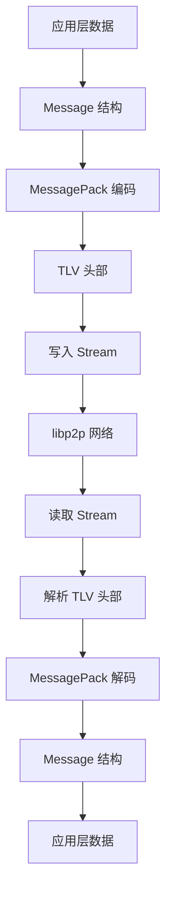

#### 3.1.2 协议版本控制

```go
// 协议版本定义
const (
    ProtocolNexKV     = protocol.ID("/nexkv/1.0.0")
    ProtocolNexKVRPC  = protocol.ID("/nexkv/rpc/1.0.0")
    ProtocolNexKVGossip = protocol.ID("/nexkv/gossip/1.0.0")
    ProtocolNexKVSync = protocol.ID("/nexkv/sync/1.0.0")
)

// 版本兼容性策略
type VersionCompatibility struct {
    CurrentVersion string
    MinVersion      string
    MaxVersion      string
}
```

### 3.2 协议处理器生命周期

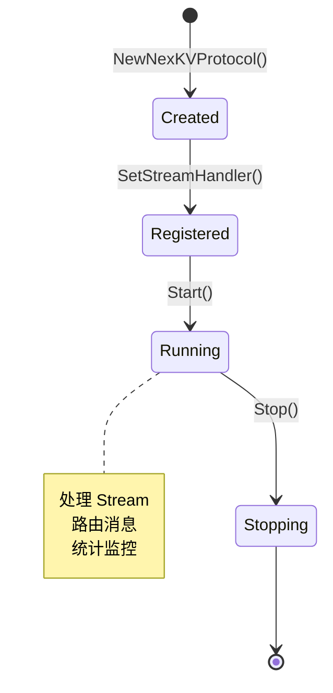

**启动流程**:

```go
func (p *NexKVProtocol) Start() error {
    p.ctx, p.cancel = context.WithCancel(context.Background())

    // 注册协议处理器
    p.host.SetStreamHandler(ProtocolNexKV, p.handleStream)

    p.mu.Lock()
    p.running = true
    p.mu.Unlock()

    return nil
}
```

---

## 4. 消息系统

### 4.1 消息类型定义

**文件位置**: `internal/transport/message.go`

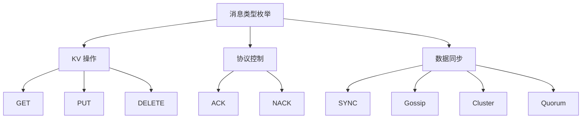

```go
type MessageType uint8

const (
    MessageTypeUnknown = 0
    MessageTypeGet     = 1  // KV GET 请求
    MessageTypePut     = 2  // KV PUT 请求
    MessageTypeDelete  = 3  // KV DELETE 请求
    MessageTypeSync    = 4  // 数据同步
    MessageTypeAck     = 5  // 确认消息
    MessageTypeNack    = 6  // 否认消息
    MessageTypeGossip  = 7  // Gossip 协议
    MessageTypeCluster = 8  // 集群管理
    MessageTypeQuorum  = 9  // Quorum 协议
)
```

### 4.2 消息结构

```go
type Message struct {
    Type      MessageType   // 消息类型（1字节）
    Seq       uint64        // 消息序号（单调递增）
    Key       []byte        // 键（GET/DELETE）
    Value     []byte        // 值（PUT）
    Version   uint64        // 版本号（MVCC）
    Timestamp time.Time     // 时间戳
    From      string        // 发送方节点ID
    To        string        // 接收方节点ID
    HopCount  uint8         // 跳数（路由控制）
    Payload   []byte        // 扩展负载
}
```

**字段说明**:

| 字段 | 类型 | 说明 | 示例值 |
|------|------|------|--------|
| **Type** | uint8 | 消息类型，支持 256 种 | MessageTypeGet (1) |
| **Seq** | uint64 | 消息序号，单调递增 | 1234567890 |
| **Key** | []byte | 键数据，用于 GET/DELETE | []byte("user:1234") |
| **Value** | []byte | 值数据，用于 PUT | []byte("{\"name\":\"Alice\"}") |
| **Version** | uint64 | MVCC 版本号 | 42 |
| **Timestamp** | time.Time | 消息创建时间 | 2026-02-07T10:30:00Z |
| **From** | string | 发送方节点 ID | "QmPeerID..." |
| **To** | string | 接收方节点 ID（可选） | "QmTargetID..." |
| **HopCount** | uint8 | 跳数，防循环 | 3 |
| **Payload** | []byte | 扩展数据 | JSON/Protobuf |

### 4.3 消息验证

```go
// IsValid 验证消息有效性
func (m *Message) IsValid() error {
    // 1. 消息类型验证
    if m.Type < MessageTypeGet || m.Type > MessageTypeQuorum {
        return fmt.Errorf("无效的消息类型: %d", m.Type)
    }

    // 2. 根据类型验证必填字段
    switch m.Type {
    case MessageTypeGet:
        if len(m.Key) == 0 {
            return fmt.Errorf("GET 请求必须包含 Key")
        }
    case MessageTypePut:
        if len(m.Key) == 0 || len(m.Value) == 0 {
            return fmt.Errorf("PUT 请求必须包含 Key 和 Value")
        }
    case MessageTypeDelete:
        if len(m.Key) == 0 {
            return fmt.Errorf("DELETE 请求必须包含 Key")
        }
    }

    // 3. 跳数限制验证
    if m.HopCount >= HopMax {
        return fmt.Errorf("跳数超限: %d", m.HopCount)
    }

    return nil
}
```

**验证规则**:

| 消息类型 | 必填字段 | 可选字段 |
|---------|---------|---------|
| **GET** | Key | Value, Version, Payload |
| **PUT** | Key, Value | Version, Payload |
| **DELETE** | Key | Value, Version, Payload |
| **SYNC** | - | 所有字段可选 |
| **ACK** | - | 所有字段可选 |

### 4.4 消息克隆

```go
// Clone 克隆消息，用于消息转发
func (m *Message) Clone() *Message {
    clone := &Message{
        Type:      m.Type,
        Seq:       m.Seq,
        Key:       bytes.Clone(m.Key),
        Value:     bytes.Clone(m.Value),
        Version:   m.Version,
        Timestamp: m.Timestamp,
        From:      m.From,
        To:        m.To,
        HopCount:  m.HopCount,
        Payload:   bytes.Clone(m.Payload),
    }

    // 转发时增加跳数
    clone.HopCount++
    if clone.HopCount >= HopMax {
        return nil // 跳数超限，丢弃消息
    }

    return clone
}
```

**克隆策略**:
- **深拷贝**: 所有字节切片都进行深拷贝
- **跳数递增**: 转发时自动增加 HopCount
- **超限保护**: 超过最大跳数返回 nil

---

## 5. 节点发现机制

### 5.1 发现服务架构

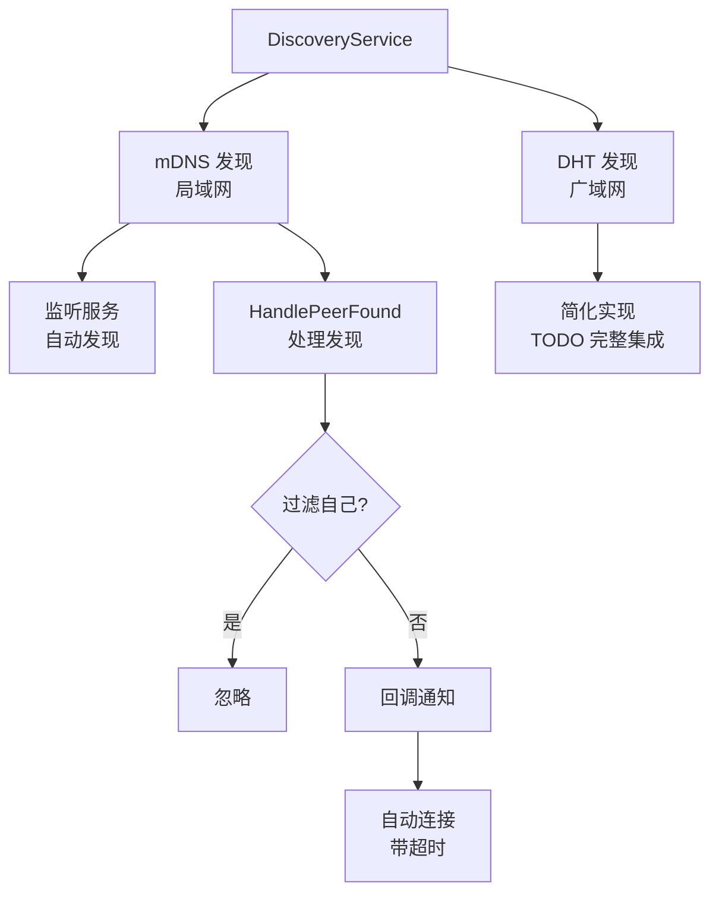

### 5.2 mDNS 发现

**文件位置**: `internal/transport/discovery.go`

#### 5.2.1 发现机制

```go
type DiscoveryService struct {
    host         host.Host
    tag          string
    ctx          context.Context
    cancel       context.CancelFunc
    wg           sync.WaitGroup
    activeConns  sync.WaitGroup
    onPeerFound func(peer.AddrInfo)
    started      bool
}
```

#### 5.2.2 发现流程

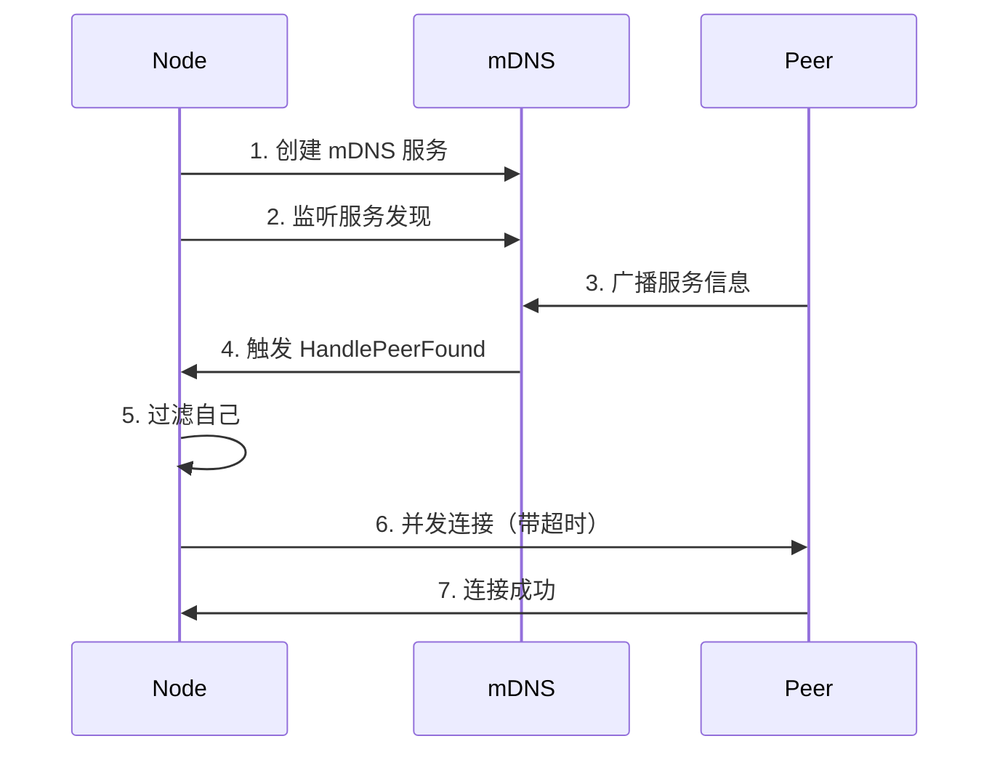

**实现代码**:

```go
func (ds *DiscoveryService) HandlePeerFound(pi peer.AddrInfo) {
    // 1. 过滤自己
    if pi.ID == ds.host.ID() {
        return
    }

    logging.WithField("peer_id", pi.ID).Info("发现节点")

    // 2. 回调通知
    if ds.onPeerFound != nil {
        ds.onPeerFound(pi)
    }

    // 3. 自动连接（带超时）
    ds.activeConns.Add(1)
    go func() {
        defer ds.activeConns.Done()

        ctx, cancel := context.WithTimeout(ds.ctx, DiscoveryConnectTimeout)
        defer cancel()

        if err := ds.host.Connect(ctx, pi); err != nil {
            logging.WithFields(map[string]any{
                "peer_id": pi.ID,
                "error":   err,
            }).Warn("连接节点失败")
            return
        }

        logging.WithField("peer_id", pi.ID).Info("节点连接成功")
    }()
}
```

**配置参数**:

| 参数 | 默认值 | 说明 |
|------|--------|------|
| `DiscoveryTag` | "nexkv" | mDNS 服务标签 |
| `DiscoveryConnectTimeout` | 10秒 | 连接超时 |
| `DiscoveryInterval` | 1分钟 | 发现间隔 |

### 5.3 Bootstrap 引导机制

**文件位置**: `internal/transport/bootstrap.go`

#### 5.3.1 引导流程

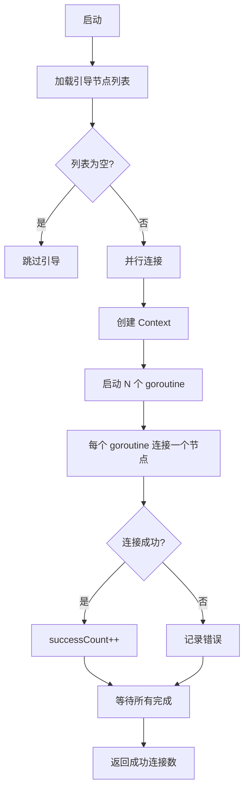

**实现代码**:

```go
func connectToAllPeers(ctx context.Context, h host.Host, peers []peer.AddrInfo) int32 {
    var successCount int32
    var wg sync.WaitGroup

    for _, p := range peers {
        wg.Add(1)
        go func(pi peer.AddrInfo) {
            defer wg.Done()

            if connectToPeerWithTimeout(ctx, h, pi) {
                atomic.AddInt32(&successCount, 1)
            }
        }(p)
    }

    wg.Wait()
    return successCount
}

func connectToPeerWithTimeout(ctx context.Context, h host.Host, pi peer.AddrInfo) bool {
    ctx, cancel := context.WithTimeout(ctx, BootstrapConnectTimeout)
    defer cancel()

    err := h.Connect(ctx, pi)
    return err == nil
}
```

**引导配置**:

```yaml
bootstrap:
  peers:
    - "/ip4/127.0.0.1/4001/p2p/QmPeerID..."
    - "/ip4/127.0.0.1/4002/p2p/QmPeerID..."
  timeout: 30s
```

---

## 6. 适配器设计

### 6.1 适配器模式实现

**文件位置**: `internal/transport/libp2p_transport_adapter.go`

#### 6.1.1 核心适配逻辑

```mermaid
flowchart LR
    subgraph["业务层"]
        A1[Send: nodeID<br/>Receive: handler]
    end

    subgraph["适配器层"]
        B1[NodeIDMapper<br/>双向转换]
        B2[消息封装<br/>类型转换]
    end

    subgraph["网络层"]
        C1[SendMessage<br/>Protocol]
        C2[SetStreamHandler<br/>Protocol]
    end

    A1 -->|Send| B1
    B1 -->|NodeID→PeerID| C1
    C1 -->|Network发送|

    C2 -->|网络接收| B2
    B2 -->|消息分发| A1
```

#### 6.1.2 发送适配

```go
func (a *Libp2pTransportAdapter) Send(nodeID string, msg []byte) error {
    // 1. NodeID → PeerID 转换
    pid, ok := a.mapper.GetPeerID(nodeID)
    if !ok {
        return fmt.Errorf("未知节点 ID: %s", nodeID)
    }

    // 2. 封装为 NexKV 消息
    nexKVMsg := &Message{
        Type:      MessageTypeCluster,
        Payload:   msg,
        Timestamp: time.Now(),
        From:      a.host.ID().String(),
    }

    // 3. 发送消息
    return a.protocol.SendMessage(a.ctx, pid, nexKVMsg)
}
```

#### 6.1.3 接收适配

```go
func (a *Libp2pTransportAdapter) Receive(handler func(string, []byte)) error {
    a.handlerMu.Lock()
    defer a.handlerMu.Unlock()

    a.handler = handler

    // 懒加载协议处理器（只执行一次）
    a.lazyRegisterHandler()

    return nil
}

func (a *Libp2pTransportAdapter) lazyRegisterHandler() {
    a.host.SetStreamHandler(ProtocolNexKV, a.handleStream)
}

func (a *Libp2pTransportAdapter) handleStream(s network.Stream) {
    // 读取消息
    msg, err := a.protocol.ReceiveMessage(s)
    if err != nil {
        return
    }

    // PeerID → NodeID 转换
    nodeID := a.mapper.GetOrCreateNodeID(s.Conn().RemotePeer())

    // 提取 Payload
    var payload []byte
    if msg.Type == MessageTypeCluster {
        payload = msg.Payload
    }

    // 调用业务层处理器
    a.handler(nodeID, payload)
}
```

---

## 7. 密钥管理

### 7.1 KeyManager 设计

**文件位置**: `internal/transport/key_manager.go`

#### 7.1.1 核心功能

```go
type KeyManager struct {
    keyPath string
    mu      sync.RWMutex
}
```

#### 7.1.2 密钥加载流程

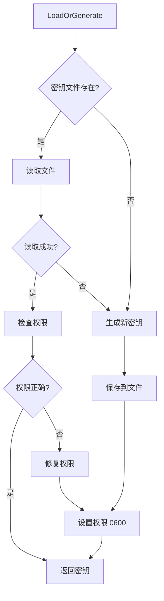

**实现代码**:

```go
func (km *KeyManager) LoadOrGenerate() (crypto.PrivKey, error) {
    // 1. 尝试加载
    if privKey, err := km.load(); err == nil {
        km.checkAndFixPermissions()
        return privKey, nil
    }

    // 2. 生成新密钥
    privKey, _, err := crypto.GenerateEd25519Key(crand.Reader)
    if err != nil {
        return nil, fmt.Errorf("生成密钥失败: %w", err)
    }

    // 3. 保存密钥
    return privKey, km.save(privKey)
}

func (km *KeyManager) save(privKey crypto.PrivKey) error {
    km.mu.Lock()
    defer km.mu.Unlock()

    // 使用 libp2p 标准序列化格式
    keyBytes, err := crypto.MarshalPrivateKey(privKey)
    if err != nil {
        return err
    }

    // 写入文件
    if err := os.WriteFile(km.keyPath, keyBytes, 0600); err != nil {
        return fmt.Errorf("写入密钥失败: %w", err)
    }

    logging.WithField("key_path", km.keyPath).Info("密钥已保存")
    return nil
}
```

#### 7.1.3 安全特性

| 特性 | 实现方式 | 安全价值 |
|------|---------|---------|
| **Ed25519** | 现代加密算法 | 抗量子计算攻击 |
| **权限 0600** | 严格的文件权限 | 防止未授权访问 |
| **路径展开** | 支持 ~/ 和环境变量 | 灵活的配置管理 |
| **原子写入** | 临时文件+重命名 | 防止写入损坏 |

---

## 8. 并发与性能

### 8.1 并发控制

#### 8.1.1 广播并发限制

```go
const MaxConcurrentBroadcasts = 50

func (p *NexKVProtocol) BroadcastMessage(
    ctx context.Context,
    pids []peer.ID,
    msg *Message,
) error {
    sem := make(chan struct{}, MaxConcurrentBroadcasts)

    for _, pid := range pids {
        go func(target peer.ID) {
            sem <- struct{}        // 获取信号量
            defer func() { <-sem }() // 释放信号量
            p.SendMessage(ctx, target, msg.Clone())
        }(pid)
    }
}
```

**并发控制策略**:

| 场景 | 并发数 | 超时策略 |
|------|-------|---------|
| **广播** | 50 | 单个失败不影响整体 |
| **引导连接** | 全部 | 30秒超时 |
| **发现连接** | 全部 | 10秒超时 |

#### 8.1.2 连接管理器配置

```go
cm, err := connmgr.NewConnManager(
    cfg.LowWater,   // 低水位: 100
    cfg.HighWater,  // 高水位: 400
    connmgr.WithGracePeriod(time.Minute),
)
```

**水位机制**:

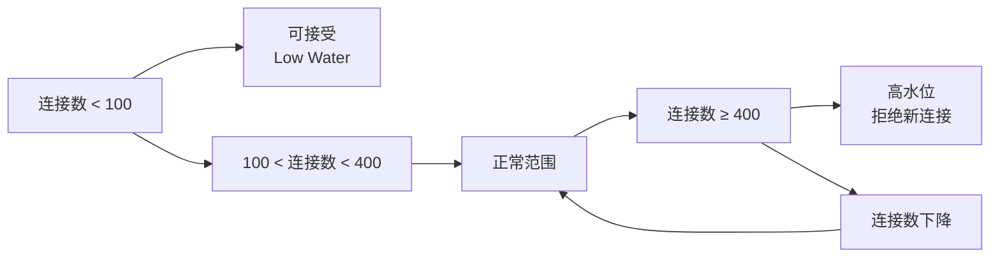

### 8.2 性能优化

#### 8.2.1 内存优化

**对象复用**:
```go
// 消息克隆复用
msgClone := msg.Clone()

// 避免频繁创建大对象
var bufPool = sync.Pool{
    New: func() any {
        return make([]byte, 0, 1024)
    },
}
```

**字节切片操作**:
```go
// 零拷贝优化
key := bytes.Clone(m.Key)   // 深拷贝
value := bytes.Clone(m.Value)
```

#### 8.2.2 网络优化

**连接复用**:
- libp2p 自动管理连接池
- 长连接减少握手开销
- 连接管理器自动清理

**批量操作**:
- 并行发送广播消息
- 批量引导连接
- goroutine 池复用

---

## 9. 安全机制

### 9.1 密钥安全

#### 9.1.1 Ed25519 算法

```go
// 生成密钥对
privKey, pubKey, err := crypto.GenerateEd25519(crand.Reader)
```

**Ed25519 优势**:
1. **性能高**: 签名和验证速度快
2. **安全性高**: 抗量子计算攻击
3. **兼容性**: libp2p 标准支持

#### 9.1.2 密钥权限管理

```go
func (km *KeyManager) checkAndFixPermissions() error {
    // 检查当前权限
    info, err := os.Stat(km.keyPath)
    if err != nil {
        return err
    }

    // 修复为 0600
    if info.Mode().Perm() != 0600 {
        return os.Chmod(km.keyPath, 0600)
    }

    return nil
}
```

### 9.2 网络安全

#### 9.2.1 身份验证

libp2p 内置的身份验证机制：

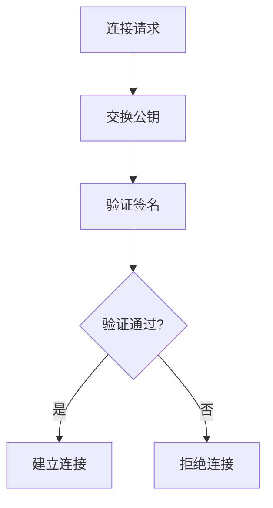

#### 9.2.2 路由控制

**跳数限制**:
```go
const HopMax = 10

func (m *Message) Clone() *Message {
    clone := m.DeepCopy()
    clone.HopCount++
    if clone.HopCount >= HopMax {
        return nil // 超过跳数限制
    }
    return clone
}
```

**防循环机制**:

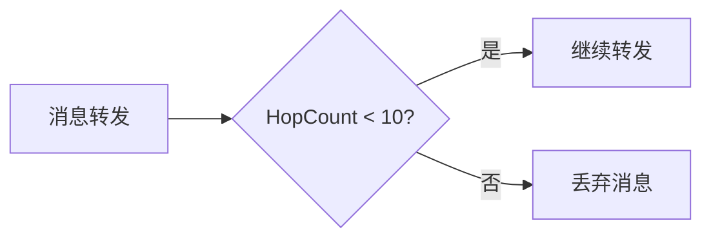

---

## 10. 设计模式与原则

### 10.1 设计模式应用

| 模式 | 应用场景 | 文件 |
|------|---------|------|
| **Builder 模式** | P2PService 构建 | `p2p_service.go`, `host_builder.go` |
| **适配器模式** | NodeID/PeerID 映射 | `libp2p_transport_adapter.go` |
| **观察者模式** | 消息处理器注册 | `nexkv_protocol.go` |
| **策略模式** | 发现服务选择 | `discovery.go` |
| **工厂模式** | Transport 工厂 | `transport_factory.go` |
| **代理模式** | 适配器层代理 | `libp2p_transport_adapter.go` |

### 10.2 SOLID 原则

#### 10.2.1 单一职责原则 (SRP)

```go
// ✅ 正确：单一职责
type KeyManager struct {
    keyPath string
    mu      sync.RWMutex
}
// 只负责密钥管理

// ❌ 错误：职责混乱
type KeyManager struct {
    keyPath  string
    codec    MessageCodec  // 编解码器？
    host     host.Host     // Host？
}
```

#### 10.2.2 开闭原则 (OCP)

```go
// MessageCodec 接口
type MessageCodec interface {
    Encode(w io.Writer, msg *Message) error
    Decode(r io.Reader) (*Message, error)
}

// MessagePack 实现
type MessagePackCodec struct{}

// 可扩展：未来可添加 ProtobufCodec
type ProtobufCodec struct{}
```

#### 10.2.3 里氏替换原则 (LSP)

```go
// RateLimiter 接口
type RateLimiter interface {
    Acquire(ctx context.Context) error
    Release()
}

// 令牌桶实现
type TokenBucketRateLimiter struct{}

// 漏桶实现（可替换）
type LeakyBucketRateLimiter struct{}
```

### 10.3 架构原则

#### 10.3.1 分层架构

```
应用层 (KV Store, Gossip)
    ↓
服务层 (P2PService)
    ↓
适配层 (TransportAdapter)
    ↓
协议层 (NexKVProtocol)
    ↓
网络层 (libp2p)
```

**优势**:
- 清晰的依赖关系
- 易于测试和维护
- 支持独立演进

#### 10.3.2 接口隔离

```go
// Transport 接口：只暴露必要方法
type Transport interface {
    Send(nodeID string, msg []byte) error
    Receive(handler func(string, []byte)) error
    Close() error
}

// 业务层只依赖这个接口，不关心底层实现
```

---

## 11. 监控与调试

### 11.1 协议统计

```go
type ProtocolStats struct {
    MessagesSent     uint64
    MessagesReceived uint64
    BytesSent        uint64
    BytesReceived    uint64
    Errors           uint64
    mu               sync.Mutex
}

// 获取统计信息
func (p *NexKVProtocol) Stats() *ProtocolStats {
    p.mu.Lock()
    defer p.mu.Unlock()
    return p.stats
}
```

### 11.2 关键日志点

| 场景 | 日志级别 | 日志内容 |
|------|---------|---------|
| **节点发现** | Info | PeerID, 地址 |
| **连接成功** | Info | PeerID, 延迟 |
| **连接失败** | Warn | PeerID, 错误 |
| **消息发送** | Debug | 消息类型, 大小 |
| **消息接收** | Debug | 消息类型, PeerID |
| **错误处理** | Error | 错误类型, 堆栈 |

---

## 12. 扩展性设计

### 12.1 可扩展点

#### 12.1.1 新增发现服务

```go
// 实现新的发现服务
type CustomDiscovery struct {
    peers []peer.AddrInfo
}

// 添加到 P2PService
service.discovery = NewCustomDiscovery(peers)
```

#### 12.1.2 新增协议

```go
// 定义新协议
const ProtocolNexKVCustom = protocol.ID("/nexkv/custom/1.0.0")

// 注册处理器
protocol.RegisterHandler(MessageTypeCustom, customHandler)
```

#### 12.1.3 新增编解码器

```go
// 实现 MessageCodec 接口
type ProtobufCodec struct{}

// 替换默认编解码器
service.codec = &ProtobufCodec{}
```

### 12.2 配置化

```yaml
# P2P 服务配置
p2p:
  listen_addr: "0.0.0.0:4001"
  key_path: "./.nexkv/key.pem"
  discovery_tag: "nexkv"
  low_water: 100
  high_water: 400
  bootstrap_peers:
    - "/ip4/127.0.0.1/4001/p2p/..."
```

---

## 13. 总结与展望

### 13.1 核心成就

1. **完整的 P2P 网络层**: 基于 libp2p 的成熟实现
2. **灵活的适配器**: 业务层与网络层透明桥接
3. **类型安全的消息系统**: 结构化消息 + 类型验证
4. **高效的节点发现**: mDNS + DHT 双重发现
5. **安全可靠**: Ed25519 + 密钥权限管理
6. **性能优化**: 并发控制 + 连接复用

### 13.2 技术亮点

1. **分层架构**: 清晰的职责划分和模块化
2. **设计模式**: Builder、适配器、观察者模式的综合应用
3. **并发安全**: RWMutex、原子操作、信号量的正确使用
4. **错误处理**: 详细的错误分类和传播
5. **可扩展性**: 接口抽象支持多种实现

### 13.3 未来规划

1. **DHT 集成**: 完整实现分布式哈希表发现
2. **QUIC 支持**: 基于 HTTP/3 的高性能传输
3. **gRPC 集成**: 统一的 RPC 框架
4. **TLS 加密**: 传输层加密
5. **负载均衡**: 智能路由策略

---

**文档版本**: v1.0
**最后更新**: 2026-02-07
**维护者**: NexKV 开发团队
**状态**: ✅ 完成
