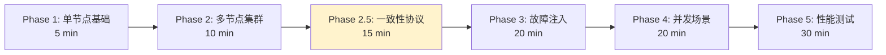

# PR-061: E2E 测试框架设计与实现

> **PR 类型**: 📋 Feature（功能开发）
> **创建日期**: 2026-02-13
> **关联问题**: docs/09-code-review/2026-02-12-findings-report.md (无直接关联，独立需求)
> **Pre 文档状态**: ⏳ 待架构师评审
> **文档版本**: v1.1（根据架构评审意见修订）

---

## 1. 需求概述

### 1.1 背景

NexKV 项目目前缺少端到端（E2E）测试，无法验证：
- nexkvd daemon 进程的完整生命周期
- nexkv CLI 与 daemon 的交互正确性
- 多节点集群的协同工作
- 故障场景下的自愈能力

### 1.2 目标

设计并实现一套完整的 E2E 测试框架，支持：
1. **6 阶段渐进式验证**：从单节点到性能测试（新增 Phase 2.5）
2. **真实环境模拟**：启动真实进程，无 Mock
3. **可扩展架构**：易于添加新测试用例

### 1.3 预期产出

- E2E 测试框架代码（`test/e2e/framework/`）
- Phase 1-3 + Phase 2.5 测试用例实现
- Makefile 集成
- CI 配置

---

## 2. 设计方案

### 2.1 技术栈

| 组件 | 选型 | 理由 |
|------|------|------|
| **测试框架** | Go testing + testify | Go 原生，断言丰富 |
| **进程管理** | os/exec | 真实进程环境 |
| **并发控制** | sync.WaitGroup + context | 协程安全 |

### 2.2 分阶段测试策略（修订版）



**Phase 2.5: 一致性协议专项测试**（新增）

| 测试用例 | 验证目标 | 预计耗时 |
|---------|---------|---------|
| **Gossip 测试** | | |
| TestGossipConvergence7Nodes | 7 节点 Gossip 收敛 < 50s | 2 min |
| TestGossipWithNodeFailure | 节点故障时 Gossip 继续工作 | 2 min |
| TestGossipWithNetworkDelay | 网络延迟时的 Gossip 收敛 | 2 min |
| **Quorum 测试** | | |
| TestQuorumMajority | 3 节点 Quorum 达成 | 1 min |
| TestQuorumMinorityBlock | 2/5 节点无法达成 Quorum | 1 min |
| TestQuorumTimeout | Quorum 超时回滚 | 2 min |
| TestQuorumSplitBrain | 脑裂场景验证 | 3 min |
| TestQuorumWithPartialFailure | 部分节点故障时的 Quorum | 2 min |
| **2PC 测试** | | |
| Test2PCAllCommit | 所有节点提交 | 2 min |
| Test2PCOneRollback | 一个节点回滚 | 2 min |
| Test2PCCoordinatorCrash | 协调者崩溃后恢复 | 3 min |
| Test2PCParticipantCrash | 参与者崩溃后补偿 | 3 min |
| Test2PCGossipSync | 2PC 状态 Gossip 同步 | 2 min |

### 2.3 框架分层设计（修订版）

```
test/e2e/
├── framework/           # 测试框架
│   ├── daemon.go       # Daemon 进程管理
│   ├── cli.go          # CLI 命令执行
│   ├── cluster.go      # 集群编排
│   ├── config.go       # 配置生成
│   ├── network.go      # 网络控制（新增）
│   ├── metrics.go      # 指标采集（新增）
│   ├── log_analyzer.go # 日志分析（新增）
│   ├── data_verifier.go # 数据验证（新增）
│   └── assert.go       # E2E 断言
├── phases/             # 分阶段测试
│   ├── phase1_single_node/
│   ├── phase2_cluster/
│   ├── phase2_5_consistency/  # 新增
│   ├── phase3_fault_injection/
│   ├── phase4_concurrency/
│   └── phase5_performance/
└── README.md
```

**新增组件说明**:

| 组件 | 职责 | 优先级 | 实现方案 |
|------|------|--------|---------|
| `network.go` | 基于 libp2p 的故障注入 | P0 | Libp2pFaultInjector |
| `metrics.go` | CPU、内存、网络指标采集 | P1 | 待定 |
| `log_analyzer.go` | 日志错误、警告分析 | P1 | 待定 |
| `data_verifier.go` | 数据一致性验证 | P0 | DataVerifier + CLI |

**DataVerifier 核心能力**:

| 能力 | 方法 | 使用场景 |
|------|------|---------|
| 一致性校验 | `VerifyConsistency(keys)` | 自动化测试 |
| 节点数据读取 | `GetData(ctx, keys)` | 数据对比 |
| 序列号校验 | `GetSequence(ctx)` | 增量同步验证 |
| 收敛等待 | `WaitConverge(ctx, timeout)` | 最终一致性验证 |

**CLI 工具命令**:

```bash
nexkv-e2e verify --keys key1,key2 --nodes node-1,node-2,node-3
nexkv-e2e verify --all --timeout 30s
nexkv-e2e verify --watch --interval 10s
```

**Libp2pFaultInjector 核心能力**:

| 故障类型 | 方法 | 验证目标 |
|---------|------|---------|
| 连接关闭 | `InjectConnClose(peerID)` | 重连机制 |
| 流关闭 | `InjectStreamClose(stream)` | 通信容错 |
| 流延迟 | `InjectStreamLatency(delay)` | 超时处理 |
| 协议失败 | `InjectProtocolFailure(protocolID)` | 协议兼容性 |
| 节点崩溃 | `InjectNodeCrash()` | 故障感知 |

---

## 3. 架构师评审意见

### 3.1 评审结果

| 维度 | 评分 | 说明 |
|------|------|------|
| 架构合理性 | 7/10 | 分层清晰，但缺少关键组件 |
| 技术选型 | 8/10 | 选型合理 |
| 架构契合度 | 5/10 | **严重不足**，缺少一致性协议测试 |
| 可实施性 | 4/10 | **框架代码不完整** |
| **综合评分** | **6/10** | ⚠️ **需要修订** |

### 3.2 必须完成的 P0 条件（修订版）

| 条件 | 说明 | 当前状态 | 文件位置 |
|------|------|---------|---------|
| **配置文件生成** | `WriteConfig()` 生成可用 nexkvd.yaml | ⚠️ 空实现 | `framework/config.go:88` |
| **健康检查实现** | `HealthCheck()` 通过 RPC 检查节点状态 | ⚠️ 空实现 | `framework/daemon.go:140` |
| **CLI 输出解析** | `ParseClusterStatus()` 解析实际输出 | ⚠️ 硬编码 | `framework/cli.go:195` |
| **集群配置生成** | `generateConfigs()` 生成所有节点配置 | ⚠️ 空实现 | `framework/cluster.go:250` |
| **目录创建** | `createDirIfNotExists()` 创建目录 | ⚠️ 空实现 | `framework/cluster.go:260` |
| **Phase 2.5 测试** | 一致性协议专项测试 | ❌ 未设计 | `phases/phase2_5_consistency/` |
| **网络控制组件** | 网络分区模拟能力 | ❌ 未设计 | `framework/network.go` |

### 3.3 架构契合度分析

**NexKV 三层架构覆盖度**:

| 架构层 | 组件 | 当前测试覆盖 | 目标覆盖 |
|--------|------|-------------|---------|
| **Layer 1: 元数据一致性** | Gossip | 20% (1/5) | 100% |
| **Layer 1: 元数据一致性** | Quorum | 0% (0/5) | 100% |
| **Layer 2: 副本数据一致性** | 分片自治 | 0% (0/3) | 100% |
| **Layer 3: 分布式事务一致性** | 2PC | 0% (0/5) | 100% |

---

## 4. 实施计划（修订版）

### 4.1 4 周分阶段计划

| 周次 | 内容 | 详细任务分解 |
|------|------|-------------|
| **Week 1** | 框架基础设施 + Phase 1 | Day 1-2: 配置生成、端口管理<br/>Day 3-4: Daemon 完善、健康检查<br/>Day 5: Phase 1 测试 |
| **Week 2** | Phase 2 + Phase 2.5 | Day 1-2: 集群编排、网络控制<br/>Day 3: Phase 2 基础测试<br/>Day 4-5: Phase 2.5 一致性协议测试 |
| **Week 3** | Phase 3 + Phase 4 | Day 1-2: Phase 3 故障注入<br/>Day 3: Phase 4 并发测试<br/>Day 4-5: 2PC 测试完善 |
| **Week 4** | Phase 5 + CI 集成 | Day 1-2: Phase 5 性能测试<br/>Day 3: CI 集成<br/>Day 4-5: 文档完善、Code Review |

### 4.2 Week 1 详细任务

| 任务 | 产出 | 验收标准 |
|------|------|---------|
| 配置文件生成 | `config.go:88` 实现 | 能生成可用的 nexkvd.yaml |
| 端口管理 | 端口池、冲突检测 | 无端口冲突 |
| Daemon 完善 | `daemon.go:140` 实现 | 启动/停止/健康检查 |
| CLI 解析 | `cli.go:195` 实现 | 能正确解析 status 输出 |
| 集群配置 | `cluster.go:250` 实现 | 能启动 3 节点集群 |
| Phase 1 测试 | 8 个测试用例 | 全部通过 |

### 4.3 Week 2 详细任务

| 任务 | 产出 | 验收标准 |
|------|------|---------|
| 网络控制 | `network.go` + `Libp2pFaultInjector` | 能模拟网络分区 |
| 集群测试 | Phase 2 扩展 | 集群形成、拓扑 |
| **数据验证组件** | `data_verifier.go` + CLI | 能验证数据一致性 |
| Gossip 测试 | 3 个用例 | 收敛 < 50s |
| Quorum 测试 | 5 个用例 | 多数派/少数派/超时 |
| 2PC 测试 | 5 个用例 | 提交/回滚/恢复 |

**数据验证组件详细设计**:

```go
// data_verifier.go
package framework

// LightDataVerifier 轻量级数据一致性验证器
type LightDataVerifier struct {
    clients []DataClient
    timeout  time.Duration
}

// DataClient 数据客户端接口
type DataClient interface {
    GetID() string
    GetState(ctx context.Context) (map[string]interface{}, error)
    GetUpdateSeq(ctx context.Context) (uint64, error)
}

// VerifyFinalConsistency 验证最终一致性
func (v *LightDataVerifier) VerifyFinalConsistency(
    ctx context.Context,
) *ConsistencyResult {
    // 并发读取所有节点数据
    // 校验序列号
    // 校验状态一致性
    // 返回结构化结果
}

// CLI 工具集成
type CLIVerifier struct {
    daemonAddr string
}

func (cv *CLIVerifier) VerifyKeys(ctx context.Context, keys []string) (*ConsistencyResult, error) {
    // 通过 CLI 查询多个节点的数据
    // 对比验证
    // 返回结果
}
```

**CLI 命令示例**:

```bash
# 验证指定键的一致性
nexkv-e2e verify --keys key1,key2 --nodes node-1,node-2,node-3

# 验证所有数据的一致性
nexkv-e2e verify --all --timeout 30s

# 实时监控一致性状态
nexkv-e2e verify --watch --interval 10s
```

---

## 5. 风险评估（修订版）

| 风险 | 概率 | 影响 | 缓解措施 |
|------|------|------|---------|
| **进程清理不彻底** | 高 | 僵尸进程、端口占用 | 进程池 + 强制清理 |
| **测试不稳定** | 中 | CI 频繁失败 | 重试机制、优化超时 |
| **框架实现复杂** | 高 | 延期完成 | 先完成最小可用版本 |
| **网络控制实现困难** | 中 | Phase 2.5 延期 | 先用简单方案（tc 命令） |

---

## 6. 验收标准（修订版）

### 6.1 最小可用版本（MVP）

- [x] 框架代码结构完成
- [ ] 框架基础设施完整（配置生成、健康检查、CLI 解析）
- [ ] Phase 1 测试用例全部通过（8/8）
- [ ] `make test-e2e-phase1` 可运行

### 6.2 Phase 2 验收标准

- [ ] 多节点集群形成测试通过
- [ ] 节点发现测试通过
- [ ] 拓扑形成测试通过

### 6.3 Phase 2.5 验收标准（新增）

**Gossip 测试**:
- [ ] 7 节点 Gossip 收敛时间 < 50s
- [ ] 节点故障时 Gossip 继续工作
- [ ] 网络延迟下 Gossip 最终收敛

**Quorum 测试**:
- [ ] 3 节点 Quorum 多数派达成
- [ ] 2/5 节点无法达成 Quorum（阻塞）
- [ ] Quorum 超时正确回滚
- [ ] 脑裂场景下少数派独立运行
- [ ] 部分节点故障时 Quorum 行为正确

**2PC 测试**:
- [ ] 所有节点正常提交
- [ ] 单个节点回滚不影响其他节点
- [ ] 协调者崩溃后可恢复
- [ ] 参与者崩溃后可补偿
- [ ] 2PC 状态通过 Gossip 同步

### 6.4 完整版本

- [ ] Phase 1-3 + 2.5 测试用例全部通过
- [ ] Phase 4 并发测试通过
- [ ] Phase 5 性能测试通过
- [ ] `make test-e2e` 可运行
- [ ] CI 集成完成

---

## 7. 参考资料

- **设计文档**: `docs/04_test/07_E2E测试架构设计.md`
- **架构评审报告**: 见上方第 3 节
- **项目架构**: `docs/CLAUDE.md`
- **三层架构**: `docs/00_overview/core-architecture-concept.md`

---

## 8. 技术方案详细设计

### 8.1 网络控制实现方案（基于 libp2p）

**确定方案**: 使用 libp2p 原生 API 进行故障注入，无需 root 权限。

**核心故障场景**:

| 场景 | 实现方式 | 代码位置 |
|------|---------|---------|
| **连接断开** | `conn.Close()` | `network.go` |
| **流关闭** | `stream.Close()` | `network.go` |
| **流延迟** | 包装 `Stream` 注入延迟 | `network.go` |
| **协议协商失败** | 使用不存在的协议 ID | `network.go` |
| **节点下线** | `host.Close()` | `daemon.go` |
| **NAT 穿透失败** | `libp2p.NoNatPortMap()` | `config.go` |

**故障注入器设计**:

```go
// Libp2pFaultInjector libp2p 故障注入器
type Libp2pFaultInjector struct {
    host    libp2p.Host
    enabled bool
}

// 故障类型
type FaultType int

const (
    FaultConnClose  FaultType = iota // 连接关闭
    FaultStreamClose                  // 流关闭
    FaultStreamLatency                // 流延迟
    FaultProtocolNegotiationFailed   // 协议协商失败
    FaultNodeCrash                    // 节点崩溃
)

// InjectFault 注入故障
func (fi *Libp2pFaultInjector) InjectFault(
    faultType FaultType,
    target peer.ID,
    params ...interface{},
) error
```

**使用示例**:

```go
// E2E 测试中使用故障注入器
func TestNetworkPartition(t *testing.T) {
    cluster := framework.NewTestCluster(3)
    cluster.Start(ctx)
    defer cluster.Stop()

    // 获取节点 A 的故障注入器
    injector := cluster.Nodes[0].FaultInjector
    injector.Enable()

    // 注入连接关闭故障（断开与节点 B 的连接）
    err := injector.InjectFault(
        framework.FaultConnClose,
        cluster.Nodes[1].PeerID,
    )
    require.NoError(t, err)

    // 验证集群行为
    // ...
}
```

**libp2p 故障注入核心代码示例**:

```go
// 场景1: 模拟连接主动断开
func TestFault_CloseConnection(t *testing.T) {
    hostA, hostB, cleanup := setupTwoNodes(t)
    defer cleanup()

    // 验证初始连接存在
    assert.True(t, hostA.Network().Connectedness(hostB.ID()) == network.Connected)

    // 故障注入：关闭节点A到B的所有连接
    for _, conn := range hostA.Network().ConnsToPeer(hostB.ID()) {
        _ = conn.Close()
    }

    // 验证连接已断开
    time.Sleep(100 * time.Millisecond)
    assert.True(t, hostA.Network().Connectedness(hostB.ID()) == network.NotConnected)
}

// 场景2: 模拟流超时/主动关闭流
func TestFault_StreamClose(t *testing.T) {
    hostA, hostB, cleanup := setupTwoNodes(t)
    defer cleanup()

    protocolID := "/test/1.0.0"
    hostB.SetStreamHandler(protocolID, func(stream network.Stream) {
        defer stream.Close()
        buf := make([]byte, 1024)
        _, err := stream.Read(buf)
        assert.Error(t, err) // 预期读取失败
    })

    stream, err := hostA.NewStream(context.Background(), hostB.ID(), protocolID)
    assert.NoError(t, err)

    // 故障注入：写入部分数据后主动关闭流
    _, err = stream.Write([]byte("partial data"))
    assert.NoError(t, err)
    _ = stream.Close()

    assert.True(t, stream.Closed())
}

// 场景3: 注入流延迟（模拟网络卡顿）
type DelayedStream struct {
    network.Stream
    delay time.Duration
}

func (ds *DelayedStream) Write(b []byte) (n int, err error) {
    time.Sleep(ds.delay) // 注入延迟
    return ds.Stream.Write(b)
}

func TestFault_StreamLatency(t *testing.T) {
    hostA, hostB, cleanup := setupTwoNodes(t)
    defer cleanup()

    protocolID := "/test/latency/1.0.0"
    hostB.SetStreamHandler(protocolID, func(stream network.Stream) {
        defer stream.Close()
        buf := make([]byte, 1024)
        n, _ := stream.Read(buf)
        _ = stream.Write(buf[:n])
    })

    stream, err := hostA.NewStream(context.Background(), hostB.ID(), protocolID)
    assert.NoError(t, err)

    // 故障注入：包装流，注入2秒延迟
    delayedStream := &DelayedStream{Stream: stream, delay: 2 * time.Second}

    // 验证超时逻辑
    ctx, cancel := context.WithTimeout(context.Background(), 1*time.Second)
    defer cancel()
    _, err = delayedStream.Write([]byte("test latency"))
    assert.ErrorContains(t, err, "deadline exceeded")
}

// 场景4: 模拟协议协商失败
func TestFault_ProtocolNegotiationFailed(t *testing.T) {
    hostA, hostB, cleanup := setupTwoNodes(t)
    defer cleanup()

    validProtocol := "/valid/1.0.0"
    hostB.SetStreamHandler(validProtocol, func(stream network.Stream) {
        defer stream.Close()
    })

    // 故障注入：使用不存在的协议ID
    invalidProtocol := "/invalid/1.0.0"
    stream, err := hostA.NewStream(context.Background(), hostB.ID(), invalidProtocol)

    assert.Error(t, err)
    assert.Nil(t, stream)
    assert.ErrorContains(t, err, "protocol not supported")
}

// 场景5: 模拟节点突然下线
func TestFault_NodeCrash(t *testing.T) {
    hostA, err := libp2p.New(libp2p.ListenAddrStrings("/ip4/127.0.0.1/tcp/0"))
    assert.NoError(t, err)
    defer hostA.Close()

    hostB, err := libp2p.New(libp2p.ListenAddrStrings("/ip4/127.0.0.1/tcp/0"))
    assert.NoError(t, err)

    err = hostA.Connect(context.Background(), peer.AddrInfo{ID: hostB.ID(), Addrs: hostB.Addrs()})
    assert.NoError(t, err)
    assert.True(t, hostA.Network().Connectedness(hostB.ID()) == network.Connected)

    // 故障注入：模拟节点B崩溃
    _ = hostB.Close()

    // 验证节点A感知到节点B下线
    time.Sleep(500 * time.Millisecond)
    assert.True(t, hostA.Network().Connectedness(hostB.ID()) == network.NotConnected)
}
```

---

### 8.2 分布式一致性验证方案

**确定方案**: 三层验证架构（核心层 + 调试层 + 排查层）

| 层级 | 核心能力 | 适用场景 |
|------|---------|---------|
| **核心层** | 自动化一致性校验、异常告警 | 生产监控、自动化测试 |
| **调试层** | 手动快速验证、指定范围校验 | 开发调试、临时问题排查 |
| **排查层** | 日志采集分析、根因定位 | 一致性异常复盘、合规审计 |

**核心组件设计**:

```go
// DataVerifier 数据一致性验证器
type DataVerifier struct {
    clients []DataClient // 待验证节点的客户端列表
    timeout time.Duration
    convergeWait time.Duration  // 收敛等待时间
}

// DataClient 通用数据客户端接口（业务侧适配）
type DataClient interface {
    GetID() string                 // 节点唯一标识
    GetState(ctx context.Context) (map[string]interface{}, error)
    GetUpdateSeq(ctx context.Context) (uint64, error)
}

// ConsistencyResult 一致性验证结果
type ConsistencyResult struct {
    Consistent     bool                   // 是否一致
    TotalNodes     int                    // 总节点数
    ConsistentNodes int                   // 一致节点数
    InconsistentNodes []string            // 不一致节点列表
    Details        map[string]interface{} // 详细信息
}

// VerifyFinalConsistency 验证最终一致性
func (dv *DataVerifier) VerifyFinalConsistency(
    ctx context.Context,
) *ConsistencyResult
```

**CLI 工具命令**:

```bash
# 验证所有节点的一致性
nexkv-e2e verify --all --timeout 30s

# 验证指定键的一致性
nexkv-e2e verify --keys key1,key2 --nodes node-1,node-2,node-3

# 实时监控一致性状态
nexkv-e2e verify --watch --interval 10s

# 查看序列号状态
nexkv-e2e seq-verify --nodes node-1,node-2,node-3

# 查询节点日志
nexkv-e2e log-query --node node-1 --event data_update
```

**结构化日志格式**:

```json
{
  "timestamp": "2024-05-21T12:00:00Z",
  "node_id": "node-1",
  "event": "data_update",
  "key": "user_123",
  "value": "v3",
  "seq": 101,
  "sync_to": ["node-2", "node-3"],
  "sync_result": "success"
}
```

**分阶段实施计划**:

| 阶段 | 内容 | 交付物 | 预计工作量 |
|------|------|--------|-----------|
| **阶段1** | 基础验证组件 + CLI 工具 | DataVerifier 代码 + CLI 可执行文件 | 1-2 周 |
| **阶段2** | 场景适配 + 日志分析 | 分区一致性验证 + 日志分析脚本 | 2-3 周 |
| **阶段3** | CI/CD 集成 + 定时校验 | CI 配置 + 定时任务 | 1-2 周 |

**关键注意事项**:

| 注意事项 | 说明 |
|---------|------|
| **接口解耦** | DataClient 接口适配业务，避免耦合具体存储 |
| **性能控制** | 并发校验节点数 ≤ 20 |
| **时序容错** | 设置 30s 收敛等待时间后再校验 |
| **日志粒度** | 仅核心操作（更新/同步/冲突）打日志 |

**使用场景**:

| 场景 | 操作方式 |
|------|---------|
| 开发调试 | CLI 工具手动校验 |
| 自动化测试 | 测试用例中调用 VerifyConsistency |
| 生产监控 | 定时执行验证组件，失败告警 |
| 异常排查 | CLI 确认范围 → 日志分析定位根因 |
| 合规审计 | 留存验证报告 + 日志文件 |

---

## 9. 待确认问题（修订版）

### ✅ 已确认

1. **Phase 2.5 独立性**: ✅ **确认为独立阶段**
   - 理由：便于单独评审和验收，测试目标明确

2. **网络控制实现**: ✅ **使用 libp2p 原生 API**
   - 无需 root 权限
   - 支持 5 种核心故障类型

3. **数据验证策略**: ✅ **三层验证架构**
   - 核心层：DataVerifier 组件
   - 调试层：CLI 工具
   - 排查层：日志分析

### 9.4 实施周期详细规划

**确定方案**: 4 周（20 个工作日）周期具备可落地性。

**周次对应表**:

| 阶段 | 周次 | 核心交付物 |
|------|------|---------|
| 基础落地 | Week 1 | 验证组件核心接口、CLI 工具、日志模板 |
| 场景适配 | Week 2 | 分区/冲突校验、监控告警、日志分析脚本 |
| 自动化闭环 | Week 3-4 | CI/CD 集成、定时任务、趋势报表 |

**关键适配点**:
- 压缩非核心功能，优先保障生产核心场景（20 节点内集群、最终一致性校验）
- 自动化闭环优先完成核心能力，趋势报表简化为基础版本
- 全程采用"每日迭代 + 周中卡点评审"

**分阶段提交计划（单 PR 策略）**:

| 提交阶段 | 时间节点 | 提交内容 | 评审重点 |
|----------|---------|---------|---------|
| 阶段1 | 第 1 周结束 | 验证组件基础接口、CLI 工具雏形 | 接口解耦性、CLI 核心功能可用性 |
| 阶段2 | 第 2 周结束 | 场景适配核心逻辑（分区/冲突校验）、日志模板 | 校验逻辑准确性、日志结构化程度 |
| 阶段3 | 第 3 周中 | 监控告警对接、日志分析脚本 | 告警触发准确性、脚本执行效率 |
| 阶段4 | 第 3 周结束 | CI/CD 集成示例、定时任务配置 | 集成无侵入、定时任务稳定性 |
| 阶段5 | 第 4 周中 | 自动化报表基础版本、全量联调代码 | 端到端流程完整性、性能指标达标 |
| 最终提交 | 第 4 周结束 | 全量代码合并、文档定稿 | 代码规范、交付物完整性、性能阈值达标 |

**单 PR 管理注意事项**:

| 注意事项 | 说明 |
|---------|------|
| **分支隔离** | 基于主分支创建独立特性分支 `feature/consistency-verify` |
| **提交备注** | 标注"阶段X-功能模块"，如"阶段2-分区一致性校验" |
| **增量评审** | 每阶段提交后同步触发增量代码评审 |
| **冲突处理** | 每周五统一合并主分支代码至特性分支 |

**风险兜底措施**:

若 4 周内某阶段出现延期，优先保障以下核心交付物：
1. 验证组件基础校验能力（保障"能验证"）
2. CLI 调试工具（保障"可调试"）
3. 生产定时校验 + 告警（保障"可监控"）

非核心功能（如趋势报表、分区场景深度适配）可在 4 周后通过 1-2 天小迭代补充。

---

## 10. 待确认问题（修订版）

### ✅ 已确认

1. **Phase 2.5 独立性**: ✅ **确认为独立阶段**
   - 理由：便于单独评审和验收，测试目标明确

2. **网络控制实现**: ✅ **使用 libp2p 原生 API**
   - 无需 root 权限
   - 支持 5 种核心故障类型

3. **数据验证策略**: ✅ **三层验证架构**
   - 核心层：DataVerifier 组件
   - 调试层：CLI 工具
   - 排查层：日志分析

4. **性能基准**: ✅ **已定义具体指标**
   - 吞吐量：≥50 批次/分钟（CLI）、≥1000 任务/小时（测试）
   - 延迟：≤500ms 平均、≤1s P99（CLI）
   - 资源占用：CPU≤20%、内存≤512MB

5. **实施周期**: ✅ **4 周可行，单 PR + 分阶段提交**
   - 单个 PR + 分 5 阶段提交
   - 分支隔离：`feature/consistency-verify`
   - 风险兜底：优先保障核心交付物

### ⏳ 待确认

（所有技术方案已确认，等待架构师最终评审 Pre 文档）

**确定方案**: 4 周（20 个工作日）周期具备可落地性。

**周次对应表**:

| 阶段 | 周次 | 核心交付物 |
|------|------|---------|
| 基础落地 | Week 1 | 验证组件核心接口、CLI 工具、日志模板 |
| 场景适配 | Week 2 | 分区/冲突校验、监控告警、日志分析脚本 |
| 自动化闭环 | Week 3-4 | CI/CD 集成、定时任务、趋势报表 |

**关键适配点**:
- 压缩非核心功能，优先保障生产核心场景（20 节点内集群、最终一致性校验）
- 自动化闭环优先完成核心能力，趋势报表简化为基础版本
- 全程采用"每日迭代 + 周中卡点评审"

**分阶段提交计划（单 PR 策略）**:

| 提交阶段 | 时间节点 | 提交内容 | 评审重点 |
|----------|---------|---------|---------|
| 阶段1 | 第 1 周结束 | 验证组件基础接口、CLI 工具雏形 | 接口解耦性、CLI 核心功能可用性 |
| 阶段2 | 第 2 周结束 | 场景适配核心逻辑（分区/冲突校验）、日志模板 | 校验逻辑准确性、日志结构化程度 |
| 阶段3 | 第 3 周中 | 监控告警对接、日志分析脚本 | 告警触发准确性、脚本执行效率 |
| 阶段4 | 第 3 周结束 | CI/CD 集成示例、定时任务配置 | 集成无侵入、定时任务稳定性 |
| 阶段5 | 第 4 周中 | 自动化报表基础版本、全量联调代码 | 端到端流程完整性、性能指标达标 |
| 最终提交 | 第 4 周结束 | 全量代码合并、文档定稿 | 代码规范、交付物完整性、性能阈值达标 |

**单 PR 管理注意事项**:

| 注意事项 | 说明 |
|---------|------|
| **分支隔离** | 基于主分支创建独立特性分支 `feature/consistency-verify` |
| **提交备注** | 标注"阶段X-功能模块"，如"阶段2-分区一致性校验" |
| **增量评审** | 每阶段提交后同步触发增量代码评审 |
| **冲突处理** | 每周五统一合并主分支代码至特性分支 |

**风险兜底措施**:

若 4 周内某阶段出现延期，优先保障以下核心交付物：
1. 验证组件基础校验能力（保障"能验证"）
2. CLI 调试工具（保障"可调试"）
3. 生产定时校验 + 告警（保障"可监控"）

非核心功能（如趋势报表、分区场景深度适配）可在 4 周后通过 1-2 天小迭代补充。

### ✅ 已确认

1. **Phase 2.5 独立性**: ✅ **确认为独立阶段**
   - 理由：便于单独评审和验收，测试目标明确

2. **网络控制实现**: ✅ **使用 libp2p 原生 API**
   - 无需 root 权限
   - 支持 5 种核心故障类型

3. **数据验证策略**: ✅ **三层验证架构**
   - 核心层：DataVerifier 组件
   - 调试层：CLI 工具
   - 排查层：日志分析

4. **性能基准**: ✅ **已定义具体指标**
   - 吞吐量：≥50 批次/分钟（CLI）、≥1000 任务/小时（测试）
   - 延迟：≤500ms 平均、≤1s P99（CLI）
   - 资源占用：CPU≤20%、内存≤512MB
   - 详见第 8.3 节

---

### 8.3 性能基准定义

**确定方案**: 定义一致性验证组件的性能基准，确保不对业务集群造成性能干扰。

#### 8.3.1 吞吐量（Throughput）

**定义**: 单位时间内一致性验证组件可完成的"节点数据校验任务数"。

| 场景类型 | 指标计算维度 | 阈值要求 | 测试条件 |
|---------|-------------|---------|---------|
| **开发调试（CLI）** | 单批次校验任务数/分钟 | ≥ 50 批次/分钟 | 单节点、单次校验≤100个数据键 |
| **自动化测试** | 校验任务数/小时 | ≥ 1000 任务/小时 | 10节点集群、单次校验≤500个数据键 |
| **生产定时校验** | 集群全量校验完成耗时 | ≤ 10 分钟/次 | 20节点集群、全量数据键≤10000个 |

**备注**: 1个"校验任务"= 完成1组（N个节点）同一数据键的一致性对比；生产场景支持按数据分片并行校验，分片数≤节点数的50%。

#### 8.3.2 延迟（Latency）

**定义**: 从触发一致性校验请求到返回最终校验结果的耗时。

| 场景类型 | 平均延迟阈值 | P99延迟阈值 | 测试条件 |
|---------|-------------|------------|---------|
| **开发调试（CLI）** | ≤ 500ms | ≤ 1s | 单节点、单次校验≤100个数据键 |
| **自动化测试** | ≤ 1s | ≤ 3s | 10节点集群、单次校验≤500个数据键 |
| **生产定时校验** | - | - | 按"全量校验完成耗时"阈值管控 |

**备注**: 延迟不含"分布式数据收敛等待时间"（如30s容错期）；网络分区场景下，延迟可放宽至P99 ≤ 5s。

#### 8.3.3 资源占用

**定义**: 一致性验证组件/CLI工具运行时占用的服务器资源。

| 资源类型 | 指标计算维度 | 阈值要求 | 测试条件 |
|---------|-------------|---------|---------|
| **CPU 占用** | 校验过程中峰值CPU使用率 | ≤ 20%（单实例） | 20节点集群全量校验 |
| **内存占用** | 校验过程中峰值内存使用量 | ≤ 512MB（单实例） | 全量数据键≤10000个 |
| **网络带宽** | 校验过程中节点间数据传输量 | ≤ 10MB/s（单实例） | 多节点并行校验 |
| **磁盘IO** | 日志写入/结果存储IOPS | ≤ 100 IOPS | 持续1小时校验 |

**备注**: 生产环境建议为验证组件分配独立轻量容器（1核2G）；定时校验优先在业务低峰期执行（如凌晨）。

#### 8.3.4 性能测试方法

**基准测试环境**:
- 硬件: CPU 8核16G、千兆网卡、SSD 存储
- 集群: 5/10/20节点梯度测试
- 数据量: 5000/10000/20000梯度

**测试工具**:
- 吞吐量/延迟: 批量调用验证组件API，统计QPS和响应时间
- 资源占用: `top`/`docker stats`/Prometheus 监控

**结果判定**: 所有场景下，吞吐量、延迟、资源占用需同时满足阈值要求。

#### 8.3.5 性能调优边界

- 禁止无限制增加并行线程数（线程数≤CPU核心数）
- 禁止关闭核心日志输出
- 生产场景校验频率不得高于"每小时1次"

---

## 10. 变更记录

| 版本 | 日期 | 变更内容 |
|------|------|---------|
| v1.0 | 2026-02-13 | 初始版本 |
| v1.1 | 2026-02-13 | 根据架构评审意见修订<br/>- 新增 Phase 2.5 详细测试用例<br/>- 新增 4 个框架组件<br/>- 细化 P0 条件和验收标准<br/>- 扩展实施计划 |
| v1.2 | 2026-02-13 | 确定技术方案<br/>- Phase 2.5 确认为独立阶段<br/>- 网络控制使用 libp2p API<br/>- 数据验证采用三层架构<br/>- 新增详细代码示例 |
| v1.3 | 2026-02-13 | 新增性能基准定义<br/>- 吞吐量: ≥50 批次/分钟（CLI）、≥1000 任务/小时（测试）<br/>- 延迟: ≤500ms 平均、≤1s P99（CLI）<br/>- 资源占用: CPU≤20%、内存≤512MB<br/>- 性能测试方法和调优边界 |
| v1.4 | 2026-02-13 | 新增实施周期详细规划<br/>- 4 周周期可行性评估<br/>- 单 PR + 分 5 阶段提交策略<br/>- 风险兜底措施 |
| v1.5 | 2026-02-13 | 所有技术方案已确认<br/>- Phase 2.5 独立性 ✅<br/>- 网络控制（libp2p API）✅<br/>- 数据验证（三层架构）✅<br/>- 性能基准（具体指标）✅<br/>- 实施周期（4 周）✅<br/>- 等待架构师最终评审 |
| v1.4 | 2026-02-13 | 新增实施周期详细规划<br/>- 4 周周期可行性评估<br/>- 单 PR + 分阶段提交策略<br/>- 风险兜底措施 |

---

**文档版本**: v1.3
**创建日期**: 2026-02-13
**修订日期**: 2026-02-13
**创建者**: 🤖 AI 核心开发
**状态**: ⏳ 待架构师评审

