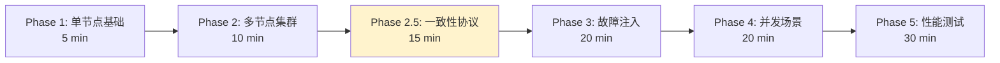

# PR-061: E2E 测试框架设计与实现

> **PR 类型**: 📋 Feature（功能开发）
> **创建日期**: 2026-02-13
> **关联问题**: docs/09-code-review/2026-02-12-findings-report.md (无直接关联，独立需求)
> **Pre 文档状态**: ⏳ 待架构师评审

---

## 1. 需求概述

### 1.1 背景

NexKV 项目目前缺少端到端（E2E）测试，无法验证：
- nexkvd daemon 进程的完整生命周期
- nexkv CLI 与 daemon 的交互正确性
- 多节点集群的协同工作
- 故障场景下的自愈能力

### 1.2 目标

设计并实现一套完整的 E2E 测试框架，支持：
1. **5 阶段渐进式验证**：从单节点到性能测试
2. **真实环境模拟**：启动真实进程，无 Mock
3. **可扩展架构**：易于添加新测试用例

### 1.3 预期产出

- E2E 测试框架代码（`test/e2e/framework/`）
- Phase 1-3 测试用例实现
- Makefile 集成
- CI 配置

---

## 2. 设计方案

### 2.1 技术栈

| 组件 | 选型 | 理由 |
|------|------|------|
| **测试框架** | Go testing + testify | Go 原生，断言丰富 |
| **进程管理** | os/exec | 真实进程环境 |
| **并发控制** | sync.WaitGroup + context | 协程安全 |

### 2.2 分阶段测试策略



### 2.3 框架分层设计

```
test/e2e/
├── framework/           # 测试框架
│   ├── daemon.go       # Daemon 进程管理
│   ├── cli.go          # CLI 命令执行
│   ├── cluster.go      # 集群编排
│   ├── config.go       # 配置生成
│   ├── network.go      # 网络控制（新增）
│   └── assert.go       # E2E 断言
├── phases/             # 分阶段测试
│   ├── phase1_single_node/
│   ├── phase2_cluster/
│   ├── phase2_5_consistency/  # 新增
│   ├── phase3_fault_injection/
│   ├── phase4_concurrency/
│   └── phase5_performance/
└── README.md
```

---

## 3. 架构师评审意见

### 3.1 评审结果

| 维度 | 评分 | 说明 |
|------|------|------|
| 架构合理性 | 7/10 | 分层清晰，但缺少关键组件 |
| 技术选型 | 8/10 | 选型合理 |
| 架构契合度 | 5/10 | **严重不足**，缺少一致性协议测试 |
| 可实施性 | 4/10 | **框架代码不完整** |
| **综合评分** | **6/10** | ⚠️ **需要修订** |

### 3.2 必须完成的 P0 条件

| 条件 | 说明 | 当前状态 |
|------|------|---------|
| **框架基础设施** | 配置生成、健康检查、CLI 解析 | ⚠️ 空实现 |
| **Phase 2.5 测试** | 一致性协议专项测试 | ❌ 未设计 |
| **Quorum 测试** | 多数派确认、超时回滚 | ❌ 未设计 |
| **2PC 测试** | 提交、回滚、故障恢复 | ❌ 未设计 |
| **网络控制** | 网络分区模拟 | ❌ 未设计 |

---

## 4. 实施计划（修订版）

### 4.1 分阶段计划

| 阶段 | 内容 | 预计工作量 |
|------|------|-----------|
| **Week 1** | 框架基础设施 + Phase 1 | 5 天 |
| **Week 2** | Phase 2 + Phase 2.5 | 5 天 |
| **Week 3** | Phase 3 + Phase 4 | 5 天 |
| **Week 4** | Phase 5 + CI 集成 | 5 天 |

### 4.2 Week 1 详细任务

| 任务 | 产出 | 验收标准 |
|------|------|---------|
| 配置文件生成 | `config.go` 实现 | 能生成可用的 nexkvd.yaml |
| Daemon 进程管理 | `daemon.go` 完善 | 启动/停止/健康检查 |
| CLI 输出解析 | `cli.go` 实现 | 能正确解析 status 输出 |
| 集群编排 | `cluster.go` 完善 | 能启动 3 节点集群 |
| Phase 1 测试 | 8 个测试用例 | 全部通过 |

---

## 5. 风险评估

| 风险 | 概率 | 影响 | 缓解措施 |
|------|------|------|---------|
| **进程清理不彻底** | 高 | 僵尸进程、端口占用 | 进程池 + 强制清理 |
| **测试不稳定** | 中 | CI 频繁失败 | 重试机制、优化超时 |
| **框架实现复杂** | 高 | 延期完成 | 先完成最小可用版本 |

---

## 6. 验收标准

### 6.1 最小可用版本（MVP）

- [x] 框架代码结构完成
- [ ] 框架基础设施实现（配置生成、健康检查、CLI 解析）
- [ ] Phase 1 测试用例全部通过
- [ ] `make test-e2e-phase1` 可运行

### 6.2 完整版本

- [ ] Phase 1-3 测试用例全部通过
- [ ] Phase 2.5 一致性协议测试实现
- [ ] `make test-e2e` 可运行
- [ ] CI 集成完成

---

## 7. 参考资料

- **设计文档**: `docs/04_test/07_E2E测试架构设计.md`
- **架构评审报告**: 见上方第 3 节
- **项目架构**: `docs/CLAUDE.md`

---

## 8. 待确认问题

1. **框架基础设施优先级**：是否需要先完成网络控制、日志分析等组件？
2. **Phase 2.5 独立性**：是否作为独立阶段，还是合并到 Phase 2？
3. **实施周期**：4 周是否可接受？是否需要拆分为多个 PR？

---

**文档版本**: v1.0
**创建日期**: 2026-02-13
**创建者**: 🤖 AI 核心开发
**状态**: ⏳ 待架构师评审
