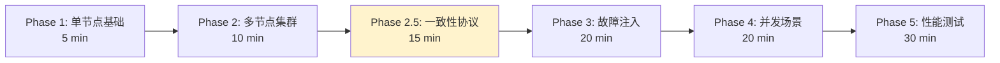

# PR-061: E2E 测试框架设计与实现

> **PR 类型**: 📋 Feature（功能开发）
> **创建日期**: 2026-02-13
> **关联问题**: docs/09-code-review/2026-02-12-findings-report.md (无直接关联，独立需求)
> **Pre 文档状态**: ⏳ 待架构师评审
> **文档版本**: v1.1（根据架构评审意见修订）

---

## 1. 需求概述

### 1.1 背景

NexKV 项目目前缺少端到端（E2E）测试，无法验证：
- nexkvd daemon 进程的完整生命周期
- nexkv CLI 与 daemon 的交互正确性
- 多节点集群的协同工作
- 故障场景下的自愈能力

### 1.2 目标

设计并实现一套完整的 E2E 测试框架，支持：
1. **6 阶段渐进式验证**：从单节点到性能测试（新增 Phase 2.5）
2. **真实环境模拟**：启动真实进程，无 Mock
3. **可扩展架构**：易于添加新测试用例

### 1.3 预期产出

- E2E 测试框架代码（`test/e2e/framework/`）
- Phase 1-3 + Phase 2.5 测试用例实现
- Makefile 集成
- CI 配置

---

## 2. 设计方案

### 2.1 技术栈

| 组件 | 选型 | 理由 |
|------|------|------|
| **测试框架** | Go testing + testify | Go 原生，断言丰富 |
| **进程管理** | os/exec | 真实进程环境 |
| **并发控制** | sync.WaitGroup + context | 协程安全 |

### 2.2 分阶段测试策略（修订版）



**Phase 2.5: 一致性协议专项测试**（新增）

| 测试用例 | 验证目标 | 预计耗时 |
|---------|---------|---------|
| **Gossip 测试** | | |
| TestGossipConvergence7Nodes | 7 节点 Gossip 收敛 < 50s | 2 min |
| TestGossipWithNodeFailure | 节点故障时 Gossip 继续工作 | 2 min |
| TestGossipWithNetworkDelay | 网络延迟时的 Gossip 收敛 | 2 min |
| **Quorum 测试** | | |
| TestQuorumMajority | 3 节点 Quorum 达成 | 1 min |
| TestQuorumMinorityBlock | 2/5 节点无法达成 Quorum | 1 min |
| TestQuorumTimeout | Quorum 超时回滚 | 2 min |
| TestQuorumSplitBrain | 脑裂场景验证 | 3 min |
| TestQuorumWithPartialFailure | 部分节点故障时的 Quorum | 2 min |
| **2PC 测试** | | |
| Test2PCAllCommit | 所有节点提交 | 2 min |
| Test2PCOneRollback | 一个节点回滚 | 2 min |
| Test2PCCoordinatorCrash | 协调者崩溃后恢复 | 3 min |
| Test2PCParticipantCrash | 参与者崩溃后补偿 | 3 min |
| Test2PCGossipSync | 2PC 状态 Gossip 同步 | 2 min |

### 2.3 框架分层设计（修订版）

```
test/e2e/
├── framework/           # 测试框架
│   ├── daemon.go       # Daemon 进程管理
│   ├── cli.go          # CLI 命令执行
│   ├── cluster.go      # 集群编排
│   ├── config.go       # 配置生成
│   ├── network.go      # 网络控制（新增）
│   ├── metrics.go      # 指标采集（新增）
│   ├── log_analyzer.go # 日志分析（新增）
│   ├── data_verifier.go # 数据验证（新增）
│   └── assert.go       # E2E 断言
├── phases/             # 分阶段测试
│   ├── phase1_single_node/
│   ├── phase2_cluster/
│   ├── phase2_5_consistency/  # 新增
│   ├── phase3_fault_injection/
│   ├── phase4_concurrency/
│   └── phase5_performance/
└── README.md
```

**新增组件说明**:

| 组件 | 职责 | 优先级 |
|------|------|--------|
| `network.go` | 网络分区、延迟、丢包模拟 | P0 |
| `metrics.go` | CPU、内存、网络指标采集 | P1 |
| `log_analyzer.go` | 日志错误、警告分析 | P1 |
| `data_verifier.go` | 数据一致性验证 | P0 |

---

## 3. 架构师评审意见

### 3.1 评审结果

| 维度 | 评分 | 说明 |
|------|------|------|
| 架构合理性 | 7/10 | 分层清晰，但缺少关键组件 |
| 技术选型 | 8/10 | 选型合理 |
| 架构契合度 | 5/10 | **严重不足**，缺少一致性协议测试 |
| 可实施性 | 4/10 | **框架代码不完整** |
| **综合评分** | **6/10** | ⚠️ **需要修订** |

### 3.2 必须完成的 P0 条件（修订版）

| 条件 | 说明 | 当前状态 | 文件位置 |
|------|------|---------|---------|
| **配置文件生成** | `WriteConfig()` 生成可用 nexkvd.yaml | ⚠️ 空实现 | `framework/config.go:88` |
| **健康检查实现** | `HealthCheck()` 通过 RPC 检查节点状态 | ⚠️ 空实现 | `framework/daemon.go:140` |
| **CLI 输出解析** | `ParseClusterStatus()` 解析实际输出 | ⚠️ 硬编码 | `framework/cli.go:195` |
| **集群配置生成** | `generateConfigs()` 生成所有节点配置 | ⚠️ 空实现 | `framework/cluster.go:250` |
| **目录创建** | `createDirIfNotExists()` 创建目录 | ⚠️ 空实现 | `framework/cluster.go:260` |
| **Phase 2.5 测试** | 一致性协议专项测试 | ❌ 未设计 | `phases/phase2_5_consistency/` |
| **网络控制组件** | 网络分区模拟能力 | ❌ 未设计 | `framework/network.go` |

### 3.3 架构契合度分析

**NexKV 三层架构覆盖度**:

| 架构层 | 组件 | 当前测试覆盖 | 目标覆盖 |
|--------|------|-------------|---------|
| **Layer 1: 元数据一致性** | Gossip | 20% (1/5) | 100% |
| **Layer 1: 元数据一致性** | Quorum | 0% (0/5) | 100% |
| **Layer 2: 副本数据一致性** | 分片自治 | 0% (0/3) | 100% |
| **Layer 3: 分布式事务一致性** | 2PC | 0% (0/5) | 100% |

---

## 4. 实施计划（修订版）

### 4.1 4 周分阶段计划

| 周次 | 内容 | 详细任务分解 |
|------|------|-------------|
| **Week 1** | 框架基础设施 + Phase 1 | Day 1-2: 配置生成、端口管理<br/>Day 3-4: Daemon 完善、健康检查<br/>Day 5: Phase 1 测试 |
| **Week 2** | Phase 2 + Phase 2.5 | Day 1-2: 集群编排、网络控制<br/>Day 3: Phase 2 基础测试<br/>Day 4-5: Phase 2.5 一致性协议测试 |
| **Week 3** | Phase 3 + Phase 4 | Day 1-2: Phase 3 故障注入<br/>Day 3: Phase 4 并发测试<br/>Day 4-5: 2PC 测试完善 |
| **Week 4** | Phase 5 + CI 集成 | Day 1-2: Phase 5 性能测试<br/>Day 3: CI 集成<br/>Day 4-5: 文档完善、Code Review |

### 4.2 Week 1 详细任务

| 任务 | 产出 | 验收标准 |
|------|------|---------|
| 配置文件生成 | `config.go:88` 实现 | 能生成可用的 nexkvd.yaml |
| 端口管理 | 端口池、冲突检测 | 无端口冲突 |
| Daemon 完善 | `daemon.go:140` 实现 | 启动/停止/健康检查 |
| CLI 解析 | `cli.go:195` 实现 | 能正确解析 status 输出 |
| 集群配置 | `cluster.go:250` 实现 | 能启动 3 节点集群 |
| Phase 1 测试 | 8 个测试用例 | 全部通过 |

### 4.3 Week 2 详细任务

| 任务 | 产出 | 验收标准 |
|------|------|---------|
| 网络控制 | `network.go` | 能模拟网络分区 |
| 集群测试 | Phase 2 扩展 | 集群形成、拓扑 |
| Gossip 测试 | 3 个用例 | 收敛 < 50s |
| Quorum 测试 | 5 个用例 | 多数派/少数派/超时 |
| 2PC 测试 | 5 个用例 | 提交/回滚/恢复 |

---

## 5. 风险评估（修订版）

| 风险 | 概率 | 影响 | 缓解措施 |
|------|------|------|---------|
| **进程清理不彻底** | 高 | 僵尸进程、端口占用 | 进程池 + 强制清理 |
| **测试不稳定** | 中 | CI 频繁失败 | 重试机制、优化超时 |
| **框架实现复杂** | 高 | 延期完成 | 先完成最小可用版本 |
| **网络控制实现困难** | 中 | Phase 2.5 延期 | 先用简单方案（tc 命令） |

---

## 6. 验收标准（修订版）

### 6.1 最小可用版本（MVP）

- [x] 框架代码结构完成
- [ ] 框架基础设施完整（配置生成、健康检查、CLI 解析）
- [ ] Phase 1 测试用例全部通过（8/8）
- [ ] `make test-e2e-phase1` 可运行

### 6.2 Phase 2 验收标准

- [ ] 多节点集群形成测试通过
- [ ] 节点发现测试通过
- [ ] 拓扑形成测试通过

### 6.3 Phase 2.5 验收标准（新增）

**Gossip 测试**:
- [ ] 7 节点 Gossip 收敛时间 < 50s
- [ ] 节点故障时 Gossip 继续工作
- [ ] 网络延迟下 Gossip 最终收敛

**Quorum 测试**:
- [ ] 3 节点 Quorum 多数派达成
- [ ] 2/5 节点无法达成 Quorum（阻塞）
- [ ] Quorum 超时正确回滚
- [ ] 脑裂场景下少数派独立运行
- [ ] 部分节点故障时 Quorum 行为正确

**2PC 测试**:
- [ ] 所有节点正常提交
- [ ] 单个节点回滚不影响其他节点
- [ ] 协调者崩溃后可恢复
- [ ] 参与者崩溃后可补偿
- [ ] 2PC 状态通过 Gossip 同步

### 6.4 完整版本

- [ ] Phase 1-3 + 2.5 测试用例全部通过
- [ ] Phase 4 并发测试通过
- [ ] Phase 5 性能测试通过
- [ ] `make test-e2e` 可运行
- [ ] CI 集成完成

---

## 7. 参考资料

- **设计文档**: `docs/04_test/07_E2E测试架构设计.md`
- **架构评审报告**: 见上方第 3 节
- **项目架构**: `docs/CLAUDE.md`
- **三层架构**: `docs/00_overview/core-architecture-concept.md`

---

## 8. 待确认问题（修订版）

1. **Phase 2.5 独立性**: 是否作为独立阶段，还是合并到 Phase 2？
   - 建议：作为独立阶段，便于单独评审和验收

2. **网络控制实现**: 使用 tc/iptables 还是更高层的抽象？
   - 选项 A: 使用 tc 命令（需要 root 权限）
   - 选项 B: 使用 Go 库（如 `vishvananda/netlink`）
   - 选项 C: 应用层模拟（在 RPC 层添加延迟）

3. **数据验证策略**: 如何验证分布式一致性？
   - 选项 A: 使用 DataVerifier 组件
   - 选项 B: 通过 CLI 查询验证
   - 选项 C: 分析日志文件

4. **性能基准**: 性能测试的具体指标是什么？
   - 需要定义吞吐量、延迟、资源占用的阈值

5. **实施周期**: 4 周是否可接受？是否需要拆分为多个 PR？
   - 建议：保持单个 PR，但分阶段提交

---

## 9. 变更记录

| 版本 | 日期 | 变更内容 |
|------|------|---------|
| v1.0 | 2026-02-13 | 初始版本 |
| v1.1 | 2026-02-13 | 根据架构评审意见修订<br/>- 新增 Phase 2.5 详细测试用例<br/>- 新增 4 个框架组件<br/>- 细化 P0 条件和验收标准<br/>- 扩展实施计划 |

---

**文档版本**: v1.1
**创建日期**: 2026-02-13
**修订日期**: 2026-02-13
**创建者**: 🤖 AI 核心开发
**状态**: ⏳ 待架构师评审
