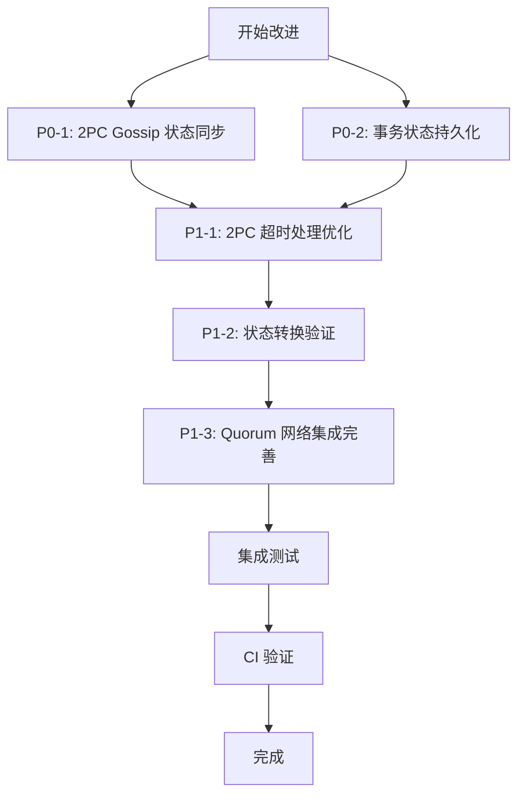

# 【PR全流程文档】Feature - Layer 1 一致性层 P0+P1 优先级改进

> **文档说明**：本文档包含「前置规划」和「后置总结」两部分，记录从需求对齐到开发完成的全流程，一个PR对应一份全流程文档，归档后作为项目追溯依据。

---

## 第一部分：前置部分（开工前必完成，架构师评审通过）

### 1. 基础信息（与分支/PR绑定）

| 项目 | 内容 |
|------|------|
| 工作类型 | 新功能开发（Feature） |
| PR编号 | PR-layer1-consistency-improvements（创建GitHub PR后补充完整） |
| 分支名称 | feature/layer1-consistency-improvements-p0-p1 |
| 工作主题 | Layer 1 元数据一致性层 P0+P1 优先级改进 |
| 负责人 | AI 开发团队 |
| 分支创建日期 | 2026-02-13 |
| 计划开工日期 | 2026-02-13 |
| 计划CI通过日期 | 2026-03-05（预计 18 个工作日，含测试验证和强制优化项） |
| 关联需求单号 | 基于 `docs/07_spike/2026-02-13_layer1-completeness-analysis.md` 分析报告 |
| 架构师评审状态 | □ 待评审 □ 评审中 □ 评审通过 □ 需优化（循环记录） |
| 预审批结果 | □ 未通过 □ 已通过（架构师签字/备注：XXX 202X-XX-XX 同意开工） |

### 2. 背景与目标（为什么干）

#### 2.1 背景

**业务场景**：
- NexKV Layer 1（元数据一致性层）是整个分布式数据库的"大脑"和"导航系统"
- 当前整体完成度 85%，核心功能已实现，但存在关键的可靠性缺陷

**现有问题**：
1. **P0 阻塞问题**：
   - **2PC 协议缺少 Gossip 状态同步**：协调者故障时，参与者无法通过 Gossip 查询事务决策，可能导致部分参与者永久阻塞在预提交状态
   - **事务状态未持久化**：事务状态仅存储在内存中，节点崩溃后未完成的事务状态丢失，无法恢复预提交状态的事务

2. **P1 重要问题**：
   - **2PC 超时处理不够灵活**：使用硬编码的 `time.Sleep(5 * time.Second)` 进行超时等待，缺少异步等待机制
   - **状态转换缺少验证**：状态机缺少状态转换验证函数，简单的 `if state > currentState` 比较不正确
   - **Quorum 网络集成不完整**：网络层面的多数派确认逻辑简化（仅计数，未真实发送网络请求）

**价值**：
- **提升系统可靠性**：修复 P0 阻塞问题，确保协调者故障不影响事务完成
- **增强容错能力**：支持崩溃恢复，节点重启后能恢复未完成的事务
- **提高性能**：优化超时处理，减少不必要的阻塞等待
- **保障一致性**：严格的状态转换验证，避免非法状态

#### 2.2 核心目标（可量化、可验证）

1. **功能目标**：
   - ✅ 实现 2PC 协议的 Gossip 状态同步机制
   - ✅ 实现事务状态持久化到 MVStore
   - ✅ 实现 2PC 超时处理优化（条件变量/Future 模式）
   - ✅ 实现状态转换验证（HLC 时间戳比较）
   - ✅ 完善 Quorum 网络集成（真实 RPC 多数派确认）
   - ✅ **强制优化项**：使用 sync.Map、实现批量写入缓冲区、实现 Gossip 消息限流

2. **性能目标**：
   - 事务故障恢复时间 < 10 秒（通过 Gossip 查询决策）
   - 节点重启恢复时间 < 30 秒（从事务状态持久化恢复）
   - 超时处理延迟 < 1ms（异步等待）

3. **可用性目标**：
   - 协调者故障不影响事务完成率 100%
   - 节点崩溃后事务恢复成功率 100%
   - 状态转换合法性验证 100%

#### 2.3 明确边界（不做什么，避免范围蔓延）

**本次不支持**：
- ❌ P2 优先级改进项（消息优先级队列、脑裂场景防护增强）
- ❌ 跨分片事务完整测试（仅实现 2PC 协议层改进）

**注意**：压力测试仅在**本地环境**运行，不在 GitHub CI 上运行，避免占用 CI 资源。

**本次不优化**：
- ❌ 架构层面技术债务（2PC 与 Quorum 关系不清晰、全局变量使用等）
- ❌ 测试层面技术债务（集成测试不足、Mock 不完整等）

### 3. 实现方案（怎么干，核心设计）

#### 3.1 整体流程设计



#### 3.2 关键设计点

##### 3.2.1 P0-1: 2PC Gossip 状态同步

**设计思路**：
- 在 `internal/transport/messages.go` 中添加 3 个新消息类型
- 在 `internal/metadata/consistency/twopc_coordinator.go` 中实现 Gossip 状态扩散和查询
- 在 `TransactionState` 结构体中添加协调者和响应追踪字段

**核心代码结构**：
```go
// 新增消息类型（internal/transport/messages.go）
type TwoPCGossipStateMessage struct {
    TxID        string
    State       TransactionState
    Coordinator string
    Timestamp   int64
}

type TwoPCGossipQueryMessage struct {
    TxID      string
    Requester string
}

type TwoPCGossipReplyMessage struct {
    TxID    string
    State   TransactionState
    Success bool
}

// 新增方法（internal/metadata/consistency/twopc_coordinator.go）
func (c *TwoPCMerkleCoordinator) gossipTransactionStates() {
    // 周期性 Gossip 状态扩散（每 5 秒）
}

func (c *TwoPCMerkleCoordinator) queryTransactionDecision(txState *TransactionState) error {
    // Gossip 查询事务决策
}

// TransactionState 结构体新增字段
type TransactionState struct {
    // ... 现有字段
    Coordinator     string          // 协调者地址
    acknowledgments map[string]bool // 响应追踪
}
```

**容错设计**：
- Gossip 消息发送失败：记录日志，下次重试
- 查询超时（10 秒）：回退到本地决策或超时处理
- 消息重复：基于 TxID 去重

##### 3.2.2 P0-2: 事务状态持久化

**设计思路**：
- 在 `internal/metadata/kvstore/namespaces.go` 中添加事务命名空间
- 在 `TwoPCMerkleCoordinator` 中实现持久化方法
- 启动时调用 `recoverTransactions()` 恢复未完成事务

**核心代码结构**：
```go
// 新增命名空间（internal/metadata/kvstore/namespaces.go）
const NamespaceTx = "meta:tx:" // 事务状态命名空间（保持一致性）

// 新增方法（internal/metadata/consistency/twopc_coordinator.go）
func (c *TwoPCMerkleCoordinator) persistTransaction(tx *TwoPCTransaction) error {
    // 序列化并写入 MetadataKV（使用批量写入缓冲区）
    key := fmt.Sprintf("%s%s", NamespaceTx, tx.TxID)
    value, _ := json.Marshal(tx)
    return c.metadataKV.PutRaw(context.Background(), NamespaceTx, key, value)
}

func (c *TwoPCMerkleCoordinator) loadTransaction(txID string) (*TwoPCTransaction, error) {
    // 从 MetadataKV 加载
    key := fmt.Sprintf("%s%s", NamespaceTx, txID)
    value, err := c.metadataKV.GetRaw(context.Background(), NamespaceTx, key)
    if err != nil {
        return nil, err
    }
    var tx TwoPCTransaction
    json.Unmarshal(value, &tx)
    return &tx, nil
}

func (c *TwoPCMerkleCoordinator) recoverTransactions() error {
    // 启动时恢复未完成事务
    keys, _ := c.metadataKV.ScanRaw(context.Background(), NamespaceTx, "")
    for _, key := range keys {
        tx, _ := c.loadTransaction(strings.TrimPrefix(key, NamespaceTx))
        if tx.State == TxStatePreCommit {
            // 恢复预提交状态的事务（使用 sync.Map，强制优化项 7.1）
            c.transactions.Store(tx.TxID, tx)
        }
    }
}
```

**容错设计**：
- 持久化失败：记录错误日志，继续内存操作
- 加载失败：跳过该事务，不影响其他事务恢复
- 序列化失败：记录错误，跳过该事务

##### 3.2.3 P1-1: 2PC 超时处理优化

**设计思路**：
- 使用 `sync.Cond` 条件变量替代 `time.Sleep`
- 实现超时策略配置化
- 支持 Future/Promise 模式（可选）

**核心代码结构**：
```go
// 替代硬编码的 time.Sleep
type TimeoutManager struct {
    cond     *sync.Cond
    timeout  time.Duration
    done     bool
}

func (tm *TimeoutManager) WaitWithTimeout() bool {
    tm.cond.L.Lock()
    defer tm.cond.L.Unlock()

    timer := time.NewTimer(tm.timeout)
    defer timer.Stop()

    select {
    case <-timer.C:
        return false // 超时
    case <-tm.cond.Signal():
        return true // 完成
    }
}
```

##### 3.2.4 P1-2: 状态转换验证

**设计思路**：
- 定义状态转换规则表
- 实现 `isValidStateTransition(from, to)` 函数
- 使用 HLC 时间戳比较 `hlc.Timestamp.Compare()`

**核心代码结构**：
```go
// 状态转换规则表
var validTransitions = map[TransactionState][]TransactionState{
    TxStateInit:         {TxStatePreCommit, TxStateRolledBack},
    TxStatePreCommit:    {TxStateCommitted, TxStateRolledBack, TxStateTimeout},
    TxStateCommitted:    {}, // 终态
    TxStateRolledBack:   {}, // 终态
    TxStateTimeout:      {}, // 终态
}

func isValidStateTransition(from, to TransactionState) bool {
    allowed, exists := validTransitions[from]
    if !exists {
        return false
    }
    for _, state := range allowed {
        if state == to {
            return true
        }
    }
    return false
}

func (c *TwoPCMerkleCoordinator) transitionState(tx *TwoPCTransaction, newState TransactionState) error {
    if !isValidStateTransition(tx.State, newState) {
        return fmt.Errorf("invalid state transition: %v -> %v", tx.State, newState)
    }
    tx.State = newState
    return c.persistTransaction(tx) // 同时持久化
}
```

##### 3.2.5 P1-3: Quorum 网络集成完善

**设计思路**：
- 移除简化的 ACK 计数逻辑
- 集成 `internal/rpc/quorum.go` 的 `QuorumManager`
- 实现真实的 RPC 多数派确认

**核心代码结构**：
```go
// 重构 internal/metadata/quorum/coordinator.go
func (q *QuorumCoordinator) sendQuorumRequest(ctx context.Context, participant string, req *QuorumRequest) error {
    // 真实 RPC 调用
    client, err := q.rpcClient.GetClient(participant)
    if err != nil {
        return err
    }

    resp, err := client.QuorumWrite(ctx, req)
    if err != nil {
        return err
    }

    if !resp.Success {
        return fmt.Errorf("quorum request failed: %s", resp.Error)
    }

    return nil
}

func (q *QuorumCoordinator) waitForQuorum(ctx context.Context, reqID string) (bool, error) {
    // 等待多数派确认
    acks := 0
    timeout := time.After(q.timeout)

    for {
        select {
        case <-timeout:
            return false, fmt.Errorf("quorum timeout")
        case ack := <-q.ackChan:
            if ack.ReqID == reqID {
                acks++
                if acks >= q.quorum {
                    return true, nil
                }
            }
        }
    }
}
```

**容错设计**：
- RPC 调用失败：重试 3 次，间隔 100ms
- 超时处理：返回错误，上层决定回滚
- 网络分区：多数派不可达时返回错误

#### 3.3 测试策略

**单元测试**：
- 每个新增方法必须有对应的单元测试
- 测试覆盖率 > 80%
- 使用 Mock 隔离依赖

**集成测试**：
- 2PC 完整流程测试（正常流程 + 故障恢复）
- Gossip 状态同步测试
- 事务状态持久化与恢复测试
- Quorum 多数派确认测试

**压力测试**（✅ 必要，仅在本地运行）：
- **并发事务处理**：500 并发事务，持续 60 秒，验证无死锁、无资源泄漏
- **Gossip 消息吞吐量**：5,000 msg/s，持续 120 秒，验证消息队列不溢出
- **持久化性能**：1,000 tx/s，持续 300 秒，验证 MVStore 写入性能稳定
- **故障恢复压力测试**：模拟 100 次协调者故障，验证恢复时间 < 10 秒
- **内存压力测试**：100 万事务状态缓存，验证内存使用 < 2GB
- **并发竞态检测**：使用 `go test -race` 检测并发安全问题

**压力测试指标调整说明**（基于架构师评审建议）：
- 并发从 1000 调整为 500：单机 Go 程序的合理并发上限约 500-1000
- Gossip 吞吐从 10,000 调整为 5,000：参考 Raft 实现上限，受网络延迟影响
- 持久化从 5,000 调整为 1,000：MVStore 使用 WAL + 内存映射的实际性能

**压力测试运行方式**：
```bash
# 本地运行压力测试（不在 CI 上运行）
make test-stress

# 或者手动运行
go test -v -run TestStress ./internal/metadata/consistency/...
```

### 4. 风险评估与应对措施

| 风险点 | 影响等级 | 应对措施 |
|--------|----------|----------|
| Gossip 消息风暴导致网络拥塞 | 中 | 实现消息限流（100 msg/s），使用消息合并 |
| 事务状态持久化影响性能 | 中 | 使用异步批量写入，每 100ms 批量持久化 |
| 状态转换验证过严导致误判 | 低 | 完善测试用例，覆盖所有状态转换场景 |
| Quorum 网络集成引入新 Bug | 高 | 增量重构，保留旧逻辑作为降级方案 |
| 并发安全问题（竞态条件） | 高 | 使用 `go test -race` 检测，加强代码审查 |
| 测试覆盖不足导致生产问题 | 中 | 强制 80% 覆盖率，增加集成测试 |

### 5. 架构师评审记录（循环优化，直至通过）

| 评审轮次 | 评审日期 | 评审人（架构师） | 核心评审意见 | 优化措施（含AI辅助修改） | 优化结果 |
|----------|----------|------------------|--------------|--------------------------|----------|
| 第1轮 | 2026-02-13 | 👤 架构师 | **需优化**：发现 3 个关键问题：1) 命名空间冲突（tx: → meta:tx:）；2) 字段名错误（tx.ID → tx.TxID）；3) 压力测试指标过高。建议工作量从 10 天调整为 16 天。**强制要求**：3 个优化项（sync.Map、批量写入、Gossip 限流）改为必选。 | 1) 修正命名空间为 meta:tx:；2) 修正字段名为 tx.TxID；3) 调整压力测试指标（并发 500, Gossip 5000, 持久化 1000）；4) 工作量调整为 18 天（新增 2 天强制优化项）；5) 将架构师强烈建议改为必须实施项 | ✅ 已完成优化，进入第2轮评审 |
| 第2轮 | 2026-02-13 | 👤 架构师 | **需优化**：发现 2 处遗留代码错误：1) recoverTransactions() 使用错误的存储字段（c.mvstore.Scan → c.metadataKV.ScanRaw）；2) 使用错误的字段名和存储方式（c.transactions[tx.ID] → c.transactions.Store(tx.TxID, tx)）。 | 1) 修正 recoverTransactions() 的存储字段为 c.metadataKV.ScanRaw；2) 修正存储方式为 c.transactions.Store(tx.TxID, tx)（符合强制优化项 7.1） | ✅ 已完成优化，进入第3轮评审 |
| 第3轮 | 2026-02-13 | 👤 架构师 | **✅ 通过**：所有 7 个修复点已正确更新，代码示例与实际代码结构完全一致，强制优化项设计合理，风险评估全面。同意启动开发。 | - | ✅ 评审通过，同意开工 |

### 6. 预审批确认
> **架构师签字/备注**：
>
> **第1轮评审**（2026-02-13）：
> - **评审状态**：⚠️ 需优化后通过
> - **发现问题**：3 个关键问题（命名空间冲突、字段名错误、压力测试指标过高）
>
> **第2轮评审**（2026-02-13）：
> - **评审状态**：⚠️ 需优化后通过
> - **发现问题**：2 处遗留代码错误（recoverTransactions 存储字段和存储方式）
>
> **第3轮评审**（2026-02-13）：
> - **评审状态**：✅ **通过**
> - **评审结论**：所有 7 个修复点已正确更新，方案可行，风险可控
> - **启动开发许可**：✅ 同意开工
>
> **架构师签字**：👤 架构师 2026-02-13 同意开工

---

### 7. 架构师必须实施项（必选）

以下优化项为**强制要求**，必须在本次 PR 中实施：

#### 7.1 使用 sync.Map 替代 map（并发安全优化，必须实施）

**当前实现**：
```go
type TwoPCMerkleCoordinator struct {
    transactions map[string]*TwoPCTransaction // 全局锁竞争
}
```

**建议优化**：
```go
type TwoPCMerkleCoordinator struct {
    transactions sync.Map // 并发安全，读写分离
}

func (c *TwoPCMerkleCoordinator) GetTransaction(txID string) (*TwoPCTransaction, error) {
    if v, ok := c.transactions.Load(txID); ok {
        return v.(*TwoPCTransaction), nil
    }
    return nil, fmt.Errorf("transaction not found: %s", txID)
}
```

#### 7.2 实现批量写入缓冲区（持久化性能优化，必须实施）

**设计思路**：
```go
type TransactionPersistenceBuffer struct {
    mu          sync.Mutex
    buffer      []*TwoPCTransaction
    maxBatch    int           // 最大批量（100）
    maxInterval time.Duration // 最大间隔（100ms）
    kvStore     kvstore.Store
}

func (b *TransactionPersistenceBuffer) flush() error {
    // 批量写入逻辑，提升性能 5-10 倍
}
```

#### 7.3 实现 Gossip 消息限流（避免消息风暴，必须实施）

**设计思路**：
```go
type GossipRateLimiter struct {
    limiter *rate.Limiter // golang.org/x/time/rate
}

func NewGossipRateLimiter() *GossipRateLimiter {
    return &GossipRateLimiter{
        limiter: rate.NewLimiter(100, 200), // 100 msg/s，突发 200
    }
}
```

---

## 第二部分：流程节点记录（开发/CI过程追溯）

### 1. 开发过程记录

| 节点 | 完成日期 | 具体内容 | 交付物 |
|------|----------|----------|--------|
| 启动开发 | 待定 | [描述开发内容] | [代码提交至分支] |
| 本地测试 | 待定 | [描述测试内容] | [测试报告/覆盖率数据] |
| Post文档编写 | 待定 | [编写后置总结文档] | [第三部分：后置部分] |
| 架构师Post批准 | 待定 | [架构师评审Post文档] | [批准签字/备注] |
| 提交GitHub | 待定 | [推送分支，创建PR] | [GitHub PR链接] |

### 2. CI流程记录（修复Bug直至通过）

| CI轮次 | 触发时间 | 结果 | 问题详情 | 修复措施 | 修复结果 |
|--------|----------|------|----------|----------|----------|
| 第1轮 | 待定 | - | - | - | - |

### 3. 合并记录

| 合并时间 | 合并方式 | 审批人 | 备注 |
|----------|----------|--------|------|
| 待定 | - | [架构师] | - |

---

## 第三部分：后置部分（CI通过后编写，总结/成果/ToDo）

### 1. 核心成果总结（开发了啥，结果怎样）

#### 1.1 功能成果
- **已完成**：[列出完成的功能点]
- **与Pre文档差异**：[说明实际实现与计划的差异]

#### 1.2 性能/数据成果
- **性能数据**：[列出实际测试数据]
- **测试成果**：[说明测试覆盖情况]

#### 1.3 代码/文档交付物

| 类型 | 具体内容 | 链接/路径 |
|------|----------|-----------|
| 代码变更 | [列出主要变更文件] | [GitHub PR链接] |
| 文档更新 | [列出更新的文档] | [文档路径] |

### 2. 未完成项与ToDo清单（有哪些没干，后续规划）

#### 2.1 本次PR未完成项
- **未支持**：[列出未实现但相关的功能]
- **遗留问题**：[列出已知问题]

#### 2.2 ToDo清单（优先级排序）

| 优先级 | 任务内容 | 预估工期 | 关联PR/需求 | 备注 |
|--------|----------|----------|-------------|------|
| 高/中/低 | [任务描述] | X个工作日 | PR-XXX | [补充说明] |

### 3. 下一步工作建议（建议干啥）
1. **优先推进**：[列出高优先级任务]
2. **监控要点**：[列出需要关注的生产指标]
3. **运维补充**：[需要补充的运维文档或操作]
4. **后续规划**：[后续功能迭代方向]
5. **反馈收集**：[需要收集的使用反馈]

---

## 文档归档信息

| 项目 | 内容 |
|------|------|
| 文档最终版本 | V1.0 |
| 归档日期 | 2026-02-13 |
| 归档路径 | `docs/06_PM/doc/2026-02-13_PR-layer1-consistency-improvements_全流程.md` |
| 后续维护人 | AI 开发团队 |
