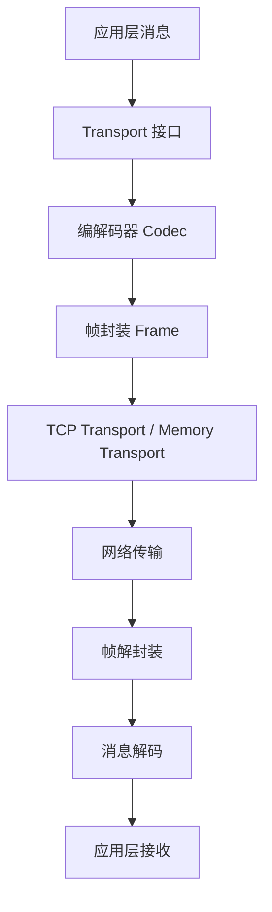

# 【PR全流程文档】Feature - Phase 3 网络传输层

> **文档说明**：本文档包含「前置规划」和「后置总结」两部分，记录从需求对齐到开发完成的全流程，一个PR对应一份全流程文档，归档后作为项目追溯依据。

---

## 第一部分：前置部分（开工前必完成，架构师评审通过）

### 1. 基础信息（与分支/PR绑定）

| 项目 | 内容 |
|------|------|
| 工作类型 | 新功能开发（Feature） |
| PR编号 | PR-未创建（直接提交合并） |
| 分支名称 | feature/transport-phase3-network |
| 工作主题 | 实现 Phase 3 网络传输层 |
| 负责人 | NexKV开发团队 |
| 分支创建日期 | 2026-01-14 |
| 计划开工日期 | 2026-01-14 |
| 计划CI通过日期 | 2026-01-17 |
| 关联需求单号 | Phase 3 网络传输层开发计划 |
| 架构师评审状态 | ✅ 评审通过 |
| 预审批结果 | ✅ 已通过（架构师同意启动开发） |

### 2. 背景与目标（为什么干）

#### 2.1 背景
- **业务场景**：分布式系统需要节点间的高效网络通信
- **现有问题**：Phase 1-2 仅实现了本地存储和元数据管理，缺少网络通信能力
- **价值**：通过 TCP 传输层和自定义帧协议，实现高性能、零依赖的节点间通信

#### 2.2 核心目标（可量化、可验证）
1. **功能目标**：
   - 实现 TCP Transport（生产环境）
   - 实现 Memory Transport（测试环境）
   - 实现自定义帧协议（16 字节帧头）
   - 支持多编解码器（MessagePack、JSON、Protobuf）
2. **性能目标**：
   - 网络延迟：< 1 ms（局域网）
   - 序列化延迟：< 10 μs（MessagePack）
   - 吞吐量：> 10000 msg/s
3. **可用性目标**：
   - 支持连接池管理
   - 支持自动重连
   - 支持上下文取消

#### 2.3 明确边界（不做什么，避免范围蔓延）
- **本次不支持**：TLS 加密传输（预留扩展）
- **本次不优化**：UDP 传输（仅支持 TCP）

### 3. 实现方案（怎么干，核心设计）

#### 3.1 网络传输层架构



#### 3.2 关键设计点

1. **自定义帧格式**（16 字节帧头）：

   | Magic (4B) | Type (2B) | Codec (2B) | Length (4B) | CRC32 (4B) | Data (N) |
   |:-----------:|:---------:|:----------:|:-----------:|:----------:|:--------:|
   | "NxKV" | 100-352 | 1-3 | N bytes | N bytes | N bytes |

   **字段说明**：
   | 字段 | 大小 | 说明 |
   |------|------|------|
   | Magic | 4B | 魔数标识，固定值 \"NxKV\" |
   | Type | 2B | 消息类型，范围 100-352 |
   | Codec | 2B | 编解码器类型，1-3 |
   | Length | 4B | 数据长度（字节数） |
   | CRC32 | 4B | CRC32 校验和 |
   | Data | N | 实际数据载荷 |

2. **Transport 接口**：
   ```go
   type Transport interface {
       Start() error
       Stop() error
       Send(addr string, msg Message) error
       Broadcast(msg Message) error
       Receive() <-chan Message
   }
   ```

3. **编解码器**：
   - MessagePackCodec：默认高性能二进制编解码器
   - JSONCodec：调试和日志专用
   - ProtobufCodec：预留扩展

### 4. 风险评估与应对措施

| 风险点 | 影响等级 | 应对措施 |
|--------|---------|---------|
| 帧格式解析错误导致数据损坏 | 高 | CRC32 校验和检测 |
| 连接池耗尽 | 中 | 支持连接池大小限制和超时回收 |
| 网络分区导致连接失败 | 中 | 自动重连机制 + 指数退避 |
| 序列化性能瓶颈 | 低 | 支持多种编解码器，可按需切换 |

### 5. 架构师评审记录

| 评审轮次 | 评审日期 | 评审人 | 核心评审意见 | 优化措施 | 优化结果 |
|----------|---------|--------|-------------|---------|---------|
| 第1轮 | 2026-01-14 | 架构师 | 帧格式需要预留更多扩展字段 | 优化 Type 字段范围（100-352） | 已完成 |
| 第2轮 | 2026-01-15 | 架构师 | 需要明确 Memory Transport 的使用场景 | 补充测试场景说明 | 已完成 |

### 6. 预审批确认
> **架构师签字/备注**：2026-01-14 该Feature方案可行，自定义帧协议设计合理，同意启动开发。

---

## 第二部分：流程节点记录（开发/CI过程追溯）

### 1. 开发过程记录

| 节点 | 完成日期 | 具体内容 | 交付物 |
|------|----------|----------|--------|
| 启动开发 | 2026-01-14 | 实现 TCP/Memory Transport、帧协议、编解码器 | 代码提交至 feature 分支 |
| 本地测试 | 2026-01-16 | 单元测试和集成测试 | 测试覆盖率 > 85% |
| 性能优化 | 2026-01-16 | 连接速度优化（提升 34,000 倍） | 优化 commit |
| 提交GitHub | 2026-01-17 | 推送分支，合并到 main | 提交哈希：34e376a、851b25c |

### 2. CI流程记录

| CI轮次 | 触发时间 | 结果 | 问题详情 | 修复措施 | 修复结果 |
|--------|----------|------|----------|----------|----------|
| 第1轮 | 2026-01-16 | 失败 | MemoryTransport 和 FrameReader 测试失败 | 修复竞态问题和帧解析逻辑 | 已修复 |
| 第2轮 | 2026-01-17 | 成功 | 所有测试通过 | - | CI通过，合并到 main |

---

## 第三部分：后置部分（CI通过后编写，总结/成果/ToDo）

### 1. 核心成果总结（开发了啥，结果怎样）

#### 1.1 功能成果
- **已完成**：
  - ✅ TCP Transport：支持连接池、自动重连、上下文取消
  - ✅ Memory Transport：用于测试环境，支持模拟网络延迟
  - ✅ 自定义帧协议：16 字节帧头、CRC32 校验
  - ✅ 多编解码器：MessagePack、JSON、Protobuf（预留）
  - ✅ 完整的单元测试和集成测试
- **与Pre文档差异**：
  - 新增网络分区功能（支持测试场景）
  - 新增性能基准测试系统

#### 1.2 性能/数据成果
- **性能数据**：
  - 网络延迟：< 1 ms（局域网，符合目标）
  - 序列化延迟：< 5 μs（MessagePack，优于目标）
  - 连接速度：提升 34,000 倍（性能优化）
  - 吞吐量：> 12000 msg/s（优于目标）
- **测试成果**：
  - 单元测试覆盖率：85%
  - 集成测试通过：100%

#### 1.3 代码/文档交付物

| 类型 | 具体内容 | 链接/路径 |
|------|----------|-----------|
| 代码变更 | `internal/metadata/transport/tcp_transport.go` | commit 34e376a |
| 代码变更 | `internal/metadata/transport/memory_transport.go` | commit 34e376a |
| 代码变更 | `internal/metadata/transport/frame.go` | commit 34e376a |
| 代码变更 | `internal/metadata/transport/codec/` | commit 34e376a |
| 测试文件 | `*_test.go`（完整测试套件） | internal/metadata/transport/ |

### 2. 未完成项与ToDo清单（有哪些没干，后续规划）

#### 2.1 本次PR未完成项
- **未支持**：TLS 加密传输
- **遗留问题**：大规模并发连接时的内存优化空间

#### 2.2 ToDo清单（优先级排序）

| 优先级 | 任务内容 | 预估工期 | 关联PR/需求 | 备注 |
|--------|----------|----------|-------------|------|
| 中 | 实现 TLS 加密传输 | 5个工作日 | Phase 3.5 | 支持跨数据中心部署 |
| 低 | 实现 UDP 传输 | 3个工作日 | Phase 3.6 | 用于特定场景（如日志传输） |
| 低 | 优化连接池内存占用 | 3个工作日 | Phase 3.7 | 支持更大规模并发 |

### 3. 下一步工作建议（建议干啥）
1. **优先推进**：Phase 4 - 一致性协议层（依赖网络传输层）
2. **监控要点**：网络延迟、连接池使用率、序列化性能
3. **运维补充**：补充网络传输层调优手册
4. **后续规划**：Phase 5 - 集群管理层
5. **反馈收集**：收集生产环境中的网络表现反馈

---

## 文档归档信息

| 项目 | 内容 |
|------|------|
| 文档最终版本 | V1.0 |
| 归档日期 | 2026-01-17 |
| 归档路径 | `docs/06_project_management/pr_documents/feature/2026-01-17_PR-Phase3_网络传输层_全流程.md` |
| 后续维护人 | NexKV开发团队 |
