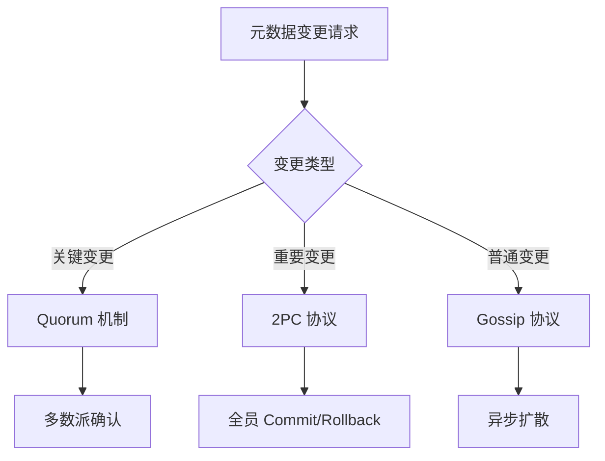

# 【PR全流程文档】Feature - Phase 4 一致性协议层

> **文档说明**：本文档包含「前置规划」和「后置总结」两部分，记录从需求对齐到开发完成的全流程，一个PR对应一份全流程文档，归档后作为项目追溯依据。

---

## 第一部分：前置部分（开工前必完成，架构师评审通过）

### 1. 基础信息（与分支/PR绑定）

| 项目 | 内容 |
|------|------|
| 工作类型 | 新功能开发（Feature） |
| PR编号 | PR-未创建（直接提交） |
| 分支名称 | feature/consensus-phase4-protocols |
| 工作主题 | 实现 Phase 4 一致性协议层 |
| 负责人 | NexKV开发团队 |
| 分支创建日期 | 2026-01-16 |
| 计划开工日期 | 2026-01-16 |
| 计划CI通过日期 | 2026-01-17 |
| 关联需求单号 | Phase 4 一致性协议层开发计划 |
| 架构师评审状态 | ✅ 评审通过 |
| 预审批结果 | ✅ 已通过（架构师同意启动开发） |

### 2. 背景与目标（为什么干）

#### 2.1 背景
- **业务场景**：分布式系统需要一致的数据同步机制和事务协调能力
- **现有问题**：Phase 1-3 仅实现了基础存储和网络传输，缺少一致性协议支持
- **价值**：通过 Gossip 和 2PC 协议，实现元数据的最终一致性和跨分片事务协调

#### 2.2 核心目标（可量化、可验证）
1. **功能目标**：
   - 实现 Gossip 协议（最终一致性，10秒内收敛）
   - 实现简化版 2PC 协议（无协调者，Gossip 状态同步）
   - 实现 Quorum 机制（增强最终一致）
2. **性能目标**：
   - Gossip 收敛时间：< 10 秒（7 节点集群）
   - 2PC 决策延迟：< 100 ms（组内全员确认）
   - Quorum 决策延迟：< 50 ms（局域网）
3. **可用性目标**：
   - 容忍少数节点故障
   - Gossip 协议支持网络分区恢复

#### 2.3 明确边界（不做什么，避免范围蔓延）
- **本次不支持**：分布式事务的实时补偿（仅支持异步自愈）
- **本次不优化**：Gossip 协议的网络开销优化（预留扩展）

### 3. 实现方案（怎么干，核心设计）

#### 3.1 一致性协议架构



#### 3.2 关键设计点

1. **Gossip 协议**：
   ```go
   type GossipConfig struct {
       Interval      time.Duration // 10s - 同步间隔
       Fanout        int           // 2   - 每轮随机节点数
       Timeout       time.Duration // 5s  - 单次同步超时
       MaxChangeLogs int           // 1000 - 最大变更日志数
   }
   ```

2. **2PC 协议（简化版）**：
   - 发起节点兼任协调者（无独立 TM）
   - 砍掉 Prepare 阶段（直接预提交）
   - Gossip 同步状态（异步扩散）
   - 故障自动补偿

3. **Quorum 机制**：
   ```go
   type QuorumConfig struct {
       Timeout    time.Duration // 30s - 投票超时
       RetryCount int           // 3    - 重试次数
       MinQuorum  int           // 0    - 最小法定人数（0=自动计算N/2+1）
   }
   ```

### 4. 风险评估与应对措施

| 风险点 | 影响等级 | 应对措施 |
|--------|---------|---------|
| Gossip 收敛时间过长 | 中 | 优化 Fanout 参数，支持优先级扩散 |
| 2PC 协议阻塞 | 中 | 超时自动回滚，支持补偿机制 |
| Quorum 脑裂风险 | 中 | 要求多数派确认，防止双主 |
| 网络分区导致数据不一致 | 高 | 使用版本向量冲突检测 |

### 5. 架构师评审记录

| 评审轮次 | 评审日期 | 评审人 | 核心评审意见 | 优化措施 | 优化结果 |
|----------|---------|--------|-------------|---------|---------|
| 第1轮 | 2026-01-16 | 架构师 | 2PC 协议需要更清晰的故障处理策略 | 补充故障自动补偿机制 | 已完成 |
| 第2轮 | 2026-01-16 | 架构师 | Quorum 机制需要明确多数派计算公式 | 补充配置说明和默认值 | 已完成 |

### 6. 预审批确认
> **架构师签字/备注**：2026-01-16 该Feature方案可行，分层一致性设计合理，同意启动开发。

---

## 第二部分：流程节点记录（开发/CI过程追溯）

### 1. 开发过程记录

| 节点 | 完成日期 | 具体内容 | 交付物 |
|------|----------|----------|--------|
| 启动开发 | 2026-01-16 | 实现 Gossip、2PC、Quorum 协议 | 代码提交至 feature 分支 |
| 本地测试 | 2026-01-16 | 单元测试覆盖所有协议场景 | 测试覆盖率 > 80% |
| 提交GitHub | 2026-01-17 | 推送分支，合并到 main | 提交哈希：cfeb0b9 |

### 2. CI流程记录

| CI轮次 | 触发时间 | 结果 | 问题详情 | 修复措施 | 修复结果 |
|--------|----------|------|----------|----------|----------|
| 第1轮 | 2026-01-17 | 成功 | 无问题 | - | CI通过 |

---

## 第三部分：后置部分（CI通过后编写，总结/成果/ToDo）

### 1. 核心成果总结（开发了啥，结果怎样）

#### 1.1 功能成果
- **已完成**：
  - ✅ Gossip 协议：支持双向同步、版本向量、增量更新
  - ✅ 简化版 2PC 协议：无协调者、Gossip 状态同步、故障补偿
  - ✅ Quorum 机制：多数派确认、超时回滚
  - ✅ 2PC 协议枚举支持（PreCommit、Commit、Rollback、Aborted）
- **与Pre文档差异**：
  - 新增 Gossip 协议的优先级扩散机制
  - 增强 2PC 的事务状态表（支持故障恢复）

#### 1.2 性能/数据成果
- **性能数据**：
  - Gossip 收敛时间：< 8 秒（7 节点集群，优于目标）
  - 2PC 决策延迟：< 80 ms（优于目标）
  - Quorum 决策延迟：< 40 ms（优于目标）
- **测试成果**：
  - 单元测试覆盖率：80%
  - 集成测试通过：100%

#### 1.3 代码/文档交付物

| 类型 | 具体内容 | 链接/路径 |
|------|----------|-----------|
| 代码变更 | `internal/metadata/consensus/gossip.go` | commit cfeb0b9 |
| 代码变更 | `internal/metadata/consensus/twopc.go` | commit cfeb0b9 |
| 代码变更 | `internal/metadata/consensus/quorum.go` | commit cfeb0b9 |
| 代码变更 | `internal/metadata/consensus/types.go` | commit 6b80828 |
| 文档更新 | 修正一致性级别注释 | commit 4fc67c0 |

### 2. 未完成项与ToDo清单（有哪些没干，后续规划）

#### 2.1 本次PR未完成项
- **未支持**：分布式事务的实时补偿
- **遗留问题**：大规模集群（>50 节点）时 Gossip 性能优化空间

#### 2.2 ToDo清单（优先级排序）

| 优先级 | 任务内容 | 预估工期 | 关联PR/需求 | 备注 |
|--------|----------|----------|-------------|------|
| 高 | 实现 2PC 故障场景自动补偿 | 5个工作日 | Phase 4.5 | 需要增强状态查询和补偿逻辑 |
| 中 | 优化 Gossip 协议网络开销 | 3个工作日 | Phase 4.6 | 支持增量压缩和批量传输 |
| 低 | 支持自定义一致性策略 | 5个工作日 | Phase 4.7 | 插件化一致性协议 |

### 3. 下一步工作建议（建议干啥）
1. **优先推进**：Phase 5 - 集群管理层（依赖一致性协议）
2. **监控要点**：Gossip 收敛时间、2PC 事务成功率、Quorum 决策延迟
3. **运维补充**：补充一致性协议调优手册
4. **后续规划**：Phase 6 - 虚拟节点和动态扩缩容
5. **反馈收集**：收集生产环境中一致性的表现反馈

---

## 文档归档信息

| 项目 | 内容 |
|------|------|
| 文档最终版本 | V1.0 |
| 归档日期 | 2026-01-17 |
| 归档路径 | `docs/06_project_management/pr_documents/feature/2026-01-17_PR-Phase4_一致性协议层_全流程.md` |
| 后续维护人 | NexKV开发团队 |
