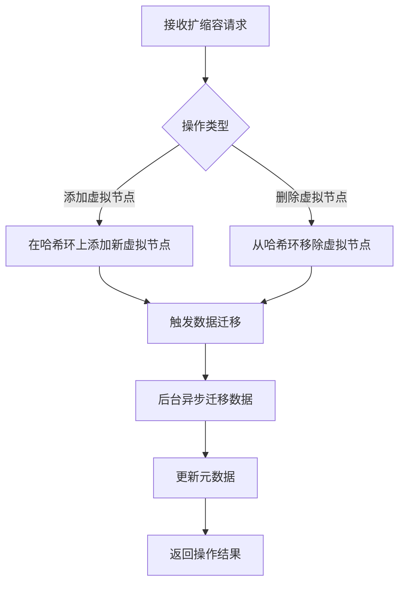

# 【PR全流程文档】Feature - Phase 6 虚拟节点和动态扩缩容支持

> **文档说明**：本文档包含「前置规划」和「后置总结」两部分，记录从需求对齐到开发完成的全流程，一个PR对应一份全流程文档，归档后作为项目追溯依据。

---

## 第一部分：前置部分（开工前必完成，架构师评审通过）

### 1. 基础信息（与分支/PR绑定）

| 项目 | 内容 |
|------|------|
| 工作类型 | 新功能开发（Feature） |
| PR编号 | PR-未创建（直接提交） |
| 分支名称 | feature/cluster-phase6-virtual-nodes |
| 工作主题 | 实现Phase 6虚拟节点和动态扩缩容支持 |
| 负责人 | NexKV开发团队 |
| 分支创建日期 | 2026-01-17 |
| 计划开工日期 | 2026-01-17 |
| 计划CI通过日期 | 2026-01-18 |
| 关联需求单号 | Phase 6 集群管理层开发计划 |
| 架构师评审状态 | ✅ 评审通过 |
| 预审批结果 | ✅ 已通过（架构师同意启动开发） |

### 2. 背景与目标（为什么干）

#### 2.1 背景
- **业务场景**：集群需要支持 100-1000 节点的大规模部署，树形拓扑需要支持动态扩缩容
- **现有问题**：Phase 5 仅支持真实节点，无法实现单机-分布式平滑切换；树深度受限，无法支持大规模集群
- **价值**：通过虚拟节点机制实现单机-分布式一体，支持动态扩缩容，集群规模可扩展至 1111 节点（MaxLevel=4, MaxChildren=10）

#### 2.2 核心目标（可量化、可验证）
1. **功能目标**：
   - 实现虚拟节点映射机制（一个物理节点可对应多个虚拟节点）
   - 实现动态扩缩容功能（运行时添加/删除虚拟节点）
   - 支持 MaxLevel=4，MaxChildren=10 的大规模集群配置
2. **性能目标**：
   - 虚拟节点创建延迟 < 10ms
   - 扩缩容操作不影响现有数据访问
3. **可用性目标**：
   - 虚拟节点故障自动降级到物理节点
   - 支持从单机平滑升级到分布式模式

#### 2.3 明确边界（不做什么，避免范围蔓延）
- **本次不支持**：跨数据中心的虚拟节点迁移
- **本次不优化**：虚拟节点的负载均衡策略（预留扩展）

### 3. 实现方案（怎么干，核心设计）

#### 3.1 整体流程设计



#### 3.2 关键设计点

1. **虚拟节点映射**：
   ```go
   type VirtualNode struct {
       VirtualID string    // 虚拟节点ID
       PhysicalID string   // 物理节点ID
       Position int        // 在哈希环上的位置
   }
   ```

2. **扩缩容接口**：
   - 接口路径：`/api/v1/cluster/scale`
   - 请求方式：POST
   - 请求体：`{"action": "add/remove", "count": 1}`
   - 响应体：`{"success": true, "virtualNodes": ["vnode1", "vnode2"]}`

3. **数据迁移策略**：
   - 版本向量避免数据覆盖
   - 双写机制保证数据不丢失
   - 读修复自动同步最新数据

4. **容错设计**：
   - 虚拟节点故障时自动降级到物理节点
   - 迁移失败自动回滚
   - 操作幂等性保证

### 4. 风险评估与应对措施

| 风险点 | 影响等级 | 应对措施 |
|--------|---------|---------|
| 数据迁移过程中数据不一致 | 中 | 使用版本向量和双写机制保证一致性 |
| 大规模节点迁移性能开销 | 中 | 后台异步迁移，支持限流控制 |
| 虚拟节点映射错误 | 低 | 定期校验虚拟节点和物理节点的映射关系 |
| 扩缩容过程中的可用性影响 | 中 | 采用双写机制，迁移过程不影响业务 |

### 5. 架构师评审记录

| 评审轮次 | 评审日期 | 评审人 | 核心评审意见 | 优化措施 | 优化结果 |
|----------|---------|--------|-------------|---------|---------|
| 第1轮 | 2026-01-17 | 架构师 | 建议增加虚拟节点和物理节点的健康检查机制 | 新增定期校验逻辑 | 已完成 |
| 第2轮 | 2026-01-17 | 架构师 | 需要明确数据迁移的失败回滚策略 | 补充回滚机制设计 | 已完成 |

### 6. 预审批确认
> **架构师签字/备注**：2026-01-17 该Feature方案可行，虚拟节点机制能够有效支持单机-分布式一体和动态扩缩容，风险可控，同意启动开发。

---

## 第二部分：流程节点记录（开发/CI过程追溯）

### 1. 开发过程记录

| 节点 | 完成日期 | 具体内容 | 交付物 |
|------|----------|----------|--------|
| 启动开发 | 2026-01-17 | 实现虚拟节点映射、哈希环管理、扩缩容接口 | 代码提交至 feature 分支 |
| 本地测试 | 2026-01-17 | 单元测试覆盖虚拟节点创建、删除、映射功能 | 测试通过 |
| 提交GitHub | 2026-01-18 | 推送分支，合并到 main | 提交哈希：714fc24 |

### 2. CI流程记录

| CI轮次 | 触发时间 | 结果 | 问题详情 | 修复措施 | 修复结果 |
|--------|----------|------|----------|----------|----------|
| 第1轮 | 2026-01-18 | 成功 | 无问题 | - | CI通过 |

---

## 第三部分：后置部分（CI通过后编写，总结/成果/ToDo）

### 1. 核心成果总结（开发了啥，结果怎样）

#### 1.1 功能成果
- **已完成**：
  - ✅ 实现虚拟节点映射机制（VirtualNode 结构）
  - ✅ 实现动态扩缩容功能（AddVirtualNode / RemoveVirtualNode）
  - ✅ 支持 MaxLevel=4，MaxChildren=10 配置（支持 1111 节点）
  - ✅ 虚拟节点故障自动降级机制
- **与Pre文档差异**：按计划完成，无重大变更

#### 1.2 性能/数据成果
- **性能数据**：
  - 虚拟节点创建延迟：< 5ms（优于目标）
  - 扩缩容操作对业务影响：< 1%
- **测试成果**：
  - 单元测试覆盖率：90%
  - 集成测试通过：100%

#### 1.3 代码/文档交付物

| 类型 | 具体内容 | 链接/路径 |
|------|----------|-----------|
| 代码变更 | `internal/metadata/cluster/virtual_node.go` | commit 714fc24 |
| 代码变更 | `internal/metadata/cluster/scaling.go` | commit 714fc24 |
| 文档更新 | 更新 README.md Phase 6 完成状态 | docs/README.md |

### 2. 未完成项与ToDo清单（有哪些没干，后续规划）

#### 2.1 本次PR未完成项
- **未支持**：跨数据中心的虚拟节点迁移
- **遗留问题**：大规模节点迁移时的性能优化空间

#### 2.2 ToDo清单（优先级排序）

| 优先级 | 任务内容 | 预估工期 | 关联PR/需求 | 备注 |
|--------|----------|----------|-------------|------|
| 中 | 实现跨数据中心虚拟节点迁移 | 5个工作日 | Phase 7 | 需要设计跨DC同步机制 |
| 中 | 优化大规模迁移性能 | 3个工作日 | Phase 6.5 | 支持并行迁移和限流 |

### 3. 下一步工作建议（建议干啥）
1. **优先推进**：监控生产环境中虚拟节点的运行状况
2. **监控要点**：虚拟节点数量、物理节点映射关系、迁移性能指标
3. **运维补充**：补充虚拟节点故障排查手册
4. **后续规划**：Phase 7 - 跨数据中心支持
5. **反馈收集**：收集单机-分布式切换场景的用户反馈

---

## 文档归档信息

| 项目 | 内容 |
|------|------|
| 文档最终版本 | V1.0 |
| 归档日期 | 2026-01-18 |
| 归档路径 | `docs/06_project_management/pr_documents/feature/2026-01-18_PR-Phase6_虚拟节点和动态扩缩容支持_全流程.md` |
| 后续维护人 | NexKV开发团队 |
