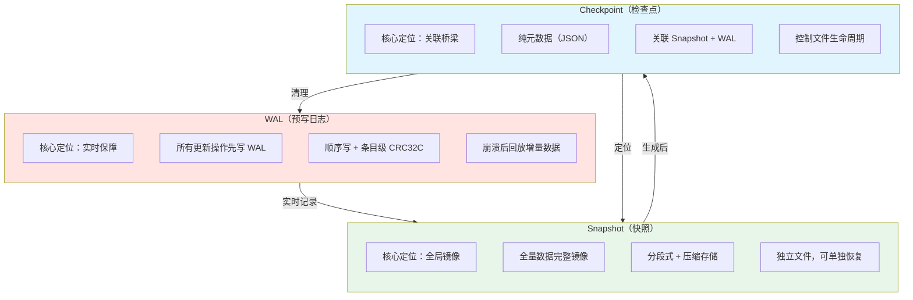
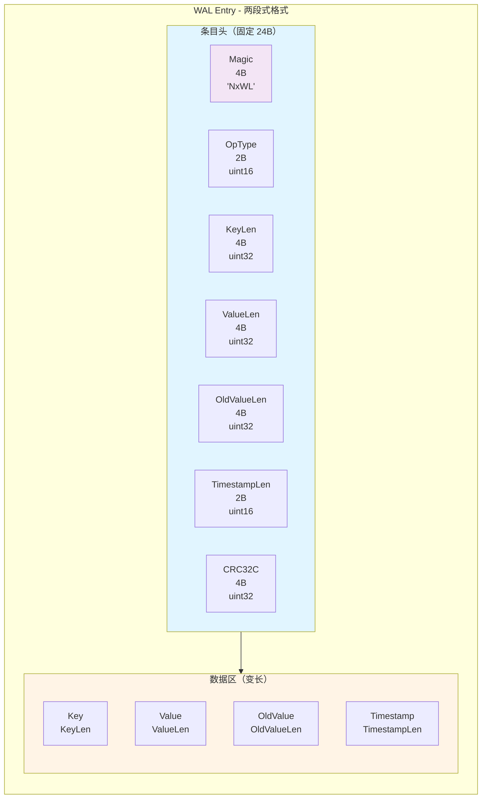
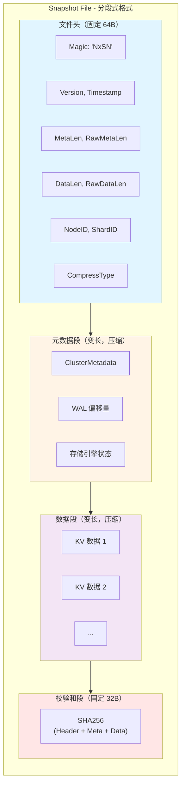
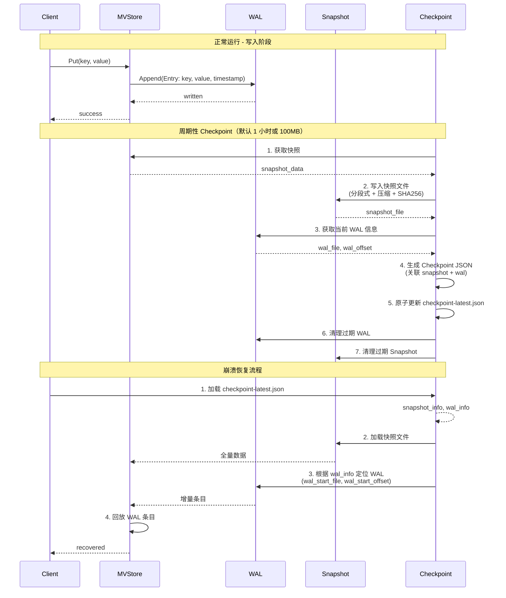
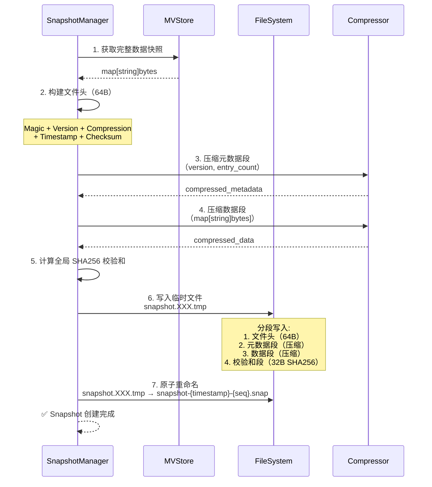
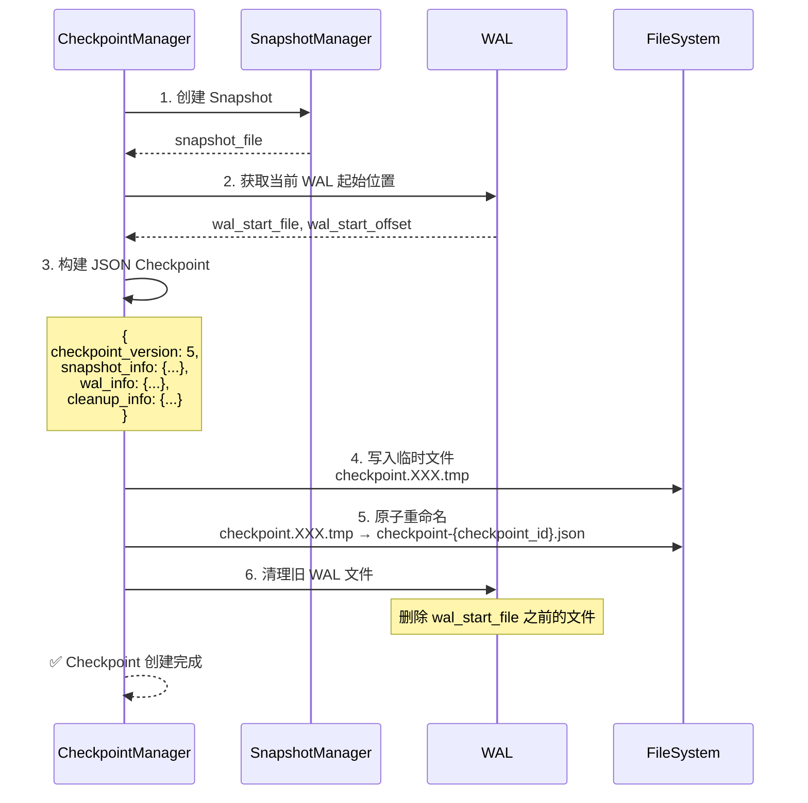
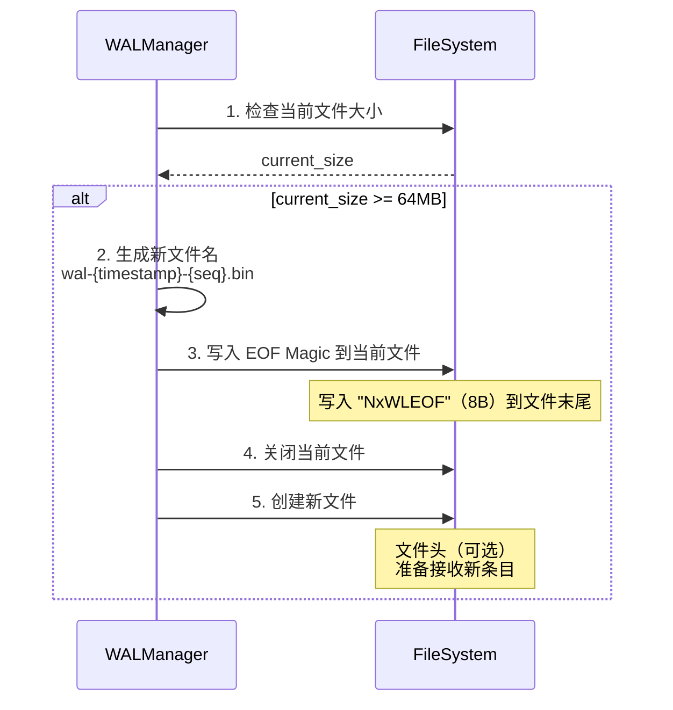
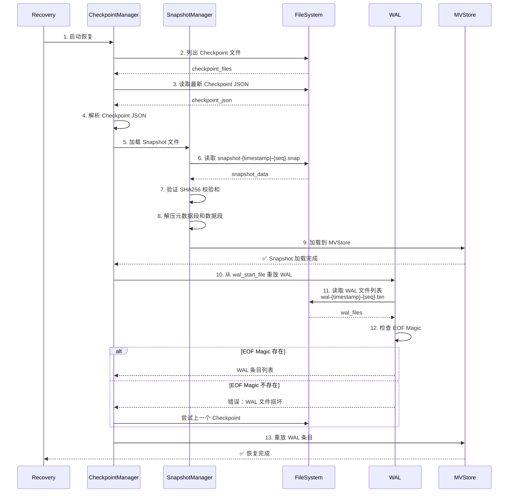

# PR-003: WAL Checkpoint 机制实现 - Pre 文档

> **PR 类型**: Feature (新功能)
> **优先级**: P0 - 生产就绪关键功能
> **预计工期**: 3-5 天
> **创建日期**: 2026-01-19
> **文档版本**: V2.0 (Pre) - 基于 brainstorm 设计方案（双文件分离）

---

## 第一部分：前置部分（Pre）

### 1.1 需求背景

**问题陈述**：

当前 WAL (Write-Ahead Log) 实现存在严重缺陷：

1. **WAL 无限增长**：WAL 文件持续追加写入，无定期清理机制
2. **恢复时间过长**：崩溃恢复需要重放完整 WAL，随着 WAL 增长线性增加
3. **磁盘空间风险**：长时间运行后 WAL 文件可能占满磁盘
4. **生产环境不可用**：当前实现仅适合开发/测试，不适合生产部署

**影响范围**：

- **数据可靠性**：WAL 过大时恢复失败风险增加
- **系统性能**：大文件 I/O 影响正常写入性能
- **运维成本**：需要手动清理 WAL，增加运维负担

**业务场景**：

NexKV 作为分布式 KV 存储系统，在生产环境中需要 7×24 小时稳定运行：
- 数据目录磁盘容量有限（通常 100GB-1TB）
- 崩溃恢复时间要求 < 30 秒（当前可能长达数分钟）
- 要求自动化运维，减少人工干预

### 1.2 功能目标

**主要目标**：

1. ✅ **实现 Snapshot（快照）创建与加载**
   - 创建 MVStore 全量数据快照（独立文件）
   - 支持压缩存储（ZSTD/Snappy/LZ4）
   - 支持后台异步生成，不阻塞在线业务
   - 快照完成后只读，支持并发读取

2. ✅ **实现 Checkpoint（检查点）创建与加载**
   - Checkpoint = 纯元数据（JSON 格式，指针类）
   - 关联 Snapshot 文件和 WAL 起始位置
   - 原子更新 checkpoint-latest.json
   - 支持自动清理过期文件

3. ✅ **实现崩溃恢复流程**
   - 优先加载最新 Checkpoint（JSON）
   - 根据 Checkpoint 定位最新 Snapshot
   - 加载 Snapshot 全量数据
   - 回放 Checkpoint 之后的 WAL 增量数据
   - 恢复时间 < 10 秒（100 万条记录）

4. ✅ **实现调度机制**
   - 基于时间间隔（默认 1 小时）
   - 基于 WAL 大小（默认 100MB）
   - 手动触发 Checkpoint（管理接口）

5. ✅ **WAL 滚动文件**
   - 文件命名：wal-{timestamp}-{sequence}.bin
   - 单文件大小限制（默认 64MB）
   - 自动切换到新文件
   - EOF Magic 标记（"NxWLEOF"）

**非目标（本次不实现）**：

- ❌ 增量快照（P2 优化）
- ❌ 分布式快照（仅本地快照）
- ❌ 快照加密（后续 PR）

### 1.3 验收标准

**功能验收**：

1. **Snapshot 创建**：
   - [ ] 能够成功创建全量数据快照（独立文件）
   - [ ] Snapshot 文件格式正确（分段式 + 压缩）
   - [ ] SHA256 校验通过
   - [ ] 后台异步生成，不阻塞业务

2. **Checkpoint 创建**：
   - [ ] 能够成功创建 Checkpoint（JSON 格式）
   - [ ] 正确关联 Snapshot 文件和 WAL 起始位置
   - [ ] 原子更新 checkpoint-latest.json
   - [ ] Checkpoint 失败不影响 MVStore 正常运行

3. **崩溃恢复**：
   - [ ] 优先加载最新 Checkpoint（JSON）
   - [ ] 根据 Checkpoint 定位并加载最新 Snapshot
   - [ ] 正确回放 Checkpoint 之后的 WAL
   - [ ] 恢复后的数据与崩溃前完全一致
   - [ ] 恢复时间 < 10 秒（100 万条记录）

4. **调度机制**：
   - [ ] 定时触发（1 小时）
   - [ ] 基于大小触发（100MB WAL）
   - [ ] 手动触发接口工作正常

5. **WAL 滚动文件**：
   - [ ] 自动切换到新文件（64MB 阈值）
   - [ ] 文件命名正确（wal-{timestamp}-{sequence}.bin）
   - [ ] EOF Magic 标记正确

6. **自动清理**：
   - [ ] 自动清理过期 Snapshot（保留最新 3 个）
   - [ ] 自动清理过期 WAL 文件
   - [ ] 清理失败不影响数据一致性

**性能验收**：

1. **Snapshot 创建性能**：
   - 创建时间 < 5 秒（100 万条记录）
   - 期间不影响正常读写（阻塞 < 100ms）

2. **恢复性能**：
   - 恢复时间 < 10 秒（100 万条记录）
   - 比纯 WAL 恢复快 10 倍以上

3. **磁盘空间**：
   - Snapshot 压缩后大小约为 MVStore 的 30-50%
   - WAL 清理后释放 80% 以上空间

**测试覆盖率**：

- 单元测试覆盖率 > 85%
- 集成测试覆盖 10+ 场景
- 性能测试验证恢复时间

### 1.4 技术方案设计

> **设计方案说明**：本 PR 采用 **双文件分离方案**（基于 brainstorm 文档设计）
> - **Checkpoint** = 纯元数据（JSON 格式，指针类）
> - **Snapshot** = 独立数据文件（分段式 + 压缩，实体类）
> - **WAL** = 滚动文件 + EOF Magic

---

#### 核心定位与分工



**三者协作关系**：

```
正常运行：业务更新 → 写入 WAL → 定期生成 Snapshot → 生成 Checkpoint → 清理老旧 WAL
崩溃恢复：加载 Checkpoint → 定位 Snapshot → 加载全量数据 → 回放 WAL 增量 → 恢复最新状态
```

---

#### WAL 文件设计（滚动文件 + EOF Magic）

##### 文件整体结构

采用**滚动文件**模式：

- **文件命名**：`wal-{timestamp}-{sequence}.bin`
  - 示例：`wal-1735689600-0001.bin`、`wal-1735690200-0002.bin`
  - 便于排序和查找
- **单文件大小限制**：64MB（默认，可配置）
- **自动切换**：达到阈值后自动切换到新文件
- **末尾标记**：完成的文件添加 EOF Magic

**单个 WAL 文件内部结构**：

```
[条目1头（24B）][条目1数据（变长）][条目2头（24B）][条目2数据（变长）]...[末尾标记（8B）]
```

##### WAL 条目格式（两段式）



##### 字段详细说明

**条目头（24B，固定长度，大端序）**：

| 字段         | 长度 | 类型     | 说明                                                                 |
|--------------|------|----------|----------------------------------------------------------------------|
| Magic        | 4 B  | bytes    | 固定为 `"NxWL"`，验证条目有效性                                          |
| OpType       | 2 B  | uint16   | 操作类型（1=Put/2=Delete/3=Update）                                  |
| KeyLen       | 4 B  | uint32   | Key 二进制数据长度                                                  |
| ValueLen     | 4 B  | uint32   | Value 二进制数据长度（Delete 操作时为 0）                            |
| OldValueLen  | 4 B  | uint32   | 旧 Value 长度（Update 操作时有效，用于回滚）                           |
| TimestampLen | 2 B  | uint16   | 时间戳数据长度（固定为 8 字节，uint64 毫秒级时间戳）                   |
| CRC32C       | 4 B  | uint32   | 条目数据（Key+Value+OldValue+Timestamp）的 CRC32C 校验值                |

**条目数据（变长，按顺序存储）**：

| 字段     | 长度来源       | 存储格式  | 说明                                                                 |
|----------|----------------|-----------|----------------------------------------------------------------------|
| Key      | 条目头的 KeyLen | bytes    | 业务 Key（字符串/哈希值等的原始字节流）                               |
| Value    | 条目头的 ValueLen | bytes  | 业务 Value（结构化数据经 Protobuf 编解码）                            |
| OldValue | 条目头的 OldValueLen | bytes | 旧 Value（仅 Update 操作有效）                                        |
| Timestamp| 条目头的 TimestampLen | bytes | uint64 毫秒级时间戳                                                  |

**末尾标记（8B，固定）**：

| 字段      | 长度 | 类型  | 说明                                                                 |
|-----------|------|-------|----------------------------------------------------------------------|
| EOF Magic | 8 B  | bytes | 固定为 `"NxWLEOF"`，标记 WAL 文件写入完成（未写满的文件无此标记）            |

---

#### Snapshot 文件设计（独立文件 + 分段式 + 压缩）

##### 文件命名与存储策略

- **命名格式**：`snapshot-{timestamp}-{version}.snap`
  - 示例：`snapshot-1735689600-0005.snap`
  - `version` 与 Checkpoint 版本一致
- **存储策略**：
  - 单个 Snapshot 为**独立文件**
  - 生成后**只读**（不可修改）
  - 支持**压缩存储**（默认 ZSTD）
- **清理策略**：
  - 保留最新 3 个 Snapshot
  - 老旧 Snapshot 基于 Checkpoint 自动清理

##### 文件整体结构（分段式）

```
[文件头（64B）][元数据段（变长，压缩）][数据段（变长，压缩）][校验和段（32B）]
```

##### 文件头（64B，固定长度，大端序）

| 字段         | 长度 | 类型     | 说明                                                                 |
|--------------|------|----------|----------------------------------------------------------------------|
| Magic        | 4 B  | bytes    | 固定为 `"NxSN"`，验证快照文件有效性                                    |
| Version      | 4 B  | uint32   | 快照版本号，与 Checkpoint 版本一致                                    |
| Timestamp    | 8 B  | uint64   | 快照生成时间戳（毫秒级）                                              |
| MetaLen      | 4 B  | uint32   | 压缩后的元数据段长度                                                |
| RawMetaLen   | 4 B  | uint32   | 解压后的元数据段长度                                                |
| DataLen      | 4 B  | uint32   | 压缩后的数据段长度                                                  |
| RawDataLen   | 4 B  | uint32   | 解压后的数据段长度                                                  |
| NodeID       | 16 B | bytes    | 生成快照的节点 ID                                                    |
| ShardID      | 8 B  | bytes    | 分片 ID（全局快照为全 0）                                            |
| CompressType | 2 B  | uint16   | 压缩算法类型（1=ZSTD/2=Snappy/3=LZ4）                               |
| Reserved     | 14 B | bytes    | 预留字段（填充 0）                                                   |

##### 元数据段（变长，压缩存储）

**存储内容**：
1. 集群元数据（ClusterMetadata）：分片分布、节点状态、版本号等
2. 快照生成时的 WAL 偏移量
3. 存储引擎状态

**存储格式**：
- 结构化数据经 Protobuf 编解码为二进制
- 通过文件头标记的压缩算法压缩后存储

##### 数据段（变长，压缩存储）

**存储内容**：
- 快照生成时刻的全量有效 KV 数据
- 按分片/Key 范围有序存储

**存储格式**：
- 单个 KV 格式：`[KeyLen（4B）][Key（变长）][ValueLen（4B）][Value（变长）]`
- 整体经压缩算法压缩后存储

##### 校验和段（32B，固定）

- **存储内容**：文件头+元数据段+数据段的 SHA256 校验值
- **作用**：加载快照时先校验全局 SHA256，若不一致则标记快照损坏

##### 分段式结构图



---

#### Checkpoint 文件设计（JSON 格式 + 纯元数据）

##### 文件命名与存储策略

- **命名格式**：
  - 最新检查点：`checkpoint-latest.json`（覆盖式写入）
  - 历史检查点：`checkpoint-{version}.json`（归档存储）
- **存储策略**：
  - 采用 **JSON 格式**（轻量、可读、便于调试）
  - 单个文件体积极小（KB 级），无需压缩
  - 最新检查点文件保持只读（生成后不修改）
- **核心作用**：
  - 作为**恢复入口**
  - 节点启动时优先加载 `checkpoint-latest.json`

##### 核心字段定义（JSON 格式）

```json
{
  "checkpoint_version": 5,
  "node_id": "node-001",
  "shard_id": "shard-001",
  "create_timestamp": 1735689600000,
  "snapshot_info": {
    "snapshot_file": "snapshot-1735689600-0005.snap",
    "snapshot_version": 5,
    "snapshot_size": 10485760,
    "snapshot_checksum": "xxxxxxxxxxxxxxxxxxxxxxxxxxxxxxxx"
  },
  "wal_info": {
    "wal_start_file": "wal-1735689600-0001.bin",
    "wal_start_offset": 12345,
    "wal_latest_file": "wal-1735690200-0003.bin",
    "wal_latest_offset": 67890
  },
  "cleanup_info": {
    "expire_wal_files": ["wal-1735688000-0001.bin", "wal-1735688600-0002.bin"],
    "expire_snapshot_files": ["snapshot-1735687200-0003.snap"]
  },
  "reserved": {}
}
```

##### 字段详细说明

| 字段       | 类型   | 说明                                                                 |
|------------|--------|----------------------------------------------------------------------|
| checkpoint_version | uint64 | 检查点版本号，与快照版本一致                                          |
| node_id    | string | 节点 ID                                                              |
| shard_id   | string | 分片 ID（全局节点为 "global"）                                       |
| create_timestamp | uint64 | 检查点生成时间戳（毫秒级）                                            |
| snapshot_info | object | 关联的最新快照信息                                                  |
| wal_info   | object | 关联的 WAL 信息（快照之后的增量 WAL）                               |
| cleanup_info | object | 清理信息，用于 WAL/快照归档                                          |
| reserved   | object | 预留字段，便于后续扩展                                              |

---

#### 三种文件关系与协作流程

##### 序列图：正常运行 + 崩溃恢复



##### 关系说明

| 文件 | 类型 | 作用 | 创建时机 | 使用时机 |
|------|------|------|---------|---------|
| **WAL** | 二进制 | 实时记录所有变更 | 每次 Put/Delete | 崩溃恢复时重放 |
| **Snapshot** | 二进制（分段式 + 压缩） | 全量数据镜像 | 定时触发（1h/100MB） | 恢复时快速加载基线 |
| **Checkpoint** | JSON | 关联 Snapshot 与 WAL | Snapshot 生成后 | 恢复时定位文件 |

**数据流向**：
```
正常运行:  Client → MVStore → WAL (追加)
Checkpoint:  MVStore → Snapshot (独立文件) → Checkpoint JSON (引用)
恢复:      Checkpoint JSON → Snapshot → MVStore → WAL (增量)
```

---

#### 核心接口设计

> **设计原则**：双文件分离架构
> - **SnapshotManager**：管理独立的 Snapshot 文件（实体类，分段式+压缩）
> - **CheckpointManager**：管理 JSON 格式的 Checkpoint 文件（指针类，纯元数据）
> - **WAL Manager**：支持 Rolling Files + EOF Magic

##### SnapshotManager 接口

```go
// SnapshotManager Snapshot 管理器（独立文件）
type SnapshotManager interface {
    // CreateSnapshot 创建 MVStore 全量数据快照
    // 返回 Snapshot 文件名和错误信息
    CreateSnapshot(ctx context.Context) (string, error)

    // LoadSnapshot 加载 Snapshot 文件到 MVStore
    LoadSnapshot(ctx context.Context, snapshotFile string) error

    // ListSnapshots 列出所有 Snapshot 文件
    ListSnapshots() ([]string, error)

    // DeleteSnapshot 删除指定 Snapshot 文件
    DeleteSnapshot(snapshotFile string) error

    // VerifySnapshot 验证 Snapshot 文件完整性
    VerifySnapshot(snapshotFile string) error
}
```

**Snapshot 创建流程**：



##### CheckpointManager 接口

```go
// CheckpointManager Checkpoint 管理器（JSON 元数据）
type CheckpointManager interface {
    // CreateCheckpoint 创建检查点（JSON 元数据）
    // 返回 Checkpoint ID 和错误信息
    CreateCheckpoint(ctx context.Context) (uint64, error)

    // LoadCheckpoint 加载 Checkpoint 并恢复系统状态
    LoadCheckpoint(ctx context.Context) error

    // GetLatestCheckpoint 获取最新 Checkpoint 信息
    GetLatestCheckpoint() (*CheckpointMetadata, error)

    // ListCheckpoints 列出所有 Checkpoint
    ListCheckpoints() ([]*CheckpointMetadata, error)

    // DeleteCheckpoint 删除指定 Checkpoint
    DeleteCheckpoint(checkpointID uint64) error

    // StartScheduler 启动自动 Checkpoint 调度器
    StartScheduler()

    // StopScheduler 停止调度器
    StopScheduler()
}
```

**Checkpoint 创建流程**：



**Checkpoint JSON 格式**：

```json
{
  "checkpoint_version": 5,
  "timestamp": "2026-01-19T12:00:00Z",
  "snapshot_info": {
    "snapshot_file": "snapshot-1735689600-0005.snap",
    "snapshot_checksum": "abc123...",
    "compression_type": "zstd",
    "entry_count": 1000000,
    "uncompressed_size": 104857600,
    "compressed_size": 31457280
  },
  "wal_info": {
    "wal_start_file": "wal-1735689600-0001.bin",
    "wal_start_offset": 12345,
    "wal_end_sequence": 67890
  },
  "cleanup_info": {
    "old_snapshots_to_delete": [
      "snapshot-1735600000-0003.snap"
    ],
    "old_wals_to_delete": [
      "wal-1735500000-0008.bin",
      "wal-1735500000-0009.bin"
    ]
  }
}
```

##### WAL Manager 增强（Rolling Files + EOF Magic）

```go
// WALManager WAL 管理器（支持 Rolling Files）
type WALManager interface {
    // WriteEntry 写入 WAL 条目（24B Header + Data）
    WriteEntry(entry *WALEntry) error

    // ReadEntries 读取 WAL 条目列表
    ReadEntries(startFile, startOffset string) ([]*WALEntry, error)

    // RotateFile WAL 文件轮转
    RotateFile() error

    // CloseWAL 关闭当前 WAL 文件并写入 EOF Magic
    CloseWAL() error

    // ListWALFiles 列出所有 WAL 文件
    ListWALFiles() ([]string, error)

    // CleanupOldWALs 清理旧的 WAL 文件
    CleanupOldWALs(keepAfterFile string) error
}
```

**WAL 文件轮转流程**：



**WAL EOF Magic 写入**：

```go
func (w *WALManager) CloseWAL() error {
    w.mu.Lock()
    defer w.mu.Unlock()

    // 1. 确保所有数据刷盘
    if err := w.file.Sync(); err != nil {
        return fmt.Errorf("sync WAL failed: %w", err)
    }

    // 2. 写入 EOF Magic "NxWLEOF"（8B）
    if _, err := w.file.Write([]byte("NxWLEOF")); err != nil {
        return fmt.Errorf("write EOF magic failed: %w", err)
    }

    // 3. 再次刷盘
    if err := w.file.Sync(); err != nil {
        return fmt.Errorf("sync EOF magic failed: %w", err)
    }

    // 4. 关闭文件
    if err := w.file.Close(); err != nil {
        return fmt.Errorf("close WAL failed: %w", err)
    }

    return nil
}
```

##### 恢复流程（完整版）



#### 调度策略设计

**触发条件**（OR 逻辑）：

1. **时间触发**：
   - 默认间隔：1 小时
   - 配置项：`checkpoint.interval`
   - 从上次 Checkpoint 时间开始计算

2. **大小触发**：
   - 默认阈值：100MB（WAL 总大小）
   - 配置项：`checkpoint.wal_size_threshold`
   - 检查所有 WAL 文件总大小

3. **手动触发**：
   - 管理 API：`CreateCheckpoint()`
   - 立即执行，不等待调度器

**保留策略**：

- Snapshot 文件：保留最近 N 个（默认 3 个）
- Checkpoint 文件：保留最近 N 个（默认 5 个）
- WAL 文件：保留最近 Checkpoint 之后的所有 WAL
- 配置项：`checkpoint.retention_count`

---

### 1.5 实现计划

#### 任务分解

| 阶段 | 任务 | 预计时间 | 交付物 |
|------|------|---------|--------|
| **阶段 1** | Snapshot 文件格式设计与实现 | 1 天 | snapshot_writer.go, snapshot_reader.go |
| **阶段 2** | Checkpoint JSON 结构定义与实现 | 0.5 天 | checkpoint_json.go, checkpoint_manager.go |
| **阶段 3** | WAL Rolling Files 实现 | 1 天 | wal_rotating.go |
| **阶段 4** | WAL EOF Magic 实现 | 0.5 天 | wal.go 修改 |
| **阶段 5** | 压缩支持（ZSTD/Snappy/LZ4） | 0.5 天 | compressor.go |
| **阶段 6** | 完整恢复流程实现 | 1 天 | recovery.go |
| **阶段 7** | 单元测试编写 | 1 天 | snapshot_test.go, checkpoint_test.go, wal_test.go |
| **阶段 8** | 集成测试编写 | 1 天 | checkpoint_integration_test.go |
| **阶段 9** | 性能测试与优化 | 0.5 天 | 性能测试报告 |

**总计**: 7 天

#### 文件清单

**新增文件**：

1. `internal/metadata/store/snapshot_writer.go` - Snapshot 写入器（分段式+压缩）
2. `internal/metadata/store/snapshot_reader.go` - Snapshot 读取器
3. `internal/metadata/store/snapshot_manager.go` - Snapshot 管理器
4. `internal/metadata/store/checkpoint_manager.go` - Checkpoint 管理器（JSON）
5. `internal/metadata/store/checkpoint_json.go` - Checkpoint JSON 结构定义
6. `internal/metadata/store/wal_rotating.go` - WAL Rolling Files 支持
7. `internal/metadata/store/compressor.go` - 压缩器接口（ZSTD/Snappy/LZ4）
8. `internal/metadata/store/recovery.go` - 完整恢复流程
9. `internal/metadata/store/snapshot_test.go` - Snapshot 单元测试
10. `internal/metadata/store/checkpoint_test.go` - Checkpoint 单元测试
11. `internal/metadata/store/wal_rotating_test.go` - WAL Rolling Files 测试
12. `internal/metadata/store/checkpoint_integration_test.go` - 集成测试

**修改文件**：

1. `internal/metadata/store/wal.go` - 添加 EOF Magic 写入、Rolling Files 支持
2. `internal/metadata/store/mv_store.go` - 添加 GetSnapshot() 方法
3. `internal/metadata/config/loader.go` - 添加 Checkpoint/Snapshot 配置项
4. `internal/metadata/types/errors.go` - 添加新错误类型
5. `Makefile` - 添加压缩库依赖（zstd, snappy, lz4）

### 1.6 风险评估

| 风险项 | 风险等级 | 影响 | 缓解措施 |
|-------|---------|------|---------|
| **Snapshot 创建阻塞业务** | 🟡 中 | 用户体验下降 | 1. 使用快照读取，避免写锁<br>2. 限制快照时间 < 5 秒 |
| **Snapshot 文件损坏** | 🔴 高 | 数据丢失 | 1. SHA256 全局校验<br/>2. 保留多个版本<br>3. 自动回退到上一个版本 |
| **Checkpoint JSON 解析失败** | 🟡 中 | 恢复失败 | 1. JSON Schema 验证<br>2. 保留旧版本 JSON 文件 |
| **WAL EOF Magic 丢失** | 🔴 高 | WAL 损坏检测失败 | 1. 强制刷盘<br/>2. 文件关闭前写入<br>3. 恢复时严格检查 |
| **压缩库依赖** | 🟡 中 | 编译失败 | 1. 使用 CGO-free 压缩库<br>2. 提供无压缩降级方案 |
| **恢复时间不达标** | 🟡 中 | 性能验收失败 | 1. 性能测试验证<br>2. 优化解压缩性能<br>3. 并行加载 Snapshot |
| **并发安全问题** | 🔴 高 | 数据损坏 | 1. 充分的并发测试<br>2. 使用锁保护共享状态<br>3. 代码 Review |
| **文件清理策略错误** | 🟡 中 | 磁盘空间或数据丢失 | 1. 清理前验证依赖关系<br>2. 提供手动清理接口 |
| **Snapshot 文件过大** | 🟡 中 | 创建/恢复时间长 | 1. 监控文件大小<br>2. 考虑增量 Snapshot（P2） |

### 1.7 配置设计

**新增配置项**：

```yaml
# config.yaml
snapshot:
  # 是否启用 Snapshot
  enabled: true

  # 数据目录
  data_dir: "./data/snapshots"

  # 压缩算法（zstd, snappy, lz4, none）
  compression: "zstd"

  # 压缩级别（1-9，仅 zstd 有效）
  compression_level: 3

checkpoint:
  # 是否启用 Checkpoint
  enabled: true

  # 数据目录
  data_dir: "./data/checkpoints"

  # 自动触发间隔（1m, 1h）
  interval: "1h"

  # WAL 大小触发阈值（100MB, 1GB）
  wal_size_threshold: "100MB"

  # 最小触发间隔（防止频繁 Checkpoint）
  min_interval: "30m"

  # 保留个数
  retention_count: 3

wal:
  # 单文件大小限制（触发轮转）
  max_file_size: "64MB"

  # 文件保留策略
  retention:
    # 保留最近 Checkpoint 之后的所有 WAL
    keep_after_checkpoint: true

    # 保留时间（7d, 30d）
    max_age: "7d"
```

### 1.8 WAL 多文件支持说明

> **重要说明**：PR-003 当前实现使用 **单 WAL 文件 + Truncate()** 清理策略

**当前实现**：
- 单个 WAL 文件：`wal.bin`
- Checkpoint 后调用 `Truncate(offset)` 清理已应用的条目
- 文件重写：临时文件 → 原子替换

**PR-004 计划**（Rolling Files）：
- WAL 文件命名：`wal-{timestamp}-{sequence}.bin`
- 单文件大小限制：64MB
- 末尾标记：`NxWLEOF`（8B Magic）
- Checkpoint 后删除旧 WAL 文件

**PR-003 与 PR-004 的关系**：
- PR-003 实现基础 Checkpoint 机制（单文件方案）
- PR-004 升级为 Rolling Files 方案
- 两者保持兼容，Checkpoint 格式不变

---

## 1.9 相关设计文档

- **WAL 崩溃恢复**：`docs/02_design/modules/03_WAL崩溃恢复.md`
- **故障恢复**：`docs/02_design/modules/04_故障恢复.md`
- **存储引擎设计**：`docs/02_design/modules/02_存储引擎设计.md`
- **Brainstorm 设计**：`docs/06_project_management/brainstorm/checkpoint_2026-01-19_wal-snapshot-checkpoint-design.md`

---

**文档版本**: V2.0 (Pre) - 基于 brainstorm 设计方案（双文件分离）

---

## 第二部分：后置部分（Post）

> **说明**：第二部分在开发完成并经过本地测试验证后填写。

### 2.1 实现总结

（开发完成后填写）

### 2.2 成果展示

（开发完成后填写）

### 2.3 性能/数据成果

（开发完成后填写）

### 2.4 测试验证

（开发完成后填写）

### 2.5 遗留问题

（开发完成后填写）

### 2.6 经验教训

（开发完成后填写）

---

## 附录

### A. 参考资料

1. **WAL 设计文档**：`docs/02_design/modules/03_WAL崩溃恢复.md`
2. **MVStore 实现文档**：`docs/02_design/modules/02_存储引擎设计.md`
3. **Protobuf 官方文档**：https://protobuf.dev/
4. **LevelDB Checkpoint 设计**：https://github.com/google/leveldb

### B. 相关 Issue/PR

- PR-002: Protobuf 编解码与测试覆盖率提升
- PR-004: WAL 轮换机制（后续）

### C. 术语表

| 术语 | 全称 | 说明 |
|------|------|------|
| WAL | Write-Ahead Log | 预写日志 |
| Checkpoint | - | 一致性快照 |
| MVStore | Multi-Version Store | 多版本存储 |
| Truncate | - | 截断（清理日志） |

---

**文档变更历史**：

| 版本 | 日期 | 修改人 | 修改内容 |
|------|------|--------|---------|
| V1.0 (Pre) | 2026-01-19 | AI Assistant | 初始版本创建 |

**审批记录**：

| 角色 | 姓名 | 审批日期 | 意见 | 签字 |
|------|------|----------|------|------|
| 架构师 | - | - | ⏳ 待审批 | - |
| 项目经理 | - | - | ⏳ 待审批 | - |
| 测试工程师 | - | - | ⏳ 待审批 | - |

---

**状态**: 📝 待架构师评审
**下一步**: 等待架构师审批 Pre 文档
