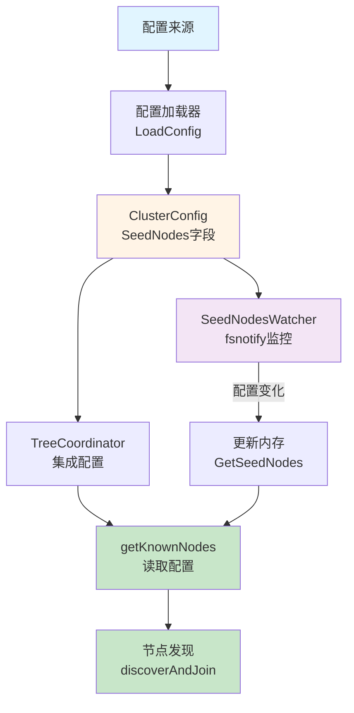
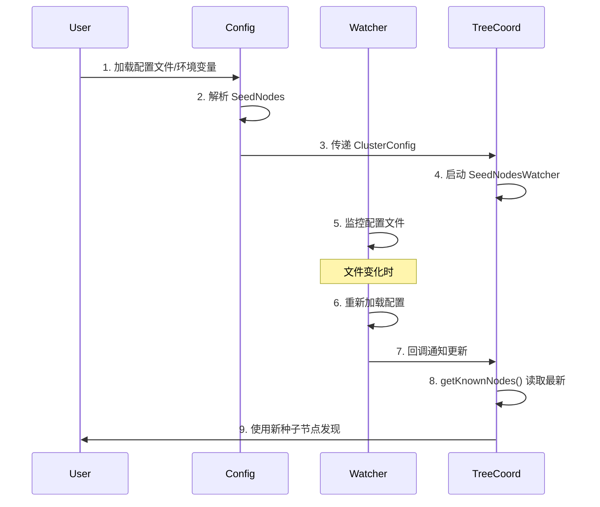
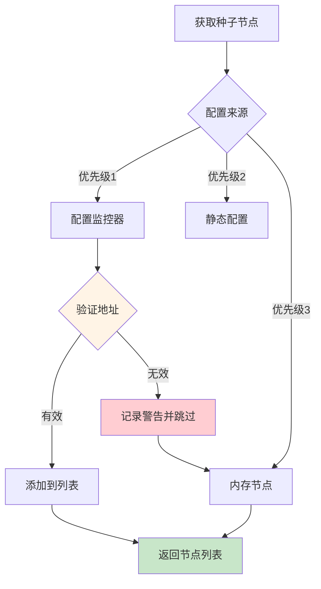

# PR-036: 种子节点地址配置功能 - 全流程文档

> **类型**: 新功能 (Feature)
> **日期**: 2026-01-30
> **状态**: 🔄 Pre 文档待评审
> **分支**: `feature/seed-node-config`

---

## 📋 目录

- [1. Pre 文档](#1-pre-文档)
  - [1.1 需求分析](#11-需求分析)
  - [1.2 设计方案](#12-设计方案)
  - [1.3 风险评估](#13-风险评估)
- [2. Post 文档](#2-post-文档)
  - [2.1 实现总结](#21-实现总结)
  - [2.2 测试报告](#22-测试报告)
  - [2.3 未完成项](#23-未完成项)

---

## 1. Pre 文档

### 1.1 需求分析

#### 背景说明

当前 NexKV 集群启动时，节点发现机制存在以下问题：

1. **TODO 未实现**：`tree_coordinator.go` 中有两处 TODO 注释（第 537 行和第 581 行），明确指出需要从配置文件、环境变量获取种子节点列表
2. **硬编码限制**：当前 `getKnownNodes()` 仅返回内存中已有的节点，无法实现新节点的集群引导
3. **生产环境需求**：实际部署时需要通过配置文件或环境变量指定种子节点地址

**相关代码位置**:
- `internal/metadata/cluster/tree_coordinator.go:537`
- `internal/metadata/cluster/tree_coordinator.go:581`

#### 功能需求

**核心需求**：

| 需求ID | 描述 | 优先级 |
|--------|------|--------|
| **REQ-1** | 支持从配置文件读取种子节点地址列表 | P0 |
| **REQ-2** | 支持从环境变量读取种子节点地址 | P0 |
| **REQ-3** | 支持运行时热更新配置文件 | P1（用户选择） |
| **REQ-4** | 自动过滤自身地址，避免连接自己 | P0 |
| **REQ-5** | 降级处理无效地址，不阻塞启动 | P0 |

**非功能需求**：

| 需求ID | 描述 | 指标 |
|--------|------|------|
| **NFR-1** | 向后兼容，不影响现有内存节点列表 | 100% |
| **NFR-2** | 配置验证响应时间 | < 100ms |
| **NFR-3** | 配置热更新延迟 | < 1s |
| **NFR-4** | 单元测试覆盖率 | > 80% |

#### 用户场景

**场景 1：新集群引导**

```yaml
# config.yaml
cluster:
  name: "nexkv-cluster"
  node_id: "node-1"
  node_addr: "/ip4/192.168.1.10/tcp/9211"
  seed_nodes:
    - "/ip4/192.168.1.10/tcp/9211"
    - "/ip4/192.168.1.11/tcp/9211"
```

用户启动第一个节点时，即使 `allNodes` 为空，也能通过配置的种子节点发现集群。

**场景 2：环境变量覆盖**

```bash
# 临时指定不同的种子节点（使用 multiaddr 格式）
export NEXKV_CLUSTER_SEED_NODES="/ip4/10.0.0.5/tcp/9211,/ip4/10.0.0.6/tcp/9211"
./nexkvd
```

**场景 3：运行时热更新**

用户修改配置文件后，无需重启即可生效：
```bash
# 修改配置文件
vim /etc/nexkv/config.yaml

# 信号通知或自动检测（1s 内生效）
```

---

### 1.2 设计方案

#### 架构设计

**整体架构**：



**数据流**：



#### 配置结构设计

**ClusterConfig 扩展**：

```go
// internal/metadata/config/config.go
type ClusterConfig struct {
    Name      string   `yaml:"name" mapstructure:"name"`
    NodeID    string   `yaml:"node_id" mapstructure:"node_id"`
    NodeAddr  string   `yaml:"node_addr" mapstructure:"node_addr"`
    SeedNodes []string `yaml:"seed_nodes" mapstructure:"seed_nodes"` // 新增
    TreeCoord TreeCoordConfig `yaml:"tree_coord" mapstructure:"tree_coord"`
}
```

**支持的配置格式**：

| 格式类型 | 示例 | 说明 |
|---------|------|------|
| **YAML 数组** | `seed_nodes: ["/ip4/127.0.0.1/tcp/7946", "/ip4/127.0.0.1/tcp/7947"]` | 推荐，格式清晰 |
| **逗号分隔** | `seed_nodes: "/ip4/127.0.0.1/tcp/7946,/ip4/127.0.0.1/tcp/7947"` | 备用，兼容环境变量 |
| **环境变量** | `NEXKV_CLUSTER_SEED_NODES=/ip4/127.0.0.1/tcp/7946,/ip4/127.0.0.1/tcp/7947` | 临时覆盖 |

**IPFS multiaddr 格式说明**：
- IPv4: `/ip4/192.168.1.10/tcp/9211`
- IPv6: `/ip6/::1/tcp/9211`
- DNS: `/dns4/localhost/tcp/9211`
- 支持的组合格式：`/ip4/<IP>/tcp/<PORT>`

#### 组件设计

**组件 1：种子节点解析器**

**文件**: `internal/metadata/config/seed_nodes.go`

```go
package config

import (
    "fmt"
    "strings"

    "github.com/multiformats/go-multiaddr"
)

// ParseSeedNodes 解析种子节点配置
// 支持格式：
//   - []string: ["/ip4/127.0.0.1/tcp/7946", "/ip4/127.0.0.1/tcp/7947"]
//   - string: "/ip4/127.0.0.1/tcp/7946,/ip4/127.0.0.1/tcp/7947"
func ParseSeedNodes(config interface{}) ([]string, error)

// ValidateSeedNodeAddress 验证单个地址格式
// 要求：IPFS multiaddr 格式，如 /ip4/<IP>/tcp/<PORT>
func ValidateSeedNodeAddress(addr string) error

// NormalizeSeedNodes 规范化地址列表
// 执行：去重、去空、去除空格
func NormalizeSeedNodes(nodes []string) []string

// splitSeedNodesString 分割逗号分隔的字符串
func splitSeedNodesString(s string) []string
```

**组件 2：配置热更新监控器**

**文件**: `internal/metadata/config/seed_nodes_watcher.go`

```go
package config

import (
    "sync"

    "github.com/fsnotify/fsnotify"
)

// SeedNodesWatcher 种子节点配置监控器
type SeedNodesWatcher struct {
    mu         sync.RWMutex
    seedNodes  []string         // 当前种子节点列表
    filePath   string           // 配置文件路径
    callback   func([]string)   // 配置变化回调
    watcher    *fsnotify.Watcher
    done       chan struct{}
    closeOnce  sync.Once
}

// NewSeedNodesWatcher 创建配置监控器
func NewSeedNodesWatcher(filePath string, callback func([]string)) (*SeedNodesWatcher, error)

// Start 启动配置监控
func (w *SeedNodesWatcher) Start() error

// Stop 停止配置监控
func (w *SeedNodesWatcher) Stop()

// GetSeedNodes 获取当前种子节点（线程安全）
func (w *SeedNodesWatcher) GetSeedNodes() []string

// reload 重新加载配置
func (w *SeedNodesWatcher) reload() error
```

**组件 3：TreeCoordinator 集成**

**文件**: `internal/metadata/cluster/tree_coordinator.go`

```go
// TreeCoordinator 结构体扩展
type TreeCoordinator struct {
    // ... 现有字段 ...
    config           *config.ClusterConfig      // 新增：配置引用
    seedNodesWatcher  *config.SeedNodesWatcher   // 新增：配置监控器
}

// getKnownNodes 从配置和内存中获取已知节点
func (tc *TreeCoordinator) getKnownNodes() []*Node {
    nodes := make([]*Node, 0)

    // 1. 从配置监控器获取最新种子节点
    if tc.seedNodesWatcher != nil {
        seedNodes := tc.seedNodesWatcher.GetSeedNodes()
        for _, addr := range seedNodes {
            // 决策 3: 自动过滤自身地址
            if addr == tc.selfAddr {
                continue
            }

            // 决策 2: 降级处理 - 验证地址格式
            if err := config.ValidateSeedNodeAddress(addr); err != nil {
                logging.Warnf("Invalid seed node address %s: %v (skipped)", addr, err)
                continue
            }

            node := &Node{
                NodeAddr: addr,
                Status:   NodeStatusUnknown,
            }
            nodes = append(nodes, node)
        }
    }

    // 2. 合并内存中的已知节点（向后兼容 + 降级处理）
    tc.nodesMu.RLock()
    for _, node := range tc.allNodes {
        if !containsNodeAddr(nodes, node.NodeAddr) {
            nodes = append(nodes, node)
        }
    }
    tc.nodesMu.RUnlock()

    return nodes
}

// 辅助函数：检查节点地址是否已存在
func containsNodeAddr(nodes []*Node, addr string) bool {
    for _, n := range nodes {
        if n.NodeAddr == addr {
            return true
        }
    }
    return false
}
```

#### 接口设计

**配置验证接口**：

```go
// validateClusterConfigWrapper 扩展验证
func validateClusterConfigWrapper(cfg *Config) error {
    // 现有验证...

    // 新增：验证种子节点配置
    if len(cfg.Cluster.SeedNodes) > 0 {
        for _, addr := range cfg.Cluster.SeedNodes {
            if err := ValidateSeedNodeAddress(addr); err != nil {
                return fmt.Errorf("seed_node[%s]验证失败: %w", addr, err)
            }
        }
    }

    return nil
}
```

#### 错误处理策略

**降级处理机制**：



**错误分类处理**：

| 错误类型 | 处理策略 | 日志级别 |
|---------|---------|---------|
| **配置文件不存在** | 使用默认配置 | Info |
| **地址格式无效** | 跳过该地址，继续处理其他地址 | Warn |
| **所有种子节点无效** | 降级到内存节点 | Warn |
| **配置监控失败** | 静默失败，使用静态配置 | Error |

---

### 1.3 风险评估

#### 技术风险

| 风险ID | 风险描述 | 影响 | 概率 | 缓解措施 |
|--------|---------|------|------|---------|
| **R-1** | fsnotify 依赖增加外部依赖 | 低 | 低 | 使用成熟库，已有广泛使用 |
| **R-2** | 配置热更新并发安全问题 | 中 | 中 | 使用 sync.RWMutex 保护 |
| **R-3** | 向后兼容性破坏 | 高 | 低 | 保留内存节点列表作为降级方案 |
| **R-4** | 配置验证性能问题 | 低 | 低 | 验证操作仅启动时和配置变化时执行 |

#### 实施风险

| 风险ID | 风险描述 | 影响 | 概率 | 缓解措施 |
|--------|---------|------|------|---------|
| **R-5** | 工作量超预估 | 中 | 中 | 分阶段实施，优先实现核心功能 |
| **R-6** | 测试覆盖不足 | 中 | 中 | 编写完善的单元测试和集成测试 |
| **R-7** | 文档更新滞后 | 低 | 中 | 同步更新配置示例和文档 |

#### 回滚计划

**阶段 1 回滚**：配置结构扩展
- 如果配置验证有问题，暂时禁用种子节点验证

**阶段 2 回滚**：TreeCoordinator 集成
- 如果 `getKnownNodes()` 有问题，恢复原有实现

**阶段 3 回滚**：热更新支持
- 如果 fsnotify 有问题，移除热更新功能，保留静态配置

---

## 2. Post 文档

> **说明**：此部分在开发完成后填写

### 2.1 实现总结

#### 完成功能

- [ ] REQ-1: 配置文件读取种子节点
- [ ] REQ-2: 环境变量读取种子节点
- [ ] REQ-3: 运行时热更新
- [ ] REQ-4: 自动过滤自身地址
- [ ] REQ-5: 降级处理无效地址

#### 关键文件变更

| 文件 | 变更类型 | 说明 |
|------|---------|------|
| - | - | - |

### 2.2 测试报告

#### 单元测试

| 测试文件 | 测试用例数 | 通过率 |
|---------|-----------|--------|
| - | - | - |

#### 集成测试

| 测试场景 | 结果 |
|---------|------|
| - | - |

### 2.3 未完成项

| 项ID | 描述 | 原因 | 计划 |
|------|------|------|------|
| - | - | - | - |

---

## 附录

### A. 配置文件示例

```yaml
# config/examples/cluster_with_seed_nodes.yaml
cluster:
  name: "nexkv-cluster"
  node_id: "node-1"
  node_addr: "/ip4/127.0.0.1/tcp/9211"

  # 种子节点配置（可选）- 使用 IPFS multiaddr 格式
  # 格式 1: YAML 数组
  seed_nodes:
    - "/ip4/127.0.0.1/tcp/7946"
    - "/ip4/127.0.0.1/tcp/7947"

  # 格式 2: 逗号分隔字符串（备用）
  # seed_nodes: "/ip4/127.0.0.1/tcp/7946,/ip4/127.0.0.1/tcp/7947"

  # 支持的 multiaddr 格式：
  # - IPv4: /ip4/192.168.1.10/tcp/9211
  # - IPv6: /ip6/::1/tcp/9211
  # - DNS:  /dns4/localhost/tcp/9211

  tree_coord:
    heartbeat_interval: "5s"
    failure_timeout: "30s"
```

### B. 环境变量示例

```bash
# 设置种子节点环境变量（使用 multiaddr 格式）
export NEXKV_CLUSTER_SEED_NODES="/ip4/192.168.1.10/tcp/9211,/ip4/192.168.1.11/tcp/9211"

# 启动服务
./nexkvd
```

### C. 参考资料

- `internal/metadata/config/config.go` - 配置结构定义
- `internal/metadata/cluster/tree_coordinator.go:537` - TODO 注释位置
- `internal/metadata/cluster/tree_coordinator.go:581` - TODO 注释位置

---

**文档版本**: v1.0
**创建日期**: 2026-01-30
**维护者**: NexKV 开发团队
**状态**: 🔄 Pre 文档待评审
