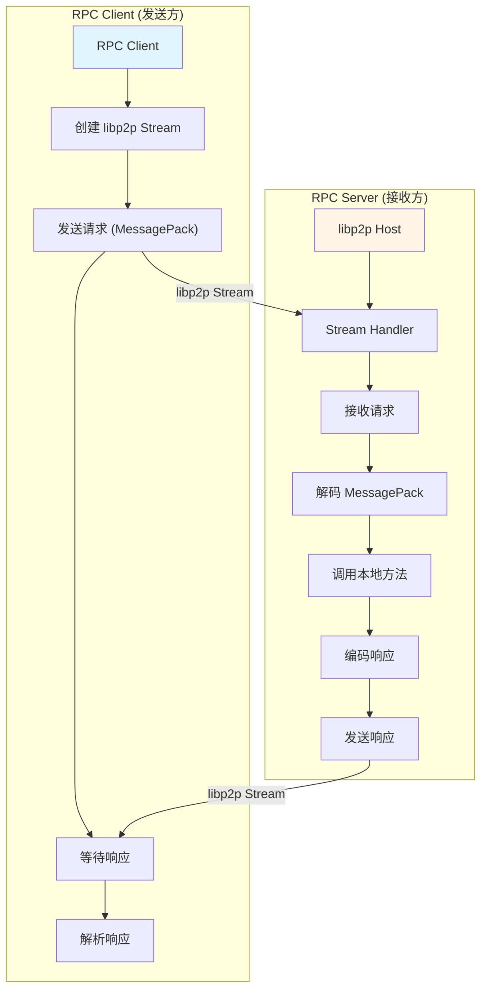

# 【PR全流程文档】Feature - 使用 libp2p Stream 重写 RPC 功能

> **文档说明**：本文档包含「前置规划」和「后置总结」两部分，记录从需求对齐到开发完成的全流程，一个PR对应一份全流程文档，归档后作为项目追溯依据。

---

## 第一部分：前置部分（开工前必完成，架构师评审通过）

### 1. 基础信息（与分支/PR绑定）

| 项目 | 内容 |
|------|------|
| 工作类型 | 新功能开发（Feature） |
| PR编号 | PR-Libp2p-RPC |
| 分支名称 | feature/libp2p-rpc-stream |
| 工作主题 | 使用 libp2p Stream 重写 RPC 功能 |
| 负责人 | [待定] |
| 分支创建日期 | 2026-02-06 |
| 计划开工日期 | 2026-02-06 |
| 计划CI通过日期 | 2026-02-13 |
| 关联需求单号 | 恢复 PR-TransportCleanup 中禁用的 RPC 功能 |
| 架构师评审状态 | □ 待评审 □ 评审中 □ 评审通过 □ 需优化（循环记录） |
| 预审批结果 | □ 未通过 □ 已通过（架构师签字/备注：____________） |

### 2. 背景与目标（为什么干）

#### 2.1 背景

**业务场景**：
PR-Libp2p-TransportCleanup 删除了旧的 TCP/UDP Transport 和相关 RPC 实现，导致：
- RPC Client/Server 完全不可用
- CLI 节点管理命令无法工作
- CLI 集群管理命令无法工作
- TreeCoordinator 无法与其它节点通信

**现有问题**：
当前 RPC 功能缺失的影响：
1. **节点间通信中断**：无法发送 RPC 请求
2. **CLI 命令失效**：所有依赖 RPC 的命令无法使用
3. **集群管理受限**：无法查看集群状态和拓扑
4. **运维困难**：无法通过 CLI 管理集群

**价值**：
- **恢复节点通信**：使用 libp2p Stream 实现节点间 RPC
- **恢复 CLI 功能**：恢复节点和集群管理命令
- **简化架构**：基于 libp2p 统一网络层
- **提高可靠性**：利用 libp2p 的 NAT 穿透和多路复用能力

#### 2.2 核心目标（可量化、可验证）

1. **功能目标**：
   - ✅ 实现 RPC Server（基于 libp2p Stream Handler）
   - ✅ 实现 RPC Client（基于 libp2p Stream）
   - ✅ 定义 RPC 消息协议（使用 MessagePack）
   - ✅ 实现请求/响应编解码（MessagePack）
   - ✅ 恢复 TreeCoordinator RPC 调用
   - ✅ 恢复 CLI 节点管理命令
   - ✅ 恢复 CLI 集群管理命令
   - 目标：RPC 功能 100% 可用

2. **质量目标**：
   - 无编译错误
   - 无运行时错误
   - 单元测试覆盖率 ≥ 80%
   - 集成测试通过
   - 性能不低于旧实现

3. **兼容性目标**：
   - ✅ 与现有 libp2p Transport 兼容
   - ✅ CLI 命令行为保持一致

#### 2.3 明确边界（不做什么，避免范围蔓延）

- **本次不支持**：
  - 不修改 libp2p Transport 实现
  - 不重写 FailureDetector（后续 PR）
  - 不优化 RPC 性能（后续 PR）
  - 不修改消息格式（使用现有类型）

- **本次不优化**：
  - 不优化 Stream 复用策略
  - 不优化连接池管理
  - 不添加新 RPC 方法

### 3. 实现方案（怎么干，核心设计）

#### 3.1 架构设计



#### 3.2 核心组件设计

##### 3.2.1 RPC Client

**职责**：
- 创建到目标节点的 libp2p Stream
- 发送 RPC 请求
- 接收 RPC 响应
- 管理 Stream 生命周期

**接口定义**：
```go
// RPCClient 基于 libp2p Stream 的 RPC 客户端
type RPCClient struct {
    host      host.Host
    timeout   time.Duration
    codec     RPCCodec
}

// NewRPCClient 创建 RPC 客户端
func NewRPCClient(host host.Host) *RPCClient

// Call 发送 RPC 请求
func (c *RPCClient) Call(ctx context.Context, peerID peer.ID, method string, req, resp interface{}) error

// CallStream 发送流式 RPC 请求
func (c *RPCClient) CallStream(ctx context.Context, peerID peer.ID, method string) (protocol.Stream, error)
```

##### 3.2.2 RPC Server

**职责**：
- 注册 RPC Handler
- 接收传入的 Stream
- 路由请求到对应 Handler
- 发送响应

**接口定义**：
```go
// RPCServer 基于 libp2p Stream 的 RPC 服务器
type RPCServer struct {
    host     host.Host
    handlers map[string]RPCHandler
    codec    RPCCodec
}

// NewRPCServer 创建 RPC 服务器
func NewRPCServer(host host.Host) *RPCServer

// RegisterHandler 注册 RPC 处理器
func (s *RPCServer) RegisterHandler(method string, handler RPCHandler)

// Start 启动 RPC 服务器
func (s *RPCServer) Start() error

// Stop 停止 RPC 服务器
func (s *RPCServer) Stop() error

// RPCHandler RPC 处理器函数类型
type RPCHandler func(ctx context.Context, req []byte) ([]byte, error)
```

##### 3.2.3 RPC 协议

**消息格式**：
- 复用 `internal/transport.Message` 结构
- 复用 `internal/transport.MessagePackCodec` 编解码器
- RPC 请求/响应通过 `Message.Payload` 传递

**RPC 消息封装**：
```go
// RPCRequest RPC 请求封装
type RPCRequest struct {
    Method   string      // 方法名（如 "NodeJoin", "ClusterStatus"）
    RequestID uint64      // 请求ID
    Body     []byte      // 请求体（MessagePack 序列化的参数）
}

// RPCResponse RPC 响应封装
type RPCResponse struct {
    RequestID uint64      // 请求ID
    Status   int         // 状态码（0=成功）
    Body     []byte      // 响应体（MessagePack 序列化的结果）
}
```

**编解码**：
- 复用 `internal/transport.MessagePackCodec`
- RPC 层只负责方法路由和请求/响应封装
- 实际数据序列化由 transport 层的 MessagePack 处理

##### 3.2.4 Stream 管理

**Stream 协议**：
- 使用 `/nexkv/rpc/1.0.0` 作为 Stream 协议
- 支持多路复用（同一连接多个 Stream）
- 自动重连机制

#### 3.3 实现步骤

**阶段 1: RPC 基础框架（2 天）**
1. 创建 `internal/rpc` 包
2. 实现 RPCClient（基于 libp2p Stream）
3. 实现 RPCServer（基于 libp2p Stream Handler）
4. 实现 RPC 方法路由
5. 复用 `internal/transport.MessagePackCodec` 编解码

**阶段 2: TreeCoordinator 集成（2 天）**
1. 更新 TreeCoordinator 使用新的 RPCClient
2. 更新 TreeCoordinatorRPCHandler 使用新的 RPCServer
3. 恢复 RPC 调用（discoverAndJoin, gossipTopologyChange 等）

**阶段 3: CLI 命令恢复（1-2 天）**
1. 恢复节点管理命令（add/remove/status/list/ping）
2. 恢复集群管理命令（status/topology/info/health）

**阶段 4: 测试与优化（1 天）**
1. 单元测试
2. 集成测试
3. 性能测试

#### 3.4 目录结构

```
internal/rpc/
├── client.go           # RPCClient 实现（基于 libp2p Stream）
├── server.go           # RPCServer 实现（基于 libp2p Stream Handler）
├── router.go           # RPC 方法路由
├── types.go            # RPC 请求/响应类型定义
├── client_test.go      # Client 测试
└── server_test.go      # Server 测试

# 复用现有编解码（不重新实现）
internal/transport/
├── message.go          # Message 结构（复用）
├── message_codec.go    # MessagePackCodec（复用）
└── ...
```

#### 3.5 关键技术点

**1. Stream 协议设计**
```go
const ProtocolID = "/nexkv/rpc/1.0.0"

// 设置 Stream Handler
host.SetStreamHandler(ProtocolID, func(s network.Stream) {
    // 处理 RPC 请求
})
```

**2. RPC 方法路由**
```go
// Router RPC 方法路由器
type Router struct {
    handlers map[string]RPCHandler
}

// RPCHandler RPC 处理器函数类型
type RPCHandler func(ctx context.Context, req []byte) ([]byte, error)

// RegisterMethod 注册 RPC 方法
func (r *Router) RegisterMethod(method string, handler RPCHandler)

// Route 路由 RPC 请求到对应处理器
func (r *Router) Route(method string, req []byte) ([]byte, error)
```

**3. 复用现有编解码**
```go
import "github.com/jzhang405/NexKV/internal/transport"

// 使用现有的 MessagePackCodec
codec := transport.NewMessagePackCodec()

// 编码请求
msg := transport.NewMessage(transport.MessageTypeCluster)
msg.Payload = requestBytes // RPC 请求体
codec.Encode(writer, msg)

// 解码响应
msg, err := codec.Decode(reader)
responseBytes := msg.Payload // RPC 响应体
```

**4. 错误处理**
```go
// RPCError RPC 错误
type RPCError struct {
    Code    int
    Message string
}

// 错误码定义
const (
    ErrCodeSuccess     = 0
    ErrCodeNotFound    = 404
    ErrCodeTimeout     = 408
    ErrCodeInternal    = 500
    ErrCodeUnavailable  = 503 // 服务暂时不可用
)
```

### 4. 风险评估与应对措施

| 风险点 | 影响等级 | 应对措施 | 状态 |
|--------|----------|----------|------|
| libp2p Stream 稳定性 | 🟠 中 | 充分测试，添加重试机制 | 需验证 |
| 性能不如旧实现 | 🟡 低 | 性能测试，必要时优化 | 可接受 |
| 协议兼容性问题 | 🟡 低 | 使用版本号，支持升级 | 可接受 |
| NAT 穿透失败 | 🟠 中 | 依赖 libp2p NAT 穿透能力 | 需验证 |

### 5. 架构师评审记录（循环优化，直至通过）

| 评审轮次 | 评审日期 | 评审人（架构师） | 核心评审意见 | 优化措施（含AI辅助修改） | 优化结果 |
|----------|----------|------------------|--------------|--------------------------|----------|
| 第1轮 | 2026-02-06 | [待定] | 只使用 MessagePack，不使用 Protobuf；复用 internal/transport 的现有编解码实现 | ✅ 移除 Protobuf 相关内容<br>✅ 更新为复用 `internal/transport.MessagePackCodec`<br>✅ 更新目录结构，移除 protocol.proto<br>✅ 更新实现步骤，删除 Protobuf 编解码步骤 | 待评审通过 |

### 6. 预审批确认
> **架构师签字/备注**：____________ 202X-XX-XX 该Feature方案可行，风险可控，同意启动开发，需严格按照文档落地，确保CI通过后提交Post总结。

---

## 第二部分：流程节点记录（开发/CI过程追溯）

### 1. 开发过程记录

| 节点 | 完成日期 | 具体内容 | 交付物 |
|------|----------|----------|--------|
| 启动开发 | [待定] | [待开发] | [代码提交至分支] |
| 本地测试 | [待定] | [待测试] | [测试报告/覆盖率数据] |
| Post文档编写 | [待定] | [编写后置总结文档] | [第三部分：后置部分] |
| 架构师Post批准 | [待定] | [架构师评审Post文档] | [批准签字/备注] |
| 提交GitHub | [待定] | [推送分支，创建PR] | [GitHub PR链接] |

### 2. CI流程记录（修复Bug直至通过）

| CI轮次 | 触发时间 | 结果 | 问题详情 | 修复措施 | 修复结果 |
|--------|----------|------|----------|----------|----------|
| 第1轮 | [待定] | [待定] | [待定] | [待定] | [待定] |

### 3. 合并记录

| 合并时间 | 合并方式 | 审批人 | 备注 |
|----------|----------|--------|------|
| [待定] | [待定] | [待定] | [待定] |

---

## 第三部分：后置部分（CI通过后编写，总结/成果/ToDo）

### 1. 核心成果总结（开发了啥，结果怎样）

#### 1.1 功能成果
- **待开发后填写**

#### 1.2 性能/数据成果
- **待开发后填写**

#### 1.3 代码/文档交付物
- **待开发后填写**

### 2. 未完成项与ToDo清单（有哪些没干，后续规划）

#### 2.1 本次PR未完成项
- **待开发后填写**

#### 2.2 ToDo清单（优先级排序）

| 优先级 | 任务内容 | 预估工期 | 关联PR/需求 | 备注 |
|--------|----------|----------|-------------|------|
| [待定] | [待定] | [待定] | [待定] | [待定] |

### 3. 下一步工作建议（建议干啥）
- **待开发后填写**

---

## 文档归档信息

| 项目 | 内容 |
|------|------|
| 文档最终版本 | V1.0 |
| 归档日期 | [待定] |
| 归档路径 | `docs/06_project_management/pr_documents/feature/2026-02-06_PR-Libp2p-RPC_全流程.md` |
| 后续维护人 | [待定] |
