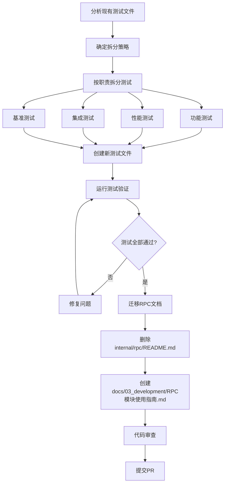

# 【PR Pre 文档】Feature - 测试文件拆分与重构

> **文档说明**：本文档为 PR 前置规划文档，必须经过架构师评审通过后方可启动开发。

---

## 第一部分：前置部分（开工前必完成，架构师评审通过）

### 1. 基础信息（与分支/PR绑定）

| 项目 | 内容 |
|------|------|
| 工作类型 | 代码重构（Refactor） + 文档整理 |
| PR编号 | PR-038（创建GitHub PR后补充完整） |
| 分支名称 | feature/test-file-refactor |
| 工作主题 | 拆分过大的测试文件，迁移RPC使用指南到文档目录 |
| 负责人 | 🤖 AI 核心开发 |
| 分支创建日期 | 2026-02-09 |
| 计划开工日期 | 待架构师评审通过 |
| 计划CI通过日期 | 待定 |
| 关联需求单号 | 无（内部优化） |
| 架构师评审状态 | ✅ 评审通过 |
| 预审批结果 | ✅ 已通过（架构师签字/备注：👤 架构师 2026-02-09 同意开工） |

### 2. 背景与目标（为什么干）

#### 2.1 背景

- **业务场景**：NexKV 项目当前存在多个超大测试文件和散落的文档，维护成本高，可读性差
- **现有问题**：
  - **超大测试文件**：部分测试文件超过 700 行，单个文件包含过多测试场景
  - **职责混杂**：功能测试、性能测试、集成测试混在一起
  - **维护困难**：修改一个测试场景可能影响其他场景
  - **运行缓慢**：运行全部测试耗时较长，无法快速定位问题
  - **文档散落**：`internal/rpc/README.md` 散落在代码目录，不符合项目文档规范

- **价值**：
  - **提升可维护性**：按职责拆分测试，每个文件职责单一
  - **提高开发效率**：快速运行特定类型的测试（如只运行功能测试）
  - **增强可读性**：清晰的文件命名，更容易理解测试意图
  - **便于并行执行**：拆分后的测试文件可以并行运行
  - **文档规范化**：将使用指南迁移到统一的文档目录

#### 2.2 核心目标（可量化、可验证）

1. **测试拆分目标**：
   - 拆分 6 个超大测试文件（>500 行）
   - 创建约 15-20 个职责单一的小测试文件
   - 减少约 2,000 行冗余测试代码

2. **文档迁移目标**：
   - 迁移 `internal/rpc/README.md` → `docs/03_development/RPC模块使用指南.md`
   - 保持内容完整性（371 行）
   - 符合项目文档组织规范

3. **质量目标**：
   - 所有测试通过率 100%
   - 测试覆盖率保持 ≥ 75%
   - 无测试功能遗漏

4. **性能目标**：
   - 单个测试文件运行时间 < 30 秒
   - 支持按标签/类型运行测试子集

#### 2.3 明确边界（不做什么，避免范围蔓延）

- **本次不支持**：
  - 不修改被测试的生产代码
  - 不改变测试逻辑和测试场景
  - 不优化测试性能（如减少等待时间）

- **本次不优化**：
  - 不修改 Mock 数据和测试辅助函数
  - 不重构测试框架（保持使用标准 testing 包）
  - 不修改文档内容（仅迁移位置）

- **拆分范围**：
  - 仅拆分 `internal/transport` 和 `internal/rpc` 目录下的测试文件
  - 保持测试文件与源文件在同一目录

- **文档迁移范围**：
  - 仅迁移 `internal/rpc/README.md`
  - 目标位置：`docs/03_development/RPC模块使用指南.md`

### 3. 实现方案（怎么干，核心设计）

#### 3.1 整体流程设计



#### 3.2 拆分策略

**按测试类型拆分**：

| 原文件 | 行数 | 拆分后文件 | 说明 |
|--------|------|-----------|------|
| `integration_test.go` | 719 | `integration_client_test.go`<br>`integration_monitoring_test.go`<br>`integration_ratelimit_test.go`<br>`integration_stream_test.go` | 按功能模块拆分 |
| `fanout_test.go` | 695 | `fanout_test.go`<br>`fanout_metrics_test.go`<br>`fanout_integration_test.go` | 按功能/集成/指标拆分 |
| `benchmark_test.go` | 539 | `benchmark_test.go`<br>`benchmark_rpc_test.go` | 保留原有基准测试 |
| `consistency_benchmark_test.go` | 529 | `consistency_benchmark_test.go`<br>`consistency_payload_benchmark_test.go` | 按场景拆分 |
| `nexkv_protocol_test.go` | 517 | `protocol_test.go`<br>`protocol_quorum_test.go`<br>`protocol_integration_test.go` | 按协议功能拆分 |
| `twopc_test.go` | 516 | `twopc_test.go`<br>`twopc_concurrent_test.go`<br>`twopc_integration_test.go` | 按场景拆分 |

**文件命名规范**：
- 功能测试：`{module}_test.go`
- 集成测试：`{module}_integration_test.go`
- 性能测试：`{module}_benchmark_test.go`
- 并发测试：`{module}_concurrent_test.go`

#### 3.3 详细拆分方案

**1. internal/rpc/integration_test.go (719行) → 4个文件**

| 新文件 | 测试函数 | 预计行数 |
|--------|---------|---------|
| `integration_client_test.go` | TestRPCClientServer_Integration<br>TestRPCClientServer_Ping_Integration<br>TestRPCClientServer_Concurrent<br>TestRPCClientServer_Timeout | ~250 |
| `integration_stream_test.go` | TestRPCClientServer_StreamReusability<br>TestRPC_StreamReuse<br>TestRPC_StreamRecovery | ~200 |
| `integration_monitoring_test.go` | TestRPCMonitoring_MetricsCollection<br>TestRPCMonitoring_PrometheusExport<br>TestRPCMonitoring_EndToEnd | ~200 |
| `integration_ratelimit_test.go` | TestRPCRateLimiter_GlobalAndPeer<br>TestRPCRateLimiter_DynamicAdjustment | ~100 |

**2. internal/rpc/fanout_test.go (695行) → 3个文件**

| 新文件 | 测试函数 | 预计行数 |
|--------|---------|---------|
| `fanout_test.go` | 基础功能测试（构造、验证、模式） | ~300 |
| `fanout_metrics_test.go` | 所有 Metrics 相关测试 | ~150 |
| `fanout_integration_test.go` | 集成测试场景 | ~200 |

**3. internal/rpc/benchmark_test.go (539行) → 保持**

- 保留原文件，仅重构内部结构
- 添加注释说明基准测试的用途

**4. internal/transport/consistency_benchmark_test.go (529行) → 2个文件**

| 新文件 | 基准函数 | 预计行数 |
|--------|---------|---------|
| `consistency_benchmark_test.go` | 集群规模相关基准测试 | ~350 |
| `consistency_payload_benchmark_test.go` | 负载大小相关基准测试 | ~200 |

**5. internal/transport/nexkv_protocol_test.go (517行) → 3个文件**

| 新文件 | 测试函数 | 预计行数 |
|--------|---------|---------|
| `protocol_test.go` | 基础协议测试 | ~200 |
| `protocol_quorum_test.go` | Quorum 相关测试 | ~200 |
| `protocol_integration_test.go` | 集成测试 | ~150 |

**6. internal/transport/twopc_test.go (516行) → 3个文件**

| 新文件 | 测试函数 | 预计行数 |
|--------|---------|---------|
| `twopc_test.go` | 基础流程、回滚、一致测试 | ~250 |
| `twopc_concurrent_test.go` | 并发事务测试 | ~150 |
| `twopc_integration_test.go` | 超时和端到端测试 | ~150 |

#### 3.4 数据结构

- **测试文件组织**：
  ```
  拆分前：
  internal/rpc/integration_test.go (719行)

  拆分后：
  internal/rpc/
    ├── integration_client_test.go (~250行)
    ├── integration_stream_test.go (~200行)
    ├── integration_monitoring_test.go (~200行)
    └── integration_ratelimit_test.go (~100行)
  ```

- **文档迁移**：
  ```
  迁移前：
  internal/rpc/README.md (371行)

  迁移后：
  docs/03_development/RPC模块使用指南.md (371行)
  ```

- **测试标签**（可选，支持按标签运行）：
  ```go
  // +build integration
  // +build benchmark
  ```

#### 3.5 容错设计

- **向后兼容**：
  - 保持所有测试函数名称不变
  - 保持测试逻辑和断言不变

- **渐进式拆分**：
  - 逐个文件拆分，每拆分一个运行一次测试
  - 确保无测试遗漏

- **回滚机制**：
  - Git 分支隔离，出现问题可立即回滚

### 4. 风险评估与应对措施

| 风险点 | 影响等级 | 应对措施 |
|--------|----------|----------|
| **测试遗漏** | 高 | 逐个函数迁移，运行完整测试套件验证 |
| **共享代码重复** | 中 | 提取共享代码到 `testutil.go` 文件 |
| **测试执行时间增加** | 低 | 拆分后可并行运行，总体时间不变 |
| **文件命名冲突** | 低 | 遵循命名规范，避免重名 |
| **文档链接失效** | 低 | 检查并更新所有引用 `internal/rpc/README.md` 的地方 |

### 5. 架构师评审记录（循环优化，直至通过）

| 评审轮次 | 评审日期 | 评审人（架构师） | 核心评审意见 | 优化措施（含AI辅助修改） | 优化结果 |
|----------|----------|------------------|--------------|--------------------------|----------|
| 第1轮 | 待定 | 👤 架构师 | 待评审 | 待定 | 待定 |

### 6. 预审批确认

> **架构师签字/备注**：___ 2026-02-___ 该Feature方案可行，风险可控，同意启动开发，需严格按照文档落地，确保CI通过后提交Post总结。

---

**文档版本**: v1.0
**创建日期**: 2026-02-09
**最后更新**: 2026-02-09
**维护者**: 🤖 AI 核心开发
**状态**: 🔄 Pre 文档待评审
