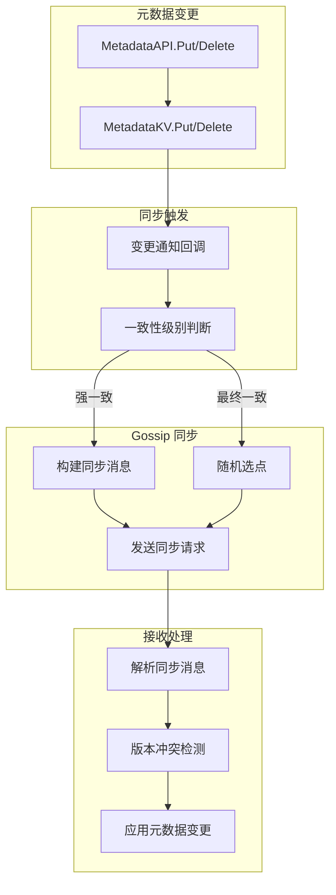

# 【PR全流程文档】Feature - 元数据 Gossip 同步机制集成

> **文档说明**：本文档包含「前置规划」和「后置总结」两部分，记录从需求对齐到开发完成的全流程，一个PR对应一份全流程文档，归档后作为项目追溯依据。

---

## 第一部分：前置部分（开工前必完成，架构师评审通过）

### 1. 基础信息（与分支/PR绑定）

| 项目 | 内容 |
|------|------|
| 工作类型 | 新功能开发（Feature） |
| PR编号 | PR-MetadataGossip（创建GitHub PR后补充完整） |
| 分支名称 | feature/metadata-gossip-sync |
| 工作主题 | 元数据 Gossip 同步机制集成 |
| 负责人 | 🤖 核心开发 A |
| 分支创建日期 | 2026-02-10 |
| 计划开工日期 | 待架构师评审通过 |
| 计划CI通过日期 | 待定 |
| 关联需求单号 | 内部需求：元数据管理系统完善 |
| 架构师评审状态 | ☐ 待评审 ☐ 评审中 ☐ 评审通过 ☐ 需优化（循环记录） |
| 预审批结果 | ☐ 未通过 ☐ 已通过（架构师签字/备注：__________ 2026-__-__ 同意开工） |

### 2. 背景与目标（为什么干）

#### 2.1 背景

**业务场景**：
NexKV 作为分布式 KV 存储系统，需要通过 Gossip 协议在节点间传播元数据变更。当前元数据管理架构（PR-MetadataKV）已实现：
- MetadataKV 核心封装层（命名空间隔离、MVCC 版本控制）
- 6 种强类型元数据结构（ClusterInfo、NodeInfo、RoleInfo 等）
- MetadataAPI 高层接口

但元数据变更后没有自动触发 Gossip 同步，导致集群元数据不一致。

**现有问题**：
1. **元数据孤岛**：节点元数据变更只在本地生效，其他节点无法感知
2. **手动同步**：需要手动触发 Gossip 同步，增加运维复杂度
3. **最终一致延迟**：元数据变更传播延迟不可控
4. **版本冲突**：缺少版本冲突检测机制

**价值**：
- 自动化元数据同步，降低运维复杂度
- 确保集群元数据最终一致性
- 提供版本冲突检测和解决机制
- 为集群管理提供可靠的元数据基础

#### 2.2 核心目标（可量化、可验证）

1. **功能目标**：
   - 元数据变更自动触发 Gossip 同步
   - 支持 9 个命名空间的差异化同步策略
   - 实现版本冲突检测和解决
   - 提供 Gossip 同步状态监控

2. **性能目标**：
   - 元数据变更传播延迟 < 10 秒（P99）
   - Gossip 同步吞吐 > 1000 ops/s
   - 单次同步消息大小 < 1 MB

3. **质量目标**：
   - 单元测试覆盖率 ≥ 85%
   - 集成测试覆盖关键场景
   - Code Review 通过（无 P0/P1 问题）

#### 2.3 明确边界（不做什么，避免范围蔓延）

- **本次不支持**：
  - 不实现新的 Gossip 协议（复用现有机制）
  - 不实现跨数据中心的元数据同步
  - 不实现元数据加密传输

- **本次不优化**：
  - 不优化 Gossip 协议性能（如增量同步、压缩）
  - 不实现复杂的冲突解决策略（使用简单的版本号比较）

### 3. 实现方案（怎么干，核心设计）

#### 3.1 整体架构设计



#### 3.2 关键设计点

**1. 元数据变更回调接口**

```go
// MetadataChangeCallback 元数据变更回调函数
type MetadataChangeCallback func(ns, key string, version uint64, value []byte)

// RegisterChangeCallback 注册变更回调
func (m *MetadataKV) RegisterChangeCallback(cb MetadataChangeCallback) {
    m.changeCallbacks = append(m.changeCallbacks, cb)
}
```

**2. 差异化同步策略**

| 命名空间 | 同步策略 | 触发条件 | 传播范围 |
|---------|---------|---------|---------|
| **NamespaceCluster** | Quorum 确认 | 关键变更 | 全部节点 |
| **NamespaceNode** | Gossip 扩散 | 状态变更 | 随机 3 节点 |
| **NamespaceRole** | Gossip 扩散 | 角色变更 | 随机 3 节点 |
| **NamespaceTopo** | Gossip 扩散 | 拓扑变更 | 随机 3 节点 |
| **NamespaceShard** | Quorum 确认 | 分片变更 | 相关节点 |
| **NamespaceStatic** | Quorum 确认 | 配置变更 | 全部节点 |
| **NamespaceDynamic** | Gossip 扩散 | 动态状态 | 随机 2 节点 |
| **NamespaceOp** | Gossip 扩散 | 操作记录 | 随机 2 节点 |
| **NamespaceVersion** | Quorum 确认 | 版本变更 | 全部节点 |

**3. Gossip 同步消息定义**

```go
// MetadataSyncRequest 元数据同步请求
type MetadataSyncRequest struct {
    // Namespace 命名空间
    Namespace string `msgpack:"namespace"`

    // Key 元数据键
    Key string `msgpack:"key"`

    // Value 元数据值（MessagePack 编码）
    Value []byte `msgpack:"value"`

    // Version MVCC 版本号
    Version uint64 `msgpack:"version"`

    // Timestamp 操作时间戳（HLC）
    Timestamp int64 `msgpack:"timestamp"`

    // ChangeType 变更类型（Put/Delete）
    ChangeType ChangeType `msgpack:"change_type"`
}

// MetadataSyncResponse 元数据同步响应
type MetadataSyncResponse struct {
    // Success 是否成功
    Success bool `msgpack:"success"`

    // Conflict 是否有版本冲突
    Conflict bool `msgpack:"conflict"`

    // CurrentVersion 当前版本号
    CurrentVersion uint64 `msgpack:"current_version"`

    // Error 错误信息
    Error string `msgpack:"error,omitempty"`
}
```

**4. 版本冲突检测**

```go
// ApplyMetadataChange 应用元数据变更（带冲突检测）
func (m *MetadataKV) ApplyMetadataChange(
    ctx context.Context,
    ns, key string,
    value []byte,
    version uint64,
) (*MetadataSyncResponse, error) {
    // 1. 检查现有版本
    existing, err := m.getVersion(ns, key)
    if err == nil && existing > version {
        // 版本冲突
        return &MetadataSyncResponse{
            Success:       false,
            Conflict:      true,
            CurrentVersion: existing,
        }, nil
    }

    // 2. 应用变更
    if value == nil {
        err = m.Delete(ctx, ns, key)
    } else {
        err = m.putRaw(ctx, ns, key, value, version)
    }

    if err != nil {
        return &MetadataSyncResponse{
            Success: false,
            Error:   err.Error(),
        }, nil
    }

    return &MetadataSyncResponse{
        Success: true,
    }, nil
}
```

**5. Gossip 同步触发**

```go
// triggerGossipSync 触发 Gossip 同步
func (tc *TreeCoordinator) triggerGossipSync(
    ns, key string,
    version uint64,
    consistency kvstore.ConsistencyLevel,
) {
    if consistency == kvstore.ConsistencyStrong {
        // 强一致：使用 Quorum 机制
        go tc.quorumSyncMetadata(ns, key, version)
    } else {
        // 最终一致：使用 Gossip 扩散
        go tc.gossipSyncMetadata(ns, key, version)
    }
}

// gossipSyncMetadata Gossip 同步元数据
func (tc *TreeCoordinator) gossipSyncMetadata(
    ns, key string,
    version uint64,
) {
    // 1. 获取元数据值
    var value []byte
    err := tc.metadataKV.GetRaw(context.Background(), ns, key, &value)
    if err != nil {
        return
    }

    // 2. 构建同步消息
    syncReq := &MetadataSyncRequest{
        Namespace:  ns,
        Key:        key,
        Value:      value,
        Version:    version,
        Timestamp:  time.Now().Unix(),
        ChangeType: ChangeTypePut,
    }

    // 3. 随机选择节点
    nodes := tc.selectRandomNodes(3)

    // 4. 发送同步请求
    for _, node := range nodes {
        go tc.sendMetadataSync(node, syncReq)
    }
}
```

#### 3.3 文件结构

```
internal/metadata/
├── kvstore/
│   ├── metadata_kv.go           # 添加变更回调接口
│   └── gossip_sync.go           # 新增：Gossip 同步逻辑
│
├── cluster/
│   ├── tree_coordinator.go      # 集成 Gossip 同步
│   └── gossip_handler.go        # 新增：Gossip 消息处理
│
└── api/
    └── metadata_api.go          # 添加同步状态查询接口
```

#### 3.4 与现有系统集成

**TreeCoordinator 集成点**：

```go
type TreeCoordinator struct {
    // ... 现有字段

    // 新增字段
    metadataKV       *kvstore.MetadataKV
    gossipCallbacks  []GossipCallback
    syncStats        *SyncStats
}

// 初始化时注册变更回调
func NewTreeCoordinator(...) (*TreeCoordinator, error) {
    // ... 现有初始化代码

    // 注册元数据变更回调
    coordinator.metadataKV.RegisterChangeCallback(
        coordinator.triggerGossipSync,
    )

    return coordinator, nil
}
```

### 4. 风险评估与应对措施

| 风险点 | 影响等级 | 应对措施 |
|--------|----------|----------|
| **Gossip 风暴**：大量元数据变更导致消息爆炸 | 高 | 1. 批量变更合并发送<br/>2. 限流控制<br/>3. 优先级队列 |
| **版本冲突频发**：并发变更导致冲突 | 中 | 1. 使用 HLC 时间戳排序<br/>2. 自动冲突解决策略<br/>3. 冲突日志记录 |
| **同步延迟**：Gossip 扩散慢 | 中 | 1. 增加随机节点数<br/>2. 定期全量同步<br/>3. 监控延迟指标 |
| **内存开销**：缓存同步消息 | 低 | 1. 限制缓存大小<br/>2. LRU 淘汰策略<br/>3. 监控内存使用 |
| **测试覆盖不足**：复杂同步逻辑难测试 | 中 | 1. Mock Gossip 节点<br/>2. 混沌测试<br/>3. 边界条件测试 |

### 5. 架构师评审记录（循环优化，直至通过）

| 评审轮次 | 评审日期 | 评审人（架构师） | 核心评审意见 | 优化措施（含AI辅助修改） | 优化结果 |
|----------|----------|------------------|--------------|--------------------------|----------|
| 第1轮 | 待定 | 👤 架构师 | 待评审 | 待补充 | ☐ 待评审 |

### 6. 预审批确认
> **架构师签字/备注**：__________ 2026-__-__ 该Feature方案可行，风险可控，同意启动开发，需严格按照文档落地，确保CI通过后提交Post总结。

---

## 第二部分：流程节点记录（开发/CI过程追溯）

### 1. 开发过程记录

| 节点 | 完成日期 | 具体内容 | 交付物 |
|------|----------|----------|--------|
| 启动开发 | 待定 | 待架构师评审通过 | 代码提交至分支 |
| 本地测试 | 待定 | 单元测试、集成测试 | 测试报告/覆盖率数据 |
| Post文档编写 | 待定 | 编写后置总结文档 | 第三部分：后置部分 |
| 架构师Post批准 | 待定 | 架构师评审Post文档 | 批准签字/备注 |
| 提交GitHub | 待定 | 推送分支，创建PR | GitHub PR链接 |

### 2. CI流程记录（修复Bug直至通过）

| CI轮次 | 触发时间 | 结果 | 问题详情 | 修复措施 | 修复结果 |
|--------|----------|------|----------|----------|----------|
| 第1轮 | 待定 | 失败/成功 | 待执行 | 待修复 | 待确认 |

### 3. 合并记录

| 合并时间 | 合并方式 | 审批人 | 备注 |
|----------|----------|--------|------|
| 待定 | Squash Merge / Merge Commit | [架构师] | 待补充 |

---

## 第三部分：后置部分（CI通过后编写，总结/成果/ToDo）

### 1. 核心成果总结（开发了啥，结果怎样）

#### 1.1 功能成果
- **已完成**：待开发完成后填写
- **与Pre文档差异**：待开发完成后填写

#### 1.2 性能/数据成果
- **性能数据**：待测试完成后填写
- **测试成果**：待测试完成后填写

#### 1.3 代码/文档交付物

| 类型 | 具体内容 | 链接/路径 |
|------|----------|-----------|
| 代码变更 | 待填写 | GitHub PR链接 |
| 文档更新 | 待填写 | 文档路径 |

### 2. 未完成项与ToDo清单（有哪些没干，后续规划）

#### 2.1 本次PR未完成项
- **未支持**：待开发完成后填写
- **遗留问题**：待开发完成后填写

#### 2.2 ToDo清单（优先级排序）

| 优先级 | 任务内容 | 预估工期 | 关联PR/需求 | 备注 |
|--------|----------|----------|-------------|------|
| 待定 | 待填写 | 待定 | 待定 | 待补充 |

### 3. 下一步工作建议（建议干啥）
1. **优先推进**：待开发完成后填写
2. **监控要点**：待开发完成后填写
3. **运维补充**：待开发完成后填写
4. **后续规划**：待开发完成后填写
5. **反馈收集**：待开发完成后填写

---

## 文档归档信息

| 项目 | 内容 |
|------|------|
| 文档最终版本 | v1.0（Pre）/ v2.0（Post） |
| 归档日期 | 待定 |
| 归档路径 | `docs/06_project_management/pr_documents/feature/2026-02-10_PR-MetadataGossip_元数据Gossip同步_全流程.md` |
| 后续维护人 | 🤖 核心开发 A |

---

**文档版本**: v1.0 (Pre 文档)
**创建日期**: 2026-02-10
**最后更新**: 2026-02-10
**维护者**: NexKV 开发团队
**状态**: 🔄 待架构师评审
