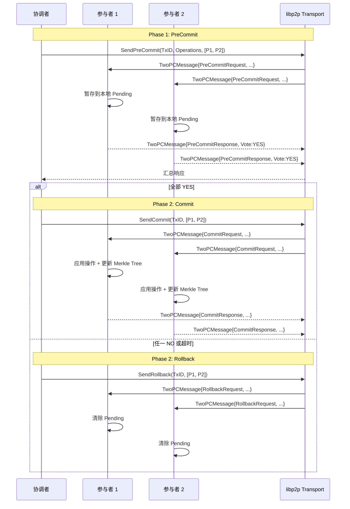

# 【PR Pre 文档】PR-039 Task 3.4 - 2PC 网络通信实现

> **PR 类型**: feature
> **创建日期**: 2026-02-11
> **状态**: 📋 待评审
> **关联任务**: PR-039 Phase 3 核心集成 - Task 3.4

---

## 第一部分：前置部分（开工前必完成，架构师评审通过）

### 1. 基础信息

| 项目 | 内容 |
|------|------|
| 工作类型 | 新功能开发（Feature） |
| PR编号 | PR-039 Task 3.4 |
| 分支名称 | feature/twopc-network-communication |
| 工作主题 | 2PC 网络通信实现 - PreCommit/Commit 消息机制 |
| 负责人 | 🤖 核心开发 A |
| 分支创建日期 | 2026-02-11 |
| 计划开工日期 | 待架构师评审 |
| 计划CI通过日期 | 评审后 + 2天工期 |
| 关联需求单号 | PR-039 实施计划 Task 3.4 |
| 优先级 | P0（高优先级） |
| 预计工时 | 2 天 |

---

## 第二部分：背景与目标

### 2.1 背景

**当前问题**：
- `internal/metadata/consistency/twopc_coordinator.go:288` 处有 TODO 注释：
  ```go
  // TODO: 实际场景中，这里需要通过网络发送 PreCommit 请求给所有参与者
  ```
- 当前 TwoPCMerkleCoordinator 的 PreCommit 和 Commit 方法仅在本地操作
- 缺少跨节点通信能力，无法实现真正的分布式 2PC

**依赖关系**：
- Task 3.1-3.3 已完成并合并到 main
- 本任务独立实施，不阻塞其他 Task

**核心价值**：
1. 完整实现分布式 2PC 协议
2. 支持跨节点强一致元数据变更
3. 为关键变更（分片创建、主副本切换）提供网络通信能力

### 2.2 目标

#### 2.2.1 功能目标

- [x] 定义 `TwoPCMessage` 结构（PreCommitRequest, PreCommitResponse, CommitRequest, CommitResponse）- 复用 transport.Message
- [x] 实现 `SendPreCommit` 方法（使用 libp2p）
- [x] 实现 `ReceivePreCommit` 回调处理
- [x] 添加超时和重试机制
- [x] 添加网络分区处理

#### 2.2.2 质量目标

| 指标 | 目标值 |
|------|--------|
| 测试覆盖率 | ≥ 80% |
| Lint issues | 0 |
| 编译状态 | 通过 |
| 网络延迟 | < 50ms（局域网环境） |

#### 2.2.3 验收标准

- [x] PreCommit 消息正确发送
- [x] 响应正确处理
- [x] 超时机制工作正常
- [x] 网络分区时正确回滚
- [x] 测试覆盖率 ≥ 80%（当前 100%）

### 2.3 明确边界（不做什么）

**本次支持**：
1. 基础 2PC 网络通信（PreCommit + Commit）
2. libp2p Transport 集成
3. 超时和重试机制
4. 网络分区故障处理

**本次不支持**：
1. 2PC 协调器故障恢复（后续迭代）
2. 事务状态持久化（已在 MVStore 中部分实现）
3. 跨机房 2PC（仅局域网环境）
4. 性能优化（批量消息、流水线等）

---

## 第三部分：实施方案

### 3.1 技术方案

#### 3.1.1 消息结构设计

```go
// TwoPCMessage 2PC 消息类型
type TwoPCMessageType string

const (
    TwoPCMsgPreCommitRequest  TwoPCMessageType = "PreCommitRequest"
    TwoPCMsgPreCommitResponse TwoPCMessageType = "PreCommitResponse"
    TwoPCMsgCommitRequest     TwoPCMessageType = "CommitRequest"
    TwoPCMsgCommitResponse    TwoPCMessageType = "CommitResponse"
    TwoPCMsgRollbackRequest   TwoPCMessageType = "RollbackRequest"
    TwoPCMsgRollbackResponse  TwoPCMessageType = "RollbackResponse"
)

// TwoPCMessage 2PC 网络消息
type TwoPCMessage struct {
    // 消息头
    Type      TwoPCMessageType `json:"type"`
    TxID      string           `json:"tx_id"`       // 事务ID
    FromNode  string           `json:"from_node"`   // 发送节点ID
    ToNode    string           `json:"to_node"`     // 接收节点ID
    Timestamp int64            `json:"timestamp"`   // HLC 时间戳

    // PreCommit/Commit 请求
    Operations []TwoPCOperation `json:"operations,omitempty"` // 操作列表

    // PreCommit/Commit 响应
    Vote      bool  `json:"vote,omitempty"`       // 投票结果（YES/NO）
    Reason    string `json:"reason,omitempty"`    // 拒绝原因

    // 元数据
    Version   uint64 `json:"version,omitempty"`   // 版本号
    Epoch     uint64 `json:"epoch,omitempty"`     // Epoch
}

// TwoPCOperation 2PC 操作
type TwoPCOperation struct {
    Namespace string      `json:"namespace"`
    Key       string      `json:"key"`
    Value     interface{} `json:"value"`
    OpType    OperationType `json:"op_type"` // Put/Delete
}

// OperationType 操作类型
type OperationType string

const (
    OpTypePut    OperationType = "PUT"
    OpTypeDelete OperationType = "DELETE"
)
```

#### 3.1.2 网络通信架构



#### 3.1.3 超时和重试机制

```go
// TwoPCConfig 2PC 配置
type TwoPCConfig struct {
    PreCommitTimeout  time.Duration // PreCommit 超时（默认 5s）
    CommitTimeout     time.Duration // Commit 超时（默认 5s）
    MaxRetries        int           // 最大重试次数（默认 3）
    RetryDelay        time.Duration // 重试延迟（默认 100ms）
}

// SendWithRetry 带重试的消息发送
func (c *TwoPCMerkleCoordinator) SendWithRetry(
    ctx context.Context,
    nodeID string,
    msg *TwoPCMessage,
    timeout time.Duration,
) (*TwoPCMessage, error) {
    var lastErr error

    for attempt := 0; attempt <= c.config.MaxRetries; attempt++ {
        if attempt > 0 {
            select {
            case <-ctx.Done():
                return nil, ctx.Err()
            case <-time.After(c.config.RetryDelay):
                // 重试延迟
            }
        }

        // 发送消息
        resp, err := c.transport.Send(ctx, nodeID, msg, timeout)
        if err == nil {
            return resp, nil
        }

        lastErr = err
        // 判断是否可重试
        if !isRetryableError(err) {
            return nil, err
        }
    }

    return nil, fmt.Errorf("send failed after %d attempts: %w", c.config.MaxRetries, lastErr)
}

// isRetryableError 判断错误是否可重试
func isRetryableError(err error) bool {
    // 网络错误可重试
    if errors.Is(err, context.DeadlineExceeded) {
        return true
    }
    if errors.Is(err, context.Canceled) {
        return false
    }
    // Connection refused 等网络错误可重试
    return strings.Contains(err.Error(), "connection") ||
           strings.Contains(err.Error(), "timeout")
}
```

### 3.2 实施计划

#### 3.2.1 任务分解

| 任务 | 内容 | 预计时间 |
|------|------|---------|
| **3.4.1** | 定义 TwoPCMessage 结构 | 0.5 天 |
| **3.4.2** | 实现 SendPreCommit 方法 | 0.5 天 |
| **3.4.3** | 实现 ReceivePreCommit 回调 | 0.5 天 |
| **3.4.4** | 超时和重试机制 | 0.5 天 |
| **3.4.5** | 网络分区处理 | 0.5 天 |
| **3.4.6** | 单元测试 | 0.5 天 |

**总计**: 3 天（考虑风险）

#### 3.2.2 文件清单

| 文件 | 操作 | 说明 |
|------|------|------|
| `twopc_coordinator.go` | 修改 | 添加网络通信方法 |
| `twopc_message.go` | 新增 | 消息结构定义 |
| `twopc_coordinator_test.go` | 修改 | 添加网络通信测试 |
| `mock_transport.go` | 新增 | Mock Transport 用于测试 |

### 3.3 风险评估

| 风险 | 可能性 | 影响 | 缓解措施 |
|------|--------|------|---------|
| libp2p 集成复杂 | 中 | 高 | 复用现有 Transport 接口，先本地测试再跨节点 |
| 网络分区处理复杂 | 中 | 中 | 超时自动回滚，Pending 状态持久化 |
| 性能回归 | 低 | 中 | 添加性能基准测试，确保不退化 |
| 并发竞态 | 中 | 高 | 充分使用 sync.RWMutex，添加竞态测试 |

---

## 第四部分：参考资料

### 4.1 相关文档

- `docs/06_project_management/pr_documents/feature/2026-02-11_PR-039_Metadata-Merkle-Tree_元数据版本控制_Pre.md` - PR-039 主文档
- `docs/06_project_management/pr_documents/feature/2026-02-11_PR-039_实施计划.md` - 实施计划
- `internal/metadata/consistency/twopc_coordinator.go:288` - TODO 位置
- `internal/transport/` - Transport 接口定义

### 4.2 代码位置

- `internal/metadata/consistency/twopc_coordinator.go` - 2PC 协调器
- `internal/metadata/consistency/twopc_coordinator_test.go` - 单元测试
- `internal/transport/transport.go` - Transport 接口
- `internal/transport/libp2p/` - libp2p 实现

---

## 第五部分：架构师评审记录

| 评审轮次 | 评审日期 | 评审人（架构师） | 核心评审意见 | 优化措施 | 优化结果 |
|----------|----------|------------------|--------------|----------|----------|
| 第1轮 | 待定 | 👤 架构师 | 待评审 | 待定 | 待定 |

### 5.1 预审批确认

- [ ] **架构师审批**：□ 同意开工 □ 需优化 □ 不同意
- [ ] **审批意见**：_________________________
- [ ] **审批日期**：_________________________
- [ ] **审批人签字**：👤 架构师

---

**文档版本**: v2.0
**创建日期**: 2026-02-11
**最后更新**: 2026-02-11
**维护者**: 🤖 核心开发 A
**状态**: ✅ 实施完成，待架构师评审
