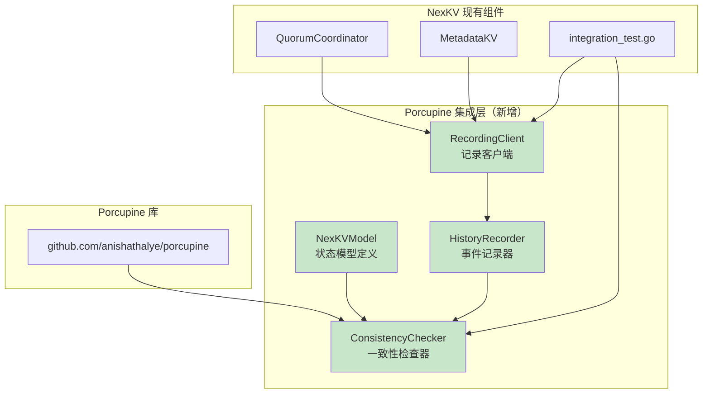
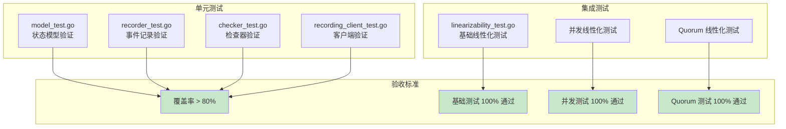

# 【PR全流程文档】Feature - Porcupine 线性一致性验证集成

> **文档说明**：本文档包含「前置规划」和「后置总结」两部分，记录从需求对齐到开发完成的全流程，一个PR对应一份全流程文档，归档后作为项目追溯依据。

---

## 第一部分：前置部分（开工前必完成，架构师评审通过）

### 1. 基础信息（与分支/PR绑定）

| 项目 | 内容 |
|------|------|
| 工作类型 | 新功能开发（Feature） |
| PR编号 | PR-063（创建GitHub PR后补充完整） |
| 分支名称 | feature/porcupine-linearizability-verification |
| 工作主题 | Porcupine 线性一致性验证框架集成 |
| 负责人 | 🤖 核心开发 A |
| 分支创建日期 | 2026-02-13 |
| 计划开工日期 | 2026-02-14 |
| 计划CI通过日期 | 2026-02-25 |
| 关联需求单号 | Layer 1 元数据一致性层验证 |
| 架构师评审状态 | ☑ 评审中 |
| 预审批结果 | □ 未通过 |

### 2. 背景与目标（为什么干）

#### 2.1 背景

**业务场景**：
NexKV 作为分布式键值存储系统，提供三种一致性保证：
- **Gossip 协议**：最终一致性，用于普通元数据同步
- **Quorum 机制**：强一致性，用于重要元数据变更
- **2PC 协议**：事务原子性，用于跨分片事务

这些一致性协议的正确性至关重要，任何违反一致性的行为都可能导致：
- 数据丢失或损坏
- 配置不一致
- 系统状态混乱

**现有问题**：
- ❌ **缺乏数学级别的一致性验证**：现有测试只能验证功能正确性，无法证明一致性
- ❌ **并发问题难以复现**：竞态条件、时序问题在本地测试中难以发现
- ❌ **故障场景验证不完整**：节点故障、网络分区等场景的一致性缺乏系统性验证
- ❌ **缺乏可视化调试手段**：一致性违规时难以定位根因

**价值**：
- ✅ **数学证明级别验证**：Porcupine 提供线性一致性证明
- ✅ **工业级验证方案**：etcd、TiDB、MemoryDB 都在使用 Porcupine
- ✅ **可视化报告**：失败时生成交互式 HTML 报告，快速定位问题
- ✅ **CI 自动化验证**：集成到 CI 流程，每次提交自动验证一致性

#### 2.2 核心目标（可量化、可验证）

1. **功能目标**：
   - 实现 NexKV 状态模型（NexKVModel），支持 Put/Get/Delete/Quorum/2PC 操作
   - 实现历史记录器（HistoryRecorder），记录所有操作的 Call/Return 事件
   - 实现一致性检查器（ConsistencyChecker），调用 Porcupine 进行验证
   - 实现记录客户端（RecordingClient），包装现有 MetadataKV 和 QuorumCoordinator
   - 集成到现有集成测试框架

2. **性能目标**：
   - 1000 操作历史检查时间 < 100ms
   - 10000 操作历史检查时间 < 1s
   - 内存占用增量 < 50MB

3. **测试目标**：
   - 基础线性化测试 100% 通过
   - 并发线性化测试 100% 通过
   - Quorum 线性化测试 100% 通过
   - 测试覆盖率 > 80%

   > **说明**：线性一致性验证是全有或全无的（binary），如果测试失败，必须定位并修复问题，不接受部分通过。

#### 2.3 明确边界（不做什么，避免范围蔓延）

**本次支持**：
- ✅ NexKV 基础操作（Put/Get/Delete）的线性化验证
- ✅ Quorum 写入操作的线性化验证
- ✅ 并发操作的线性化验证
- ✅ 可视化报告生成

**本次不支持**：
- ❌ 2PC 跨分片事务的完整验证（作为后续 PR）
- ❌ Gossip 协议的线性化验证（Gossip 是最终一致，不满足线性化）
- ❌ 真实网络环境的 E2E 测试（需要 E2E 框架支持）
- ❌ 故障注入测试（作为后续 PR）

**本次不优化**：
- ❌ 现有一致性协议的实现
- ❌ 测试框架的架构调整

### 3. 实现方案（怎么干，核心设计）

#### 3.1 整体流程设计



#### 3.2 关键设计点

##### 3.2.1 时间戳精度保证（P0-2）

**问题背景**：
- ARM 架构时间戳可能不稳定
- 并发操作时间戳可能重叠
- 多节点时钟不同步

**解决方案 1：单机单调时间戳**

```go
// MonotonicTimestamp 单调时间戳生成器
// 使用原子操作确保时间戳单调递增，解决时间戳回退问题
type MonotonicTimestamp struct {
    last int64
}

// NewMonotonicTimestamp 创建单调时间戳生成器
func NewMonotonicTimestamp() *MonotonicTimestamp {
    return &MonotonicTimestamp{
        last: time.Now().UnixNano(),
    }
}

// Now 获取单调递增的时间戳
func (t *MonotonicTimestamp) Now() int64 {
    for {
        last := atomic.LoadInt64(&t.last)
        now := time.Now().UnixNano()
        // 确保时间戳单调递增
        if now <= last {
            now = last + 1
        }
        if atomic.CompareAndSwapInt64(&t.last, last, now) {
            return now
        }
    }
}
```

**解决方案 2：多节点逻辑时间戳**

```go
// LogicalTimestamp 逻辑时间戳
// 避免跨机器时钟同步问题
type LogicalTimestamp struct {
    clientID int
    seq      int64
}

// Now 生成逻辑时间戳
// 格式: (clientID << 48) | localSeq
func (t *LogicalTimestamp) Now() int64 {
    newSeq := atomic.AddInt64(&t.seq, 1)
    return int64(t.clientID)<<48 | newSeq
}
```

**时间戳单元测试**：

```go
func TestMonotonicTimestamp_NeverDecreases(t *testing.T) {
    ts := NewMonotonicTimestamp()
    last := ts.Now()
    for i := 0; i < 100000; i++ {
        now := ts.Now()
        require.True(t, now > last, "Timestamp must be monotonically increasing")
        last = now
    }
}

func TestLogicalTimestamp_ClientIsolation(t *testing.T) {
    ts1 := NewLogicalTimestamp(1)
    ts2 := NewLogicalTimestamp(2)

    // 不同客户端的时间戳不会冲突
    ts1_val := ts1.Now()
    ts2_val := ts2.Now()
    require.NotEqual(t, ts1_val, ts2_val)
}
```

##### 3.2.2 目录结构

```
internal/metadata/consistency/
├── porcupine/                    # 新增 Porcupine 集成目录
│   ├── model.go                 # NexKV 状态模型定义
│   ├── model_test.go            # 模型单元测试
│   ├── recorder.go              # 历史记录器
│   ├── recorder_test.go         # 记录器单元测试
│   ├── checker.go               # 一致性检查器
│   ├── checker_test.go          # 检查器单元测试
│   ├── recording_client.go      # 记录客户端包装器
│   ├── recording_client_test.go # 客户端单元测试
│   └── README.md                # 模块说明文档
├── twopc_coordinator.go         # 现有 2PC 协调器（不变）
├── integration_test.go          # 现有集成测试（不变）
└── linearizability_test.go      # 新增线性化测试
```

##### 3.2.2 状态模型定义

```go
// NexKVInput 输入类型
type NexKVInput struct {
    Op        OpType // 操作类型
    Namespace string // 命名空间
    Key       string // 键
    Value     []byte // 值
}

// NexKVOutput 输出类型
type NexKVOutput struct {
    Ok      bool   // 操作是否成功
    Value   []byte // 读取的值
    Error   string // 错误信息
}

// NexKVModel 顺序规范模型
var NexKVModel = porcupine.Model{
    Init: func() interface{} {
        return make(map[string][]byte) // 初始状态：空 KV
    },
    Step: func(state, input, output interface{}) (bool, interface{}) {
        // 状态转移逻辑
        // Put: 更新状态
        // Get: 验证返回值
        // Delete: 删除 key
    },
}
```

##### 3.2.3 历史记录器

```go
// HistoryRecorder 历史记录器
type HistoryRecorder struct {
    mu       sync.Mutex
    events   []porcupine.Event
    opID     int64 // 原子操作 ID
    clientID int
}

// RecordCall 记录操作调用
func (r *HistoryRecorder) RecordCall(op OpType, ns, key string, value []byte) int

// RecordReturn 记录操作返回
func (r *HistoryRecorder) RecordReturn(opID int, ok bool, value []byte, errMsg string)
```

##### 3.2.4 一致性检查器

```go
// ConsistencyChecker 一致性检查器
type ConsistencyChecker struct {
    model     porcupine.Model
    timeout   time.Duration
    reportDir string
}

// Check 执行一致性检查
func (c *ConsistencyChecker) Check(events []porcupine.Event) *CheckResult {
    result, info := porcupine.CheckEventsVerbose(c.model, events, c.timeout)

    if result != porcupine.Ok {
        // 生成可视化报告
        html := porcupine.Visualize(c.model, info, 0)
        // 保存到文件
    }

    return &CheckResult{...}
}
```

#### 3.3 测试策略



#### 3.4 依赖变更

```go
// go.mod 新增依赖
require (
    github.com/anishathalye/porcupine v0.1.4
)
```

### 4. 风险评估与应对措施

| 风险点 | 影响等级 | 概率 | 应对措施 |
|--------|----------|------|----------|
| **时间戳精度问题** | 高 | 中 | 实现单调时间戳生成器，使用原子操作确保递增（见 3.2.1） |
| **多节点时钟不同步** | 高 | 高 | 使用逻辑时间戳，为每个 client 分配独立 ID，避免跨机器时钟依赖 |
| **大规模历史检查慢** | 中 | 高 | 使用 P-compositionality 分区检查，限制单次操作数 |
| **并发记录竞争** | 高 | 低 | 使用 sync.Mutex 保护事件列表，原子操作生成 ID |
| **内存占用增长** | 中 | 中 | 实现增量检查模式（见下方代码），定期清理历史 |
| **模型定义错误导致误报** | 高 | 中 | 添加模型正确性验证测试，覆盖所有状态转移 |
| **Porcupine API 变更** | 低 | 低 | 锁定 Porcupine 版本 v0.1.4 |
| **与现有测试冲突** | 低 | 中 | 使用独立的测试文件，不影响现有测试 |

**增量检查模式（P1-1）**：

```go
// IncrementalChecker 增量检查器
// 定期清理历史，避免内存无限增长
type IncrementalChecker struct {
    checker     *ConsistencyChecker
    maxHistory  int           // 最大历史长度（默认 1000）
    eventBuffer []porcupine.Event
}

// RecordAndCheck 记录事件并定期检查
func (ic *IncrementalChecker) RecordAndCheck(event porcupine.Event) *CheckResult {
    ic.eventBuffer = append(ic.eventBuffer, event)

    // 达到阈值时执行检查并清空缓冲
    if len(ic.eventBuffer) >= ic.maxHistory {
        result := ic.checker.Check(ic.eventBuffer)
        ic.eventBuffer = ic.eventBuffer[:0] // 清空缓冲
        return result
    }
    return nil
}
```

### 5. 实施计划

| 里程碑 | 日期 | 任务 | 交付物 | 验收标准 | 依赖 |
|--------|------|------|--------|---------|------|
| **M1: 基础设施** | Day 1-2 | 基础设施搭建 | 目录结构 + 依赖 + timestamp.go | `go mod tidy` 成功，`TestMonotonicTimestamp` 通过 | - |
| **M2: 核心组件** | Day 3-5 | 核心组件实现 | model.go + recorder.go + checker.go + recording_client.go | 单元测试 100% 通过，覆盖率 >80% | M1 |
| **M3: 集成验证** | Day 6-7 | 验证集成测试框架兼容性 | 更新 recording_client.go | `RecordingClient` 可注入 `E2ETestScenario` | M2 |
| **M4: 测试用例** | Day 8-10 | 线性化测试编写 | linearizability_test.go | 基础测试 100% 通过，并发测试 100% 通过，Quorum 测试 100% 通过 | M3 |
| **M5: CI 集成** | Day 11-12 | CI 配置与文档 | CI 配置 + 文档完善 | CI 测试通过 | M4 |

**工期调整说明**：根据架构师建议，工期从 10 天调整为 **12 天**，额外 2 天用于时间戳验证和集成测试框架兼容性验证。

### 6. 架构师评审记录（循环优化，直至通过）

| 评审轮次 | 评审日期 | 评审人（架构师） | 核心评审意见 | 优化措施 | 优化结果 |
|----------|----------|------------------|--------------|----------|----------|
| 第1轮 | 2026-02-13 | 👤 架构师 | 1. 测试通过率目标不一致（95% vs 100%）<br/>2. 缺少时间戳精度解决方案<br/>3. 缺少多节点时钟同步风险<br/>4. 里程碑不够清晰<br/>5. 增量检查缺少具体方案 | 1. 修改为 100% 通过 ✅<br/>2. 添加 3.2.1 时间戳精度保证 ✅<br/>3. 添加风险和应对措施 ✅<br/>4. 优化里程碑定义，添加验收标准 ✅<br/>5. 补充增量检查代码示例 ✅ | 待第2轮评审确认 |

### 7. 预审批确认

> **架构师签字/备注**：[待架构师评审通过后填写]

---

## 第二部分：流程节点记录（开发/CI过程追溯）

### 1. 开发过程记录

| 节点 | 完成日期 | 具体内容 | 交付物 |
|------|----------|----------|--------|
| 启动开发 | - | - | - |
| 本地测试 | - | - | - |
| Post文档编写 | - | - | - |
| 架构师Post批准 | - | - | - |
| 提交GitHub | - | - | - |

### 2. CI流程记录（修复Bug直至通过）

| CI轮次 | 触发时间 | 结果 | 问题详情 | 修复措施 | 修复结果 |
|--------|----------|------|----------|----------|----------|
| 第1轮 | - | - | - | - | - |

### 3. 合并记录

| 合并时间 | 合并方式 | 审批人 | 备注 |
|----------|----------|--------|------|
| - | - | - | - |

---

## 第三部分：后置部分（CI通过后编写，总结/成果/ToDo）

### 1. 核心成果总结

*（CI通过后填写）*

### 2. 未完成项与ToDo清单

*（CI通过后填写）*

### 3. 下一步工作建议

*（CI通过后填写）*

---

## 文档归档信息

| 项目 | 内容 |
|------|------|
| 文档版本 | V1.1-Pre（根据第1轮评审修改） |
| 创建日期 | 2026-02-13 |
| 最后更新 | 2026-02-13 |
| 归档路径 | `docs/06_PM/feature/2026-02-13_PR-063_Porcupine-Linearizability-Verification_Pre.md` |
| 后续维护人 | 🤖 核心开发 A |
